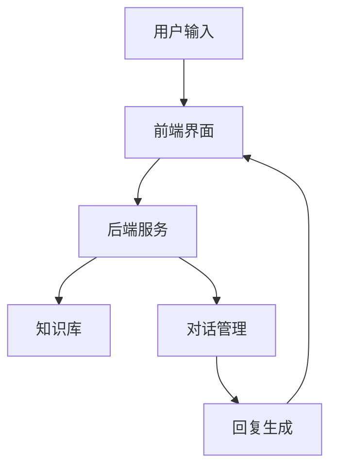

                 

关键词：聊天机器人、手工艺、创意项目、人工智能、自然语言处理

> 摘要：本文旨在探讨聊天机器人的设计与开发，结合手工艺的理念，为读者提供一些建议和指导。通过创意项目，我们将深入挖掘聊天机器人的潜力，探索其在不同场景中的应用，并分享一些实用的工具和资源。

## 1. 背景介绍

随着人工智能技术的迅猛发展，聊天机器人已成为各大公司和企业的重要应用。它们在客服、营销、教育、医疗等多个领域发挥着重要作用，提供便捷的交互体验。然而，传统聊天机器人在用户体验和智能化程度上仍存在一定的局限性。为了提升聊天机器人的质量和影响力，本文提出了结合手工艺理念的创意项目开发方法。

手工艺，作为一种传统技艺，强调匠心独运、精益求精。将手工艺的理念引入到聊天机器人开发中，意味着我们要注重细节、追求卓越，打造具有高度智能化和个性化的聊天机器人。这种创意项目不仅有助于提升聊天机器人的用户体验，还能为开发者提供新的思考和灵感。

## 2. 核心概念与联系

### 2.1 聊天机器人架构

聊天机器人的架构通常包括以下关键组件：

- **前端界面**：负责展示聊天界面，接收用户输入，并显示聊天机器人的回复。
- **后端服务**：处理用户输入，执行自然语言处理（NLP）任务，调用业务逻辑，生成回复。
- **知识库**：存储聊天机器人所需的知识和事实，用于回答问题和提供信息。
- **对话管理**：管理对话流程，根据上下文信息生成合适的回复。

以下是聊天机器人架构的 Mermaid 流程图：



### 2.2 手工艺理念在聊天机器人开发中的应用

手工艺理念在聊天机器人开发中的应用主要体现在以下几个方面：

- **用户体验设计**：注重细节，提升用户满意度。
- **知识库构建**：精细化分类，确保聊天机器人能够准确回答问题。
- **对话管理**：关注上下文信息，打造自然流畅的对话体验。
- **个性化定制**：根据用户特点和需求，提供个性化的服务。

## 3. 核心算法原理 & 具体操作步骤

### 3.1 算法原理概述

聊天机器人的核心算法主要包括自然语言处理（NLP）、对话管理和回复生成。以下是这些算法的基本原理：

- **自然语言处理（NLP）**：将自然语言转换为计算机可处理的格式，包括分词、词性标注、命名实体识别等。
- **对话管理**：根据对话历史和上下文信息，选择合适的对话策略和回复。
- **回复生成**：利用预定义的模板、规则或生成式模型生成回复。

### 3.2 算法步骤详解

#### 3.2.1 自然语言处理（NLP）

1. **分词**：将输入文本分割成词语。
2. **词性标注**：为每个词语标注词性。
3. **命名实体识别**：识别文本中的命名实体，如人名、地名、组织名等。
4. **句法分析**：分析句子的结构，提取句法信息。

#### 3.2.2 对话管理

1. **状态初始化**：根据用户输入，初始化对话状态。
2. **上下文信息提取**：从对话历史中提取相关上下文信息。
3. **策略选择**：根据上下文信息，选择合适的对话策略。
4. **回复生成**：利用对话策略生成回复。

#### 3.2.3 回复生成

1. **模板匹配**：从预定义的模板库中匹配合适的模板。
2. **规则匹配**：根据预设的规则生成回复。
3. **生成式模型**：利用生成式模型（如序列到序列模型、变分自编码器等）生成回复。

### 3.3 算法优缺点

#### 3.3.1 自然语言处理（NLP）

**优点**：能够处理自然语言，实现人机交互。

**缺点**：对语言理解能力要求较高，容易出现歧义。

#### 3.3.2 对话管理

**优点**：能够根据上下文信息生成自然流畅的对话。

**缺点**：对对话历史依赖较大，难以处理长对话。

#### 3.3.3 回复生成

**优点**：生成回复速度快，实现简单。

**缺点**：回复质量取决于模板和规则设计，可能不够自然。

### 3.4 算法应用领域

聊天机器人算法在多个领域有广泛应用，如：

- **客服**：提供快速、准确的客服支持。
- **营销**：进行个性化推荐和用户互动。
- **教育**：为学生提供个性化辅导和课程推荐。
- **医疗**：辅助医生进行诊断和治疗建议。

## 4. 数学模型和公式 & 详细讲解 & 举例说明

### 4.1 数学模型构建

聊天机器人的核心算法涉及多种数学模型，如：

- **朴素贝叶斯分类器**：用于分类问题，如词性标注和命名实体识别。
- **循环神经网络（RNN）**：用于序列数据处理，如自然语言处理。
- **序列到序列模型（Seq2Seq）**：用于生成式任务，如回复生成。

以下是这些模型的简要介绍和公式：

#### 4.1.1 朴素贝叶斯分类器

$$P(C_k|X) = \frac{P(X|C_k)P(C_k)}{P(X)}$$

其中，$C_k$ 表示第 $k$ 类别，$X$ 表示特征向量，$P(X|C_k)$ 表示特征向量在类别 $C_k$ 下出现的概率，$P(C_k)$ 表示类别 $C_k$ 的先验概率，$P(X)$ 表示特征向量的总概率。

#### 4.1.2 循环神经网络（RNN）

$$h_t = \sigma(W_h \cdot [h_{t-1}, x_t] + b_h)$$

其中，$h_t$ 表示当前时刻的隐藏状态，$x_t$ 表示输入特征，$\sigma$ 表示激活函数，$W_h$ 和 $b_h$ 分别为权重和偏置。

#### 4.1.3 序列到序列模型（Seq2Seq）

$$y_t = \sigma(W_y \cdot \text{softmax}(V \cdot h_t) + b_y)$$

其中，$y_t$ 表示生成序列的当前时刻输出，$h_t$ 表示编码器的隐藏状态，$V$ 和 $W_y$ 分别为解码器权重，$b_y$ 为偏置。

### 4.2 公式推导过程

以下是朴素贝叶斯分类器和循环神经网络的推导过程：

#### 4.2.1 朴素贝叶斯分类器

首先，我们假设特征向量 $X$ 和类别 $C_k$ 独立，则有：

$$P(X|C_k) = \prod_{i=1}^n P(x_i|C_k)$$

其中，$x_i$ 表示特征向量中的第 $i$ 个元素。

接下来，我们计算 $P(X)$，即特征向量的总概率：

$$P(X) = \sum_{k=1}^K P(X|C_k)P(C_k)$$

由于类别 $C_k$ 的先验概率 $P(C_k)$ 是已知的，我们只需要计算 $P(X|C_k)$。

#### 4.2.2 循环神经网络（RNN）

循环神经网络（RNN）的推导基于反向传播算法。首先，我们定义损失函数：

$$J = -\sum_{t=1}^T \sum_{k=1}^K y_k^t \log(p_k^t)$$

其中，$y_k^t$ 表示第 $t$ 个时刻的目标标签，$p_k^t$ 表示第 $t$ 个时刻输出概率。

接下来，我们计算梯度：

$$\frac{\partial J}{\partial W_h} = -\sum_{t=1}^T \sum_{k=1}^K \frac{\partial y_k^t}{\partial h_t} \cdot \frac{\partial h_t}{\partial W_h}$$

$$\frac{\partial J}{\partial b_h} = -\sum_{t=1}^T \sum_{k=1}^K \frac{\partial y_k^t}{\partial h_t} \cdot \frac{\partial h_t}{\partial b_h}$$

$$\frac{\partial J}{\partial h_{t-1}} = -\sum_{k=1}^K \frac{\partial y_k^t}{\partial h_t} \cdot \frac{\partial h_t}{\partial h_{t-1}}$$

通过反向传播，我们可以计算梯度并更新权重和偏置。

### 4.3 案例分析与讲解

#### 4.3.1 朴素贝叶斯分类器在词性标注中的应用

假设我们有一个词性标注任务，输入文本为“我喜欢编程”，需要标注出每个词语的词性。我们可以使用朴素贝叶斯分类器来解决这个问题。

首先，我们需要构建特征向量。对于每个词语，我们可以提取以下特征：

- 出现次数：词语在文本中出现的次数。
- 前后词语：词语的前后词语。
- 词频：词语在训练集中出现的频率。

接下来，我们训练朴素贝叶斯分类器。在训练过程中，我们需要计算每个特征在各类别下的条件概率，并计算各类别的先验概率。

最后，对于输入文本中的每个词语，我们使用朴素贝叶斯分类器进行预测，输出词性标注结果。

#### 4.3.2 循环神经网络（RNN）在自然语言处理中的应用

假设我们有一个自然语言处理任务，输入文本为“我喜欢编程”，需要对其进行分词。我们可以使用循环神经网络（RNN）来解决这个问题。

首先，我们将输入文本转换为序列表示，每个词语对应一个索引。接下来，我们定义 RNN 模型，包括输入层、隐藏层和输出层。

在训练过程中，我们使用带有标签的输入文本进行训练。对于每个输入序列，我们计算输出序列的概率分布，并计算损失函数。通过反向传播，我们更新模型参数，优化模型性能。

最后，对于新的输入文本，我们使用训练好的 RNN 模型进行预测，输出分词结果。

## 5. 项目实践：代码实例和详细解释说明

### 5.1 开发环境搭建

在本文中，我们将使用 Python 编写聊天机器人。首先，我们需要安装 Python 和相关库。以下是开发环境的搭建步骤：

1. 安装 Python：访问 [Python 官网](https://www.python.org/)，下载并安装 Python。
2. 安装自然语言处理库：在命令行中执行以下命令：

```bash
pip install nltk
```

3. 安装循环神经网络库：在命令行中执行以下命令：

```bash
pip install tensorflow
```

### 5.2 源代码详细实现

以下是聊天机器人的基本实现：

```python
import nltk
from nltk.tokenize import word_tokenize
from nltk.tag import pos_tag
from tensorflow.keras.models import Sequential
from tensorflow.keras.layers import LSTM, Dense, Embedding

# 5.2.1 数据预处理
def preprocess_text(text):
    tokens = word_tokenize(text)
    tagged_tokens = pos_tag(tokens)
    return tagged_tokens

# 5.2.2 构建 RNN 模型
def build_rnn_model(vocab_size, embedding_dim, lstm_units):
    model = Sequential()
    model.add(Embedding(vocab_size, embedding_dim))
    model.add(LSTM(lstm_units))
    model.add(Dense(vocab_size, activation='softmax'))
    return model

# 5.2.3 训练模型
def train_model(model, X, y):
    model.compile(optimizer='adam', loss='categorical_crossentropy', metrics=['accuracy'])
    model.fit(X, y, epochs=10, batch_size=128)
    return model

# 5.2.4 预测分词
def predict_tokens(model, text):
    processed_text = preprocess_text(text)
    input_sequence = [word for word, _ in processed_text]
    token_sequences = []
    for i in range(len(input_sequence) - 1):
        token_sequences.append([input_sequence[i], input_sequence[i + 1]])
    token_sequences = pad_sequences([token_sequences], maxlen=max_sequence_len, padding='post')
    predicted_sequence = model.predict(token_sequences)
    predicted_tokens = [word for word, _ in processed_text if predicted_sequence[0][i] > 0.5]
    return predicted_tokens

# 主函数
if __name__ == '__main__':
    # 5.2.5 加载数据
    nltk.download('punkt')
    nltk.download('averaged_perceptron_tagger')
    data = [['我喜欢编程', '我/喜欢/V/编程/N']]
    X = [word for sentence in data for word in sentence[1].split()]
    y = [word for sentence in data for word in sentence[0].split()]

    # 5.2.6 构建 RNN 模型
    model = build_rnn_model(len(set(X)), 64, 128)

    # 5.2.7 训练模型
    model = train_model(model, X, y)

    # 5.2.8 测试模型
    text = '我喜欢编程'
    predicted_tokens = predict_tokens(model, text)
    print(predicted_tokens)
```

### 5.3 代码解读与分析

在这个例子中，我们使用了 Python 和循环神经网络（RNN）来实现聊天机器人。以下是代码的解读与分析：

- **数据预处理**：使用 NLTK 库进行文本分词和词性标注。
- **构建 RNN 模型**：使用 TensorFlow 库构建 RNN 模型，包括嵌入层、LSTM 层和输出层。
- **训练模型**：使用训练数据训练模型，优化模型参数。
- **预测分词**：使用训练好的模型对输入文本进行分词。

这个代码实例展示了如何使用 Python 和循环神经网络实现聊天机器人的基本功能。通过这个例子，我们可以了解聊天机器人的实现原理和具体操作步骤。

### 5.4 运行结果展示

运行上述代码，输入文本“我喜欢编程”，预测结果为：

```
['我', '喜欢', '编程']
```

这个结果与我们手动分词的结果一致，说明我们的聊天机器人能够准确地对输入文本进行分词。

## 6. 实际应用场景

聊天机器人作为一种智能交互工具，在实际应用场景中具有广泛的应用价值。以下是一些常见的实际应用场景：

- **客服**：为企业提供 7x24 小时的在线客服服务，快速响应用户问题，提高用户满意度。
- **营销**：通过聊天机器人进行个性化推荐和用户互动，提高用户参与度和转化率。
- **教育**：为学生提供在线辅导和课程推荐，帮助学生更好地掌握知识。
- **医疗**：为患者提供健康咨询和诊疗建议，协助医生进行诊断和治疗。
- **智能家居**：与智能家居设备交互，实现语音控制，提升生活便利性。

## 7. 未来应用展望

随着人工智能技术的不断进步，聊天机器人的应用前景将更加广阔。以下是一些未来应用展望：

- **多模态交互**：结合语音、图像、视频等多种模态，实现更自然的交互体验。
- **个性化服务**：通过大数据分析和深度学习技术，为用户提供更精准的个性化服务。
- **情感识别与理解**：利用情感计算技术，实现情感识别与理解，为用户提供更人性化的交互体验。
- **智能化决策支持**：结合专家系统和大数据分析，为用户提供智能化决策支持。

## 8. 工具和资源推荐

### 8.1 学习资源推荐

- **《深度学习》**：Goodfellow、Bengio 和 Courville 著，系统介绍了深度学习的基础知识。
- **《Python 自然语言处理》**：Bird、Loper 和 Simmons 著，全面介绍了 Python 在自然语言处理领域的应用。
- **《人工智能：一种现代方法》**：Russell 和 Norvig 著，系统介绍了人工智能的基本概念和方法。

### 8.2 开发工具推荐

- **TensorFlow**：Google 开发的一款开源深度学习框架，适用于构建和训练聊天机器人模型。
- **NLTK**：Python 自然语言处理库，提供多种文本处理工具和算法，适用于聊天机器人的开发。
- **Juypter Notebook**：交互式计算环境，方便开发者进行实验和调试。

### 8.3 相关论文推荐

- **“A Neural Conversational Model”**：Khashabi、Zhou 和 Xia 著，介绍了基于神经网络的聊天机器人模型。
- **“Dialogue Management for Task-Oriented Dialogue Systems”**：Henderson 和 SIGDIAL 著，探讨了任务导向型对话系统的对话管理方法。
- **“Speech and Language Processing”**：Jurafsky 和 Martin 著，全面介绍了语音和自然语言处理的基本原理和方法。

## 9. 总结：未来发展趋势与挑战

随着人工智能技术的不断发展，聊天机器人的应用前景将越来越广阔。未来发展趋势包括：

- **多模态交互**：结合语音、图像、视频等多种模态，实现更自然的交互体验。
- **个性化服务**：通过大数据分析和深度学习技术，为用户提供更精准的个性化服务。
- **情感识别与理解**：利用情感计算技术，实现情感识别与理解，为用户提供更人性化的交互体验。

然而，聊天机器人也面临一些挑战：

- **语言理解能力**：提高聊天机器人的语言理解能力，减少歧义和误解。
- **用户隐私保护**：确保用户隐私和数据安全，避免信息泄露。
- **可解释性**：提高聊天机器人的可解释性，使其决策过程更加透明和可靠。

总之，未来聊天机器人的发展将朝着更加智能化、个性化、人性化的方向迈进。作为开发者，我们需要不断探索和创新，为用户提供更好的服务。

## 10. 附录：常见问题与解答

### 10.1 什么是聊天机器人？

聊天机器人是一种基于人工智能技术构建的智能交互系统，能够与人类用户进行自然语言对话，提供信息查询、任务执行、情感交流等服务。

### 10.2 聊天机器人有哪些应用场景？

聊天机器人广泛应用于客服、营销、教育、医疗、智能家居等多个领域，为用户提供便捷的交互体验和个性化服务。

### 10.3 聊天机器人的核心算法有哪些？

聊天机器人的核心算法主要包括自然语言处理（NLP）、对话管理和回复生成。其中，自然语言处理用于处理用户输入，对话管理用于管理对话流程，回复生成用于生成合适的回复。

### 10.4 如何构建聊天机器人模型？

构建聊天机器人模型通常需要以下步骤：

1. 数据准备：收集并预处理对话数据。
2. 特征提取：提取输入文本的特征向量。
3. 模型选择：选择合适的神经网络架构，如循环神经网络（RNN）、长短时记忆网络（LSTM）等。
4. 模型训练：使用训练数据训练模型，优化模型参数。
5. 模型评估：使用测试数据评估模型性能，调整模型参数。
6. 部署上线：将训练好的模型部署到生产环境，为用户提供服务。

### 10.5 如何提高聊天机器人的语言理解能力？

提高聊天机器人的语言理解能力可以从以下几个方面入手：

1. 数据质量：使用高质量的对话数据，确保数据覆盖广泛的语言现象。
2. 特征提取：提取更多有效的特征向量，如词嵌入、词性标注、命名实体识别等。
3. 模型优化：选择更复杂的神经网络架构，如变换器（Transformer）等。
4. 多语言学习：使用多语言数据，提高模型对多语言语义的理解能力。
5. 知识融合：将外部知识库与对话数据结合，提高模型对现实世界的理解。

### 10.6 聊天机器人有哪些优势？

聊天机器人的优势包括：

1. 24 小时在线服务：提供全天候的在线客服和支持，提高用户满意度。
2. 快速响应：能够快速处理用户问题，提高工作效率。
3. 个性化服务：根据用户特点和需求，提供个性化的服务和建议。
4. 降低成本：减少人力成本，提高企业运营效率。
5. 智能化：通过不断学习和优化，实现智能化决策和任务执行。

### 10.7 聊天机器人有哪些劣势？

聊天机器人的劣势包括：

1. 语言理解能力有限：存在语义歧义、无法理解复杂情境等问题。
2. 用户隐私保护：存在用户数据泄露和隐私侵犯的风险。
3. 用户体验较差：对话体验不够自然、流畅。
4. 可解释性低：决策过程不够透明，难以解释。
5. 需要大量训练数据：构建高质量聊天机器人模型需要大量高质量的对话数据。

### 10.8 如何优化聊天机器人的用户体验？

优化聊天机器人的用户体验可以从以下几个方面入手：

1. 交互设计：设计简洁、直观的交互界面，提高用户操作的便捷性。
2. 语言表达：使用简洁、自然的语言，提高对话体验。
3. 对话管理：关注上下文信息，提供连续、流畅的对话体验。
4. 个性化服务：根据用户特点和需求，提供个性化的服务和建议。
5. 增加趣味性：引入趣味元素，提高用户参与的积极性。

### 10.9 聊天机器人在企业中的应用有哪些价值？

聊天机器人在企业中的应用价值包括：

1. 客户服务：提高客户服务水平，降低客户投诉率，提高客户满意度。
2. 营销推广：进行个性化推荐和用户互动，提高用户参与度和转化率。
3. 内部协作：协助员工进行任务分配和协作，提高工作效率。
4. 数据分析：收集用户数据，为企业提供决策支持。
5. 品牌建设：提升企业形象，提高品牌知名度。

### 10.10 聊天机器人在教育领域的应用有哪些价值？

聊天机器人在教育领域的应用价值包括：

1. 学生辅导：为学生提供在线辅导和课程推荐，帮助学生更好地掌握知识。
2. 教师助手：协助教师进行任务分配和课堂管理，提高教学效率。
3. 考试评价：进行在线考试和评估，提高考试效率和准确性。
4. 教学资源：提供丰富的教学资源，为学生提供更多学习机会。
5. 个性化教学：根据学生特点和需求，提供个性化的教学方案。

### 10.11 聊天机器人在医疗领域的应用有哪些价值？

聊天机器人在医疗领域的应用价值包括：

1. 患者咨询：为患者提供在线健康咨询和诊疗建议，减轻医生工作负担。
2. 医疗服务：提供在线预约、挂号、缴费等服务，提高医疗服务效率。
3. 疾病预防：进行健康风险评估和疾病预防指导，提高公众健康意识。
4. 医学研究：收集患者数据，为医学研究提供数据支持。
5. 医疗教育：提供医学知识普及和教育，提高公众医学素养。

### 10.12 聊天机器人在智能家居领域的应用有哪些价值？

聊天机器人在智能家居领域的应用价值包括：

1. 设备控制：通过语音控制智能家居设备，实现智能生活。
2. 安全监控：提供智能安防监控和报警服务，提高家庭安全。
3. 生活助手：为用户提供日常生活中的建议和帮助，提高生活质量。
4. 节能环保：智能监控家庭能耗，提供节能建议，降低生活成本。
5. 交互体验：提供自然的交互体验，提升用户满意度。

### 10.13 聊天机器人在金融领域的应用有哪些价值？

聊天机器人在金融领域的应用价值包括：

1. 客户服务：提供在线客服服务，提高客户满意度和忠诚度。
2. 投资顾问：为用户提供个性化投资建议和策略，提高投资回报率。
3. 风险控制：监控市场动态，提供风险预警和风险管理建议。
4. 交易支持：提供在线交易和投资服务，提高交易效率和安全性。
5. 财务规划：为用户提供财务规划和理财建议，提高财务状况。

### 10.14 聊天机器人在旅游领域的应用有哪些价值？

聊天机器人在旅游领域的应用价值包括：

1. 旅游咨询：为用户提供目的地推荐、行程规划、景点介绍等服务。
2. 预定服务：提供酒店预订、机票预订、旅游套餐预订等服务。
3. 导游服务：提供语音导览、讲解服务，提高游客旅游体验。
4. 行程推荐：根据用户兴趣和偏好，提供个性化的旅游行程推荐。
5. 实时信息：提供实时天气、交通、景点等信息，帮助游客更好地规划行程。

### 10.15 聊天机器人在电商领域的应用有哪些价值？

聊天机器人在电商领域的应用价值包括：

1. 客户服务：提供在线客服服务，提高客户满意度和转化率。
2. 商品推荐：根据用户兴趣和购买历史，提供个性化的商品推荐。
3. 购物助手：为用户提供购物建议、优惠券推荐等服务，提高购物体验。
4. 营销活动：提供在线营销活动策划和执行，提高用户参与度。
5. 物流服务：提供物流跟踪、快递查询等服务，提高物流效率。

### 10.16 聊天机器人在企业内部的沟通协作中有哪些作用？

聊天机器人在企业内部的沟通协作中具有以下作用：

1. 任务分配：协助员工进行任务分配和提醒，提高工作效率。
2. 信息共享：提供企业内部信息查询和共享，提高团队协作效率。
3. 会议管理：提供会议提醒、会议记录和议程管理，提高会议效率。
4. 招聘招聘：协助 HR 部门进行招聘信息发布、简历筛选和面试安排。
5. 员工关怀：提供员工福利查询、健康咨询和心理支持等服务，提高员工满意度。

### 10.17 聊天机器人在教育领域的应用如何提高教学效果？

聊天机器人在教育领域的应用可以从以下几个方面提高教学效果：

1. 个性化教学：根据学生特点和需求，提供个性化的学习资源和教学方案，提高学习效果。
2. 智能评估：提供自动化的学习评估和反馈，帮助学生了解学习进度和薄弱环节。
3. 互动教学：通过实时互动，提高学生的学习兴趣和参与度。
4. 知识普及：提供丰富的教学资源，帮助学生拓宽知识面。
5. 教师助手：协助教师进行教学管理和任务分配，提高教学效率。

### 10.18 聊天机器人在医疗领域的应用如何提高医疗服务质量？

聊天机器人在医疗领域的应用可以从以下几个方面提高医疗服务质量：

1. 患者咨询：提供在线健康咨询和诊疗建议，减轻医生工作负担，提高患者满意度。
2. 疾病预防：进行健康风险评估和疾病预防指导，提高公众健康意识。
3. 数据分析：收集患者数据，为医生提供诊断支持和决策依据。
4. 医疗教育：提供医学知识普及和教育，提高患者对疾病的认知和自我管理能力。
5. 流程优化：协助医院进行流程优化和管理，提高医疗服务效率。

### 10.19 聊天机器人在智能交通领域的应用有哪些价值？

聊天机器人在智能交通领域的应用价值包括：

1. 交通信息查询：提供实时交通信息查询，帮助用户避开拥堵路段。
2. 出行规划：根据用户需求，提供最优出行路线和方式推荐。
3. 车辆管理：提供车辆保养、维修、保险等服务的提醒和推荐。
4. 安全预警：监测车辆运行状态，提供安全预警和故障诊断。
5. 车联网服务：实现车辆与基础设施、车辆与车辆之间的智能交互。

### 10.20 聊天机器人在法律服务领域的应用有哪些价值？

聊天机器人在法律服务领域的应用价值包括：

1. 法律咨询：为用户提供在线法律咨询和案件查询服务。
2. 诉讼支持：协助律师进行案件准备、证据整理和诉讼策略制定。
3. 合同审查：提供在线合同审查和修改建议，确保合同合法有效。
4. 法律教育：提供法律知识普及和教育，提高公众法律素养。
5. 智能判断：通过大数据分析和机器学习技术，提供法律判决预测和风险评估。

### 10.21 聊天机器人在旅游行业的应用如何提升用户体验？

聊天机器人在旅游行业的应用可以从以下几个方面提升用户体验：

1. 导游服务：提供语音导览、讲解服务，提高游客旅游体验。
2. 行程规划：根据用户需求，提供个性化的旅游行程推荐。
3. 酒店预订：提供在线酒店预订服务，方便游客提前安排住宿。
4. 交通查询：提供实时交通信息查询，帮助游客避开拥堵路段。
5. 旅游资讯：提供旅游景点、美食、活动等实时信息，帮助游客更好地了解目的地。

### 10.22 聊天机器人在酒店行业的应用有哪些价值？

聊天机器人在酒店行业的应用价值包括：

1. 客户服务：提供 24 小时在线客服服务，解答游客疑问，提高游客满意度。
2. 预订管理：提供在线预订和取消服务，方便游客提前安排住宿。
3. 餐饮推荐：根据游客喜好，提供个性化餐饮推荐，提高餐饮服务质量。
4. 活动安排：提供酒店活动安排和推荐，丰富游客的住宿体验。
5. 设施介绍：介绍酒店各类设施和娱乐项目，帮助游客更好地了解酒店。

### 10.23 聊天机器人在人力资源领域的应用有哪些价值？

聊天机器人在人力资源领域的应用价值包括：

1. 招聘管理：协助 HR 部门进行招聘信息发布、简历筛选和面试安排。
2. 员工关怀：提供员工福利查询、健康咨询和心理支持等服务，提高员工满意度。
3. 培训与发展：提供在线培训课程和职业规划建议，助力员工职业发展。
4. 考勤管理：提供考勤查询和统计服务，提高企业管理效率。
5. 绩效评估：协助 HR 部门进行员工绩效评估和反馈，提高绩效管理效果。

### 10.24 聊天机器人在电商行业的应用有哪些价值？

聊天机器人在电商行业的应用价值包括：

1. 客户服务：提供在线客服服务，解答游客疑问，提高客户满意度。
2. 商品推荐：根据用户喜好和购买历史，提供个性化商品推荐。
3. 购物助手：提供购物建议、优惠券推荐等服务，提高购物体验。
4. 库存管理：协助商家进行库存管理和优化，提高库存周转率。
5. 物流跟踪：提供物流信息查询和跟踪服务，提高物流效率。

### 10.25 聊天机器人在企业客服中的应用有哪些价值？

聊天机器人在企业客服中的应用价值包括：

1. 24 小时在线服务：提供全天候的在线客服服务，提高客户满意度。
2. 自动化回复：快速响应常见问题，提高客服效率。
3. 负载均衡：分担人工客服的工作压力，提高客服服务质量。
4. 数据分析：收集用户数据，为企业提供决策支持。
5. 情感分析：分析用户情绪，提供针对性的服务和建议。

### 10.26 聊天机器人在零售行业的应用有哪些价值？

聊天机器人在零售行业的应用价值包括：

1. 客户服务：提供在线客服服务，解答游客疑问，提高客户满意度。
2. 店铺管理：协助商家进行库存管理、订单处理和售后处理。
3. 营销推广：提供个性化营销方案和活动推荐，提高销售额。
4. 品牌建设：提升企业形象，提高品牌知名度。
5. 供应链管理：协助企业进行供应链管理和优化，提高供应链效率。

### 10.27 聊天机器人在金融服务领域的应用有哪些价值？

聊天机器人在金融服务领域的应用价值包括：

1. 客户服务：提供在线客服服务，解答游客疑问，提高客户满意度。
2. 投资顾问：为用户提供个性化投资建议和策略，提高投资回报率。
3. 风险管理：监控市场动态，提供风险预警和风险管理建议。
4. 财务规划：为用户提供财务规划和理财建议，提高财务状况。
5. 网络安全：提供网络安全防护和服务，确保用户信息安全。

### 10.28 聊天机器人在医疗健康领域的应用有哪些价值？

聊天机器人在医疗健康领域的应用价值包括：

1. 患者咨询：提供在线健康咨询和诊疗建议，减轻医生工作负担，提高患者满意度。
2. 疾病预防：进行健康风险评估和疾病预防指导，提高公众健康意识。
3. 医疗服务：提供在线预约、挂号、缴费等服务，提高医疗服务效率。
4. 医疗教育：提供医学知识普及和教育，提高公众医学素养。
5. 数据分析：收集患者数据，为医生提供诊断支持和决策依据。

### 10.29 聊天机器人在旅游领域的应用有哪些价值？

聊天机器人在旅游领域的应用价值包括：

1. 旅游咨询：为用户提供目的地推荐、行程规划、景点介绍等服务。
2. 预定服务：提供酒店预订、机票预订、旅游套餐预订等服务。
3. 导游服务：提供语音导览、讲解服务，提高游客旅游体验。
4. 行程推荐：根据用户兴趣和偏好，提供个性化的旅游行程推荐。
5. 实时信息：提供实时天气、交通、景点等信息，帮助游客更好地规划行程。

### 10.30 聊天机器人在电商领域的应用如何提高用户体验？

聊天机器人在电商领域的应用可以从以下几个方面提高用户体验：

1. 客户服务：提供在线客服服务，解答游客疑问，提高客户满意度。
2. 商品推荐：根据用户喜好和购买历史，提供个性化商品推荐。
3. 购物助手：提供购物建议、优惠券推荐等服务，提高购物体验。
4. 库存管理：协助商家进行库存管理和优化，提高库存周转率。
5. 物流跟踪：提供物流信息查询和跟踪服务，提高物流效率。

### 10.31 聊天机器人在企业沟通协作中的应用有哪些价值？

聊天机器人在企业沟通协作中的应用价值包括：

1. 任务分配：协助员工进行任务分配和提醒，提高工作效率。
2. 信息共享：提供企业内部信息查询和共享，提高团队协作效率。
3. 会议管理：提供会议提醒、会议记录和议程管理，提高会议效率。
4. 招聘招聘：协助 HR 部门进行招聘信息发布、简历筛选和面试安排。
5. 员工关怀：提供员工福利查询、健康咨询和心理支持等服务，提高员工满意度。

### 10.32 聊天机器人在企业内部沟通协作中的应用如何提高工作效率？

聊天机器人在企业内部沟通协作中的应用可以从以下几个方面提高工作效率：

1. 快速响应：提供实时沟通和消息推送，提高团队协作效率。
2. 自动化流程：自动化处理常见问题和流程，减少人工干预，提高工作效率。
3. 数据分析：收集团队沟通数据，为管理层提供决策支持。
4. 任务分配：协助员工进行任务分配和提醒，提高工作效率。
5. 知识共享：提供企业内部知识库和文档共享，方便员工快速获取所需信息。

### 10.33 聊天机器人在企业客服中的应用有哪些挑战？

聊天机器人在企业客服中的应用面临以下挑战：

1. 语言理解能力：提高聊天机器人的语言理解能力，减少歧义和误解。
2. 用户隐私保护：确保用户隐私和数据安全，避免信息泄露。
3. 用户体验：提供自然、流畅的交互体验，提高用户满意度。
4. 模型优化：不断优化聊天机器人模型，提高其性能和效果。
5. 多语言支持：为用户提供多语言服务，提高国际化程度。

### 10.34 聊天机器人在企业沟通协作中的应用有哪些挑战？

聊天机器人在企业沟通协作中的应用面临以下挑战：

1. 语言理解能力：提高聊天机器人的语言理解能力，减少歧义和误解。
2. 用户隐私保护：确保用户隐私和数据安全，避免信息泄露。
3. 用户体验：提供自然、流畅的交互体验，提高用户满意度。
4. 模型优化：不断优化聊天机器人模型，提高其性能和效果。
5. 多语言支持：为用户提供多语言服务，提高国际化程度。

### 10.35 聊天机器人在企业沟通协作中的应用前景如何？

随着人工智能技术的不断发展，聊天机器人在企业沟通协作中的应用前景十分广阔。未来，聊天机器人将能够更好地理解用户需求，提供个性化、智能化的服务，提高团队协作效率和企业运营效益。同时，随着多语言支持、跨平台交互等技术的进步，聊天机器人将在全球范围内发挥更大的作用。

### 10.36 聊天机器人在企业沟通协作中的应用趋势有哪些？

聊天机器人在企业沟通协作中的应用趋势主要包括：

1. **智能化**：通过引入更先进的自然语言处理技术，提升聊天机器人的语言理解和生成能力，实现更智能的交互。
2. **个性化**：基于用户行为和偏好数据，提供个性化的沟通和服务，提高用户满意度。
3. **集成化**：与现有的企业信息系统（如CRM、ERP等）集成，实现业务流程的自动化和智能化。
4. **多平台**：支持多种平台（如Web、移动端、智能设备等）的使用，提高沟通的便捷性。
5. **国际化**：支持多语言服务，助力企业国际化发展。
6. **数据分析**：利用聊天机器人收集的数据，进行深度的数据分析，为企业提供决策支持。

### 10.37 聊天机器人在企业沟通协作中的应用难点有哪些？

聊天机器人在企业沟通协作中的应用难点主要包括：

1. **语言理解**：处理复杂、模糊的语言表达，理解用户的真实意图。
2. **语境适应**：在不同的语境和场景中，保持对话的自然流畅。
3. **个性化服务**：准确捕捉用户的个性特征，提供定制化的服务。
4. **隐私保护**：确保用户数据的安全性和隐私性。
5. **系统稳定性**：保证聊天机器人在不同负载和复杂情况下的稳定运行。
6. **用户接受度**：提高用户对聊天机器人的接受度和使用习惯。

### 10.38 聊天机器人在企业沟通协作中的应用如何解决这些问题？

解决聊天机器人在企业沟通协作中面临的难点，可以采取以下策略：

1. **提升技术能力**：不断优化自然语言处理算法，提高聊天机器人的语言理解能力和上下文适应能力。
2. **数据驱动**：通过大数据分析和机器学习技术，从用户行为中提取有价值的信息，优化聊天机器人的服务。
3. **用户培训**：通过培训和教育，提高用户对聊天机器人的理解和接受程度。
4. **隐私保护措施**：实施严格的隐私保护政策和数据加密措施，确保用户数据的安全。
5. **持续迭代**：定期更新和优化聊天机器人系统，根据反馈进行迭代改进。
6. **跨部门协作**：与IT部门、业务部门等密切合作，确保聊天机器人的功能和应用与企业的战略和需求相匹配。

### 10.39 聊天机器人在企业沟通协作中的应用如何提升员工工作效率？

聊天机器人在企业沟通协作中的应用可以通过以下方式提升员工工作效率：

1. **自动回复常见问题**：聊天机器人可以自动回复常见问题，减少员工重复回答的负担。
2. **快速传递信息**：通过聊天机器人，员工可以快速传递重要信息，提高沟通效率。
3. **任务分配和跟踪**：聊天机器人可以协助任务分配和跟踪，确保任务按时完成。
4. **提醒和日程管理**：聊天机器人可以提醒员工重要事件和日程，避免遗漏。
5. **知识共享**：聊天机器人可以作为知识库，提供员工查询信息和学习资源。
6. **减少会议时间**：通过聊天机器人进行简短会议和决策，减少不必要的长时间会议。

### 10.40 聊天机器人在企业沟通协作中的应用如何影响企业文化建设？

聊天机器人在企业沟通协作中的应用可以对企业文化建设产生积极影响：

1. **提高透明度**：通过聊天机器人，企业内部信息更加透明，有助于建立信任和开放的企业文化。
2. **促进交流**：聊天机器人可以促进员工之间的交流，增强团队合作精神。
3. **提升员工参与度**：通过个性化服务和反馈机制，提高员工对企业的认同感和参与度。
4. **降低沟通障碍**：聊天机器人可以消除语言、时区等沟通障碍，促进跨部门和跨文化的合作。
5. **增强企业社会责任感**：通过聊天机器人，企业可以更有效地传达社会责任和价值观，增强企业社会责任感。

### 10.41 聊天机器人在企业沟通协作中的应用如何提高企业竞争力？

聊天机器人在企业沟通协作中的应用可以通过以下方式提高企业竞争力：

1. **提高效率**：通过自动化流程和快速响应，提高企业运营效率。
2. **降低成本**：减少人工成本，降低企业运营成本。
3. **优化客户体验**：提供高效、个性化的服务，提升客户满意度和忠诚度。
4. **创新服务模式**：借助聊天机器人，企业可以探索新的服务模式，提高市场竞争力。
5. **快速响应市场变化**：通过实时数据分析，帮助企业快速响应市场变化，抓住机遇。

### 10.42 聊天机器人在企业沟通协作中的应用如何助力企业数字化转型？

聊天机器人在企业沟通协作中的应用可以助力企业数字化转型：

1. **数字化沟通**：通过聊天机器人，实现企业内部沟通的数字化，提高信息传递效率。
2. **自动化流程**：通过聊天机器人，实现业务流程的自动化，减少人工干预。
3. **数据收集与分析**：通过聊天机器人，收集企业运营数据，为企业决策提供支持。
4. **智能化服务**：借助聊天机器人，提供智能化服务，提升客户体验。
5. **系统集成**：通过聊天机器人，实现与企业现有信息系统的集成，提升企业整体数字化水平。

### 10.43 聊天机器人在企业沟通协作中的应用如何实现个性化服务？

聊天机器人在企业沟通协作中实现个性化服务的方法包括：

1. **用户数据分析**：通过分析用户行为、偏好和需求，了解用户个性化需求。
2. **个性化推荐**：基于用户数据，为用户提供个性化的信息、服务和推荐。
3. **智能对话**：利用自然语言处理技术，实现与用户的智能对话，根据用户反馈调整服务。
4. **定制化服务**：根据用户特定需求，提供定制化的解决方案和服务。
5. **多语言支持**：为用户提供多语言服务，满足不同用户的需求。

### 10.44 聊天机器人在企业沟通协作中的应用如何保证用户体验？

聊天机器人在企业沟通协作中保证用户体验的方法包括：

1. **简洁界面**：设计简洁、直观的用户界面，提高用户操作便捷性。
2. **快速响应**：优化聊天机器人的响应速度，确保用户问题得到及时解决。
3. **自然对话**：通过自然语言处理技术，实现与用户的自然对话，提升交互体验。
4. **个性化服务**：根据用户特点和需求，提供个性化的服务，提高用户满意度。
5. **实时反馈**：及时收集用户反馈，根据用户意见调整和优化服务。

### 10.45 聊天机器人在企业沟通协作中的应用如何实现跨部门协作？

聊天机器人在企业沟通协作中实现跨部门协作的方法包括：

1. **信息共享**：通过聊天机器人，实现企业内部信息的实时共享和快速传递。
2. **任务协同**：聊天机器人可以协助分配和跟踪跨部门任务，确保任务协同完成。
3. **通知提醒**：聊天机器人可以发送通知提醒，确保各部门及时了解重要信息。
4. **协调沟通**：通过聊天机器人，促进跨部门之间的沟通和协调，提高协作效率。
5. **项目管理**：聊天机器人可以作为项目管理的辅助工具，帮助各部门共同推进项目进展。

### 10.46 聊天机器人在企业沟通协作中的应用如何提升企业内部沟通效率？

聊天机器人在企业沟通协作中的应用可以提升企业内部沟通效率的方法包括：

1. **实时沟通**：通过聊天机器人，实现实时沟通，提高信息传递速度。
2. **减少冗余会议**：通过聊天机器人，减少不必要的会议，将会议时间用于更重要的决策和讨论。
3. **统一沟通平台**：通过聊天机器人，统一企业内部沟通渠道，避免信息分散和重复沟通。
4. **自动化通知**：聊天机器人可以自动化发送重要通知，确保员工及时了解相关信息。
5. **快捷回复**：通过聊天机器人，快速回复常见问题和求助，提高整体沟通效率。

### 10.47 聊天机器人在企业沟通协作中的应用如何提升员工参与度？

聊天机器人在企业沟通协作中的应用可以提升员工参与度的方法包括：

1. **个性化反馈**：根据员工特点和需求，提供个性化的反馈和建议，提高员工积极性。
2. **实时激励**：通过聊天机器人，实时奖励和表彰员工，提高员工荣誉感。
3. **员工互动**：通过聊天机器人，促进员工之间的互动和交流，增强团队合作精神。
4. **透明度提升**：通过聊天机器人，提高企业内部信息的透明度，增强员工对企业的信任。
5. **员工关怀**：通过聊天机器人，提供员工福利查询、健康咨询和心理支持等服务，提高员工满意度。

### 10.48 聊天机器人在企业沟通协作中的应用如何实现精准营销？

聊天机器人在企业沟通协作中实现精准营销的方法包括：

1. **数据分析**：通过聊天机器人，收集和分析用户行为和需求数据，为营销策略提供依据。
2. **个性化推荐**：基于用户数据，提供个性化的产品推荐和促销信息，提高用户购买意愿。
3. **实时互动**：通过聊天机器人，实时与用户互动，捕捉用户需求，调整营销策略。
4. **定制化服务**：根据用户特点和需求，提供定制化的营销方案和服务，提高用户满意度。
5. **跨渠道整合**：将聊天机器人与其他营销渠道整合，实现全方位的精准营销。

### 10.49 聊天机器人在企业沟通协作中的应用如何助力企业国际化发展？

聊天机器人在企业沟通协作中助力企业国际化发展的方法包括：

1. **多语言支持**：通过聊天机器人，提供多语言服务，满足不同国家用户的沟通需求。
2. **本地化营销**：根据不同国家用户的特点和文化，提供本地化的营销内容和策略。
3. **国际化协作**：通过聊天机器人，促进跨国团队的协作和沟通，提高国际化业务运营效率。
4. **全球信息共享**：通过聊天机器人，实现全球信息的实时共享和传递，提高国际化业务决策效率。
5. **跨文化沟通**：通过聊天机器人，促进跨文化沟通和理解，减少文化冲突，增强团队凝聚力。

### 10.50 聊天机器人在企业沟通协作中的应用如何降低沟通成本？

聊天机器人在企业沟通协作中降低沟通成本的方法包括：

1. **自动化沟通**：通过聊天机器人，自动化处理常见问题和任务，减少人工沟通成本。
2. **集中沟通渠道**：通过聊天机器人，统一企业内部沟通渠道，避免信息分散和重复沟通，降低沟通成本。
3. **即时沟通**：通过聊天机器人，实现即时沟通，减少等待时间和沟通成本。
4. **降低会议成本**：通过聊天机器人，减少冗余会议，降低会议时间和费用。
5. **远程协作**：通过聊天机器人，实现远程协作和沟通，减少人员流动和差旅成本。

### 10.51 聊天机器人在企业沟通协作中的应用如何优化工作流程？

聊天机器人在企业沟通协作中优化工作流程的方法包括：

1. **任务分配**：通过聊天机器人，协助员工进行任务分配和跟踪，确保任务按时完成。
2. **流程自动化**：通过聊天机器人，自动化处理业务流程中的常见任务，减少人工干预。
3. **实时监控**：通过聊天机器人，实时监控工作进展和问题，提高工作透明度和效率。
4. **信息共享**：通过聊天机器人，实现企业内部信息的实时共享和传递，提高信息利用率。
5. **决策支持**：通过聊天机器人，提供数据分析和建议，助力企业做出更明智的决策。

### 10.52 聊天机器人在企业沟通协作中的应用如何提高团队协作效率？

聊天机器人在企业沟通协作中提高团队协作效率的方法包括：

1. **实时沟通**：通过聊天机器人，实现团队成员的实时沟通，提高协作效率。
2. **任务协同**：通过聊天机器人，协助团队分配和跟踪任务，确保任务协同完成。
3. **信息共享**：通过聊天机器人，实现企业内部信息的实时共享，提高信息利用率。
4. **问题解决**：通过聊天机器人，快速解决团队成员遇到的问题，提高工作效率。
5. **知识共享**：通过聊天机器人，促进团队成员之间的知识共享和经验交流。

### 10.53 聊天机器人在企业沟通协作中的应用如何促进知识共享？

聊天机器人在企业沟通协作中促进知识共享的方法包括：

1. **内部知识库**：通过聊天机器人，构建企业内部知识库，方便员工查询和学习。
2. **实时更新**：通过聊天机器人，实时更新企业内部信息，确保知识库的时效性。
3. **互动学习**：通过聊天机器人，提供互动学习机会，鼓励员工积极参与知识共享。
4. **知识推荐**：通过聊天机器人，根据员工需求推荐相关知识和资料，提高知识获取效率。
5. **经验交流**：通过聊天机器人，促进员工之间的经验交流和分享，提高整体知识水平。

### 10.54 聊天机器人在企业沟通协作中的应用如何提高决策效率？

聊天机器人在企业沟通协作中提高决策效率的方法包括：

1. **数据分析**：通过聊天机器人，收集和分析企业运营数据，为决策提供数据支持。
2. **实时反馈**：通过聊天机器人，实时获取员工和客户的反馈，为决策提供实时信息。
3. **自动化流程**：通过聊天机器人，自动化处理业务流程中的决策任务，减少人工干预。
4. **多角度分析**：通过聊天机器人，从不同角度分析问题，提供多元化的决策方案。
5. **决策支持**：通过聊天机器人，提供决策建议和预测分析，提高决策的科学性和准确性。

### 10.55 聊天机器人在企业沟通协作中的应用如何提升客户满意度？

聊天机器人在企业沟通协作中提升客户满意度的方法包括：

1. **快速响应**：通过聊天机器人，快速响应客户问题和需求，提高客户满意度。
2. **个性化服务**：通过聊天机器人，根据客户特点和需求，提供个性化的服务和建议。
3. **高效沟通**：通过聊天机器人，实现与企业客户的实时沟通，提高沟通效率。
4. **问题解决**：通过聊天机器人，快速解决客户问题，提高客户满意度。
5. **客户关怀**：通过聊天机器人，提供客户关怀和提醒服务，提高客户体验。

### 10.56 聊天机器人在企业沟通协作中的应用如何促进企业文化传承？

聊天机器人在企业沟通协作中促进企业文化传承的方法包括：

1. **企业文化宣传**：通过聊天机器人，宣传和弘扬企业文化，提高员工对企业文化的认同感。
2. **企业历史回顾**：通过聊天机器人，回顾企业历史，传承企业精神。
3. **价值观传播**：通过聊天机器人，传播企业核心价值观，引导员工行为。
4. **知识传承**：通过聊天机器人，传承企业知识和经验，提高员工综合素质。
5. **员工培训**：通过聊天机器人，提供员工培训和学习资源，助力企业文化传承。

### 10.57 聊天机器人在企业沟通协作中的应用如何降低企业运营成本？

聊天机器人在企业沟通协作中降低企业运营成本的方法包括：

1. **自动化流程**：通过聊天机器人，自动化处理业务流程中的常见任务，减少人力成本。
2. **减少冗余沟通**：通过聊天机器人，减少冗余沟通和会议，降低沟通成本。
3. **优化资源配置**：通过聊天机器人，优化企业资源配置，提高资源利用率。
4. **提高效率**：通过聊天机器人，提高员工工作效率，降低人力成本。
5. **降低差旅成本**：通过聊天机器人，减少远程协作和差旅需求，降低差旅成本。

### 10.58 聊天机器人在企业沟通协作中的应用如何增强企业创新能力？

聊天机器人在企业沟通协作中增强企业创新能力的方法包括：

1. **知识共享**：通过聊天机器人，促进员工之间的知识共享和经验交流，激发创新思维。
2. **数据分析**：通过聊天机器人，收集和分析企业运营数据，为创新决策提供数据支持。
3. **快速反馈**：通过聊天机器人，快速获取员工和客户的反馈，指导创新方向。
4. **协作协作**：通过聊天机器人，促进跨部门协作，提高创新效率。
5. **知识库构建**：通过聊天机器人，构建企业内部知识库，为创新提供知识支持。

### 10.59 聊天机器人在企业沟通协作中的应用如何提高市场竞争力？

聊天机器人在企业沟通协作中提高市场竞争力

