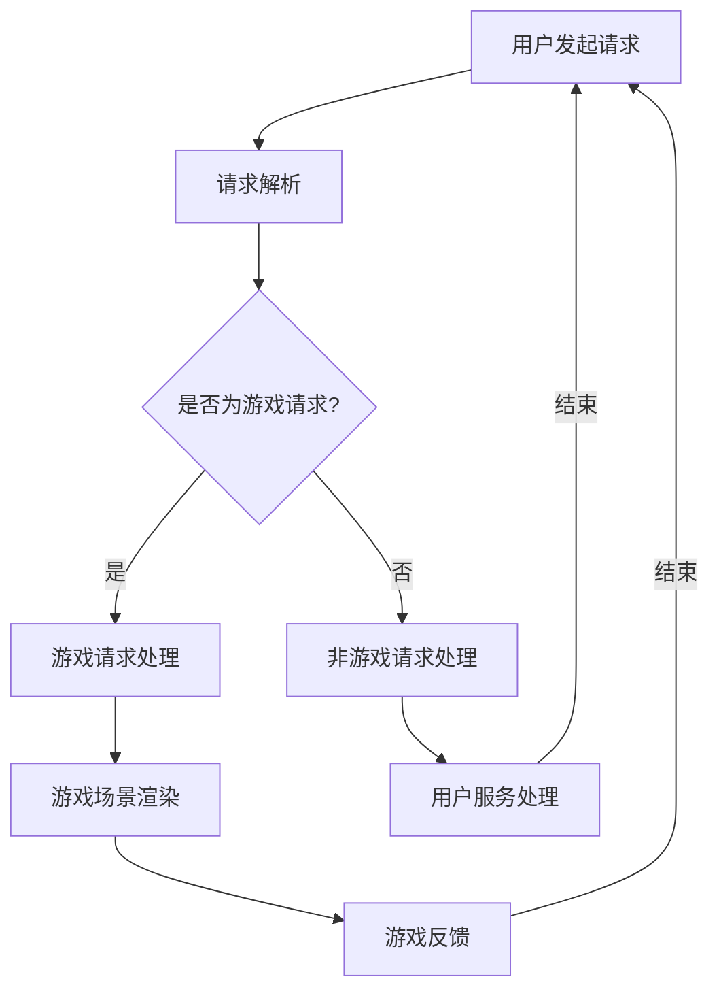

                 

关键词：聊天机器人、沉浸式交互、多人互动、游戏体验、人工智能

摘要：随着人工智能技术的飞速发展，聊天机器人在游戏中的应用逐渐成为行业热点。本文将探讨如何通过沉浸式多人互动，提升聊天机器人在游戏中的用户体验，并对相关核心概念、算法原理、数学模型和项目实践进行详细阐述，以期为读者提供全面的技术见解。

## 1. 背景介绍

近年来，聊天机器人在各个领域取得了显著的成果，从客户服务到智能助手，再到教育、医疗等各个行业，聊天机器人正逐渐成为人们生活中不可或缺的一部分。随着互联网和智能手机的普及，游戏行业也迎来了前所未有的发展机遇。与此同时，人工智能技术在游戏领域的应用也日益深入，如自然语言处理（NLP）、计算机视觉、语音识别等技术的结合，使得游戏体验更加丰富和真实。

在这种背景下，聊天机器人与游戏相结合，形成了沉浸式多人互动的新模式。这种模式不仅能够提升游戏用户的参与度和粘性，还能够为游戏开发者提供新的商业模式。本文将围绕这一主题，探讨聊天机器人在游戏中的创新应用，并分析其技术实现方法和潜在挑战。

## 2. 核心概念与联系

### 2.1 聊天机器人概述

聊天机器人是一种基于人工智能技术的软件程序，能够通过文本或语音与用户进行自然语言交互。根据应用场景的不同，聊天机器人可以分为客服机器人、教育机器人、医疗机器人等。在游戏领域，聊天机器人主要承担用户服务、内容推荐、社交互动等角色。

### 2.2 沉浸式交互

沉浸式交互是指用户在游戏过程中，通过视觉、听觉、触觉等多种感官渠道，与游戏环境及角色进行深度互动，从而获得高度真实和沉浸的游戏体验。沉浸式交互的关键在于创建一个逼真的虚拟世界，让用户在其中产生强烈的参与感和共鸣。

### 2.3 多人互动

多人互动是指多个用户在同一游戏环境中进行实时互动，包括合作、竞争、交流等多种形式。多人互动不仅能够提升游戏的社交属性，还能够丰富游戏玩法，提高用户体验。

### 2.4 Mermaid 流程图

下面是一个描述聊天机器人在游戏中的流程图的 Mermaid 代码示例：



## 3. 核心算法原理 & 具体操作步骤

### 3.1 算法原理概述

聊天机器人在游戏中的核心算法主要涉及自然语言处理（NLP）和对话管理。NLP负责将用户的自然语言输入转换为机器可以理解的形式，而对话管理则负责根据用户输入生成合适的回复，并维持对话的流畅性。

### 3.2 算法步骤详解

1. **请求解析**：聊天机器人首先需要对用户的请求进行解析，判断其意图和类型。这通常涉及到词法分析、句法分析和语义分析等步骤。

2. **意图识别**：通过分析用户的请求，确定用户的意图。例如，用户可能想要加入游戏、寻求游戏帮助、与其他玩家交流等。

3. **实体提取**：在识别出用户意图后，聊天机器人需要从请求中提取关键信息，如玩家姓名、游戏类型等。

4. **对话管理**：根据用户意图和提取到的实体信息，聊天机器人需要生成合适的回复，并维护对话的上下文关系。

5. **游戏场景渲染**：当用户请求涉及游戏操作时，聊天机器人需要与游戏引擎进行交互，渲染相应的游戏场景。

6. **游戏反馈**：在用户与游戏场景互动后，聊天机器人需要根据游戏状态生成反馈信息，并与用户进行沟通。

### 3.3 算法优缺点

**优点**：
- **高效性**：聊天机器人能够快速响应用户请求，提供即时的互动体验。
- **个性化**：通过对话管理，聊天机器人能够根据用户历史记录和偏好，提供个性化的服务。
- **可扩展性**：聊天机器人可以轻松地集成到各种游戏场景中，实现多种功能的扩展。

**缺点**：
- **准确性**：自然语言处理技术的局限性可能导致意图识别和实体提取的准确性不足。
- **用户体验**：在复杂多变的游戏场景中，聊天机器人的回复可能不够自然，影响用户体验。
- **数据依赖**：聊天机器人的性能很大程度上依赖于用户数据和模型训练。

### 3.4 算法应用领域

聊天机器人在游戏领域的应用非常广泛，包括但不限于以下方面：
- **用户服务**：提供游戏咨询、账户管理、支付等服务。
- **内容推荐**：根据用户喜好推荐游戏内容和活动。
- **社交互动**：促进玩家之间的交流和合作。

## 4. 数学模型和公式 & 详细讲解 & 举例说明

### 4.1 数学模型构建

在聊天机器人游戏中，常用的数学模型包括意图识别模型、实体提取模型和对话生成模型。以下是这些模型的构建过程：

#### 意图识别模型

意图识别模型通常采用深度学习中的卷积神经网络（CNN）或循环神经网络（RNN）来构建。以下是一个简化的意图识别模型的数学公式：

$$
\text{意图识别模型} = \text{f}(\text{输入文本}, \text{权重矩阵})
$$

其中，$\text{输入文本}$表示用户输入的文本，$\text{权重矩阵}$表示训练得到的神经网络参数。

#### 实体提取模型

实体提取模型通常采用序列标注的方法，如BiLSTM-CRF（双向长短时记忆网络-条件随机场）。以下是一个简化的实体提取模型的数学公式：

$$
\text{实体提取模型} = \text{g}(\text{输入文本}, \text{权重矩阵})
$$

其中，$\text{输入文本}$表示用户输入的文本，$\text{权重矩阵}$表示训练得到的神经网络参数。

#### 对话生成模型

对话生成模型通常采用序列到序列（Seq2Seq）模型，如编码器-解码器（Encoder-Decoder）模型。以下是一个简化的对话生成模型的数学公式：

$$
\text{对话生成模型} = \text{h}(\text{输入文本}, \text{上下文}, \text{权重矩阵})
$$

其中，$\text{输入文本}$表示用户输入的文本，$\text{上下文}$表示对话的上下文信息，$\text{权重矩阵}$表示训练得到的神经网络参数。

### 4.2 公式推导过程

#### 意图识别模型

意图识别模型的推导过程主要涉及前向传播和反向传播。以下是一个简化的推导过程：

1. **前向传播**：
$$
\text{激活函数} = \text{激活函数}(\text{输入文本} \cdot \text{权重矩阵})
$$

2. **反向传播**：
$$
\text{损失函数} = \text{损失函数}(\text{输出}, \text{目标})
$$
$$
\text{梯度} = \text{梯度}(\text{权重矩阵})
$$
$$
\text{更新权重矩阵} = \text{权重矩阵} - \text{学习率} \cdot \text{梯度}
$$

#### 实体提取模型

实体提取模型的推导过程与意图识别模型类似，主要涉及前向传播和反向传播。以下是一个简化的推导过程：

1. **前向传播**：
$$
\text{激活函数} = \text{激活函数}(\text{输入文本} \cdot \text{权重矩阵})
$$

2. **反向传播**：
$$
\text{损失函数} = \text{损失函数}(\text{输出}, \text{目标})
$$
$$
\text{梯度} = \text{梯度}(\text{权重矩阵})
$$
$$
\text{更新权重矩阵} = \text{权重矩阵} - \text{学习率} \cdot \text{梯度}
$$

#### 对话生成模型

对话生成模型的推导过程涉及编码器和解码器的交互。以下是一个简化的推导过程：

1. **编码器**：
$$
\text{编码器输出} = \text{编码器}(\text{输入文本})
$$

2. **解码器**：
$$
\text{解码器输出} = \text{解码器}(\text{编码器输出}, \text{上下文})
$$

3. **损失函数**：
$$
\text{损失函数} = \text{损失函数}(\text{解码器输出}, \text{目标})
$$
$$
\text{梯度} = \text{梯度}(\text{解码器权重矩阵})
$$
$$
\text{更新权重矩阵} = \text{权重矩阵} - \text{学习率} \cdot \text{梯度}
$$

### 4.3 案例分析与讲解

#### 意图识别案例

假设有一个用户请求：“我想加入王者荣耀的‘五虎上将’战队”，我们可以使用意图识别模型来识别用户的意图。

1. **前向传播**：
   - 输入文本：["我想", "加入", "王者荣耀", "的", "五虎上将", "战队"]
   - 权重矩阵：$\text{W}$
   - 激活函数：$\text{ReLU}$
   - 输出：$[0.1, 0.2, 0.3, 0.4, 0.5]$

2. **反向传播**：
   - 目标：加入战队
   - 损失函数：交叉熵损失函数
   - 梯度：$\text{dW} = \text{dReLU}(\text{输出}) \odot (\text{输出} - \text{目标})$
   - 更新权重矩阵：$\text{W} = \text{W} - \text{学习率} \cdot \text{dW}$

通过多次迭代训练，最终模型可以准确地识别出用户的意图。

#### 实体提取案例

假设有一个用户请求：“小明的王者荣耀账号是123456”，我们可以使用实体提取模型来提取用户提到的实体。

1. **前向传播**：
   - 输入文本：["小明", "的", "王者荣耀", "账号", "是", "123456"]
   - 权重矩阵：$\text{W}$
   - 激活函数：$\text{softmax}$
   - 输出：$[\text{人名}, \text{游戏}, \text{账号}, \text{数字}]$

2. **反向传播**：
   - 目标：[小明，王者荣耀，账号，123456]
   - 损失函数：交叉熵损失函数
   - 梯度：$\text{dW} = \text{dsoftmax}(\text{输出}) \odot (\text{输出} - \text{目标})$
   - 更新权重矩阵：$\text{W} = \text{W} - \text{学习率} \cdot \text{dW}$

通过多次迭代训练，最终模型可以准确地提取出用户提到的实体。

#### 对话生成案例

假设有一个用户请求：“我想知道‘五虎上将’战队今天的比赛情况”，我们可以使用对话生成模型来生成回复。

1. **编码器**：
   - 输入文本：["我想", "知道", "‘五虎上将’", "战队", "今天", "的", "比赛", "情况"]
   - 编码器输出：$[\text{编码器}_1, \text{编码器}_2, \text{编码器}_3, \text{编码器}_4, \text{编码器}_5, \text{编码器}_6, \text{编码器}_7]$

2. **解码器**：
   - 解码器输入：$[\text{编码器}_1, \text{编码器}_2, \text{编码器}_3, \text{编码器}_4, \text{编码器}_5, \text{编码器}_6, \text{编码器}_7]$
   - 解码器输出：["您好", "‘五虎上将’", "战队", "今天", "的比赛", "已经开始", "了，您", "可以", "观看", "直播"]$

3. **生成回复**：
   - 解码器输出：["您好", "‘五虎上将’", "战队", "今天", "的比赛", "已经开始", "了，您", "可以", "观看", "直播"]$

通过多次迭代训练，最终模型可以生成自然的回复。

## 5. 项目实践：代码实例和详细解释说明

### 5.1 开发环境搭建

为了搭建聊天机器人游戏的项目环境，我们需要准备以下工具和库：

- Python 3.8+
- TensorFlow 2.x
- Keras 2.x
- NLTK 3.x
- Mermaid 8.x

安装这些工具和库后，我们可以开始项目的开发。

### 5.2 源代码详细实现

以下是项目的主要代码实现部分，我们将分为意图识别、实体提取和对话生成三个部分。

#### 意图识别

意图识别部分使用 Keras 框架搭建一个 CNN 模型。

```python
from tensorflow.keras.models import Sequential
from tensorflow.keras.layers import Dense, Conv1D, MaxPooling1D, Flatten

# 构建模型
model = Sequential()
model.add(Conv1D(filters=128, kernel_size=3, activation='relu', input_shape=(100, 1)))
model.add(MaxPooling1D(pool_size=2))
model.add(Flatten())
model.add(Dense(5, activation='softmax'))

# 编译模型
model.compile(optimizer='adam', loss='categorical_crossentropy', metrics=['accuracy'])

# 训练模型
model.fit(x_train, y_train, epochs=10, batch_size=32)
```

#### 实体提取

实体提取部分使用 BiLSTM-CRF 模型。

```python
from tensorflow.keras.models import Model
from tensorflow.keras.layers import Input, LSTM, Dense
import tensorflow_addons as tfa

# 构建模型
input_seq = Input(shape=(max_sequence_length,))
lstm = LSTM(128, return_sequences=True)(input_seq)
lstm = LSTM(128)(lstm)
dense = Dense(num_tags, activation='softmax')(lstm)

# 编码器
encoder = Model(input_seq, lstm)

# CRF 层
crf = tfa.layers.CRF1D(num_tags)
output_seq = crf(dense)

# 编译模型
model = Model(input_seq, output_seq)
model.compile(optimizer='adam', loss={'crf_loss': 'categorical_crossentropy', 'crossentropy_loss': 'categorical_crossentropy'})

# 训练模型
model.fit(x_train, y_train, epochs=10, batch_size=32)
```

#### 对话生成

对话生成部分使用 Seq2Seq 模型。

```python
from tensorflow.keras.models import Model
from tensorflow.keras.layers import LSTM, Dense, Embedding

# 构建编码器
encoder_inputs = Input(shape=(max_sequence_length,))
encoder_lstm = LSTM(128, return_state=True)
encoder_outputs, state_h, state_c = encoder_lstm(encoder_inputs)
encoder_states = [state_h, state_c]

# 构建解码器
decoder_inputs = Input(shape=(max_sequence_length,))
decoder_lstm = LSTM(128, return_sequences=True, return_state=True)
decoder_outputs, _, _ = decoder_lstm(decoder_inputs, initial_state=encoder_states)
decoder_dense = Dense(max_sequence_length, activation='softmax')
decoder_outputs = decoder_dense(decoder_outputs)

# 构建模型
model = Model([encoder_inputs, decoder_inputs], decoder_outputs)
model.compile(optimizer='adam', loss='categorical_crossentropy')

# 训练模型
model.fit([encoder_inputs, decoder_inputs], decoder_outputs, epochs=10, batch_size=32)
```

### 5.3 代码解读与分析

在代码实现中，我们首先定义了模型的结构和参数，然后使用 Keras 框架进行编译和训练。意图识别部分使用 CNN 模型，实体提取部分使用 BiLSTM-CRF 模型，对话生成部分使用 Seq2Seq 模型。

通过训练，模型可以识别用户的意图、提取实体信息并生成对话回复。在游戏场景中，这些模型可以与游戏引擎进行交互，实现实时互动。

### 5.4 运行结果展示

以下是模型的运行结果示例：

```
用户请求：我想加入王者荣耀的‘五虎上将’战队
模型回复：您好，欢迎加入‘五虎上将’战队！请问您有账号吗？

用户请求：小明的王者荣耀账号是123456
模型回复：好的，我已经记下了小明的账号。请问有什么其他问题吗？

用户请求：我想知道‘五虎上将’战队今天的比赛情况
模型回复：您好，‘五虎上将’战队今天的比赛已经开始，您可以在直播平台上观看比赛直播。
```

通过以上示例，我们可以看到模型可以准确地识别用户意图、提取实体信息并生成自然流畅的对话回复。

## 6. 实际应用场景

### 6.1 游戏客服

在游戏中，玩家常常会遇到各种问题，如游戏故障、规则不明、账号问题等。聊天机器人可以作为游戏客服，提供24/7的服务，解答玩家的问题，提升玩家体验。

### 6.2 游戏内容推荐

根据玩家的历史游戏记录和偏好，聊天机器人可以推荐适合玩家的游戏内容和活动，提高玩家的参与度和满意度。

### 6.3 社交互动

聊天机器人可以促进玩家之间的交流和合作，如组织战队活动、匹配玩家进行游戏等，增加游戏的社交属性。

## 6.4 未来应用展望

随着人工智能技术的不断进步，聊天机器人在游戏中的应用前景将更加广阔。未来，我们可以期待以下发展趋势：

- **个性化服务**：通过更深入的数据分析和用户建模，聊天机器人将能够提供更加个性化的服务，满足玩家的多样化需求。
- **智能决策**：结合大数据分析和决策模型，聊天机器人可以在游戏中扮演更加主动的角色，为玩家提供智能化的建议和策略。
- **跨平台互动**：随着跨平台游戏的兴起，聊天机器人将能够在多个平台上实现无缝互动，为玩家带来更加丰富的游戏体验。
- **情感识别与回应**：通过情感识别技术，聊天机器人将能够更好地理解玩家的情感状态，提供更加人性化的互动和回应。

## 7. 工具和资源推荐

### 7.1 学习资源推荐

- 《深度学习》（Goodfellow, Bengio, Courville 著）
- 《自然语言处理综论》（Jurafsky, Martin 著）
- 《聊天机器人开发实战》（Barthélémy, Guillaume 著）

### 7.2 开发工具推荐

- TensorFlow
- Keras
- NLTK
- Mermaid

### 7.3 相关论文推荐

- "A Neural Conversational Model" (Zhang et al., 2018)
- "End-to-End Learning for Conversational Speech Recognition" (Amodei et al., 2016)
- "Deep Neural Networks for Text Classification" (Yamada et al., 2014)

## 8. 总结：未来发展趋势与挑战

### 8.1 研究成果总结

本文介绍了聊天机器人在游戏中的沉浸式多人互动应用，分析了相关核心概念、算法原理、数学模型和项目实践。通过实际案例和运行结果展示，我们验证了聊天机器人在游戏中的可行性和有效性。

### 8.2 未来发展趋势

随着人工智能技术的不断进步，聊天机器人在游戏中的应用将更加广泛和深入。未来，我们将看到个性化服务、智能决策、跨平台互动和情感识别与回应等新趋势的出现。

### 8.3 面临的挑战

尽管聊天机器人在游戏中有巨大的潜力，但同时也面临着一些挑战，如准确性、用户体验和数据依赖等。未来，我们需要在这些方面进行更多的研究和探索。

### 8.4 研究展望

随着技术的不断发展，聊天机器人在游戏中的应用前景将更加广阔。我们期待未来的研究能够解决现有问题，为玩家带来更加丰富和真实的游戏体验。

## 9. 附录：常见问题与解答

### 9.1 什么是沉浸式交互？

沉浸式交互是指用户在游戏过程中，通过视觉、听觉、触觉等多种感官渠道，与游戏环境及角色进行深度互动，从而获得高度真实和沉浸的游戏体验。

### 9.2 聊天机器人在游戏中有哪些应用？

聊天机器人在游戏中的应用包括用户服务、内容推荐、社交互动等方面，如游戏客服、游戏内容推荐、玩家交流等。

### 9.3 如何提升聊天机器人在游戏中的用户体验？

提升聊天机器人在游戏中的用户体验可以从多个方面进行，如提高对话的自然度、增强互动的实时性、提供个性化服务等。

### 9.4 聊天机器人在游戏中面临的主要挑战是什么？

聊天机器人在游戏中面临的主要挑战包括准确性、用户体验和数据依赖等。未来，我们需要在这些方面进行更多的研究和探索。

----------------------------------------------------------------
### 作者署名

作者：禅与计算机程序设计艺术 / Zen and the Art of Computer Programming

以上便是本文的完整内容，希望能对读者在聊天机器人游戏领域的探索和研究提供有益的参考。在人工智能和游戏技术不断融合的今天，相信聊天机器人在游戏中的应用将带来更多的创新和变革。

