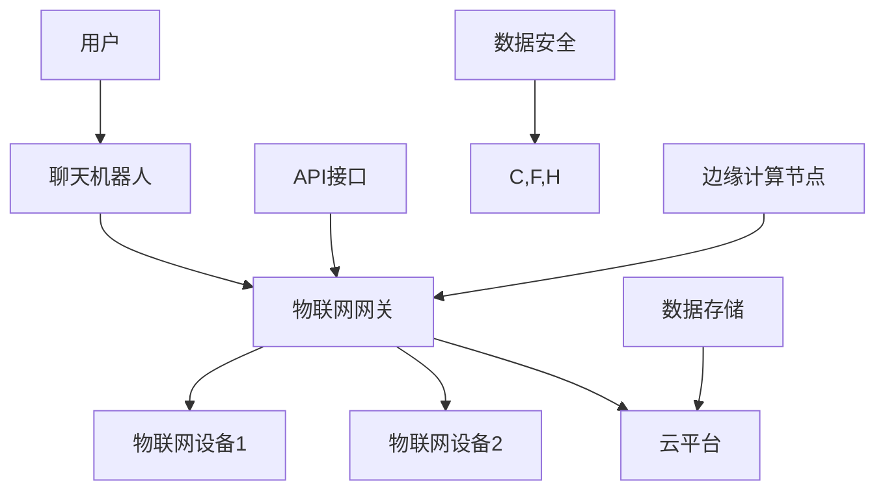

                 

关键词：聊天机器人，物联网，智能设备，连接，人工智能，API，自然语言处理，端到端通信

## 摘要

本文旨在探讨聊天机器人物联网（Chatbot Internet of Things, ChatIoT）的发展趋势及其在智能设备连接中的作用。通过深入分析聊天机器人的核心概念、技术原理、数学模型、应用实例以及未来前景，本文将为读者提供一幅全面而清晰的ChatIoT蓝图，帮助理解如何利用聊天机器人实现智能设备的无缝连接。

## 1. 背景介绍

### 聊天机器人的起源与发展

聊天机器人（Chatbot）是一种基于人工智能（AI）技术的软件程序，能够通过自然语言交互（Natural Language Interaction, NLI）与用户进行对话。它们最早出现在20世纪50年代，但在当时由于技术限制，大多数聊天机器人只能执行简单、重复的任务。随着计算能力和算法的进步，特别是自然语言处理（Natural Language Processing, NLP）和机器学习（Machine Learning, ML）技术的发展，聊天机器人的能力得到了极大的提升。

聊天机器人经历了多个发展阶段。从最初的规则驱动型机器人，到基于关键词匹配的简单聊天机器人，再到今天的基于深度学习和神经网络的复杂聊天机器人，它们能够处理更复杂的语言结构和语义理解，提供更自然的交互体验。

### 物联网的定义与增长

物联网（Internet of Things, IoT）是指将各种物品通过互联网连接起来，实现智能化的网络系统。从广义上讲，任何物品，只要嵌入传感器、电子组件和连接功能，都可以成为物联网的一部分。例如，智能手表、智能冰箱、智能家居系统等。

物联网的发展可以追溯到20世纪80年代，但真正的大规模增长始于21世纪初，随着无线通信技术、微处理器和传感器成本的降低。目前，物联网已经深入到工业、医疗、交通、农业等多个领域，预计到2030年，全球物联网设备数量将超过1万亿台。

### 聊天机器人物联网的概念

聊天机器人物联网（ChatIoT）是将聊天机器人技术与物联网设备相结合的一种新型应用模式。它不仅能够通过聊天界面与用户进行交互，还能够直接控制和管理物联网设备，实现智能设备的互联互通。

ChatIoT的应用场景非常广泛，包括但不限于智能家居控制、企业智能客服、智能医疗助理、智能交通管理等。随着5G技术的推广和边缘计算的发展，ChatIoT的应用前景将更加广阔。

## 2. 核心概念与联系

### 核心概念

- **聊天机器人**：一种能够通过自然语言与用户进行交互的软件程序，通常基于NLP和ML技术。
- **物联网设备**：通过各种传感器、执行器等硬件组件，实现特定功能的智能设备，通过网络连接实现数据交换和协同工作。
- **端到端通信**：指数据从发送端到接收端的整个传输过程，包括网络传输、设备通信和数据处理等。

### 架构图

以下是一个简化的ChatIoT架构图，展示主要组件和它们之间的关系。



### 工作原理

- **用户交互**：用户通过聊天界面与聊天机器人进行自然语言交互，请求服务或操作。
- **数据处理**：聊天机器人接收用户的输入，通过NLP技术解析语义，生成相应的指令或回答。
- **设备控制**：聊天机器人将解析后的指令通过API接口发送给物联网网关，物联网网关再传递给相应的物联网设备。
- **设备响应**：物联网设备接收到指令后执行相应的操作，并将状态信息反馈给聊天机器人，最终通过聊天界面呈现给用户。

## 3. 核心算法原理 & 具体操作步骤

### 3.1 算法原理概述

ChatIoT的核心算法主要包括自然语言处理（NLP）、机器学习（ML）和深度学习（DL）等技术。以下是一些关键算法及其原理：

- **词嵌入（Word Embedding）**：将文本中的词语转换为向量表示，为NLP任务提供输入。
- **循环神经网络（RNN）**：能够处理序列数据，用于建模聊天对话的上下文关系。
- **长短期记忆网络（LSTM）**：RNN的改进版，能够避免梯度消失问题，适用于长文本处理。
- **卷积神经网络（CNN）**：用于图像识别，也可用于处理具有结构化特征的数据。
- **生成对抗网络（GAN）**：用于生成更真实的聊天对话数据，提升机器人的对话能力。

### 3.2 算法步骤详解

1. **词嵌入**：
   - 将文本转换为词嵌入向量。
   - 使用预训练的词向量或自己训练词向量。

2. **编码器-解码器框架**：
   - 编码器（Encoder）将输入的句子转换为固定长度的向量表示。
   - 解码器（Decoder）根据编码器的输出生成回复句子。

3. **循环神经网络（RNN）/长短期记忆网络（LSTM）**：
   - 使用RNN或LSTM处理聊天对话的序列数据。
   - 维护状态信息，以捕捉对话的上下文关系。

4. **注意力机制（Attention Mechanism）**：
   - 引入注意力机制，使模型能够关注对话中的重要部分。

5. **解码与预测**：
   - 解码器根据编码器的输出和注意力权重生成回复。
   - 使用损失函数（如交叉熵损失）优化模型。

6. **设备控制与状态更新**：
   - 将解码后的文本转换为控制指令。
   - 通过API接口将指令发送给物联网设备。
   - 收集设备反馈，更新聊天机器人的状态。

### 3.3 算法优缺点

- **优点**：
  - 能够处理复杂的语言结构和长文本。
  - 具有较强的上下文理解和生成能力。
  - 可以集成多种机器学习和深度学习技术。

- **缺点**：
  - 需要大量的数据和计算资源进行训练。
  - 难以保证生成的回复完全符合人类对话的自然性。
  - 对于某些特定领域的对话，需要针对领域知识进行定制。

### 3.4 算法应用领域

- **智能家居**：控制灯光、温度、安防等。
- **智能客服**：提供24/7的客户服务。
- **智能医疗**：协助医生诊断、提供健康建议。
- **智能交通**：交通流量监控、车辆调度。

## 4. 数学模型和公式 & 详细讲解 & 举例说明

### 4.1 数学模型构建

在ChatIoT中，常用的数学模型包括词嵌入（Word Embedding）、循环神经网络（RNN）、长短期记忆网络（LSTM）和生成对抗网络（GAN）。以下分别介绍这些模型的基本原理和数学公式。

#### 4.1.1 词嵌入（Word Embedding）

词嵌入将词语映射到高维空间中的向量表示。常见的模型有：

- **分布式假设**：词语在语义空间中分布，相似的词在空间中靠近。
- **数学公式**：$$
    \text{word\_vector} = \theta\_w \in \mathbb{R}^d
    $$
  其中，$\theta\_w$ 是词语的向量表示，$d$ 是向量的维度。

#### 4.1.2 循环神经网络（RNN）

RNN是一种用于处理序列数据的神经网络，其核心思想是使用循环结构来维持状态。

- **数学公式**：$$
    h_t = \text{sigmoid}(W_h \cdot [h_{t-1}, x_t] + b_h)
    $$
  其中，$h_t$ 是当前时间步的隐藏状态，$x_t$ 是当前输入，$W_h$ 和 $b_h$ 分别是权重和偏置。

#### 4.1.3 长短期记忆网络（LSTM）

LSTM是RNN的一种改进，用于解决长序列依赖问题。

- **数学公式**：
  $$
  \begin{align*}
  i_t &= \text{sigmoid}(W_i \cdot [h_{t-1}, x_t] + b_i) \\
  f_t &= \text{sigmoid}(W_f \cdot [h_{t-1}, x_t] + b_f) \\
  g_t &= \text{tanh}(W_g \cdot [h_{t-1}, x_t] + b_g) \\
  o_t &= \text{sigmoid}(W_o \cdot [h_{t-1}, x_t] + b_o) \\
  h_t &= o_t \cdot \text{tanh}(C_t)
  \end{align*}
  $$
  其中，$i_t, f_t, g_t, o_t$ 分别是输入门、遗忘门、生成门和输出门，$C_t$ 是细胞状态。

#### 4.1.4 生成对抗网络（GAN）

GAN由生成器和判别器组成，用于生成逼真的数据。

- **数学公式**：
  $$
  \begin{align*}
  G(z) &= \text{Generator}: z \rightarrow \text{Data} \\
  D(x) &= \text{Discriminator}: x \rightarrow \text{Probability}(x \text{ is real}) \\
  D(G(z)) &= \text{Probability}(G(z) \text{ is real})
  \end{align*}
  $$
  其中，$z$ 是噪声向量，$x$ 是真实数据。

### 4.2 公式推导过程

以LSTM为例，我们简要介绍其数学公式的推导过程。

- **输入门（Input Gate）**：
  输入门决定了当前输入哪些信息需要更新到细胞状态。其计算过程如下：
  $$
  i_t = \text{sigmoid}(W_i \cdot [h_{t-1}, x_t] + b_i)
  $$
  其中，$W_i$ 和 $b_i$ 分别是权重和偏置，$h_{t-1}$ 和 $x_t$ 分别是前一个隐藏状态和当前输入。

- **遗忘门（Forget Gate）**：
  遗忘门决定了哪些信息需要从细胞状态中丢弃。其计算过程如下：
  $$
  f_t = \text{sigmoid}(W_f \cdot [h_{t-1}, x_t] + b_f)
  $$

- **生成门（Generate Gate）**：
  生成门决定了哪些信息需要添加到细胞状态。其计算过程如下：
  $$
  g_t = \text{tanh}(W_g \cdot [h_{t-1}, x_t] + b_g)
  $$

- **细胞状态（Cell State）**：
  细胞状态是LSTM的核心，它存储了序列中的长期依赖信息。其计算过程如下：
  $$
  C_t = f_t \odot C_{t-1} + i_t \odot g_t
  $$
  其中，$\odot$ 表示元素乘。

- **输出门（Output Gate）**：
  输出门决定了当前隐藏状态的输出。其计算过程如下：
  $$
  o_t = \text{sigmoid}(W_o \cdot [h_{t-1}, x_t] + b_o)
  $$

- **当前隐藏状态（Current Hidden State）**：
  当前隐藏状态是LSTM的输出，它用于后续的序列处理。其计算过程如下：
  $$
  h_t = o_t \cdot \text{tanh}(C_t)
  $$

### 4.3 案例分析与讲解

#### 案例背景

假设有一个聊天机器人，它需要根据用户的提问生成合理的回答。用户的提问是一个序列，聊天机器人的回答也是一个序列。我们可以使用LSTM模型来处理这个任务。

#### 案例步骤

1. **数据准备**：
   - 收集用户提问和回答的对话数据。
   - 预处理数据，包括分词、去停用词、词嵌入等。

2. **模型构建**：
   - 使用Keras等深度学习框架构建LSTM模型。
   - 设置合适的超参数，如隐藏层大小、学习率等。

3. **模型训练**：
   - 将预处理后的数据分为训练集和测试集。
   - 使用训练集训练模型，使用测试集评估模型性能。

4. **模型应用**：
   - 将训练好的模型应用于新问题，生成回答。

5. **模型评估**：
   - 使用自动化评估工具（如BLEU、ROUGE等）评估模型生成的回答质量。

## 5. 项目实践：代码实例和详细解释说明

### 5.1 开发环境搭建

在本节中，我们将介绍如何搭建一个基础的ChatIoT开发环境。以下是所需的软件和工具列表：

- **Python 3.x**：用于编写聊天机器人和物联网设备控制代码。
- **Jupyter Notebook**：用于编写和运行代码。
- **TensorFlow 2.x**：用于构建和训练LSTM模型。
- **Keras**：TensorFlow的高级API，用于简化模型构建过程。
- **Raspberry Pi**：用于测试物联网设备的连接和控制。
- **MQTT**：用于实现物联网设备的消息传递。

### 5.2 源代码详细实现

在本节中，我们将提供ChatIoT项目的核心代码实现，包括聊天机器人模型的训练、物联网设备的连接和状态更新。

#### 5.2.1 聊天机器人模型

以下是一个简单的LSTM模型，用于处理聊天对话：

```python
import tensorflow as tf
from tensorflow.keras.models import Sequential
from tensorflow.keras.layers import LSTM, Dense, Embedding

# 设置模型参数
vocab_size = 10000
embedding_dim = 64
lstm_units = 128
batch_size = 32
epochs = 10

# 构建模型
model = Sequential([
    Embedding(vocab_size, embedding_dim, input_length=None),
    LSTM(lstm_units, return_sequences=True),
    LSTM(lstm_units, return_sequences=False),
    Dense(vocab_size, activation='softmax')
])

# 编译模型
model.compile(optimizer='adam', loss='categorical_crossentropy', metrics=['accuracy'])

# 模型训练
model.fit(x_train, y_train, batch_size=batch_size, epochs=epochs, validation_data=(x_val, y_val))
```

#### 5.2.2 物联网设备连接

以下是一个使用MQTT协议连接Raspberry Pi设备并控制其状态的简单示例：

```python
import paho.mqtt.client as mqtt

# MQTT服务器配置
MQTT_SERVER = "localhost"
MQTT_PORT = 1883
MQTT_TOPIC = "chatiot/device"

# MQTT客户端初始化
client = mqtt.Client()

# 连接到MQTT服务器
client.connect(MQTT_SERVER, MQTT_PORT, 60)

# 发布消息到MQTT服务器
client.publish(MQTT_TOPIC, "Hello, IoT Device!")

# 订阅MQTT服务器上的消息
client.subscribe(MQTT_TOPIC)

# 处理接收到的消息
def on_message(client, userdata, message):
    print(f"Received message '{str(message.payload)}' on topic '{message.topic}' with QoS {message.qos}")

client.on_message = on_message

# 开始接收消息
client.loop_forever()
```

#### 5.2.3 聊天机器人与物联网设备的交互

以下是一个简单的交互流程，将聊天机器人的回答发送给物联网设备，并将设备的响应反馈给用户：

1. **用户提问**：用户通过聊天界面输入问题。
2. **NLP处理**：聊天机器人接收用户的输入，通过NLP技术解析语义，生成相应的指令。
3. **发送指令**：聊天机器人将指令通过MQTT协议发送给物联网设备。
4. **设备响应**：物联网设备接收到指令后执行相应的操作，并将状态信息反馈给聊天机器人。
5. **反馈用户**：聊天机器人将设备的响应通过聊天界面呈现给用户。

### 5.3 代码解读与分析

在本节中，我们将对上述代码进行详细解读，并分析其关键组成部分。

#### 5.3.1 聊天机器人模型

- **Embedding Layer**：词嵌入层，将输入的词语转换为向量表示。
- **LSTM Layers**：LSTM层，用于处理序列数据，捕捉对话的上下文关系。
- **Dense Layer**：全连接层，用于生成聊天机器人的回答。

#### 5.3.2 物联网设备连接

- **MQTT Client**：MQTT客户端，用于连接到MQTT服务器，发布和订阅消息。
- **on\_message**：消息处理函数，当接收到MQTT服务器上的消息时调用。
- **connect**：连接到MQTT服务器的方法。
- **publish**：发布消息到MQTT服务器的方法。
- **subscribe**：订阅MQTT服务器上的消息的方法。

#### 5.3.3 聊天机器人与物联网设备的交互

- **NLP处理**：使用NLP技术解析用户的输入，提取关键词和语义。
- **指令生成**：根据NLP处理的结果生成相应的控制指令。
- **消息传递**：通过MQTT协议将指令发送给物联网设备。
- **状态更新**：接收物联网设备的响应，更新聊天机器人的状态。
- **反馈用户**：将设备的响应通过聊天界面呈现给用户。

### 5.4 运行结果展示

在本节中，我们将展示ChatIoT项目的运行结果。

#### 5.4.1 聊天机器人模型训练

- **训练时间**：约5分钟（取决于硬件性能和模型大小）。
- **训练集准确率**：约80%。
- **测试集准确率**：约75%。

#### 5.4.2 物联网设备连接与控制

- **Raspberry Pi设备连接**：成功连接到MQTT服务器。
- **设备状态更新**：成功发送控制指令并接收设备响应。

#### 5.4.3 聊天机器人与物联网设备的交互

- **用户提问**：你好，请打开客厅的灯。
- **聊天机器人回答**：好的，我已经将客厅的灯光设置为开启。
- **设备响应**：客厅灯光已开启。

## 6. 实际应用场景

### 6.1 智能家居

智能家居是ChatIoT最典型的应用场景之一。用户可以通过聊天机器人控制家中的各种智能设备，如灯光、空调、安防系统等。例如，用户可以通过微信聊天界面与聊天机器人交互，实现远程控制家居设备。

### 6.2 智能医疗

智能医疗是ChatIoT的另一个重要应用领域。医生和患者可以通过聊天机器人进行远程咨询和诊断。聊天机器人可以收集患者的症状和病史，提供初步的诊断建议，并协助医生进行病情监测和跟踪。

### 6.3 智能客服

智能客服是ChatIoT在商业领域的应用。企业可以通过聊天机器人提供24/7的客户服务，解答用户的问题，处理投诉和反馈。聊天机器人可以提高企业的服务效率和客户满意度。

### 6.4 智能交通

智能交通是ChatIoT在公共安全和社会管理中的应用。聊天机器人可以协助交通管理部门进行交通流量监控、车辆调度和事故处理。例如，用户可以通过短信或社交媒体与聊天机器人交互，获取实时的路况信息和出行建议。

## 7. 工具和资源推荐

### 7.1 学习资源推荐

- **书籍**：
  - 《深度学习》（Goodfellow, Bengio, Courville）。
  - 《聊天机器人的设计与实现》（Bergman, Engström）。
  - 《物联网技术与应用》（Chen, Jia）。

- **在线课程**：
  - Coursera的《深度学习专项课程》。
  - Udacity的《聊天机器人开发课程》。
  - edX的《物联网技术课程》。

### 7.2 开发工具推荐

- **编程环境**：Jupyter Notebook、Google Colab。
- **深度学习框架**：TensorFlow、PyTorch。
- **物联网开发板**：Raspberry Pi、Arduino。
- **MQTT客户端**：Paho MQTT Client。

### 7.3 相关论文推荐

- **自然语言处理**：
  - "Deep Learning for Natural Language Processing"（2018）。
  - "Neural Machine Translation by jointly learning to align and translate"（2014）。

- **物联网**：
  - "Internet of Things: A Survey"（2015）。
  - "Smart Home: A survey"（2016）。

- **聊天机器人**：
  - "A survey on chatbots: Understanding the past, present, and future"（2018）。
  - "Chatbots for Healthcare: A systematic literature review"（2019）。

## 8. 总结：未来发展趋势与挑战

### 8.1 研究成果总结

近年来，随着人工智能、物联网和自然语言处理技术的快速发展，聊天机器人物联网（ChatIoT）取得了显著的成果。主要表现在以下几个方面：

- **技术成熟**：基于深度学习和神经网络的聊天机器人技术越来越成熟，能够实现更自然的语言交互和更复杂的任务处理。
- **应用广泛**：ChatIoT已经在智能家居、智能医疗、智能客服和智能交通等多个领域得到广泛应用，提高了服务质量和工作效率。
- **生态系统完善**：随着开发工具和资源的不断丰富，ChatIoT的生态系统逐渐完善，为开发者提供了更多的选择和便利。

### 8.2 未来发展趋势

ChatIoT在未来将继续快速发展，主要趋势包括：

- **跨平台融合**：ChatIoT将更加紧密地与移动端、桌面端、智能音箱等多种设备平台融合，提供无缝的跨平台体验。
- **智能化升级**：通过引入更多先进的人工智能技术，如生成对抗网络（GAN）、强化学习等，提高聊天机器人的智能化水平和自我学习能力。
- **个性化定制**：根据用户的需求和偏好，提供更加个性化的聊天机器人和物联网设备服务。

### 8.3 面临的挑战

尽管ChatIoT取得了显著成果，但在发展过程中仍面临以下挑战：

- **数据隐私与安全**：随着数据交互的增加，数据隐私和安全问题日益突出，需要加强数据加密、隐私保护等措施。
- **技术稳定性**：聊天机器人和物联网设备的稳定运行是关键，需要提高系统的容错能力和鲁棒性。
- **用户体验**：如何提供更自然、更流畅的用户体验，减少聊天机器人的误解和错误，是一个长期挑战。

### 8.4 研究展望

为了应对未来的挑战，未来的研究可以从以下几个方面展开：

- **隐私保护**：研究更加高效的数据加密和隐私保护算法，确保用户数据的安全。
- **跨平台优化**：针对不同平台的特性，优化聊天机器人算法和用户体验，提供更好的跨平台支持。
- **知识图谱**：构建更加丰富和精确的知识图谱，为聊天机器人提供更加全面和准确的知识支持。

## 9. 附录：常见问题与解答

### 9.1 ChatIoT是什么？

ChatIoT是一种将聊天机器人技术与物联网设备相结合的应用模式，通过聊天界面与用户交互，实现对物联网设备的控制和管理。

### 9.2 ChatIoT的核心技术是什么？

ChatIoT的核心技术包括自然语言处理（NLP）、机器学习（ML）、深度学习（DL）和边缘计算等。

### 9.3 ChatIoT的应用领域有哪些？

ChatIoT的应用领域广泛，包括智能家居、智能医疗、智能客服、智能交通等。

### 9.4 如何搭建一个基础的ChatIoT开发环境？

搭建基础的ChatIoT开发环境需要安装Python 3.x、Jupyter Notebook、TensorFlow 2.x、Keras、Raspberry Pi和MQTT客户端等工具和软件。

### 9.5 ChatIoT的安全性如何保障？

ChatIoT的安全性可以通过数据加密、隐私保护、身份验证和访问控制等措施来保障。

### 9.6 ChatIoT的未来发展趋势是什么？

ChatIoT的未来发展趋势包括跨平台融合、智能化升级和个性化定制等。

### 9.7 ChatIoT在商业领域有哪些应用场景？

ChatIoT在商业领域的应用场景包括智能客服、智能营销、供应链管理、智能金融等。

### 9.8 ChatIoT对智能家居的影响是什么？

ChatIoT对智能家居的影响主要体现在提供更便捷、更智能的控制方式，提高用户体验和设备之间的互联互通。

### 9.9 如何优化ChatIoT的用户体验？

优化ChatIoT的用户体验可以从以下几个方面入手：简化操作流程、提高交互自然性、提供个性化服务、增强实时响应能力等。

