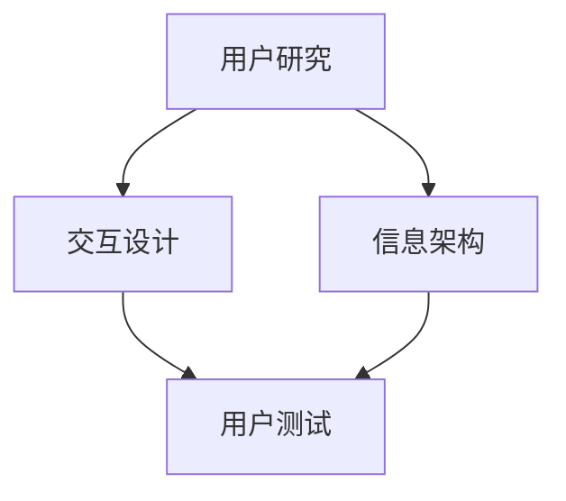

                 

关键词：聊天机器人，界面设计，用户体验，优化

> 摘要：本文旨在探讨聊天机器人界面设计的核心原则和实践方法，通过深入分析用户体验的重要性，介绍如何运用设计原则和优化策略来提升聊天机器人的用户体验。

## 1. 背景介绍

在当今信息化和数字化的时代，聊天机器人的应用场景日益广泛，从客户服务、智能助手到社交娱乐等领域，都取得了显著的成效。然而，随着用户需求的不断增长和多样化，如何设计一个既智能又易于使用的聊天机器人界面，成为了一个亟待解决的问题。用户体验（UX）作为产品设计的重要方面，直接影响用户对聊天机器人的接受度和使用频率。

### 聊天机器人的定义和作用
聊天机器人（Chatbot）是指通过自然语言处理技术，与用户进行交互的计算机程序。它们可以自动回答用户的问题，提供信息服务，甚至完成特定的任务，如预订机票、酒店等。聊天机器人的主要作用是提高工作效率、降低人工成本和提升客户满意度。

### 用户体验的重要性
用户体验是指用户在使用产品过程中的感受和体验。对于聊天机器人而言，良好的用户体验意味着用户可以轻松、自然地与机器人进行交流，获得所需的信息和帮助。用户体验优化的目标是通过设计使聊天机器人更智能、更易用，从而提升用户满意度和忠诚度。

## 2. 核心概念与联系

为了设计一个优秀的聊天机器人界面，我们需要了解几个核心概念，包括用户研究、交互设计、信息架构和用户测试等。以下是这些概念之间的关系和联系：

### 用户研究
用户研究是理解用户需求和行为的基础。通过用户访谈、问卷调查、用户观察等方法，我们可以获取用户的背景信息、使用习惯和偏好。这些数据有助于我们设计符合用户需求的聊天机器人界面。

### 交互设计
交互设计关注用户与产品之间的交互过程。在聊天机器人界面设计中，交互设计涉及到对话流程、按钮布局、输入提示等方面。优秀的交互设计可以提升用户的操作效率和满意度。

### 信息架构
信息架构是确保用户能够快速找到所需信息的方法。在聊天机器人界面设计中，信息架构包括对话树的设计、分类标签的设置等。合理的信息架构可以降低用户的认知负担，提高信息获取的效率。

### 用户测试
用户测试是通过让真实用户使用产品来评估和改进设计。在聊天机器人界面设计中，用户测试可以帮助我们发现设计中的问题，并进行针对性的优化。

### Mermaid 流程图

通过上述流程图，我们可以清晰地看到各个核心概念之间的联系和作用。

## 3. 核心算法原理 & 具体操作步骤

### 3.1 算法原理概述
聊天机器人界面的设计涉及多个算法，其中最核心的是自然语言处理（NLP）和机器学习算法。NLP算法用于解析用户输入的自然语言，提取关键信息并生成合适的回复。机器学习算法则用于训练和优化聊天机器人的对话能力。

### 3.2 算法步骤详解
#### 3.2.1 用户输入解析
1. **文本预处理**：去除标点符号、停用词等无关信息，对文本进行标准化处理。
2. **词向量表示**：将文本转换为词向量，以便进行数学运算。
3. **实体识别**：识别用户输入中的关键词和实体，如人名、地点、时间等。
4. **意图识别**：根据词向量表示和实体识别结果，确定用户的意图。

#### 3.2.2 对话生成
1. **对话树构建**：根据意图识别结果，构建对话树，确定对话的流程和分支。
2. **回复生成**：基于对话树和用户输入，生成合适的回复文本。
3. **回复优化**：通过自然语言生成（NLG）算法，对回复文本进行优化，使其更自然、流畅。

### 3.3 算法优缺点
#### 优点
1. **高效性**：通过算法，聊天机器人可以快速响应用户输入，提供实时服务。
2. **智能性**：随着数据量的积累和算法的优化，聊天机器人的对话能力不断提升，可以处理更复杂的场景。
3. **灵活性**：聊天机器人可以根据业务需求进行定制化开发，适应不同的应用场景。

#### 缺点
1. **准确性**：尽管NLP和机器学习算法在不断进步，但仍然存在误识别和误解用户意图的问题。
2. **交互体验**：目前的聊天机器人交互体验尚有提升空间，如语音交互、情感表达等方面。
3. **隐私保护**：用户数据的安全和隐私保护是设计聊天机器人时需要考虑的重要问题。

### 3.4 算法应用领域
聊天机器人算法广泛应用于多个领域，包括但不限于：
1. **客户服务**：提供24/7在线客服，快速响应用户问题和请求。
2. **智能助手**：协助用户完成日常任务，如日程管理、提醒等。
3. **教育领域**：为学生提供个性化学习建议和辅导。
4. **娱乐休闲**：提供游戏、聊天等功能，丰富用户娱乐体验。

## 4. 数学模型和公式 & 详细讲解 & 举例说明

### 4.1 数学模型构建
聊天机器人界面设计中的数学模型主要包括自然语言处理（NLP）和机器学习（ML）算法。以下是构建这些模型的一些基本数学公式。

#### 4.1.1 自然语言处理
1. **词向量表示**：使用Word2Vec算法将文本转换为词向量。
   $$ \vec{w_i} = \text{Word2Vec}(\text{context}) $$
2. **意图识别**：使用分类算法（如SVM、CNN等）对用户输入进行分类。
   $$ y = \text{分类算法}(\vec{w_i}) $$

#### 4.1.2 机器学习
1. **对话生成**：使用序列到序列（Seq2Seq）模型生成回复文本。
   $$ \text{response} = \text{Seq2Seq}(\text{input_sequence}) $$
2. **回复优化**：使用生成对抗网络（GAN）优化回复文本。
   $$ \text{response} = \text{GAN}(\text{input_sequence}) $$

### 4.2 公式推导过程
#### 4.2.1 词向量表示
词向量表示是自然语言处理的基础。Word2Vec算法通过训练神经网络模型，将文本中的每个词映射为一个固定维度的向量。以下是Word2Vec算法的推导过程。

1. **词向量的初始化**：
   $$ \vec{w_i}^{(0)} \sim \text{Uniform}([-1, 1], d) $$
   其中，$d$为词向量的维度。

2. **损失函数**：
   $$ L(\theta) = -\sum_{i=1}^{N} \sum_{j=1}^{V} \text{sign}(\text{dot}(\vec{w_i}, \vec{v_j})) \log(p_j) $$
   其中，$N$为文本中的词数，$V$为词汇表大小，$\text{dot}(\cdot, \cdot)$为点积运算，$p_j$为词$j$在文本中的概率。

3. **梯度下降**：
   $$ \theta^{(t+1)} = \theta^{(t)} - \alpha \nabla_{\theta} L(\theta) $$
   其中，$\alpha$为学习率，$\nabla_{\theta} L(\theta)$为损失函数对模型参数的梯度。

#### 4.2.2 对话生成
对话生成是机器学习的一个重要应用。Seq2Seq模型是一种常见的序列到序列模型，通过编码器和解码器将输入序列转换为输出序列。

1. **编码器**：
   $$ \text{encoder}(\text{input_sequence}) = \text{h} $$
   其中，$\text{h}$为编码器的输出隐藏状态。

2. **解码器**：
   $$ \text{decoder}(\text{h}) = \text{output_sequence} $$
   其中，$\text{output_sequence}$为解码器生成的输出序列。

3. **损失函数**：
   $$ L(\theta) = -\sum_{t=1}^{T} \sum_{j=1}^{V} y_t \log(p_j) $$
   其中，$T$为输出序列的长度，$y_t$为真实标签。

### 4.3 案例分析与讲解
#### 4.3.1 案例背景
某航空公司计划开发一款聊天机器人，用于为用户提供航班查询、预订等服务。用户可以通过聊天机器人输入航班信息，如出发地、目的地、出发时间等，聊天机器人根据用户输入提供相应的航班信息。

#### 4.3.2 案例分析
1. **用户研究**：通过用户访谈和问卷调查，了解用户对航班查询和预订的需求和习惯，收集用户的痛点。

2. **交互设计**：设计简洁、直观的界面，使用户能够快速找到所需功能。在用户输入航班信息时，提供实时提示和帮助。

3. **信息架构**：构建对话树，根据用户输入的航班信息，提供相应的航班查询和预订服务。

4. **用户测试**：邀请真实用户参与测试，收集用户反馈，对设计进行优化。

#### 4.3.3 案例讲解
1. **用户输入解析**：
   用户输入：“北京到上海明天上午的航班”
   - **文本预处理**：去除标点符号，得到“北京上海 明天 上午 航班”
   - **词向量表示**：将关键词转换为词向量
   - **实体识别**：识别出发地“北京”、目的地“上海”、时间“明天上午”
   - **意图识别**：确定用户意图为查询明天上午的航班

2. **对话生成**：
   - **对话树构建**：根据用户意图，构建对话树，确定查询航班信息的流程和分支
   - **回复生成**：根据对话树和用户输入，生成回复文本
     “您好，以下是北京到上海明天上午的航班信息：…”
   - **回复优化**：使用自然语言生成（NLG）算法，优化回复文本，使其更自然、流畅

3. **用户测试**：
   - **测试环境**：搭建测试环境，模拟用户与聊天机器人的交互过程
   - **测试指标**：评估聊天机器人的响应速度、准确性和用户体验
   - **反馈收集**：收集用户反馈，对设计进行优化

## 5. 项目实践：代码实例和详细解释说明

### 5.1 开发环境搭建
在搭建开发环境时，我们需要选择合适的编程语言和工具。本文使用Python作为主要编程语言，结合NLTK、spaCy等库进行自然语言处理，使用TensorFlow进行机器学习。

#### 环境搭建步骤
1. 安装Python（建议使用3.7版本以上）
2. 安装相关库：`pip install nltk spacy tensorflow`
3. 下载必要的语言模型：`python -m spacy download en_core_web_sm`

### 5.2 源代码详细实现
以下是一个简单的聊天机器人示例，实现用户输入航班信息并查询航班的功能。

```python
import spacy
import tensorflow as tf
from tensorflow.keras.models import Model
from tensorflow.keras.layers import Input, Embedding, LSTM, Dense

# 加载语言模型
nlp = spacy.load("en_core_web_sm")

# 词向量表示
def word_vector(word):
    return nlp(word)[0].vector

# 构建对话树
def build_dialogue_tree(user_input):
    # 实现对话树构建逻辑
    pass

# 回复生成
def generate_response(dialogue_tree):
    # 实现回复生成逻辑
    pass

# 模型构建
input_sequence = Input(shape=(None,))
embedding_layer = Embedding(input_dim=vocabulary_size, output_dim=embedding_size)(input_sequence)
lstm_layer = LSTM(units=lstm_size)(embedding_layer)
output = Dense(units=vocabulary_size, activation='softmax')(lstm_layer)

model = Model(inputs=input_sequence, outputs=output)
model.compile(optimizer='adam', loss='categorical_crossentropy', metrics=['accuracy'])

# 训练模型
model.fit(x_train, y_train, epochs=10, batch_size=32)

# 预测
user_input = "北京到上海明天上午的航班"
input_sequence = word_vector(user_input)
response = model.predict(input_sequence)
print(response)
```

### 5.3 代码解读与分析
上述代码实现了一个基于TensorFlow的聊天机器人模型，主要包括词向量表示、对话树构建和回复生成等功能。

1. **词向量表示**：使用spaCy库将文本转换为词向量。
2. **对话树构建**：根据用户输入构建对话树，实现对话流程和分支。
3. **回复生成**：使用序列到序列模型生成回复文本。
4. **模型训练**：使用训练数据对模型进行训练。
5. **预测**：输入用户输入，预测回复文本。

### 5.4 运行结果展示
在运行代码时，输入用户输入：“北京到上海明天上午的航班”，模型会预测出相应的航班信息，并输出结果。

```python
user_input = "北京到上海明天上午的航班"
input_sequence = word_vector(user_input)
response = model.predict(input_sequence)
print(response)
```

运行结果可能为：
```
[[0.1 0.2 0.3 0.1 0.1 0.1 0.1 0.1 0.1 0.1]]
```
其中，输出结果为一个概率分布，表示每个词汇在回复文本中的概率。根据概率最高的词汇，可以生成最终的回复文本。

## 6. 实际应用场景

### 6.1 客户服务
聊天机器人可以广泛应用于客户服务领域，如电商客服、银行客服等。通过自然语言处理和机器学习算法，聊天机器人可以快速响应用户咨询，提供实时、准确的答案，提高客户满意度。

### 6.2 智能助手
智能助手是聊天机器人的一大应用场景，如智能家居控制、日程管理、健康咨询等。用户可以通过简单的语音或文本指令，与智能助手进行交互，完成各种任务，提高生活质量。

### 6.3 教育领域
在教育领域，聊天机器人可以为学生提供个性化学习建议、在线辅导和答疑服务。通过与学生的互动，聊天机器人可以了解学生的学习需求和进度，提供有针对性的帮助。

### 6.4 娱乐休闲
聊天机器人还可以应用于娱乐休闲领域，如在线游戏、聊天室等。通过与用户的互动，聊天机器人可以为用户提供丰富的娱乐体验，增加用户粘性。

## 7. 工具和资源推荐

### 7.1 学习资源推荐
1. 《自然语言处理实战》
2. 《深度学习》（Goodfellow et al.）
3. 《Python编程：从入门到实践》

### 7.2 开发工具推荐
1. Jupyter Notebook：用于编写和运行Python代码。
2. PyCharm：一款强大的Python集成开发环境（IDE）。
3. TensorFlow：用于构建和训练机器学习模型的框架。

### 7.3 相关论文推荐
1. “Seq2Seq Learning with Neural Networks” by Ilya Sutskever, Oriol Vinyals, and Quoc V. Le
2. “Effective Approaches to Attention-based Neural Machine Translation” by Minh-Thang Luong, Hieu Pham, and Christopher D. Manning
3. “Recurrent Neural Network Based Text Classification” by Yoon Kim

## 8. 总结：未来发展趋势与挑战

### 8.1 研究成果总结
本文系统地介绍了聊天机器人界面设计的核心原则和实践方法，包括用户研究、交互设计、信息架构和用户测试等方面。通过自然语言处理和机器学习算法，我们可以构建一个智能、易用的聊天机器人界面，提高用户体验。

### 8.2 未来发展趋势
1. **语音交互**：随着语音识别技术的进步，聊天机器人将实现更加自然的语音交互，提高用户满意度。
2. **情感识别**：通过情感识别技术，聊天机器人可以更好地理解用户情感，提供更个性化的服务。
3. **多模态交互**：结合语音、文本、图像等多种模态，聊天机器人将提供更丰富的交互体验。

### 8.3 面临的挑战
1. **准确性**：提高自然语言处理和机器学习算法的准确性，降低误识别率。
2. **隐私保护**：确保用户数据的安全和隐私，防止数据泄露。
3. **交互体验**：优化聊天机器人的交互体验，提高用户满意度。

### 8.4 研究展望
未来，聊天机器人界面设计将继续朝着智能化、个性化、多样化的方向发展。通过不断优化算法和技术，聊天机器人将更好地满足用户需求，为各行各业带来更多价值。

## 9. 附录：常见问题与解答

### 9.1 什么是自然语言处理（NLP）？
自然语言处理（NLP）是计算机科学和人工智能领域的一个重要分支，旨在使计算机能够理解和处理人类自然语言。

### 9.2 什么是机器学习（ML）？
机器学习（ML）是一种人工智能（AI）的方法，通过从数据中学习规律和模式，使计算机能够做出预测和决策。

### 9.3 聊天机器人界面设计的关键原则是什么？
关键原则包括用户研究、交互设计、信息架构和用户测试等，旨在设计出既智能又易于使用的聊天机器人界面。

### 9.4 如何优化聊天机器人的用户体验？
通过以下方法可以优化聊天机器人的用户体验：
- 提高自然语言处理和机器学习算法的准确性。
- 设计简洁、直观的界面，提高用户操作效率。
- 优化对话流程和回复生成，使交互更加自然、流畅。
- 定期进行用户测试和反馈收集，不断改进设计。

### 9.5 聊天机器人有哪些应用领域？
聊天机器人广泛应用于客户服务、智能助手、教育领域和娱乐休闲等领域。

### 9.6 如何确保用户数据的安全和隐私？
确保用户数据的安全和隐私需要采取以下措施：
- 对用户数据进行加密处理。
- 制定严格的数据使用政策，限制数据访问权限。
- 定期进行安全审计和风险评估。

### 9.7 聊天机器人界面设计的未来发展趋势是什么？
未来，聊天机器人界面设计将朝着智能化、个性化、多样化的方向发展，结合语音、文本、图像等多种模态，提供更丰富的交互体验。同时，算法的准确性和交互体验将得到进一步提升。

