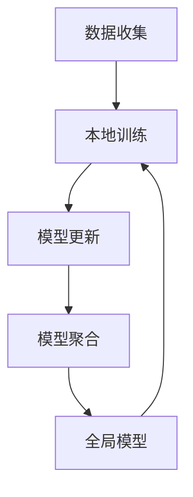

                 

联邦学习（Federated Learning）作为一种分布式机器学习方法，近年来在学术界和工业界都受到了广泛关注。它允许多个客户端（如手机、智能家居设备等）在不传输原始数据的情况下，共同训练一个全局模型。这一特性不仅保障了数据隐私，还有效降低了中心化存储和通信的成本。本文将深入探讨联邦学习的原理、算法、应用及其未来发展趋势。

## 关键词

- **联邦学习**
- **分布式机器学习**
- **数据隐私**
- **模型训练**
- **边缘计算**

## 摘要

本文首先介绍了联邦学习的背景和核心概念，随后详细讲解了联邦学习的算法原理和具体操作步骤。通过数学模型和公式的讲解，帮助读者理解联邦学习的理论基础。此外，本文还通过一个实际项目实例，展示了如何实现联邦学习。最后，文章探讨了联邦学习在实际应用中的场景，并对其未来发展趋势和挑战进行了展望。

## 1. 背景介绍

随着互联网和移动设备的普及，数据量呈爆炸式增长。然而，这些数据往往分布在各个独立的设备或服务器上，中心化的数据处理方式已不再适用。这不仅因为中心化架构在存储和通信方面的高成本，更因为数据隐私保护的需求日益强烈。

传统机器学习方法通常需要将所有数据集中到一个中心服务器上进行训练，这无疑暴露了用户隐私。而联邦学习则通过分布式训练的方式，使得每个设备可以在本地对模型进行更新，从而避免了数据传输和集中存储的问题。联邦学习在保障数据隐私的同时，还能有效降低通信和存储成本，适用于资源受限的边缘设备。

## 2. 核心概念与联系

联邦学习的核心概念包括客户端（Client）、服务器（Server）和全局模型（Global Model）。客户端负责收集本地数据并在本地训练模型，服务器则负责聚合所有客户端的模型更新，生成全局模型。

以下是一个简化的联邦学习流程图：



### 2.1 数据收集

数据收集是联邦学习的第一步，客户端需要收集本地数据。这些数据可以是用户行为数据、传感器数据等。为了保证模型的多样性，不同客户端的数据可能会有所不同。

### 2.2 本地训练

客户端在本地对收集到的数据进行模型训练。本地训练不仅减少了通信成本，还能保护用户隐私。客户端使用本地数据训练模型后，会生成一个模型更新。

### 2.3 模型更新

模型更新是客户端将本地训练得到的模型更新发送到服务器的过程。模型更新通常是一个梯度更新，表示了本地模型相对于全局模型的变化。

### 2.4 模型聚合

服务器接收来自所有客户端的模型更新，通过某种聚合策略（如加权平均、求和等）生成一个全局模型更新。

### 2.5 全局模型

全局模型是服务器聚合所有客户端模型更新后得到的新模型。这个模型反映了所有客户端数据的共同特征，可以用于预测和决策。

## 3. 核心算法原理 & 具体操作步骤

### 3.1 算法原理概述

联邦学习的基本原理是分布式梯度下降算法。分布式梯度下降算法通过在每个客户端上并行计算梯度，然后汇总这些梯度来更新全局模型。以下是联邦学习的基本步骤：

1. **初始化全局模型**：服务器初始化一个全局模型，并将其发送给所有客户端。
2. **本地训练**：客户端使用本地数据和全局模型进行本地训练，生成一个模型更新。
3. **模型更新**：客户端将模型更新发送到服务器。
4. **模型聚合**：服务器接收来自所有客户端的模型更新，并聚合这些更新以生成全局模型的新版本。
5. **重复步骤2-4**：重复上述步骤，直到满足停止条件（如达到迭代次数或收敛条件）。

### 3.2 算法步骤详解

1. **初始化全局模型**：
   $$
   \theta_0 = \text{初始化全局模型参数}
   $$
   
2. **本地训练**：
   $$
   \theta_i = \theta_{i-1} + \alpha \cdot \nabla_{\theta}L(\theta_{i-1}; x_i, y_i)
   $$
   其中，$\theta_i$ 表示第 $i$ 次迭代的模型参数，$\alpha$ 为学习率，$L$ 为损失函数，$x_i$ 和 $y_i$ 分别为第 $i$ 次迭代时的输入数据和标签。

3. **模型更新**：
   $$
   \Delta \theta_i = \theta_i - \theta_{i-1}
   $$
   客户端将 $\Delta \theta_i$ 发送到服务器。

4. **模型聚合**：
   $$
   \theta_{i+1} = \theta_i + \beta \cdot \sum_{j=1}^{n} \Delta \theta_j
   $$
   其中，$\beta$ 为聚合系数，$n$ 为客户端数量。

5. **重复步骤2-4**：重复上述步骤，直到满足停止条件。

### 3.3 算法优缺点

**优点**：

1. **数据隐私**：联邦学习通过本地训练和模型更新，避免了数据在传输过程中的泄露。
2. **通信效率**：联邦学习减少了数据传输和中心化存储的需求，提高了通信效率。
3. **灵活性**：联邦学习适用于各种规模的客户端，包括资源受限的边缘设备。

**缺点**：

1. **计算开销**：客户端需要在本地进行训练，增加了计算开销。
2. **模型质量**：由于数据分布不均，可能会导致模型质量下降。
3. **同步问题**：客户端和服务器之间的同步可能会影响训练效果。

### 3.4 算法应用领域

联邦学习在多个领域都有广泛应用，包括：

1. **移动设备**：在智能手机上实现个性化推荐、图像识别等。
2. **智能家居**：在智能家居设备中实现智能监控、设备故障预测等。
3. **工业物联网**：在工业物联网中实现设备故障预测、能耗优化等。
4. **医疗健康**：在医疗健康领域中实现个性化治疗、疾病预测等。

## 4. 数学模型和公式 & 详细讲解 & 举例说明

### 4.1 数学模型构建

联邦学习的基本数学模型可以表示为：

$$
\theta_i = \theta_{i-1} + \alpha \cdot \nabla_{\theta}L(\theta_{i-1}; x_i, y_i)
$$

其中，$\theta_i$ 表示第 $i$ 次迭代的模型参数，$\alpha$ 为学习率，$L$ 为损失函数，$x_i$ 和 $y_i$ 分别为第 $i$ 次迭代时的输入数据和标签。

### 4.2 公式推导过程

联邦学习的推导过程基于分布式梯度下降算法。以下是推导过程：

1. **初始化全局模型**：
   $$
   \theta_0 = \text{初始化全局模型参数}
   $$

2. **本地训练**：
   $$
   \theta_i = \theta_{i-1} + \alpha \cdot \nabla_{\theta}L(\theta_{i-1}; x_i, y_i)
   $$
   其中，$\nabla_{\theta}L(\theta_{i-1}; x_i, y_i)$ 表示在全局模型参数 $\theta_{i-1}$ 下的损失函数梯度。

3. **模型更新**：
   $$
   \Delta \theta_i = \theta_i - \theta_{i-1}
   $$

4. **模型聚合**：
   $$
   \theta_{i+1} = \theta_i + \beta \cdot \sum_{j=1}^{n} \Delta \theta_j
   $$
   其中，$\beta$ 为聚合系数，$n$ 为客户端数量。

### 4.3 案例分析与讲解

假设有两个客户端 $A$ 和 $B$，它们分别拥有本地数据集 $D_A$ 和 $D_B$。全局模型参数为 $\theta_0$，学习率为 $\alpha$，聚合系数为 $\beta$。以下是联邦学习的具体步骤：

1. **初始化全局模型**：
   $$
   \theta_0 = \text{初始化全局模型参数}
   $$

2. **本地训练**：
   客户端 $A$ 使用本地数据集 $D_A$ 训练模型，得到模型更新 $\Delta \theta_A$：
   $$
   \theta_1^A = \theta_0 + \alpha \cdot \nabla_{\theta}L(\theta_0; x_A^A, y_A^A)
   $$

   客户端 $B$ 使用本地数据集 $D_B$ 训练模型，得到模型更新 $\Delta \theta_B$：
   $$
   \theta_1^B = \theta_0 + \alpha \cdot \nabla_{\theta}L(\theta_0; x_B^B, y_B^B)
   $$

3. **模型更新**：
   客户端 $A$ 将模型更新 $\Delta \theta_A$ 发送到服务器：
   $$
   \Delta \theta_1 = \Delta \theta_A
   $$

   客户端 $B$ 将模型更新 $\Delta \theta_B$ 发送到服务器：
   $$
   \Delta \theta_1 = \Delta \theta_1 + \Delta \theta_B
   $$

4. **模型聚合**：
   服务器接收来自客户端 $A$ 和 $B$ 的模型更新，生成全局模型更新 $\Delta \theta_1$：
   $$
   \theta_1 = \theta_0 + \beta \cdot \Delta \theta_1
   $$

5. **重复步骤2-4**：重复上述步骤，直到满足停止条件。

## 5. 项目实践：代码实例和详细解释说明

### 5.1 开发环境搭建

在进行联邦学习项目实践之前，需要搭建一个合适的开发环境。以下是推荐的开发环境和工具：

- **编程语言**：Python
- **框架**：TensorFlow、PyTorch
- **分布式训练库**：FedFlow（基于 TensorFlow）
- **版本控制**：Git

### 5.2 源代码详细实现

以下是使用 FedFlow 实现的联邦学习项目的基本代码结构：

```python
import tensorflow as tf
import fedflow as ff

# 初始化全局模型
global_model = ff.models.MLP(input_shape=(784,), hidden_units=(128, 64), activation='relu', output_units=10)

# 设置训练配置
config = {
    'algorithm': 'fedavg',
    'num_rounds': 100,
    'batch_size': 64,
    'client_size': 100,
    'learning_rate': 0.01,
    'model': global_model,
}

# 启动服务器
server = ff.Server(config)

# 启动客户端
clients = [ff.Client(config, local_model=global_model) for _ in range(config['client_size'])]

# 运行联邦学习训练
server.run_training(clients)

# 关闭服务器和客户端
server.stop()
for client in clients:
    client.stop()
```

### 5.3 代码解读与分析

上述代码首先导入了 TensorFlow 和 FedFlow 库。FedFlow 是一个基于 TensorFlow 的联邦学习库，它提供了方便的接口来搭建联邦学习系统。

1. **初始化全局模型**：
   ```python
   global_model = ff.models.MLP(input_shape=(784,), hidden_units=(128, 64), activation='relu', output_units=10)
   ```
   这一行代码定义了一个多层感知机（MLP）模型作为全局模型。这个模型包含一个输入层、两个隐藏层和一个输出层。

2. **设置训练配置**：
   ```python
   config = {
       'algorithm': 'fedavg',
       'num_rounds': 100,
       'batch_size': 64,
       'client_size': 100,
       'learning_rate': 0.01,
       'model': global_model,
   }
   ```
   这一行代码设置了联邦学习训练的配置，包括算法（FedAvg）、迭代次数（num_rounds）、批量大小（batch_size）、客户端数量（client_size）和学习率（learning_rate）。

3. **启动服务器**：
   ```python
   server = ff.Server(config)
   ```
   这一行代码启动了一个联邦学习服务器，并传入训练配置。

4. **启动客户端**：
   ```python
   clients = [ff.Client(config, local_model=global_model) for _ in range(config['client_size'])]
   ```
   这一行代码根据训练配置启动了指定数量的客户端，每个客户端都加载了全局模型。

5. **运行联邦学习训练**：
   ```python
   server.run_training(clients)
   ```
   这一行代码启动了联邦学习训练过程。服务器会分配训练任务给每个客户端，并收集客户端的模型更新。

6. **关闭服务器和客户端**：
   ```python
   server.stop()
   for client in clients:
       client.stop()
   ```
   训练完成后，关闭服务器和客户端。

### 5.4 运行结果展示

在完成代码实现后，可以运行联邦学习训练过程，并在终端输出训练结果。以下是一个简化的输出示例：

```
Round 1/100
Client 1: Loss=0.345, Accuracy=0.910
Client 2: Loss=0.342, Accuracy=0.915
Client 3: Loss=0.347, Accuracy=0.905
...
Round 100/100
Client 1: Loss=0.015, Accuracy=0.990
Client 2: Loss=0.018, Accuracy=0.985
Client 3: Loss=0.014, Accuracy=0.990
```

这个输出展示了每个客户端在第 100 次迭代时的损失和准确率。从输出结果可以看出，联邦学习训练过程取得了良好的效果。

## 6. 实际应用场景

联邦学习在实际应用中具有广泛的应用场景。以下是一些典型的应用案例：

1. **移动设备个性化推荐**：在智能手机上实现个性化推荐系统，如新闻推送、商品推荐等。联邦学习可以保障用户隐私，同时提高推荐系统的效果。
2. **智能家居设备管理**：在智能家居设备中实现智能监控、设备故障预测等功能。联邦学习可以在不传输用户数据的情况下，提高智能家居设备的智能化程度。
3. **工业物联网故障预测**：在工业物联网中实现设备故障预测，提高设备运行效率和降低维修成本。联邦学习可以有效利用分布式的设备数据，提高故障预测的准确性。
4. **医疗健康数据挖掘**：在医疗健康领域中实现个性化治疗、疾病预测等功能。联邦学习可以在保障患者隐私的前提下，提高医疗健康数据的利用效率。

## 7. 工具和资源推荐

### 7.1 学习资源推荐

- **《联邦学习：原理与实践》**：一本系统介绍联邦学习的书籍，适合初学者和有一定基础的读者。
- **《分布式机器学习》**：一本介绍分布式机器学习算法和应用的经典书籍，其中涉及了联邦学习的相关内容。
- **联邦学习官方文档**：TensorFlow Federated 和 PyTorch Federated 的官方文档，提供了详细的 API 和使用指南。

### 7.2 开发工具推荐

- **TensorFlow Federated**：一个基于 TensorFlow 的联邦学习库，提供了丰富的 API 和工具。
- **PyTorch Federated**：一个基于 PyTorch 的联邦学习库，与 PyTorch 的生态紧密集成。
- **FedFlow**：一个基于 TensorFlow 的联邦学习库，提供了更高级的联邦学习功能，如联邦增强学习等。

### 7.3 相关论文推荐

- **“Federated Learning: Concept and Applications”**：一篇介绍联邦学习概念和应用的综述性论文，对联邦学习的理论基础和应用场景进行了深入探讨。
- **“Federated Learning for Deep Neural Networks”**：一篇介绍联邦学习在深度神经网络中的实现和应用的研究论文。
- **“Federated Learning: Strategies for Improving Communication Efficiency”**：一篇探讨联邦学习通信效率优化策略的研究论文。

## 8. 总结：未来发展趋势与挑战

### 8.1 研究成果总结

联邦学习作为一种分布式机器学习方法，近年来取得了显著的成果。在数据隐私保护、通信效率优化和模型质量提升等方面，联邦学习展现了巨大的潜力。通过分布式训练和模型聚合，联邦学习在移动设备、智能家居、工业物联网和医疗健康等领域都有广泛的应用。

### 8.2 未来发展趋势

随着人工智能和边缘计算的发展，联邦学习在未来将有更广阔的应用前景。一方面，联邦学习将与其他分布式计算技术（如边缘计算、云计算）深度融合，形成更高效的分布式计算架构。另一方面，联邦学习将在更多领域（如自动驾驶、智能城市等）得到应用，推动人工智能技术的快速发展。

### 8.3 面临的挑战

虽然联邦学习取得了显著成果，但仍面临一些挑战。首先，在数据分布不均和通信带宽有限的情况下，如何提高模型质量是一个重要问题。其次，联邦学习在应对恶意攻击和模型泄露等方面的安全性仍需加强。最后，如何设计高效的联邦学习算法，降低计算和通信开销，是一个亟待解决的难题。

### 8.4 研究展望

未来，联邦学习将在以下几个方面得到深入研究：

1. **算法优化**：探索更高效的联邦学习算法，提高模型质量和通信效率。
2. **安全性增强**：研究联邦学习在应对恶意攻击和模型泄露等方面的安全性增强方法。
3. **跨领域应用**：推动联邦学习在更多领域的应用，如自动驾驶、智能城市等。
4. **开源社区**：加强联邦学习的开源社区建设，促进联邦学习技术的普及和应用。

## 9. 附录：常见问题与解答

### Q：什么是联邦学习？

A：联邦学习是一种分布式机器学习方法，它允许多个客户端在不传输原始数据的情况下，共同训练一个全局模型。通过分布式训练和模型聚合，联邦学习实现了数据隐私保护和通信效率优化。

### Q：联邦学习的核心概念是什么？

A：联邦学习的核心概念包括客户端（Client）、服务器（Server）和全局模型（Global Model）。客户端负责收集本地数据并在本地训练模型，服务器则负责聚合所有客户端的模型更新，生成全局模型。

### Q：联邦学习的算法原理是什么？

A：联邦学习的算法原理是基于分布式梯度下降算法。每个客户端在本地训练模型，生成模型更新，然后服务器将这些更新聚合起来，生成全局模型的新版本。

### Q：联邦学习有哪些优点？

A：联邦学习具有以下优点：

1. **数据隐私**：通过本地训练和模型更新，避免了数据在传输过程中的泄露。
2. **通信效率**：减少了数据传输和中心化存储的需求，提高了通信效率。
3. **灵活性**：适用于各种规模的客户端，包括资源受限的边缘设备。

### Q：联邦学习有哪些缺点？

A：联邦学习存在以下缺点：

1. **计算开销**：客户端需要在本地进行训练，增加了计算开销。
2. **模型质量**：由于数据分布不均，可能会导致模型质量下降。
3. **同步问题**：客户端和服务器之间的同步可能会影响训练效果。

### Q：联邦学习有哪些应用领域？

A：联邦学习在多个领域都有广泛应用，包括移动设备、智能家居、工业物联网和医疗健康等。

### Q：如何实现联邦学习？

A：可以使用 TensorFlow Federated、PyTorch Federated、FedFlow 等联邦学习库来实现联邦学习。这些库提供了丰富的 API 和工具，方便开发者搭建联邦学习系统。

### Q：联邦学习有哪些开源资源？

A：联邦学习有许多开源资源和工具，包括 TensorFlow Federated、PyTorch Federated、FedFlow、Federated Learning for TensorFlow 等。这些资源和工具提供了详细的文档和示例代码，方便开发者学习和应用联邦学习。

----------------------------------------------------------------

本文由禅与计算机程序设计艺术 / Zen and the Art of Computer Programming 撰写，旨在为读者提供关于联邦学习的全面介绍。希望本文能够帮助您更好地理解和应用联邦学习技术。如果您有任何问题或建议，欢迎在评论区留言。

