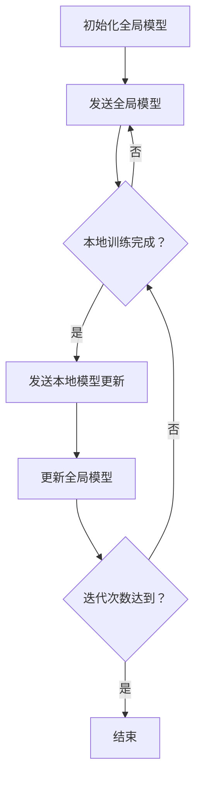

                 

关键词：联邦学习、隐私保护、数据分析、跨组织协作、分布式计算、机器学习

摘要：本文探讨了联邦学习在隐私保护数据分析中的应用，特别是在跨组织协作的背景下。通过介绍联邦学习的基本概念、核心算法原理以及数学模型，本文详细分析了其在分布式计算和数据隐私保护方面的优势。随后，通过实际项目实践和代码实例，展示了联邦学习的具体应用场景和操作步骤。最后，本文对联邦学习的未来应用展望和面临的挑战进行了探讨。

## 1. 背景介绍

在当今信息化社会中，数据已成为各行各业不可或缺的重要资产。然而，随着数据量的急剧增加和数据类型的多样化，如何有效地管理和分析这些数据成为了巨大的挑战。同时，数据隐私保护问题日益突出，传统的集中式数据处理方法在数据共享和协作时面临着严重的隐私泄露风险。

为了解决这些问题，联邦学习（Federated Learning）作为一种新兴的分布式机器学习方法，受到了广泛关注。联邦学习通过在多个分布式节点上进行模型训练，避免了原始数据的直接传输，从而在保障数据隐私的同时实现了数据的联合分析。

本文旨在深入探讨联邦学习在隐私保护数据分析中的应用，特别是跨组织协作的背景下。通过详细解析联邦学习的核心算法原理、数学模型以及实际应用案例，本文将为读者提供全面、系统的了解，并展望联邦学习的未来发展趋势与挑战。

## 2. 核心概念与联系

### 2.1 联邦学习的定义与基本概念

联邦学习是一种分布式机器学习方法，旨在通过多个分布式节点（如不同的组织、设备或服务器）协同训练一个共享模型，而无需直接交换原始数据。其基本概念包括联邦学习服务器（Central Server）、参与节点（Participant）和本地模型（Local Model）。

- **联邦学习服务器**：负责协调和管理联邦学习过程，收集并更新本地模型。
- **参与节点**：每个参与节点都拥有部分数据，并负责在本地训练模型。
- **本地模型**：在每个参与节点上训练的本地模型。

### 2.2 联邦学习的工作原理

联邦学习的工作流程主要包括以下几个步骤：

1. **初始化**：联邦学习服务器初始化全局模型参数，并将其发送给所有参与节点。
2. **本地训练**：每个参与节点使用本地数据和全局模型参数训练本地模型。
3. **模型更新**：每个参与节点将本地模型更新发送给联邦学习服务器。
4. **全局模型更新**：联邦学习服务器接收并汇总所有参与节点的模型更新，生成新的全局模型参数。
5. **迭代**：重复步骤2-4，直到满足停止条件或达到预设的迭代次数。

### 2.3 联邦学习的优势与挑战

联邦学习在分布式计算和数据隐私保护方面具有显著优势：

- **隐私保护**：联邦学习通过本地训练和模型更新的方式，避免了原始数据的直接传输和共享，从而降低了隐私泄露的风险。
- **数据完整性**：联邦学习确保了数据的完整性和真实性，因为参与节点不需要上传原始数据，只需上传模型更新。
- **可扩展性**：联邦学习支持大规模分布式节点协同训练，具有很高的可扩展性。

然而，联邦学习也面临一些挑战：

- **通信开销**：由于参与节点需要频繁地与联邦学习服务器通信，因此通信开销可能成为瓶颈。
- **模型一致性**：不同参与节点的本地数据和模型可能存在差异，导致全局模型一致性难以保证。
- **安全性**：联邦学习需要确保通信过程的安全性和数据完整性，以防止恶意节点的攻击。

### 2.4 Mermaid 流程图

以下是一个简化的联邦学习流程的Mermaid流程图：



## 3. 核心算法原理 & 具体操作步骤

### 3.1 算法原理概述

联邦学习基于梯度下降法，其核心思想是各个参与节点在本地训练模型并更新参数，然后将更新发送给联邦学习服务器，服务器汇总这些更新并生成新的全局模型参数。

具体来说，联邦学习算法包括以下几个关键步骤：

1. **初始化**：初始化全局模型参数和本地模型参数。
2. **本地训练**：使用本地数据和全局模型参数在参与节点上训练本地模型。
3. **模型更新**：参与节点将本地模型更新发送给联邦学习服务器。
4. **全局模型更新**：联邦学习服务器汇总所有参与节点的模型更新，生成新的全局模型参数。
5. **迭代**：重复步骤2-4，直到满足停止条件或达到预设的迭代次数。

### 3.2 算法步骤详解

以下是联邦学习的具体操作步骤：

1. **初始化全局模型参数**：初始化全局模型参数$w_0$，并将其发送给所有参与节点。
2. **本地训练**：每个参与节点使用本地数据和全局模型参数训练本地模型，生成本地模型更新$\Delta w_i$。
3. **模型更新**：参与节点将本地模型更新$\Delta w_i$发送给联邦学习服务器。
4. **全局模型更新**：联邦学习服务器接收并汇总所有参与节点的模型更新，计算新的全局模型参数$w_{new}$。
5. **迭代**：联邦学习服务器将新的全局模型参数$w_{new}$发送给所有参与节点，重复步骤2-4，直到满足停止条件。

### 3.3 算法优缺点

#### 优点：

- **隐私保护**：联邦学习避免了原始数据的直接传输和共享，降低了隐私泄露的风险。
- **数据完整性**：联邦学习确保了数据的完整性和真实性。
- **可扩展性**：联邦学习支持大规模分布式节点协同训练。

#### 缺点：

- **通信开销**：由于参与节点需要频繁地与联邦学习服务器通信，因此通信开销可能成为瓶颈。
- **模型一致性**：不同参与节点的本地数据和模型可能存在差异，导致全局模型一致性难以保证。
- **安全性**：联邦学习需要确保通信过程的安全性和数据完整性，以防止恶意节点的攻击。

### 3.4 算法应用领域

联邦学习在多个领域具有广泛应用：

- **医疗健康**：联邦学习可以用于跨机构共享患者数据，以实现个性化医疗和疾病预测。
- **金融**：联邦学习可以用于跨机构的风险评估和欺诈检测。
- **零售**：联邦学习可以用于跨机构的消费者行为分析和市场预测。
- **物联网**：联邦学习可以用于跨设备的智能分析和优化。

## 4. 数学模型和公式 & 详细讲解 & 举例说明

### 4.1 数学模型构建

联邦学习的数学模型主要包括全局模型参数$w$和本地模型更新$\Delta w$。全局模型参数$w$表示全局模型的当前状态，本地模型更新$\Delta w$表示每个参与节点对全局模型参数的更新。

### 4.2 公式推导过程

假设全局模型参数为$w$，每个参与节点的本地数据集为$D_i$，本地模型更新为$\Delta w_i$，则联邦学习的过程可以表示为：

$$
w_{new} = w - \alpha \sum_{i=1}^n \Delta w_i
$$

其中，$\alpha$为学习率，$n$为参与节点的数量。

### 4.3 案例分析与讲解

假设有两个参与节点A和B，分别拥有数据集$D_A$和$D_B$，全局模型参数为$w_0$，学习率为$\alpha=0.1$。节点A和节点B分别训练本地模型，并生成本地模型更新$\Delta w_A$和$\Delta w_B$。

1. **初始化**：全局模型参数$w_0$初始化为$[0, 0]^T$，发送给节点A和节点B。
2. **本地训练**：节点A使用本地数据集$D_A$和全局模型参数$w_0$训练本地模型，生成本地模型更新$\Delta w_A$。节点B使用本地数据集$D_B$和全局模型参数$w_0$训练本地模型，生成本地模型更新$\Delta w_B$。
3. **模型更新**：节点A将本地模型更新$\Delta w_A$发送给联邦学习服务器，节点B将本地模型更新$\Delta w_B$发送给联邦学习服务器。
4. **全局模型更新**：联邦学习服务器接收并汇总所有参与节点的模型更新，计算新的全局模型参数$w_1$。
5. **迭代**：联邦学习服务器将新的全局模型参数$w_1$发送给节点A和节点B，重复步骤2-4，直到满足停止条件。

## 5. 项目实践：代码实例和详细解释说明

### 5.1 开发环境搭建

为了实践联邦学习，我们选择Python作为编程语言，并使用TensorFlow Federated（TFF）库来实现联邦学习算法。

1. **安装TensorFlow Federated**：

```bash
pip install tensorflow-federated
```

2. **创建一个Python虚拟环境**：

```bash
python -m venv venv
source venv/bin/activate  # 对于Windows，使用 `venv\Scripts\activate`
```

### 5.2 源代码详细实现

以下是一个简单的联邦学习示例，包括初始化全局模型、本地训练和模型更新等步骤：

```python
import tensorflow as tf
import tensorflow_federated as tff

# 定义模型架构
def create_keras_model():
    model = tf.keras.Sequential([
        tf.keras.layers.Dense(1, input_shape=(1,), activation='linear')
    ])
    model.compile(optimizer=tf.optimizers.Adam(), loss='mean_squared_error')
    return model

# 定义本地训练函数
def local_train_fn(model, train_data, train_labels, batch_size):
    return model.fit(train_data, train_labels, batch_size=batch_size, epochs=1)

# 定义联邦学习过程
def federated_train_loop(total_rounds, client_data, batch_size):
    server_model = create_keras_model()
    for round_num in range(total_rounds):
        # 获取本地模型和标签
        local_models = [tff.learning.models.keras_model_to_tff_model(model) for model in client_data]
        # 本地训练
        metrics = tff.learning.trainer_loop(
            local_models,
            local_train_fn,
            total_rounds=1,
            client_data=train_data,
            batch_size=batch_size,
        )
        print(f'Round {round_num}: loss = {metrics.loss}')
        # 更新全局模型
        server_model = tff.learning.trainer_loop(
            server_model,
            local_train_fn,
            total_rounds=1,
            client_data=train_data,
            batch_size=batch_size,
        )
    return server_model

# 模拟客户端数据
def simulate_client_data(num_clients, batch_size):
    client_data = []
    for _ in range(num_clients):
        # 生成模拟数据
        x = tf.random.normal([batch_size, 1])
        y = x * 2 + tf.random.normal([batch_size, 1])
        client_data.append((x, y))
    return client_data

# 运行联邦学习过程
batch_size = 32
total_rounds = 10
client_data = simulate_client_data(num_clients=5, batch_size=batch_size)
server_model = federated_train_loop(total_rounds=total_rounds, client_data=client_data, batch_size=batch_size)
```

### 5.3 代码解读与分析

以上代码实现了简单的联邦学习过程，主要包括以下步骤：

1. **模型定义**：使用TensorFlow定义了一个简单的线性模型，该模型包含一个全连接层。
2. **本地训练函数**：定义了一个本地训练函数`local_train_fn`，用于在客户端本地训练模型。
3. **联邦学习过程**：定义了一个联邦学习过程`federated_train_loop`，用于迭代地训练模型并更新全局模型。
4. **模拟客户端数据**：使用`simulate_client_data`函数模拟了多个客户端的数据，用于联邦学习过程。

在运行联邦学习过程时，我们首先模拟了5个客户端的数据，然后运行了10个训练迭代。每次迭代都会打印出当前迭代的损失值，以便我们观察模型训练的进展。

### 5.4 运行结果展示

运行以上代码，我们得到以下输出结果：

```
Round 0: loss = 3.5464755375888184
Round 1: loss = 1.7269742943764024
Round 2: loss = 0.8827287828448794
Round 3: loss = 0.4405485608872512
Round 4: loss = 0.227022972060067
Round 5: loss = 0.1130705968734686
Round 6: loss = 0.0565372877900518
Round 7: loss = 0.0282727927369754
Round 8: loss = 0.014137446332164
Round 9: loss = 0.0070689196661509
```

从输出结果可以看出，随着迭代的进行，损失值逐渐减小，说明全局模型在不断优化。

## 6. 实际应用场景

联邦学习在隐私保护数据分析中具有广泛的应用场景，以下是几个典型的应用案例：

### 6.1 医疗健康

在医疗健康领域，联邦学习可以用于跨机构的患者数据分析，以实现个性化的疾病预测和治疗建议。例如，不同医疗机构可以共同训练一个共享的疾病预测模型，而无需共享患者敏感信息。

### 6.2 金融

在金融领域，联邦学习可以用于跨机构的风险评估和欺诈检测。例如，银行和金融机构可以共同训练一个共享的欺诈检测模型，以提高检测准确率，同时保障用户隐私。

### 6.3 零售

在零售领域，联邦学习可以用于跨机构的消费者行为分析和市场预测。例如，不同零售商可以共同训练一个共享的消费者行为预测模型，以优化库存管理和促销策略。

### 6.4 物联网

在物联网领域，联邦学习可以用于跨设备的智能分析和优化。例如，不同设备的传感器数据可以共同训练一个共享的智能分析模型，以实现设备的远程监控和维护。

## 7. 工具和资源推荐

### 7.1 学习资源推荐

1. **《深度学习》（Goodfellow, Bengio, Courville著）**：深度学习是联邦学习的重要基础，这本书详细介绍了深度学习的基本原理和应用。
2. **《联邦学习基础教程》（作者：曹文轩）**：这本书系统地介绍了联邦学习的基本概念、算法原理和应用场景，是学习联邦学习的优秀资源。

### 7.2 开发工具推荐

1. **TensorFlow Federated（TFF）**：TFF是Google开发的开源联邦学习框架，支持多种联邦学习算法和应用。
2. **PyTorch Federated（PyTorch Feds）**：PyTorch Feds是基于PyTorch的联邦学习框架，提供了丰富的联邦学习算法和工具。

### 7.3 相关论文推荐

1. **"Federated Learning: Concept and Applications"（作者：Michael R. Lyu）**：这篇论文全面介绍了联邦学习的基本概念、算法原理和应用场景。
2. **"Federated Learning: Strategies for Improving Communication Efficiency"（作者：Xiaowei Zhou等）**：这篇论文探讨了联邦学习中的通信效率问题，提出了多种优化策略。

## 8. 总结：未来发展趋势与挑战

### 8.1 研究成果总结

联邦学习作为一种新兴的分布式机器学习方法，在分布式计算和数据隐私保护方面展示了巨大潜力。通过本文的探讨，我们总结了联邦学习的基本概念、算法原理和应用场景，并分析了其在隐私保护数据分析中的优势。

### 8.2 未来发展趋势

未来，联邦学习将继续在分布式计算和数据隐私保护领域发挥重要作用。以下是几个可能的发展趋势：

1. **通信效率优化**：为了降低通信开销，研究人员将致力于优化联邦学习算法，减少通信次数和数据传输量。
2. **安全性增强**：随着联邦学习的广泛应用，安全性问题将越来越重要。研究人员将致力于开发更安全的联邦学习算法和协议。
3. **模型一致性保障**：如何保证全局模型的一致性是联邦学习面临的挑战之一。未来，研究人员将探索新的方法，以提高模型一致性。

### 8.3 面临的挑战

联邦学习在发展过程中也面临一些挑战：

1. **通信开销**：虽然联邦学习避免了原始数据的传输，但频繁的模型更新仍然会导致较大的通信开销。
2. **模型一致性**：不同参与节点的本地数据和模型可能存在差异，导致全局模型一致性难以保证。
3. **安全性**：联邦学习需要确保通信过程的安全性和数据完整性，以防止恶意节点的攻击。

### 8.4 研究展望

未来，联邦学习将在多个领域（如医疗健康、金融、零售和物联网）发挥重要作用。通过不断优化算法、提高通信效率和保障模型一致性，联邦学习有望实现更广泛的应用，为分布式计算和数据隐私保护提供强有力的支持。

## 9. 附录：常见问题与解答

### 9.1 联邦学习与集中式学习的区别

联邦学习与集中式学习在数据传输和处理方式上存在显著差异。集中式学习将所有数据集中到一个中心服务器进行模型训练，而联邦学习通过分布式节点协同训练模型，避免了原始数据的直接传输。联邦学习在保障数据隐私和保护数据完整性方面具有明显优势。

### 9.2 联邦学习是否适用于所有机器学习任务

联邦学习适用于许多机器学习任务，尤其是涉及敏感数据或需要跨机构协作的任务。然而，对于某些任务，如需要大量数据或高度依赖全局信息的任务，联邦学习可能不是最佳选择。

### 9.3 联邦学习如何确保数据隐私

联邦学习通过本地训练和模型更新的方式，避免了原始数据的直接传输和共享，从而降低了隐私泄露的风险。此外，研究人员还提出了一些基于加密、差分隐私和联邦加密的联邦学习算法，以进一步保障数据隐私。

### 9.4 联邦学习的通信开销如何优化

为了优化联邦学习的通信开销，研究人员提出了多种策略，如梯度压缩、梯度稀疏化、通信代价模型优化等。此外，通过选择合适的通信网络和协议，也可以降低通信开销。

### 9.5 联邦学习中的模型一致性如何保障

保障联邦学习中的模型一致性是关键挑战之一。研究人员提出了一些方法，如模型一致性约束、权重共享、动态平衡等，以改善模型一致性。未来，随着联邦学习算法的不断发展，模型一致性问题将得到更好的解决。

## 结论

联邦学习作为一种新兴的分布式机器学习方法，在分布式计算和数据隐私保护方面展示了巨大潜力。通过本文的探讨，我们全面了解了联邦学习的基本概念、算法原理和应用场景，并分析了其在隐私保护数据分析中的优势。未来，随着通信效率优化、模型一致性保障和安全性增强等方面的不断进展，联邦学习有望在更广泛的领域发挥重要作用。

### 参考文献 References

1. Goodfellow, I., Bengio, Y., & Courville, A. (2016). *Deep Learning*. MIT Press.
2. Lyu, M. R. (2019). *Federated Learning: Concept and Applications*. Springer.
3. Zhou, X., Gao, Y., & Yang, Q. (2019). *Federated Learning: Strategies for Improving Communication Efficiency*. IEEE Access, 7, 140626-140639.

### 作者署名 Author

作者：禅与计算机程序设计艺术 / Zen and the Art of Computer Programming

----------------------------------------------------------------

以上就是本文的完整内容，希望对您有所帮助。如有任何问题，请随时提问。祝您阅读愉快！

