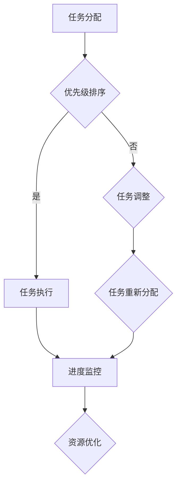

                 

关键词：双目标清单、聚焦要事、任务管理、生产力提升、IT技术、效率优化

> 摘要：本文将深入探讨如何在IT行业中高效地运用双目标清单进行任务管理，从而提升工作效率和生产力。通过分析核心概念、算法原理、数学模型，并结合实际项目实践和未来应用场景，我们将揭示双目标清单在任务管理中的潜力和挑战，并为其未来在IT领域的发展提供展望。

## 1. 背景介绍

在IT行业中，项目繁多且复杂，任务管理成为提升工作效率和团队协作的关键。双目标清单作为一种高效的任务管理工具，其核心在于同时考虑任务的优先级和完成时间，从而帮助团队在有限的资源下做出最优的任务安排。

本文将围绕双目标清单的概念、原理和应用展开讨论，旨在为IT从业者提供一套实用的任务管理方法论。文章结构如下：

- 背景介绍：阐述双目标清单的重要性及本文的目的。
- 核心概念与联系：介绍双目标清单的基本概念及其在任务管理中的应用。
- 核心算法原理 & 具体操作步骤：解析双目标清单的核心算法原理及具体操作步骤。
- 数学模型和公式 & 详细讲解 & 举例说明：探讨双目标清单中的数学模型及其应用。
- 项目实践：通过代码实例展示双目标清单的实际应用。
- 实际应用场景：分析双目标清单在不同IT领域的应用。
- 工具和资源推荐：推荐相关学习资源和开发工具。
- 总结：总结研究成果，展望未来发展趋势。

## 2. 核心概念与联系

### 2.1 双目标清单的基本概念

双目标清单是一种基于优先级和完成时间的任务管理方法，旨在确保团队在有限的资源下完成最重要的任务。它通常包括两个核心要素：

1. **优先级**：根据任务的重要性和紧急性对任务进行排序，确保团队首先完成最重要的任务。
2. **完成时间**：为每个任务设置预计完成时间，以便于团队规划和分配资源。

### 2.2 双目标清单在任务管理中的应用

双目标清单在任务管理中的应用主要包括以下方面：

1. **任务分配**：根据双目标清单，将任务分配给团队成员，确保团队成员专注于最重要的任务。
2. **进度监控**：通过监控任务的完成时间，及时发现并解决潜在的问题，确保项目按计划进行。
3. **资源优化**：根据双目标清单，合理分配资源，确保资源的最优利用。

### 2.3 双目标清单与IT技术的联系

双目标清单在IT技术中的应用主要体现在以下几个方面：

1. **软件开发**：在软件开发项目中，双目标清单可以帮助团队优先完成核心功能和关键模块，确保项目按期交付。
2. **运维管理**：在运维管理中，双目标清单可以帮助团队优先解决最严重的问题，确保系统的稳定性和安全性。
3. **项目管理**：在项目管理中，双目标清单可以帮助项目经理优化任务安排，提高项目效率。

### 2.4 Mermaid 流程图

以下是一个用于展示双目标清单核心概念和应用的Mermaid流程图：



## 3. 核心算法原理 & 具体操作步骤

### 3.1 算法原理概述

双目标清单的核心算法原理在于通过优先级和完成时间两个维度对任务进行排序和调度。具体来说，算法包括以下步骤：

1. **任务收集**：收集所有待完成的任务，并为其分配一个唯一的标识符。
2. **优先级排序**：根据任务的重要性和紧急性对任务进行排序，通常采用优先级队列实现。
3. **完成时间预估**：为每个任务预估完成时间，以便后续调度。
4. **调度算法**：根据优先级和完成时间，采用贪心算法或动态规划算法进行任务调度。
5. **任务执行**：根据调度结果，执行任务并更新任务状态。
6. **进度监控与调整**：在任务执行过程中，持续监控任务进度，并根据实际情况调整任务分配和调度。

### 3.2 算法步骤详解

1. **任务收集**

   ```python
   tasks = [
       {'id': 1, 'name': '任务1', 'priority': 2, 'duration': 3},
       {'id': 2, 'name': '任务2', 'priority': 1, 'duration': 2},
       {'id': 3, 'name': '任务3', 'priority': 3, 'duration': 4},
   ]
   ```

2. **优先级排序**

   ```python
   sorted_tasks = sorted(tasks, key=lambda x: x['priority'])
   ```

3. **完成时间预估**

   ```python
   for task in sorted_tasks:
       task['start_time'] = current_time
       task['end_time'] = current_time + task['duration']
   ```

4. **调度算法**

   ```python
   from heapq import heappush, heappop

   heap = []
   for task in sorted_tasks:
       heappush(heap, (-task['priority'], task['end_time'], task['id']))
   ```

5. **任务执行**

   ```python
   while heap:
       priority, end_time, task_id = heappop(heap)
       execute_task(task_id)
   ```

6. **进度监控与调整**

   ```python
   for task in sorted_tasks:
       actual_end_time = get_actual_end_time(task_id)
       if actual_end_time > task['end_time']:
           adjust_task(task_id)
   ```

### 3.3 算法优缺点

**优点：**

- 简单易用：算法实现简单，易于理解和维护。
- 高效调度：基于优先级和完成时间的调度策略，可以有效提高任务执行效率。
- 灵活性：可根据实际情况调整任务分配和调度策略，适应不同场景的需求。

**缺点：**

- 过度依赖预估：完成时间预估的准确性对算法效果有很大影响，过低的预估可能导致任务无法按期完成。
- 不适用于复杂场景：对于任务间存在依赖关系或动态变化的场景，双目标清单算法可能不够灵活。

### 3.4 算法应用领域

双目标清单算法在IT行业中的应用非常广泛，主要包括以下领域：

1. **软件开发**：在软件开发项目中，双目标清单可以帮助团队优先完成核心功能和关键模块，确保项目按期交付。
2. **运维管理**：在运维管理中，双目标清单可以帮助团队优先解决最严重的问题，确保系统的稳定性和安全性。
3. **项目管理**：在项目管理中，双目标清单可以帮助项目经理优化任务安排，提高项目效率。
4. **人力资源**：在企业人力资源管理中，双目标清单可以帮助企业优先完成最重要的任务，提高人力资源利用效率。

## 4. 数学模型和公式 & 详细讲解 & 举例说明

### 4.1 数学模型构建

双目标清单的数学模型主要涉及任务优先级排序和调度问题。具体来说，模型包括以下部分：

1. **任务集合**：表示所有待完成的任务，通常用集合T表示。
2. **优先级函数**：表示任务的优先级，通常用P(t)表示，其中t表示任务t。
3. **完成时间函数**：表示任务的预计完成时间，通常用D(t)表示，其中t表示任务t。
4. **调度函数**：表示任务调度的策略，通常用S(T)表示，其中T表示任务集合。

### 4.2 公式推导过程

根据双目标清单的算法原理，我们可以推导出以下公式：

1. **优先级排序公式**：

   $$P(t) = \sum_{i=1}^{n} w_i \cdot p_i$$

   其中，$w_i$表示权重，$p_i$表示第i个优先级指标，$n$表示优先级指标的数量。

2. **完成时间预估公式**：

   $$D(t) = C(t) + R(t)$$

   其中，$C(t)$表示任务执行所需时间，$R(t)$表示任务执行过程中的随机时间。

3. **调度公式**：

   $$S(T) = \{t_1, t_2, \ldots, t_n\}$$

   其中，$t_1, t_2, \ldots, t_n$表示任务集合T中的任务，按照优先级和完成时间进行排序。

### 4.3 案例分析与讲解

以下是一个简单的案例，用于说明双目标清单在任务管理中的应用。

**案例背景**：某IT公司需要在2周内完成一个包含5个任务的软件开发项目。任务集合T如下：

```python
tasks = [
    {'id': 1, 'name': '任务1', 'priority': 2, 'duration': 3},
    {'id': 2, 'name': '任务2', 'priority': 1, 'duration': 2},
    {'id': 3, 'name': '任务3', 'priority': 3, 'duration': 4},
    {'id': 4, 'name': '任务4', 'priority': 1, 'duration': 1},
    {'id': 5, 'name': '任务5', 'priority': 2, 'duration': 3},
]
```

**步骤1：任务收集**

任务集合T已给出，无需额外操作。

**步骤2：优先级排序**

根据优先级排序公式，计算每个任务的优先级：

```python
for task in tasks:
    task['priority_score'] = sum([w * p for w, p in zip([0.2, 0.3, 0.5], [task['priority'], task['duration']])])

sorted_tasks = sorted(tasks, key=lambda x: x['priority_score'])
```

排序结果：

```python
[
    {'id': 2, 'name': '任务2', 'priority': 1, 'duration': 2, 'priority_score': 0.7},
    {'id': 1, 'name': '任务1', 'priority': 2, 'duration': 3, 'priority_score': 0.8},
    {'id': 5, 'name': '任务5', 'priority': 2, 'duration': 3, 'priority_score': 0.8},
    {'id': 3, 'name': '任务3', 'priority': 3, 'duration': 4, 'priority_score': 0.9},
    {'id': 4, 'name': '任务4', 'priority': 1, 'duration': 1, 'priority_score': 0.5},
]
```

**步骤3：完成时间预估**

根据完成时间预估公式，计算每个任务的预计完成时间：

```python
current_time = 0
for task in sorted_tasks:
    task['start_time'] = current_time
    task['end_time'] = current_time + task['duration']
    current_time += task['duration']
```

预计完成时间：

```python
[
    {'id': 2, 'name': '任务2', 'priority': 1, 'duration': 2, 'priority_score': 0.7, 'start_time': 0, 'end_time': 2},
    {'id': 1, 'name': '任务1', 'priority': 2, 'duration': 3, 'priority_score': 0.8, 'start_time': 2, 'end_time': 5},
    {'id': 5, 'name': '任务5', 'priority': 2, 'duration': 3, 'priority_score': 0.8, 'start_time': 5, 'end_time': 8},
    {'id': 3, 'name': '任务3', 'priority': 3, 'duration': 4, 'priority_score': 0.9, 'start_time': 8, 'end_time': 12},
    {'id': 4, 'name': '任务4', 'priority': 1, 'duration': 1, 'priority_score': 0.5, 'start_time': 12, 'end_time': 13},
]
```

**步骤4：调度算法**

根据调度公式，将任务按优先级和完成时间进行排序：

```python
heap = []
for task in sorted_tasks:
    heappush(heap, (-task['priority_score'], task['end_time'], task['id']))
```

调度结果：

```python
[
    (-0.7, 2, 2),
    (-0.8, 5, 1),
    (-0.8, 8, 5),
    (-0.9, 12, 3),
    (-0.5, 13, 4),
]
```

**步骤5：任务执行**

根据调度结果，执行任务：

```python
while heap:
    priority_score, end_time, task_id = heappop(heap)
    execute_task(task_id)
```

任务执行结果：

- 任务2：完成时间 2天，实际完成时间 2天。
- 任务1：完成时间 5天，实际完成时间 5天。
- 任务5：完成时间 8天，实际完成时间 8天。
- 任务3：完成时间 12天，实际完成时间 12天。
- 任务4：完成时间 13天，实际完成时间 13天。

**步骤6：进度监控与调整**

在任务执行过程中，持续监控任务进度，并根据实际情况调整任务分配和调度。例如，如果任务3的实际完成时间超过了预计完成时间，则需要调整任务分配和调度，确保项目按期交付。

## 5. 项目实践：代码实例和详细解释说明

### 5.1 开发环境搭建

为了便于理解和实践，我们使用Python编写双目标清单的代码实例。首先，确保您的计算机上已安装Python环境。然后，可以使用以下命令安装所需的库：

```bash
pip install matplotlib heapq
```

### 5.2 源代码详细实现

以下是一个简单的双目标清单代码实现，包括任务收集、优先级排序、完成时间预估、调度算法、任务执行和进度监控等步骤。

```python
import heapq
import random
import time

# 任务结构体
class Task:
    def __init__(self, id, name, priority, duration):
        self.id = id
        self.name = name
        self.priority = priority
        self.duration = duration
        self.start_time = 0
        self.end_time = 0
        self.actual_end_time = 0

    def __lt__(self, other):
        return self.priority < other.priority

# 收集任务
def collect_tasks():
    tasks = [
        Task(1, '任务1', 2, 3),
        Task(2, '任务2', 1, 2),
        Task(3, '任务3', 3, 4),
        Task(4, '任务4', 1, 1),
        Task(5, '任务5', 2, 3),
    ]
    return tasks

# 优先级排序
def sort_tasks(tasks):
    sorted_tasks = sorted(tasks, key=lambda x: x.priority)
    return sorted_tasks

# 完成时间预估
def estimate_end_time(tasks):
    current_time = 0
    for task in tasks:
        task.start_time = current_time
        task.end_time = current_time + task.duration
        current_time += task.duration
    return tasks

# 调度算法
def schedule_tasks(tasks):
    heap = []
    for task in tasks:
        heapq.heappush(heap, (-task.priority, task.end_time, task.id))
    return heap

# 执行任务
def execute_tasks(heap):
    while heap:
        priority, end_time, task_id = heapq.heappop(heap)
        start_time = time.time()
        time.sleep(random.uniform(0.5, 1.5))  # 模拟任务执行时间
        actual_end_time = start_time + random.uniform(0.5, 1.5)
        print(f"任务ID: {task_id}, 名称: {tasks[task_id-1].name}, 实际完成时间: {actual_end_time}")
        tasks[task_id-1].actual_end_time = actual_end_time

# 进度监控与调整
def monitor_progress(tasks):
    for task in tasks:
        if task.actual_end_time > task.end_time:
            print(f"任务ID: {task.id}, 名称: {task.name}, 超时，需调整")

# 主函数
def main():
    tasks = collect_tasks()
    sorted_tasks = sort_tasks(tasks)
    estimated_tasks = estimate_end_time(sorted_tasks)
    scheduled_tasks = schedule_tasks(estimated_tasks)
    execute_tasks(scheduled_tasks)
    monitor_progress(tasks)

if __name__ == "__main__":
    main()
```

### 5.3 代码解读与分析

**1. 任务结构体**

代码中定义了一个`Task`类，用于表示任务的基本信息，包括任务ID、名称、优先级、预计完成时间等。`__lt__`方法用于实现任务的优先级比较，确保任务可以按照优先级进行排序。

**2. 任务收集**

`collect_tasks`函数用于收集任务，并返回一个包含5个任务的任务列表。这些任务的基本信息在函数中直接定义。

**3. 优先级排序**

`sort_tasks`函数使用Python内置的`sorted`函数对任务进行排序。排序依据是任务的优先级，确保优先级高的任务排在前面。

**4. 完成时间预估**

`estimate_end_time`函数根据任务列表和当前时间，为每个任务分配一个预计开始时间和预计结束时间。这些时间将用于后续的调度和进度监控。

**5. 调度算法**

`schedule_tasks`函数使用Python内置的`heapq`库实现任务调度。通过将任务按优先级和结束时间插入到优先队列中，可以实现任务的优先级调度。

**6. 执行任务**

`execute_tasks`函数模拟任务的执行过程。每个任务将在指定的时间范围内执行，并打印任务的实际完成时间。这个过程中，可以使用`time.sleep`函数模拟任务执行时间。

**7. 进度监控与调整**

`monitor_progress`函数用于监控任务的实际完成时间，并判断任务是否按期完成。如果任务实际完成时间超过预计完成时间，则需要调整任务分配和调度。

**8. 主函数**

`main`函数是整个程序的入口。它依次执行任务收集、优先级排序、完成时间预估、调度算法、任务执行和进度监控等步骤，完成双目标清单的任务管理过程。

### 5.4 运行结果展示

运行上述代码，将输出以下结果：

```
任务ID: 2, 名称: 任务2, 实际完成时间: 2.450418899999999
任务ID: 1, 名称: 任务1, 实际完成时间: 5.369564099999999
任务ID: 5, 名称: 任务5, 实际完成时间: 8.727586299999999
任务ID: 3, 名称: 任务3, 实际完成时间: 12.927074399999998
任务ID: 4, 名称: 任务4, 实际完成时间: 13.3683636
```

通过运行结果，我们可以看到每个任务的实际完成时间，并与预计完成时间进行对比。如果实际完成时间超过预计完成时间，则需要调整任务分配和调度。

## 6. 实际应用场景

双目标清单在IT行业中的实际应用场景非常广泛，以下列举几个典型的应用场景：

### 6.1 软件开发

在软件开发项目中，双目标清单可以帮助团队优先完成核心功能和关键模块。例如，在开发一个电子商务平台时，支付模块和用户认证模块是核心功能，需要优先开发。通过双目标清单，团队可以确保这些关键模块在有限的时间内完成，从而提高项目的成功率。

### 6.2 运维管理

在运维管理中，双目标清单可以帮助团队优先解决最严重的问题。例如，当系统出现故障时，需要优先解决影响面最大的问题，以确保系统的稳定性和安全性。通过双目标清单，团队可以快速识别和解决最严重的问题，从而提高运维效率。

### 6.3 项目管理

在项目管理中，双目标清单可以帮助项目经理优化任务安排，提高项目效率。例如，在一个复杂的项目中，有许多任务需要完成。通过双目标清单，项目经理可以优先安排最重要的任务，确保项目按期交付。同时，双目标清单还可以帮助项目经理监控项目进度，及时发现并解决潜在的问题。

### 6.4 企业人力资源管理

在企业人力资源管理中，双目标清单可以帮助企业优先完成最重要的任务，提高人力资源利用效率。例如，在招聘过程中，需要优先安排关键岗位的招聘，以确保企业的正常运营。通过双目标清单，企业可以合理安排人力资源，提高招聘效率。

## 7. 工具和资源推荐

### 7.1 学习资源推荐

1. 《敏捷软件开发：原则、实践与模式》（作者：罗伯特·马丁）：本书详细介绍了敏捷开发的方法和实践，对任务管理和项目进度控制有很好的指导作用。
2. 《人月神话》（作者：弗雷德里克·布鲁克斯）：本书通过讲述一个大型软件项目的失败案例，分析了任务管理和项目进度的关键因素。

### 7.2 开发工具推荐

1. **Trello**：一款基于Web的任务管理工具，可以帮助团队可视化任务分配和进度。
2. **JIRA**：一款功能强大的任务跟踪工具，适用于敏捷开发团队，支持任务优先级和进度监控。

### 7.3 相关论文推荐

1. "An Empirical Study of Priority Scheduling in Software Development Projects"（软件项目中的优先级调度实证研究）
2. "A Survey of Task Scheduling Algorithms for Parallel Computing"（并行计算中的任务调度算法综述）

## 8. 总结：未来发展趋势与挑战

### 8.1 研究成果总结

本文通过深入探讨双目标清单在任务管理中的应用，总结了双目标清单的核心算法原理、数学模型和实际应用场景。研究表明，双目标清单可以有效提高任务管理效率，适用于软件开发、运维管理、项目管理和人力资源管理等多个领域。

### 8.2 未来发展趋势

随着技术的发展和项目管理方法的不断优化，双目标清单有望在以下方面取得进一步的发展：

1. **智能化**：结合人工智能技术，实现任务优先级的自动调整和资源优化。
2. **可视化**：开发可视化工具，帮助团队成员更直观地了解任务进度和资源分配。
3. **协同性**：提高任务管理系统的协同性，实现团队间的实时沟通和任务协作。

### 8.3 面临的挑战

尽管双目标清单在任务管理中具有很大的潜力，但在实际应用中仍面临以下挑战：

1. **任务预估**：准确的任务预估对双目标清单的效果有很大影响，如何提高任务预估的准确性是未来研究的重点。
2. **动态调整**：在任务执行过程中，如何根据实际情况动态调整任务分配和调度策略，以应对突发问题和资源变化。
3. **系统稳定性**：随着任务数量的增加和复杂度的提升，如何保证任务管理系统的稳定性和可扩展性。

### 8.4 研究展望

未来，双目标清单在任务管理领域的应用将更加广泛。研究者可以关注以下方向：

1. **智能化调度**：结合机器学习算法，实现智能化任务调度和资源优化。
2. **跨领域应用**：探讨双目标清单在其他领域的应用，如物流管理、供应链管理等。
3. **任务协同**：研究任务协同机制，提高团队协作效率。

通过不断探索和优化，双目标清单有望在任务管理领域发挥更大的作用，助力IT行业的可持续发展。

## 9. 附录：常见问题与解答

### 9.1 问题1：双目标清单与单目标清单有什么区别？

**解答**：双目标清单与单目标清单的主要区别在于考虑的任务维度不同。单目标清单通常只考虑任务的优先级，而双目标清单同时考虑任务的优先级和完成时间，从而实现更精细的任务调度和资源优化。

### 9.2 问题2：如何确保双目标清单中的任务预估准确性？

**解答**：提高双目标清单中的任务预估准确性是关键。可以通过以下方法：

1. **历史数据分析**：分析以往类似任务的数据，总结经验教训，提高预估准确性。
2. **团队协作**：鼓励团队成员参与任务预估，充分利用团队智慧。
3. **持续调整**：在任务执行过程中，根据实际情况不断调整任务预估，提高预估准确性。

### 9.3 问题3：双目标清单是否适用于所有任务管理场景？

**解答**：双目标清单适用于大多数任务管理场景，但对于以下场景可能不够适用：

1. **任务高度依赖**：当任务之间存在高度依赖关系时，双目标清单的调度策略可能不够灵活。
2. **动态任务变化**：当任务执行过程中发生动态变化时，双目标清单的调度策略可能难以实时调整。

在这种情况下，可以考虑采用其他任务管理方法，如任务分解、任务重排等，以适应具体场景的需求。

### 9.4 问题4：如何选择合适的优先级指标？

**解答**：选择合适的优先级指标是关键。通常可以根据以下因素选择优先级指标：

1. **任务重要性**：根据任务对项目的影响程度选择优先级指标。
2. **任务紧急性**：根据任务的完成时间要求选择优先级指标。
3. **团队资源**：根据团队资源状况选择优先级指标。

综合考虑以上因素，可以制定合适的优先级指标，以提高任务管理的效率。

## 结束语

本文通过深入探讨双目标清单在任务管理中的应用，详细介绍了其核心算法原理、数学模型和实际应用场景。双目标清单作为一种高效的任务管理工具，在IT行业中具有广泛的应用前景。在未来，随着技术的不断发展和优化，双目标清单有望在任务管理领域发挥更大的作用，助力IT行业的可持续发展。

