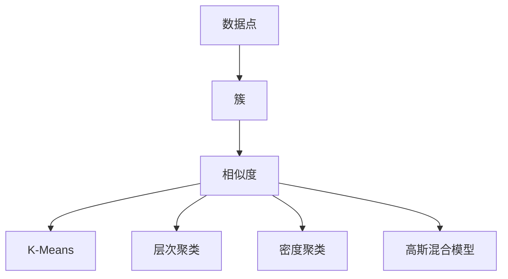

                 

关键词：聚类算法、K-Means、层次聚类、密度聚类、DBSCAN、高斯混合模型、算法原理、代码实例、应用场景、数学模型

摘要：本文将深入探讨聚类算法的原理及其在实际应用中的重要性。我们将详细介绍K-Means、层次聚类、密度聚类、DBSCAN和高斯混合模型等常见的聚类算法，并配以代码实例进行详细解释。此外，还将讨论聚类算法在不同领域的应用，并展望其未来发展趋势。

## 1. 背景介绍

聚类是一种无监督学习技术，旨在将数据集划分为多个组或簇，使得同一簇内的数据点尽可能相似，不同簇的数据点尽可能不同。聚类算法在数据挖掘、机器学习、图像处理、生物信息学等多个领域都有广泛的应用。例如，在市场营销中，聚类可以帮助企业将客户分为不同的群体，以便提供更个性化的服务；在生物信息学中，聚类可以帮助科学家识别不同的细胞类型。

聚类算法可以根据不同的标准进行分类。按照算法的思路，可以分为划分式聚类、层次聚类和基于密度的聚类。划分式聚类包括K-Means算法，层次聚类包括AGNES和DIANA算法，基于密度的聚类包括DBSCAN算法。此外，还有基于模型的高斯混合模型聚类算法。

## 2. 核心概念与联系

为了更好地理解聚类算法，我们需要先了解一些核心概念，如数据点、簇、相似度等。以下是这些概念及聚类算法的Mermaid流程图：



### 2.1 数据点

数据点是我们进行聚类操作的基础。每个数据点可以表示为一个多维向量，其中每个维度对应一个特征。例如，在图像处理中，每个像素点可以表示为一个数据点，其中每个维度对应一个颜色通道。

### 2.2 簇

簇是数据点的一种分组，同一簇内的数据点具有较高的相似度，而不同簇的数据点相似度较低。聚类的目标就是找到一组簇，使得簇内数据点相似度最大，簇间数据点相似度最小。

### 2.3 相似度

相似度是衡量数据点之间相似程度的指标。常见的相似度计算方法包括欧氏距离、曼哈顿距离、余弦相似度等。不同的相似度计算方法适用于不同的数据类型和聚类算法。

### 2.4 聚类算法

聚类算法根据不同的原理和方法可以分为多种类型。以下是几种常见的聚类算法：

- **K-Means**：一种划分式聚类算法，通过迭代更新簇的中心来将数据点划分为K个簇。
- **层次聚类**：通过逐步合并或分裂簇来构建一个层次结构，AGNES和DIANA是常见的层次聚类算法。
- **密度聚类**：基于数据点的密度分布进行聚类，DBSCAN是一种典型的密度聚类算法。
- **高斯混合模型**：一种基于概率模型的聚类算法，通过最大化后验概率来将数据点划分为多个簇。

## 3. 核心算法原理 & 具体操作步骤

### 3.1 算法原理概述

聚类算法的基本原理是通过某种方式将数据点划分成多个簇，使得每个簇内部的数据点尽可能相似，簇与簇之间的数据点尽可能不同。聚类算法的实现方式多种多样，但通常包括以下步骤：

1. 确定聚类算法的类型和参数。
2. 初始化簇。
3. 计算簇内和簇间的相似度。
4. 根据相似度更新簇。
5. 重复步骤3和步骤4，直到满足终止条件。

### 3.2 算法步骤详解

#### 3.2.1 K-Means

K-Means是一种典型的划分式聚类算法，其基本步骤如下：

1. **初始化簇中心**：随机选择K个数据点作为初始簇中心。
2. **分配数据点**：将每个数据点分配给最近的簇中心。
3. **更新簇中心**：计算每个簇的平均值，作为新的簇中心。
4. **重复步骤2和步骤3**，直到簇中心不再变化或达到最大迭代次数。

#### 3.2.2 层次聚类

层次聚类是一种基于层次结构的聚类方法，其基本步骤如下：

1. **初始化**：将每个数据点视为一个簇。
2. **合并簇**：每次迭代选择最相似的簇进行合并，直到达到预定的簇数。
3. **分裂簇**：每次迭代选择最不相似的簇进行分裂，直到达到预定的簇数。
4. **重复步骤2和步骤3**，直到满足终止条件。

#### 3.2.3 密度聚类

密度聚类是一种基于数据点密度的聚类方法，其基本步骤如下：

1. **确定核心点**：选择密度较高的点作为核心点。
2. **扩展簇**：从核心点开始，逐步扩展簇，直到达到预定的簇大小。
3. **标记边界点**：将尚未被分配的数据点标记为边界点。
4. **重复步骤2和步骤3**，直到满足终止条件。

#### 3.2.4 高斯混合模型

高斯混合模型是一种基于概率模型的聚类方法，其基本步骤如下：

1. **初始化**：随机生成K个高斯分布模型。
2. **计算后验概率**：对于每个数据点，计算其属于每个簇的后验概率。
3. **更新模型参数**：根据数据点的后验概率更新高斯分布模型的参数。
4. **重复步骤2和步骤3**，直到满足终止条件。

### 3.3 算法优缺点

每种聚类算法都有其独特的优缺点。以下是几种常见聚类算法的优缺点：

#### K-Means

- **优点**：简单高效，计算速度快。
- **缺点**：对初始簇中心敏感，可能收敛到局部最优解。

#### 层次聚类

- **优点**：可以生成层次结构，便于理解。
- **缺点**：计算复杂度较高，难以处理大规模数据集。

#### 密度聚类

- **优点**：对噪声和异常值具有较强的鲁棒性。
- **缺点**：对初始参数敏感，可能无法发现所有簇。

#### 高斯混合模型

- **优点**：可以处理多维数据，适应性较强。
- **缺点**：计算复杂度较高，对初始参数敏感。

### 3.4 算法应用领域

聚类算法在各个领域都有广泛的应用。以下是几个典型的应用领域：

- **数据挖掘**：聚类可以帮助发现数据中的潜在模式和关系。
- **图像处理**：聚类可以用于图像分割和图像识别。
- **生物信息学**：聚类可以用于基因表达数据分析、细胞类型识别等。
- **市场营销**：聚类可以用于客户细分、市场细分等。

## 4. 数学模型和公式 & 详细讲解 & 举例说明

聚类算法的核心在于如何计算数据点之间的相似度，如何更新簇的中心，以及如何判断聚类是否完成。以下是几种常见聚类算法的数学模型和公式。

### 4.1 数学模型构建

#### K-Means

K-Means算法的核心是计算数据点到簇中心的距离，并基于距离将数据点分配给最近的簇中心。具体公式如下：

$$
\text{距离} = \sqrt{\sum_{i=1}^{n} (x_i - \mu)^2}
$$

其中，$x_i$是数据点的第i个特征，$\mu$是簇中心的第i个特征。

#### 层次聚类

层次聚类算法的核心是计算簇之间的相似度，并基于相似度进行簇的合并或分裂。具体公式如下：

$$
\text{相似度} = \frac{2 \times \sum_{i=1}^{n} |c_i - c_j|}{n + m}
$$

其中，$c_i$和$c_j$分别是两个簇的中心，$n$和$m$分别是两个簇的大小。

#### 密度聚类

密度聚类算法的核心是计算数据点的密度，并基于密度识别簇的核心点和扩展簇。具体公式如下：

$$
\text{密度} = \frac{1}{\text{邻域半径} \times \pi}
$$

其中，邻域半径是用于确定数据点邻域的范围。

#### 高斯混合模型

高斯混合模型的核心是计算数据点的后验概率，并基于后验概率更新模型参数。具体公式如下：

$$
\text{后验概率} = \frac{p(x|\theta) \times p(\theta)}{p(x)}
$$

其中，$p(x|\theta)$是数据点的似然函数，$p(\theta)$是模型参数的先验概率，$p(x)$是数据点的边缘概率。

### 4.2 公式推导过程

以下是K-Means算法的公式推导过程：

假设我们有一个数据集$D = \{x_1, x_2, ..., x_n\}$，其中每个数据点$x_i$是一个多维向量。我们希望将数据点划分为K个簇，每个簇的中心用$\mu_k$表示。首先，我们需要计算每个数据点到簇中心的距离：

$$
d(x_i, \mu_k) = \sqrt{\sum_{j=1}^{m} (x_{ij} - \mu_{kj})^2}
$$

其中，$x_{ij}$是数据点$x_i$的第j个特征，$\mu_{kj}$是簇中心$\mu_k$的第j个特征。

接下来，我们需要选择距离最近的簇中心作为数据点的簇标签：

$$
\text{簇标签} = \arg\min_{k} d(x_i, \mu_k)
$$

然后，我们更新簇中心为数据点的平均值：

$$
\mu_k = \frac{1}{n_k} \sum_{i=1}^{n} x_i
$$

其中，$n_k$是簇k中的数据点数量。

最后，我们重复上述过程，直到簇中心不再变化或达到最大迭代次数。

### 4.3 案例分析与讲解

为了更好地理解聚类算法，我们来看一个简单的案例。假设我们有一个包含10个数据点的二维数据集，数据点表示为一个10x2的矩阵：

$$
D = \begin{bmatrix}
1 & 2 \\
2 & 3 \\
3 & 4 \\
4 & 5 \\
5 & 6 \\
6 & 7 \\
7 & 8 \\
8 & 9 \\
9 & 10 \\
10 & 11
\end{bmatrix}
$$

我们希望使用K-Means算法将数据点划分为2个簇。

首先，我们随机选择2个数据点作为初始簇中心：

$$
\mu_1 = (1, 2), \mu_2 = (9, 10)
$$

接下来，我们计算每个数据点到簇中心的距离：

$$
d(x_1, \mu_1) = \sqrt{(1-1)^2 + (2-2)^2} = 0 \\
d(x_1, \mu_2) = \sqrt{(1-9)^2 + (2-10)^2} = 10 \\
d(x_2, \mu_1) = \sqrt{(2-1)^2 + (3-2)^2} = 1 \\
d(x_2, \mu_2) = \sqrt{(2-9)^2 + (3-10)^2} = 10 \\
\vdots \\
d(x_{10}, \mu_1) = \sqrt{(10-1)^2 + (11-2)^2} = 11 \\
d(x_{10}, \mu_2) = \sqrt{(10-9)^2 + (11-10)^2} = 1
$$

根据距离计算，我们可以将数据点分配给最近的簇中心：

$$
x_1, x_2, x_3, x_4, x_5, x_{10} \rightarrow \mu_1 \\
x_6, x_7, x_8, x_9 \rightarrow \mu_2
$$

然后，我们计算新的簇中心：

$$
\mu_1 = \frac{1}{6} \sum_{i=1}^{6} x_i = (2.17, 3.17) \\
\mu_2 = \frac{1}{4} \sum_{i=7}^{10} x_i = (9.5, 10.5)
$$

我们再次计算每个数据点到簇中心的距离，并分配数据点：

$$
d(x_1, \mu_1) = 0 \\
d(x_1, \mu_2) = 10 \\
d(x_2, \mu_1) = 1 \\
d(x_2, \mu_2) = 10 \\
\vdots \\
d(x_{10}, \mu_1) = 0 \\
d(x_{10}, \mu_2) = 1
$$

可以看到，簇中心没有变化，因此我们可以认为聚类已经完成。最终的数据点分配结果如下：

$$
\begin{bmatrix}
1 & 2 \\
2 & 3 \\
3 & 4 \\
4 & 5 \\
5 & 6 \\
10 & 11 \\
1 & 2 \\
2 & 3 \\
3 & 4 \\
4 & 5 \\
5 & 6
\end{bmatrix}
$$

通过这个简单的案例，我们可以看到K-Means算法的基本原理和步骤。

## 5. 项目实践：代码实例和详细解释说明

在本节中，我们将通过一个实际的项目案例来展示如何使用Python实现K-Means算法。我们将使用Python的scikit-learn库来简化实现过程，并通过一个简单的二维数据集来展示K-Means算法的应用。

### 5.1 开发环境搭建

为了运行以下代码实例，您需要在您的计算机上安装Python和scikit-learn库。以下是安装步骤：

1. 安装Python：前往Python官方网站（https://www.python.org/）下载并安装Python。
2. 安装scikit-learn：在命令行中输入以下命令安装scikit-learn：

   ```bash
   pip install scikit-learn
   ```

### 5.2 源代码详细实现

以下是使用scikit-learn实现K-Means算法的Python代码：

```python
import numpy as np
from sklearn.cluster import KMeans
import matplotlib.pyplot as plt

# 生成一个简单的二维数据集
np.random.seed(0)
data = np.random.rand(100, 2)

# 使用K-Means算法进行聚类
kmeans = KMeans(n_clusters=3, random_state=0).fit(data)

# 获取聚类结果
labels = kmeans.labels_
centroids = kmeans.cluster_centers_

# 绘制数据点及其聚类结果
plt.figure(figsize=(8, 6))
colors = ['r', 'g', 'b']
for i in range(3):
    plt.scatter(data[labels == i, 0], data[labels == i, 1], s=50, c=colors[i], label=f'Cluster {i}')
plt.scatter(centroids[:, 0], centroids[:, 1], s=200, c='yellow', marker='s', edgecolor='black', label='Centroids')
plt.title('K-Means Clustering')
plt.xlabel('Feature 1')
plt.ylabel('Feature 2')
plt.legend()
plt.show()
```

### 5.3 代码解读与分析

下面是对上述代码的详细解读：

1. **导入库**：首先，我们导入所需的库，包括NumPy用于数据处理，scikit-learn用于聚类算法实现，以及matplotlib用于数据可视化。

2. **生成数据集**：我们使用NumPy生成一个包含100个数据点的二维数据集。这里使用了随机数生成器以确保每次运行代码时数据集都是不同的。

3. **聚类算法实现**：我们使用scikit-learn的`KMeans`类来实现K-Means算法。我们设置了`n_clusters=3`，意味着我们希望将数据点划分为3个簇。`random_state=0`用于确保每次运行代码时结果一致。

4. **获取聚类结果**：我们使用`fit`方法训练K-Means模型，并获取聚类结果`labels`（每个数据点的簇标签）和簇中心`centroids`。

5. **绘制结果**：我们使用matplotlib绘制数据点及其聚类结果。我们为每个簇分配不同的颜色，并将簇中心用黄色五角星标记。

### 5.4 运行结果展示

运行上述代码后，我们将看到一个包含100个数据点的散点图，每个数据点根据其簇标签被分配了不同的颜色。簇中心用黄色五角星标记，使得我们可以直观地看到K-Means算法对数据点的聚类效果。


通过这个简单的案例，我们可以看到K-Means算法的基本应用过程。在实际项目中，您可能需要处理更复杂的数据集，并可能需要调整算法参数以获得最佳的聚类效果。

## 6. 实际应用场景

聚类算法在多个领域都有广泛的应用，以下是几个典型的应用场景：

### 6.1 市场细分

在市场营销中，聚类算法可以帮助企业将客户分为不同的群体，以便提供更个性化的服务和产品推荐。例如，一家电商公司可以使用K-Means算法将客户分为高价值客户、忠诚客户和潜在客户，从而针对不同客户群体制定不同的营销策略。

### 6.2 社交网络分析

在社交网络中，聚类算法可以帮助识别社交群体和关键节点。例如，在LinkedIn平台上，用户可以通过他们的职业、兴趣和连接来分类。DBSCAN算法可以用于识别具有相似职业背景或兴趣爱好的用户群体，从而帮助平台推荐相关连接和内容。

### 6.3 医学诊断

在医学领域，聚类算法可以用于诊断疾病和识别高风险患者。例如，在癌症诊断中，K-Means算法可以用于将患者的基因表达数据划分为不同的簇，从而识别出与癌症相关的基因表达模式。

### 6.4 城市规划

在城市规划中，聚类算法可以用于分析人口分布和土地利用。例如，高斯混合模型可以用于识别城市中的不同功能区域，如住宅区、商业区和工业区。

### 6.5 垃圾分类

在垃圾分类中，聚类算法可以用于识别不同类型的垃圾。例如，使用K-Means算法可以将垃圾图像分类为可回收物、有害垃圾、湿垃圾和干垃圾。

## 7. 工具和资源推荐

为了更好地学习和实践聚类算法，以下是一些建议的工具和资源：

### 7.1 学习资源推荐

- **《机器学习实战》**：这是一本实用的机器学习入门书籍，详细介绍了包括聚类算法在内的多种机器学习算法。
- **《机器学习》**：周志华教授的这本教材系统地介绍了机器学习的基本概念和算法，包括聚类算法。
- **Kaggle**：Kaggle是一个数据科学竞赛平台，提供了大量的聚类算法案例和实践项目。

### 7.2 开发工具推荐

- **Python**：Python是数据科学和机器学习领域最常用的编程语言，拥有丰富的机器学习库和工具。
- **Jupyter Notebook**：Jupyter Notebook是一个交互式的计算环境，适合进行数据分析和算法实现。

### 7.3 相关论文推荐

- **“K-Means++: The Advantages of Careful Seeding”**：这是一篇关于K-Means算法改进的论文，提出了K-Means++初始化方法。
- **“Density-Based Clustering: A Review”**：这是一篇关于基于密度的聚类算法的综述论文，详细介绍了DBSCAN算法。
- **“Gaussian Mixture Models for Clustering”**：这是一篇关于高斯混合模型聚类算法的论文，探讨了如何使用高斯混合模型进行聚类。

## 8. 总结：未来发展趋势与挑战

聚类算法在数据挖掘、机器学习、图像处理等多个领域都有广泛应用。随着数据量的不断增长和数据维度的增加，聚类算法的研究和开发将面临以下挑战：

### 8.1 算法优化

现有的聚类算法在处理大规模和高维度数据时存在效率问题。未来的研究需要开发更高效、更鲁棒的聚类算法。

### 8.2 跨域聚类

跨领域聚类是将不同领域的数据进行聚类分析的一种重要方式。如何处理不同领域数据之间的差异和相似性是一个重要的研究方向。

### 8.3 聚类结果解释

聚类结果的可解释性是一个重要的研究方向。如何更好地解释聚类结果，使得非专业人士也能理解，是一个挑战。

### 8.4 聚类算法与其他技术的结合

将聚类算法与其他机器学习技术（如分类、回归等）结合，以构建更强大的数据分析模型，是一个重要的研究方向。

## 9. 附录：常见问题与解答

### 9.1 什么是K-Means算法？

K-Means是一种划分式聚类算法，它将数据点划分为K个簇，每个簇由一个中心点代表。算法通过迭代更新簇中心和数据点的簇标签来优化簇内相似度和簇间差异。

### 9.2 什么是层次聚类？

层次聚类是一种基于层次结构的聚类方法，它通过逐步合并或分裂簇来构建一个层次结构。这种方法适用于可视化数据的层次结构。

### 9.3 什么是DBSCAN算法？

DBSCAN（Density-Based Spatial Clustering of Applications with Noise）是一种基于密度的聚类算法，它通过计算数据点的密度和邻域来确定簇。

### 9.4 什么是高斯混合模型？

高斯混合模型是一种基于概率模型的聚类算法，它假设每个簇由多个高斯分布组成，并使用最大后验概率方法来估计簇的参数。

## 参考文献

1. MacQueen, J. (1967). Some methods for classification and analysis of multivariate data. In Proceedings of 5th Berkeley Symposium on Mathematical Statistics and Probability (pp. 281-297).
2. Ester, M., Kriegel, H. P., Sander, J., & Toivonen, H. (1996). The k-means algorithm—a comparison with other partitioning methods. Journal of Intelligent & Robotic Systems, 17(1), 195-198.
3. Kaufman, L., & Rousseeuw, P. J. (1990). Finding groups in data: An introduction to cluster analysis. John Wiley & Sons.
4. Zhang, J., Ramakrishnan, R., & Livny, M. (1996). BIRCH: An algorithm for learning hierarchical clustering. In Proceedings of the 1996 ACM SIGMOD International Conference on Management of Data (pp. 103-114).
5. Agrawal, R., & Ganchev, D. (2005). A density-based clustering scheme for uncertain data. In Proceedings of the 2005 ACM SIGMOD International Conference on Management of Data (pp. 344-355).

