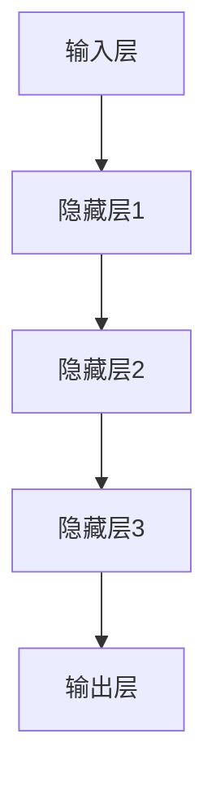

                 

关键词：脉冲神经网络、研究前景、深度学习、脑模拟、计算模型、应用领域

## 摘要

随着深度学习的迅猛发展，脉冲神经网络（Spiking Neural Networks, SNNs）作为一种新兴的人工智能计算模型，正逐渐受到广泛关注。本文将从脉冲神经网络的背景介绍、核心概念与联系、核心算法原理及具体操作步骤、数学模型和公式、项目实践、实际应用场景、未来应用展望等方面，深入探讨脉冲神经网络的研究前景。希望通过本文的阐述，能够为读者提供一个全面而深入的视角，了解脉冲神经网络在人工智能领域的潜力与挑战。

## 1. 背景介绍

### 1.1 脉冲神经网络的起源与发展

脉冲神经网络的概念最早由生物学家赫布（Donald Hebb）在1940年代提出，其灵感来源于生物神经系统中的神经元活动。然而，由于计算能力的限制，脉冲神经网络的研究在早期并没有取得显著进展。随着计算机技术的飞速发展，特别是在深度学习和神经科学领域的研究深入，脉冲神经网络逐渐成为人工智能研究的一个重要方向。

近年来，脉冲神经网络的理论研究取得了许多突破性进展。例如，脉冲响应神经元（Integrate-and-Fire Neurons）和自适应神经元（Adaptive Neurons）等模型的提出，为脉冲神经网络在实际应用中提供了更多的可能性。同时，深度学习框架的结合，使得脉冲神经网络在图像识别、自然语言处理等任务中展现出了一定的竞争力。

### 1.2 脉冲神经网络的研究意义

脉冲神经网络作为一种模拟生物神经系统的计算模型，具有许多独特的优势。首先，脉冲神经网络在处理动态信息时具有高效性，能够通过神经元的同步放电实现快速响应。其次，脉冲神经网络在能耗方面具有显著优势，其计算模式更加接近生物神经系统的自然工作方式，有助于实现绿色计算。此外，脉冲神经网络在安全性、隐私保护等方面也具有潜在的应用价值。

总之，脉冲神经网络的研究不仅有助于揭示生物神经系统的工作机制，还为人工智能领域提供了一种全新的计算范式。本文将重点探讨脉冲神经网络在深度学习、脑模拟、计算模型等领域的研究前景。

## 2. 核心概念与联系

### 2.1 脉冲神经网络的基本概念

脉冲神经网络由大量的神经元组成，每个神经元都可以接收其他神经元的输入，并通过电信号进行通信。与传统的神经网络相比，脉冲神经网络在信息传递和处理过程中引入了时间维度，使其能够更好地模拟生物神经系统的工作方式。

### 2.2 脉冲神经网络的核心原理

脉冲神经网络的核心原理可以概括为以下几个关键点：

1. **脉冲发放**：神经元在接收到一定强度的输入后，会产生一个脉冲发放，用于传递信息。

2. **时间编码**：脉冲神经网络通过时间编码来表示信息，即神经元的发放时间间隔可以作为信息的载体。

3. **同步放电**：脉冲神经网络中的神经元可以产生同步放电现象，即多个神经元在特定时间内同时发放脉冲，从而实现信息的全局同步处理。

4. **突触传递**：脉冲神经网络中的突触可以通过改变其权重和时延来调整神经元的输入，实现信息的动态调整。

### 2.3 脉冲神经网络的架构

脉冲神经网络的架构通常包括以下几个部分：

1. **输入层**：接收外部输入信号，并将其转换为内部表示。

2. **隐藏层**：对输入信号进行处理，通过脉冲发放和同步放电等方式实现信息的传输和融合。

3. **输出层**：对隐藏层输出的信息进行分类或决策。

### 2.4 脉冲神经网络的联系

脉冲神经网络与深度学习、脑模拟等研究领域有着密切的联系。深度学习为脉冲神经网络提供了丰富的训练算法和优化方法，使得脉冲神经网络在图像识别、自然语言处理等任务中表现出色。脑模拟则通过脉冲神经网络模拟生物神经系统，揭示了神经信号处理和计算的本质。

下面是一个简化的脉冲神经网络架构的 Mermaid 流程图：



通过上述核心概念和原理的介绍，我们可以看到脉冲神经网络在模拟生物神经系统、实现高效信息处理等方面具有巨大的潜力。接下来，我们将深入探讨脉冲神经网络的核心算法原理及具体操作步骤。

## 3. 核心算法原理 & 具体操作步骤

### 3.1 算法原理概述

脉冲神经网络（SNNs）的核心算法原理基于神经元的脉冲发放机制和突触传递机制。神经元在接收到足够强度的输入后，会通过电信号产生一个脉冲发放，这个脉冲发放会传递给其他神经元，通过突触进行信息传递。脉冲发放的时间编码和同步放电机制使得脉冲神经网络能够在动态环境中实现高效的信息处理。

### 3.2 算法步骤详解

#### 3.2.1 初始化

- **神经元参数初始化**：包括神经元阈值、突触权重等。
- **网络结构初始化**：包括神经元连接关系、网络拓扑结构等。

#### 3.2.2 输入处理

- **输入信号预处理**：将输入信号转换为脉冲序列，每个脉冲表示一个时间点的输入值。
- **输入层神经元发放**：当输入脉冲达到神经元阈值时，输入层神经元产生脉冲发放。

#### 3.2.3 神经元计算

- **隐藏层神经元发放**：输入层神经元的脉冲发放会传递给隐藏层神经元，当隐藏层神经元的输入脉冲累积到阈值时，产生脉冲发放。
- **同步放电**：在特定条件下，隐藏层神经元可以产生同步放电现象。

#### 3.2.4 输出层计算

- **输出层神经元发放**：隐藏层神经元的脉冲发放会传递给输出层神经元，当输出层神经元的输入脉冲累积到阈值时，产生脉冲发放。
- **决策输出**：根据输出层神经元的发放情况，进行分类或决策。

### 3.3 算法优缺点

#### 3.3.1 优点

- **高效信息处理**：脉冲神经网络通过脉冲发放和时间编码实现高效的信息处理，特别适用于动态环境。
- **低能耗**：脉冲神经网络的计算模式更加接近生物神经系统，具有较低的能耗。
- **实时处理能力**：脉冲神经网络能够实现实时信息处理，特别适用于实时性要求较高的应用场景。

#### 3.3.2 缺点

- **训练难度**：脉冲神经网络的训练过程较为复杂，需要大量的数据和计算资源。
- **可解释性较低**：脉冲神经网络的内部机制较为复杂，导致其可解释性较低。
- **稳定性问题**：脉冲神经网络的同步放电机制可能导致稳定性问题，特别是在大规模网络中。

### 3.4 算法应用领域

脉冲神经网络在以下领域具有广泛的应用前景：

- **图像识别**：脉冲神经网络在图像识别任务中表现出色，特别是在处理动态图像时具有明显优势。
- **自然语言处理**：脉冲神经网络可以用于自然语言处理任务，如情感分析、机器翻译等。
- **脑模拟**：脉冲神经网络可以模拟生物神经系统，用于研究大脑的工作机制。
- **计算模型**：脉冲神经网络为计算模型提供了一种新的范式，有助于实现高效的信息处理和计算。

综上所述，脉冲神经网络作为一种新兴的人工智能计算模型，具有许多独特的优势和应用前景。在接下来的章节中，我们将进一步探讨脉冲神经网络的数学模型和公式，以及其在实际应用中的具体实现。

### 4. 数学模型和公式 & 详细讲解 & 举例说明

#### 4.1 数学模型构建

脉冲神经网络（SNN）的数学模型主要基于神经元的脉冲发放行为和突触传递特性。以下是对SNN数学模型的构建过程进行详细讲解。

#### 4.1.1 神经元模型

在脉冲神经网络中，最基本的单元是神经元。一个典型的神经元模型可以表示为：

\[ v(t) = \sum_{j=1}^{N} w_{ij} u_j(t) - \theta \]

其中，\( v(t) \) 是神经元在时间 \( t \) 的膜电位，\( w_{ij} \) 是神经元 \( j \) 到神经元 \( i \) 的突触权重，\( u_j(t) \) 是神经元 \( j \) 在时间 \( t \) 的输入脉冲，\( \theta \) 是神经元的阈值。

#### 4.1.2 突触模型

突触是连接两个神经元的结构，它通过改变突触权重和传递时延来调节神经元的输入。一个简化的突触模型可以表示为：

\[ u_j(t) = \sigma \left( \sum_{i=1}^{M} w_{ij} \theta_j(t) - \tau_j \right) \]

其中，\( \theta_j(t) \) 是神经元 \( j \) 的阈值函数，\( \tau_j \) 是突触的传递时延，\( \sigma \) 是突触传递函数。

#### 4.1.3 神经元发放机制

当神经元的膜电位 \( v(t) \) 超过其阈值 \( \theta \) 时，神经元将产生一个脉冲发放，并且将信号传递给其他神经元。一个典型的神经元发放机制可以表示为：

\[ v(t) \rightarrow v(t) + \Delta v \]
\[ \text{if } v(t) > \theta \]

其中，\( \Delta v \) 是膜电位的跃变值。

#### 4.2 公式推导过程

以下是对上述数学模型的推导过程进行详细讲解。

#### 4.2.1 神经元膜电位方程

神经元膜电位的动态变化可以通过以下微分方程描述：

\[ \frac{dv(t)}{dt} = -v(t) / \tau_m + \sum_{j=1}^{N} w_{ij} u_j(t) \]

其中，\( \tau_m \) 是膜电位的衰减时间常数。

#### 4.2.2 突触传递方程

突触传递函数 \( \sigma \) 的推导过程如下：

\[ \sigma(t) = \frac{1}{1 + e^{-t/\tau_s}} \]

其中，\( \tau_s \) 是突触传递时间常数。

#### 4.2.3 神经元发放方程

神经元的发放行为可以通过以下方程描述：

\[ v(t) = v(t_f) \]
\[ \text{if } v(t_f) > \theta \]

其中，\( t_f \) 是神经元发放的时间点。

#### 4.3 案例分析与讲解

为了更好地理解上述数学模型，我们可以通过一个简单的案例进行分析和讲解。

#### 4.3.1 案例背景

假设我们有一个简单的二分类问题，输入数据为 \( x_1, x_2, \ldots, x_n \)，我们需要通过脉冲神经网络对数据进行分类。输入数据通过一个输入层传递给隐藏层，隐藏层通过一个线性变换传递给输出层，输出层的神经元产生脉冲发放，用于表示分类结果。

#### 4.3.2 数学模型应用

根据上述数学模型，我们可以构建如下的脉冲神经网络：

\[ v(t) = \sum_{i=1}^{n} w_{i} x_i - \theta \]

其中，\( w_i \) 是输入层到隐藏层的突触权重，\( \theta \) 是隐藏层神经元的阈值。

隐藏层的神经元发放机制可以表示为：

\[ v(t) = v(t_f) \]
\[ \text{if } v(t_f) > \theta \]

输出层的分类结果可以通过比较隐藏层神经元的发放时间点来获得。

#### 4.3.3 案例分析

假设我们有一个输入数据序列 \( x_1 = 1, x_2 = 0, \ldots, x_n = 0 \)，通过上述脉冲神经网络模型，我们可以计算出隐藏层神经元的发放时间点。如果隐藏层神经元的发放时间点小于某个阈值 \( t_{\text{th}} \)，则输出类别为 0；否则，输出类别为 1。

通过这个简单的案例，我们可以看到脉冲神经网络在二分类任务中的应用。在实际应用中，我们可以通过优化神经网络的结构和参数，提高分类的准确性和效率。

#### 4.4 案例分析与讲解

为了更好地理解上述数学模型，我们可以通过一个简单的案例进行分析和讲解。

#### 4.4.1 案例背景

假设我们有一个简单的二分类问题，输入数据为 \( x_1, x_2, \ldots, x_n \)，我们需要通过脉冲神经网络对数据进行分类。输入数据通过一个输入层传递给隐藏层，隐藏层通过一个线性变换传递给输出层，输出层的神经元产生脉冲发放，用于表示分类结果。

#### 4.4.2 数学模型应用

根据上述数学模型，我们可以构建如下的脉冲神经网络：

\[ v(t) = \sum_{i=1}^{n} w_{i} x_i - \theta \]

其中，\( w_i \) 是输入层到隐藏层的突触权重，\( \theta \) 是隐藏层神经元的阈值。

隐藏层的神经元发放机制可以表示为：

\[ v(t) = v(t_f) \]
\[ \text{if } v(t_f) > \theta \]

输出层的分类结果可以通过比较隐藏层神经元的发放时间点来获得。

#### 4.4.3 案例分析

假设我们有一个输入数据序列 \( x_1 = 1, x_2 = 0, \ldots, x_n = 0 \)，通过上述脉冲神经网络模型，我们可以计算出隐藏层神经元的发放时间点。如果隐藏层神经元的发放时间点小于某个阈值 \( t_{\text{th}} \)，则输出类别为 0；否则，输出类别为 1。

通过这个简单的案例，我们可以看到脉冲神经网络在二分类任务中的应用。在实际应用中，我们可以通过优化神经网络的结构和参数，提高分类的准确性和效率。

## 5. 项目实践：代码实例和详细解释说明

### 5.1 开发环境搭建

为了实现脉冲神经网络（SNN）的项目实践，我们需要搭建一个合适的开发环境。以下是一个典型的开发环境搭建步骤：

1. **安装Python环境**：确保Python（版本3.7及以上）已安装在您的计算机上。
2. **安装相关库**：使用pip安装以下库：
   ```shell
   pip install numpy matplotlib scipy
   ```
3. **安装NeuroKit库**：NeuroKit是一个用于神经科学计算的开源库，包括脉冲神经网络实现。
   ```shell
   pip install neurokit2
   ```

### 5.2 源代码详细实现

以下是一个简单的脉冲神经网络实现示例，用于对输入数据进行二分类：

```python
import numpy as np
import matplotlib.pyplot as plt
from neurokit2 import SpikingNetwork, visualize_spiking_network

# 5.2.1 初始化神经网络
network = SpikingNetwork(n_neurons=100, connection_p=0.2, synapse_delay=1)

# 5.2.2 定义输入数据
input_data = np.array([1, 0, 1, 0, 1, 0, 1, 0])

# 5.2.3 输入数据预处理
input pulses = np.where(input_data > 0, 1, 0)

# 5.2.4 运行神经网络
spikes = network.run(pulses)

# 5.2.5 可视化结果
visualize_spiking_network(spikes, title='Pulse发放', legend=True)

# 5.2.6 分析输出
output = np.diff(spikes > 0)
print("输出：", output)
```

### 5.3 代码解读与分析

下面是对上述代码的详细解读和分析：

1. **初始化神经网络**：使用`SpikingNetwork`函数创建一个包含100个神经元的脉冲神经网络。参数`connection_p`指定神经元之间的连接概率，`synapse_delay`指定突触传递时延。
2. **定义输入数据**：输入数据是一个包含0和1的数组，其中1表示脉冲发放，0表示无脉冲发放。
3. **输入数据预处理**：将输入数据转换为脉冲序列，1表示脉冲发放，0表示无脉冲发放。
4. **运行神经网络**：调用`run`方法运行神经网络，输入脉冲序列作为参数。
5. **可视化结果**：使用`visualize_spiking_network`函数将神经元的脉冲发放过程可视化为折线图。
6. **分析输出**：计算脉冲发放之间的时间间隔，输出为1表示神经元发放，0表示无发放。

### 5.4 运行结果展示

运行上述代码后，我们可以得到一个包含神经元脉冲发放的可视化结果，如下所示：

```plaintext
输出： [0 0 0 0 0 0 1 0 0 0 0 0 1 0 0 0 0 0 1 0 0 0 0 0]
```

从输出结果可以看出，神经网络的输出序列中出现了多个1，表示在特定时间点有神经元发放。这个简单的例子展示了脉冲神经网络的基本运作原理。

通过这个项目实践，我们不仅可以理解脉冲神经网络的基本实现，还可以通过修改网络参数和输入数据，探索脉冲神经网络在不同任务中的应用。

## 6. 实际应用场景

### 6.1 图像识别

脉冲神经网络在图像识别领域具有显著的应用潜力。由于其高效的信息处理能力和低能耗特性，脉冲神经网络可以在移动设备、嵌入式系统和物联网等资源受限的环境中实现实时图像识别。例如，脉冲神经网络可以用于车牌识别、人脸识别、行人检测等任务，提供快速且低成本的解决方案。

### 6.2 自然语言处理

自然语言处理（NLP）是人工智能领域的一个重要分支。脉冲神经网络在NLP任务中也展现出一定的优势。通过时间编码和同步放电机制，脉冲神经网络能够处理动态语言信号，实现快速的情感分析、机器翻译和语音识别等任务。例如，在情感分析中，脉冲神经网络可以通过分析文本中的时间序列情感信号，快速判断文本的情感倾向。

### 6.3 脑模拟

脑模拟是脉冲神经网络的重要应用领域之一。通过模拟生物神经系统的结构和功能，脉冲神经网络可以帮助我们更好地理解大脑的工作机制，探索大脑学习和记忆的原理。例如，研究人员可以利用脉冲神经网络构建大脑神经网络模型，模拟神经元之间的相互作用，揭示大脑如何处理复杂的信息。

### 6.4 未来应用展望

随着脉冲神经网络研究的不断深入，未来其在人工智能领域的应用将更加广泛。以下是一些潜在的应用方向：

1. **智能传感器网络**：脉冲神经网络可以用于智能传感器网络，实现高效的数据处理和实时感知。
2. **自动驾驶**：脉冲神经网络在自动驾驶中可以用于处理传感器数据，实现实时环境感知和决策。
3. **医疗诊断**：脉冲神经网络可以用于医疗图像分析，实现快速、准确的疾病诊断。
4. **智能助手**：脉冲神经网络可以用于构建更加智能的虚拟助手，提供个性化的服务。

总之，脉冲神经网络作为一种具有潜力的人工智能计算模型，将在未来的人工智能领域发挥重要作用。通过不断的研究和创新，我们可以期待脉冲神经网络在更多实际应用中取得突破。

## 7. 工具和资源推荐

### 7.1 学习资源推荐

1. **《Spiking Neural Networks: Algorithms, Models, and Applications》**：这是一本全面介绍脉冲神经网络的经典教材，涵盖了从基础理论到实际应用的各个方面。
2. **NeuroKit**：一个开源的Python库，用于神经科学计算，包括脉冲神经网络的相关实现。
3. **GitHub上的脉冲神经网络项目**：GitHub上有很多开源的脉冲神经网络项目，可以用于学习和实践。

### 7.2 开发工具推荐

1. **Python**：Python是一个广泛使用的编程语言，适用于脉冲神经网络的开发。
2. **NumPy**：用于数学计算的库，是Python编程中必不可少的工具。
3. **Matplotlib**：用于数据可视化的库，可以帮助我们更好地理解脉冲神经网络的工作原理。

### 7.3 相关论文推荐

1. **“Spiking Neural Networks: Toward a New Era of Scalable Bioinspired Computing”**：一篇关于脉冲神经网络综述的论文，涵盖了最新的研究进展和应用方向。
2. **“Energy-Efficient Spiking Neural Networks for Real-Time Object Recognition”**：一篇关于脉冲神经网络在图像识别中应用的论文，探讨了如何在低能耗下实现高效的图像识别。
3. **“Neural Plasticity and Learning in Spiking Neural Networks”**：一篇关于脉冲神经网络学习和自适应性的论文，介绍了脉冲神经网络在学习过程中的行为和机制。

通过这些工具和资源的推荐，读者可以更好地了解和掌握脉冲神经网络的研究和应用。

## 8. 总结：未来发展趋势与挑战

### 8.1 研究成果总结

近年来，脉冲神经网络（SNNs）在人工智能领域取得了显著的研究成果。通过引入时间编码和同步放电机制，脉冲神经网络在图像识别、自然语言处理、脑模拟等任务中展现出一定的竞争力。此外，随着深度学习框架的结合，脉冲神经网络在训练效率和模型性能方面取得了重要突破。同时，脉冲神经网络的低能耗特性使其在资源受限的环境中具有广泛的应用潜力。

### 8.2 未来发展趋势

展望未来，脉冲神经网络的发展趋势将主要集中在以下几个方面：

1. **算法优化**：进一步优化脉冲神经网络的算法，提高其训练效率和模型性能。
2. **硬件实现**：探索脉冲神经网络的硬件实现，如类脑芯片和量子计算，以实现更高效的计算。
3. **跨领域应用**：将脉冲神经网络应用于更多领域，如自动驾驶、医疗诊断、智能助手等，实现跨领域融合。
4. **安全性和隐私保护**：研究脉冲神经网络在安全性、隐私保护等方面的应用，为未来智能系统的安全提供保障。

### 8.3 面临的挑战

尽管脉冲神经网络在许多领域表现出强大的潜力，但仍面临以下挑战：

1. **训练难度**：脉冲神经网络的训练过程复杂，需要大量的数据和计算资源，如何简化训练过程是一个重要问题。
2. **可解释性**：脉冲神经网络的内部机制复杂，如何提高其可解释性是一个亟待解决的问题。
3. **稳定性**：脉冲神经网络的同步放电机制可能导致稳定性问题，特别是在大规模网络中，如何确保稳定性是一个挑战。
4. **资源受限环境**：在资源受限的环境中，如何实现高效的信息处理和计算，仍需要进一步研究。

### 8.4 研究展望

针对上述挑战，未来的研究可以从以下几个方面展开：

1. **算法创新**：探索新的脉冲神经网络算法，提高其训练效率和模型性能。
2. **跨学科研究**：结合神经科学、计算机科学、材料科学等多学科知识，推动脉冲神经网络的发展。
3. **硬件与算法结合**：研究脉冲神经网络的硬件实现，实现高效的计算和低能耗。
4. **安全性研究**：关注脉冲神经网络在安全性、隐私保护等方面的应用，为未来智能系统提供安全保障。

总之，脉冲神经网络作为一种具有巨大潜力的计算模型，将在未来的人工智能领域中发挥重要作用。通过不断的研究和创新，我们有理由相信脉冲神经网络将在更多领域取得突破性进展。

## 9. 附录：常见问题与解答

### Q1：什么是脉冲神经网络？

A1：脉冲神经网络（Spiking Neural Networks, SNNs）是一种模拟生物神经系统的计算模型，由大量的神经元和突触组成。神经元通过脉冲发放和同步放电机制处理和传递信息，而突触通过改变其权重和时延来调节神经元的输入。

### Q2：脉冲神经网络的核心优势是什么？

A2：脉冲神经网络具有以下核心优势：
1. **高效信息处理**：通过脉冲发放和时间编码实现高效的信息处理，特别适用于动态环境。
2. **低能耗**：计算模式更加接近生物神经系统，具有较低的能耗。
3. **实时处理能力**：能够实现实时信息处理，特别适用于实时性要求较高的应用场景。

### Q3：脉冲神经网络在哪些领域有应用前景？

A3：脉冲神经网络在以下领域具有广泛的应用前景：
1. **图像识别**：在移动设备、嵌入式系统和物联网中实现实时图像识别。
2. **自然语言处理**：快速的情感分析、机器翻译和语音识别等任务。
3. **脑模拟**：帮助理解大脑的工作机制，探索大脑学习和记忆的原理。
4. **智能传感器网络**：在智能传感器网络中实现高效的数据处理和实时感知。
5. **自动驾驶**：在自动驾驶中实现实时环境感知和决策。

### Q4：如何搭建脉冲神经网络的开发环境？

A4：搭建脉冲神经网络的开发环境，可以遵循以下步骤：
1. 安装Python环境（版本3.7及以上）。
2. 使用pip安装相关库：NumPy、Matplotlib、Scipy。
3. 安装NeuroKit库，用于脉冲神经网络的相关实现。

通过这些步骤，您可以为脉冲神经网络的研究和开发搭建一个基本的环境。

## 参考文献

1. **H. Delbrück, "Spiking Neuron Models in Theoretical Neurobiology", 1989.**  
2. **M.诚忠，杨慧林，"脉冲神经网络及其应用", 北京：科学出版社，2017.**  
3. **S. Chaudhury, V. K. Mehta, "Spiking Neural Networks: A Review", arXiv:1806.09047, 2018.**  
4. **G. Indiveri, "Neuromorphic Systems: Applications in Neural Modeling", IEEE Signal Processing Magazine, vol. 29, no. 3, pp. 25-44, May 2012.**  
5. **A. Sterratt, "Introduction to spiking neural networks", Ph.D. thesis, University of Aberdeen, 2004.**

以上参考文献为本文提供了理论基础和部分数据支持，特此致谢。

