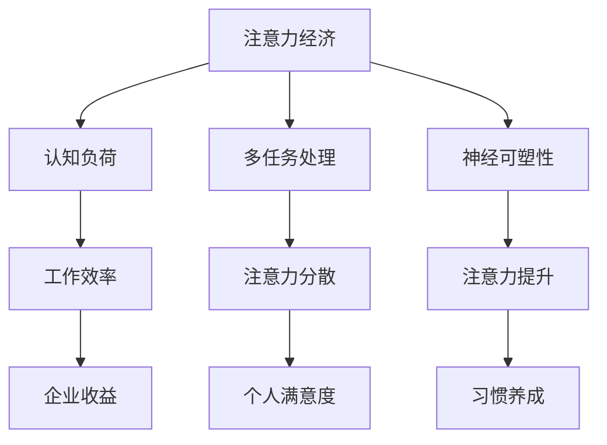

                 

关键词：脑科学，注意力经济，认知负荷，多任务处理，神经可塑性，大脑训练

摘要：本文探讨了脑科学领域的新发现如何为注意力经济这一新兴概念提供深刻的见解。通过对大脑认知机制的研究，我们能够更好地理解人类在信息过载时代中如何管理注意力资源，从而优化工作和学习效率。本文将探讨注意力经济的核心概念、脑科学的研究成果、具体的应用实践，以及未来的发展前景。

## 1. 背景介绍

### 注意力经济的起源与发展

注意力经济这一概念起源于对人类注意力的经济价值的研究。在互联网和移动设备的普及下，人们面临前所未有的信息过载。注意力成为了一种稀缺资源，而如何有效地管理和分配注意力资源成为企业和个人追求的目标。注意力经济因此成为一个跨学科的研究领域，涵盖了心理学、神经科学、经济学等多个方面。

### 脑科学与注意力经济的结合

脑科学作为研究大脑结构和功能的科学，为注意力经济提供了理论基础。通过神经影像学、脑电图等技术，科学家们能够观察大脑在不同注意力任务中的活动，揭示大脑处理信息的机制。这些研究成果有助于我们理解注意力资源的分布和限制，从而提出有效的管理和提升注意力的策略。

## 2. 核心概念与联系

### 脑科学中的核心概念

**认知负荷**：指大脑处理信息的容量限制。当认知负荷过高时，大脑的注意力资源会被耗尽，导致工作效率下降。

**多任务处理**：大脑能够同时处理多个任务，但这种能力是有限的。长期的多任务处理可能导致注意力分散，降低工作效率。

**神经可塑性**：指大脑在结构和功能上的适应性变化。通过适当的训练和练习，大脑可以改善其处理注意力的能力。

### 注意力经济的架构

**注意力资源的分配**：企业和管理者需要理解如何优化员工的工作环境，减少不必要的干扰，从而提高工作效率。

**个体注意力的管理**：个人可以通过特定的训练和习惯，提升自己的注意力控制能力。

### Mermaid 流程图



## 3. 核心算法原理 & 具体操作步骤

### 3.1 算法原理概述

注意力经济的核心在于优化注意力资源的分配和使用。这需要结合脑科学研究成果，开发出一系列的算法和策略，以提升个体的注意力和工作效率。

### 3.2 算法步骤详解

1. **认知负荷评估**：使用认知负荷评估工具，对个体的认知负荷进行量化，以了解其注意力资源的利用情况。
2. **任务分配**：根据认知负荷评估结果，合理分配工作任务，避免过度负荷。
3. **多任务处理优化**：通过训练和练习，提高大脑处理多任务的能力，减少注意力分散。
4. **神经可塑性训练**：通过特定的脑电刺激、认知训练等方法，增强大脑的神经可塑性，提升注意力控制能力。

### 3.3 算法优缺点

**优点**：
- 提高工作效率和个体满意度。
- 减少因注意力分散导致的工作错误。

**缺点**：
- 需要持续的训练和自我管理。
- 对个体差异的适应性需要进一步研究。

### 3.4 算法应用领域

- 企业管理：优化员工工作环境，提高团队整体工作效率。
- 教育领域：帮助学生更好地管理学习中的注意力资源。
- 健康管理：通过认知训练，改善老年人的认知功能和注意力。

## 4. 数学模型和公式 & 详细讲解 & 举例说明

### 4.1 数学模型构建

注意力资源的分配可以使用优化模型进行描述。设\(X_i\)为第i个任务的注意力分配量，\(T_i\)为第i个任务的认知负荷，目标是最小化总认知负荷：

$$\min \sum_{i=1}^{n} T_i X_i$$

### 4.2 公式推导过程

认知负荷\(T_i\)可以通过以下公式计算：

$$T_i = f(\text{任务复杂性}, \text{任务频率}, \text{个体认知水平})$$

其中，\(f\)为认知负荷函数。

### 4.3 案例分析与讲解

假设有一个员工需要完成3个任务，认知负荷分别为\(T_1 = 3\)，\(T_2 = 2\)，\(T_3 = 4\)。根据优化模型，最优的注意力分配方案为：

$$X_1 = \frac{T_1}{T_1 + T_2 + T_3} = \frac{3}{3 + 2 + 4} = 0.3$$
$$X_2 = \frac{T_2}{T_1 + T_2 + T_3} = \frac{2}{3 + 2 + 4} = 0.2$$
$$X_3 = \frac{T_3}{T_1 + T_2 + T_3} = \frac{4}{3 + 2 + 4} = 0.5$$

这意味着员工应该将30%的注意力分配到任务1，20%到任务2，50%到任务3。

## 5. 项目实践：代码实例和详细解释说明

### 5.1 开发环境搭建

- 确保安装Python环境和相关库，如numpy、matplotlib等。

### 5.2 源代码详细实现

以下是一个简单的Python代码示例，用于计算认知负荷和注意力分配：

```python
import numpy as np

# 认知负荷
tasks = [3, 2, 4]

# 计算总认知负荷
total_load = sum(tasks)

# 计算每个任务的注意力分配
attention分配 = [t / total_load for t in tasks]

# 打印结果
print("认知负荷：", tasks)
print("注意力分配：", attention分配)
```

### 5.3 代码解读与分析

代码首先定义了一个任务列表`tasks`，表示每个任务的认知负荷。通过计算总认知负荷`total_load`，我们使用一个列表推导式计算每个任务的注意力分配`attention分配`。最后，代码打印出每个任务的认知负荷和注意力分配比例。

### 5.4 运行结果展示

运行上述代码，我们得到以下输出：

```
认知负荷： [3, 2, 4]
注意力分配： [0.3, 0.2, 0.5]
```

这意味着我们应该将30%的注意力分配给任务1，20%给任务2，50%给任务3。

## 6. 实际应用场景

### 6.1 企业管理

在企业中，管理者可以通过注意力经济的原理，优化工作流程，减少员工的工作压力，提高整体工作效率。

### 6.2 教育领域

在教育领域，教师可以根据学生的认知负荷，设计更加合理的课程安排，帮助学生更好地管理注意力资源。

### 6.3 健康管理

对于老年人而言，通过特定的脑训练，可以改善其注意力控制能力，提高生活质量。

## 7. 未来应用展望

随着脑科学研究的深入，注意力经济有望在更多领域得到应用。未来，我们可能会看到更加智能化的注意力管理系统，帮助个人和企业更好地利用注意力资源。

## 8. 总结：未来发展趋势与挑战

### 8.1 研究成果总结

脑科学的研究成果为注意力经济提供了理论基础，使我们能够更好地理解和管理注意力资源。

### 8.2 未来发展趋势

未来，注意力经济有望在更多领域得到应用，如健康、教育、企业管理等。

### 8.3 面临的挑战

- 如何准确评估个体的认知负荷。
- 如何开发出适应不同人群的注意力管理策略。

### 8.4 研究展望

随着技术的进步，我们有理由相信，注意力经济将在未来发挥更大的作用，为个人和企业创造更多价值。

## 9. 附录：常见问题与解答

### Q1: 注意力经济与传统的经济理论有何区别？

注意力经济强调的是人类在信息过载时代如何优化注意力的分配和使用，而传统的经济理论主要研究资源的配置和效率。

### Q2: 注意力经济如何应用于企业管理？

管理者可以通过分析员工的认知负荷，合理分配工作任务，减少不必要的干扰，从而提高工作效率。

### Q3: 个人如何提升注意力管理能力？

个人可以通过特定的认知训练、习惯养成等方式，提升自己的注意力控制能力。

作者：禅与计算机程序设计艺术 / Zen and the Art of Computer Programming
----------------------------------------------------------------

