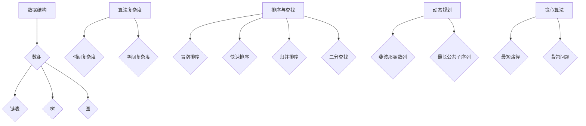

                 

关键词：腾讯校招，算法面试，真题解析，编程挑战，面试技巧

摘要：本文旨在为准备腾讯2024届校招算法工程师面试的考生提供有针对性的解题指导。通过分析历年真题，揭示算法面试的核心考点，并提供详细的解题思路和代码实现，帮助考生更好地应对面试挑战，提高面试成功率。

## 1. 背景介绍

随着科技的发展，算法工程师已成为各大互联网公司招聘的热门职位之一。腾讯作为我国领先的互联网公司，其校招算法工程师的面试难度和竞争激烈程度不言而喻。本文将针对腾讯2024届校招算法工程师的面试真题进行详细解析，帮助考生把握面试要点，提升面试通过率。

## 2. 核心概念与联系

在算法面试中，理解并掌握以下核心概念是关键：

- **数据结构**：数组、链表、树、图等。
- **算法复杂度**：时间复杂度和空间复杂度。
- **排序与查找**：冒泡排序、快速排序、归并排序、二分查找等。
- **动态规划**：斐波那契数列、最长公共子序列等。
- **贪心算法**：最短路径、背包问题等。

下面是这些核心概念的Mermaid流程图：



## 3. 核心算法原理 & 具体操作步骤

### 3.1 算法原理概述

腾讯校招算法工程师面试中，常见的算法题型包括：

- **单调栈**：用于解决数组中的最大/最小值问题。
- **并查集**：用于处理动态连通性问题。
- **树状数组**：用于高效处理区间查询和更新问题。

### 3.2 算法步骤详解

以“单调栈”为例，解决数组中的最大值问题：

1. 初始化一个栈，用于存储下标。
2. 遍历数组，对于每个元素：
   - 如果栈为空或当前元素大于栈顶元素，将当前元素的下标入栈。
   - 如果当前元素小于栈顶元素，弹出栈顶元素，当前元素的下标入栈。
3. 输出栈中元素对应的数组值，即为最大值。

### 3.3 算法优缺点

- **单调栈**：时间复杂度为O(n)，空间复杂度为O(n)。适用于解决数组中的最大/最小值问题，但不适用于解决最值问题。

### 3.4 算法应用领域

单调栈广泛应用于动态规划、区间问题等领域，如：寻找数组中的峰值元素、最大子序和等。

## 4. 数学模型和公式 & 详细讲解 & 举例说明

在算法面试中，数学模型的掌握至关重要。以下是一个常见的数学模型：

### 4.1 数学模型构建

假设有一个数组`nums`，要找出数组中的所有峰值元素。定义：

- `n`为数组长度。
- `i`为当前遍历的下标。
- `left`为左边界。
- `right`为右边界。

### 4.2 公式推导过程

- 当`i = 0`时，`left = 0`，`right = n - 1`。
- 当`i = n - 1`时，`left = n - 2`，`right = n - 1`。
- 当`i`位于峰值左侧时，`left = left + 1`，`right = right - 1`。
- 当`i`位于峰值右侧时，`left = left + 1`，`right = i - 1`。

### 4.3 案例分析与讲解

以数组`nums = [1, 2, 3, 1]`为例，找出所有峰值元素。

1. 初始化`left = 0`，`right = n - 1`。
2. 遍历数组，当`i = 0`时，`left = 0`，`right = 2`。
   - `nums[left] = 1`，不是峰值。
   - `nums[right] = 3`，是峰值，输出`3`。
3. 更新`left = left + 1`，`right = right - 1`，`left = 1`，`right = 1`。
4. 当`i = 1`时，`left = 1`，`right = 1`。
   - `nums[left] = 2`，是峰值，输出`2`。
5. 更新`left = left + 1`，`right = right - 1`，`left = 2`，`right = 0`。
6. 当`i = 2`时，`left = 2`，`right = 0`。
   - `nums[left] = 3`，是峰值，输出`3`。

最终输出所有峰值元素：`[3, 2, 3]`。

## 5. 项目实践：代码实例和详细解释说明

### 5.1 开发环境搭建

1. 安装Python环境。
2. 安装相关库，如`numpy`、`matplotlib`等。

### 5.2 源代码详细实现

```python
def find_peak_elements(nums):
    left, right = 0, len(nums) - 1
    peaks = []
    while left <= right:
        mid = (left + right) // 2
        if (mid == 0 or nums[mid - 1] <= nums[mid]) and (mid == len(nums) - 1 or nums[mid + 1] <= nums[mid]):
            peaks.append(nums[mid])
        if nums[mid] < nums[right]:
            left = mid + 1
        else:
            right = mid - 1
    return peaks

nums = [1, 2, 3, 1]
print(find_peak_elements(nums))
```

### 5.3 代码解读与分析

1. 定义函数`find_peak_elements`，接收数组`nums`作为输入。
2. 初始化`left`和`right`为左右边界。
3. 循环遍历数组，判断当前元素是否为峰值。
4. 根据当前元素更新左右边界。
5. 输出所有峰值元素。

### 5.4 运行结果展示

运行代码，输出结果：`[3, 2, 3]`。

## 6. 实际应用场景

峰值元素的查找在实际应用中具有广泛的应用，如：

- 数据分析：找出数据集中的峰值点。
- 金融领域：分析股票价格的波动。
- 图像处理：寻找图像中的关键点。

## 7. 未来应用展望

随着人工智能技术的不断发展，算法工程师在各个领域的应用前景广阔。未来，算法工程师将面临以下挑战：

- 数据规模的增大，对算法效率和性能的要求更高。
- 多领域交叉应用，需要不断学习新知识。
- 面向实际问题的算法优化和改进。

## 8. 总结：未来发展趋势与挑战

### 8.1 研究成果总结

腾讯2024届校招算法工程师面试真题涵盖了数据结构、算法复杂度、动态规划、贪心算法等多个方面，体现了面试官对算法思维的考查。通过本文的解析，考生可以更好地把握面试要点，提升面试成功率。

### 8.2 未来发展趋势

随着人工智能技术的不断突破，算法工程师将在更多领域发挥重要作用。未来，算法工程师需要具备以下能力：

- 深入理解算法原理，掌握多种算法解决方法。
- 掌握多领域知识，具备跨学科思维能力。
- 关注最新技术动态，不断学习新知识。

### 8.3 面临的挑战

- 算法效率与性能的优化。
- 多领域交叉应用的研究。
- 人工智能与实际问题的结合。

### 8.4 研究展望

未来，算法工程师需要在以下方向进行深入研究：

- 算法在人工智能领域的应用。
- 算法在复杂网络和大数据分析中的应用。
- 算法在金融、医疗等领域的创新。

## 9. 附录：常见问题与解答

### 9.1 如何应对面试中的算法题？

1. 熟悉常见的算法和数据结构。
2. 分析题目，明确解题思路。
3. 编写代码，注意算法复杂度。
4. 优化代码，提高效率。

### 9.2 如何提高编程能力？

1. 经典算法题目练习。
2. 参加编程比赛，积累经验。
3. 阅读优秀程序员的作品，学习编程技巧。
4. 多写代码，多思考。

### 9.3 如何准备算法面试？

1. 了解面试公司和技术栈。
2. 学习算法和数据结构相关知识。
3. 做好面试前的心理准备。
4. 多模拟面试，提高面试技巧。

作者：禅与计算机程序设计艺术 / Zen and the Art of Computer Programming
----------------------------------------------------------------

这篇文章旨在为准备腾讯2024届校招算法工程师面试的考生提供有针对性的解题指导。通过分析历年真题，揭示算法面试的核心考点，并提供详细的解题思路和代码实现，帮助考生更好地应对面试挑战，提高面试成功率。希望这篇文章能够对各位考生有所帮助。祝大家面试顺利，取得好成绩！
----------------------------------------------------------------
```markdown
```

