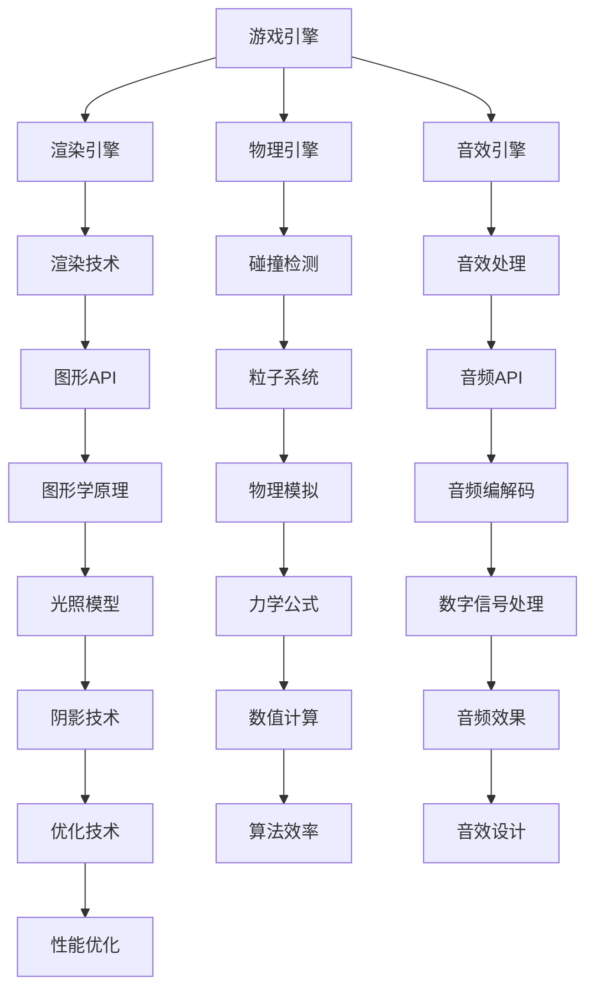

                 

关键词：腾讯、校招、游戏引擎、开发工程师、面试题集锦

摘要：本文将整理并分析腾讯2024校招游戏引擎开发工程师的面试题目，涵盖核心算法、数学模型、项目实践等方面，为即将参加腾讯校招的同学们提供有针对性的复习和准备。

## 1. 背景介绍

随着游戏产业的快速发展，游戏引擎技术在游戏开发和分发中扮演着越来越重要的角色。腾讯作为中国最大的游戏公司之一，对游戏引擎开发工程师的需求持续增长。为了选拔出优秀的人才，腾讯校招游戏引擎开发工程师的面试题往往涵盖了广泛的领域，包括编程能力、算法设计、数据结构、数学模型等。

本文将根据腾讯2024校招游戏引擎开发工程师的面试题集锦，整理出关键知识点和解答策略，帮助考生更好地应对面试挑战。

## 2. 核心概念与联系

游戏引擎开发涉及多个核心概念和技术，理解这些概念及其相互关系对开发游戏至关重要。以下是一个简化的Mermaid流程图，展示游戏引擎开发中的关键概念和其关系。



### 2.1 游戏引擎概述

游戏引擎是一种为游戏开发提供各种功能的软件框架，包括渲染、物理模拟、音效处理等。一个完整的游戏引擎应具备以下特点：

- **高度可配置性**：允许开发者根据项目需求定制各种功能模块。
- **模块化**：各个模块（如渲染、物理、音效等）可以独立开发和更新。
- **跨平台支持**：支持多种操作系统和硬件平台，如Windows、Linux、iOS、Android等。
- **强大的社区支持**：提供丰富的API和工具，以及活跃的开发者社区。

### 2.2 渲染引擎

渲染引擎是游戏引擎的核心组成部分，负责将游戏世界中的3D模型、纹理、光照等元素转化为屏幕上的图像。以下是一些关键的渲染技术和概念：

- **渲染管线**：一个由多个处理步骤组成的流水线，包括顶点处理、光栅化、像素处理等。
- **着色器**：使用高级着色语言（如GLSL、HLSL）编写的程序，用于计算顶点和像素的颜色。
- **阴影技术**：包括实时光照和静态光影，常用的技术有光线追踪、基于体积的光影等。
- **图形API**：如OpenGL、DirectX，提供底层图形操作的接口。

### 2.3 物理引擎

物理引擎用于模拟游戏世界中的物理现象，如碰撞、运动、重力等。以下是一些关键的物理引擎概念：

- **碰撞检测**：用于检测游戏对象之间是否发生碰撞，常用的算法有空间分割、扫掠和检测等。
- **物理模拟**：根据物理定律（如牛顿运动定律）计算游戏对象的运动轨迹。
- **粒子系统**：用于模拟各种自然现象，如火焰、烟雾、雨滴等。

### 2.4 音效引擎

音效引擎负责处理游戏中的音效，包括音效的创建、播放、混音等。以下是一些关键的音效引擎概念：

- **音效处理**：使用音频处理技术（如滤波、混响、压缩等）对音效进行编辑和增强。
- **音频API**：提供底层音频操作的接口，如OpenAL、DirectSound等。
- **音频编解码**：将音频信号转换为数字格式，常用的编解码器有MP3、AAC等。
- **音效设计**：根据游戏场景和氛围设计合适的音效，增强玩家的沉浸感。

## 3. 核心算法原理 & 具体操作步骤

### 3.1 算法原理概述

在游戏引擎开发中，常用的算法包括搜索算法、排序算法、空间分割算法等。以下是对这些算法的基本原理概述：

- **搜索算法**：用于在数据结构中查找特定元素，常用的搜索算法有二分搜索、广度优先搜索、深度优先搜索等。
- **排序算法**：用于对一组数据进行排序，常用的排序算法有快速排序、归并排序、堆排序等。
- **空间分割算法**：用于将游戏世界中的对象进行空间划分，以优化碰撞检测和渲染，常用的算法有四叉树、八叉树等。

### 3.2 算法步骤详解

#### 3.2.1 搜索算法

以二分搜索为例，其基本步骤如下：

1. 确定搜索区间，初始时为整个数组。
2. 计算区间的中点。
3. 比较目标值与中点值，如果相等，则搜索成功；否则，根据目标值与中点值的大小关系，调整搜索区间。
4. 重复步骤2和3，直到找到目标值或搜索区间为空。

#### 3.2.2 排序算法

以快速排序为例，其基本步骤如下：

1. 选择一个基准元素。
2. 将数组分为两部分，一部分小于基准元素，另一部分大于基准元素。
3. 递归地对小于和大于基准元素的部分进行快速排序。
4. 合并排序结果。

#### 3.2.3 空间分割算法

以四叉树为例，其基本步骤如下：

1. 将空间划分为四个相等的区域。
2. 对于每个区域，如果区域内的对象数量少于某个阈值，则将该区域标记为叶子节点。
3. 对于每个非叶子节点，递归地对每个子区域应用步骤1和2。
4. 当遇到对象时，将其添加到对应的叶子节点中。

### 3.3 算法优缺点

- **搜索算法**：二分搜索时间复杂度为O(log n)，适合处理大规模数据的快速查找。但需要数据有序，且不适合插入和删除操作。
- **排序算法**：快速排序平均时间复杂度为O(n log n)，但最坏情况下可能退化到O(n^2)。适用于需要排序的场景，但可能存在性能不稳定的问题。
- **空间分割算法**：四叉树可以高效地进行空间划分和查询，但可能会引起内存占用和性能问题，特别是在对象数量较多的情况下。

### 3.4 算法应用领域

搜索算法常用于游戏引擎中的碰撞检测、资源管理等。排序算法则用于各种数据结构的构建和优化，如四叉树、八叉树等。空间分割算法则广泛应用于游戏引擎中的空间划分、对象管理、渲染优化等。

## 4. 数学模型和公式 & 详细讲解 & 举例说明

### 4.1 数学模型构建

在游戏引擎开发中，数学模型用于描述各种物理现象和计算。以下是一个基本的物理模型构建示例：

- **运动模型**：使用牛顿运动定律描述物体的运动。
  - \( F = m \cdot a \)（力等于质量乘以加速度）
  - \( v = u + at \)（速度等于初始速度加上加速度乘以时间）
  - \( s = ut + \frac{1}{2}at^2 \)（位移等于初始速度乘以时间加上加速度乘以时间的平方）

- **碰撞模型**：使用弹性碰撞和动量守恒定律描述物体之间的碰撞。
  - 弹性碰撞：\( v_1' + v_2' = v_1 + v_2 \)
  - 动量守恒：\( m_1 \cdot v_1 + m_2 \cdot v_2 = m_1 \cdot v_1' + m_2 \cdot v_2' \)

### 4.2 公式推导过程

以弹性碰撞为例，推导过程如下：

1. 根据动量守恒定律，碰撞前后系统的总动量保持不变。
   - \( m_1 \cdot v_1 + m_2 \cdot v_2 = m_1 \cdot v_1' + m_2 \cdot v_2' \)

2. 根据弹性碰撞的定义，碰撞前后系统的总能量保持不变。
   - \( \frac{1}{2}m_1 \cdot v_1^2 + \frac{1}{2}m_2 \cdot v_2^2 = \frac{1}{2}m_1 \cdot v_1'^2 + \frac{1}{2}m_2 \cdot v_2'^2 \)

3. 联立上述两个方程，解得碰撞后速度：
   - \( v_1' = \frac{m_2 \cdot (v_1 - v_2)}{m_1 + m_2} + v_1 \)
   - \( v_2' = \frac{m_1 \cdot (v_2 - v_1)}{m_1 + m_2} + v_2 \)

### 4.3 案例分析与讲解

假设一个质量为2kg的球体A以10m/s的速度向右运动，与一个质量为3kg的球体B发生弹性碰撞。碰撞前球体B静止，求碰撞后两球的速度。

1. 根据动量守恒定律：
   - \( 2 \cdot 10 + 3 \cdot 0 = 2 \cdot v_1' + 3 \cdot v_2' \)
   - \( 20 = 2v_1' + 3v_2' \)

2. 根据弹性碰撞定义：
   - \( 2 \cdot 10^2 + 3 \cdot 0^2 = 2 \cdot v_1'^2 + 3 \cdot v_2'^2 \)
   - \( 200 = 2v_1'^2 + 3v_2'^2 \)

3. 联立方程，解得：
   - \( v_1' = \frac{3 \cdot (0 - 10)}{2 + 3} + 10 = \frac{-30}{5} + 10 = 0 \)
   - \( v_2' = \frac{2 \cdot (10 - 0)}{2 + 3} + 0 = \frac{20}{5} = 4 \)

因此，碰撞后球体A的速度为0，球体B的速度为4m/s。

## 5. 项目实践：代码实例和详细解释说明

### 5.1 开发环境搭建

为了演示游戏引擎开发的过程，我们将使用C++和OpenGL创建一个简单的3D渲染程序。以下是开发环境搭建的步骤：

1. 安装Visual Studio 2019（或更高版本），用于编写和编译C++代码。
2. 安装OpenGL库，可以通过下载官方库文件或使用第三方库（如GLM）。
3. 配置CMake，用于构建项目。

### 5.2 源代码详细实现

以下是一个简单的OpenGL渲染程序的源代码：

```cpp
#include <glad/glad.h>
#include <GLFW/glfw3.h>

#include <iostream>

const char* vertexShaderSource = "#version 330 core\n"
    "layout (location = 0) in vec3 aPos;\n"
    "void main()\n"
    "{\n"
    "   gl_Position = vec4(aPos.x, aPos.y, aPos.z, 1.0);\n"
    "}\0";
const char* fragmentShaderSource = "#version 330 core\n"
    "out vec4 FragColor;\n"
    "void main()\n"
    "{\n"
    "   FragColor = vec4(1.0f, 0.5f, 0.2f, 1.0f);\n"
    "}\0";

int main() {
    // 初始化GLFW
    glfwInit();

    // 创建窗口
    GLFWwindow* window = glfwCreateWindow(800, 600, "LearnOpenGL", NULL, NULL);
    if (window == NULL) {
        std::cout << "Failed to create GLFW window" << std::endl;
        glfwTerminate();
        return -1;
    }
    glfwMakeContextCurrent(window);

    // 初始化GLAD
    if (!gladLoadGLLoader((GLADloadproc)glfwGetProcAddress)) {
        std::cout << "Failed to initialize GLAD" << std::endl;
        return -1;
    }

    // 编译着色器
    unsigned int vertexShader;
    vertexShader = glCreateShader(GL_VERTEX_SHADER);
    glShaderSource(vertexShader, 1, &vertexShaderSource, NULL);
    glCompileShader(vertexShader);

    unsigned int fragmentShader;
    fragmentShader = glCreateShader(GL_FRAGMENT_SHADER);
    glShaderSource(fragmentShader, 1, &fragmentShaderSource, NULL);
    glCompileShader(fragmentShader);

    // 创建着色器程序
    unsigned int shaderProgram;
    shaderProgram = glCreateProgram();
    glAttachShader(shaderProgram, vertexShader);
    glAttachShader(shaderProgram, fragmentShader);
    glLinkProgram(shaderProgram);

    // 设置顶点数据并配置顶点缓冲
    float vertices[] = {
        -0.5f, -0.5f, 0.0f, // 左下角
         0.5f, -0.5f, 0.0f, // 右下角
         0.5f,  0.5f, 0.0f, // 右上角
        -0.5f,  0.5f, 0.0f  // 左上角
    };
    unsigned int VBO, VAO;
    glGenVertexArrays(1, &VAO);
    glGenBuffers(1, &VBO);

    glBindVertexArray(VAO);

    glBindBuffer(GL_ARRAY_BUFFER, VBO);
    glBufferData(GL_ARRAY_BUFFER, sizeof(vertices), vertices, GL_STATIC_DRAW);

    glVertexAttribPointer(0, 3, GL_FLOAT, GL_FALSE, 3 * sizeof(float), (void*)0);
    glEnableVertexAttribArray(0);

    glBindBuffer(GL_ARRAY_BUFFER, 0); 
    glBindVertexArray(0); 

    // 渲染循环
    while (!glfwWindowShouldClose(window)) {
        // 输入处理
        // ...

        // 渲染指令
        glClearColor(0.2f, 0.3f, 0.3f, 1.0f);
        glClear(GL_COLOR_BUFFER_BIT);

        // 绑定着色器程序
        glUseProgram(shaderProgram);

        // 绘制三角形
        glBindVertexArray(VAO);
        glDrawArrays(GL_TRIANGLES, 0, 3);
        glBindVertexArray(0);

        // 交换缓冲区
        glfwSwapBuffers(window);

        // 处理事件
        // ...
    }

    // 清理资源
    glDeleteVertexArrays(1, &VAO);
    glDeleteBuffers(1, &VBO);
    glDeleteShader(vertexShader);
    glDeleteShader(fragmentShader);

    glfwTerminate();
    return 0;
}
```

### 5.3 代码解读与分析

该代码实现了一个简单的OpenGL渲染程序，主要步骤如下：

1. 初始化GLFW和创建窗口。
2. 初始化GLAD并加载OpenGL函数指针。
3. 编译顶点着色器和片段着色器。
4. 创建着色器程序并将顶点着色器和片段着色器附加到程序中。
5. 设置顶点数据并配置顶点缓冲。
6. 渲染循环：
   - 设置背景色并清除屏幕。
   - 绑定着色器程序。
   - 绘制三角形。
   - 交换缓冲区。

### 5.4 运行结果展示

运行该程序后，将弹出一个窗口，显示一个红色的三角形。这表明OpenGL环境已经成功配置，并且着色器程序被正确执行。

## 6. 实际应用场景

游戏引擎广泛应用于各种游戏开发和分发场景，以下是一些实际应用场景：

- **大型多人在线游戏（MMO）**：如《英雄联盟》、《魔兽世界》等，需要高性能的渲染、物理模拟和音效处理。
- **手机游戏**：如《王者荣耀》、《和平精英》等，要求跨平台兼容性和良好的性能。
- **虚拟现实（VR）**：如《半衰期：爱莉克斯》等，需要高度沉浸式的体验和实时渲染。
- **电子竞技游戏**：如《DOTA 2》、《CS:GO》等，要求低延迟和高帧率。

## 7. 未来应用展望

随着技术的不断发展，游戏引擎的应用前景将更加广阔。以下是一些未来应用展望：

- **增强现实（AR）**：将游戏引擎应用于AR场景，为用户提供更加沉浸式的体验。
- **游戏化教育**：利用游戏引擎开发交互式教育内容，提高学习效果。
- **智能模拟**：应用于模拟和仿真领域，为科学研究提供强大支持。
- **游戏引擎云服务**：提供即插即用的游戏引擎服务，降低开发门槛。

## 8. 工具和资源推荐

### 8.1 学习资源推荐

- **《OpenGL编程指南》**：详细介绍了OpenGL的基础知识和高级特性。
- **《计算机图形学：原理及实践》**：涵盖了计算机图形学的核心理论和实际应用。
- **《游戏引擎架构》**：介绍了游戏引擎的设计和实现原理。

### 8.2 开发工具推荐

- **Visual Studio**：一款功能强大的集成开发环境，适用于游戏引擎开发。
- **Unity**：一款广泛使用的游戏引擎，提供丰富的开发工具和资源。
- **Unreal Engine**：一款高性能的游戏引擎，适用于高端游戏开发和虚拟现实应用。

### 8.3 相关论文推荐

- **"Real-Time Rendering"**：介绍实时渲染的最新技术和应用。
- **"The Graphics Pipeline"**：详细阐述了图形渲染管道的工作原理。
- **"Game Engine Architecture"**：探讨了游戏引擎的设计和架构。

## 9. 总结：未来发展趋势与挑战

### 9.1 研究成果总结

近年来，游戏引擎技术取得了显著进展，特别是在实时渲染、物理模拟和音效处理等方面。研究成果包括新的渲染技术（如基于体积的光影、全局光照）、高性能计算方法（如并行计算、分布式计算）以及跨平台兼容性优化等。

### 9.2 未来发展趋势

未来，游戏引擎技术将继续朝着更高效、更逼真、更智能的方向发展。主要趋势包括：

- **更高效的渲染技术**：基于硬件加速的实时渲染，如基于GPU的光线追踪。
- **更逼真的物理模拟**：利用机器学习技术提高物理模拟的精度和效率。
- **更智能的交互系统**：基于AI的游戏引擎，为用户提供更加智能化、个性化的游戏体验。
- **更广泛的跨平台支持**：实现跨平台的高性能游戏开发，降低开发门槛。

### 9.3 面临的挑战

尽管游戏引擎技术取得了显著进展，但仍面临一些挑战，包括：

- **性能优化**：如何在高性能硬件上实现更高效的渲染和处理。
- **兼容性**：如何实现不同平台和硬件之间的兼容性，降低开发成本。
- **用户体验**：如何为用户提供更加沉浸式、个性化的游戏体验。
- **可持续性**：如何在保证性能和功能的同时，降低能源消耗和环境影响。

### 9.4 研究展望

未来，游戏引擎技术将在多个领域发挥重要作用，如虚拟现实、增强现实、游戏化教育、智能模拟等。研究应重点关注以下方面：

- **高性能计算**：探索新型计算架构和算法，提高游戏引擎的性能和效率。
- **智能交互**：结合人工智能技术，提高游戏引擎的智能化水平。
- **可持续开发**：关注游戏引擎的可持续性，降低能源消耗和环境影响。
- **跨学科研究**：结合计算机科学、物理学、心理学等多学科知识，推动游戏引擎技术的发展。

## 附录：常见问题与解答

### Q1. 游戏引擎开发需要哪些编程语言和工具？

A1. 游戏引擎开发常用的编程语言包括C++、C#、Python等。开发工具主要包括Unity、Unreal Engine、Visual Studio等。

### Q2. 游戏引擎的渲染技术有哪些？

A2. 游戏引擎的渲染技术包括光线追踪、全局光照、基于体积的光影、阴影技术等。

### Q3. 游戏引擎的物理引擎如何工作？

A3. 游戏引擎的物理引擎使用物理定律（如牛顿运动定律）来计算物体的运动和碰撞。它包括碰撞检测、物理模拟、粒子系统等功能。

### Q4. 游戏引擎的音效引擎如何工作？

A4. 游戏引擎的音效引擎负责处理游戏的音效，包括音效的创建、播放、混音等。它使用音频API和音频处理技术来生成和增强音效。

### Q5. 如何优化游戏引擎的性能？

A5. 优化游戏引擎性能的方法包括：减少渲染对象数量、优化渲染管线、使用并行计算、优化算法和数据结构等。

## 作者署名

作者：禅与计算机程序设计艺术 / Zen and the Art of Computer Programming

