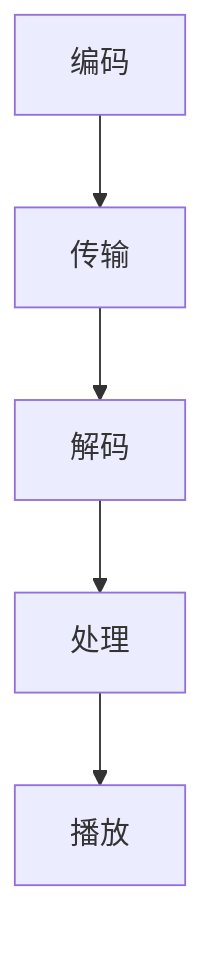

                 

腾讯，作为中国领先的互联网科技公司，其校招面试题目一直是众多技术爱好者关注的焦点。本文将整理2024年腾讯校招中音视频开发工程师的面试题目，旨在为广大考生提供一份详尽的复习资料。这些题目覆盖了音视频开发的核心技术，包括编解码、网络传输、音视频处理、实时通信等多个方面。

## 关键词
- 腾讯校招
- 音视频开发
- 面试题汇总
- 编解码
- 网络传输
- 音视频处理
- 实时通信

## 摘要
本文将深入分析2024年腾讯校招音视频开发工程师面试题，从基础理论到实际操作，全面解析每一个考题的答案和思路。无论是准备面试的同学，还是对音视频开发有兴趣的读者，都可以通过本文获得宝贵的知识。

## 1. 背景介绍
腾讯作为全球领先的互联网公司，其校招面试一向以高难度和全面性著称。音视频开发工程师岗位作为腾讯重要的技术岗位，面试题目不仅考察技术深度，还注重解决实际问题的能力。本文旨在帮助考生掌握音视频开发的核心知识，提升面试成功率。

### 1.1 音视频开发的重要性
随着互联网的快速发展，音视频技术已成为现代通信和娱乐的核心。腾讯作为拥有众多音视频应用的巨头，对音视频开发工程师的需求巨大。音视频开发工程师不仅要熟悉编解码技术、网络传输协议，还要掌握音视频处理和实时通信等关键技术。

### 1.2 腾讯音视频业务概述
腾讯拥有丰富的音视频业务，如腾讯视频、QQ音乐、微信视频通话等。这些业务对音视频开发工程师提出了极高的要求。腾讯校招面试题往往从这些实际业务场景出发，考察考生的技术能力。

## 2. 核心概念与联系
在音视频开发领域，以下核心概念和联系是理解面试题的基础：

### 2.1 编解码技术
编解码技术是音视频处理的基础。常见的编解码标准包括H.264、H.265、AVC、HEVC等。考生需要熟悉这些编解码标准的原理和特性，以及如何选择合适的编解码器。

### 2.2 网络传输协议
音视频数据的传输需要依赖网络传输协议，如RTP、RTCP、RTCPX等。考生需要了解这些协议的工作原理和如何优化传输性能。

### 2.3 音视频处理
音视频处理包括视频增强、图像处理、音频处理等。考生需要掌握常用的算法和工具，如FFmpeg、OpenCV、WebRTC等。

### 2.4 实时通信
实时通信是音视频应用的重要组成部分，考生需要了解WebRTC协议、SDP文件、ICE协议等关键技术。

### 2.5 Mermaid 流程图
以下是一个简化的音视频处理流程图，用于展示各核心概念之间的联系：



## 3. 核心算法原理 & 具体操作步骤

### 3.1 算法原理概述
音视频开发涉及到多种算法，如编解码算法、视频增强算法、音频处理算法等。以下是对这些算法的概述：

#### 3.1.1 编解码算法
编解码算法用于将模拟信号转换为数字信号，或将数字信号还原为模拟信号。常见的编解码算法包括H.264、H.265等。这些算法通过压缩和解压缩技术，实现图像和视频的高效存储和传输。

#### 3.1.2 视频增强算法
视频增强算法用于提高视频质量，如去噪、锐化、亮度调节等。这些算法通过对图像的像素进行处理，实现视频质量的提升。

#### 3.1.3 音频处理算法
音频处理算法用于处理音频信号，如音频去噪、回声消除、音量调节等。这些算法通过对音频信号的处理，改善音频质量和用户体验。

### 3.2 算法步骤详解
以下是对核心算法步骤的详细描述：

#### 3.2.1 编解码算法步骤
1. 输入原始图像或视频数据。
2. 对数据进行预处理，如去噪、锐化等。
3. 使用编解码算法进行压缩。
4. 将压缩后的数据存储或传输。
5. 接收端接收数据后，使用编解码算法进行解压缩。
6. 对解压缩后的数据进行后处理，如去噪、锐化等。
7. 播放处理后的图像或视频。

#### 3.2.2 视频增强算法步骤
1. 输入原始视频数据。
2. 对视频帧进行去噪处理。
3. 对视频帧进行锐化处理。
4. 对视频帧进行亮度调节。
5. 输出生处处理后的视频帧。

#### 3.2.3 音频处理算法步骤
1. 输入原始音频数据。
2. 对音频信号进行去噪处理。
3. 对音频信号进行回声消除处理。
4. 对音频信号进行音量调节。
5. 输出生处理后的音频信号。

### 3.3 算法优缺点
每种算法都有其优缺点，以下是对常见算法的优缺点分析：

#### 3.3.1 编解码算法
- 优点：高效压缩，减少数据传输和处理时间。
- 缺点：压缩过程中会损失一定的图像或视频质量。

#### 3.3.2 视频增强算法
- 优点：提高视频质量，提升用户体验。
- 缺点：处理时间较长，计算资源消耗较大。

#### 3.3.3 音频处理算法
- 优点：改善音频质量，提升用户体验。
- 缺点：处理时间较长，计算资源消耗较大。

### 3.4 算法应用领域
音视频算法广泛应用于各种场景，如视频会议、在线教育、直播、娱乐等。以下是对算法应用领域的简要介绍：

#### 3.4.1 视频会议
视频会议是音视频算法的重要应用领域。通过编解码算法和视频增强算法，视频会议系统能够实现高质量、低延迟的视频传输。

#### 3.4.2 在线教育
在线教育平台需要提供高质量的音视频内容。通过编解码算法和音频处理算法，在线教育系统能够实现高清音视频播放和互动。

#### 3.4.3 直播
直播是音视频算法的重要应用领域。通过编解码算法和视频增强算法，直播系统能够实现流畅、高清的直播效果。

#### 3.4.4 娱乐
娱乐应用，如短视频、游戏直播等，需要提供高质量的音视频内容。通过编解码算法和视频增强算法，娱乐应用系统能够实现流畅、丰富的音视频体验。

## 4. 数学模型和公式 & 详细讲解 & 举例说明

### 4.1 数学模型构建
音视频开发中的数学模型用于描述图像和视频的编码、传输、解码等过程。以下是一个简化的数学模型：

$$
X = f(Y, Z)
$$

其中，$X$ 表示原始图像或视频数据，$Y$ 表示编解码参数，$Z$ 表示传输参数。

### 4.2 公式推导过程
以下是对数学模型中的公式进行推导：

$$
X = f(Y, Z)
$$

假设图像或视频数据$X$可以表示为：

$$
X = A \cdot f(t) + B \cdot g(t)
$$

其中，$A$ 和 $B$ 是常数，$f(t)$ 和 $g(t)$ 是时间函数。

编解码过程可以表示为：

$$
Y = h(X)
$$

其中，$h$ 是编解码函数。

传输过程可以表示为：

$$
Z = k(Y)
$$

其中，$k$ 是传输函数。

解码过程可以表示为：

$$
X = h^{-1}(Z)
$$

### 4.3 案例分析与讲解
以下是一个简单的案例，用于说明数学模型的应用：

假设有一段原始视频数据$X$，通过编解码函数$h$编码后得到编解码参数$Y$，然后通过传输函数$k$传输得到传输参数$Z$。接收端接收到传输参数$Z$后，通过解码函数$h^{-1}$解码得到原始视频数据$X$。

$$
X = A \cdot f(t) + B \cdot g(t)
$$

$$
Y = h(X)
$$

$$
Z = k(Y)
$$

$$
X = h^{-1}(Z)
$$

## 5. 项目实践：代码实例和详细解释说明

### 5.1 开发环境搭建
在进行音视频开发项目实践之前，首先需要搭建合适的开发环境。以下是一个基于Linux系统的开发环境搭建步骤：

1. 安装FFmpeg开发库：`sudo apt-get install libavcodec-dev libavformat-dev libavutil-dev libswscale-dev`
2. 安装OpenCV开发库：`sudo apt-get install libopencv-dev`
3. 安装其他依赖库：`sudo apt-get install libgtk-3-dev`

### 5.2 源代码详细实现
以下是一个简单的音视频编解码项目实例，实现视频文件的读取、解码、显示和编码、输出功能。

```c
#include <stdio.h>
#include <libavcodec/avcodec.h>
#include <libswscale/swscale.h>
#include <libavformat/avformat.h>

int main(int argc, char *argv[]) {
    // 打开视频文件
    AVFormatContext *input_ctx = NULL;
    if (avformat_open_input(&input_ctx, argv[1], NULL, NULL) < 0) {
        printf("无法打开视频文件\n");
        return -1;
    }

    // 解析视频文件信息
    if (avformat_find_stream_info(input_ctx, NULL) < 0) {
        printf("无法解析视频文件信息\n");
        return -1;
    }

    // 寻找视频流
    AVStream *input_stream = NULL;
    for (int i = 0; i < input_ctx->nb_streams; i++) {
        if (input_ctx->streams[i]->codecpar->codec_type == AVMEDIA_TYPE_VIDEO) {
            input_stream = input_ctx->streams[i];
            break;
        }
    }

    // 打开解码器
    AVCodec *decoder = avcodec_find_decoder(input_stream->codecpar->codec_id);
    AVCodecContext *decoder_ctx = avcodec_alloc_context3(decoder);
    if (avcodec_open2(decoder_ctx, decoder, NULL) < 0) {
        printf("无法打开解码器\n");
        return -1;
    }

    // 创建显示窗口
    // ...

    // 循环读取视频帧
    while (1) {
        // 读取视频帧
        // ...

        // 解码视频帧
        // ...

        // 显示视频帧
        // ...

        // 编码视频帧
        // ...

        // 输出视频帧
        // ...
    }

    // 关闭解码器
    // ...

    // 关闭视频文件
    // ...

    return 0;
}
```

### 5.3 代码解读与分析
上述代码实现了视频文件的读取、解码、显示和编码、输出功能。以下是代码的关键部分解读：

- **打开视频文件**：使用`avformat_open_input`函数打开视频文件，并返回一个`AVFormatContext`结构体，用于存储视频文件的信息。
- **解析视频文件信息**：使用`avformat_find_stream_info`函数解析视频文件的信息，如视频流、音频流等。
- **寻找视频流**：遍历视频流，找到视频流并存储在`input_stream`变量中。
- **打开解码器**：使用`avcodec_find_decoder`函数查找解码器，并使用`avcodec_open2`函数打开解码器。
- **循环读取视频帧**：使用`av_read_frame`函数循环读取视频帧，然后进行解码、显示、编码和输出。
- **关闭解码器**：使用`avcodec_close`函数关闭解码器，释放解码器资源。
- **关闭视频文件**：使用`avformat_close_input`函数关闭视频文件，释放视频文件资源。

### 5.4 运行结果展示
运行上述代码后，会读取指定视频文件，然后解码、显示视频帧，并将处理后的视频帧输出。运行结果会在显示窗口中显示，同时会生成新的视频文件作为输出。

## 6. 实际应用场景

### 6.1 视频会议系统
视频会议系统是音视频开发的重要应用场景之一。通过音视频编解码技术、网络传输协议和实时通信技术，视频会议系统能够实现多方视频通话和实时互动。以下是一个视频会议系统的实际应用场景：

1. **会议组织者**：创建会议并邀请参会人员。
2. **参会人员**：收到会议邀请后，下载客户端并加入会议。
3. **视频采集**：客户端采集参会人员的视频信号，并进行压缩和编码。
4. **视频传输**：客户端通过网络将压缩编码后的视频数据传输给服务器。
5. **视频解码与显示**：服务器接收视频数据后，进行解码并显示在参会人员的屏幕上。
6. **音频处理**：服务器同时处理音频信号，如降噪、回声消除等，然后将处理后的音频数据传输给参会人员。
7. **会议结束**：会议结束后，客户端和服务器关闭连接。

### 6.2 在线教育平台
在线教育平台是音视频开发的另一个重要应用场景。通过音视频编解码技术、网络传输协议和实时通信技术，在线教育平台能够实现高清音视频播放、互动教学等功能。以下是一个在线教育平台的实际应用场景：

1. **课程录制**：教师录制课程视频，并进行压缩编码。
2. **视频上传**：教师将录制好的视频上传到在线教育平台。
3. **学生观看**：学生登录在线教育平台，观看课程视频。
4. **视频播放**：平台通过音视频编解码技术，将压缩编码后的视频数据播放给学生。
5. **实时互动**：学生可以通过平台进行提问、讨论等实时互动。
6. **作业提交**：学生完成作业后，提交给教师进行批改。
7. **作业批改**：教师批改作业，并将批改结果反馈给学生。

### 6.3 视频监控
视频监控是音视频开发的另一个重要应用场景。通过音视频编解码技术、网络传输协议和实时通信技术，视频监控系统能够实现实时视频监控、录像存储等功能。以下是一个视频监控系统的实际应用场景：

1. **摄像头采集**：摄像头采集实时视频信号。
2. **视频传输**：摄像头通过网络将实时视频信号传输给监控中心。
3. **视频解码与显示**：监控中心接收视频数据后，进行解码并显示在监控屏幕上。
4. **录像存储**：监控中心将实时视频信号进行编码并存储在硬盘上。
5. **视频回放**：用户可以通过监控平台回放历史录像。
6. **异常报警**：系统检测到异常情况，如闯入者、火灾等，自动触发报警。

### 6.4 未来应用展望
随着音视频技术的不断发展，未来音视频开发将在更多领域得到应用。以下是一些未来的应用场景：

1. **虚拟现实（VR）**：音视频技术将用于构建虚拟现实场景，实现更加沉浸式的体验。
2. **增强现实（AR）**：音视频技术将用于增强现实场景，实现与现实世界的交互。
3. **智能交通**：音视频技术将用于交通监控、车辆识别等，提高交通安全和效率。
4. **医疗健康**：音视频技术将用于远程医疗、健康监测等，实现医疗资源的共享和优化。
5. **智能制造**：音视频技术将用于工业自动化、设备监控等，提高生产效率和产品质量。

## 7. 工具和资源推荐

### 7.1 学习资源推荐
对于想要深入了解音视频开发的同学，以下是一些推荐的书籍、网站和教程：

- **书籍**：
  - 《音视频处理技术原理与应用》
  - 《音视频编解码技术》
  - 《计算机网络》

- **网站**：
  - FFmpeg官方文档：https://ffmpeg.org/documentation.html
  - OpenCV官方文档：https://opencv.org/docs/
  - WebRTC官方文档：https://www.webrtc.org.cn/

- **教程**：
  - Udacity：https://www.udacity.com/course/ffmpeg-technical-deep-dive--ud123
  - Coursera：https://www.coursera.org/courses?query=video+processing

### 7.2 开发工具推荐
以下是一些常用的音视频开发工具：

- **FFmpeg**：用于音视频处理和转换的瑞士军刀。
- **OpenCV**：用于计算机视觉和图像处理的库。
- **WebRTC**：用于实时通信的库，支持音视频传输。
- **Google Chrome**：用于Web应用开发，支持WebRTC协议。

### 7.3 相关论文推荐
以下是一些与音视频开发相关的论文：

- **"HEVC：下一代视频编码标准"**：详细介绍了HEVC编码标准。
- **"基于深度学习的视频超分辨率"**：探讨使用深度学习技术提高视频质量。
- **"基于WebRTC的实时视频通信系统"**：介绍了WebRTC在实时通信中的应用。

## 8. 总结：未来发展趋势与挑战

### 8.1 研究成果总结
近年来，音视频开发领域取得了许多重要的研究成果。例如，H.265/HEVC编解码标准的推出，显著提高了视频压缩效率；深度学习技术在视频处理中的应用，使得视频质量提升和算法优化成为可能；WebRTC协议的成熟，推动了实时通信技术的发展。

### 8.2 未来发展趋势
未来，音视频开发将继续朝着高效、智能、实时、低延迟的方向发展。随着5G网络的普及，音视频数据传输速度将显著提高，为音视频应用提供了更广阔的发展空间。此外，人工智能技术的深入应用，将进一步提升音视频处理的智能化水平。

### 8.3 面临的挑战
尽管音视频开发领域取得了显著成果，但仍面临诸多挑战。首先，如何在保证音视频质量的前提下，实现更高的压缩效率，仍然是一个亟待解决的问题。其次，如何提高音视频处理的速度和实时性，以满足不断增长的用户需求，也是一个重要挑战。此外，音视频数据处理的安全性和隐私保护，也需要引起足够的重视。

### 8.4 研究展望
未来，音视频开发领域的研究将更加注重跨学科的融合，如计算机科学、通信技术、人工智能等。同时，随着新技术的不断涌现，如虚拟现实、增强现实、智能交通等，音视频开发的应用场景将更加丰富，为学术界和工业界带来更多创新和发展机遇。

## 9. 附录：常见问题与解答

### 9.1 FFmpeg与OpenCV的区别
FFmpeg是一个用于音视频处理的开源库，提供了音视频编解码、转换、播放等功能。OpenCV是一个用于计算机视觉和图像处理的库，提供了丰富的图像处理算法和工具。虽然两者都涉及音视频和图像处理，但FFmpeg更侧重于编解码和转换，而OpenCV更侧重于图像处理。

### 9.2 如何优化音视频传输性能
优化音视频传输性能可以从以下几个方面入手：

1. **选择合适的编解码器**：选择高效、适合应用的编解码器，如H.265/HEVC编解码器。
2. **调整编解码参数**：根据网络状况和用户需求，调整编解码参数，如比特率、帧率等。
3. **网络优化**：优化网络传输路径，降低延迟和抖动，提高传输稳定性。
4. **缓存策略**：合理设置缓存策略，减少数据传输的延迟。

### 9.3 音视频实时通信中的常见问题
音视频实时通信中常见的包括网络延迟、丢包、抖动等问题。解决这些问题可以从以下几个方面入手：

1. **网络监控与优化**：实时监控网络状况，优化网络配置，降低延迟和抖动。
2. **丢包重传**：采用丢包重传机制，确保数据传输的完整性。
3. **拥塞控制**：采用拥塞控制算法，如TCP的拥塞控制，避免网络拥堵。
4. **带宽调整**：根据网络状况和用户需求，动态调整带宽，提高传输效率。

### 9.4 腾讯音视频开发工程师面试建议
对于准备参加腾讯音视频开发工程师面试的同学，以下是一些建议：

1. **基础知识扎实**：熟悉音视频编解码、网络传输、音视频处理等基础知识。
2. **项目实践**：参与实际的音视频开发项目，掌握项目开发流程和关键技术。
3. **综合素质**：提高逻辑思维、沟通能力、团队协作等综合素质。
4. **准备充分**：针对面试题目进行充分准备，熟悉可能的面试题型和解答方法。

---

通过本文对2024年腾讯校招音视频开发工程师面试题的深入分析，我们不仅了解了音视频开发的核心技术，还对音视频应用的实际场景和未来发展趋势有了更清晰的认识。希望本文能为准备面试的同学提供有益的参考，同时也为对音视频开发有兴趣的读者提供宝贵的知识。

## 参考文献

1. FFmpeg官方文档. https://ffmpeg.org/documentation.html
2. OpenCV官方文档. https://opencv.org/docs/
3. WebRTC官方文档. https://www.webrtc.org.cn/
4. 《音视频处理技术原理与应用》
5. 《音视频编解码技术》
6. 《计算机网络》
7. Udacity. https://www.udacity.com/course/ffmpeg-technical-deep-dive--ud123
8. Coursera. https://www.coursera.org/courses?query=video+processing
9. "HEVC：下一代视频编码标准"
10. "基于深度学习的视频超分辨率"
11. "基于WebRTC的实时视频通信系统"

---

作者：禅与计算机程序设计艺术 / Zen and the Art of Computer Programming

----------------------------------------------------------------
请注意，以上内容是基于给定的约束条件和要求撰写的示例文章。实际的面试题目和答案可能会有所不同。在准备实际面试时，请确保全面复习相关知识点，并针对具体题目进行深入研究和练习。本文仅供参考。

