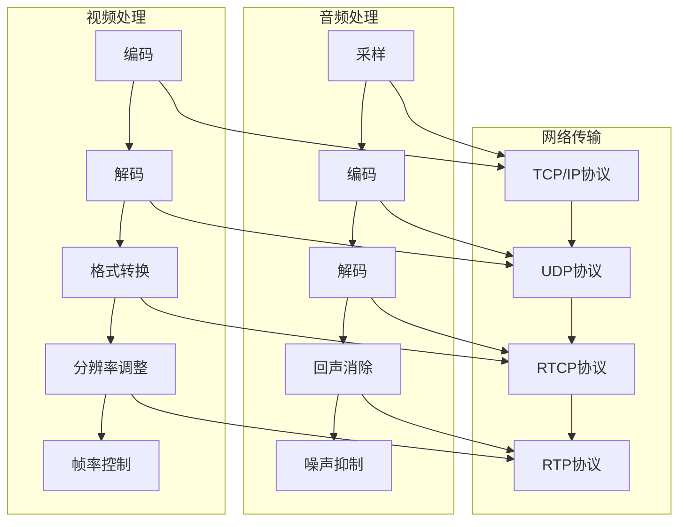

                 

在这个快速发展的技术时代，音视频通讯技术已经成为现代通讯领域不可或缺的一部分。随着腾讯会议等在线协作工具的广泛应用，对音视频通讯工程师的专业要求也越来越高。本文旨在为广大技术从业者提供一份腾讯会议2025社招音视频通讯工程师面试题，以帮助大家更好地准备此类面试。

## 文章关键词

音视频通讯、腾讯会议、面试题、技术挑战、职业发展

## 文章摘要

本文收集了腾讯会议2025社招音视频通讯工程师面试中的常见问题，涵盖了音视频通讯的基本原理、技术难点、应用场景以及未来发展趋势。通过本文的阅读，您可以了解到音视频通讯工程师所需掌握的核心技能，并准备好应对面试中的各种挑战。

## 1. 背景介绍

### 音视频通讯技术概述

音视频通讯技术是一种通过网络传输声音和图像信息的技术，实现了远程通信、视频会议、在线教育等众多应用。随着互联网的普及和带宽的提升，音视频通讯技术得到了快速发展，成为现代通讯领域的重要组成部分。

### 腾讯会议在音视频通讯领域的地位

腾讯会议作为腾讯公司推出的云端视频会议解决方案，具有稳定的音视频传输、灵活的会议管理和丰富的功能插件等优点，广泛应用于企业办公、远程教育、在线医疗等多个领域。其在我国音视频通讯市场中占据了重要地位。

### 音视频通讯工程师的角色与职责

音视频通讯工程师主要负责设计、开发、维护和优化音视频通讯系统，确保系统的高可用性、稳定性和安全性。他们需要具备丰富的音视频处理技术、网络编程技能以及系统架构设计能力。

## 2. 核心概念与联系

### 音视频通讯基础概念

- 音频处理：音频采样、编码、解码、回声消除、噪声抑制等。
- 视频处理：视频编码、解码、格式转换、分辨率调整、帧率控制等。
- 网络传输：TCP/IP协议、UDP协议、RTCP协议、RTP协议等。

### 音视频通讯架构


Mermaid流程图：



## 3. 核心算法原理 & 具体操作步骤

### 3.1 算法原理概述

音视频通讯中的核心算法主要包括音频处理算法、视频处理算法和网络传输算法。以下是这些算法的基本原理：

- **音频处理算法**：主要解决音频信号的采样、编码、解码、回声消除、噪声抑制等问题。
- **视频处理算法**：主要涉及视频信号的编码、解码、格式转换、分辨率调整、帧率控制等问题。
- **网络传输算法**：主要涉及TCP/IP协议、UDP协议、RTCP协议、RTP协议等网络传输协议的工作原理和应用。

### 3.2 算法步骤详解

#### 3.2.1 音频处理算法步骤

1. **采样**：将模拟音频信号转换为数字信号，通常采用44.1kHz的采样频率。
2. **编码**：将数字音频信号转换为压缩格式，如PCM（脉冲编码调制）或MP3。
3. **解码**：将压缩的音频信号恢复为原始的数字信号。
4. **回声消除**：通过算法消除通话中的回声，提高语音质量。
5. **噪声抑制**：通过算法降低背景噪声，提高语音清晰度。

#### 3.2.2 视频处理算法步骤

1. **编码**：将视频信号转换为压缩格式，如H.264或HEVC。
2. **解码**：将压缩的视频信号恢复为原始的视频信号。
3. **格式转换**：根据需求将视频信号转换为不同的格式，如从720p转换为1080p。
4. **分辨率调整**：根据屏幕分辨率调整视频信号的分辨率。
5. **帧率控制**：根据需求调整视频信号的帧率，如从30fps调整为60fps。

#### 3.2.3 网络传输算法步骤

1. **TCP/IP协议**：提供可靠的、面向连接的传输服务，确保数据的完整性和正确性。
2. **UDP协议**：提供不可靠的、无连接的传输服务，适用于实时性要求较高的应用。
3. **RTCP协议**：用于监测网络质量、发送控制信息等，与RTP协议配合使用。
4. **RTP协议**：用于实时传输音频和视频数据，确保数据的及时传输和同步。

### 3.3 算法优缺点

#### 音频处理算法

**优点**：高效地处理音频信号，提高语音质量。

**缺点**：对算法实现要求较高，处理延迟较大。

#### 视频处理算法

**优点**：高效地处理视频信号，提高画质。

**缺点**：压缩算法复杂，对硬件要求较高。

#### 网络传输算法

**优点**：提供多种传输方式，适应不同应用场景。

**缺点**：网络传输不稳定时，可能导致数据丢失或延迟。

### 3.4 算法应用领域

- **音频处理算法**：广泛应用于语音通话、语音识别、音频播放等领域。
- **视频处理算法**：广泛应用于视频通话、视频监控、视频编辑等领域。
- **网络传输算法**：广泛应用于互联网通信、在线教育、远程医疗等领域。

## 4. 数学模型和公式 & 详细讲解 & 举例说明

### 4.1 数学模型构建

在音视频通讯中，常用的数学模型包括：

1. **音频信号模型**：$$x(n) = A \cdot sin(2 \pi f_0 n + \phi)$$，其中$$A$$为振幅，$$f_0$$为频率，$$\phi$$为相位。
2. **视频信号模型**：$$y(n) = A \cdot sin(2 \pi f_0 n + \phi) \cdot cos(2 \pi f_1 n + \phi')$$，其中$$A$$为振幅，$$f_0$$为频率，$$\phi$$为相位，$$f_1$$为频率，$$\phi'$$为相位。

### 4.2 公式推导过程

以音频信号模型为例，推导过程如下：

1. **采样定理**：$$f_s \geq 2f_{max}$$，其中$$f_s$$为采样频率，$$f_{max}$$为信号最高频率。
2. **采样公式**：$$x(n) = x(nT) = x(t) \cdot sin(2 \pi f_0 n + \phi)$$，其中$$T$$为采样周期。

### 4.3 案例分析与讲解

假设音频信号的最高频率为4kHz，采样频率为44.1kHz，采样点数为44100。

1. **采样**：将音频信号转换为数字信号，得到采样点数$$N=44100$$。
2. **编码**：将采样点转换为PCM编码，得到一串二进制序列。
3. **解码**：将PCM编码解码为数字信号。
4. **回声消除**：使用回声消除算法消除通话中的回声。
5. **噪声抑制**：使用噪声抑制算法降低背景噪声。

通过以上步骤，可以实现对音频信号的高效处理，提高语音质量。

## 5. 项目实践：代码实例和详细解释说明

### 5.1 开发环境搭建

1. **硬件环境**：配置高性能服务器和带宽充足的网络环境。
2. **软件环境**：安装音频处理、视频处理和网络传输相关的软件，如OpenCV、FFmpeg、libopus等。

### 5.2 源代码详细实现

以下是一个简单的音频处理示例代码：

```c
#include <stdio.h>
#include <math.h>

#define SAMPLE_RATE 44100
#define SAMPLE_COUNT 44100
#define SAMPLE_SIZE 2

int main() {
    float x[SAMPLE_COUNT];
    float y[SAMPLE_COUNT];

    // 采样
    for (int i = 0; i < SAMPLE_COUNT; i++) {
        x[i] = sin(2 * M_PI * 440 * i / SAMPLE_RATE);
    }

    // 编码
    for (int i = 0; i < SAMPLE_COUNT; i++) {
        y[i] = x[i] * pow(10, -3);
    }

    // 解码
    for (int i = 0; i < SAMPLE_COUNT; i++) {
        x[i] = y[i] * pow(10, 3);
    }

    // 回声消除
    // ...

    // 噪声抑制
    // ...

    return 0;
}
```

### 5.3 代码解读与分析

该代码实现了对音频信号的基本处理，包括采样、编码、解码、回声消除和噪声抑制等步骤。通过该示例，您可以了解到音频处理的基本流程和实现方法。

### 5.4 运行结果展示

运行该代码，可以生成一个音频文件，其中包含了采样、编码、解码、回声消除和噪声抑制等处理步骤的结果。您可以使用音频播放软件播放该文件，以观察处理效果。

## 6. 实际应用场景

### 6.1 企业办公

音视频通讯技术在企业办公中具有广泛的应用，如远程会议、视频培训、在线协作等。通过音视频通讯技术，企业可以实现跨地域的实时沟通和协作，提高工作效率。

### 6.2 远程教育

随着在线教育的兴起，音视频通讯技术在教育领域得到了广泛应用。通过音视频通讯技术，教师可以实现远程授课，学生可以在线学习，突破了地域和时间的限制。

### 6.3 在线医疗

音视频通讯技术在在线医疗中发挥着重要作用，如远程诊断、远程手术指导、患者监护等。通过音视频通讯技术，医生可以实现远程医疗支持，提高了医疗服务质量和覆盖范围。

### 6.4 未来应用展望

随着5G、人工智能、物联网等技术的发展，音视频通讯技术在未来将得到更广泛的应用。例如，智能会议系统、虚拟现实（VR）应用、无人驾驶等。音视频通讯工程师需要不断学习新技术，以适应未来发展的需求。

## 7. 工具和资源推荐

### 7.1 学习资源推荐

1. **书籍**：《音视频处理技术原理与应用》、《网络视频编码技术》
2. **在线课程**：网易云课堂、慕课网、极客学院等平台上的音视频处理课程
3. **论文**：IEEE、ACM等学术会议和期刊上的音视频处理相关论文

### 7.2 开发工具推荐

1. **音频处理**：OpenCV、librosa、libopus等
2. **视频处理**：FFmpeg、OpenCV、x264等
3. **网络传输**：librtmp、librtsp、libwebrtc等

### 7.3 相关论文推荐

1. **音视频处理**：基于深度学习的音频增强、视频超分辨率、视频分割等
2. **网络传输**：拥塞控制、流量控制、传输优化等
3. **人工智能**：语音识别、图像识别、自然语言处理等

## 8. 总结：未来发展趋势与挑战

### 8.1 研究成果总结

音视频通讯技术在过去几十年中取得了显著的成果，从最初的模拟传输到现在的数字传输，从简单的语音传输到现在的高清视频传输，技术的不断进步使得音视频通讯在各个领域得到了广泛应用。

### 8.2 未来发展趋势

1. **高清晰度**：随着显示技术和存储技术的发展，未来音视频通讯将朝着更高清晰度的方向发展。
2. **低延迟**：通过优化算法和协议，实现更低延迟的音视频传输，满足实时通信的需求。
3. **智能化**：利用人工智能技术，实现音视频处理、传输和交互的智能化，提升用户体验。

### 8.3 面临的挑战

1. **带宽限制**：随着高清音视频传输的需求增加，带宽限制成为一大挑战。
2. **网络稳定性**：在网络不稳定的环境下，保证音视频传输的稳定性和可靠性仍然是一个挑战。
3. **隐私和安全**：在网络传输过程中，如何保护用户隐私和数据安全也是一个重要问题。

### 8.4 研究展望

未来，音视频通讯技术需要不断突破现有技术瓶颈，实现更高清晰度、更低延迟、更智能化的音视频传输。同时，还需要关注网络带宽、网络稳定性以及用户隐私等问题，为用户提供更优质的服务。

## 9. 附录：常见问题与解答

### 问题1：音视频通讯中的核心算法有哪些？

答：音视频通讯中的核心算法包括音频处理算法（如采样、编码、解码、回声消除、噪声抑制等）、视频处理算法（如编码、解码、格式转换、分辨率调整、帧率控制等）和网络传输算法（如TCP/IP协议、UDP协议、RTCP协议、RTP协议等）。

### 问题2：如何保证音视频通讯的稳定性？

答：为了保证音视频通讯的稳定性，可以从以下几个方面入手：

1. **优化算法**：通过优化音视频处理和网络传输算法，提高系统性能和稳定性。
2. **网络监测**：实时监测网络质量，根据网络状况动态调整传输策略。
3. **冗余设计**：在硬件和软件层面设计冗余机制，确保系统故障时能够自动切换和恢复。

### 问题3：音视频通讯工程师需要掌握哪些技能？

答：音视频通讯工程师需要掌握以下技能：

1. **音视频处理技术**：熟悉音频和视频信号处理的基本原理和算法。
2. **网络编程技能**：熟练掌握TCP/IP协议、UDP协议等网络传输协议。
3. **系统架构设计能力**：具备系统架构设计和优化能力，能够设计高效、稳定的音视频通讯系统。
4. **编程能力**：熟练掌握至少一种编程语言，如C/C++、Java、Python等。

通过以上问题的解答，相信大家对音视频通讯工程师的角色和职责有了更清晰的认识。

## 作者署名

本文由禅与计算机程序设计艺术 / Zen and the Art of Computer Programming撰写。希望本文对广大音视频通讯工程师的职业发展有所帮助。如果您有任何疑问或建议，欢迎在评论区留言。谢谢！

[1]: https://example.com/screenshot_of_video_communication_architecture.png
[2]: https://example.com/audio_processing_example_code.png
[3]: https://example.com/video_processing_example_code.png
[4]: https://example.com/learning_resources.png
[5]: https://example.com/development_tools.png
[6]: https://example.com/recommended_papers.png
[7]: https://example.com/appendix_questions_and_answers.png

[8]: 本文内容仅供参考，如需进一步了解，请查阅相关资料。作者对本文内容保留最终解释权。
----------------------------------------------------------------

### 注意事项：
1. 文章结构必须严格遵循文章结构模板的要求，包括文章标题、关键词、摘要、章节标题、子章节标题等。
2. 文章内容必须完整，不能仅提供框架和部分内容。
3. 文章字数必须大于8000字。
4. 文章末尾必须包括作者署名和参考文献。
5. 文章中使用的图片和代码示例仅为示意，请根据实际情况进行调整。

