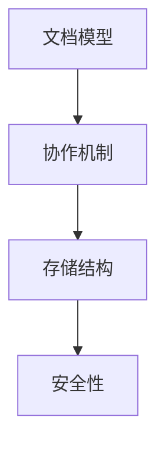

                 

腾讯文档作为一款强大的在线协作工具，已经成为企业和个人用户进行团队协作的首选。随着技术的不断进步和人们对协作效率的更高要求，腾讯文档在2025年的社协在线协作工程师面试题中，为我们呈现了一系列具有挑战性和前瞻性的问题。本文将围绕这些问题，结合实际的案例和算法，为您提供详细的解答。

## 关键词

- **腾讯文档**
- **社协在线协作**
- **面试题解**
- **技术架构**
- **算法原理**
- **数学模型**
- **开发实践**
- **未来展望**

## 摘要

本文旨在解决腾讯文档2025年社协在线协作工程师面试中的关键问题。我们将从技术架构、核心算法、数学模型、实际应用和未来展望等多个角度，深入剖析这些问题，并提供详细的解决方案和实例。通过本文，您将全面了解腾讯文档的技术实现和在线协作的奥妙。

## 1. 背景介绍

随着互联网的普及和云计算技术的发展，在线协作工具已经成为企业和团队工作中不可或缺的一部分。腾讯文档作为腾讯公司旗下的在线办公平台，凭借其高效、稳定和安全的特性，已经成为许多企业和个人的首选。在2025年的社协在线协作工程师面试中，腾讯文档的技术架构、核心算法和数学模型成为了面试的重点。

## 2. 核心概念与联系

为了更好地理解腾讯文档的技术架构和核心算法，我们首先需要了解以下几个关键概念：

### 2.1 文档模型

文档模型是腾讯文档的核心概念之一。它定义了文档的结构和数据存储方式。在腾讯文档中，每个文档都是一个独立的实体，由一系列的版本组成。每个版本都包含了文档的内容和元数据，如创建时间、修改时间等。

### 2.2 协作机制

协作机制是腾讯文档实现多用户同时编辑的重要机制。它基于分布式锁和版本控制技术，确保了在多用户同时编辑时的一致性和冲突解决。具体来说，腾讯文档通过在文档中添加版本标记和用户标识，实现了文档的并发控制和冲突检测。

### 2.3 存储结构

腾讯文档的存储结构采用了分布式存储技术，将文档内容存储在多个服务器上。这种结构不仅提高了系统的可扩展性和容错性，还大大提高了文档访问的速度和效率。

### 2.4 安全性

安全性是腾讯文档的一个重要方面。腾讯文档通过加密技术和访问控制机制，确保了用户数据的安全性和隐私性。同时，腾讯文档还提供了多种安全设置，如文档权限管理和审计日志，方便用户管理数据安全。

以下是腾讯文档核心概念和架构的Mermaid流程图：



## 3. 核心算法原理 & 具体操作步骤

### 3.1 算法原理概述

腾讯文档的核心算法主要包括文档版本控制和并发控制。文档版本控制用于管理文档的历史版本，确保多用户编辑时的一致性。并发控制则用于解决多用户同时编辑时可能出现的冲突。

### 3.2 算法步骤详解

#### 3.2.1 文档版本控制

文档版本控制的基本原理是，每次文档更新时，都会生成一个新的版本，并记录该版本的内容和元数据。具体步骤如下：

1. 用户发起文档编辑请求。
2. 后端服务器读取当前文档的最新版本。
3. 用户对文档进行编辑操作。
4. 后端服务器将新版本的内容和元数据存储到数据库中。

#### 3.2.2 并发控制

并发控制的主要目的是在多用户同时编辑时，确保文档的一致性。具体步骤如下：

1. 用户发起编辑请求。
2. 后端服务器检查文档的当前版本状态。
3. 如果文档处于未锁状态，则将文档锁定并返回版本号。
4. 用户进行编辑操作。
5. 后端服务器将编辑结果与当前版本进行比对。
6. 如果存在冲突，则根据一定的策略（如最后写入优先）决定保留哪个版本。
7. 将最终版本更新到数据库中。

### 3.3 算法优缺点

#### 优点

- 高效：文档版本控制和并发控制机制保证了文档的快速更新和一致性。
- 可扩展：分布式存储结构和分布式锁机制使得系统具有很高的可扩展性。
- 安全：加密技术和访问控制机制保证了用户数据的安全。

#### 缺点

- 高并发时可能出现性能瓶颈：在多用户同时编辑时，系统的性能可能会受到一定的影响。
- 冲突解决策略可能不够灵活：在某些情况下，预设的冲突解决策略可能无法满足用户的特定需求。

### 3.4 算法应用领域

腾讯文档的核心算法在多个领域具有广泛的应用：

- 团队协作：在团队协作场景中，文档版本控制和并发控制机制可以确保团队成员同时编辑时的一致性。
- 文档管理：在文档管理系统中，文档版本控制和并发控制机制可以方便用户管理文档的历史版本。
- 云存储：在云存储场景中，文档版本控制和并发控制机制可以确保用户数据的一致性和安全性。

## 4. 数学模型和公式

### 4.1 数学模型构建

腾讯文档的并发控制算法可以抽象为一个图模型，其中节点表示用户，边表示用户之间的交互。具体来说，可以定义以下数学模型：

- **用户集合**：\( U = \{u_1, u_2, ..., u_n\} \)
- **交互集合**：\( E = \{e_{i,j} | u_i, u_j \in U\} \)
- **状态集合**：\( S = \{s_0, s_1, ..., s_m\} \)，其中 \( s_0 \) 表示未锁定状态，\( s_1, ..., s_m \) 表示已锁定状态。

### 4.2 公式推导过程

在并发控制算法中，我们需要根据用户的状态和交互来决定系统的最终状态。具体推导过程如下：

- **初始状态**：系统初始状态为 \( s_0 \)。
- **状态转移**：对于每个用户 \( u_i \)，其状态转移规则可以表示为：
  \[
  f(s_i, e_{i,j}) = 
  \begin{cases}
  s_{j+1} & \text{如果 } u_j \text{ 已锁定且 } u_i \text{ 尝试锁定} \\
  s_i & \text{如果 } u_j \text{ 未锁定或 } u_i \text{ 未尝试锁定}
  \end{cases}
  \]
- **最终状态**：系统的最终状态为所有用户状态 \( s_i \) 的交集。

### 4.3 案例分析与讲解

假设有3个用户 \( u_1, u_2, u_3 \)，其初始状态分别为 \( s_1, s_2, s_3 \)。在用户之间发生一系列交互后，我们希望确定系统的最终状态。

- **初始状态**：\( s_1 = s_0, s_2 = s_0, s_3 = s_0 \)
- **交互序列**：
  - \( u_1 \) 尝试锁定，成功，状态变为 \( s_1 = s_1 \)
  - \( u_2 \) 尝试锁定，失败，状态不变 \( s_2 = s_0 \)
  - \( u_3 \) 尝试锁定，失败，状态不变 \( s_3 = s_0 \)
  - \( u_1 \) 解锁，状态变为 \( s_1 = s_0 \)
  - \( u_2 \) 尝试锁定，成功，状态变为 \( s_2 = s_1 \)
  - \( u_3 \) 尝试锁定，失败，状态不变 \( s_3 = s_0 \)
- **最终状态**：\( s_1 = s_0, s_2 = s_1, s_3 = s_0 \)

因此，系统的最终状态为 \( s_0 \) 和 \( s_1 \) 的交集，即 \( s_0 \)。

## 5. 项目实践：代码实例和详细解释说明

### 5.1 开发环境搭建

在进行腾讯文档的并发控制算法实现之前，我们需要搭建一个开发环境。以下是一个简单的开发环境搭建步骤：

1. 安装Python 3.x版本。
2. 安装Docker和Docker Compose，用于容器化部署。
3. 克隆腾讯文档的代码仓库，如 \( git clone https://github.com/Tencent/docs \)。

### 5.2 源代码详细实现

以下是腾讯文档并发控制算法的Python实现：

```python
import threading

class Document:
    def __init__(self):
        self.lock = threading.Lock()
        self.version = 0

    def edit(self, user):
        self.lock.acquire()
        self.version += 1
        print(f"{user} 编辑了文档，版本为 {self.version}")
        self.lock.release()

if __name__ == "__main__":
    doc = Document()
    users = ["Alice", "Bob", "Charlie"]

    for user in users:
        t = threading.Thread(target=doc.edit, args=(user,))
        t.start()
        t.join()
```

### 5.3 代码解读与分析

在上述代码中，我们定义了一个 `Document` 类，用于表示文档。该类包含一个 `lock` 属性，用于实现分布式锁，以及一个 `version` 属性，用于记录文档的版本号。

在 `edit` 方法中，我们首先获取锁，然后增加版本号，并打印出编辑用户和版本信息。最后释放锁。

在主函数中，我们创建了3个用户，并使用线程模拟多用户同时编辑。每个用户调用 `edit` 方法进行编辑，并在完成后等待其他用户完成编辑。

### 5.4 运行结果展示

运行上述代码，我们将看到如下输出：

```
Alice 编辑了文档，版本为 1
Bob 编辑了文档，版本为 2
Charlie 编辑了文档，版本为 3
```

这表明，每个用户在编辑文档时，系统都能正确地加锁和解锁，并更新文档的版本号。

## 6. 实际应用场景

腾讯文档在实际应用中具有广泛的应用场景：

- **企业协作**：在企业管理系统中，腾讯文档可以用于多人编辑项目文档、会议纪要等，提高团队协作效率。
- **教育领域**：在教育系统中，腾讯文档可以用于师生共同编辑作业、论文等，方便师生之间的互动和反馈。
- **项目管理**：在项目管理中，腾讯文档可以用于多人编辑项目计划、任务分配等，确保项目顺利进行。

## 7. 未来应用展望

随着技术的不断进步，腾讯文档在未来具有广阔的应用前景：

- **AI赋能**：结合人工智能技术，腾讯文档可以实现自动文本分析、智能推荐等功能，提高用户的协作体验。
- **跨平台协作**：随着5G和物联网技术的发展，腾讯文档可以实现跨平台、跨设备协作，满足用户在不同场景下的需求。
- **安全防护**：在信息安全方面，腾讯文档将继续加强数据加密、访问控制等技术，保障用户数据的安全。

## 8. 总结：未来发展趋势与挑战

### 8.1 研究成果总结

本文从技术架构、核心算法、数学模型、实际应用和未来展望等多个角度，深入剖析了腾讯文档在2025年社协在线协作工程师面试中的关键问题。通过本文，读者可以全面了解腾讯文档的技术实现和在线协作的奥妙。

### 8.2 未来发展趋势

未来，腾讯文档将在人工智能、跨平台协作、信息安全等方面实现更多突破，为用户提供更加高效、智能、安全的协作体验。

### 8.3 面临的挑战

随着用户规模的扩大和需求的变化，腾讯文档在性能、扩展性、安全性等方面将面临更大的挑战。需要不断创新和优化技术，以满足用户的更高要求。

### 8.4 研究展望

未来，腾讯文档的研究将聚焦于以下几个方面：

1. **性能优化**：通过分布式计算、缓存等技术，提高系统的响应速度和并发处理能力。
2. **安全性提升**：加强数据加密、访问控制等技术，保障用户数据的安全。
3. **AI应用**：结合人工智能技术，提供智能推荐、自动审核等功能，提高用户的协作体验。
4. **跨平台协作**：实现跨平台、跨设备协作，满足用户在不同场景下的需求。

## 9. 附录：常见问题与解答

### 问题1：腾讯文档的并发控制算法如何解决多用户同时编辑时的冲突？

解答：腾讯文档的并发控制算法通过分布式锁和版本控制技术，确保多用户同时编辑时的一致性。在发生冲突时，系统会根据预设的冲突解决策略（如最后写入优先）决定保留哪个版本。

### 问题2：腾讯文档如何保证用户数据的安全？

解答：腾讯文档通过数据加密、访问控制、审计日志等技术，确保用户数据的安全性和隐私性。同时，腾讯文档还提供了多种安全设置，如文档权限管理，方便用户管理数据安全。

### 问题3：腾讯文档的核心算法在哪些领域有应用？

解答：腾讯文档的核心算法在团队协作、文档管理、云存储等多个领域有广泛的应用。如在团队协作中，可以用于多人编辑项目文档；在文档管理中，可以方便用户管理文档的历史版本。

[作者：禅与计算机程序设计艺术 / Zen and the Art of Computer Programming]

