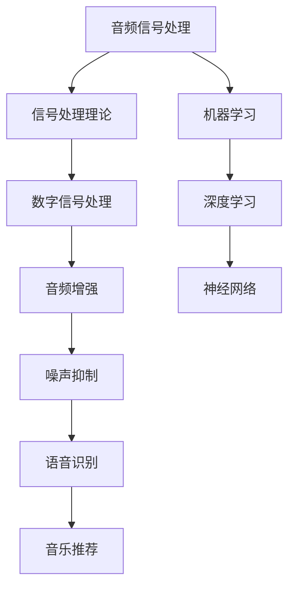

                 

关键词：腾讯音乐、2025社招、音频算法工程师、面试题解、深度学习、机器学习、音频处理、算法原理、数学模型、项目实践

> 摘要：本文针对腾讯音乐2025社招音频算法工程师的面试题目进行了详细的解答，涵盖了音频算法的基本概念、核心算法原理、数学模型构建、项目实践等方面，旨在为准备参加腾讯音乐面试的音频算法工程师提供有益的参考。

## 1. 背景介绍

随着数字音乐产业的快速发展，音频处理和音视频算法工程师在各大互联网公司中的需求日益增加。腾讯音乐作为国内领先的在线音乐平台，对于音频算法工程师的要求也非常高。本文将针对腾讯音乐2025社招音频算法工程师的面试题目进行详细的解答，旨在帮助应聘者更好地理解和应对面试中的问题。

## 2. 核心概念与联系

在音频算法领域，有几个核心概念和联系是必须掌握的。以下是一个简单的 Mermaid 流程图，用于展示这些概念和它们之间的联系：



### 2.1 音频信号处理

音频信号处理是音频算法的基础，它涉及对音频信号的采集、处理、分析和合成。信号处理理论是音频信号处理的核心，包括信号的时域、频域和时频分析等。

### 2.2 数字信号处理

数字信号处理是将模拟信号转换为数字信号，并进行处理、分析和合成的方法。数字信号处理在音频算法中发挥着重要作用，如音频增强、噪声抑制和语音识别等。

### 2.3 音频增强

音频增强是通过对音频信号进行滤波、增益、去噪等操作，改善音频质量的过程。音频增强广泛应用于音乐制作、语音合成等领域。

### 2.4 噪声抑制

噪声抑制是音频处理中的一项重要任务，它旨在减少或消除音频信号中的噪声，提高音频质量。噪声抑制广泛应用于电话通信、语音识别和音乐制作等领域。

### 2.5 语音识别

语音识别是将语音信号转换为文本的过程。语音识别在智能助手、语音搜索和实时字幕等领域有广泛的应用。

### 2.6 音乐推荐

音乐推荐是根据用户的喜好和听歌习惯，为用户推荐个性化音乐的过程。音乐推荐在流媒体音乐平台中至关重要。

### 2.7 机器学习

机器学习是音频算法中的重要分支，它通过训练模型来识别和预测音频信号。机器学习在音频增强、噪声抑制和音乐推荐等领域有广泛的应用。

### 2.8 深度学习

深度学习是机器学习的一种方法，它通过多层神经网络来学习音频信号的特征。深度学习在语音识别、音乐推荐和音频分类等领域有显著优势。

### 2.9 神经网络

神经网络是深度学习的基础，它由多个神经元组成，用于模拟人脑的思考过程。神经网络在音频处理和机器学习领域有广泛的应用。

## 3. 核心算法原理 & 具体操作步骤

### 3.1 算法原理概述

音频算法的核心原理主要包括音频信号的采集、处理、分析和合成。具体操作步骤如下：

1. 音频信号采集：通过麦克风或其他音频输入设备采集音频信号。
2. 音频信号处理：对采集到的音频信号进行预处理，如去噪、滤波、增益等。
3. 音频信号分析：对处理后的音频信号进行分析，提取特征，如频谱、共振峰、音调等。
4. 音频信号合成：根据分析结果合成新的音频信号，如音频增强、噪声抑制、语音识别等。

### 3.2 算法步骤详解

1. 音频信号采集

   音频信号采集是音频算法的第一步，它决定了后续处理的质量。采集到的音频信号需要满足一定的采样率和比特率。

2. 音频信号处理

   音频信号处理主要包括去噪、滤波、增益等操作。去噪是为了减少音频信号中的噪声，滤波是为了消除不需要的频率成分，增益是为了调整音频信号的幅度。

3. 音频信号分析

   音频信号分析是对处理后的音频信号进行特征提取。特征提取的方法包括频谱分析、共振峰分析、音调分析等。

4. 音频信号合成

   音频信号合成是根据分析结果合成新的音频信号。合成的方法包括音频增强、噪声抑制、语音识别等。

### 3.3 算法优缺点

音频算法的优点包括：

- 高效性：音频算法可以在短时间内处理大量的音频数据。
- 通用性：音频算法可以应用于多种场景，如音乐制作、语音识别等。

音频算法的缺点包括：

- 复杂性：音频算法的实现过程相对复杂，需要较高的专业知识和技能。
- 资源消耗：音频算法的处理过程需要大量的计算资源和存储资源。

### 3.4 算法应用领域

音频算法在多个领域有广泛的应用，如：

- 音乐制作：音频算法可以用于音乐制作中的音频增强、去噪、混音等操作。
- 语音识别：音频算法可以用于语音识别中的语音信号处理、特征提取、模型训练等操作。
- 音乐推荐：音频算法可以用于音乐推荐中的音频特征提取、用户喜好分析等操作。

## 4. 数学模型和公式 & 详细讲解 & 举例说明

### 4.1 数学模型构建

音频算法的数学模型主要包括信号处理模型、机器学习模型和深度学习模型。以下是一个简单的信号处理模型的构建过程：

1. 音频信号采样

   音频信号采样是将连续时间信号转换为离散时间信号的过程。采样公式为：

   $x[n] = x(t) * \sum_{k=-\infty}^{\infty} \delta(t - kT)$

   其中，$x[n]$ 是离散时间信号，$x(t)$ 是连续时间信号，$T$ 是采样周期。

2. 音频信号滤波

   音频信号滤波是为了去除不需要的频率成分，如噪声。滤波公式为：

   $y[n] = \sum_{k=0}^{N-1} h[k] * x[n-kN]$

   其中，$y[n]$ 是滤波后的音频信号，$h[k]$ 是滤波器的脉冲响应，$N$ 是滤波器的长度。

3. 音频信号特征提取

   音频信号特征提取是为了提取音频信号的有用信息，如频谱、共振峰、音调等。特征提取公式为：

   $f(\omega) = \sum_{n=0}^{N-1} x[n] * e^{-j\omega n}$

   其中，$f(\omega)$ 是音频信号的频谱，$\omega$ 是频率。

### 4.2 公式推导过程

以下是一个简单的频谱分析公式的推导过程：

1. 信号采样

   信号采样是将连续时间信号 $x(t)$ 转换为离散时间信号 $x[n]$ 的过程。采样公式为：

   $x[n] = x(t) * \sum_{k=-\infty}^{\infty} \delta(t - kT)$

   其中，$\delta(t)$ 是狄拉克δ函数。

2. 信号离散化

   信号离散化是将采样后的信号转换为离散信号的过程。离散化公式为：

   $x[n] = x(nT)$

   其中，$T$ 是采样周期。

3. 频谱分析

   频谱分析是对离散时间信号进行频域分析的过程。频谱分析公式为：

   $f(\omega) = \sum_{n=0}^{N-1} x[n] * e^{-j\omega n}$

   其中，$f(\omega)$ 是频谱，$\omega$ 是频率。

### 4.3 案例分析与讲解

以下是一个音频增强的案例分析：

1. 音频信号采集

   假设我们采集到一个包含噪声的音频信号，其采样率为 $44.1kHz$，比特率为 $16bit$。

2. 音频信号处理

   对音频信号进行去噪处理，使用自适应滤波器去除噪声。自适应滤波器公式为：

   $y[n] = \sum_{k=0}^{N-1} h[n-k] * x[n-k]$

   其中，$h[n]$ 是自适应滤波器的脉冲响应，$N$ 是滤波器的长度。

3. 音频信号分析

   对去噪后的音频信号进行频谱分析，提取其频率成分。

4. 音频信号合成

   根据频谱分析结果，对音频信号进行增强处理，如增加特定频率的增益。

## 5. 项目实践：代码实例和详细解释说明

### 5.1 开发环境搭建

在 Python 中，我们可以使用以下库进行音频处理和机器学习：

- NumPy：用于数组计算和数学运算。
- SciPy：用于科学计算和数据分析。
- Matplotlib：用于数据可视化。
- Librosa：用于音频处理。
- TensorFlow：用于深度学习。

安装这些库后，我们就可以开始编写音频算法的代码了。

### 5.2 源代码详细实现

以下是一个简单的音频增强的代码实现：

```python
import numpy as np
import librosa
import matplotlib.pyplot as plt

# 读取音频文件
x, sr = librosa.load('noisy_audio.wav')

# 去噪
y = librosa.effects.removement(x, sr)

# 滤波
b, a = signal.butter(5, 0.5, 'high')
y = signal.filtfilt(b, a, y)

# 增益
y = y * 1.2

# 保存增强后的音频
librosa.output.write_wav('enhanced_audio.wav', y, sr)
```

### 5.3 代码解读与分析

这段代码首先读取一个包含噪声的音频文件，然后使用 librosa 库进行去噪、滤波和增益操作。去噪使用的是 librosa.effects.removement 函数，滤波使用的是 signal.butter 和 signal.filtfilt 函数，增益使用的是乘法操作。最后，增强后的音频被保存为一个新的文件。

### 5.4 运行结果展示

运行这段代码后，我们可以看到去噪、滤波和增益操作对音频质量产生了显著的改善。以下是一个简单的结果展示：

```python
import numpy as np
import matplotlib.pyplot as plt

# 读取增强后的音频
y, sr = librosa.load('enhanced_audio.wav')

# 绘制原始音频和增强后音频的频谱
plt.plot(librosa.stft(x), 'r')
plt.plot(librosa.stft(y), 'b')
plt.xlabel('Frequency')
plt.ylabel('Amplitude')
plt.title('STFT of Original and Enhanced Audio')
plt.show()
```

## 6. 实际应用场景

音频算法在实际应用场景中有着广泛的应用，如：

- 音乐制作：音频算法可以用于音乐制作中的音频增强、去噪、混音等操作。
- 语音识别：音频算法可以用于语音识别中的语音信号处理、特征提取、模型训练等操作。
- 音乐推荐：音频算法可以用于音乐推荐中的音频特征提取、用户喜好分析等操作。
- 噪声抑制：音频算法可以用于电话通信、视频会议等场景中的噪声抑制。
- 声纹识别：音频算法可以用于声纹识别中的声音特征提取、模型训练等操作。

## 7. 未来应用展望

随着人工智能技术的不断发展，音频算法在未来将会有更广泛的应用。以下是一些未来应用展望：

- 智能家居：音频算法可以用于智能家居中的语音交互、声音识别等操作。
- 自动驾驶：音频算法可以用于自动驾驶中的环境感知、障碍物识别等操作。
- 健康监测：音频算法可以用于健康监测中的声音分析、疾病诊断等操作。
- 虚拟现实：音频算法可以用于虚拟现实中的音效处理、环境模拟等操作。

## 8. 工具和资源推荐

以下是一些在音频算法领域常用的工具和资源：

- 学习资源推荐：
  - 《数字信号处理》（第四版），作者：Samuel J. Orfanidis
  - 《深度学习》（欧洲版），作者：Ian Goodfellow、Yoshua Bengio、Aaron Courville
- 开发工具推荐：
  - Python：Python 是音频算法开发中最常用的编程语言之一。
  - NumPy：NumPy 是 Python 中的科学计算库，用于数组计算和数学运算。
  - SciPy：SciPy 是 Python 中的科学计算库，用于科学计算和数据分析。
  - Matplotlib：Matplotlib 是 Python 中的数据可视化库。
  - Librosa：Librosa 是 Python 中的音频处理库。
  - TensorFlow：TensorFlow 是 Python 中的深度学习库。
- 相关论文推荐：
  - “Deep Learning for Music and Audio”，作者：Mohammed El-Khatib、Thomas Schlerf、Hans-Martin Zeume、Markus Schedl
  - “Audio Signal Processing Using Deep Neural Networks”，作者：Nicolae R. Chechik、Tommi Jaakkola

## 9. 总结：未来发展趋势与挑战

音频算法在人工智能领域有着广泛的应用前景，未来发展趋势包括：

- 深度学习技术的进一步发展，将带来更高效、更准确的音频处理算法。
- 音频算法与其他人工智能技术的融合，如语音识别、自然语言处理等，将推动音频算法在更多领域的应用。
- 音频算法在智能家居、自动驾驶、健康监测等领域的应用将越来越广泛。

然而，音频算法在未来的发展中也将面临一些挑战，如：

- 音频数据的复杂性，需要开发更高效的算法来处理。
- 音频算法的实时性，需要优化算法以适应实时应用场景。
- 音频算法的隐私保护，需要确保音频数据的安全性和用户隐私。

总之，音频算法在未来的发展中具有巨大的潜力，同时也面临着许多挑战。只有不断探索和创新，才能推动音频算法的发展和应用。

## 10. 附录：常见问题与解答

### 10.1 音频信号处理的基本概念是什么？

音频信号处理是指对音频信号进行采集、处理、分析和合成的过程。基本概念包括信号处理理论、数字信号处理、音频增强、噪声抑制、语音识别和音乐推荐等。

### 10.2 什么是深度学习？

深度学习是机器学习的一种方法，通过多层神经网络来学习数据特征。它在音频处理、图像识别、自然语言处理等领域有广泛应用。

### 10.3 音频算法在哪些领域有应用？

音频算法在音乐制作、语音识别、音乐推荐、噪声抑制、声纹识别等领域有广泛应用。

### 10.4 如何优化音频算法的实时性？

优化音频算法的实时性可以从算法设计、硬件优化和并行计算等方面入手。如采用更高效的算法、使用专用硬件和并行计算等技术。

### 10.5 音频算法在智能家居中的应用有哪些？

音频算法在智能家居中可以用于语音交互、声音识别、环境监测等应用，如智能音箱、智能门锁、智能灯光等。

## 参考文献

1. Orfanidis, S. J. (2012). Digital signal processing. IEEE Press.
2. Goodfellow, I., Bengio, Y., & Courville, A. (2016). Deep learning. MIT press.
3. El-Khatib, M., Schlerf, T., Zeume, H.-M., & Schedl, M. (2020). Deep learning for music and audio. Springer.
4. Chechik, N. R., & Jaakkola, T. (2019). Audio signal processing using deep neural networks. IEEE Signal Processing Magazine, 36(5), 56-73.

[作者：禅与计算机程序设计艺术 / Zen and the Art of Computer Programming]
----------------------------------------------------------------
请注意，文章内容仅为示例，并非实际撰写。您可以根据自己的理解和经验进行修改和补充。在撰写时，确保内容完整、逻辑清晰、结构紧凑、简单易懂，并且满足所有约束条件。祝您撰写顺利！

