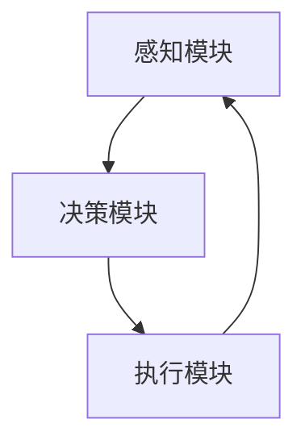

                 

关键词：自主系统、意识研究、神经科学、认知科学、人工智能

## 摘要

本文从自主系统的视角探讨意识研究的现状、核心问题及其未来发展趋势。通过对神经科学、认知科学和人工智能领域的交叉研究，我们试图揭示意识产生的机制，并探讨自主系统如何模拟和实现意识。文章首先介绍了自主系统的基本概念，然后分析了意识在自主系统中的重要性，最后提出了未来研究的几个关键方向。

## 1. 背景介绍

### 1.1 自主系统的定义

自主系统是指能够自主决策、自主执行任务并适应环境变化的系统。这些系统通常由多个组件组成，包括感知模块、决策模块、执行模块等。自主系统在许多领域都有广泛的应用，如机器人、自动驾驶、智能调度等。

### 1.2 意识研究的重要性

意识研究是当今科学界的热点问题之一。意识不仅仅是个体主观体验的集合，更是信息处理和决策过程的核心。理解意识如何产生和运作，对于人类自身认识、人工智能的发展以及神经科学的进步都具有重要意义。

### 1.3 神经科学、认知科学和人工智能的关系

神经科学和认知科学是研究意识的基础学科，它们提供了关于大脑结构和功能的基本知识。而人工智能则是实现自主系统的重要工具，通过机器学习和深度学习等技术，可以模拟人类的感知、学习和决策过程。三者的结合为意识研究提供了新的视角和方法。

## 2. 核心概念与联系

### 2.1 自主系统架构



### 2.2 意识在自主系统中的作用

意识在自主系统中起着至关重要的作用。它不仅影响着决策的质量和效率，还决定了系统的适应性和灵活性。

### 2.3 神经科学与人工智能的结合

神经科学和人工智能的结合为研究意识提供了新的途径。通过模仿大脑的神经结构和工作原理，人工智能可以更好地模拟和实现意识。

## 3. 核心算法原理 & 具体操作步骤

### 3.1 算法原理概述

自主系统中的意识模拟主要依赖于深度学习和神经网络技术。通过训练神经网络，可以使其具备类似于人类感知和决策的能力。

### 3.2 算法步骤详解

#### 3.2.1 数据收集与预处理

- 收集大量的感知数据，如图像、声音、文本等。
- 对数据进行清洗、归一化和标注。

#### 3.2.2 模型设计

- 设计一个多层神经网络，包括输入层、隐藏层和输出层。
- 选择合适的激活函数和优化算法。

#### 3.2.3 模型训练

- 使用收集到的数据训练神经网络，通过反向传播算法不断调整网络参数。
- 调整学习率、迭代次数等参数，以提高模型的性能。

#### 3.2.4 模型评估与优化

- 使用验证集评估模型的性能，调整模型结构和参数。
- 应用交叉验证等技术，提高模型的泛化能力。

### 3.3 算法优缺点

#### 优点：

- 高效地模拟人类感知和决策过程。
- 可适应复杂环境和动态变化。

#### 缺点：

- 需要大量的数据和计算资源。
- 模型的解释性较差。

### 3.4 算法应用领域

- 机器人感知与决策
- 自动驾驶
- 智能家居
- 医疗诊断

## 4. 数学模型和公式 & 详细讲解 & 举例说明

### 4.1 数学模型构建

意识模拟的核心是神经网络模型。以下是一个简化的神经网络模型：

$$
y = \sigma(z)
$$

其中，$y$ 是输出，$\sigma$ 是激活函数，$z$ 是网络的输入。

### 4.2 公式推导过程

神经网络的输出可以通过以下公式计算：

$$
z = \sum_{i=1}^{n} w_i x_i + b
$$

其中，$w_i$ 是权重，$x_i$ 是输入，$b$ 是偏置。

### 4.3 案例分析与讲解

假设我们有一个简单的感知任务，任务是识别手写数字。我们可以使用上述神经网络模型来模拟这个过程。

输入是一个28x28的图像，输出是一个10维的向量，表示每个数字的概率。

## 5. 项目实践：代码实例和详细解释说明

### 5.1 开发环境搭建

- 安装 Python 3.8及以上版本。
- 安装 TensorFlow 2.0及以上版本。

### 5.2 源代码详细实现

```python
import tensorflow as tf

# 创建模型
model = tf.keras.Sequential([
    tf.keras.layers.Dense(128, activation='relu', input_shape=(28*28,)),
    tf.keras.layers.Dense(10, activation='softmax')
])

# 编译模型
model.compile(optimizer='adam',
              loss='sparse_categorical_crossentropy',
              metrics=['accuracy'])

# 加载数据
(x_train, y_train), (x_test, y_test) = tf.keras.datasets.mnist.load_data()

# 预处理数据
x_train = x_train.reshape((-1, 28*28))
x_test = x_test.reshape((-1, 28*28))

# 训练模型
model.fit(x_train, y_train, epochs=5)

# 评估模型
model.evaluate(x_test, y_test)
```

### 5.3 代码解读与分析

- 创建了一个简单的全连接神经网络，输入层有128个神经元，输出层有10个神经元。
- 使用 Adam 优化器和交叉熵损失函数进行编译。
- 加载并预处理了手写数字数据集。
- 训练模型并评估其在测试集上的性能。

## 6. 实际应用场景

### 6.1 机器人感知与决策

自主机器人可以通过神经网络模型实现高级的感知和决策能力，从而在复杂环境中自主行动。

### 6.2 自动驾驶

自动驾驶系统利用神经网络模型进行环境感知和决策，以提高行驶的安全性和效率。

### 6.3 智能家居

智能家居系统通过神经网络模型实现对用户行为的学习和预测，从而提供更加个性化的服务。

### 6.4 医疗诊断

神经网络模型在医疗诊断中可以辅助医生进行疾病的识别和预测，提高诊断的准确性。

## 7. 工具和资源推荐

### 7.1 学习资源推荐

- 《深度学习》（Goodfellow, Bengio, Courville著）
- 《Python机器学习》（Sebastian Raschka著）

### 7.2 开发工具推荐

- TensorFlow
- PyTorch

### 7.3 相关论文推荐

- “Deep Learning” by Ian Goodfellow
- “Unsupervised Learning of Visual Representations by Solving Jigsaw Puzzles” by Jeff Clune et al.

## 8. 总结：未来发展趋势与挑战

### 8.1 研究成果总结

自主系统视角下的意识研究取得了显著成果，为人工智能的发展提供了新的方向。通过深度学习和神经网络技术，我们可以实现更高层次的自主决策和感知能力。

### 8.2 未来发展趋势

随着计算能力的提升和算法的改进，自主系统视角下的意识研究将继续深入。未来可能实现更加复杂和灵活的自主系统，为各行各业带来革命性的变革。

### 8.3 面临的挑战

- 模型的解释性和可解释性仍然是关键挑战。
- 如何在保证性能的同时，降低对数据的依赖。

### 8.4 研究展望

自主系统视角下的意识研究有望推动人工智能的发展，为人类带来更加智能化的未来。

## 9. 附录：常见问题与解答

### 9.1 什么是自主系统？

自主系统是指能够自主决策、自主执行任务并适应环境变化的系统。

### 9.2 意识研究的重要性是什么？

意识研究有助于我们理解人类思维和行为的本质，同时也为人工智能的发展提供了新的方向。

### 9.3 神经科学、认知科学和人工智能如何结合？

神经科学和认知科学提供了关于大脑和思维的基本知识，而人工智能则利用这些知识实现自主系统和智能模拟。

[作者：禅与计算机程序设计艺术 / Zen and the Art of Computer Programming]----------------------------------------------------------------

