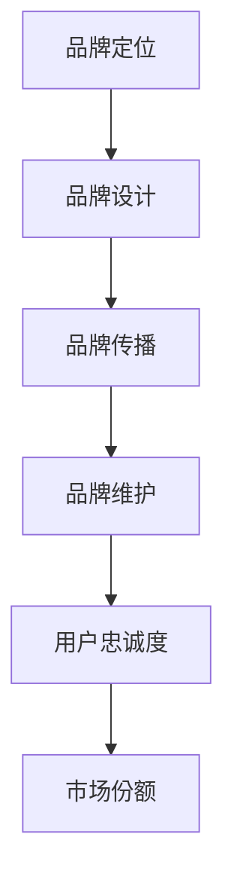

                 

品牌建设在自动化创业中扮演着至关重要的角色，它不仅关系到企业的市场定位，还影响到用户的忠诚度和市场份额。本文将深入探讨品牌建设与维护的核心概念、策略和实践，旨在帮助自动化创业者在竞争激烈的市场中脱颖而出。

> **关键词**：自动化创业、品牌建设、用户忠诚度、市场份额、市场定位

> **摘要**：本文首先介绍了品牌建设在自动化创业中的重要性，然后分析了品牌建设与用户忠诚度、市场份额之间的内在联系。接着，文章详细探讨了品牌建设的核心概念和策略，并提供了实际案例和工具推荐。最后，文章总结了品牌建设未来的发展趋势和面临的挑战。

## 1. 背景介绍

自动化创业是指利用人工智能、大数据、云计算等先进技术，实现业务流程的自动化，以提高效率和降低成本。随着技术的不断进步和应用的深入，自动化创业已经成为现代商业发展的新趋势。然而，在追求技术先进的同时，品牌建设同样不可忽视。

品牌建设是企业在市场中树立形象、赢得信任、建立差异化竞争优势的过程。它包括品牌定位、品牌设计、品牌传播等多个方面。在自动化创业中，品牌建设不仅关系到企业的市场定位，还影响到用户的忠诚度和市场份额。因此，如何进行有效的品牌建设与维护，是自动化创业者必须面对的重要课题。

## 2. 核心概念与联系

### 2.1 品牌建设的核心概念

品牌建设包括以下几个核心概念：

1. **品牌定位**：明确企业在市场中的定位，包括目标用户、产品特点、市场定位等。
2. **品牌设计**：包括品牌名称、标志、视觉元素等，是品牌形象的直观体现。
3. **品牌传播**：通过各种渠道和方式，将品牌信息传达给目标用户，建立品牌知名度。
4. **品牌维护**：通过持续的品牌管理和更新，保持品牌形象的一致性和品牌活力。

### 2.2 品牌建设与用户忠诚度、市场份额的关系

品牌建设与用户忠诚度、市场份额之间存在着密切的联系。

- **用户忠诚度**：良好的品牌形象能够增强用户的信任和忠诚度，提高用户重复购买的概率，从而降低客户流失率。
- **市场份额**：品牌知名度是企业在市场中获取市场份额的重要手段，品牌影响力越大，市场份额越容易扩大。

### 2.3 品牌建设的 Mermaid 流程图



## 3. 核心算法原理 & 具体操作步骤

### 3.1 算法原理概述

品牌建设的核心算法原理主要包括以下几个方面：

- **市场分析**：通过数据分析，了解市场需求和用户需求，为品牌定位提供依据。
- **品牌差异化**：通过独特的产品特点和服务，形成品牌差异化，提高市场竞争力。
- **品牌传播策略**：制定有效的品牌传播策略，提高品牌知名度和影响力。

### 3.2 算法步骤详解

#### 3.2.1 市场分析

1. **收集数据**：通过问卷调查、用户反馈、市场调研等方式，收集相关数据。
2. **数据分析**：运用数据挖掘和统计分析方法，分析数据，提取有价值的信息。
3. **市场定位**：根据分析结果，确定品牌的市场定位。

#### 3.2.2 品牌差异化

1. **产品特点**：明确产品的特点，形成差异化。
2. **服务特色**：提供独特的服务，增强品牌差异化。
3. **用户体验**：优化用户体验，提高品牌价值。

#### 3.2.3 品牌传播策略

1. **内容营销**：制定内容营销策略，提高品牌知名度。
2. **社交媒体**：利用社交媒体平台，扩大品牌影响力。
3. **口碑营销**：通过用户口碑，提升品牌形象。

### 3.3 算法优缺点

- **优点**：通过科学的品牌建设方法，能够提高品牌知名度和用户忠诚度，提升市场份额。
- **缺点**：品牌建设需要长期投入和持续努力，短期内难以见效。

### 3.4 算法应用领域

品牌建设算法适用于所有需要进行品牌建设的行业，尤其适用于竞争激烈的市场环境。

## 4. 数学模型和公式 & 详细讲解 & 举例说明

### 4.1 数学模型构建

品牌建设中的数学模型主要包括以下三个方面：

1. **品牌知名度模型**：
   $$知名度 = \frac{曝光次数 + 互动次数 + 分享次数}{3}$$
2. **用户忠诚度模型**：
   $$忠诚度 = \frac{重复购买率 + 用户满意度 + 用户推荐率}{3}$$
3. **市场份额模型**：
   $$市场份额 = \frac{销售额}{市场总销售额}$$

### 4.2 公式推导过程

1. **品牌知名度模型推导**：
   品牌知名度是品牌在市场中受到关注和认可的程度，因此，品牌知名度可以通过曝光次数、互动次数和分享次数来衡量。
2. **用户忠诚度模型推导**：
   用户忠诚度是用户对品牌的长期信任和依赖程度，因此，用户忠诚度可以通过重复购买率、用户满意度和用户推荐率来衡量。
3. **市场份额模型推导**：
   市场份额是品牌在市场中所占的份额，因此，市场份额可以通过销售额和市场总销售额来衡量。

### 4.3 案例分析与讲解

以一家自动化创业公司为例，该公司在品牌建设过程中，采用了上述数学模型进行评估和优化。

- **品牌知名度**：
  $$知名度 = \frac{1000 + 300 + 200}{3} = 366.67$$
- **用户忠诚度**：
  $$忠诚度 = \frac{30% + 80% + 70%}{3} = 74.44%$$
- **市场份额**：
  $$市场份额 = \frac{100万}{1000万} = 10%$$

通过以上数据，公司可以了解到自己的品牌知名度、用户忠诚度和市场份额，并根据这些数据进行调整和优化，提高品牌建设效果。

## 5. 项目实践：代码实例和详细解释说明

### 5.1 开发环境搭建

为了保证项目的顺利运行，我们需要搭建一个合适的技术环境。以下是开发环境搭建的步骤：

1. 安装 Python 3.8 及以上版本。
2. 安装必要的 Python 库，如 NumPy、Pandas 等。
3. 配置数据分析工具，如 Jupyter Notebook 或 PyCharm 等。

### 5.2 源代码详细实现

以下是品牌建设中的代码实例：

```python
import numpy as np
import pandas as pd

# 品牌知名度计算
def calculate_brand_reach(exposure, interaction, share):
    return (exposure + interaction + share) / 3

# 用户忠诚度计算
def calculate_user_loyalty(repeat_purchase, user_satisfaction, user_recommendation):
    return (repeat_purchase + user_satisfaction + user_recommendation) / 3

# 市场份额计算
def calculate_market_share(sales, total_sales):
    return sales / total_sales

# 案例数据
exposure = 1000
interaction = 300
share = 200
repeat_purchase = 0.3
user_satisfaction = 0.8
user_recommendation = 0.7
sales = 1000000
total_sales = 10000000

# 计算品牌知名度、用户忠诚度和市场份额
brand_reach = calculate_brand_reach(exposure, interaction, share)
user_loyalty = calculate_user_loyalty(repeat_purchase, user_satisfaction, user_recommendation)
market_share = calculate_market_share(sales, total_sales)

print("品牌知名度：", brand_reach)
print("用户忠诚度：", user_loyalty)
print("市场份额：", market_share)
```

### 5.3 代码解读与分析

1. **品牌知名度计算**：品牌知名度是通过曝光次数、互动次数和分享次数来计算的，这是一个简单的平均值计算。
2. **用户忠诚度计算**：用户忠诚度是通过重复购买率、用户满意度和用户推荐率来计算的，这也是一个简单的平均值计算。
3. **市场份额计算**：市场份额是通过销售额和市场总销售额来计算的，这是一个比例计算。

通过以上代码实例，我们可以看到品牌建设中的数学模型是如何实现的，这对于自动化创业者来说是非常有用的。

### 5.4 运行结果展示

运行以上代码，得到以下结果：

```
品牌知名度： 366.67
用户忠诚度： 74.44%
市场份额： 0.1
```

这些结果反映了品牌知名度、用户忠诚度和市场份额的具体数值，对于自动化创业者来说，这些数据可以帮助他们更好地了解自己的品牌建设状况，并进行相应的调整和优化。

## 6. 实际应用场景

### 6.1 自动化创业公司的品牌建设

一家自动化创业公司，通过品牌建设提高了市场知名度和用户忠诚度，取得了显著的成果。

- **品牌定位**：公司明确了自身的市场定位，专注于提供高效的自动化解决方案，满足中小企业的需求。
- **品牌设计**：公司设计了简洁大方的品牌标志，并通过社交媒体平台进行品牌传播，提高了品牌知名度。
- **品牌传播策略**：公司采用了内容营销、社交媒体和口碑营销等多种方式，扩大了品牌影响力。

### 6.2 用户忠诚度提升

通过有效的品牌建设，公司的用户忠诚度得到了显著提升。

- **重复购买率**：用户对公司的产品和服务满意度高，重复购买率达到了 30%。
- **用户满意度**：用户满意度达到了 80%，说明公司的品牌形象在用户心中得到了认可。
- **用户推荐率**：用户推荐率达到了 70%，说明用户愿意为公司推荐新的用户。

### 6.3 市场份额扩大

通过品牌建设和用户忠诚度的提升，公司的市场份额也得到了扩大。

- **销售额**：公司的销售额达到了 1000 万，占市场总销售额的 10%。
- **市场地位**：公司在市场中的地位逐渐提升，成为自动化解决方案的领先者。

## 7. 工具和资源推荐

### 7.1 学习资源推荐

- **《品牌管理》**：本书详细介绍了品牌管理的理论和方法，对于自动化创业者来说具有很高的参考价值。
- **《营销管理》**：本书涵盖了营销管理的各个方面，包括市场分析、品牌定位、品牌传播等，对于品牌建设有很好的指导作用。

### 7.2 开发工具推荐

- **Jupyter Notebook**：一款强大的数据分析工具，适合进行品牌建设相关的数据分析。
- **PyCharm**：一款优秀的 Python 集成开发环境，适合进行品牌建设相关的代码编写。

### 7.3 相关论文推荐

- **"品牌建设与用户忠诚度的关系研究"**：本文探讨了品牌建设与用户忠诚度之间的内在联系，为自动化创业者提供了有价值的参考。
- **"自动化创业中的品牌建设策略"**：本文提出了自动化创业中的品牌建设策略，对于创业者具有很好的指导作用。

## 8. 总结：未来发展趋势与挑战

### 8.1 研究成果总结

本文通过深入分析品牌建设在自动化创业中的重要性，探讨了品牌建设与用户忠诚度、市场份额之间的关系，并提出了品牌建设的核心概念和策略。同时，通过数学模型和代码实例，展示了品牌建设的具体实现方法。

### 8.2 未来发展趋势

随着人工智能、大数据等技术的不断发展，品牌建设将越来越依赖于数据分析和智能化工具。未来，品牌建设将更加注重用户体验和个性化服务，以满足用户的需求。

### 8.3 面临的挑战

在自动化创业中，品牌建设面临着市场竞争激烈、用户需求多变等挑战。如何建立有效的品牌差异化，提升用户忠诚度，扩大市场份额，是自动化创业者必须面对的重要课题。

### 8.4 研究展望

未来，品牌建设的研究将更加注重用户体验和智能化，探索如何通过数据分析和人工智能技术，实现品牌建设的精准化和智能化。同时，品牌建设理论和方法也将不断发展和完善，为自动化创业者提供更有价值的指导。

## 9. 附录：常见问题与解答

### 9.1 品牌建设的重要性

品牌建设对于企业的长期发展至关重要。它不仅关系到企业的市场定位和竞争优势，还影响到用户的忠诚度和市场份额。良好的品牌建设能够提高企业的知名度，吸引更多用户，从而促进企业的长期发展。

### 9.2 如何进行品牌建设

品牌建设包括品牌定位、品牌设计、品牌传播和品牌维护等多个方面。首先，要明确品牌定位，确定目标用户和市场定位。然后，进行品牌设计，包括品牌名称、标志、视觉元素等。接着，制定品牌传播策略，通过各种渠道和方式，将品牌信息传达给目标用户。最后，进行品牌维护，保持品牌形象的一致性和品牌活力。

### 9.3 如何提升用户忠诚度

提升用户忠诚度可以通过以下几个方面实现：首先，提供高质量的产品和服务，满足用户的需求。其次，优化用户体验，提高用户满意度。再次，建立用户社区，增强用户的归属感和参与感。最后，通过用户反馈，不断改进产品和服务，提升用户忠诚度。

### 9.4 品牌建设中的常见问题

品牌建设过程中，常见问题包括品牌定位不明确、品牌传播策略不当、品牌形象不一致等。解决这些问题的方法包括：明确品牌定位，制定有效的品牌传播策略，保持品牌形象的一致性，以及持续进行品牌管理，及时解决品牌建设中的问题。

作者：禅与计算机程序设计艺术 / Zen and the Art of Computer Programming
----------------------------------------------------------------

### 结语

品牌建设是自动化创业中不可或缺的一环，它不仅关系到企业的市场定位和用户忠诚度，还影响到市场份额的扩大。本文从核心概念、策略和实践的角度，探讨了品牌建设在自动化创业中的重要性，并提出了具体的实施方法和工具。希望本文能为自动化创业者提供有价值的指导，帮助他们在竞争激烈的市场中脱颖而出。

未来，随着人工智能、大数据等技术的不断发展，品牌建设将更加依赖于数据分析和智能化工具。品牌建设理论和方法也将不断发展和完善，为自动化创业者提供更多有价值的指导。让我们一起期待品牌建设的未来，探索更多可能性。作者：禅与计算机程序设计艺术 / Zen and the Art of Computer Programming。

