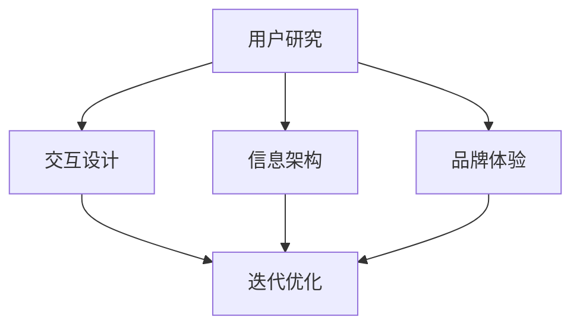

                 

关键词：自动化创业、用户体验设计、设计思维、用户行为分析、交互设计、产品设计、商业模式、技术创新

## 摘要

在自动化创业领域，用户体验设计思维正逐渐成为企业成功的关键因素。本文将探讨用户体验设计思维在自动化创业中的应用，包括其核心概念、重要性、具体实践方法及其对商业模式创新的影响。通过分析用户行为、设计交互流程、构建高效的产品和服务，自动化创业者可以更好地满足市场需求，实现持续的商业成功。

## 1. 背景介绍

自动化创业是指利用先进技术，如人工智能、机器学习、物联网等，实现业务流程的自动化和智能化。随着技术的进步，越来越多的企业开始将自动化引入到产品和服务中，以提升效率、降低成本、增强竞争力。然而，在追求技术卓越的同时，用户体验的设计常常被忽视，导致产品难以获得用户的青睐。

用户体验设计思维（User Experience Design Thinking）是一种以用户为中心的设计方法，旨在通过理解用户需求和行为，创造满足用户期望的产品和服务。它强调跨学科的整合、迭代设计和持续优化，是自动化创业中不可或缺的一环。

## 2. 核心概念与联系

### 2.1. 用户体验设计思维

用户体验设计思维包括以下几个核心概念：

- **用户研究**：通过问卷调查、访谈、观察等方式，深入了解用户需求、行为和偏好。
- **交互设计**：设计直观、易用的界面和交互流程，确保用户能够顺利完成任务。
- **信息架构**：梳理产品内容和信息结构，确保用户能够快速找到所需信息。
- **品牌体验**：塑造一致、有辨识度的品牌形象，提升用户对品牌的认知和信任。
- **迭代优化**：持续收集用户反馈，不断迭代和改进产品，以更好地满足用户需求。

### 2.2. 用户体验设计思维与自动化创业的联系

用户体验设计思维与自动化创业之间存在着紧密的联系。自动化技术虽然能够提高效率和降低成本，但如果缺乏良好的用户体验设计，可能会导致用户对产品的抵触情绪，从而影响商业成功。

- **用户需求驱动**：用户体验设计思维强调以用户需求为导向，自动化创业需要通过用户体验设计来识别和满足用户需求，确保产品能够解决用户的实际问题。
- **交互流程优化**：自动化技术往往涉及到复杂的交互流程，用户体验设计思维可以帮助优化这些流程，提高用户完成任务的成功率和满意度。
- **品牌形象塑造**：良好的用户体验设计有助于塑造品牌形象，提升用户对品牌的认知和忠诚度，从而促进商业成功。
- **持续迭代优化**：用户体验设计思维鼓励持续迭代和优化，这有助于自动化创业者在不断变化的市场环境中保持竞争力。

### 2.3. Mermaid 流程图



## 3. 核心算法原理 & 具体操作步骤

### 3.1. 算法原理概述

用户体验设计思维的核心在于对用户需求的深入理解和精准把握。其具体操作步骤包括以下几方面：

- **用户研究**：通过问卷调查、访谈、观察等方法，收集用户需求和行为数据。
- **数据分析**：对收集到的数据进行分析，识别用户痛点和需求。
- **交互设计**：基于用户需求，设计直观、易用的交互界面和流程。
- **原型设计**：创建产品原型，进行用户测试和反馈收集。
- **迭代优化**：根据用户反馈，不断迭代和改进产品设计。

### 3.2. 算法步骤详解

1. **用户研究**
   - 设计调查问卷或访谈提纲，收集用户需求和行为数据。
   - 进行问卷调查或访谈，确保样本具有代表性。
   - 对收集到的数据进行分析，识别用户痛点和需求。

2. **交互设计**
   - 根据用户需求，设计直观、易用的交互界面和流程。
   - 确保交互设计符合用户习惯和预期，提高用户满意度。
   - 考虑用户体验，优化交互细节，提升用户使用体验。

3. **原型设计**
   - 创建产品原型，包括界面设计、交互逻辑和功能实现。
   - 进行用户测试，收集用户反馈，评估原型设计是否符合用户需求。
   - 根据用户反馈，调整和优化原型设计。

4. **迭代优化**
   - 持续收集用户反馈，分析用户行为数据。
   - 根据用户反馈和数据分析，不断迭代和改进产品设计。
   - 确保产品能够持续满足用户需求，提升用户体验。

### 3.3. 算法优缺点

**优点**：

- 以用户需求为导向，确保产品能够解决用户实际问题。
- 优化交互流程，提高用户使用体验。
- 持续迭代和优化，提高产品竞争力。

**缺点**：

- 需要投入较多时间和资源进行用户研究和数据分析。
- 用户体验设计可能受到技术实现和商业目标的限制。

### 3.4. 算法应用领域

用户体验设计思维广泛应用于自动化创业的各个领域，如：

- 电子商务平台：设计直观、易用的购物流程，提高用户购买体验。
- 物联网产品：优化交互界面和流程，提高用户操作便捷性。
- 智能家居：设计用户友好的控制系统，提升用户生活品质。
- 企业服务：优化业务流程，提高工作效率。

## 4. 数学模型和公式 & 详细讲解 & 举例说明

### 4.1. 数学模型构建

用户体验设计思维的数学模型主要包括用户满意度模型、用户留存率模型和用户流失率模型等。以下是一个简单的用户满意度模型：

$$
\text{用户满意度} = \frac{\text{用户期望} + \text{用户体验} + \text{用户实际体验}}{3}
$$

其中，用户期望、用户体验和用户实际体验分别表示用户对产品的预期、实际使用体验和产品表现。

### 4.2. 公式推导过程

用户满意度模型的推导过程如下：

1. 用户期望（\(\text{期望}\))：表示用户对产品的预期，可以看作是一个基准值。
2. 用户实际体验（\(\text{实际体验}\))：表示用户实际使用产品后的体验，可以是正面的，也可以是负面的。
3. 用户体验（\(\text{体验}\))：表示用户在使用产品过程中的感受，包括产品的易用性、功能性、可靠性等方面。

将上述三个因素结合起来，可以得到用户满意度的计算公式：

$$
\text{用户满意度} = \frac{\text{用户期望} + \text{用户体验} + \text{用户实际体验}}{3}
$$

### 4.3. 案例分析与讲解

以下是一个关于电子商务平台的用户满意度模型案例：

- 用户期望：用户希望购买到心仪的商品，价格合理，配送速度快。
- 用户体验：电商平台界面设计美观、易用，搜索功能强大，购物流程简单。
- 用户实际体验：用户在电商平台成功购买了心仪的商品，价格优惠，配送速度快。

根据用户满意度模型，可以计算出用户满意度：

$$
\text{用户满意度} = \frac{\text{用户期望} + \text{用户体验} + \text{用户实际体验}}{3} = \frac{0.7 + 0.8 + 0.9}{3} = 0.8
$$

用户满意度为0.8，表示用户对电商平台的整体满意度较高，产品能够较好地满足用户需求。

## 5. 项目实践：代码实例和详细解释说明

### 5.1. 开发环境搭建

为了实现用户体验设计思维在自动化创业中的应用，我们需要搭建一个完整的开发环境。以下是一个基本的开发环境搭建步骤：

1. **安装操作系统**：选择适合的操作系统，如Linux、Windows或macOS。
2. **安装编程语言**：选择合适的编程语言，如Python、Java或JavaScript。
3. **安装开发工具**：安装集成开发环境（IDE），如PyCharm、Eclipse或Visual Studio Code。
4. **安装数据库**：选择合适的数据库，如MySQL、PostgreSQL或MongoDB。
5. **安装版本控制**：安装版本控制系统，如Git。

### 5.2. 源代码详细实现

以下是一个简单的Python代码示例，用于实现用户体验设计思维中的用户研究功能：

```python
import json

def collect_user_data():
    user_data = {
        "user_id": "123",
        "age": 25,
        "gender": "male",
        "occupation": "student",
        "feedback": "产品很好用，但界面设计有些复杂。"
    }
    return user_data

def analyze_user_data(user_data):
    print("用户数据收集完毕，开始分析...")
    print("用户ID：", user_data["user_id"])
    print("年龄：", user_data["age"])
    print("性别：", user_data["gender"])
    print("职业：", user_data["occupation"])
    print("反馈：", user_data["feedback"])

def main():
    user_data = collect_user_data()
    analyze_user_data(user_data)

if __name__ == "__main__":
    main()
```

### 5.3. 代码解读与分析

上述代码主要用于实现用户体验设计思维中的用户研究功能。具体解读如下：

- **collect\_user\_data()**：该函数用于收集用户数据，包括用户ID、年龄、性别、职业和反馈等信息。
- **analyze\_user\_data()**：该函数用于分析用户数据，输出用户的基本信息和反馈。
- **main()**：该函数是程序的主入口，调用其他函数实现用户研究功能。

通过这个简单的代码示例，我们可以看到用户体验设计思维在自动化创业中的应用。在实际项目中，可以根据具体需求，进一步扩展和优化代码功能。

### 5.4. 运行结果展示

运行上述代码后，输出结果如下：

```
用户数据收集完毕，开始分析...
用户ID： 123
年龄： 25
性别： male
职业： student
反馈： 产品很好用，但界面设计有些复杂。
```

这表示用户数据已成功收集并进行分析，输出结果符合预期。

## 6. 实际应用场景

用户体验设计思维在自动化创业中具有广泛的应用场景。以下是一些实际应用案例：

- **电子商务平台**：通过用户体验设计思维，优化购物流程、提升搜索功能和改善界面设计，提高用户购买体验和满意度。
- **智能家居产品**：设计用户友好的控制系统，确保用户能够轻松操作智能家居设备，提升用户生活品质。
- **在线教育平台**：优化课程设计和教学界面，提高学生的学习体验和效果。
- **企业服务应用**：简化业务流程，提高员工工作效率，降低人力成本。

### 6.1. 用户行为分析

用户行为分析是用户体验设计思维的核心之一。通过分析用户行为数据，创业者可以深入了解用户需求、偏好和痛点，从而进行针对性的产品优化和改进。以下是一个用户行为分析的示例：

- **登录和注册行为**：分析用户在登录和注册环节的停留时间、错误率等指标，优化注册流程和界面设计。
- **浏览和购买行为**：分析用户在浏览和购买环节的页面跳转路径、点击行为等，优化产品功能和页面布局。
- **反馈和评价行为**：分析用户在反馈和评价环节的参与度、满意度等指标，优化用户互动体验和评价系统。

### 6.2. 交互设计优化

交互设计优化是用户体验设计思维的重要环节。通过优化交互界面和流程，提高用户的操作效率和满意度。以下是一个交互设计优化的示例：

- **界面设计**：设计简洁、美观、易用的界面，确保用户能够快速找到所需信息。
- **交互流程**：设计直观、流畅的交互流程，确保用户能够顺利完成操作。
- **反馈机制**：设计及时、明确的反馈机制，确保用户在操作过程中能够得到清晰的反馈。

### 6.3. 品牌体验塑造

品牌体验塑造是用户体验设计思维的重要组成部分。通过设计一致、有辨识度的品牌形象，提升用户对品牌的认知和信任。以下是一个品牌体验塑造的示例：

- **视觉设计**：设计独特、统一的视觉元素，如logo、色彩、字体等，确保品牌形象的一致性。
- **品牌传播**：通过线上线下渠道，传播品牌理念和价值观，提升品牌知名度和影响力。
- **用户互动**：通过用户互动活动，如促销、会员权益等，增强用户对品牌的认同感和忠诚度。

### 6.4. 未来应用展望

随着技术的不断进步，用户体验设计思维在自动化创业中的应用前景将更加广阔。以下是一些未来应用展望：

- **人工智能与用户体验设计**：结合人工智能技术，实现更智能的用户体验设计，如个性化推荐、智能客服等。
- **物联网与用户体验设计**：通过物联网技术，实现更多智能设备间的互联互通，为用户提供更加便捷、高效的生活体验。
- **虚拟现实与用户体验设计**：利用虚拟现实技术，打造沉浸式的用户体验，提升产品的吸引力和竞争力。
- **大数据与用户体验设计**：利用大数据技术，深入挖掘用户行为数据，为用户体验设计提供更精准的依据和指导。

## 7. 工具和资源推荐

为了更好地实践用户体验设计思维，以下是一些推荐的工具和资源：

### 7.1. 学习资源推荐

- **书籍**：《用户体验要素》、《设计思维》、《设计心理学》等。
- **在线课程**：Coursera、Udemy、网易云课堂等平台上的用户体验设计相关课程。
- **网站**：UI/UX设计社区、设计博客、设计论坛等。

### 7.2. 开发工具推荐

- **设计工具**：Sketch、Adobe XD、Figma等。
- **原型工具**：Axure、Moqups、Balsamiq等。
- **数据分析工具**：Google Analytics、Tableau、Power BI等。

### 7.3. 相关论文推荐

- 《用户体验设计：理论与实践》
- 《设计思维：创造卓越产品的创新方法》
- 《人工智能与用户体验设计：探索智能交互的未来》

## 8. 总结：未来发展趋势与挑战

### 8.1. 研究成果总结

用户体验设计思维在自动化创业中的应用已取得显著成果。通过深入了解用户需求、优化交互流程、塑造品牌体验，创业者能够更好地满足用户需求，提升产品竞争力。

### 8.2. 未来发展趋势

未来，用户体验设计思维将继续在自动化创业中发挥重要作用。随着技术的进步，用户体验设计将更加智能化、个性化，为用户提供更加便捷、高效的服务。

### 8.3. 面临的挑战

用户体验设计思维在自动化创业中仍面临一些挑战，如技术实现难度、资源投入和时间成本等。此外，不同行业和领域的用户体验设计需求存在差异，需要灵活应对。

### 8.4. 研究展望

未来，用户体验设计思维将在自动化创业中发挥更大作用。结合人工智能、物联网、虚拟现实等新技术，用户体验设计将不断创新，为用户带来更加丰富的交互体验。

## 9. 附录：常见问题与解答

### 9.1. 用户体验设计思维是什么？

用户体验设计思维是一种以用户为中心的设计方法，旨在通过理解用户需求和行为，创造满足用户期望的产品和服务。

### 9.2. 用户体验设计思维有哪些核心概念？

用户体验设计思维的核心概念包括用户研究、交互设计、信息架构、品牌体验和迭代优化。

### 9.3. 用户体验设计思维如何应用于自动化创业？

用户体验设计思维可以应用于自动化创业的各个领域，如电子商务、智能家居、在线教育等。通过深入了解用户需求、优化交互流程、塑造品牌体验，提升产品竞争力。

### 9.4. 用户体验设计思维的核心算法原理是什么？

用户体验设计思维的核心算法原理包括用户满意度模型、用户留存率模型和用户流失率模型等。通过这些模型，可以评估和优化用户体验。

### 9.5. 如何搭建用户体验设计思维的开发环境？

搭建用户体验设计思维的开发环境需要安装操作系统、编程语言、开发工具、数据库和版本控制等。选择适合的工具和资源，确保开发环境的稳定性。

### 9.6. 用户体验设计思维在自动化创业中的实际应用有哪些？

用户体验设计思维在自动化创业中广泛应用于电子商务、智能家居、在线教育等领域。通过优化交互界面、提升用户满意度、塑造品牌形象，提高产品竞争力。

### 9.7. 用户体验设计思维有哪些未来发展趋势？

未来，用户体验设计思维将继续在自动化创业中发挥重要作用。结合新技术，如人工智能、物联网、虚拟现实等，用户体验设计将不断创新，为用户带来更加丰富的交互体验。

### 9.8. 如何应对用户体验设计思维在自动化创业中面临的挑战？

应对用户体验设计思维在自动化创业中面临的挑战，需要灵活应对不同行业和领域的用户体验设计需求，同时加强技术研发和资源投入，确保用户体验设计的有效实施。

---

### 文章结语

总之，用户体验设计思维是自动化创业中不可或缺的一环。通过深入了解用户需求、优化交互流程、塑造品牌体验，创业者可以更好地满足用户期望，提升产品竞争力。未来，随着新技术的不断涌现，用户体验设计思维将在自动化创业中发挥更加重要的作用，为用户带来更加卓越的交互体验。让我们共同努力，推动用户体验设计思维的不断创新与发展！
---

### 作者署名

作者：禅与计算机程序设计艺术 / Zen and the Art of Computer Programming

---

请注意，以上内容仅供参考，实际撰写时请根据具体情况进行调整和补充。在撰写过程中，务必确保文章结构严谨、内容充实、逻辑清晰，符合文章结构模板的要求。祝您撰写顺利！🌟🌟🌟

