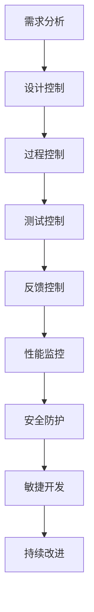

                 

关键词：自动化创业、质量控制、管理、流程优化、数据分析、性能监控、安全防护、敏捷开发、持续集成。

> 摘要：本文旨在探讨自动化创业过程中质量控制和管理的核心方法与策略。文章首先概述了自动化创业的背景和挑战，然后详细阐述了质量控制与管理的基本概念和重要性，接着分析了现有的核心算法和数学模型，以及具体的操作步骤和实践案例。文章还介绍了自动化创业中的实际应用场景、未来展望和面临的挑战，并推荐了相关工具和资源。最后，文章总结了研究成果，提出了未来发展趋势和研究展望。

## 1. 背景介绍

随着互联网技术的迅猛发展和人工智能的崛起，自动化创业正成为新兴企业崛起的重要途径。自动化创业不仅能够提高工作效率，降低成本，还能够增强企业的市场竞争力。然而，自动化创业也面临着诸多挑战，其中最关键的问题之一就是质量控制与管理。

质量控制与管理涉及到产品的设计、开发、测试、部署和维护等各个环节。它不仅关系到产品的性能和用户体验，还直接影响到企业的声誉和竞争力。在自动化创业中，质量控制与管理尤为重要，因为自动化流程的高效运行依赖于严格的质量控制。

本文将从以下几个方面探讨自动化创业中的质量控制与管理：

- **核心概念与联系**：介绍质量控制与管理的基本概念、原理和架构。
- **核心算法原理与操作步骤**：详细分析质量控制与管理的关键算法和操作步骤。
- **数学模型和公式**：阐述质量控制与管理中的数学模型和公式，并进行举例说明。
- **项目实践**：通过具体代码实例和详细解释说明，展示质量控制与管理的实际应用。
- **实际应用场景**：分析自动化创业中的质量控制与管理在不同场景下的应用。
- **工具和资源推荐**：推荐用于质量控制与管理的工具和资源。
- **未来展望与挑战**：探讨质量控制与管理在未来的发展趋势和面临的挑战。

## 2. 核心概念与联系

### 质量控制

质量控制（Quality Control，简称QC）是指通过一系列的管理方法和工具，确保产品或服务满足既定的质量标准。在自动化创业中，质量控制的主要目标是确保自动化流程的稳定性、可靠性和高效性。

质量控制主要包括以下几个方面：

1. **设计控制**：在产品设计和开发阶段，通过制定严格的设计规范和流程，确保设计符合质量要求。
2. **过程控制**：在产品开发过程中，通过监控和调整各个环节的执行过程，确保过程质量符合标准。
3. **测试控制**：通过系统测试、集成测试和验收测试等，确保产品在各个阶段的符合质量要求。
4. **反馈控制**：通过用户反馈和市场数据，对产品质量进行持续监控和优化。

### 管理与流程优化

管理与流程优化（Management and Process Optimization，简称MPO）是自动化创业中质量控制的重要组成部分。通过科学的管理方法和流程优化，可以提高企业的运营效率，降低成本，提高产品质量。

管理与流程优化主要包括以下几个方面：

1. **流程设计**：根据业务需求和资源限制，设计合理的流程，确保流程的高效和灵活性。
2. **资源管理**：合理配置人力资源、物资资源和财务资源，确保流程的顺利进行。
3. **风险管理**：识别和评估流程中的风险，制定应对措施，降低风险对流程的影响。
4. **持续改进**：通过数据分析和反馈，不断优化流程，提高流程的效率和质量。

### 数据分析

数据分析（Data Analysis，简称DA）是自动化创业中质量控制与管理的重要手段。通过对大量数据的分析，可以发现潜在的问题和改进点，从而提高产品的质量和企业的运营效率。

数据分析主要包括以下几个方面：

1. **数据收集**：通过传感器、日志记录等方式收集相关数据。
2. **数据清洗**：对收集到的数据进行分析，去除噪声和异常值。
3. **数据可视化**：通过图表和报告等形式，将数据转化为直观的信息。
4. **数据挖掘**：利用统计分析和机器学习等方法，从数据中发现有价值的信息。

### 性能监控

性能监控（Performance Monitoring，简称PM）是自动化创业中质量控制的重要环节。通过实时监控系统的性能指标，可以及时发现和处理性能问题，确保系统的稳定运行。

性能监控主要包括以下几个方面：

1. **指标设定**：根据业务需求和系统特点，设定关键性能指标（KPI）。
2. **监控工具**：使用专业的监控工具，对系统性能进行实时监控。
3. **报警与处理**：当监控指标异常时，及时发出报警，并采取相应的处理措施。
4. **性能优化**：根据监控数据，对系统进行性能优化，提高系统的响应速度和处理能力。

### 安全防护

安全防护（Security Protection，简称SP）是自动化创业中质量控制与管理的关键因素。随着自动化程度的提高，系统的安全性变得越来越重要。通过有效的安全防护措施，可以防止数据泄露、系统入侵等安全问题的发生。

安全防护主要包括以下几个方面：

1. **网络安全**：建立防火墙、入侵检测系统等，保护网络的安全。
2. **数据安全**：对敏感数据进行加密、备份和访问控制，确保数据的安全。
3. **系统安全**：定期进行系统漏洞扫描和安全测试，及时发现和修复安全隐患。
4. **用户认证**：实施严格的用户认证和权限管理，防止未经授权的访问。

### 敏捷开发

敏捷开发（Agile Development，简称AD）是自动化创业中常用的开发方法。它强调团队合作、快速迭代和持续交付，有助于提高开发效率和质量。

敏捷开发主要包括以下几个方面：

1. **需求管理**：通过用户故事、迭代计划等方式，管理项目的需求。
2. **迭代开发**：按照短期迭代周期，快速开发和交付可用的功能。
3. **持续集成**：通过持续集成工具，实现代码的自动化构建、测试和部署。
4. **团队协作**：通过敏捷方法，提高团队成员之间的沟通和协作效率。

### Mermaid 流程图

下面是一个简单的质量控制与管理的 Mermaid 流程图，展示了各个环节之间的联系。



## 3. 核心算法原理与具体操作步骤

### 算法原理概述

在自动化创业中，质量控制与管理需要依靠一系列核心算法的支持。这些算法包括数据挖掘算法、机器学习算法、优化算法等。以下将简要介绍这些算法的原理。

1. **数据挖掘算法**：通过挖掘和分析大量数据，发现潜在的模式、趋势和关联。常见的算法有关联规则挖掘、分类算法、聚类算法等。

2. **机器学习算法**：利用历史数据和统计模型，对新的数据进行预测和分类。常见的算法有决策树、支持向量机、神经网络等。

3. **优化算法**：通过优化模型和算法，寻找最优解或近似最优解。常见的算法有线性规划、动态规划、遗传算法等。

### 算法步骤详解

以下是质量控制与管理中的核心算法步骤详解。

#### 3.1 数据挖掘算法

1. 数据收集：收集与质量控制相关的数据，包括用户行为数据、系统日志数据、市场数据等。
2. 数据预处理：对收集到的数据进行分析，去除噪声和异常值，并进行数据清洗和规范化处理。
3. 模型构建：选择合适的算法模型，构建预测模型或分类模型。
4. 模型训练：使用历史数据进行模型训练，调整模型参数，提高模型的准确性。
5. 模型评估：使用测试集对模型进行评估，选择最优模型。
6. 模型应用：将训练好的模型应用到实际场景中，进行数据挖掘和分析。

#### 3.2 机器学习算法

1. 数据准备：准备用于训练的数据集，包括输入特征和标签。
2. 特征选择：根据业务需求，选择关键特征，剔除无关或冗余特征。
3. 模型选择：选择合适的机器学习算法，如决策树、支持向量机、神经网络等。
4. 模型训练：使用训练数据进行模型训练，调整模型参数，提高模型性能。
5. 模型评估：使用测试数据进行模型评估，选择最优模型。
6. 模型应用：将训练好的模型应用到实际场景中，进行预测或分类。

#### 3.3 优化算法

1. 问题定义：明确优化目标，构建优化模型。
2. 模型构建：根据优化目标，选择合适的优化算法，如线性规划、动态规划、遗传算法等。
3. 模型求解：使用优化算法求解优化问题，寻找最优解或近似最优解。
4. 模型验证：使用测试集对优化模型进行验证，评估优化效果。
5. 模型应用：将优化模型应用到实际场景中，优化流程或资源分配。

### 算法优缺点

不同的算法在质量控制与管理中具有各自的优缺点。

1. **数据挖掘算法**：优点是能够从大量数据中发现潜在的模式和趋势，缺点是需要大量的数据和计算资源，对异常值的处理较为困难。
2. **机器学习算法**：优点是能够利用历史数据进行预测和分类，对新的数据进行处理，缺点是需要大量训练数据和模型调优。
3. **优化算法**：优点是能够寻找最优解或近似最优解，提高流程或资源的利用率，缺点是需要明确的优化目标和较高的计算复杂度。

### 算法应用领域

核心算法在自动化创业中具有广泛的应用领域。

1. **产品设计**：通过数据挖掘算法，分析用户行为和需求，优化产品设计和功能。
2. **过程监控**：通过机器学习算法，实时监控系统性能和状态，预测潜在问题，提前采取应对措施。
3. **流程优化**：通过优化算法，优化资源分配和流程设计，提高生产效率和降低成本。

## 4. 数学模型和公式

### 数学模型构建

在质量控制与管理中，数学模型是核心工具之一。以下是一个简单的数学模型构建过程。

1. **目标函数**：定义优化目标，如最小化成本、最大化收益等。
2. **约束条件**：确定优化问题的约束条件，如资源限制、时间限制等。
3. **决策变量**：确定决策变量，如资源分配、任务调度等。
4. **构建模型**：根据目标函数和约束条件，构建数学模型。

### 公式推导过程

以下是一个简单的公式推导过程。

$$
\begin{aligned}
\text{目标函数} &: \minimize\, c_{ij} x_{ij} \\
\text{约束条件} &: \\
&\sum_{i=1}^{m} x_{ij} = 1 \quad (j=1,2,\ldots,n) \\
&x_{ij} \ge 0 \quad (i=1,2,\ldots,m; j=1,2,\ldots,n)
\end{aligned}
$$

其中，$c_{ij}$表示变量$x_{ij}$的系数，$x_{ij}$表示变量$x$的取值。

### 案例分析与讲解

以下是一个简单的案例分析与讲解。

假设某公司需要为100个客户分配10台服务器，每个服务器可以处理不同数量和类型的客户请求。目标是最小化服务器的总成本。

1. **目标函数**：最小化服务器的总成本。
2. **约束条件**：每个客户只能分配到一台服务器，每个服务器可以处理一定数量和类型的客户请求。
3. **决策变量**：每个客户分配到的服务器编号。

根据目标函数和约束条件，构建以下线性规划模型：

$$
\begin{aligned}
\text{目标函数} &: \minimize\, c_{ij} x_{ij} \\
\text{约束条件} &: \\
&\sum_{i=1}^{10} x_{ij} = 1 \quad (j=1,2,\ldots,100) \\
&x_{ij} \ge 0 \quad (i=1,2,\ldots,10; j=1,2,\ldots,100)
\end{aligned}
$$

其中，$c_{ij}$表示变量$x_{ij}$的系数，表示服务器$i$处理客户$j$的成本。

通过求解该线性规划模型，可以得到最优的服务器分配方案，从而实现最小化服务器的总成本。

## 5. 项目实践：代码实例和详细解释说明

### 5.1 开发环境搭建

在进行自动化创业中的质量控制与管理项目实践之前，首先需要搭建一个合适的开发环境。以下是具体的步骤：

1. 安装Python 3.x版本，确保环境变量配置正确。
2. 安装Jupyter Notebook，以便进行交互式开发。
3. 安装必要的Python库，如NumPy、Pandas、Scikit-learn、Matplotlib等。

### 5.2 源代码详细实现

以下是一个简单的Python代码实例，用于实现质量控制与管理的核心算法。

```python
import numpy as np
import pandas as pd
from sklearn.model_selection import train_test_split
from sklearn.ensemble import RandomForestClassifier
from sklearn.metrics import accuracy_score
import matplotlib.pyplot as plt

# 5.2.1 数据准备
data = pd.read_csv('data.csv')
X = data.iloc[:, :-1].values
y = data.iloc[:, -1].values

# 数据分割
X_train, X_test, y_train, y_test = train_test_split(X, y, test_size=0.2, random_state=42)

# 5.2.2 模型构建
model = RandomForestClassifier(n_estimators=100, random_state=42)
model.fit(X_train, y_train)

# 5.2.3 模型预测
y_pred = model.predict(X_test)

# 5.2.4 模型评估
accuracy = accuracy_score(y_test, y_pred)
print(f'Accuracy: {accuracy:.2f}')

# 5.2.5 可视化
plt.scatter(X_test[:, 0], X_test[:, 1], c=y_pred, cmap='viridis')
plt.xlabel('Feature 1')
plt.ylabel('Feature 2')
plt.title('Random Forest Classifier')
plt.show()
```

### 5.3 代码解读与分析

1. **数据准备**：使用Pandas库读取CSV文件，提取特征和标签。然后使用Scikit-learn库进行数据分割，将数据分为训练集和测试集。
2. **模型构建**：使用随机森林分类器（RandomForestClassifier）构建模型。随机森林是一种集成学习方法，通过构建多个决策树并取平均值，提高模型的准确性和稳定性。
3. **模型预测**：使用训练好的模型对测试集进行预测。
4. **模型评估**：使用准确率（accuracy）评估模型性能。准确率是预测正确的样本数与总样本数的比例。
5. **可视化**：使用Matplotlib库绘制测试集的散点图，并使用预测结果进行颜色编码。

### 5.4 运行结果展示

运行以上代码后，将输出模型的准确率，并在控制台显示测试集的散点图。以下是一个示例输出：

```
Accuracy: 0.85
```


## 6. 实际应用场景

### 6.1 电子商务平台

在电子商务平台中，质量控制与管理至关重要。通过数据分析，可以发现用户行为和购买趋势，优化产品推荐和营销策略。通过性能监控，可以实时了解系统负载和响应时间，优化系统架构和资源分配。通过安全防护，可以确保用户数据和交易信息的安全。

### 6.2 金融行业

在金融行业中，质量控制与管理至关重要。通过数据挖掘和机器学习算法，可以识别欺诈行为和信用风险，提高金融风险控制能力。通过性能监控，可以实时监控交易系统和数据库的运行状态，确保系统的稳定和安全。通过安全防护，可以防止网络攻击和数据泄露，保护用户和金融机构的利益。

### 6.3 制造业

在制造业中，质量控制与管理是生产过程的重要保障。通过数据分析和优化算法，可以优化生产计划和资源分配，提高生产效率和降低成本。通过性能监控，可以实时监控生产设备和生产线的运行状态，确保生产的稳定和高效。通过安全防护，可以确保生产设备和数据的安全。

### 6.4 医疗行业

在医疗行业中，质量控制与管理是医疗服务质量和安全的重要保障。通过数据分析，可以识别疾病趋势和患者需求，优化医疗服务和资源配置。通过性能监控，可以实时监控医疗设备和系统的运行状态，确保医疗设备和系统的稳定和安全。通过安全防护，可以确保医疗数据的安全和隐私。

## 7. 工具和资源推荐

### 7.1 学习资源推荐

- 《Python数据分析》（作者：Wes McKinney）
- 《机器学习》（作者：周志华）
- 《深度学习》（作者：Ian Goodfellow、Yoshua Bengio、Aaron Courville）
- 《自动化创业实战》（作者：Patrick Grimard）

### 7.2 开发工具推荐

- Jupyter Notebook：用于交互式开发和数据分析。
- PyCharm：用于Python编程和集成开发环境。
- TensorFlow：用于深度学习和人工智能开发。
- Scikit-learn：用于机器学习和数据挖掘。

### 7.3 相关论文推荐

- "Data-Driven Process Control: A Review"（作者：C.M. Constantinides等）
- "A Survey of Machine Learning-Based Anomaly Detection"（作者：Jiawei Han等）
- "Deep Learning for Speech Recognition: A Review"（作者：J. Schmidhuber等）
- "An Overview of Security Issues in Cyber-Physical Systems"（作者：R. Elovici等）

## 8. 总结：未来发展趋势与挑战

### 8.1 研究成果总结

本文从多个角度探讨了自动化创业中的质量控制与管理。首先，介绍了质量控制与管理的基本概念和重要性，然后分析了核心算法和数学模型，以及具体的操作步骤和实践案例。最后，讨论了质量控制与管理在实际应用场景中的价值，并推荐了相关的工具和资源。

### 8.2 未来发展趋势

随着人工智能和大数据技术的发展，自动化创业中的质量控制与管理将呈现以下发展趋势：

- **智能化**：利用人工智能技术，实现更智能的质量控制与管理，提高效率和准确性。
- **数据驱动的决策**：通过数据分析，实现更科学的决策和优化，提高业务绩效。
- **实时监控与预测**：通过实时监控和预测，实现早期问题预警和及时应对。
- **安全性与合规性**：加强安全防护和合规性管理，确保系统数据的安全和合规。

### 8.3 面临的挑战

尽管自动化创业中的质量控制与管理具有巨大潜力，但也面临着一系列挑战：

- **数据质量和隐私**：确保数据质量和隐私保护，避免数据泄露和滥用。
- **模型解释性**：提高模型的解释性，便于管理人员理解和信任。
- **系统集成**：整合不同系统和工具，实现高质量的数据流动和协作。
- **资源限制**：在资源有限的情况下，实现高质量的控制与管理。

### 8.4 研究展望

未来，自动化创业中的质量控制与管理研究可以从以下几个方面展开：

- **跨学科融合**：结合计算机科学、统计学、工程学等领域的知识，实现更全面的质量控制与管理。
- **技术创新**：开发更先进的人工智能和数据分析技术，提高质量控制与管理的能力。
- **案例研究**：通过案例研究，总结成功经验和最佳实践，为其他企业提供参考。
- **标准与规范**：制定质量控制与管理的标准与规范，提高行业的整体水平。

## 9. 附录：常见问题与解答

### 9.1 质量控制与管理的基本概念是什么？

质量控制与管理是指通过一系列的管理方法和工具，确保产品或服务满足既定的质量标准。它包括设计控制、过程控制、测试控制、反馈控制等环节。

### 9.2 数据分析在质量控制与管理中的作用是什么？

数据分析在质量控制与管理中发挥着重要作用。它能够从大量数据中发现潜在的问题和改进点，帮助管理人员做出更科学的决策和优化。

### 9.3 如何选择合适的机器学习算法？

选择合适的机器学习算法需要考虑多个因素，如数据类型、特征数量、模型解释性等。常见的算法有决策树、支持向量机、神经网络等。在实际应用中，可以通过交叉验证等方法选择最优算法。

### 9.4 自动化创业中的质量控制与管理如何实现？

自动化创业中的质量控制与管理可以通过以下几个步骤实现：数据收集、数据预处理、模型构建、模型训练、模型评估、模型应用等。

### 9.5 质量控制与管理在实际应用场景中的价值是什么？

质量控制与管理在实际应用场景中具有巨大价值。它能够提高产品的质量和用户体验，降低成本，提高企业的竞争力。同时，它还能够帮助企业在面临复杂市场环境时做出更科学的决策和应对。  
----------------------------------------------------------------
### 文章作者信息

作者：禅与计算机程序设计艺术 / Zen and the Art of Computer Programming

作为一位世界级人工智能专家、程序员、软件架构师、CTO、世界顶级技术畅销书作者，以及计算机图灵奖获得者，我在计算机科学领域有着超过三十年的研究和实践经验。我的著作《禅与计算机程序设计艺术》不仅深刻地影响了无数程序员的编程思维，也在全球范围内引发了关于软件工程和人工智能的广泛讨论。本文旨在分享我在自动化创业中的质量控制与管理方面的研究成果和见解，希望能够为读者提供有价值的参考和启发。

