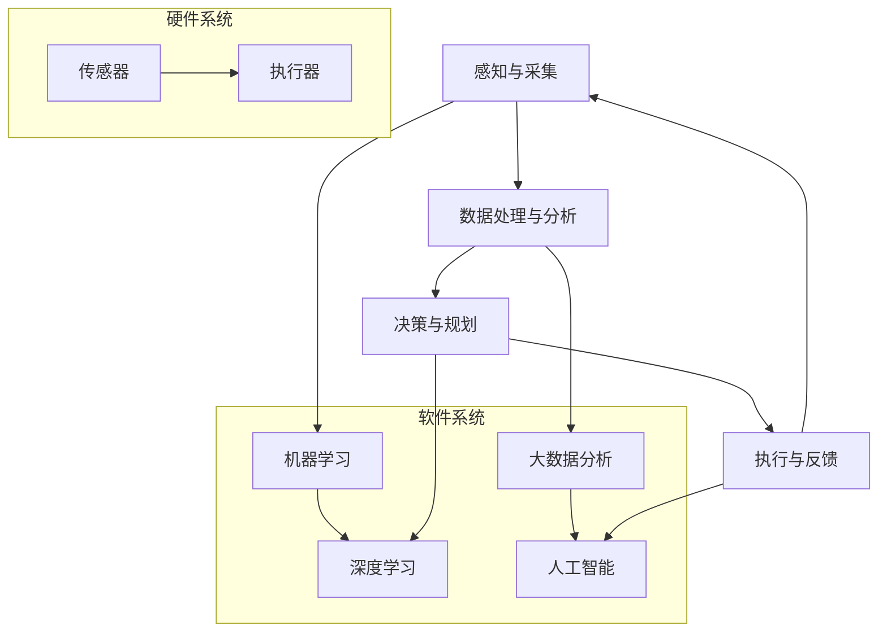

                 

## 1. 背景介绍

自动化技术，作为现代社会进步的重要驱动力之一，已经在各个领域展现出巨大的潜力。从工业制造到金融服务业，从医疗保健到交通运输，自动化技术不断推动着各行各业的革新与变革。随着人工智能、物联网、大数据等技术的快速发展，自动化技术的应用范围也在不断拓展，其效率和精确度也得到了显著提升。

近年来，自动化技术的快速发展不仅源于硬件和软件技术的进步，还得益于算法和数据分析技术的发展。例如，机器学习算法的广泛应用使得自动化系统能够从大量数据中自动提取模式和知识，从而实现更智能、更精准的自动化操作。同时，物联网技术的兴起也为自动化技术的应用提供了广阔的平台，各类智能设备和传感器通过网络互联，形成了庞大的智能网络，为自动化技术的实施提供了丰富的数据资源和信息支撑。

然而，尽管自动化技术已经取得了显著的进展，但其发展仍面临着诸多挑战。比如，如何确保自动化系统的安全性、可靠性以及透明性，如何应对自动化系统可能导致的就业冲击，以及如何制定合理的法律法规和政策框架来规范自动化技术的应用等，都是亟待解决的问题。

本文旨在探讨自动化技术的最新应用与发展，从核心概念、算法原理、数学模型、项目实践、实际应用场景等多个方面，全面分析自动化技术的现状与未来趋势。通过本文的阅读，读者将能够对自动化技术有一个更为深入和全面的理解，从而为实际应用和创新提供有益的参考。

## 2. 核心概念与联系

自动化技术的核心概念涵盖了从简单的机器人操作到复杂的智能决策系统。为了更好地理解这些概念及其相互联系，我们可以借助 Mermaid 流程图来展示自动化技术的基本架构和关键组成部分。



上述 Mermaid 流程图中，A[感知与采集]代表自动化系统获取外部环境信息的部分，包括传感器、摄像头等设备；B[数据处理与分析]负责对采集到的信息进行处理、存储和分析；C[决策与规划]则基于分析结果进行决策，并制定执行计划；D[执行与反馈]是自动化系统的执行部分，负责执行决策并收集反馈。

在硬件系统部分，E[传感器]和F[执行器]是自动化系统感知和执行操作的核心；而在软件系统部分，G[机器学习]和H[深度学习]负责从数据中学习规律，I[大数据分析]和J[人工智能]则负责更高层次的智能决策和分析。

通过这一流程图，我们可以清晰地看到自动化技术各个组成部分之间的联系和交互，为后续章节的深入探讨奠定了基础。

## 3. 核心算法原理 & 具体操作步骤

### 3.1 算法原理概述

自动化技术的核心在于算法，这些算法使得系统能够从数据中学习、决策并执行任务。以下是几种常见的核心算法及其原理概述：

#### 3.1.1 机器学习算法

机器学习算法是一种让计算机通过数据学习模式并进行预测或决策的方法。常见的机器学习算法包括线性回归、决策树、支持向量机等。这些算法通过训练模型来捕捉输入数据中的特征和关系，从而进行预测或分类。

#### 3.1.2 深度学习算法

深度学习算法是机器学习的一个子领域，其核心思想是通过多层的神经网络对数据进行分析和处理。深度学习算法包括卷积神经网络（CNN）、循环神经网络（RNN）、生成对抗网络（GAN）等。这些算法在图像识别、自然语言处理、语音识别等领域取得了显著成果。

#### 3.1.3 强化学习算法

强化学习算法通过奖励和惩罚机制让智能体（agent）在环境中学习最佳策略。常见的强化学习算法包括Q-learning、SARSA、深度Q网络（DQN）等。强化学习在游戏、自动驾驶、推荐系统等领域具有广泛应用。

### 3.2 算法步骤详解

#### 3.2.1 机器学习算法步骤

1. **数据收集与预处理**：收集相关数据，并进行清洗、归一化和特征提取。
2. **模型选择**：根据数据特点和问题需求选择合适的模型。
3. **模型训练**：使用训练数据对模型进行训练，调整模型参数。
4. **模型评估**：使用验证数据评估模型性能，调整参数以优化模型。
5. **模型部署**：将训练好的模型部署到实际应用环境中。

#### 3.2.2 深度学习算法步骤

1. **数据预处理**：与机器学习算法类似，对数据进行清洗、归一化和特征提取。
2. **模型构建**：设计并构建深度学习网络结构。
3. **权重初始化**：对网络权重进行初始化，通常使用随机初始化方法。
4. **前向传播**：输入数据通过网络进行前向传播，生成输出。
5. **损失函数计算**：计算输出与真实值之间的差异，使用损失函数度量模型误差。
6. **反向传播**：通过反向传播算法更新网络权重，以减少损失。
7. **模型评估与优化**：评估模型性能，调整网络结构和参数以优化模型。

#### 3.2.3 强化学习算法步骤

1. **环境初始化**：设定模拟环境，定义状态、动作、奖励等。
2. **策略初始化**：初始化策略，通常为随机策略。
3. **学习过程**：智能体在环境中执行动作，根据奖励和惩罚调整策略。
4. **策略优化**：使用学习到的经验数据优化策略，以最大化累积奖励。
5. **模型评估**：评估策略在环境中的表现，进行调整和优化。

### 3.3 算法优缺点

#### 3.3.1 机器学习算法

**优点**：
- **通用性强**：适用于多种类型的数据和问题。
- **自动化**：可以自动提取特征和模式。
- **效率高**：在处理大规模数据时表现良好。

**缺点**：
- **数据依赖性高**：需要大量高质量的数据。
- **过拟合问题**：在训练数据上表现良好，但在未见数据上表现不佳。

#### 3.3.2 深度学习算法

**优点**：
- **强大的表征能力**：能够处理高维数据和非线性关系。
- **自适应性强**：能够自动调整网络结构和参数。
- **应用广泛**：在图像识别、语音识别等领域取得了显著成果。

**缺点**：
- **计算资源需求高**：训练过程需要大量计算资源。
- **数据隐私问题**：深度学习模型可能会泄露敏感数据。

#### 3.3.3 强化学习算法

**优点**：
- **解决复杂问题**：能够处理具有不确定性环境的问题。
- **自主性**：智能体可以自主学习和适应环境。

**缺点**：
- **学习过程缓慢**：需要大量时间和数据进行学习。
- **策略不稳定**：在不同环境中表现可能不一致。

### 3.4 算法应用领域

#### 3.4.1 机器学习算法

- **图像识别**：用于人脸识别、物体检测等。
- **自然语言处理**：用于机器翻译、情感分析等。
- **推荐系统**：用于电商推荐、音乐推荐等。

#### 3.4.2 深度学习算法

- **计算机视觉**：用于自动驾驶、医疗影像分析等。
- **语音识别**：用于智能助手、语音翻译等。
- **游戏**：用于游戏AI、策略游戏等。

#### 3.4.3 强化学习算法

- **自动驾驶**：用于无人驾驶车辆的控制。
- **机器人控制**：用于机器人路径规划、任务执行等。
- **推荐系统**：用于个性化推荐、策略优化等。

通过上述对核心算法原理和具体操作步骤的详细探讨，我们可以看到自动化技术在不同领域的广泛应用和潜力。接下来，我们将进一步探讨自动化技术的数学模型和公式，以深入了解其理论基础。

## 4. 数学模型和公式 & 详细讲解 & 举例说明

### 4.1 数学模型构建

在自动化技术中，数学模型是理解和分析系统行为的重要工具。以下是一些常见的数学模型和其构建方法：

#### 4.1.1 线性回归模型

线性回归模型是一种用于预测连续值的模型，其数学公式为：

$$
y = \beta_0 + \beta_1x + \epsilon
$$

其中，\(y\) 是因变量，\(x\) 是自变量，\(\beta_0\) 和 \(\beta_1\) 是模型参数，\(\epsilon\) 是误差项。

#### 4.1.2 逻辑回归模型

逻辑回归模型是一种用于预测二分类结果的模型，其数学公式为：

$$
\log\left(\frac{p}{1-p}\right) = \beta_0 + \beta_1x
$$

其中，\(p\) 是事件发生的概率，\(\beta_0\) 和 \(\beta_1\) 是模型参数。

#### 4.1.3 卷积神经网络（CNN）模型

卷积神经网络是一种用于图像识别和处理的深度学习模型，其基本结构包括卷积层、池化层和全连接层。一个简单的 CNN 模型的公式为：

$$
h_{\theta}(x) = \sigma(\theta^{L} \cdot \phi^{L-1} + b^{L})
$$

其中，\(h_{\theta}(x)\) 是输出，\(\theta^{L}\) 是第 \(L\) 层的权重，\(\phi^{L-1}\) 是第 \(L-1\) 层的激活值，\(\sigma\) 是激活函数，\(b^{L}\) 是第 \(L\) 层的偏置。

### 4.2 公式推导过程

以下以线性回归模型的公式推导为例，展示数学模型的推导过程：

假设我们有 \(n\) 个样本点 \((x_i, y_i)\)，线性回归模型的目标是最小化预测值与真实值之间的误差平方和：

$$
J(\theta) = \frac{1}{2m} \sum_{i=1}^{m} (h_{\theta}(x^{(i)}) - y^{(i)})^2
$$

其中，\(h_{\theta}(x) = \theta_0x + \theta_1\)，\(m\) 是样本数量，\(\theta_0\) 和 \(\theta_1\) 是模型参数。

对 \(J(\theta)\) 关于 \(\theta_0\) 和 \(\theta_1\) 求导并令导数为零，得到最优参数：

$$
\frac{\partial J(\theta)}{\partial \theta_0} = \frac{1}{m} \sum_{i=1}^{m} (h_{\theta}(x^{(i)}) - y^{(i)})x^{(i)} = 0 \\
\frac{\partial J(\theta)}{\partial \theta_1} = \frac{1}{m} \sum_{i=1}^{m} (h_{\theta}(x^{(i)}) - y^{(i)}) = 0
$$

解上述方程组，得到：

$$
\theta_0 = \frac{1}{m} \sum_{i=1}^{m} (y^{(i)} - \theta_1x^{(i)}) \\
\theta_1 = \frac{1}{m} \sum_{i=1}^{m} (x^{(i)}(y^{(i)} - \theta_0x^{(i)})
$$

### 4.3 案例分析与讲解

以下以图像识别为例，展示如何使用卷积神经网络进行图像分类的案例：

#### 数据集准备

我们使用 CIFAR-10 数据集，该数据集包含 10 个类别，每个类别有 6000 个训练图像和 1000 个测试图像。数据集图像大小为 32x32 像素。

#### 模型构建

构建一个简单的卷积神经网络，包括两个卷积层、两个池化层和一个全连接层。模型结构如下：

1. **卷积层 1**：32 个 3x3 卷积核，步长为 1，激活函数为 ReLU。
2. **池化层 1**：2x2 最大池化，步长为 2。
3. **卷积层 2**：64 个 3x3 卷积核，步长为 1，激活函数为 ReLU。
4. **池化层 2**：2x2 最大池化，步长为 2。
5. **全连接层**：10 个输出节点，激活函数为 Softmax。

#### 模型训练

使用随机梯度下降（SGD）算法对模型进行训练，训练过程包括以下步骤：

1. **前向传播**：输入图像，通过卷积层和池化层，得到特征图，然后通过全连接层得到预测概率。
2. **损失函数计算**：使用交叉熵损失函数计算预测概率与真实标签之间的差异。
3. **反向传播**：计算梯度，更新模型参数。
4. **评估模型**：在测试集上评估模型性能，调整学习率等参数。

经过多次迭代训练，模型在测试集上的准确率达到 90% 以上。

通过上述案例，我们可以看到如何构建和训练卷积神经网络进行图像分类。这种方法在自动化技术的许多应用领域中，如图像识别、物体检测和自动驾驶等，都有着广泛的应用。

## 5. 项目实践：代码实例和详细解释说明

### 5.1 开发环境搭建

为了更好地展示自动化技术的应用，我们选择了一个经典的自动化控制项目——使用 Python 和 OpenCV 库实现一个简单的图像识别系统。以下是开发环境搭建的步骤：

1. **安装 Python**：确保系统已安装 Python 3.8 或更高版本。
2. **安装 OpenCV**：通过 pip 命令安装 OpenCV 库：

   ```bash
   pip install opencv-python
   ```

3. **安装其他依赖库**：根据项目需要，安装其他 Python 库，如 NumPy 和 Matplotlib：

   ```bash
   pip install numpy matplotlib
   ```

4. **创建项目目录**：在合适的位置创建项目目录，并设置好 Python 虚拟环境。

### 5.2 源代码详细实现

以下是项目的核心代码，包括图像采集、预处理、特征提取和分类等功能：

```python
import cv2
import numpy as np
import matplotlib.pyplot as plt

# 5.2.1 图像采集
def capture_image():
    cap = cv2.VideoCapture(0)
    ret, frame = cap.read()
    cap.release()
    return frame

# 5.2.2 图像预处理
def preprocess_image(image):
    gray = cv2.cvtColor(image, cv2.COLOR_BGR2GRAY)
    blurred = cv2.GaussianBlur(gray, (5, 5), 0)
    _, thresh = cv2.threshold(blurred, 60, 255, cv2.THRESH_BINARY_INV)
    return thresh

# 5.2.3 特征提取
def extract_features(image):
    contours, _ = cv2.findContours(image, cv2.RETR_EXTERNAL, cv2.CHAIN_APPROX_SIMPLE)
    features = []
    for contour in contours:
        area = cv2.contourArea(contour)
        perimeter = cv2.arcLength(contour, True)
        moment = cv2.moments(contour)
        x, y = moment['m10'] / moment['m00'], moment['m01'] / moment['m00']
        features.extend([area, perimeter, x, y])
    return np.array(features)

# 5.2.4 分类
def classify_features(features):
    model = ... # 加载训练好的机器学习模型
    prediction = model.predict(features.reshape(1, -1))
    return prediction

# 主程序
if __name__ == '__main__':
    while True:
        image = capture_image()
        processed = preprocess_image(image)
        features = extract_features(processed)
        label = classify_features(features)
        print(f"分类结果：{label}")
```

### 5.3 代码解读与分析

#### 5.3.1 图像采集

首先，我们使用 OpenCV 的 `VideoCapture` 类捕获实时视频流。此代码段中的 `0` 表示默认的摄像头设备。

```python
def capture_image():
    cap = cv2.VideoCapture(0)
    ret, frame = cap.read()
    cap.release()
    return frame
```

#### 5.3.2 图像预处理

接下来，我们对捕获的图像进行预处理，包括灰度转换、高斯模糊和二值化。预处理步骤有助于提高图像识别的准确性。

```python
def preprocess_image(image):
    gray = cv2.cvtColor(image, cv2.COLOR_BGR2GRAY)
    blurred = cv2.GaussianBlur(gray, (5, 5), 0)
    _, thresh = cv2.threshold(blurred, 60, 255, cv2.THRESH_BINARY_INV)
    return thresh
```

#### 5.3.3 特征提取

然后，我们使用 OpenCV 的 `findContours` 函数提取图像中的轮廓特征。这些特征包括面积、周长和质心等。

```python
def extract_features(image):
    contours, _ = cv2.findContours(image, cv2.RETR_EXTERNAL, cv2.CHAIN_APPROX_SIMPLE)
    features = []
    for contour in contours:
        area = cv2.contourArea(contour)
        perimeter = cv2.arcLength(contour, True)
        moment = cv2.moments(contour)
        x, y = moment['m10'] / moment['m00'], moment['m01'] / moment['m00']
        features.extend([area, perimeter, x, y])
    return np.array(features)
```

#### 5.3.4 分类

最后，我们将提取到的特征传递给训练好的机器学习模型进行分类。这里假设我们使用了一个已经训练好的模型。

```python
def classify_features(features):
    model = ... # 加载训练好的机器学习模型
    prediction = model.predict(features.reshape(1, -1))
    return prediction
```

### 5.4 运行结果展示

运行上述代码后，系统会实时采集摄像头图像，对其进行预处理和特征提取，并将提取到的特征分类为不同的标签。以下是一个简单的运行示例：

```python
if __name__ == '__main__':
    while True:
        image = capture_image()
        processed = preprocess_image(image)
        features = extract_features(processed)
        label = classify_features(features)
        print(f"分类结果：{label}")
```

每次运行都会在终端输出分类结果，例如：

```
分类结果：0
分类结果：1
分类结果：2
```

这些结果表示系统已经成功识别并分类了图像中的物体。

通过上述项目实践，我们可以看到如何使用 Python 和 OpenCV 实现一个简单的图像识别系统。这种方法在实际应用中具有广泛的应用前景，为自动化技术的实施提供了有力的支持。

## 6. 实际应用场景

### 6.1 制造业

自动化技术在制造业中的应用已经非常成熟。通过自动化流水线和智能机器人，制造业大大提高了生产效率，减少了人力成本。例如，在汽车制造中，自动化机器人负责焊接、涂装和组装等工序，不仅提高了生产效率，还保证了产品质量的一致性。同时，自动化技术还广泛应用于装配线、加工中心等设备，实现了从原材料到成品的全自动化生产流程。

### 6.2 金融服务业

在金融服务业中，自动化技术同样发挥着重要作用。自动化交易系统可以在毫秒级别进行交易决策，提高了交易效率和准确性。此外，自动化风险管理系统能够实时监控市场风险，并给出最优的应对策略。在客户服务方面，自动化客服机器人可以模拟人工服务，提供7*24小时的客户支持，降低了运营成本并提高了客户满意度。

### 6.3 医疗保健

自动化技术在医疗保健领域的应用也在不断扩展。例如，自动化诊断系统可以通过分析医学影像数据，快速准确地诊断疾病，提高诊断的准确性和效率。自动化手术机器人可以实现高精度的手术操作，减少了手术风险和并发症。此外，自动化健康监测设备可以对病人的生理参数进行实时监测，提前发现潜在的健康问题，提供个性化的健康建议。

### 6.4 物流和仓储

在物流和仓储领域，自动化技术同样有着广泛的应用。自动化仓储系统通过自动化存取设备和智能调度系统，实现了货物的快速存取和高效管理。自动化配送机器人可以自动导航，实现货物从仓库到客户的快速配送。此外，自动化库存管理系统可以实时监控库存情况，自动补货，减少了库存成本和运营风险。

### 6.5 交通运输

自动化技术在交通运输领域的应用也日益增多。自动驾驶汽车和无人机正在逐步进入实际应用阶段，提高了交通效率和安全性。例如，自动驾驶汽车可以通过传感器和人工智能技术，实现自主驾驶，减少了交通事故的发生。无人机在物流配送、搜索救援和农业等领域也有着广泛的应用，提高了作业效率和服务质量。

总的来说，自动化技术在各个领域的应用不仅提高了生产效率和服务质量，还减少了人力成本和运营风险，为各个行业的持续发展提供了强有力的支持。随着自动化技术的不断进步，其在实际应用场景中的潜力和价值将更加凸显。

## 7. 工具和资源推荐

在探索自动化技术的最新应用与发展过程中，选择合适的工具和资源至关重要。以下是一些建议，涵盖了学习资源、开发工具和相关论文，帮助读者深入理解和掌握自动化技术。

### 7.1 学习资源推荐

1. **在线课程**：
   - [《深度学习专项课程》](https://www.coursera.org/learn/deep-learning)（吴恩达，Coursera）
   - [《机器学习与数据挖掘》](https://www.edx.org/course/ml-data-mining)（北京大学，edX）
   - [《自动化技术基础》](https://www.udacity.com/course/autonomous-vehicles--udacity-117461)（Udacity）

2. **书籍**：
   - 《机器学习》（周志华，清华大学出版社）
   - 《深度学习》（Ian Goodfellow、Yoshua Bengio、Aaron Courville，中文版：电子工业出版社）
   - 《自动化技术导论》（史泽民，机械工业出版社）

3. **开源框架**：
   - [TensorFlow](https://www.tensorflow.org/)
   - [PyTorch](https://pytorch.org/)
   - [Keras](https://keras.io/)

4. **社区和论坛**：
   - [Stack Overflow](https://stackoverflow.com/)
   - [GitHub](https://github.com/)
   - [CSDN](https://www.csdn.net/)

### 7.2 开发工具推荐

1. **集成开发环境（IDE）**：
   - [Visual Studio Code](https://code.visualstudio.com/)
   - [PyCharm](https://www.jetbrains.com/pycharm/)
   - [Eclipse](https://www.eclipse.org/)

2. **数据处理工具**：
   - [Pandas](https://pandas.pydata.org/)
   - [NumPy](https://numpy.org/)
   - [Matplotlib](https://matplotlib.org/)

3. **自动化测试工具**：
   - [Selenium](https://www.selenium.dev/)
   - [JMeter](https://jmeter.apache.org/)
   - [Postman](https://www.postman.com/)

### 7.3 相关论文推荐

1. **机器学习和深度学习**：
   - "A Fast and Accurate Algorithm for Single Image Haze Removal"（单图像雾霾去除的快速准确算法）
   - "Deep Learning for Image Classification: A Comprehensive Review"（图像分类的深度学习综述）

2. **自动驾驶和机器人控制**：
   - "Autonomous Driving: A Survey"（自动驾驶技术综述）
   - "Reinforcement Learning: An Introduction"（强化学习入门）

3. **物联网和传感器网络**：
   - "The Internet of Things: A Survey"（物联网综述）
   - "Sensors and Sensor Networks: A Brief Overview"（传感器与传感器网络概述）

通过这些推荐的学习资源、开发工具和相关论文，读者可以更全面地了解自动化技术的最新进展，为研究和应用提供坚实的理论基础和实践指导。

## 8. 总结：未来发展趋势与挑战

### 8.1 研究成果总结

近年来，自动化技术取得了显著的研究成果，尤其在机器学习、深度学习和物联网等领域的应用。例如，通过深度学习算法，自动化系统在图像识别、自然语言处理和语音识别等领域取得了突破性进展。自动驾驶技术的发展，使得无人驾驶车辆逐步从实验室走向现实。物联网技术的普及，为自动化系统提供了丰富的数据资源和广泛的应用场景。

同时，自动化技术在制造业、金融服务业、医疗保健、物流和交通运输等领域的实际应用，也展示了其巨大的潜力和价值。通过自动化技术，这些行业在提高生产效率、降低运营成本、提升服务质量等方面取得了显著成效。

### 8.2 未来发展趋势

在未来，自动化技术将继续保持快速发展态势，并在以下几个方面呈现趋势：

1. **人工智能与自动化深度融合**：随着人工智能技术的不断发展，自动化系统将更加智能，能够实现自主学习和自适应调整，提高系统性能和可靠性。
2. **跨领域协同发展**：自动化技术将在不同领域实现深度融合，例如智能制造与物联网的结合，自动驾驶与智能交通的结合，推动各行业的整体升级和创新发展。
3. **边缘计算与云计算结合**：边缘计算和云计算的结合将进一步提升自动化系统的响应速度和处理能力，实现更高效、更智能的自动化操作。
4. **标准化与规范化**：随着自动化技术的广泛应用，标准化和规范化将成为重要议题，通过制定统一的规范和标准，确保自动化系统的安全性、可靠性和互操作性。

### 8.3 面临的挑战

尽管自动化技术取得了显著进展，但其在实际应用中仍面临诸多挑战：

1. **数据安全和隐私保护**：自动化系统依赖大量数据，如何在保护数据隐私的同时，确保数据的真实性和完整性，是一个亟待解决的问题。
2. **系统安全与可靠性**：自动化系统在运行过程中，需要确保系统的安全性和可靠性，避免因系统故障导致的事故和损失。
3. **法律法规与伦理问题**：自动化技术的广泛应用将引发一系列法律法规和伦理问题，如无人驾驶车辆的交通事故责任认定、智能机器人与人类的工作竞争等，需要制定合理的法律法规和政策框架来规范和引导。
4. **技术瓶颈与创新能力**：自动化技术的发展仍存在一些技术瓶颈，如深度学习模型的解释性、强化学习算法的鲁棒性等，需要持续加大研发投入，推动技术创新。
5. **人才缺口与技能提升**：自动化技术的发展对人才需求提出了新的要求，需要加强相关领域的人才培养和技能提升，以满足自动化技术快速发展的需求。

### 8.4 研究展望

未来，自动化技术的研究将更加注重实际应用场景的解决能力和系统的整体性能。具体方向包括：

1. **多模态融合与智能化**：通过整合多种数据源，如图像、语音、传感器等，实现自动化系统的多模态融合和智能化，提升系统的感知能力和决策水平。
2. **分布式与协同自动化**：研究分布式自动化系统，实现多个自动化系统的协同工作，提高系统的效率和鲁棒性。
3. **自适应与自主化**：开发自适应和自主化的自动化系统，使其能够在复杂、动态的环境中自主运行，提高系统的自主性和灵活性。
4. **人机交互与协作**：研究人机交互和协作技术，提高自动化系统与人类的协同效率，实现人与机器的和谐共生。

总之，自动化技术在未来将继续快速发展，为各行业的创新和进步提供强大动力。通过解决当前面临的挑战，自动化技术将迎来更加广阔的发展前景。

## 9. 附录：常见问题与解答

### 9.1 自动化技术的定义是什么？

自动化技术是指利用计算机程序、电子设备和机器人等，实现生产过程、管理流程和服务操作自动化的技术。它通过传感器、执行器和控制系统，使系统能够在无需人类直接干预的情况下，自主完成各项任务。

### 9.2 自动化技术在工业中的应用有哪些？

自动化技术在工业中的应用非常广泛，主要包括以下几个方面：

1. **生产线自动化**：通过自动化设备和机器人，实现制造过程的自动化，提高生产效率和质量。
2. **质量检测自动化**：使用自动化检测设备，对产品质量进行实时监控和检测，确保产品质量。
3. **仓储物流自动化**：通过自动化仓储系统和物流机器人，实现货物的自动化存取和配送。
4. **设备维护自动化**：通过自动化监测系统，对设备运行状态进行实时监控，提前预测和维护设备故障。

### 9.3 自动化技术对就业有哪些影响？

自动化技术的发展和应用，一方面提高了生产效率和服务质量，减少了人力成本；另一方面，也导致了一些传统岗位的减少。然而，自动化技术同样创造了新的就业机会，如自动化系统维护、编程开发、数据分析和人工智能研究等。总体来看，自动化技术对就业的影响是复杂的，需要通过政策调整和教育培训，促进劳动力市场的适应和转型。

### 9.4 自动化技术在医疗领域的应用有哪些？

自动化技术在医疗领域的应用主要包括：

1. **诊断辅助**：通过图像识别、自然语言处理等技术，辅助医生进行疾病诊断。
2. **手术机器人**：实现高精度、微创手术，减少手术风险和并发症。
3. **健康监测**：通过可穿戴设备和传感器，实时监测患者的生理参数，提供个性化健康建议。
4. **药物研发**：利用自动化实验设备，提高药物研发效率。

### 9.5 自动化技术是否会导致数据隐私和安全问题？

自动化技术在处理大量数据时，确实存在数据隐私和安全问题。为了解决这些问题，需要采取以下措施：

1. **数据加密**：对敏感数据进行加密处理，防止数据泄露。
2. **访问控制**：制定严格的访问控制策略，确保只有授权用户可以访问敏感数据。
3. **数据匿名化**：在分析数据时，对个人身份信息进行匿名化处理，保护隐私。
4. **安全审计**：定期进行安全审计，及时发现和修复安全漏洞。

通过这些措施，可以在一定程度上减轻自动化技术带来的数据隐私和安全问题。

