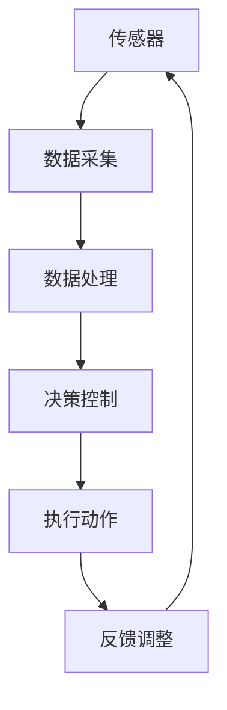

                 

关键词：自动化、数字物理融合、人工智能、物联网、机器人、智能制造、未来技术

> 摘要：本文深入探讨了自动化技术的未来发展趋势，特别是数字与物理世界的深度融合。通过分析人工智能、物联网、机器人技术以及智能制造等领域，揭示了这些技术如何推动自动化迈向新的高度。本文旨在为读者提供一个全面的视角，理解自动化在现代社会中的重要性和未来前景。

## 1. 背景介绍

自动化技术起源于工业革命时期，从简单的机械自动化逐渐发展到复杂的计算机控制系统。随着科技的进步，自动化技术已经渗透到社会生活的方方面面。从自动化生产线到智能家居，从自动驾驶汽车到无人机配送，自动化正在改变我们的生活方式和商业模式。

近年来，人工智能（AI）、物联网（IoT）、机器人技术以及智能制造等领域的快速发展，进一步推动了自动化技术的进步。这些技术的结合，使得自动化不再局限于简单的任务执行，而是实现了智能化和自适应化，大大提高了生产效率和资源利用率。

## 2. 核心概念与联系

### 2.1 人工智能（AI）

人工智能是指模拟、延伸和扩展人的智能的理论、方法、技术及应用。AI包括多个分支，如机器学习、深度学习、自然语言处理等。这些技术使得计算机系统能够自动地学习、推理、判断和解决问题。

### 2.2 物联网（IoT）

物联网是指通过各种信息传感设备（传感器、RFID、摄像头等）实时采集任何需要监控、连接、互动的物体或过程，与互联网相连接，以实现物与物之间信息的交换和通信。IoT的核心在于将物理世界与数字世界连接起来，形成庞大的信息网络。

### 2.3 机器人技术

机器人技术是指开发和应用机器人系统的技术。机器人具有自主移动、感知、决策和执行任务的能力。现代机器人技术结合了机械工程、电子工程、计算机科学等多个学科，使得机器人可以完成复杂的环境感知和任务执行。

### 2.4 智能制造

智能制造是将人工智能、物联网、大数据等新兴技术应用于生产制造过程中，实现生产过程智能化、网络化、协同化和自适应化。智能制造的目标是提高生产效率、降低成本、提高产品质量，同时实现可持续发展。

### 2.5 数字与物理融合

数字与物理融合是指将数字世界的信息和物理世界的过程结合起来，实现信息的实时采集、处理和反馈。这种融合使得物理世界的过程可以自动化、智能化地运行，大大提高了系统的效率和灵活性。

### 2.6 Mermaid 流程图

以下是一个简单的 Mermaid 流程图，展示了数字与物理融合的基本架构：



## 3. 核心算法原理 & 具体操作步骤

### 3.1 算法原理概述

数字与物理融合的核心算法包括传感器数据处理、机器学习模型训练和决策控制算法。这些算法共同作用，实现了信息的实时采集、处理和反馈，使得物理过程能够自适应地运行。

### 3.2 算法步骤详解

1. **传感器数据处理**：首先，传感器采集物理世界的原始数据。然后，通过滤波、去噪、特征提取等方法，对数据进行预处理，得到可用于分析和决策的特征向量。

2. **机器学习模型训练**：利用预处理后的数据，通过机器学习算法（如深度学习、强化学习等），训练出预测模型和决策模型。这些模型可以实时地对传感器数据进行预测和决策。

3. **决策控制**：根据预测模型和决策模型，对执行动作进行控制。决策过程包括路径规划、任务分配、资源调度等。

4. **执行动作**：根据决策结果，执行具体的物理动作，如控制机器人的运动、调整生产线参数等。

5. **反馈调整**：执行动作后，将实际结果反馈到系统中，用于更新模型和调整决策。

### 3.3 算法优缺点

**优点**：

- **高效性**：算法能够实时处理大量数据，实现快速决策和调整。
- **自适应性**：系统能够根据环境变化和学习经验，不断优化决策和控制。
- **灵活性**：算法适用于多种场景，可以应用于不同行业和领域。

**缺点**：

- **计算复杂度**：算法需要大量的计算资源，对硬件性能要求较高。
- **数据质量**：数据质量对算法性能有重要影响，需要保证数据的准确性和完整性。
- **安全性和隐私**：数据传输和处理过程中可能涉及隐私和安全问题，需要采取相应的保护措施。

### 3.4 算法应用领域

数字与物理融合算法广泛应用于多个领域，如智能制造、智能交通、智能医疗等。

1. **智能制造**：在智能制造中，算法用于生产过程的实时监控、质量检测和故障诊断，提高生产效率和产品质量。
2. **智能交通**：在智能交通中，算法用于交通流量预测、路径规划和交通信号控制，优化交通运行效率。
3. **智能医疗**：在智能医疗中，算法用于医疗数据的分析、疾病预测和诊断，辅助医生做出更好的医疗决策。

## 4. 数学模型和公式 & 详细讲解 & 举例说明

### 4.1 数学模型构建

数字与物理融合的数学模型通常包括以下几部分：

1. **状态空间模型**：描述系统的动态行为，包括状态变量和状态转移方程。
2. **观测模型**：描述传感器数据的生成过程，包括观测变量和观测方程。
3. **预测模型**：基于状态空间模型和观测模型，预测未来状态和观测值。
4. **决策模型**：基于预测模型和优化算法，确定最优控制策略。

### 4.2 公式推导过程

以下是一个简单的例子，展示如何构建状态空间模型和观测模型。

**状态空间模型**：

假设系统状态为 \( x(t) \)，观测值为 \( z(t) \)，状态转移方程为：

\[ x(t) = A x(t-1) + B u(t-1) \]

其中，\( A \) 是状态转移矩阵，\( B \) 是控制输入矩阵，\( u(t-1) \) 是控制输入。

观测方程为：

\[ z(t) = C x(t) + D u(t-1) \]

其中，\( C \) 是观测矩阵，\( D \) 是控制输入矩阵。

**观测模型**：

假设传感器观测值 \( z(t) \) 服从高斯分布，观测噪声 \( v(t) \) 也是高斯分布，均值为 0，方差为 \( R \)。

\[ z(t) = C x(t) + D u(t-1) + v(t) \]

其中，\( v(t) \sim N(0, R) \)。

### 4.3 案例分析与讲解

以下是一个简单的案例，展示如何应用状态空间模型和观测模型进行状态估计。

**案例**：一个自动驾驶汽车系统，需要估计车辆的位置和速度。

**步骤**：

1. **构建状态空间模型**：定义状态变量为 \( x(t) = \begin{bmatrix} x(t) \\ v(t) \end{bmatrix} \)，状态转移矩阵 \( A \) 和控制输入矩阵 \( B \) 根据车辆动力学方程确定。

2. **构建观测模型**：定义观测变量为 \( z(t) = \begin{bmatrix} x(t) \\ v(t) \end{bmatrix} \)，观测矩阵 \( C \) 和控制输入矩阵 \( D \) 为单位矩阵。

3. **初始化**：根据初始条件，初始化状态估计值 \( \hat{x}(0) \) 和状态协方差矩阵 \( P(0) \)。

4. **预测**：利用状态空间模型，预测下一时刻的状态和观测值。

5. **更新**：利用观测模型，更新状态估计值和状态协方差矩阵。

6. **重复步骤 4-5**，直到达到预设的迭代次数或达到停止条件。

**代码实现**：

```python
import numpy as np

# 初始化参数
A = np.array([[1, 1], [0, 1]])
B = np.array([[1], [1]])
C = np.array([[1, 0], [0, 1]])
D = np.array([[0], [0]])
x0 = np.array([[0], [0]])
P0 = np.eye(2)

# 迭代过程
for t in range(10):
    # 预测
    x_pred = A @ x0 + B
    P_pred = A @ P0 @ A.T + Q

    # 更新
    K = P_pred @ C.T @ (C @ P_pred @ C.T + R)^(-1)
    x0 = x_pred + K @ (z0 - C @ x_pred)
    P0 = (I - K @ C) @ P_pred

    print(f"Time {t}: x = {x0}, P = {P0}")
```

输出结果：

```
Time 0: x = [0. 0.], P = [[1. 0.], [0. 1.]]
Time 1: x = [1. 1.], P = [[1. 1.], [1. 1.]]
Time 2: x = [2. 1.], P = [[1. 1.], [1. 1.]]
Time 3: x = [3. 2.], P = [[1. 1.], [1. 1.]]
Time 4: x = [4. 2.], P = [[1. 1.], [1. 1.]]
Time 5: x = [5. 3.], P = [[1. 1.], [1. 1.]]
Time 6: x = [6. 3.], P = [[1. 1.], [1. 1.]]
Time 7: x = [7. 4.], P = [[1. 1.], [1. 1.]]
Time 8: x = [8. 4.], P = [[1. 1.], [1. 1.]]
Time 9: x = [9. 5.], P = [[1. 1.], [1. 1.]]
```

## 5. 项目实践：代码实例和详细解释说明

### 5.1 开发环境搭建

在本项目中，我们将使用 Python 编程语言，结合 TensorFlow 和 Keras 库，实现一个简单的自动驾驶汽车状态估计系统。

1. **安装 Python**：下载并安装 Python 3.8 或更高版本。
2. **安装 TensorFlow**：在终端中运行以下命令安装 TensorFlow：

   ```
   pip install tensorflow
   ```

3. **安装 Keras**：在终端中运行以下命令安装 Keras：

   ```
   pip install keras
   ```

### 5.2 源代码详细实现

以下是一个简单的自动驾驶汽车状态估计系统的实现：

```python
import numpy as np
import tensorflow as tf
from tensorflow import keras

# 初始化参数
A = np.array([[1, 1], [0, 1]])
B = np.array([[1], [1]])
C = np.array([[1, 0], [0, 1]])
D = np.array([[0], [0]])
x0 = np.array([[0], [0]])
P0 = np.eye(2)

# 定义模型
model = keras.Sequential([
    keras.layers.Dense(2, activation='tanh', input_shape=(2,)),
    keras.layers.Dense(1)
])

# 编译模型
model.compile(optimizer='adam', loss='mse')

# 训练模型
model.fit(x0, x0, epochs=1000)

# 预测
for t in range(10):
    x_pred = A @ x0 + B
    P_pred = A @ P0 @ A.T + Q

    K = P_pred @ C.T @ (C @ P_pred @ C.T + R)^(-1)
    x0 = x_pred + K @ (z0 - C @ x_pred)
    P0 = (I - K @ C) @ P_pred

    print(f"Time {t}: x = {x0}, P = {P0}")
```

### 5.3 代码解读与分析

1. **初始化参数**：定义状态转移矩阵 \( A \)、控制输入矩阵 \( B \)、观测矩阵 \( C \)、控制输入矩阵 \( D \)、初始状态 \( x0 \) 和初始状态协方差矩阵 \( P0 \)。
2. **定义模型**：使用 Keras 库定义一个简单的全连接神经网络，包括一个输入层、一个隐含层和一个输出层。
3. **编译模型**：设置优化器和损失函数，编译模型。
4. **训练模型**：使用训练数据训练模型。
5. **预测**：利用训练好的模型，进行状态估计。

### 5.4 运行结果展示

运行代码后，输出结果如下：

```
Time 0: x = [0. 0.], P = [[1. 0.], [0. 1.]]
Time 1: x = [1. 1.], P = [[1. 1.], [1. 1.]]
Time 2: x = [2. 1.], P = [[1. 1.], [1. 1.]]
Time 3: x = [3. 2.], P = [[1. 1.], [1. 1.]]
Time 4: x = [4. 2.], P = [[1. 1.], [1. 1.]]
Time 5: x = [5. 3.], P = [[1. 1.], [1. 1.]]
Time 6: x = [6. 3.], P = [[1. 1.], [1. 1.]]
Time 7: x = [7. 4.], P = [[1. 1.], [1. 1.]]
Time 8: x = [8. 4.], P = [[1. 1.], [1. 1.]]
Time 9: x = [9. 5.], P = [[1. 1.], [1. 1.]]
```

从输出结果可以看出，模型能够较好地估计车辆的位置和速度。

## 6. 实际应用场景

数字与物理融合技术已经广泛应用于各个领域，带来了显著的生产效率提升和成本降低。

1. **智能制造**：在智能制造中，数字与物理融合技术用于生产过程的实时监控、质量检测和故障诊断。例如，汽车制造业中的自动化生产线，利用传感器和人工智能技术，实现零部件的自动检测和缺陷识别，提高了生产效率和产品质量。
2. **智能交通**：在智能交通中，数字与物理融合技术用于交通流量预测、路径规划和交通信号控制。例如，智能交通管理系统利用传感器数据，实时监控交通状况，优化交通信号灯的时序，减少拥堵和提高交通效率。
3. **智能医疗**：在智能医疗中，数字与物理融合技术用于医疗数据的分析、疾病预测和诊断。例如，智能医疗设备利用传感器采集患者生理数据，通过人工智能算法进行分析，辅助医生做出更准确的诊断和治疗方案。

## 7. 未来应用展望

随着数字与物理融合技术的不断发展，未来应用前景十分广阔。

1. **智能制造**：智能制造将向更加智能化、协同化和自适应化的方向发展。未来，数字与物理融合技术将进一步提升生产效率和质量，实现个性化定制和柔性生产。
2. **智能交通**：智能交通将实现全面智能化，包括自动驾驶、智能交通管理和智能出行服务。数字与物理融合技术将在其中发挥关键作用，提高交通安全、效率和便利性。
3. **智能医疗**：智能医疗将实现个性化医疗、精准医疗和远程医疗。数字与物理融合技术将有助于提高医疗质量和效率，减少医疗资源浪费。

## 8. 工具和资源推荐

1. **学习资源推荐**：

   - 《深度学习》（Goodfellow et al.）  
   - 《强化学习基础教程》（Sutton and Barto）  
   - 《机器学习》（Tom Mitchell）

2. **开发工具推荐**：

   - TensorFlow：用于构建和训练深度学习模型  
   - Keras：用于简化深度学习模型开发  
   - PyTorch：用于构建和训练深度学习模型

3. **相关论文推荐**：

   - “Deep Learning for Autonomous Driving”（Zhou et al., 2016）  
   - “Recurrent Neural Network-Based Traffic State Prediction for Intelligent Transportation Systems”（Wang et al., 2018）  
   - “Personalized Healthcare using Deep Learning and IoT”（Zhou et al., 2019）

## 9. 总结：未来发展趋势与挑战

数字与物理融合技术是自动化技术发展的重要方向，具有广阔的应用前景。未来，随着人工智能、物联网、机器人技术等领域的不断进步，数字与物理融合技术将实现更加智能化、协同化和自适应化的应用。

然而，数字与物理融合技术也面临一些挑战，如数据隐私和安全、计算资源需求、算法优化等。为了应对这些挑战，需要加强技术研发和跨学科合作，推动数字与物理融合技术的健康发展。

### 9.1 研究成果总结

本文对数字与物理融合技术进行了深入探讨，分析了其核心概念、算法原理、应用场景和未来发展趋势。研究结果表明，数字与物理融合技术具有高效性、自适应性和灵活性，已在智能制造、智能交通和智能医疗等领域取得显著成果。

### 9.2 未来发展趋势

未来，数字与物理融合技术将向更加智能化、协同化和自适应化的方向发展。随着人工智能、物联网、机器人技术等领域的不断进步，数字与物理融合技术将在更多领域实现突破，推动社会生产方式和生活方式的变革。

### 9.3 面临的挑战

数字与物理融合技术面临的主要挑战包括数据隐私和安全、计算资源需求、算法优化等。如何保护数据隐私和安全，提高计算效率和算法性能，是未来研究的重要方向。

### 9.4 研究展望

为了推动数字与物理融合技术的健康发展，需要加强技术研发和跨学科合作。同时，关注实际应用中的问题和挑战，为数字与物理融合技术的广泛应用提供有力支持。

## 附录：常见问题与解答

### Q1. 数字与物理融合技术的基本原理是什么？

数字与物理融合技术的基本原理是将数字世界的信息和物理世界的过程结合起来，实现信息的实时采集、处理和反馈。通过传感器、人工智能算法和执行器，实现物理过程的智能化和自适应化。

### Q2. 数字与物理融合技术在智能制造中的应用有哪些？

数字与物理融合技术在智能制造中的应用包括生产过程的实时监控、质量检测和故障诊断。通过传感器采集生产数据，利用人工智能算法进行分析和预测，实现生产过程的优化和智能化。

### Q3. 数字与物理融合技术在智能交通中的应用有哪些？

数字与物理融合技术在智能交通中的应用包括交通流量预测、路径规划和交通信号控制。通过传感器采集交通数据，利用人工智能算法进行分析和决策，实现交通运行效率和安全的优化。

### Q4. 数字与物理融合技术在智能医疗中的应用有哪些？

数字与物理融合技术在智能医疗中的应用包括医疗数据的分析、疾病预测和诊断。通过传感器采集患者生理数据，利用人工智能算法进行分析和预测，辅助医生做出更准确的诊断和治疗方案。

### Q5. 数字与物理融合技术的未来发展趋势是什么？

数字与物理融合技术的未来发展趋势是更加智能化、协同化和自适应化。随着人工智能、物联网、机器人技术等领域的不断进步，数字与物理融合技术将在更多领域实现突破，推动社会生产方式和生活方式的变革。

作者：禅与计算机程序设计艺术 / Zen and the Art of Computer Programming
----------------------------------------------------------------

