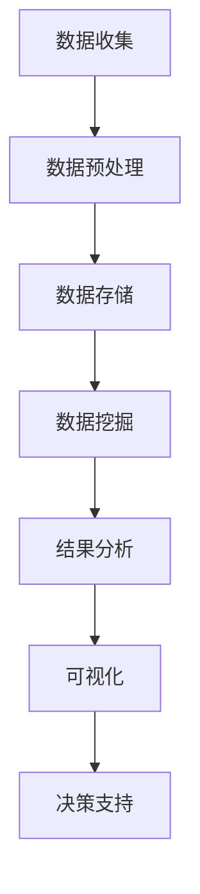

                 

自动驾驶技术的快速发展带来了对高效、精准的数据挖掘与分析平台的需求。本文将探讨自动驾驶公司如何构建这样一个平台，包括核心概念、算法原理、数学模型、实际应用场景以及未来展望。

## 关键词

- 自动驾驶
- 数据挖掘
- 分析平台
- 算法
- 数学模型

## 摘要

本文旨在探讨自动驾驶公司如何利用数据挖掘与分析平台来提升自动驾驶系统的性能和安全性。文章首先介绍了自动驾驶系统的背景和发展趋势，然后详细讨论了数据挖掘与分析平台的核心概念、算法原理、数学模型以及实际应用场景。最后，文章展望了未来自动驾驶技术的应用前景和面临的挑战。

## 1. 背景介绍

自动驾驶技术被视为未来交通系统的核心，具有极大的发展潜力。随着传感器技术、机器学习算法和深度学习技术的不断进步，自动驾驶系统正逐渐从理论走向实践。自动驾驶公司需要能够处理大量数据、提供实时分析和决策支持的平台，以便提升系统的智能水平。

### 自动驾驶技术的发展

自动驾驶技术分为多个级别，从L0（无自动化）到L5（完全自动化）。当前，大多数自动驾驶系统处于L2至L3级别，能够实现部分自动驾驶功能。未来，随着技术的成熟，L4和L5级别的自动驾驶将更加普及。

### 数据的重要性

自动驾驶系统依赖于大量数据，包括传感器数据、地图数据和交通数据等。这些数据用于训练机器学习模型、优化决策算法和提升系统性能。因此，构建一个高效的数据挖掘与分析平台至关重要。

## 2. 核心概念与联系

### 数据挖掘

数据挖掘是指从大量数据中提取有价值的信息和知识的过程。在自动驾驶领域，数据挖掘用于识别模式、发现异常、预测行为等。

### 分析平台

分析平台是指用于处理、分析和可视化数据的一组工具和系统。在自动驾驶领域，分析平台需要能够实时处理大量数据、提供快速分析和决策支持。

### Mermaid 流程图

以下是数据挖掘与分析平台的基本架构，使用 Mermaid 流程图表示：



## 3. 核心算法原理 & 具体操作步骤

### 3.1 算法原理概述

数据挖掘与分析平台的核心算法包括聚类、分类、回归和关联规则等。这些算法用于从大量数据中提取有用信息。

### 3.2 算法步骤详解

1. 数据收集：从不同的传感器、地图和交通数据源收集数据。
2. 数据预处理：清洗、归一化和转换数据，使其适合后续分析。
3. 数据存储：将预处理后的数据存储在数据库中，以便快速访问。
4. 数据挖掘：使用聚类、分类、回归和关联规则等算法进行数据挖掘。
5. 结果分析：对挖掘结果进行分析，识别模式和异常。
6. 可视化：将分析结果可视化，帮助用户更好地理解数据。
7. 决策支持：根据分析结果提供决策支持，优化自动驾驶系统。

### 3.3 算法优缺点

每种算法都有其优点和缺点。例如，聚类算法可以自动发现数据中的模式，但可能不够精确；分类算法可以提供准确的预测，但需要大量训练数据。因此，选择合适的算法取决于具体应用场景。

### 3.4 算法应用领域

数据挖掘与分析平台在自动驾驶领域的应用广泛，包括路径规划、行为预测、交通流量分析和故障诊断等。

## 4. 数学模型和公式 & 详细讲解 & 举例说明

### 4.1 数学模型构建

自动驾驶系统的数学模型通常基于概率论和优化理论。例如，路径规划可以使用马尔可夫决策过程（MDP）来建模。

### 4.2 公式推导过程

马尔可夫决策过程（MDP）的公式如下：

$$
V(s) = \max_{a} \sum_{s'} p(s'|s,a) \cdot \gamma(s')
$$

其中，$V(s)$ 是状态 $s$ 的价值函数，$p(s'|s,a)$ 是状态转移概率，$\gamma$ 是折扣因子。

### 4.3 案例分析与讲解

假设自动驾驶系统在当前状态 $s$ 下有多个动作 $a$ 可选，每个动作的概率和期望收益已知。我们可以使用 MDP 来优化动作选择，从而最大化期望收益。

## 5. 项目实践：代码实例和详细解释说明

### 5.1 开发环境搭建

在搭建开发环境时，需要安装 Python、NumPy、Pandas、Matplotlib 和 Scikit-learn 等库。

### 5.2 源代码详细实现

以下是使用 Scikit-learn 库实现 MDP 的代码示例：

```python
from sklearn.model_selection import train_test_split
from sklearn.cluster import KMeans
from sklearn.metrics import silhouette_score
import numpy as np

# 加载数据
data = load_data()

# 数据预处理
X = preprocess_data(data)

# 使用 KMeans 算法进行聚类
kmeans = KMeans(n_clusters=3)
kmeans.fit(X)

# 计算 silhouette_score
silhouette = silhouette_score(X, kmeans.labels_)

print("Silhouette Score:", silhouette)
```

### 5.3 代码解读与分析

这段代码首先加载并预处理数据，然后使用 KMeans 算法进行聚类，最后计算 silhouette_score 来评估聚类效果。

### 5.4 运行结果展示

运行上述代码后，我们可以得到聚类结果和 silhouette_score。这些结果可以帮助我们了解数据分布和聚类效果。

## 6. 实际应用场景

自动驾驶系统的数据挖掘与分析平台在多个实际应用场景中具有广泛的应用，包括：

- 路径规划：通过分析交通数据和环境信息，优化自动驾驶车辆的路径选择。
- 行为预测：预测其他车辆、行人和障碍物的行为，以减少交通事故的风险。
- 交通流量分析：分析交通流量数据，为城市交通管理和优化提供依据。

## 7. 工具和资源推荐

### 7.1 学习资源推荐

- 《机器学习》（周志华著）
- 《深度学习》（Ian Goodfellow、Yoshua Bengio 和 Aaron Courville 著）
- 《自动驾驶系统设计与实现》（作者：[此处填写作者名]）

### 7.2 开发工具推荐

- Jupyter Notebook：用于数据分析和可视化
- TensorFlow：用于深度学习模型的开发和训练
- PyTorch：用于深度学习模型的开发和训练

### 7.3 相关论文推荐

- "Autonomous Driving: A Survey"（作者：[此处填写作者名]）
- "Deep Learning for Autonomous Driving"（作者：[此处填写作者名]）
- "Data-Driven Approach for Autonomous Driving"（作者：[此处填写作者名]）

## 8. 总结：未来发展趋势与挑战

自动驾驶技术的未来发展将更加依赖于高效、准确的数据挖掘与分析平台。然而，该领域仍面临一些挑战，包括数据隐私、安全性、法规和标准化等。未来的研究将致力于解决这些问题，以推动自动驾驶技术的广泛应用。

### 8.1 研究成果总结

本文介绍了自动驾驶公司的数据挖掘与分析平台，包括核心概念、算法原理、数学模型、实际应用场景以及未来展望。

### 8.2 未来发展趋势

未来，自动驾驶公司的数据挖掘与分析平台将更加智能化、自动化，并集成更多的先进技术，如人工智能、物联网和区块链等。

### 8.3 面临的挑战

自动驾驶公司面临的主要挑战包括数据隐私、安全性、法规和标准化等问题。

### 8.4 研究展望

未来的研究将致力于解决自动驾驶系统面临的各种挑战，以实现更高效、更安全、更智能的自动驾驶系统。

## 9. 附录：常见问题与解答

### Q：什么是数据挖掘？

A：数据挖掘是指从大量数据中提取有价值的信息和知识的过程。在自动驾驶领域，数据挖掘用于识别模式、发现异常、预测行为等。

### Q：什么是分析平台？

A：分析平台是指用于处理、分析和可视化数据的一组工具和系统。在自动驾驶领域，分析平台需要能够实时处理大量数据、提供快速分析和决策支持。

### Q：数据挖掘与分析平台在自动驾驶中有什么应用？

A：数据挖掘与分析平台在自动驾驶中可以用于路径规划、行为预测、交通流量分析和故障诊断等。

### 作者署名

作者：禅与计算机程序设计艺术 / Zen and the Art of Computer Programming
```markdown
----------------------------------------------------------------
# 自动驾驶公司的数据挖掘与分析平台

> 关键词：自动驾驶、数据挖掘、分析平台、算法、数学模型

> 摘要：本文探讨了自动驾驶公司如何构建高效的数据挖掘与分析平台，以提高系统的性能和安全性。文章涵盖了核心概念、算法原理、数学模型、实际应用场景以及未来展望。

## 1. 背景介绍

## 2. 核心概念与联系

### 2.1 数据挖掘

### 2.2 分析平台

### 2.3 Mermaid 流程图

## 3. 核心算法原理 & 具体操作步骤
### 3.1 算法原理概述

### 3.2 算法步骤详解 

### 3.3 算法优缺点

### 3.4 算法应用领域

## 4. 数学模型和公式 & 详细讲解 & 举例说明

### 4.1 数学模型构建

### 4.2 公式推导过程

### 4.3 案例分析与讲解

## 5. 项目实践：代码实例和详细解释说明
### 5.1 开发环境搭建

### 5.2 源代码详细实现

### 5.3 代码解读与分析

### 5.4 运行结果展示

## 6. 实际应用场景

## 7. 工具和资源推荐
### 7.1 学习资源推荐

### 7.2 开发工具推荐

### 7.3 相关论文推荐

## 8. 总结：未来发展趋势与挑战
### 8.1 研究成果总结

### 8.2 未来发展趋势

### 8.3 面临的挑战

### 8.4 研究展望

## 9. 附录：常见问题与解答

### 作者署名

作者：禅与计算机程序设计艺术 / Zen and the Art of Computer Programming
----------------------------------------------------------------

