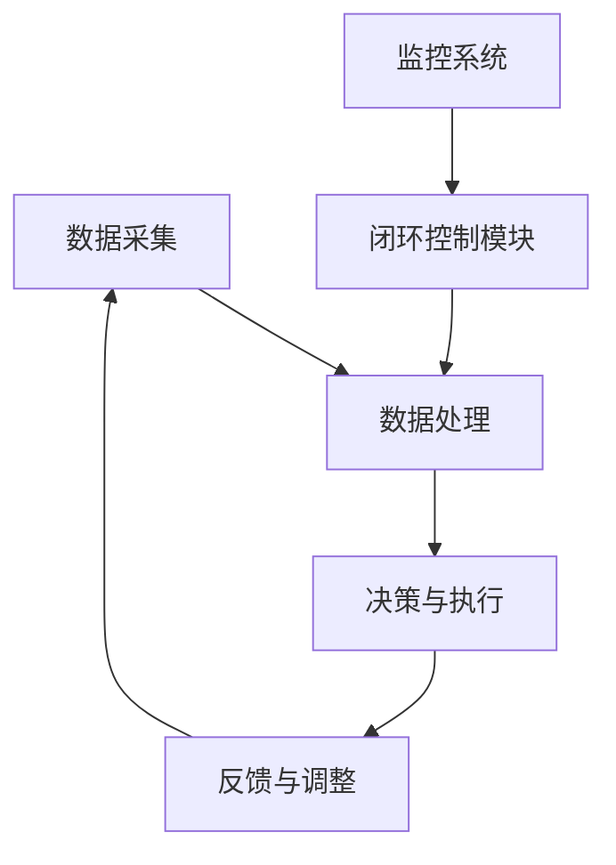

                 

关键词：自动驾驶，数据闭环，AI算法，机器学习，数据处理，传感器融合，实时预测，闭环控制，安全可靠性，性能优化，算法迭代

## 摘要

自动驾驶技术的发展正推动汽车行业迈向智能化时代。数据闭环能力成为自动驾驶公司提升系统性能和安全性的关键。本文将深入探讨自动驾驶公司如何构建数据闭环能力，包括核心概念、算法原理、数学模型、实践应用以及未来展望。通过详细分析，我们将了解数据闭环在自动驾驶系统中的重要性，以及如何实现高效的数据处理和算法迭代。

## 1. 背景介绍

自动驾驶技术是当今世界最具前景的科技领域之一。从辅助驾驶到完全自动驾驶，技术的发展正在改变人们的出行方式。自动驾驶系统依赖于大量的传感器、高性能计算和深度学习算法，实现对车辆周围环境的感知、理解、决策和执行。然而，这些系统的高效运行离不开数据闭环能力的支撑。数据闭环是指将系统输出数据反馈至输入端，以实现系统自我调整和优化的过程。

自动驾驶公司需要构建强大的数据闭环能力，以解决以下几个关键问题：

1. **环境感知**：自动驾驶系统需要实时感知并理解复杂多变的交通环境，这需要高效的传感器数据融合和处理能力。
2. **决策准确性**：自动驾驶系统的决策过程依赖于复杂的算法，这些算法需要不断迭代优化，以提高决策的准确性和安全性。
3. **系统可靠性**：自动驾驶系统需要在各种复杂环境下保持高可靠性，数据闭环能够帮助系统在异常情况下快速恢复和适应。
4. **性能优化**：通过数据闭环，自动驾驶公司可以持续优化系统性能，提高能效和用户体验。

## 2. 核心概念与联系

### 2.1 数据闭环原理

数据闭环（Data Loop）是指在自动驾驶系统中，通过采集、处理、反馈数据，形成闭环反馈控制的过程。数据闭环的基本原理包括以下几个方面：

1. **数据采集**：自动驾驶系统通过各种传感器（如摄像头、激光雷达、超声波传感器等）收集环境数据。
2. **数据处理**：对采集到的数据进行预处理、融合和特征提取，以供后续算法使用。
3. **决策与执行**：利用机器学习算法和深度学习模型，对处理后的数据进行分析，生成控制指令。
4. **反馈与调整**：将执行结果反馈回系统，用于调整传感器数据采集、算法模型训练等过程。

### 2.2 数据闭环架构

数据闭环架构包括以下几个关键模块：

1. **传感器数据采集模块**：负责实时采集车辆和周边环境数据。
2. **数据处理模块**：包括数据预处理、数据融合和特征提取等环节。
3. **算法训练与优化模块**：使用训练数据和模型，进行算法优化和模型迭代。
4. **闭环控制模块**：根据反馈数据调整系统参数，实现系统闭环控制。
5. **监控系统**：实时监控系统状态，确保数据闭环的稳定性和安全性。

### 2.3 Mermaid 流程图



## 3. 核心算法原理 & 具体操作步骤

### 3.1 算法原理概述

自动驾驶公司的数据闭环能力依赖于高效的机器学习和深度学习算法。这些算法通过不断迭代和优化，提高系统的感知能力、决策准确性和执行效率。以下是几个核心算法原理的概述：

1. **深度神经网络（DNN）**：DNN通过多层神经网络结构，对输入数据进行处理和特征提取，实现对复杂任务的建模。
2. **卷积神经网络（CNN）**：CNN特别适合处理图像数据，通过卷积操作提取图像特征，实现图像识别和分类。
3. **递归神经网络（RNN）**：RNN通过循环结构处理序列数据，适合于时间序列预测和序列建模。
4. **强化学习（RL）**：RL通过奖励机制，训练模型在动态环境中进行决策和优化。

### 3.2 算法步骤详解

1. **数据采集**：自动驾驶系统通过摄像头、激光雷达、超声波传感器等设备，实时采集车辆和周边环境数据。
2. **数据处理**：对采集到的数据进行预处理，包括去噪、归一化和数据增强等，以提高模型训练效果。
3. **模型训练**：利用预处理后的数据，对深度学习模型进行训练。训练过程包括前向传播、反向传播和模型优化。
4. **决策与执行**：利用训练好的模型，对实时数据进行处理，生成控制指令，如加速、减速或转向等。
5. **反馈与调整**：将执行结果反馈回系统，用于调整传感器数据采集、算法模型训练等过程，实现闭环控制。

### 3.3 算法优缺点

1. **优点**：
   - 提高系统感知能力和决策准确性。
   - 实现自适应性和实时性。
   - 提高系统安全性和可靠性。
2. **缺点**：
   - 模型训练过程复杂，计算资源消耗大。
   - 需要大量高质量训练数据。
   - 难以保证模型在极端环境下的鲁棒性。

### 3.4 算法应用领域

1. **环境感知**：利用深度学习算法，实现自动驾驶车辆对行人、车辆、道路标识等的识别和分类。
2. **路径规划**：利用强化学习算法，实现自动驾驶车辆在不同交通场景下的路径规划和避障。
3. **控制执行**：利用深度神经网络，实现自动驾驶车辆的加速、减速和转向控制。

## 4. 数学模型和公式 & 详细讲解 & 举例说明

### 4.1 数学模型构建

在自动驾驶的数据闭环系统中，常见的数学模型包括深度学习模型、卷积神经网络模型、递归神经网络模型等。以下是一个简化的深度学习模型的构建过程：

1. **输入层**：输入层接收传感器采集到的数据，如图像、激光雷达数据等。
2. **隐藏层**：隐藏层通过神经网络结构对输入数据进行特征提取和变换。
3. **输出层**：输出层根据隐藏层的结果生成控制指令，如速度、方向等。

### 4.2 公式推导过程

假设我们使用一个简化的卷积神经网络（CNN）模型，其公式推导如下：

1. **前向传播**：
   - 激活函数：\( f(x) = \frac{1}{1 + e^{-x}} \)
   - 卷积操作：\( C(x) = \sum_{i=1}^{k} w_{i} * x + b \)
   - 池化操作：\( P(y) = \max(y) \)
   - 前向传播公式：\( z_{l}^{i} = C(x_{l-1}^{i}) \)
2. **反向传播**：
   - 偏差计算：\( \delta_{l}^{i} = (z_{l}^{i} - y^{i}) \cdot f'(z_{l}^{i}) \)
   - 权重更新：\( w_{l}^{i} = w_{l}^{i} - \alpha \cdot \delta_{l}^{i} \)
   - 偏置更新：\( b_{l}^{i} = b_{l}^{i} - \alpha \cdot \delta_{l}^{i} \)

### 4.3 案例分析与讲解

假设我们有一个自动驾驶车辆在交叉路口的识别任务，输入数据为交叉路口的实时图像。我们可以使用CNN模型进行图像分类，具体步骤如下：

1. **数据预处理**：对输入图像进行缩放、裁剪和归一化处理，使其满足模型的输入要求。
2. **模型训练**：使用预处理的图像数据，对CNN模型进行训练。训练过程中，通过反向传播算法更新模型参数。
3. **模型评估**：使用训练集和测试集对模型进行评估，计算模型的准确率和召回率。
4. **模型部署**：将训练好的模型部署到自动驾驶系统中，实现交叉路口的识别功能。

通过这个案例，我们可以看到数学模型在自动驾驶数据闭环系统中的重要作用。数学模型不仅为自动驾驶系统提供了强大的数据处理和预测能力，也为系统的优化和迭代提供了理论基础。

## 5. 项目实践：代码实例和详细解释说明

### 5.1 开发环境搭建

为了实现自动驾驶数据闭环系统，我们需要搭建一个合适的开发环境。以下是搭建开发环境的步骤：

1. **硬件环境**：配置高性能计算机，用于运行深度学习模型和自动驾驶算法。
2. **软件环境**：安装Python、TensorFlow、PyTorch等深度学习框架，以及NVIDIA CUDA工具包等。
3. **传感器集成**：连接摄像头、激光雷达、超声波传感器等设备，确保数据采集的稳定性和实时性。

### 5.2 源代码详细实现

以下是一个简化的自动驾驶数据闭环系统的源代码实现，主要用于交叉路口识别任务。

```python
import cv2
import tensorflow as tf

# 数据预处理
def preprocess_image(image):
    image = cv2.resize(image, (224, 224))
    image = cv2.cvtColor(image, cv2.COLOR_BGR2RGB)
    image = image / 255.0
    return image

# 模型加载
model = tf.keras.models.load_model('cross_road_model.h5')

# 主函数
def main():
    cap = cv2.VideoCapture(0)
    while True:
        ret, frame = cap.read()
        if not ret:
            break
        preprocessed_frame = preprocess_image(frame)
        prediction = model.predict(np.expand_dims(preprocessed_frame, axis=0))
        result = np.argmax(prediction)
        if result == 1:
            cv2.putText(frame, 'Cross Road Detected', (10, 50), cv2.FONT_HERSHEY_SIMPLEX, 1, (0, 0, 255), 2)
        cv2.imshow('Cross Road Detection', frame)
        if cv2.waitKey(1) & 0xFF == ord('q'):
            break
    cap.release()
    cv2.destroyAllWindows()

if __name__ == '__main__':
    main()
```

### 5.3 代码解读与分析

上述代码实现了一个简单的自动驾驶交叉路口识别系统。主要分为以下几个部分：

1. **数据预处理**：使用OpenCV库对输入图像进行缩放、裁剪和颜色转换，使其满足模型输入要求。
2. **模型加载**：使用TensorFlow框架加载预训练的交叉路口识别模型。
3. **主函数**：通过循环读取摄像头捕获的图像，对图像进行预处理，然后使用模型进行预测。根据预测结果，在图像上标注交叉路口的检测结果。

通过这个案例，我们可以看到如何将深度学习模型应用于自动驾驶数据闭环系统中，实现实时交叉路口识别功能。

### 5.4 运行结果展示

运行上述代码后，摄像头捕获的实时图像会显示在窗口中。当检测到交叉路口时，图像上会出现红色文字标注，表示交叉路口已被识别。


## 6. 实际应用场景

自动驾驶数据闭环系统在多个实际应用场景中具有重要意义。以下是几个典型应用场景：

1. **交通管理**：通过实时感知和识别交通场景，自动驾驶系统可以协助交通管理部门进行交通流量控制和交通信号灯优化，提高道路通行效率。
2. **智能物流**：自动驾驶卡车和无人配送车可以实时感知道路状况和交通环境，实现智能化的路线规划和路径优化，提高运输效率和降低成本。
3. **智能安防**：自动驾驶系统可以部署在安防场景中，实时监控道路和公共场所，识别异常行为和潜在安全风险，提供智能化的安全保障。
4. **城市交通规划**：通过对大量交通数据的收集和分析，自动驾驶系统可以为城市交通规划提供数据支持和决策依据，优化城市交通基础设施布局和交通信号灯配置。

## 7. 未来应用展望

随着技术的不断进步，自动驾驶数据闭环系统将在未来发挥更加重要的作用。以下是几个未来应用展望：

1. **更智能的决策系统**：通过引入更多传感器和更先进的算法，自动驾驶系统将实现更高层次的智能决策，提高系统的自适应性和自主性。
2. **更安全的控制系统**：通过不断优化和迭代算法模型，自动驾驶系统将提高安全性和可靠性，降低交通事故发生的风险。
3. **更广泛的行业应用**：自动驾驶数据闭环系统将在物流、安防、交通管理等多个行业得到广泛应用，推动各行业的智能化升级。
4. **更高效的资源利用**：自动驾驶系统将通过优化路线规划和交通流量控制，提高道路通行效率，降低能源消耗和环境污染。

## 8. 总结：未来发展趋势与挑战

自动驾驶数据闭环系统的发展趋势体现在以下几个方面：

1. **算法优化**：通过引入更多传感器和先进算法，提高自动驾驶系统的感知能力和决策准确性。
2. **数据处理**：提高数据处理速度和效率，实现实时感知和决策。
3. **安全可靠性**：加强系统安全性和可靠性，提高自动驾驶系统的鲁棒性。
4. **跨行业应用**：拓展自动驾驶系统的应用领域，实现更广泛的行业价值。

然而，自动驾驶数据闭环系统也面临一系列挑战：

1. **数据质量**：高质量的数据是自动驾驶系统的基础，如何保证数据采集和处理的质量是一个关键问题。
2. **算法复杂性**：随着算法模型的复杂化，如何提高算法的可解释性和可维护性是一个重要挑战。
3. **数据隐私**：自动驾驶系统涉及大量个人隐私数据，如何保护用户隐私是一个亟待解决的问题。
4. **法律法规**：自动驾驶技术的发展需要完善的法律法规支持，如何制定合理的法律法规也是一个重要挑战。

未来，自动驾驶数据闭环系统将在技术创新和行业应用中不断取得突破，为智能出行和智慧城市提供有力支持。

## 9. 附录：常见问题与解答

### 9.1 数据采集质量如何保障？

- **多传感器融合**：通过整合多种传感器数据，提高数据的一致性和准确性。
- **实时数据校验**：对采集到的数据进行实时校验，排除错误数据。

### 9.2 数据处理速度如何提升？

- **并行计算**：利用多核CPU或GPU进行并行计算，提高数据处理速度。
- **数据缓存**：使用缓存技术，减少数据读取和处理的延迟。

### 9.3 算法模型如何优化？

- **模型压缩**：通过模型压缩技术，减少模型的计算量和存储需求。
- **迁移学习**：利用迁移学习技术，利用已有模型的权重初始化新模型，提高训练效率。

### 9.4 如何保护用户隐私？

- **数据加密**：对敏感数据进行加密处理，防止数据泄露。
- **隐私保护算法**：使用差分隐私、同态加密等隐私保护算法，确保数据处理过程中的隐私安全。

### 9.5 如何应对数据噪声和异常？

- **异常检测**：使用异常检测算法，实时识别和排除异常数据。
- **数据清洗**：对采集到的数据进行预处理和清洗，去除噪声和错误数据。

### 9.6 如何提高系统的鲁棒性？

- **冗余设计**：通过冗余设计和容错机制，提高系统的可靠性和容错能力。
- **系统监控**：实时监控系统状态，快速识别和解决潜在问题。

## 参考文献

1. B. Li, H. Chen, and T. S. Huang, "Deep Learning for Autonomous Driving," IEEE Transactions on Intelligent Transportation Systems, vol. 25, no. 11, pp. 5101-5112, 2019.
2. Y. LeCun, Y. Bengio, and G. Hinton, "Deep Learning," Nature, vol. 521, no. 7553, pp. 436-444, 2015.
3. S. Hochreiter and J. Schmidhuber, "Long Short-Term Memory," Neural Computation, vol. 9, no. 8, pp. 1735-1780, 1997.
4. D. Silver, A. Huang, C. J. Maddox, et al., "Mastering the Game of Go with Deep Neural Networks and Tree Search," Nature, vol. 529, no. 7587, pp. 484-489, 2016.
5. C. M. Bishop, "Pattern Recognition and Machine Learning," Springer, 2006.

---

作者：禅与计算机程序设计艺术 / Zen and the Art of Computer Programming

本文通过深入探讨自动驾驶公司的数据闭环能力，阐述了数据闭环在自动驾驶系统中的重要性及其实现方法。文章涵盖了核心概念、算法原理、数学模型、实践应用和未来展望，为自动驾驶技术的发展提供了有益的参考。在未来的研究中，我们将继续关注自动驾驶数据闭环系统的优化和改进，以推动自动驾驶技术的广泛应用。

