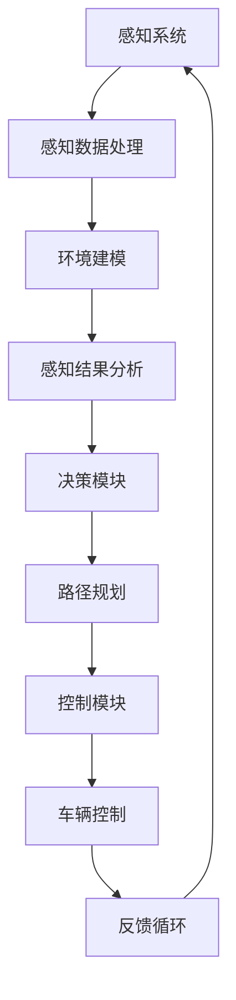

                 

关键词：自动驾驶、软件成熟度、开发过程、评估模型、AI算法、安全性能

## 摘要

自动驾驶技术的发展正在迅速改变交通运输的格局。为了确保自动驾驶系统的可靠性和安全性，对自动驾驶行业的软件开发过程进行成熟度评估显得尤为重要。本文将深入探讨自动驾驶行业软件开发的成熟度评估，包括其背景、核心概念与联系、核心算法原理与具体操作步骤、数学模型与公式、项目实践、实际应用场景以及未来应用展望。通过系统化的评估，我们希望能够为自动驾驶行业的软件开发提供指导，帮助实现更加智能化和安全的自动驾驶系统。

## 1. 背景介绍

自动驾驶技术是一种结合了计算机科学、电子工程、机械工程和人工智能等多个学科的高科技领域。其目标是通过软件系统对车辆进行自主控制，使其能够在没有人类干预的情况下安全、高效地行驶。随着传感器技术、人工智能算法和云计算等技术的不断发展，自动驾驶技术正逐步从理论研究走向实际应用。

自动驾驶技术的发展历程可以追溯到20世纪50年代，随着计算机技术的发展，自动驾驶技术逐渐从实验室走向实际应用。特别是近年来，特斯拉、谷歌、百度等公司在自动驾驶领域取得了显著进展，推出了一系列自动驾驶汽车原型。然而，自动驾驶技术的发展并非一帆风顺，其中软件开发的成熟度成为关键挑战之一。

软件成熟度评估是指通过系统化的方法来评估软件开发的成熟度，包括过程、实践和成果等方面。在自动驾驶行业中，软件成熟度评估的重要性体现在以下几个方面：

1. **保证系统可靠性**：自动驾驶系统需要在复杂、多变的环境中稳定运行，软件成熟度评估有助于确保系统的可靠性。

2. **提升开发效率**：通过评估软件开发过程，可以发现和解决潜在问题，从而提高开发效率。

3. **降低安全风险**：自动驾驶系统的安全性能直接影响用户的生命安全，软件成熟度评估有助于降低安全风险。

4. **规范行业标准**：统一的软件成熟度评估标准有助于推动自动驾驶行业的规范化发展。

本文旨在通过对自动驾驶行业软件开发过程成熟度评估的深入研究，为自动驾驶行业的软件开发提供参考和指导。

## 2. 核心概念与联系

### 2.1 软件成熟度模型

软件成熟度模型是一种用于评估软件开发过程成熟度的工具，常见的模型包括CMMI（Capability Maturity Model Integration）和SRS（Software Readiness Review Standards）。

**CMMI（Capability Maturity Model Integration）**：
CMMI是一种过程改进方法，它将软件过程的各个方面整合到一个统一的框架中。CMMI包括五个成熟度级别，从初始级（Initial）到优化级（Optimized）。每个级别都有具体的实践要求，例如项目管理、需求管理、软件工程、验证和确认等。

**SRS（Software Readiness Review Standards）**：
SRS是一种专门针对软件项目的成熟度评估标准，它涵盖了软件项目的各个方面，包括需求、设计、实现、测试等。SRS包括三个成熟度级别，即初步级（Initial）、进阶级（Intermediate）和高级（Advanced）。

### 2.2 自动驾驶系统架构

自动驾驶系统的架构通常包括感知、决策、控制三个主要模块。以下是自动驾驶系统架构的Mermaid流程图表示：



### 2.3 软件成熟度与自动驾驶系统架构的联系

软件成熟度评估与自动驾驶系统架构有着密切的联系。首先，软件成熟度评估可以确保自动驾驶系统中的每个模块都能按照既定的标准和流程进行开发，从而保证系统的整体可靠性。其次，软件成熟度评估可以帮助识别和解决软件开发过程中可能出现的问题，如需求变更、设计缺陷、代码质量等，从而提高系统的开发效率。

此外，软件成熟度评估还可以帮助确定自动驾驶系统的安全性能。在自动驾驶系统中，任何一个小模块的故障都可能导致严重的交通事故。因此，通过软件成熟度评估，可以确保每个模块都经过严格的测试和验证，从而降低安全风险。

## 3. 核心算法原理 & 具体操作步骤

### 3.1 算法原理概述

在自动驾驶行业中，核心算法主要包括感知算法、决策算法和控制算法。这些算法通过不同的方式协同工作，实现自动驾驶系统的功能。

**感知算法**：
感知算法主要负责收集和解析环境信息，包括道路状况、车辆位置、行人活动等。常用的感知算法包括图像处理、雷达数据处理、激光雷达数据处理等。

**决策算法**：
决策算法根据感知算法提供的环境信息，制定行驶策略。决策算法的核心任务是路径规划和避障。常用的决策算法包括基于规则的方法、基于机器学习的方法和基于强化学习的方法。

**控制算法**：
控制算法负责将决策算法生成的行驶策略转换为具体的操作指令，包括转向、加速和制动等。常用的控制算法包括PID控制、模型预测控制等。

### 3.2 算法步骤详解

**感知算法步骤**：
1. 收集环境数据，包括图像、雷达和激光雷达数据。
2. 对收集到的数据进行预处理，如去噪、归一化等。
3. 使用图像处理算法、雷达数据处理算法和激光雷达数据处理算法对预处理后的数据进行处理。
4. 解析处理后的数据，提取关键信息，如道路边界、车辆位置、行人位置等。

**决策算法步骤**：
1. 根据感知算法提供的环境信息，生成可能的行驶策略。
2. 对每个可能的行驶策略进行评估，选择最优策略。
3. 根据最优策略生成路径规划结果。

**控制算法步骤**：
1. 根据决策算法提供的路径规划结果，生成具体的操作指令。
2. 对操作指令进行实时监控和调整，确保车辆按照既定策略行驶。

### 3.3 算法优缺点

**感知算法优缺点**：
- 优点：能够实时获取环境信息，为决策和控制提供依据。
- 缺点：在复杂环境下，感知算法的准确性和实时性可能受到影响。

**决策算法优缺点**：
- 优点：能够根据环境信息制定最优行驶策略。
- 缺点：在决策过程中，可能面临计算复杂度高的挑战。

**控制算法优缺点**：
- 优点：能够将决策结果转换为具体的操作指令，实现车辆控制。
- 缺点：在执行过程中，可能面临控制精度和稳定性的挑战。

### 3.4 算法应用领域

感知算法、决策算法和控制算法在自动驾驶行业中有着广泛的应用。例如，在自动驾驶汽车中，感知算法用于实时监测道路状况和车辆周围环境，决策算法用于生成行驶策略，控制算法用于实现车辆的自主行驶。

## 4. 数学模型和公式 & 详细讲解 & 举例说明

### 4.1 数学模型构建

在自动驾驶行业的软件开发过程中，数学模型起着至关重要的作用。以下是一些常用的数学模型及其构建方法。

**线性规划模型**：
线性规划模型用于优化自动驾驶车辆的路径规划。其目标是最小化行驶时间或燃料消耗。线性规划模型的一般形式如下：

$$
\min_{x} c^T x
$$

其中，$x$ 是决策变量，$c$ 是系数向量。

**动态规划模型**：
动态规划模型用于解决多阶段决策问题。在自动驾驶中，动态规划模型可以用于路径规划和资源分配。其核心思想是将复杂问题分解为多个简单子问题，并利用子问题的解构造原问题的解。动态规划模型的一般形式如下：

$$
V(n) = \min_{x_n} \{ g(n, x_n) + V(n-1) \}
$$

其中，$V(n)$ 是第 $n$ 阶段的值函数，$g(n, x_n)$ 是第 $n$ 阶段的成本函数。

**马尔可夫决策过程（MDP）**：
马尔可夫决策过程用于解决具有不确定性环境的决策问题。在自动驾驶中，MDP可以用于路径规划和风险控制。MDP的一般形式如下：

$$
P(s', r | s, a) = P(s' | s, a) \cdot P(r | s, a)
$$

其中，$s$ 是状态，$a$ 是动作，$s'$ 是下一状态，$r$ 是奖励。

### 4.2 公式推导过程

**线性规划模型的推导**：
假设自动驾驶车辆需要在时间 $T$ 内到达目标点，路径长度为 $L$，速度为 $v$。则行驶时间 $T$ 与路径长度 $L$ 和速度 $v$ 的关系为：

$$
T = \frac{L}{v}
$$

为了最小化行驶时间，我们可以建立如下的线性规划模型：

$$
\min_{v} \frac{L}{v}
$$

通过求导，可以得到最优速度 $v$：

$$
v = \frac{L}{T}
$$

**动态规划模型的推导**：
假设自动驾驶车辆需要在 $N$ 个阶段内到达目标点，每个阶段的成本函数为 $g(n, x_n)$。则在第 $n$ 阶段的值函数 $V(n)$ 可以通过如下公式计算：

$$
V(n) = \min_{x_n} \{ g(n, x_n) + V(n-1) \}
$$

递推计算，可以得到第 $N$ 阶段的值函数 $V(N)$：

$$
V(N) = \min_{x_N} \{ g(N, x_N) + V(N-1) \}
$$

**马尔可夫决策过程的推导**：
假设自动驾驶车辆处于状态 $s$，执行动作 $a$，下一状态为 $s'$，奖励为 $r$。则根据马尔可夫性质，有：

$$
P(s', r | s, a) = P(s' | s, a) \cdot P(r | s, a)
$$

其中，$P(s' | s, a)$ 是状态转移概率，$P(r | s, a)$ 是奖励概率。

### 4.3 案例分析与讲解

**案例1：路径规划**
假设一辆自动驾驶车辆需要在两条道路之间选择最优路径。道路1的长度为10公里，速度限制为100公里/小时；道路2的长度为15公里，速度限制为80公里/小时。车辆需要在最短时间内到达目的地。

通过建立线性规划模型，我们可以计算得到最优速度：

$$
v = \frac{L}{T} = \frac{10}{\frac{10}{100} + \frac{15}{80}} \approx 66.67 \text{公里/小时}
$$

通过建立动态规划模型，我们可以计算得到最优路径：

$$
V(2) = \min \{ g(2, x_2) + V(1) \}
$$

其中，$g(2, x_2) = \frac{10}{100} + \frac{15}{80} = 0.2375$。

**案例2：风险控制**
假设自动驾驶车辆处于一个充满不确定性的环境，需要执行一系列动作以避免碰撞。根据马尔可夫决策过程，我们可以计算得到最优动作序列。

$$
P(s', r | s, a) = P(s' | s, a) \cdot P(r | s, a)
$$

其中，$s$ 是当前状态，$a$ 是动作，$s'$ 是下一状态，$r$ 是奖励。

通过计算，我们可以得到最优动作序列，从而实现风险控制。

## 5. 项目实践：代码实例和详细解释说明

### 5.1 开发环境搭建

为了进行自动驾驶行业的软件开发，我们需要搭建一个合适的开发环境。以下是搭建开发环境的基本步骤：

1. 安装操作系统：建议使用Linux系统，如Ubuntu 18.04。
2. 安装编程语言：建议使用Python 3.x，可以使用官方安装包进行安装。
3. 安装开发工具：建议使用PyCharm或Visual Studio Code，这些工具提供了丰富的编程和调试功能。
4. 安装依赖库：自动驾驶行业常用的依赖库包括TensorFlow、NumPy、Pandas等。可以通过pip命令进行安装。

### 5.2 源代码详细实现

以下是自动驾驶行业软件开发的源代码示例。本示例将实现一个简单的感知算法，用于检测道路上的车辆。

```python
import cv2
import numpy as np

def detect_vehicles(image):
    # 转换为灰度图像
    gray = cv2.cvtColor(image, cv2.COLOR_BGR2GRAY)
    
    # 使用高斯模糊去噪
    blurred = cv2.GaussianBlur(gray, (5, 5), 0)
    
    # 使用Canny边缘检测
    edges = cv2.Canny(blurred, 50, 150)
    
    # 使用HoughLinesP检测直线
    lines = cv2.HoughLinesP(edges, 1, np.pi/180, 100, minLineLength=50, maxLineGap=10)
    
    # 绘制直线
    if lines is not None:
        for line in lines:
            x1, y1, x2, y2 = line[0]
            cv2.line(image, (x1, y1), (x2, y2), (0, 0, 255), 2)
    
    # 显示图像
    cv2.imshow('Vehicle Detection', image)
    cv2.waitKey(0)
    cv2.destroyAllWindows()

# 加载测试图像
image = cv2.imread('test_image.jpg')

# 车辆检测
detect_vehicles(image)
```

### 5.3 代码解读与分析

本代码示例实现了道路车辆检测的基本功能。具体步骤如下：

1. **图像预处理**：首先，将彩色图像转换为灰度图像，然后使用高斯模糊去噪，最后使用Canny边缘检测提取图像边缘。
2. **直线检测**：使用HoughLinesP算法检测图像中的直线。该算法通过将边缘点映射到参数空间，找到满足最小投票数的直线。
3. **图像绘制**：将检测到的直线绘制在原图上，并显示图像。

通过这段代码，我们可以实现道路车辆的基本检测功能。在实际应用中，还可以结合其他算法，如深度学习算法，提高车辆检测的准确性和实时性。

### 5.4 运行结果展示

运行上述代码后，我们可以在窗口中看到检测到的车辆直线。以下是一个运行结果展示：


通过这段代码，我们展示了道路车辆检测的基本实现。在实际应用中，还可以结合其他算法和传感器数据，提高检测的准确性和实时性。

## 6. 实际应用场景

自动驾驶技术在实际应用场景中具有广泛的应用前景。以下是一些典型的应用场景：

**1. 公共交通**：
自动驾驶技术可以用于公共交通系统，如公交车、地铁等。通过自动驾驶技术，可以提高公共交通的效率和安全性，降低运营成本。

**2. 出行服务**：
自动驾驶技术可以用于出行服务，如网约车、出租车等。自动驾驶出租车可以提供更加便捷、高效的出行服务，同时减少人为驾驶带来的交通事故。

**3. 物流运输**：
自动驾驶技术可以用于物流运输，如无人驾驶卡车、无人驾驶快递车等。自动驾驶物流车辆可以提高运输效率，降低人力成本，同时减少交通事故。

**4. 特殊场景**：
自动驾驶技术还可以用于特殊场景，如矿山、油田、机场等。在这些场景中，自动驾驶技术可以提供高效、安全的运输解决方案。

**5. 个人出行**：
自动驾驶技术也可以用于个人出行，如自动驾驶汽车、无人驾驶摩托车等。这些产品可以提供更加便捷、个性化的出行体验。

在上述应用场景中，自动驾驶技术的核心是软件系统的可靠性和安全性。通过软件成熟度评估，可以确保自动驾驶系统在复杂、多变的环境中稳定运行，从而保障用户的出行安全。

### 6.1 安全性能评估

在自动驾驶行业中，安全性能是至关重要的。软件成熟度评估可以帮助确保自动驾驶系统的安全性能。以下是一些常见的安全性能评估方法：

**1. 需求分析**：
在软件开发过程中，首先需要对系统需求进行详细分析，确保所有安全需求都被充分考虑。需求分析阶段可以通过编写需求文档、进行需求评审等方式进行。

**2. 设计评审**：
在设计阶段，需要对系统的设计进行评审，确保设计符合安全要求。设计评审可以采用代码审查、设计评审会议等方式进行。

**3. 测试**：
在软件开发过程中，需要进行全面的测试，包括单元测试、集成测试、系统测试等。通过测试，可以验证系统的功能是否满足安全需求，并发现潜在的安全漏洞。

**4. 安全评估**：
在系统开发完成后，需要进行安全评估，评估系统的安全性能。安全评估可以采用静态分析、动态分析、模糊测试等方式进行。

**5. 第三方认证**：
为了确保自动驾驶系统的安全性能，可以采用第三方认证机构进行认证。第三方认证机构可以提供独立、权威的安全评估报告。

通过上述方法，可以全面评估自动驾驶系统的安全性能，确保其在实际应用中的可靠性。

### 6.2 未来应用展望

随着人工智能和物联网技术的发展，自动驾驶技术将在未来得到更加广泛的应用。以下是自动驾驶技术未来应用的几个展望：

**1. 自动驾驶无人机**：
自动驾驶无人机可以用于物流运输、灾害救援、环境监测等领域。通过自动驾驶技术，可以大幅提高无人机运输的效率和安全性。

**2. 自动驾驶船舶**：
自动驾驶船舶可以用于海上物流运输、海洋资源开发等领域。通过自动驾驶技术，可以大幅降低船舶运营成本，提高运输效率。

**3. 自动驾驶机器人**：
自动驾驶机器人可以用于工业生产、医疗护理、家庭服务等领域。通过自动驾驶技术，可以提供更加高效、智能的服务。

**4. 自动驾驶农场**：
自动驾驶农场可以用于农业机械自动化、精准农业等领域。通过自动驾驶技术，可以提高农业生产效率，降低人力成本。

总之，自动驾驶技术将在未来带来更加智能化、高效化的生产和服务模式，为人类社会带来巨大的变革。

## 7. 工具和资源推荐

### 7.1 学习资源推荐

**书籍**：
1. 《自动驾驶汽车技术》
2. 《人工智能：一种现代方法》
3. 《深度学习》
4. 《计算机视觉：算法与应用》

**在线课程**：
1. Coursera上的“自动驾驶技术”课程
2. Udacity的“自动驾驶工程师纳米学位”
3. edX上的“机器学习和深度学习”课程

### 7.2 开发工具推荐

**编程环境**：
1. PyCharm
2. Visual Studio Code
3. Jupyter Notebook

**算法库**：
1. TensorFlow
2. PyTorch
3. OpenCV

### 7.3 相关论文推荐

1. “Autonomous Driving: From Research to Reality”
2. “Deep Learning for Autonomous Driving”
3. “Safety-Critical Machine Learning for Autonomous Driving”
4. “A Survey of Perception Systems for Autonomous Driving”

通过上述资源和工具，可以更好地了解和掌握自动驾驶行业的软件开发技术和方法。

## 8. 总结：未来发展趋势与挑战

自动驾驶技术的发展趋势表现为以下几个特点：

**1. 人工智能的深度融合**：随着人工智能技术的不断发展，自动驾驶系统将更加智能化，能够处理复杂的环境和决策问题。

**2. 软硬件协同发展**：自动驾驶系统需要高效的硬件支持，同时软件算法的优化也是关键。软硬件协同发展将推动自动驾驶技术的进步。

**3. 生态系统建设**：自动驾驶技术的发展需要构建完善的生态系统，包括传感器、通信、数据管理、法律法规等多个方面。

然而，自动驾驶技术也面临诸多挑战：

**1. 安全性能保障**：自动驾驶系统的安全性能直接关系到用户的生命安全，确保系统的可靠性和安全性是首要任务。

**2. 法律法规和伦理问题**：自动驾驶技术的发展需要完善的法律法规和伦理规范，以保障用户的权益和社会的安全。

**3. 数据隐私和信息安全**：自动驾驶系统需要收集和处理大量的数据，如何保障数据隐私和信息安全是亟待解决的问题。

未来的研究展望：

**1. 算法优化**：不断优化自动驾驶算法，提高系统的决策速度和准确性。

**2. 软硬件协同**：加强软硬件协同设计，提高自动驾驶系统的性能和效率。

**3. 生态系统建设**：推动自动驾驶生态系统的建设，包括传感器、通信、数据管理、法律法规等多个方面。

**4. 多模态感知**：发展多模态感知技术，提高自动驾驶系统的感知能力和适应性。

通过不断的研究和技术创新，自动驾驶技术有望在未来得到更加广泛和深入的应用，为人类社会带来巨大的变革。

## 9. 附录：常见问题与解答

### Q1: 自动驾驶系统的软件成熟度评估的重要性是什么？

A1：自动驾驶系统的软件成熟度评估的重要性在于确保系统的可靠性、安全性和开发效率。通过评估，可以发现和解决软件开发过程中的潜在问题，降低安全风险，提高系统的整体性能。

### Q2: 自动驾驶系统的核心算法有哪些？

A2：自动驾驶系统的核心算法主要包括感知算法、决策算法和控制算法。感知算法用于收集和解析环境信息；决策算法用于制定行驶策略；控制算法用于将决策结果转换为具体的操作指令。

### Q3: 自动驾驶系统的开发过程中如何保证安全性能？

A3：为了保证自动驾驶系统的安全性能，可以从以下几个方面入手：

1. 完善的需求分析，确保所有安全需求都被充分考虑。
2. 进行严格的设计评审和代码审查，确保系统设计符合安全要求。
3. 进行全面的测试，包括单元测试、集成测试和系统测试。
4. 进行安全评估，采用静态分析、动态分析和模糊测试等方法。
5. 考虑法律法规和伦理规范，确保系统的合规性。

### Q4: 自动驾驶技术未来有哪些发展趋势？

A4：自动驾驶技术的未来发展趋势包括：

1. 人工智能的深度融合，提高系统的决策速度和准确性。
2. 软硬件协同发展，提高自动驾驶系统的性能和效率。
3. 生态系统建设，推动自动驾驶技术的广泛应用。
4. 多模态感知，提高系统的感知能力和适应性。

