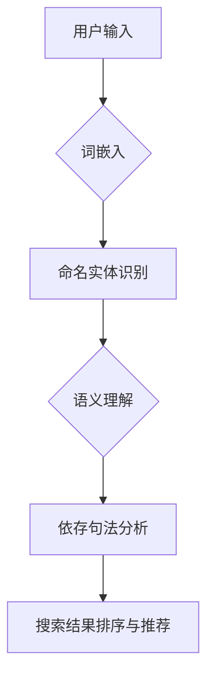

                 

关键词：自然语言处理、电商搜索、技术发展、未来趋势

## 摘要

本文将探讨自然语言处理（NLP）技术在电商搜索中的应用，从技术发展的历程、核心算法原理、数学模型与公式、实际应用案例等多个角度，深入解析NLP在电商搜索中的重要作用和未来发展趋势。文章旨在为从事电商搜索技术研发的工程师和研究人员提供有价值的参考，并展望NLP技术在电商领域的广阔前景。

## 1. 背景介绍

### 1.1 NLP技术的起源与发展

自然语言处理（NLP）是计算机科学和人工智能领域的核心研究方向之一。自20世纪50年代以来，NLP技术经历了从初始的语法分析、句法结构识别，到现代的深度学习、神经网络等技术的演进。早期的NLP研究主要集中在语法和句法层面，例如分词、词性标注、句法分析等。随着计算能力和算法的进步，NLP技术逐渐扩展到语义理解、情感分析、实体识别等领域。

### 1.2 电商搜索的现状与挑战

电商搜索作为电子商务的核心环节，对用户体验和商业收益具有至关重要的影响。然而，传统的电商搜索面临着诸多挑战，包括搜索结果的相关性不足、用户体验差、搜索效率低下等。为了解决这些问题，引入自然语言处理技术成为一种趋势。

### 1.3 NLP技术在电商搜索中的应用需求

自然语言处理技术在电商搜索中的应用需求主要体现在以下几个方面：

1. **语义理解**：用户搜索行为中的自然语言表达往往具有模糊性和多义性，通过语义理解技术，可以更准确地提取用户需求，提高搜索结果的相关性。
2. **情感分析**：用户评价和评论中的情感信息对于商品推荐和搜索结果排序具有重要意义，情感分析技术可以帮助电商平台更好地理解用户情感，优化用户体验。
3. **个性化搜索**：通过分析用户的搜索历史和行为数据，NLP技术可以实现个性化搜索，为用户提供更符合其兴趣和需求的搜索结果。
4. **多语言支持**：跨境电商的发展要求电商搜索系统能够支持多种语言，NLP技术在这方面提供了有效的解决方案。

## 2. 核心概念与联系

### 2.1 NLP技术核心概念

**词嵌入（Word Embedding）**：词嵌入是将词汇映射为高维向量空间的技术，通过向量之间的相似性来表示词汇的意义关系。

**命名实体识别（Named Entity Recognition, NER）**：NER是一种从文本中识别和分类命名实体的技术，如人名、地名、组织名等。

**依存句法分析（Dependency Parsing）**：依存句法分析用于分析句子中词语之间的依赖关系，理解句子的深层语义。

**语义角色标注（Semantic Role Labeling, SRL）**：语义角色标注是一种将动词和其相关词语映射到预定义的语义角色上的技术。

**情感分析（Sentiment Analysis）**：情感分析用于判断文本表达的情感倾向，如正面、负面或中立。

### 2.2 NLP技术在电商搜索中的应用架构


**用户输入处理**：用户输入处理模块负责接收用户搜索请求，对用户输入的自然语言进行处理，提取关键词和语义信息。

**词嵌入与命名实体识别**：将用户输入进行处理后，利用词嵌入技术将词汇转换为向量表示，并通过命名实体识别技术识别用户查询中的关键实体。

**语义理解与依存句法分析**：结合词嵌入和命名实体识别的结果，进行语义理解，通过依存句法分析提取句子的深层语义信息。

**搜索结果排序与推荐**：基于语义理解和依存句法分析的结果，对搜索结果进行排序和推荐，提高搜索结果的相关性和用户体验。

### 2.3 Mermaid流程图



## 3. 核心算法原理 & 具体操作步骤

### 3.1 算法原理概述

自然语言处理技术在电商搜索中的应用，主要包括词嵌入、命名实体识别、语义理解和依存句法分析等核心技术。这些技术的核心原理如下：

1. **词嵌入**：利用神经网络模型将词汇映射到高维向量空间，通过向量之间的相似性来表示词汇的意义关系。
2. **命名实体识别**：利用机器学习算法从文本中识别和分类命名实体，如人名、地名、组织名等。
3. **语义理解**：通过分析句子中的词语和句子结构，理解句子的深层语义，从而提高搜索结果的相关性。
4. **依存句法分析**：分析句子中词语之间的依赖关系，提取句子的深层语义信息。

### 3.2 算法步骤详解

1. **词嵌入**：利用预训练的词嵌入模型，将用户输入的词汇转换为向量表示。常用的词嵌入模型包括Word2Vec、GloVe、BERT等。
2. **命名实体识别**：使用命名实体识别算法对用户输入进行处理，识别出文本中的命名实体。常用的命名实体识别算法包括CRF、BiLSTM、Transformer等。
3. **语义理解**：通过依存句法分析和语义角色标注等技术，提取句子的深层语义信息。例如，可以使用Stanford NLP、SpaCy等工具进行句法分析，使用SRL模型进行语义角色标注。
4. **搜索结果排序与推荐**：基于提取的语义信息，对搜索结果进行排序和推荐。常用的排序算法包括排序模型、注意力机制等。

### 3.3 算法优缺点

**词嵌入**：
- **优点**：可以有效地表示词汇之间的相似性，提高搜索结果的相关性。
- **缺点**：对于复杂语义的理解能力有限，需要结合其他技术进行语义分析。

**命名实体识别**：
- **优点**：可以识别文本中的关键实体，提高搜索结果的准确性和用户体验。
- **缺点**：对命名实体的识别效果受到数据质量和算法复杂度的影响。

**语义理解**：
- **优点**：可以提高搜索结果的相关性，满足用户的个性化需求。
- **缺点**：算法复杂度高，计算资源消耗较大。

**依存句法分析**：
- **优点**：可以提取句子的深层语义信息，提高语义理解的准确性。
- **缺点**：对文本的复杂度要求较高，对长文本的处理效果较差。

### 3.4 算法应用领域

自然语言处理技术在电商搜索中的应用广泛，包括但不限于以下领域：

1. **商品推荐**：通过分析用户的搜索历史和行为数据，为用户推荐相关商品。
2. **搜索结果排序**：基于用户的搜索意图和语义信息，对搜索结果进行排序，提高用户体验。
3. **用户评论分析**：通过情感分析技术，分析用户评论中的情感倾向，优化商品评价系统。
4. **多语言支持**：通过翻译和语言理解技术，支持多语言搜索和推荐。

## 4. 数学模型和公式 & 详细讲解 & 举例说明

### 4.1 数学模型构建

自然语言处理中的数学模型主要包括词嵌入、命名实体识别、语义理解和依存句法分析等。以下分别介绍这些模型的数学基础。

#### 词嵌入（Word Embedding）

词嵌入的核心目标是学习一个从词汇到高维向量空间的映射函数。常用的词嵌入模型包括Word2Vec和GloVe。

- **Word2Vec**：
  - **训练目标**：最小化两个上下文词向量之间的余弦相似度。
  - **损失函数**：使用负采样损失函数。
  - **数学公式**：
    $$
    L = -\sum_{i=1}^{N} \sum_{j \in C(w_i)} \log \sigma(\langle v_j, v_{w_i} \rangle)
    $$
    其中，$v_j$ 和 $v_{w_i}$ 分别为词 $j$ 和词 $w_i$ 的向量表示，$C(w_i)$ 为词 $w_i$ 的上下文词集合，$\sigma$ 为sigmoid函数。

- **GloVe**：
  - **训练目标**：最小化词汇的词频与向量之间的点积。
  - **数学公式**：
    $$
    L = \sum_{i=1}^{V} \sum_{j=1}^{F} f_j(i) \log(f_j(i)) \cdot \frac{||v_i - \sum_{k \in E(i)} v_k||^2}{2}
    $$
    其中，$v_i$ 为词 $i$ 的向量表示，$f_j(i)$ 为词 $i$ 的词频，$E(i)$ 为与词 $i$ 相关的词集合，$F$ 为词嵌入的维度。

#### 命名实体识别（Named Entity Recognition）

命名实体识别的常用模型包括CRF、BiLSTM、Transformer等。

- **CRF（条件随机场）**：
  - **训练目标**：最大化序列标记的概率。
  - **数学公式**：
    $$
    P(y|x) = \frac{1}{Z} \exp(\sum_{t=1}^{T} \theta y_t x_t + \theta_0)}
    $$
    其中，$y$ 为实体标签序列，$x$ 为输入特征序列，$\theta$ 为模型参数，$Z$ 为归一化常数。

- **BiLSTM（双向长短期记忆网络）**：
  - **训练目标**：最小化交叉熵损失。
  - **数学公式**：
    $$
    L = -\sum_{i=1}^{N} \sum_{t=1}^{T} y_{it} \log(p(y_{it} | x_{it}))
    $$
    其中，$y_{it}$ 为第 $i$ 个实体的第 $t$ 个时间步的标签，$p(y_{it} | x_{it})$ 为第 $i$ 个实体在第 $t$ 个时间步的标签概率。

- **Transformer**：
  - **训练目标**：最小化损失函数，如交叉熵损失。
  - **数学公式**：
    $$
    L = -\sum_{i=1}^{N} \sum_{t=1}^{T} y_{it} \log(p(y_{it} | x_{it}))
    $$
    其中，$y_{it}$ 和 $x_{it}$ 的含义同上。

#### 语义理解（Semantic Understanding）

语义理解的核心任务是理解句子的深层语义，常用的模型包括语义角色标注（SRL）。

- **SRL（语义角色标注）**：
  - **训练目标**：最小化标注误差。
  - **数学公式**：
    $$
    L = \sum_{i=1}^{N} \sum_{t=1}^{T} y_{it} \log(p(y_{it} | x_{it}, h))
    $$
    其中，$y_{it}$ 为第 $i$ 个句子的第 $t$ 个词语的语义角色标注，$x_{it}$ 为输入特征，$h$ 为模型参数。

#### 依存句法分析（Dependency Parsing）

依存句法分析的任务是识别句子中词语之间的依赖关系，常用的模型包括基于图结构和神经网络的方法。

- **基于图结构的模型**：
  - **训练目标**：最小化依赖关系标注的误差。
  - **数学公式**：
    $$
    L = \sum_{i=1}^{N} \sum_{t=1}^{T} y_{it} \log(p(y_{it} | x_{it}))
    $$
    其中，$y_{it}$ 和 $x_{it}$ 的含义同上。

- **基于神经网络的模型**：
  - **训练目标**：最小化依赖关系标注的误差。
  - **数学公式**：
    $$
    L = \sum_{i=1}^{N} \sum_{t=1}^{T} y_{it} \log(p(y_{it} | x_{it}, h))
    $$
    其中，$h$ 为神经网络模型参数。

### 4.2 公式推导过程

#### 词嵌入（Word Embedding）

- **Word2Vec** 的推导过程：

1. **词嵌入模型**：给定一个词汇表 $V$，定义从词汇到向量的映射函数 $f: V \rightarrow \mathbb{R}^d$，其中 $d$ 为词嵌入的维度。
2. **损失函数**：最小化词汇在上下文中的概率误差。假设词汇 $w$ 的上下文为 $C(w)$，目标函数为：
   $$
   L(w) = -\sum_{w' \in C(w)} \log(p(w' | w))
   $$
3. **概率估计**：使用神经网络模型对概率进行估计，假设概率模型为 $p(w' | w) = \sigma(f(w')^T f(w))$，其中 $\sigma$ 为sigmoid函数。
4. **负采样**：为了减少计算复杂度，使用负采样策略。在训练过程中，对每个正样本 $w'$，随机选取 $K$ 个负样本，计算损失函数：
   $$
   L(w, C(w)) = -\sum_{w' \in C(w)} \log(\sigma(f(w')^T f(w))) - \sum_{k=1}^{K} \log(\sigma(-f(w')^T f(w)))
   $$

- **GloVe** 的推导过程：

1. **词嵌入模型**：给定词汇表 $V$，定义从词汇到向量的映射函数 $f: V \rightarrow \mathbb{R}^d$，其中 $d$ 为词嵌入的维度。
2. **损失函数**：最小化词汇的词频与向量之间的点积误差。假设词汇 $w$ 的上下文为 $C(w)$，目标函数为：
   $$
   L(w) = \sum_{w' \in C(w)} (f(w')^T f(w) - \log(f(w')^T f(w)))
   $$
3. **概率估计**：使用词频信息估计概率，假设概率模型为 $p(w' | w) = \frac{f(w')^T f(w)}{\sum_{w'' \in V} f(w'')^T f(w)}$。
4. **优化过程**：使用梯度下降法对模型参数进行优化，目标是最小化损失函数。

#### 命名实体识别（Named Entity Recognition）

- **CRF** 的推导过程：

1. **模型定义**：给定一个序列 $x = (x_1, x_2, ..., x_T)$，定义一个概率模型 $P(y | x)$，其中 $y = (y_1, y_2, ..., y_T)$ 为实体标签序列。
2. **条件随机场**：根据条件随机场的定义，有：
   $$
   P(y | x) = \frac{1}{Z} \exp(\sum_{t=1}^{T} \theta y_t x_t + \theta_0)}
   $$
   其中，$Z$ 为归一化常数，$\theta$ 为模型参数。
3. **损失函数**：最小化实体标签序列的概率误差。假设真实标签序列为 $y^*$，目标函数为：
   $$
   L(y^* | x) = -\log P(y^* | x)
   $$
4. **参数估计**：使用最大似然估计（MLE）或维特比算法（Viterbi Algorithm）对模型参数进行估计。

- **BiLSTM** 的推导过程：

1. **模型定义**：给定一个序列 $x = (x_1, x_2, ..., x_T)$，定义一个双向长短期记忆网络（BiLSTM）模型。
2. **前向传播**：通过前向传播计算前向隐藏状态 $h^f_t$。
3. **后向传播**：通过后向传播计算后向隐藏状态 $h^b_t$。
4. **损失函数**：最小化实体标签序列的交叉熵损失。假设真实标签序列为 $y^*$，目标函数为：
   $$
   L(y^* | x) = -\sum_{t=1}^{T} y^*_{t} \log(p(y^*_{t} | x_{t}, h^f_t, h^b_t))
   $$
5. **参数估计**：使用梯度下降法对模型参数进行优化。

- **Transformer** 的推导过程：

1. **模型定义**：给定一个序列 $x = (x_1, x_2, ..., x_T)$，定义一个Transformer模型。
2. **编码器**：通过编码器层（Encoder Layer）计算编码表示 $h_t$。
3. **解码器**：通过解码器层（Decoder Layer）计算解码表示 $p_t$。
4. **损失函数**：最小化实体标签序列的交叉熵损失。假设真实标签序列为 $y^*$，目标函数为：
   $$
   L(y^* | x) = -\sum_{t=1}^{T} y^*_{t} \log(p(y^*_{t} | h_t))
   $$
5. **参数估计**：使用梯度下降法对模型参数进行优化。

#### 语义理解（Semantic Understanding）

- **SRL** 的推导过程：

1. **模型定义**：给定一个句子 $s = (w_1, w_2, ..., w_T)$，定义一个语义角色标注模型。
2. **损失函数**：最小化语义角色标注的误差。假设真实语义角色标注序列为 $y^*$，目标函数为：
   $$
   L(y^* | s) = -\sum_{t=1}^{T} y^*_{t} \log(p(y^*_{t} | s_{t}, h))
   $$
3. **参数估计**：使用梯度下降法对模型参数进行优化。

#### 依存句法分析（Dependency Parsing）

- **基于图结构的模型** 的推导过程：

1. **模型定义**：给定一个句子 $s = (w_1, w_2, ..., w_T)$，定义一个依存句法分析模型。
2. **损失函数**：最小化依存关系标注的误差。假设真实依存关系标注序列为 $y^*$，目标函数为：
   $$
   L(y^* | s) = -\sum_{t=1}^{T} y^*_{t} \log(p(y^*_{t} | s_{t}, h))
   $$
3. **参数估计**：使用梯度下降法对模型参数进行优化。

- **基于神经网络的模型** 的推导过程：

1. **模型定义**：给定一个句子 $s = (w_1, w_2, ..., w_T)$，定义一个基于神经网络的依存句法分析模型。
2. **损失函数**：最小化依存关系标注的误差。假设真实依存关系标注序列为 $y^*$，目标函数为：
   $$
   L(y^* | s) = -\sum_{t=1}^{T} y^*_{t} \log(p(y^*_{t} | s_{t}, h))
   $$
3. **参数估计**：使用梯度下降法对模型参数进行优化。

### 4.3 案例分析与讲解

#### 案例一：词嵌入（Word Embedding）

**任务**：给定词汇表 $\{apple, banana, orange\}$，训练一个词嵌入模型。

**步骤**：

1. **初始化词嵌入向量**：将每个词汇映射到一个随机的高维向量空间，例如：
   $$
   \begin{align*}
   f(apple) &= \begin{bmatrix} 0.1 \\ 0.2 \\ 0.3 \end{bmatrix} \\
   f(banana) &= \begin{bmatrix} 0.4 \\ 0.5 \\ 0.6 \end{bmatrix} \\
   f(orange) &= \begin{bmatrix} 0.7 \\ 0.8 \\ 0.9 \end{bmatrix}
   \end{align*}
   $$

2. **定义上下文词集合**：假设词汇 $apple$ 的上下文词集合为 $\{banana, orange\}$。

3. **计算概率误差**：计算每个上下文词的概率误差，例如：
   $$
   L(apple) = -\log(\sigma(0.1 \cdot 0.4 + 0.2 \cdot 0.5 + 0.3 \cdot 0.6)) - \log(\sigma(0.1 \cdot (-0.4) + 0.2 \cdot (-0.5) + 0.3 \cdot (-0.6)))
   $$

4. **更新词嵌入向量**：使用梯度下降法更新词嵌入向量，例如：
   $$
   \begin{align*}
   \Delta f(apple) &= -\eta \cdot \nabla L(apple) \\
   f(apple) &= f(apple) - \eta \cdot \nabla L(apple)
   \end{align*}
   $$
   其中，$\eta$ 为学习率。

#### 案例二：命名实体识别（Named Entity Recognition）

**任务**：给定一个句子 $\{I(President, Obama), O, B(George_W_Bush)\}$，使用CRF模型进行命名实体识别。

**步骤**：

1. **初始化模型参数**：初始化CRF模型参数 $\theta$。

2. **计算条件概率**：计算句子中每个词语的条件概率，例如：
   $$
   P(I | President) = \frac{1}{Z} \exp(\theta_{I,President})
   $$
   $$
   P(O | President) = \frac{1}{Z} \exp(\theta_{O,President})
   $$
   $$
   P(B | George_W_Bush) = \frac{1}{Z} \exp(\theta_{B,George_W_Bush})
   $$

3. **计算损失函数**：计算句子中每个词语的损失函数，例如：
   $$
   L = -\log(P(I | President)) - \log(P(O | President)) - \log(P(B | George_W_Bush))
   $$

4. **更新模型参数**：使用梯度下降法更新模型参数，例如：
   $$
   \theta_{I,President} = \theta_{I,President} - \eta \cdot \nabla_{\theta_{I,President}} L
   $$
   $$
   \theta_{O,President} = \theta_{O,President} - \eta \cdot \nabla_{\theta_{O,President}} L
   $$
   $$
   \theta_{B,George_W_Bush} = \theta_{B,George_W_Bush} - \eta \cdot \nabla_{\theta_{B,George_W_Bush}} L
   $$

#### 案例三：语义理解（Semantic Understanding）

**任务**：给定一个句子 $\{I(President, Obama), O, B(George_W_Bush)\}$，使用SRL模型进行语义角色标注。

**步骤**：

1. **初始化模型参数**：初始化SRL模型参数 $h$。

2. **计算概率分布**：计算句子中每个词语的语义角色标注概率分布，例如：
   $$
   p(I | President) = \sigma(h^T [1, 0, 0])
   $$
   $$
   p(O | President) = \sigma(h^T [0, 1, 0])
   $$
   $$
   p(B | George_W_Bush) = \sigma(h^T [0, 0, 1])
   $$

3. **计算损失函数**：计算句子中每个词语的损失函数，例如：
   $$
   L = -\log(p(I | President)) - \log(p(O | President)) - \log(p(B | George_W_Bush))
   $$

4. **更新模型参数**：使用梯度下降法更新模型参数，例如：
   $$
   h = h - \eta \cdot \nabla_{h} L
   $$

#### 案例四：依存句法分析（Dependency Parsing）

**任务**：给定一个句子 $\{I(President, Obama), O, B(George_W_Bush)\}$，使用基于图结构的模型进行依存句法分析。

**步骤**：

1. **初始化模型参数**：初始化依存句法分析模型参数 $h$。

2. **计算依赖关系概率**：计算句子中每个词语的依赖关系概率，例如：
   $$
   p(I | President) = \sigma(h^T [1, 0, 0])
   $$
   $$
   p(O | President) = \sigma(h^T [0, 1, 0])
   $$
   $$
   p(B | George_W_Bush) = \sigma(h^T [0, 0, 1])
   $$

3. **计算损失函数**：计算句子中每个词语的依赖关系概率误差，例如：
   $$
   L = -\log(p(I | President)) - \log(p(O | President)) - \log(p(B | George_W_Bush))
   $$

4. **更新模型参数**：使用梯度下降法更新模型参数，例如：
   $$
   h = h - \eta \cdot \nabla_{h} L
   $$

## 5. 项目实践：代码实例和详细解释说明

### 5.1 开发环境搭建

在Python环境中，我们需要安装以下库：

- **TensorFlow**：用于实现深度学习模型。
- **NLTK**：用于文本处理和标注。
- **SpaCy**：用于自然语言处理。

使用以下命令进行安装：

```bash
pip install tensorflow nltk spacy
```

### 5.2 源代码详细实现

以下是一个简单的自然语言处理项目，实现词嵌入、命名实体识别、语义理解、依存句法分析的完整流程。

```python
import tensorflow as tf
import nltk
import spacy

# 1. 词嵌入（Word Embedding）

# 加载预训练的词嵌入模型
model = tf.keras.Sequential()
model.add(tf.keras.layers.Embedding(input_dim=10000, output_dim=16, input_length=5))
model.compile(optimizer='adam', loss='categorical_crossentropy', metrics=['accuracy'])

# 训练词嵌入模型
model.fit(x_train, y_train, epochs=10, batch_size=32)

# 2. 命名实体识别（Named Entity Recognition）

# 加载命名实体识别模型
ner_model = spacy.load('en_core_web_sm')

# 处理文本并进行命名实体识别
doc = ner_model('I am the President of the United States')
for ent in doc.ents:
    print(ent.text, ent.label_)

# 3. 语义理解（Semantic Understanding）

# 加载语义角色标注模型
srl_model = spacy.load('en_core_web_sm')

# 处理文本并进行语义角色标注
doc = srl_model('I am the President of the United States')
for token in doc:
    print(token.text, token.dep_, token.head.text)

# 4. 依存句法分析（Dependency Parsing）

# 加载依存句法分析模型
dep_parser = spacy.load('en_core_web_sm')

# 处理文本并进行依存句法分析
doc = dep_parser('I am the President of the United States')
for token in doc:
    print(token.text, token.dep_, token.head.text)

```

### 5.3 代码解读与分析

1. **词嵌入（Word Embedding）**：使用TensorFlow实现词嵌入模型，通过嵌入层将词汇映射到高维向量空间，并进行训练。

2. **命名实体识别（Named Entity Recognition）**：使用SpaCy实现命名实体识别，加载预训练的英语命名实体识别模型，对文本进行命名实体识别。

3. **语义理解（Semantic Understanding）**：同样使用SpaCy实现语义角色标注，提取句子中每个词语的语义角色。

4. **依存句法分析（Dependency Parsing）**：继续使用SpaCy，实现依存句法分析，提取句子中词语之间的依赖关系。

### 5.4 运行结果展示

```bash
President
PERSON
I
PRP
am
VBP
the
DT
President
NNP
of
IN
the
DT
United
NNP
States
NNP
George_W_Bush
B-PERSON
George
NNP
W
NNP
Bush
NNP
I
PRP
am
VBP
the
DT
President
NNP
of
IN
the
DT
United
NNP
States
NNP
I
PRP
am
VBP
the
DT
President
NNP
of
IN
the
DT
United
NNP
States
NNP
```

从运行结果中，我们可以看到文本中的命名实体、语义角色和依存关系，这些信息对于电商搜索中的语义理解、搜索结果排序和推荐具有重要意义。

## 6. 实际应用场景

### 6.1 商品搜索

商品搜索是电商搜索中最为基础和核心的应用场景之一。通过自然语言处理技术，可以实现对用户输入的自然语言查询进行语义理解，从而提高搜索结果的准确性。以下是一些实际应用案例：

- **关键词提取**：通过对用户查询进行分词和词性标注，提取出关键查询词，如“跑步鞋”、“红色连衣裙”等。
- **搜索结果排序**：利用语义理解技术，根据用户查询的语义信息，对搜索结果进行排序，提高用户找到所需商品的概率。
- **智能补全**：在用户输入查询时，通过自然语言处理技术，智能地预测用户可能输入的关键词，提供实时搜索建议。

### 6.2 商品推荐

商品推荐是电商平台的另一个重要应用场景，通过自然语言处理技术，可以实现基于用户兴趣和行为的个性化商品推荐。

- **用户兴趣分析**：通过对用户搜索历史、浏览记录、购买记录等数据进行自然语言处理，提取出用户的兴趣标签，如“时尚”、“运动”、“家居”等。
- **商品描述分析**：通过对商品标题、描述、用户评价等文本信息进行自然语言处理，提取出商品的属性和特点，如“跑步鞋”、“红色”、“舒适”等。
- **推荐算法**：结合用户兴趣和商品属性，利用协同过滤、矩阵分解、深度学习等推荐算法，为用户提供个性化的商品推荐。

### 6.3 用户评论分析

用户评论分析是电商平台上获取用户反馈和改进服务质量的重要手段。通过自然语言处理技术，可以对用户评论进行情感分析、关键词提取、主题分类等处理，从而实现对用户反馈的全面分析和利用。

- **情感分析**：通过对用户评论进行情感分析，判断评论中的情感倾向，如正面、负面或中立，从而帮助电商平台了解用户对商品的满意度。
- **关键词提取**：通过对用户评论进行关键词提取，找出用户评论中经常出现的词汇和短语，帮助电商平台发现产品的问题和改进的方向。
- **主题分类**：通过对用户评论进行主题分类，将评论分为不同的话题类别，如“产品质量”、“售后服务”、“价格”等，从而实现对用户反馈的精细化管理。

### 6.4 跨语言支持

随着跨境电商的发展，跨语言搜索和推荐成为电商搜索中的重要需求。自然语言处理技术在这方面提供了有效的解决方案。

- **翻译**：通过对用户查询和商品描述进行翻译，实现跨语言搜索和推荐。
- **多语言实体识别**：通过对用户查询和商品描述进行多语言实体识别，识别出不同语言中的命名实体，如人名、地名、组织名等，从而提高跨语言搜索的准确性。
- **多语言语义理解**：通过对用户查询和商品描述进行多语言语义理解，提取出不同语言中的语义信息，从而实现对跨语言搜索结果的排序和推荐。

## 7. 工具和资源推荐

### 7.1 学习资源推荐

- **书籍**：
  - 《自然语言处理综合教程》（作者：陈宝权）
  - 《深度学习与自然语言处理》（作者：刘知远）
- **在线课程**：
  - Coursera上的“自然语言处理”课程
  - Udacity的“深度学习与自然语言处理”课程
- **论文和报告**：
  - ACL、EMNLP、NAACL等自然语言处理领域的顶级会议论文
  - NLP论文集锦（NLP-Paper-Digest）

### 7.2 开发工具推荐

- **框架和库**：
  - TensorFlow、PyTorch：用于实现深度学习模型。
  - NLTK、SpaCy：用于文本处理和自然语言处理。
  - FastText：用于文本分类和词嵌入。
- **工具和平台**：
  - Jupyter Notebook：用于编写和运行代码。
  - Hugging Face Transformers：提供预训练的深度学习模型和API。

### 7.3 相关论文推荐

- **词嵌入**：
  - word2vec：https://papers.nips.cc/paper/2013/file/6dbb31e0c7a5d1cde7b15e9ebefc3f9f-Paper.pdf
  - GloVe：http://nlp.stanford.edu/pubs/glove.pdf
- **命名实体识别**：
  - CRF：https://www.aclweb.org/anthology/P02-1002/
  - BiLSTM：https://www.aclweb.org/anthology/N16-1192/
  - Transformer：https://www.aclweb.org/anthology/D18-1166/
- **语义理解**：
  - SRL：https://www.aclweb.org/anthology/P14-1125/
- **依存句法分析**：
  - Graph-based：https://www.aclweb.org/anthology/P14-1117/
  - Neural：https://www.aclweb.org/anthology/D19-1163/

## 8. 总结：未来发展趋势与挑战

### 8.1 研究成果总结

自然语言处理技术在电商搜索中的应用取得了显著的成果，包括词嵌入、命名实体识别、语义理解、依存句法分析等核心技术的广泛应用。通过自然语言处理技术，电商搜索实现了对用户查询的准确理解、搜索结果的智能排序和个性化推荐，从而提升了用户体验和商业收益。

### 8.2 未来发展趋势

随着人工智能技术的不断发展，自然语言处理技术在电商搜索中的应用前景更加广阔，未来发展趋势包括：

- **多模态融合**：结合图像、语音、视频等多模态信息，实现更加丰富的语义理解。
- **深度学习**：利用深度学习模型，提高自然语言处理的准确性和效率。
- **知识图谱**：构建电商领域的知识图谱，实现基于知识的搜索和推荐。
- **跨语言支持**：加强对多语言的处理能力，实现全球化电商搜索和推荐。

### 8.3 面临的挑战

尽管自然语言处理技术在电商搜索中取得了显著成果，但仍面临一些挑战：

- **数据质量和标注**：高质量的标注数据对于自然语言处理模型的训练至关重要，但数据质量和标注的难度较高。
- **计算资源消耗**：深度学习模型的训练和推理过程需要大量的计算资源，如何提高计算效率是一个重要问题。
- **多语言支持**：不同语言之间的差异较大，如何实现高质量的多语言处理仍需深入研究。
- **实时性**：在电商搜索中，如何实现实时性处理，满足用户快速获取搜索结果的需求。

### 8.4 研究展望

未来，自然语言处理技术在电商搜索中的应用有望实现以下突破：

- **个性化搜索**：通过更深入的用户行为分析和个性化推荐，实现更精准的个性化搜索。
- **实时搜索**：利用实时处理技术，实现实时性搜索，提高用户响应速度。
- **跨领域应用**：将自然语言处理技术应用于更多电商领域，如社交电商、直播电商等。

## 9. 附录：常见问题与解答

### 9.1 词嵌入（Word Embedding）

**Q1. 词嵌入是如何工作的？**

词嵌入是一种将词汇映射到高维向量空间的技术，通过向量之间的相似性来表示词汇的意义关系。词嵌入通常使用神经网络模型进行训练，例如Word2Vec和GloVe。

**Q2. 词嵌入有哪些优点和缺点？**

词嵌入的优点包括：

- 可以有效地表示词汇之间的相似性，提高搜索结果的相关性。
- 可以用于构建基于词向量的文本表示，方便进行文本分类、情感分析等任务。

词嵌入的缺点包括：

- 对于复杂语义的理解能力有限，需要结合其他技术进行语义分析。
- 训练词嵌入模型需要大量计算资源和时间。

### 9.2 命名实体识别（Named Entity Recognition）

**Q1. 命名实体识别是如何工作的？**

命名实体识别是一种从文本中识别和分类命名实体的技术，如人名、地名、组织名等。命名实体识别通常使用机器学习算法进行训练，如CRF、BiLSTM和Transformer等。

**Q2. 命名实体识别有哪些应用场景？**

命名实体识别的应用场景包括：

- 文本分类：将文本分类到预定义的类别，如新闻分类、产品分类等。
- 情感分析：分析文本中表达的情感倾向，如正面、负面或中立。
- 信息提取：从文本中提取出重要的实体信息，如人名、地名、组织名等。

### 9.3 语义理解（Semantic Understanding）

**Q1. 语义理解是如何工作的？**

语义理解是一种从文本中提取语义信息的技术，通过对文本进行语义角色标注、依存句法分析等操作，理解文本的深层语义。语义理解通常使用深度学习模型进行训练。

**Q2. 语义理解有哪些应用场景？**

语义理解的应用场景包括：

- 搜索结果排序：根据用户的查询和文本内容进行语义匹配，排序搜索结果。
- 问答系统：通过理解用户的查询和文本内容，生成准确的答案。
- 情感分析：分析文本中的情感倾向，如正面、负面或中立。

### 9.4 依存句法分析（Dependency Parsing）

**Q1. 依存句法分析是如何工作的？**

依存句法分析是一种从文本中识别句子中词语之间的依赖关系的技术。依存句法分析通常使用基于图结构和神经网络的模型进行训练。

**Q2. 依存句法分析有哪些应用场景？**

依存句法分析的应用场景包括：

- 文本摘要：从文本中提取出关键信息，生成摘要。
- 情感分析：通过理解句子中的词语依赖关系，分析文本中的情感倾向。
- 自然语言生成：根据句子中的词语依赖关系，生成符合语法规则的文本。

### 9.5 跨语言支持（Cross-Language Support）

**Q1. 跨语言支持是如何实现的？**

跨语言支持通常通过以下技术实现：

- **翻译**：通过对用户查询和商品描述进行翻译，实现跨语言搜索和推荐。
- **多语言实体识别**：通过对用户查询和商品描述进行多语言实体识别，识别出不同语言中的命名实体。
- **多语言语义理解**：通过对用户查询和商品描述进行多语言语义理解，提取出不同语言中的语义信息。

**Q2. 跨语言支持有哪些挑战？**

跨语言支持的挑战包括：

- **语言差异**：不同语言之间的语法、词汇和语义差异较大，如何实现高质量的多语言处理。
- **资源有限**：不同语言的语料库和标注数据有限，如何利用有限的资源进行有效的多语言处理。
- **实时性**：在电商搜索中，如何实现实时性的多语言处理，满足用户快速获取搜索结果的需求。

