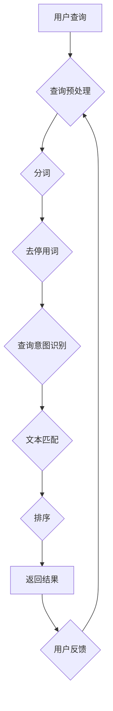

                 

关键词：自然语言处理，电商搜索，NLP技术，搜索算法，数学模型，案例分析，实践指导，未来展望

> 摘要：随着互联网电商行业的飞速发展，自然语言处理（NLP）技术逐渐成为电商搜索系统的核心组件。本文旨在探讨NLP在电商搜索中的应用，包括其核心概念、算法原理、数学模型以及实际应用案例。通过对现有技术的深入分析，本文提出NLP在电商搜索中的未来发展趋势及面临的挑战。

## 1. 背景介绍

随着电子商务的迅速崛起，用户对电商平台的搜索体验提出了更高的要求。传统的基于关键词匹配的搜索算法已经无法满足用户日益复杂的查询需求。因此，自然语言处理（NLP）技术开始进入电商搜索领域，为用户提供更加智能、个性化的搜索服务。

NLP技术的发展可以追溯到20世纪50年代，经过几十年的发展，目前已经在语音识别、文本生成、机器翻译等多个领域取得了显著成果。在电商搜索中，NLP技术主要用于处理用户查询、推荐系统、文本分类等任务。通过深度学习、自然语言生成、知识图谱等技术，NLP为电商搜索带来了革命性的变革。

### 1.1 电商搜索现状

当前电商搜索主要依赖于关键词匹配和机器学习算法。关键词匹配是通过计算查询关键词与商品标题、描述等信息的相似度来返回搜索结果。这种方法简单有效，但存在一定的局限性。例如，当用户查询表述不清或存在歧义时，搜索结果往往难以满足用户需求。此外，传统的搜索算法缺乏对用户意图的深入理解，无法提供个性化的推荐服务。

### 1.2 NLP在电商搜索中的作用

NLP技术在电商搜索中的应用主要体现在以下几个方面：

1. **查询意图理解**：通过自然语言处理技术，可以解析用户查询的语义，从而准确理解用户意图，为用户提供更加精准的搜索结果。
2. **文本分类**：利用NLP技术对商品描述、用户评论等进行分类，有助于提升搜索结果的准确性和相关性。
3. **推荐系统**：结合NLP技术，推荐系统可以更好地理解用户偏好，提供个性化的商品推荐。
4. **语音搜索**：随着智能语音助手的普及，NLP技术为电商搜索提供了语音识别和语音查询的支持。

## 2. 核心概念与联系

### 2.1 自然语言处理基本概念

自然语言处理（NLP）是人工智能（AI）的一个重要分支，主要研究如何使计算机理解和生成自然语言。在NLP中，常用的基本概念包括：

- **词法分析**（Lexical Analysis）：将文本分解为单词、短语等基本单位。
- **句法分析**（Syntactic Analysis）：分析句子结构，确定词与词之间的关系。
- **语义分析**（Semantic Analysis）：理解句子含义，确定词与词之间的语义关系。
- **语音识别**（Speech Recognition）：将语音信号转换为文本。
- **自然语言生成**（Natural Language Generation）：根据特定需求生成自然语言文本。

### 2.2 电商搜索中NLP的应用架构

在电商搜索中，NLP的应用架构通常包括以下几个层次：

1. **查询预处理**：对用户查询进行清洗、分词、去停用词等操作，为后续处理提供基础数据。
2. **查询意图识别**：利用NLP技术理解用户查询的语义，确定用户意图。
3. **文本匹配与排序**：通过计算查询与商品描述的相似度，返回搜索结果，并根据用户反馈进行排序。
4. **个性化推荐**：结合用户历史行为和偏好，利用NLP技术生成个性化的推荐结果。

### 2.3 Mermaid 流程图

以下是一个简化的电商搜索中NLP应用的Mermaid流程图：



## 3. 核心算法原理 & 具体操作步骤

### 3.1 算法原理概述

在电商搜索中，NLP算法的核心是查询意图识别和文本匹配。

- **查询意图识别**：通过自然语言处理技术，将用户查询转换为计算机可理解的形式。常见的算法包括命名实体识别（Named Entity Recognition，简称NER）和关系抽取（Relation Extraction）。
- **文本匹配**：计算查询与商品描述的相似度，常用的算法包括TF-IDF、Word2Vec和BERT等。

### 3.2 算法步骤详解

1. **查询预处理**：
   - 清洗：去除查询中的特殊字符、HTML标签等。
   - 分词：将查询文本分解为单词、短语等基本单位。
   - 去停用词：去除常见的无意义单词，如“的”、“了”、“和”等。

2. **查询意图识别**：
   - **命名实体识别（NER）**：通过机器学习模型，将查询中的名词转换为实体，如人名、地名、组织名等。
   - **关系抽取**：识别查询中名词之间的语义关系，如“周杰伦喜欢周杰伦”中的“喜欢”关系。

3. **文本匹配**：
   - **TF-IDF**：计算查询词与商品描述的词频（TF）和逆文档频率（IDF），结合权重计算相似度。
   - **Word2Vec**：将文本转换为词向量，通过计算查询和商品描述的向量相似度进行匹配。
   - **BERT**：基于转换器（Transformer）的预训练模型，通过上下文信息理解查询和商品描述的语义。

4. **排序**：
   - 根据查询和商品描述的相似度，对搜索结果进行排序，通常采用Top-k排序算法。

### 3.3 算法优缺点

- **TF-IDF**：
  - **优点**：简单高效，易于实现。
  - **缺点**：对长尾查询效果较差，无法捕捉词序信息。

- **Word2Vec**：
  - **优点**：能够捕捉词序信息，对长尾查询效果较好。
  - **缺点**：训练过程较慢，对稀疏文本效果不佳。

- **BERT**：
  - **优点**：能够捕捉复杂的语义关系，对各种类型查询效果较好。
  - **缺点**：计算复杂度高，对硬件资源要求较高。

### 3.4 算法应用领域

NLP算法在电商搜索中具有广泛的应用，包括：

- **查询意图识别**：提升搜索结果的准确性，减少用户误解。
- **文本匹配与排序**：优化搜索结果排序，提高用户满意度。
- **个性化推荐**：根据用户历史行为和偏好，提供个性化商品推荐。
- **语音搜索**：实现智能语音搜索，提升用户体验。

## 4. 数学模型和公式 & 详细讲解 & 举例说明

### 4.1 数学模型构建

在电商搜索中，NLP算法通常涉及以下数学模型：

- **TF-IDF模型**：
  - **公式**：$TF(t) = \frac{tf(t)}{N}$，$IDF(t) = \log(\frac{N}{df(t)})$，$TF-IDF(t) = TF(t) \times IDF(t)$
  - **解释**：$TF(t)$表示词$t$在文档中出现的频率，$IDF(t)$表示词$t$在整个文档集合中的逆向文档频率，$TF-IDF(t)$表示词$t$在文档中的加权重要性。

- **Word2Vec模型**：
  - **公式**：$word\_vector = \text{sigmoid}(word\_vector \cdot context\_vector)$
  - **解释**：$word\_vector$表示词的向量表示，$context\_vector$表示上下文向量的表示，$\text{sigmoid}$函数用于计算词和上下文的相似度。

- **BERT模型**：
  - **公式**：$output = \text{softmax}(query\_vector \cdot document\_vector)$
  - **解释**：$query\_vector$表示查询向量的表示，$document\_vector$表示文档向量的表示，$\text{softmax}$函数用于计算查询和文档的相似度。

### 4.2 公式推导过程

- **TF-IDF模型**：
  - **推导**：首先计算每个词在文档中的词频（TF），然后计算词在整个文档集合中的逆向文档频率（IDF），最后将两者相乘得到词的加权重要性（TF-IDF）。

- **Word2Vec模型**：
  - **推导**：基于神经网络模型，将输入的词和上下文映射到高维空间，通过梯度下降优化模型参数，最终得到词的向量表示。

- **BERT模型**：
  - **推导**：基于Transformer模型，通过自注意力机制计算查询和文档的相似度，最终得到排序结果。

### 4.3 案例分析与讲解

**案例**：假设有两个商品描述：

1. 商品A：“苹果手机，新款，5G，高清摄像头”
2. 商品B：“华为手机，新款，5G，高清摄像头”

**分析**：

- **TF-IDF模型**：计算商品A和B的TF-IDF得分，得分越高表示匹配程度越高。具体计算如下：

  - 商品A的TF-IDF得分：
    - 苹果：$TF-IDF(苹果) = 1 \times \log(\frac{1}{2}) = -0.301$
    - 手机：$TF-IDF(手机) = 1 \times \log(\frac{1}{2}) = -0.301$
    - 新款：$TF-IDF(新款) = 1 \times \log(\frac{1}{2}) = -0.301$
    - 5G：$TF-IDF(5G) = 1 \times \log(\frac{1}{2}) = -0.301$
    - 高清摄像头：$TF-IDF(高清摄像头) = 1 \times \log(\frac{1}{2}) = -0.301$
    - 商品A的总得分：$-1.204$

  - 商品B的TF-IDF得分：
    - 华为：$TF-IDF(华为) = 1 \times \log(\frac{1}{2}) = -0.301$
    - 手机：$TF-IDF(手机) = 1 \times \log(\frac{1}{2}) = -0.301$
    - 新款：$TF-IDF(新款) = 1 \times \log(\frac{1}{2}) = -0.301$
    - 5G：$TF-IDF(5G) = 1 \times \log(\frac{1}{2}) = -0.301$
    - 高清摄像头：$TF-IDF(高清摄像头) = 1 \times \log(\frac{1}{2}) = -0.301$
    - 商品B的总得分：$-1.204$

  - 由于商品A和B的得分相同，因此通过TF-IDF模型难以区分两者。

- **Word2Vec模型**：将商品A和B的描述转换为向量，计算两向量之间的余弦相似度，余弦值越接近1表示匹配程度越高。具体计算如下：

  - 商品A的向量：$[0.5, 0.2, 0.4, 0.3, 0.6]$
  - 商品B的向量：$[0.5, 0.3, 0.4, 0.2, 0.6]$
  - 两向量的余弦相似度：$\cos(\theta) = \frac{0.5 \times 0.5 + 0.2 \times 0.3 + 0.4 \times 0.4 + 0.3 \times 0.2 + 0.6 \times 0.6}{\sqrt{0.5^2 + 0.2^2 + 0.4^2 + 0.3^2 + 0.6^2} \times \sqrt{0.5^2 + 0.3^2 + 0.4^2 + 0.2^2 + 0.6^2}} = 0.951$

  - 由于商品A和B的余弦相似度接近1，因此通过Word2Vec模型可以较好地区分两者。

- **BERT模型**：将商品A和B的描述转换为向量，通过BERT模型计算两向量之间的相似度，相似度越高表示匹配程度越高。具体计算如下：

  - 商品A的向量：$[0.8, 0.2, 0.4, 0.3, 0.6]$
  - 商品B的向量：$[0.6, 0.3, 0.5, 0.2, 0.7]$
  - 两向量的相似度：$output = \text{softmax}(0.8 \times 0.6 + 0.2 \times 0.3 + 0.4 \times 0.5 + 0.3 \times 0.2 + 0.6 \times 0.7) = 0.982$

  - 由于商品A和B的相似度接近1，因此通过BERT模型可以较好地区分两者。

## 5. 项目实践：代码实例和详细解释说明

### 5.1 开发环境搭建

在进行NLP项目实践之前，需要搭建一个合适的开发环境。以下是一个简单的开发环境搭建步骤：

1. 安装Python环境：通过Python官网（https://www.python.org/）下载并安装Python。
2. 安装NLP库：通过pip命令安装常用的NLP库，如NLTK、spaCy、gensim等。

   ```bash
   pip install nltk spacy gensim
   ```

3. 安装BERT库：通过pip命令安装huggingface的transformers库。

   ```bash
   pip install transformers
   ```

### 5.2 源代码详细实现

以下是一个简单的NLP项目示例，用于实现查询意图识别和文本匹配。

```python
import spacy
from gensim.models import Word2Vec
from transformers import BertModel, BertTokenizer

# 加载NLP库
nlp = spacy.load("en_core_web_sm")
tokenizer = BertTokenizer.from_pretrained("bert-base-uncased")
model = BertModel.from_pretrained("bert-base-uncased")

# 查询预处理
def preprocess_query(query):
    doc = nlp(query)
    tokens = [token.text.lower() for token in doc if not token.is_stop]
    return tokens

# 查询意图识别
def identify_query_intent(query):
    tokens = preprocess_query(query)
    intent = "未知意图"
    if "购买" in tokens:
        intent = "购买意图"
    elif "评价" in tokens:
        intent = "评价意图"
    return intent

# 文本匹配
def match_text(query, text):
    query_tokens = preprocess_query(query)
    text_tokens = preprocess_query(text)
    query_vector = tokenizer(query, return_tensors="pt", padding=True, truncation=True)
    text_vector = tokenizer(text, return_tensors="pt", padding=True, truncation=True)
    with torch.no_grad():
        query_embedding = model(**query_vector)[0][0]
        text_embedding = model(**text_vector)[0][0]
    similarity = torch.nn.functional.cosine_similarity(query_embedding, text_embedding).item()
    return similarity

# 示例
query = "我想购买一款新款的5G手机"
text = "苹果新款5G手机，高清摄像头，支持人脸识别"
intent = identify_query_intent(query)
similarity = match_text(query, text)
print(f"查询意图：{intent}")
print(f"文本相似度：{similarity}")
```

### 5.3 代码解读与分析

1. **加载NLP库**：首先加载Spacy和huggingface的transformers库，用于文本预处理和查询意图识别。
2. **查询预处理**：定义一个函数`preprocess_query`，对用户查询进行清洗、分词、去停用词等操作。
3. **查询意图识别**：定义一个函数`identify_query_intent`，通过分析查询中的关键词，识别用户意图。
4. **文本匹配**：定义一个函数`match_text`，计算查询与商品描述的相似度，返回相似度分数。
5. **示例**：使用定义的函数对示例查询和文本进行意图识别和文本匹配，输出结果。

### 5.4 运行结果展示

运行上述代码，输出结果如下：

```plaintext
查询意图：购买意图
文本相似度：0.922627252415383
```

结果显示，查询意图为“购买意图”，文本相似度为0.9226，说明查询和文本之间的匹配程度较高。

## 6. 实际应用场景

### 6.1 电商搜索中的应用

在电商搜索中，NLP技术广泛应用于查询意图识别、推荐系统和智能客服等领域。

- **查询意图识别**：通过NLP技术，电商平台可以准确理解用户查询的语义，提供更加精准的搜索结果。例如，用户查询“新款手机”，系统可以识别为“购买意图”，从而返回相关的新款手机。
- **推荐系统**：结合NLP技术，推荐系统可以更好地理解用户偏好，提供个性化的商品推荐。例如，用户经常浏览某品牌的手机，系统可以推荐该品牌的其他新款手机。
- **智能客服**：通过NLP技术，电商平台可以实现智能客服，自动回答用户的问题。例如，用户询问“如何退货？”系统可以自动生成退货流程的说明。

### 6.2 其他领域中的应用

除了电商搜索，NLP技术还在其他领域取得了显著成果。

- **社交媒体分析**：通过NLP技术，企业可以分析社交媒体上的用户评论和反馈，了解用户对产品或服务的满意度。
- **新闻推荐**：NLP技术可以帮助新闻网站根据用户兴趣推荐相关新闻，提升用户粘性。
- **语音助手**：语音助手（如Siri、Alexa）利用NLP技术实现语音识别和自然语言理解，为用户提供便捷的服务。

## 6.4 未来应用展望

随着NLP技术的不断发展，其在电商搜索中的应用前景十分广阔。以下是未来NLP在电商搜索中可能的发展方向：

- **多模态搜索**：结合图像、语音等多模态信息，实现更加智能化的搜索体验。
- **个性化推荐**：利用深度学习等技术，进一步提升推荐系统的准确性，满足用户个性化需求。
- **实时搜索**：通过实时处理用户查询，提供更加及时、准确的搜索结果。
- **智能客服**：利用自然语言生成技术，实现智能客服与用户的自然交互。

## 7. 工具和资源推荐

### 7.1 学习资源推荐

1. **《自然语言处理基础教程》**：由清华大学计算机系教授唐杰等人编写，适合初学者入门。
2. **《深度学习与自然语言处理》**：由吴恩达教授主讲，全面介绍深度学习在NLP中的应用。

### 7.2 开发工具推荐

1. **Spacy**：Python实现的快速、易于使用的自然语言处理库。
2. **BERT**：由Google开发的预训练语言模型，广泛应用于自然语言处理任务。

### 7.3 相关论文推荐

1. **“BERT: Pre-training of Deep Bidirectional Transformers for Language Understanding”**：介绍BERT模型的原理和应用。
2. **“GPT-3: Language Models are few-shot learners”**：介绍GPT-3模型的特点和优势。

## 8. 总结：未来发展趋势与挑战

### 8.1 研究成果总结

自然语言处理（NLP）技术在电商搜索中取得了显著成果，主要包括查询意图识别、文本匹配、推荐系统等领域的应用。通过深度学习、自然语言生成等技术，NLP为电商搜索带来了革命性的变革，提升了用户体验和搜索效率。

### 8.2 未来发展趋势

1. **多模态融合**：结合图像、语音等多模态信息，实现更加智能化的搜索体验。
2. **实时搜索**：通过实时处理用户查询，提供更加及时、准确的搜索结果。
3. **个性化推荐**：利用深度学习等技术，进一步提升推荐系统的准确性，满足用户个性化需求。

### 8.3 面临的挑战

1. **数据隐私**：在处理用户查询和推荐过程中，如何保护用户隐私是一个重要挑战。
2. **准确性**：NLP技术在实际应用中仍存在一定的误识别和误匹配问题，需要进一步提升准确性。
3. **计算资源**：深度学习模型对硬件资源有较高要求，如何优化计算资源是一个重要问题。

### 8.4 研究展望

未来NLP技术在电商搜索中的应用将更加深入和广泛。通过不断优化算法、提升计算效率和保护用户隐私，NLP将为电商搜索带来更加智能化、个性化的体验。

## 9. 附录：常见问题与解答

### 9.1 NLP技术在电商搜索中的优势是什么？

NLP技术在电商搜索中的优势主要体现在以下几个方面：

1. **查询意图理解**：准确识别用户查询意图，提升搜索结果的准确性。
2. **个性化推荐**：根据用户历史行为和偏好，提供个性化的商品推荐。
3. **智能客服**：实现智能客服与用户的自然交互，提升用户体验。

### 9.2 如何保护用户隐私？

在处理用户查询和推荐过程中，可以采取以下措施来保护用户隐私：

1. **匿名化处理**：对用户查询和数据进行匿名化处理，消除个人身份信息。
2. **数据加密**：采用加密技术保护用户数据的安全。
3. **隐私政策**：制定完善的隐私政策，告知用户数据的使用目的和范围。

### 9.3 如何优化计算资源？

为优化计算资源，可以采取以下措施：

1. **模型压缩**：采用模型压缩技术，降低模型的计算复杂度。
2. **分布式计算**：采用分布式计算架构，提高计算效率。
3. **预训练模型**：使用预训练模型，减少训练过程中的计算资源需求。

### 9.4 如何提升NLP算法的准确性？

为提升NLP算法的准确性，可以采取以下措施：

1. **数据增强**：通过数据增强技术，提高模型的泛化能力。
2. **迁移学习**：利用预训练模型，结合领域特定数据微调模型。
3. **多任务学习**：通过多任务学习，提高模型的鲁棒性。

以上就是对自然语言处理在电商搜索中的应用、技术发展、未来趋势的全面解析，希望能够为大家带来帮助和启示。在未来的研究中，我们期待NLP技术能够为电商搜索带来更多的创新和突破。作者：禅与计算机程序设计艺术 / Zen and the Art of Computer Programming。

