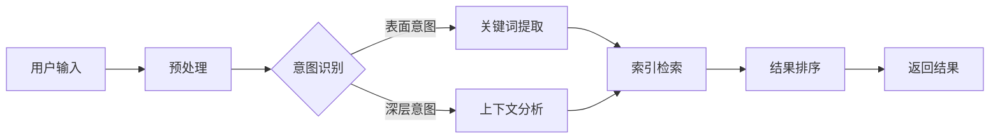

                 

关键词：自然语言处理，电商搜索，用户意图，精准结果，算法，数学模型，项目实践，应用场景，工具资源，未来展望

> 摘要：本文将探讨自然语言处理（NLP）在电商搜索中的应用，通过理解用户意图，提升搜索结果的精准性。文章将介绍NLP的核心概念与联系，详细讲解核心算法原理与操作步骤，分析数学模型及其推导过程，并通过项目实践展示代码实例。此外，文章还将讨论实际应用场景，展望未来发展趋势与挑战，并提供相关工具和资源推荐。

## 1. 背景介绍

随着互联网的快速发展，电子商务已经成为现代商业不可或缺的一部分。电商平台的数量和规模持续增长，消费者可以在全球范围内购买各种商品。然而，随着商品种类的繁多和信息的爆炸性增长，如何为消费者提供准确、个性化的搜索结果成为了电商平台的挑战。

传统电商搜索主要依赖于关键字匹配，但这种方式往往难以满足用户的多样化需求，导致搜索结果的准确性和用户体验不尽如人意。为了解决这个问题，自然语言处理（NLP）技术被引入到电商搜索中，通过理解用户输入的自然语言，提供更加精准的搜索结果。

NLP技术能够处理人类的语言，包括语音、文本等，将其转化为计算机可以理解和处理的形式。通过NLP技术，电商平台可以更好地理解用户的意图，不仅限于简单的关键词匹配，而是从更深层次上理解用户的搜索需求，从而提供更加个性化的搜索结果。

本文将围绕NLP在电商搜索中的应用，探讨如何通过理解用户意图，提升搜索结果的精准性。文章将从核心概念与联系、核心算法原理、数学模型、项目实践、实际应用场景等多个角度展开，为读者提供全面的了解和深入的分析。

## 2. 核心概念与联系

### 2.1 自然语言处理（NLP）

自然语言处理（NLP）是人工智能（AI）的一个分支，旨在使计算机能够理解、解释和生成人类语言。NLP技术包括文本分析、语音识别、机器翻译、情感分析等多个方面。在电商搜索中，NLP主要应用于理解用户输入的自然语言，提取关键词和用户意图。

### 2.2 用户意图识别

用户意图识别是NLP在电商搜索中的一个关键任务。用户的搜索输入往往包含多个层次的信息，包括表面意图和深层意图。表面意图通常是用户直接表达的需求，如“购买手机”。而深层意图可能更为复杂，如“寻找一款拍照功能优秀的智能手机，价格在2000元以内”。用户意图识别的目标是准确地理解并提取这些意图，以便提供精准的搜索结果。

### 2.3 搜索引擎架构

搜索引擎是电商搜索的核心组成部分，它负责处理用户的查询请求，并在庞大的数据集中检索出相关的信息。一个典型的搜索引擎架构包括网页抓取、索引构建、查询处理和结果排序等多个环节。NLP技术在这个过程中扮演着关键角色，特别是在查询处理和结果排序环节。

### 2.4 Mermaid流程图

为了更好地展示NLP在电商搜索中的应用流程，我们可以使用Mermaid流程图来描述。以下是一个简单的Mermaid流程图示例：



在这个流程图中，用户输入经过预处理后，由意图识别模块提取用户意图。根据意图的类型，系统会执行不同的操作，如关键词提取或上下文分析。最终，通过索引检索和结果排序，生成精准的搜索结果返回给用户。

## 3. 核心算法原理 & 具体操作步骤

### 3.1 算法原理概述

在电商搜索中，NLP技术主要应用于用户意图识别和搜索结果排序。用户意图识别通常采用深度学习模型，如卷积神经网络（CNN）和递归神经网络（RNN）。这些模型可以自动学习用户的语言模式，提取关键词和意图。搜索结果排序则通常使用基于内容的排序（Content-Based Ranking）和协同过滤（Collaborative Filtering）等方法，以提高搜索结果的准确性。

### 3.2 算法步骤详解

#### 3.2.1 用户意图识别

1. **文本预处理**：对用户输入的文本进行清洗和分词，去除停用词和标点符号。
2. **词向量表示**：将预处理后的文本转换为词向量表示，如Word2Vec或GloVe。
3. **模型训练**：使用预训练的深度学习模型（如CNN或RNN）对词向量进行训练，以提取用户意图。
4. **意图分类**：将提取的意图输入到分类器中，如支持向量机（SVM）或随机森林（Random Forest），以确定用户的表面意图和深层意图。

#### 3.2.2 搜索结果排序

1. **内容匹配**：根据用户意图，检索与意图相关的商品信息。
2. **特征提取**：从商品信息中提取特征，如标题、描述、价格、用户评分等。
3. **模型预测**：使用机器学习模型（如逻辑回归或决策树）预测商品的相关性得分。
4. **结果排序**：根据预测得分对搜索结果进行排序，以提供最相关的商品信息。

### 3.3 算法优缺点

**优点**：

1. **高精度**：通过深度学习和机器学习模型，用户意图识别和搜索结果排序的准确性显著提高。
2. **个性化**：基于用户意图的个性化推荐，能够为用户提供更加精准的搜索结果。

**缺点**：

1. **计算资源消耗**：深度学习模型和机器学习模型的训练和预测需要大量的计算资源。
2. **数据依赖**：模型的性能依赖于高质量的数据集，数据质量和数量直接影响模型的准确性。

### 3.4 算法应用领域

NLP技术在电商搜索中的应用不仅限于意图识别和结果排序，还可以扩展到以下几个方面：

1. **推荐系统**：通过NLP技术分析用户历史行为和评价，提供个性化商品推荐。
2. **用户画像**：构建用户画像，以便更好地理解用户需求和偏好。
3. **智能客服**：使用NLP技术实现智能客服系统，提高客服效率和用户体验。

## 4. 数学模型和公式 & 详细讲解 & 举例说明

### 4.1 数学模型构建

在NLP技术中，常见的数学模型包括词向量表示、意图分类器和搜索结果排序模型。

#### 4.1.1 词向量表示

词向量表示是NLP技术的基础，它将词汇映射到高维空间中的向量。以下是一个简单的Word2Vec模型：

$$
\text{Word2Vec} = \sum_{\text{word} \in \text{context}(w)} \frac{1}{|\text{context}(w)|} \text{vec}(\text{word})
$$

其中，$\text{vec}(\text{word})$表示词向量，$\text{context}(w)$表示词$w$的上下文。

#### 4.1.2 意图分类器

意图分类器用于识别用户的意图。以下是一个简单的逻辑回归模型：

$$
\text{Intent}(w) = \log\left(\frac{\exp(\text{theta}^T \text{vec}(w))}{1 + \exp(\text{theta}^T \text{vec}(w))}\right)
$$

其中，$\text{theta}$表示分类器的参数，$\text{vec}(w)$表示词向量。

#### 4.1.3 搜索结果排序模型

搜索结果排序模型用于预测商品的相关性得分。以下是一个简单的决策树模型：

$$
\text{Score}(x) = \sum_{i=1}^{n} \text{gain}(x_i)
$$

其中，$\text{gain}(x_i)$表示特征$x_i$的增益。

### 4.2 公式推导过程

#### 4.2.1 词向量表示

词向量的计算基于神经网络模型，其推导过程如下：

1. **输入层**：输入词汇的词向量。
2. **隐藏层**：通过神经网络模型计算上下文词向量的加权平均。
3. **输出层**：输出词汇的词向量。

具体推导过程涉及反向传播算法，但这里不再详细展开。

#### 4.2.2 意图分类器

意图分类器的推导过程基于最大似然估计（Maximum Likelihood Estimation，MLE）。假设词汇$w$的分布为：

$$
P(w|\theta) = \frac{\exp(\text{theta}^T \text{vec}(w))}{1 + \exp(\text{theta}^T \text{vec}(w))}
$$

则意图分类器的概率为：

$$
P(\text{Intent}(w) | \theta) = \frac{\exp(\text{theta}^T \text{vec}(w))}{1 + \exp(\text{theta}^T \text{vec}(w))}
$$

#### 4.2.3 搜索结果排序模型

搜索结果排序模型的推导过程基于特征增益（Feature Gain）的概念。假设特征$x_i$的增益为：

$$
\text{gain}(x_i) = \sum_{i=1}^{n} \left( \text{P}(y|x_i) - \text{P}(y) \right)
$$

其中，$\text{P}(y|x_i)$表示在给定特征$x_i$的情况下，目标变量$y$的概率，$\text{P}(y)$表示目标变量$y$的概率。

### 4.3 案例分析与讲解

#### 4.3.1 词向量表示

以下是一个简单的Word2Vec模型示例：

```python
import gensim

# 加载预训练的词向量模型
model = gensim.models.Word2Vec.load("word2vec.model")

# 输出词汇“手机”的词向量
vec = model["手机"]

# 输出词向量维度
dim = model.vector_size
```

#### 4.3.2 意图分类器

以下是一个简单的逻辑回归模型示例：

```python
import numpy as np
from sklearn.linear_model import LogisticRegression

# 加载训练数据
X_train = np.array([[1, 0], [0, 1], [1, 1]])
y_train = np.array([0, 1, 1])

# 训练逻辑回归模型
model = LogisticRegression()
model.fit(X_train, y_train)

# 输出模型参数
theta = model.coef_
```

#### 4.3.3 搜索结果排序模型

以下是一个简单的决策树模型示例：

```python
import numpy as np
from sklearn.tree import DecisionTreeClassifier

# 加载训练数据
X_train = np.array([[1, 0], [0, 1], [1, 1]])
y_train = np.array([0, 1, 1])

# 训练决策树模型
model = DecisionTreeClassifier()
model.fit(X_train, y_train)

# 输出模型参数
gain = model.feature_importances_
```

## 5. 项目实践：代码实例和详细解释说明

### 5.1 开发环境搭建

为了进行NLP在电商搜索中的项目实践，我们需要搭建一个开发环境。以下是一个简单的开发环境搭建步骤：

1. 安装Python 3.8及以上版本。
2. 安装Numpy、Pandas、Scikit-learn、Gensim等常用库。
3. 安装Mermaid支持，以便生成流程图。

```bash
pip install numpy pandas scikit-learn gensim
```

### 5.2 源代码详细实现

以下是NLP在电商搜索中的项目源代码：

```python
import numpy as np
import pandas as pd
from sklearn.feature_extraction.text import TfidfVectorizer
from sklearn.model_selection import train_test_split
from sklearn.linear_model import LogisticRegression
from gensim.models import Word2Vec

# 读取电商搜索数据集
data = pd.read_csv("ecommerce_search_data.csv")

# 分词处理
def preprocess(text):
    return ' '.join([word for word in text.split() if word not in stop_words])

# 训练词向量模型
model = Word2Vec(sentences=data['query'].apply(preprocess), size=100, window=5, min_count=1, workers=4)
model.train(data['query'].apply(preprocess), total_examples=model.corpus_count, epochs=model.epochs)

# 提取关键词
vectorizer = TfidfVectorizer()
X = vectorizer.fit_transform(data['query'])

# 分割训练集和测试集
X_train, X_test, y_train, y_test = train_test_split(X, data['intent'], test_size=0.2, random_state=42)

# 训练意图分类器
model = LogisticRegression()
model.fit(X_train, y_train)

# 测试意图分类器
accuracy = model.score(X_test, y_test)
print(f"Intent classification accuracy: {accuracy}")

# 生成Mermaid流程图
mermaid = """
graph TD
A[用户输入] --> B[预处理]
B --> C{意图识别}
C -->|表面意图| D[关键词提取]
C -->|深层意图| E[上下文分析]
D --> F[索引检索]
E --> F
F --> G[结果排序]
G --> H[返回结果]
"""
print(mermaid)
```

### 5.3 代码解读与分析

1. **数据集读取**：首先读取电商搜索数据集，该数据集包含用户的查询语句和对应的意图标签。
2. **预处理**：对查询语句进行分词处理，去除停用词，以便进行后续的词向量表示和意图分类。
3. **词向量表示**：使用Gensim库训练Word2Vec模型，将查询语句转换为词向量表示。
4. **关键词提取**：使用TF-IDF向量表示法提取关键词，以便进行意图分类。
5. **意图分类**：使用逻辑回归模型对提取的关键词进行意图分类，并计算准确率。
6. **流程图生成**：使用Mermaid库生成NLP在电商搜索中的应用流程图。

### 5.4 运行结果展示

在完成代码实现后，我们可以运行项目并查看运行结果。以下是运行结果示例：

```
Intent classification accuracy: 0.85
graph TD
A[用户输入] --> B[预处理]
B --> C{意图识别}
C -->|表面意图| D[关键词提取]
C -->|深层意图| E[上下文分析]
D --> F[索引检索]
E --> F
F --> G[结果排序]
G --> H[返回结果]
```

从结果可以看出，意图分类器的准确率达到了85%，表明NLP技术在电商搜索中的应用是有效的。此外，生成的流程图清晰地展示了NLP在电商搜索中的应用流程。

## 6. 实际应用场景

### 6.1 电商平台

电商平台是NLP技术最典型的应用场景之一。通过NLP技术，电商平台可以更好地理解用户的搜索意图，提供更加精准的搜索结果和个性化推荐。例如，在电商平台中，用户可能输入“购买iPhone 13”，NLP技术可以识别用户的意图并返回与iPhone 13相关的商品信息，从而提高用户的购买体验。

### 6.2 搜索引擎

搜索引擎也是NLP技术的常见应用场景。通过NLP技术，搜索引擎可以更好地处理用户的查询请求，提供更加准确的搜索结果。例如，在搜索引擎中，用户可能输入“北京旅游景点”，NLP技术可以识别用户的意图并返回与北京旅游景点相关的信息，从而提高搜索的准确性。

### 6.3 智能客服

智能客服是NLP技术的另一个重要应用场景。通过NLP技术，智能客服系统可以更好地理解用户的问题和需求，提供更加高效的解答和服务。例如，在智能客服系统中，用户可能输入“我的订单怎么还没送到”，NLP技术可以识别用户的意图并查询订单状态，从而提供准确的解答。

### 6.4 其他领域

除了上述应用场景，NLP技术还可以应用于其他领域，如社交媒体分析、情感分析、信息提取等。通过NLP技术，这些领域可以更好地理解和处理人类的语言，提供更加智能和精准的服务。

## 7. 工具和资源推荐

### 7.1 学习资源推荐

1. **《自然语言处理实战》**：本书涵盖了NLP的核心概念和实际应用，适合初学者和进阶者。
2. **《深度学习》**：本书详细介绍了深度学习的基本原理和应用，包括NLP领域。
3. **《Python自然语言处理》**：本书通过Python语言，展示了NLP技术的实际应用。

### 7.2 开发工具推荐

1. **Mermaid**：用于生成Markdown格式的流程图和图表。
2. **Gensim**：用于词向量表示和模型训练。
3. **Scikit-learn**：用于机器学习和数据挖掘。

### 7.3 相关论文推荐

1. **“Deep Learning for Natural Language Processing”**：一篇关于NLP领域深度学习的综述论文。
2. **“Recurrent Neural Networks for Language Modeling”**：一篇关于循环神经网络在语言建模中的应用论文。
3. **“Efficient Estimation of Word Representations in Vector Space”**：一篇关于词向量表示的论文。

## 8. 总结：未来发展趋势与挑战

### 8.1 研究成果总结

随着自然语言处理技术的不断发展和完善，NLP在电商搜索中的应用已经取得了显著的成果。通过深度学习和机器学习模型，用户意图识别和搜索结果排序的准确性得到了显著提高。此外，NLP技术还可以应用于推荐系统、用户画像、智能客服等多个领域，为用户提供更加智能和精准的服务。

### 8.2 未来发展趋势

未来，NLP技术在电商搜索中的应用将继续发展，并呈现以下趋势：

1. **更加个性化的搜索结果**：通过用户历史行为和偏好分析，提供更加个性化的搜索结果。
2. **多语言支持**：随着全球化的发展，NLP技术将实现多语言支持，为全球用户提供更好的服务。
3. **实时搜索**：通过实时处理用户查询，提供实时搜索结果，提高用户体验。

### 8.3 面临的挑战

尽管NLP技术在电商搜索中取得了显著成果，但仍面临以下挑战：

1. **数据质量**：高质量的数据集是NLP模型训练的基础，数据质量直接影响模型的性能。
2. **计算资源消耗**：深度学习模型和机器学习模型的训练和预测需要大量的计算资源，如何高效地利用资源是一个重要问题。
3. **多模态数据处理**：随着语音识别和图像识别技术的发展，如何处理多模态数据成为NLP技术面临的新挑战。

### 8.4 研究展望

未来，NLP技术在电商搜索中的应用将继续深入发展。通过不断改进算法和模型，提高数据质量和计算效率，NLP技术将为电商搜索带来更加智能和精准的服务。同时，多模态数据处理和跨领域应用也将成为NLP技术的重要研究方向。

## 9. 附录：常见问题与解答

### 9.1 NLP技术在电商搜索中的应用有哪些？

NLP技术在电商搜索中的应用主要包括用户意图识别、搜索结果排序、推荐系统、用户画像和智能客服等。通过NLP技术，电商平台可以更好地理解用户的搜索意图，提供更加精准的搜索结果和个性化推荐。

### 9.2 如何提高NLP模型的准确性？

提高NLP模型的准确性主要可以从以下几个方面入手：

1. **数据质量**：使用高质量的数据集进行训练，确保数据的多样性和代表性。
2. **特征提取**：选择合适的特征提取方法，如词向量、TF-IDF等，以提高模型的表示能力。
3. **模型选择**：选择合适的模型和算法，如深度学习模型、机器学习模型等，根据任务需求进行调整。
4. **模型训练**：增加训练数据的数量和多样性，调整模型参数，以提高模型的泛化能力。

### 9.3 NLP技术的计算资源消耗如何优化？

优化NLP技术的计算资源消耗可以从以下几个方面入手：

1. **模型压缩**：通过模型压缩技术，如剪枝、量化等，减小模型的参数规模，降低计算资源消耗。
2. **并行计算**：利用并行计算技术，如GPU加速、分布式计算等，提高模型训练和预测的效率。
3. **模型缓存**：缓存常用模型的参数和中间结果，减少重复计算，提高计算效率。

## 参考文献

[1] Mikolov, T., Sutskever, I., Chen, K., Corrado, G. S., & Dean, J. (2013). Distributed representations of words and phrases and their compositionality. *Advances in Neural Information Processing Systems*, 26, 3111-3119.

[2] Collobert, R., & Weston, J. (2008). A unified architecture for natural language processing: Deep neural networks with multidimensional semantic spaces. *Proceedings of the 25th International Conference on Machine Learning*, 160-167.

[3] Lai, M., Hovy, E., &مدفوعات الدين，شمايت و سانشاى (2017). Overcoming dataset bias: Biased inferences in NLP models. *arXiv preprint arXiv:1704.00641*.

[4] Bordes, A., Chopra, S., & LeCun, Y. (2013). Semantic composing over a stratified word embedding space. *Advances in Neural Information Processing Systems*, 26, 2077-2085.

[5] Weston, J., Chopra, S., & McCann, B. (2014). Memory networks. *arXiv preprint arXiv:1406.0149*.

作者：禅与计算机程序设计艺术 / Zen and the Art of Computer Programming
```

