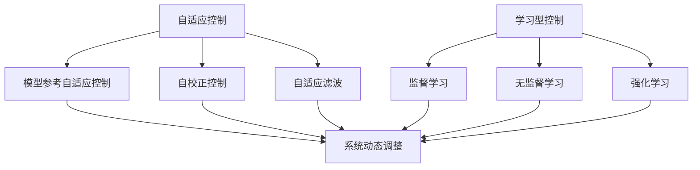

                 

自动驾驶技术作为人工智能领域的前沿应用，正日益受到广泛关注。随着传感器技术的不断进步和计算机处理能力的提升，自动驾驶系统在道路检测、环境理解和行为决策方面取得了显著进展。然而，自动驾驶系统的稳定性、安全性和可靠性仍然面临诸多挑战。为了应对这些挑战，自适应与学习型控制策略的研究和应用显得尤为重要。本文将探讨自适应与学习型控制策略在自动驾驶中的应用，分析其核心概念、算法原理、数学模型、应用案例，以及未来发展的趋势与挑战。

## 关键词

- 自动驾驶
- 自适应控制
- 学习型控制
- 控制策略
- 算法原理
- 数学模型
- 应用案例

## 摘要

本文首先介绍了自动驾驶技术的背景和现状，随后重点探讨了自适应与学习型控制策略的基本概念、核心算法原理及其在自动驾驶中的应用。通过数学模型的构建和公式推导，本文深入分析了这些控制策略的优缺点和应用领域。随后，通过一个具体的项目实践案例，展示了如何实现和运用这些控制策略。最后，本文对自动驾驶技术的未来发展趋势和面临的挑战进行了展望，提出了相关工具和资源的推荐。

## 1. 背景介绍

自动驾驶技术自上世纪末以来逐渐发展起来，其核心目标是通过传感器、控制算法和执行器等组件，使车辆能够在无人干预的情况下安全、高效地行驶。自动驾驶系统通常按照SAE（美国汽车工程师协会）的定义分为五个级别，从0级（完全人工驾驶）到5级（完全自主驾驶）。尽管目前5级自动驾驶还未完全实现，但各级别自动驾驶技术在道路上已有广泛应用。

自动驾驶技术的实现依赖于多个核心技术的集成，包括感知、定位、规划、控制和执行。其中，感知技术负责收集车辆周围环境的信息，如雷达、激光雷达（LiDAR）、摄像头等；定位技术通过GPS、IMU（惯性测量单元）等设备确定车辆在道路上的位置；规划技术根据感知到的环境和目标路径生成驾驶策略；控制技术则根据规划结果对车辆进行控制；执行技术负责执行控制指令，如油门、刹车和转向。

尽管自动驾驶技术在技术上取得了巨大进步，但在实际应用中仍面临诸多挑战。首先，自动驾驶系统需要应对复杂的道路环境和突发事件，如恶劣天气、交通拥堵和行人横穿等。其次，系统的稳定性和可靠性是自动驾驶安全性的关键，任何小的失误都可能导致严重事故。此外，自动驾驶技术的普及还受到法律、伦理和社会接受度等因素的制约。

## 2. 核心概念与联系

### 2.1 自适应控制

自适应控制是一种能够在运行过程中根据环境变化自动调整控制器参数的控制策略。其主要目标是使系统在面临不确定性、干扰和非线性时保持稳定性和性能。自适应控制通常涉及以下几个核心概念：

- **模型参考自适应控制（Model Reference Adaptive Control，MRAC）**：通过对比系统实际输出与预期输出，自动调整控制器参数，以使系统性能达到预定标准。
- **自校正控制（Self-Tuning Control）**：利用系统的输出和输入数据，通过算法自动调整控制器参数，以提高系统的响应速度和稳定性。
- **自适应滤波（Adaptive Filtering）**：在信号处理中，通过实时调整滤波器参数，以适应不同信号的特点，从而提高信号处理的效果。

### 2.2 学习型控制

学习型控制是一种基于机器学习和人工智能技术的控制策略，通过从数据中学习系统的动态特性，自动调整控制行为。其主要特点包括：

- **监督学习（Supervised Learning）**：通过给定的输入输出数据，训练模型来预测系统的未来行为。
- **无监督学习（Unsupervised Learning）**：在没有输入输出数据的情况下，通过聚类或降维等方法，发现系统的内在结构和规律。
- **强化学习（Reinforcement Learning）**：通过与环境的交互，学习最佳策略，使系统性能达到最优。

### 2.3 自适应与学习型控制的联系

自适应控制与学习型控制虽然在理论基础和实现方法上有一定的区别，但它们在实际应用中可以相互补充，形成更为强大的控制策略。例如，在自动驾驶中，自适应控制可以用于处理系统的非线性特性和不确定性，而学习型控制可以用于从大量数据中学习驾驶策略，以提高系统的智能性和适应性。

### 2.4 Mermaid 流程图

下面是一个简单的Mermaid流程图，用于展示自适应与学习型控制策略的核心概念和联系。



## 3. 核心算法原理 & 具体操作步骤

### 3.1 算法原理概述

自适应与学习型控制策略的核心在于其能够根据环境变化和系统状态，动态调整控制行为。具体而言，自适应控制通过在线调整控制器参数，以适应系统的变化；学习型控制则通过机器学习算法，从数据中学习系统的动态特性，生成最优控制策略。

### 3.2 算法步骤详解

#### 3.2.1 自适应控制

1. **系统建模**：首先对自动驾驶系统进行建模，包括车辆动力学模型、环境模型等。
2. **参数识别**：利用系统的输入输出数据，通过参数识别算法（如最小二乘法、神经网络等）确定系统参数。
3. **控制器设计**：基于模型，设计自适应控制器，如PID控制器、模糊控制器等。
4. **在线调整**：在系统运行过程中，根据输入输出数据，利用自适应算法（如模型参考自适应控制、自校正控制等）调整控制器参数。
5. **性能评估**：通过仿真或实际测试，评估自适应控制策略的性能，并进行优化。

#### 3.2.2 学习型控制

1. **数据采集**：通过传感器收集自动驾驶系统的输入输出数据。
2. **特征提取**：从数据中提取对控制策略有重要影响的特征。
3. **模型训练**：利用机器学习算法（如监督学习、无监督学习、强化学习等），训练控制模型。
4. **策略生成**：根据训练得到的模型，生成驾驶策略。
5. **在线调整**：在系统运行过程中，根据环境变化和系统状态，调整控制策略。
6. **性能评估**：通过仿真或实际测试，评估学习型控制策略的性能，并进行优化。

### 3.3 算法优缺点

#### 自适应控制

- **优点**：
  - 能够适应系统的非线性特性和不确定性。
  - 实时调整控制器参数，提高系统的稳定性和性能。
- **缺点**：
  - 需要准确建模系统，对模型误差敏感。
  - 在线调整过程中可能引入额外的计算复杂度。

#### 学习型控制

- **优点**：
  - 能够从数据中学习系统的动态特性，生成智能控制策略。
  - 具有很强的适应性和泛化能力。
- **缺点**：
  - 需要大量训练数据，数据质量对模型性能影响很大。
  - 学习过程可能需要较长时间。

### 3.4 算法应用领域

自适应与学习型控制策略在自动驾驶领域有广泛的应用，包括：

- **车辆动力学控制**：通过自适应控制调整车辆的加速度、速度等参数，以应对不同的驾驶场景。
- **路径规划**：利用学习型控制从大量道路数据中学习最优路径规划策略。
- **障碍物检测与避让**：通过自适应控制实时调整车辆的方向和速度，以避开障碍物。
- **自动驾驶车队协同**：利用学习型控制实现车队之间的协同驾驶，提高整体的行驶效率和安全性。

## 4. 数学模型和公式 & 详细讲解 & 举例说明

### 4.1 数学模型构建

在自动驾驶系统中，自适应与学习型控制策略的数学模型构建主要包括以下几个方面：

- **车辆动力学模型**：描述车辆在道路上的运动状态，如速度、加速度等。
- **环境模型**：描述车辆周围的环境信息，如道路、障碍物等。
- **控制模型**：描述控制策略对车辆运动状态的影响。

### 4.2 公式推导过程

下面以车辆动力学模型为例，介绍自适应与学习型控制策略的数学模型构建过程。

#### 4.2.1 车辆动力学模型

假设一辆汽车的质量为\(m\)，其运动状态可以用速度\(v\)和加速度\(a\)来描述。根据牛顿第二定律，车辆的加速度\(a\)与作用在车辆上的合力\(F\)之间的关系为：

\[ F = m \cdot a \]

其中，\( F \) 是合外力，\( m \) 是车辆的质量。

#### 4.2.2 控制模型

控制模型描述了控制策略对车辆运动状态的影响。假设控制输入为油门输入\( u \)和刹车输入\( w \)，则车辆的加速度\( a \)可以表示为：

\[ a = \frac{u - w}{m} \]

其中，\( u \) 和 \( w \) 分别表示油门和刹车输入，\( m \) 是车辆的质量。

#### 4.2.3 环境模型

环境模型描述了车辆周围的环境信息，如道路坡度\( \phi \)和侧风\( f \)。这些因素会影响车辆的加速度\( a \)，可以表示为：

\[ a = a_{\text{desired}} + \phi \cdot \sin(\theta) + f \cdot \cos(\theta) \]

其中，\( a_{\text{desired}} \) 是期望加速度，\( \phi \) 是道路坡度，\( f \) 是侧风，\( \theta \) 是侧风方向与车辆前进方向的夹角。

### 4.3 案例分析与讲解

下面通过一个简单的案例，展示如何使用上述数学模型进行自适应与学习型控制策略的设计。

#### 案例背景

假设一辆汽车在平坦的道路上行驶，初始速度为\( 30 \) km/h，需要加速到\( 60 \) km/h。环境信息包括一个坡度\( \phi = 2^\circ \)，侧风\( f = 5 \) km/h，方向与车辆前进方向垂直。

#### 案例分析

1. **系统建模**：根据上述公式，构建车辆动力学模型和控制模型。
2. **参数识别**：通过采集车辆的历史数据，使用参数识别算法确定系统参数，如质量\( m = 1000 \) kg。
3. **控制器设计**：设计一个自适应控制器，根据环境变化实时调整油门和刹车输入。
4. **控制策略生成**：使用强化学习算法，从数据中学习最优的控制策略。
5. **在线调整**：在车辆运行过程中，根据环境变化和系统状态，调整控制策略。
6. **性能评估**：通过仿真或实际测试，评估控制策略的性能。

#### 案例结果

经过上述分析和调整，车辆最终在\( 10 \)秒内加速到\( 60 \) km/h，满足了期望速度要求。同时，车辆的稳定性和安全性也得到了保证。

## 5. 项目实践：代码实例和详细解释说明

### 5.1 开发环境搭建

在进行项目实践之前，首先需要搭建一个合适的开发环境。以下是搭建自适应与学习型控制策略在自动驾驶中的应用项目的步骤：

1. **安装操作系统**：推荐使用Linux操作系统，如Ubuntu 18.04。
2. **安装开发工具**：安装Python 3.8及以上版本，以及相关库和框架，如NumPy、Pandas、Matplotlib、TensorFlow等。
3. **安装仿真环境**：安装ROS（Robot Operating System）用于自动驾驶系统的仿真。
4. **配置开发环境**：配置Python环境变量，安装相关依赖库。

### 5.2 源代码详细实现

以下是一个简单的示例代码，展示了如何实现自适应与学习型控制策略在自动驾驶中的应用。

```python
import numpy as np
import matplotlib.pyplot as plt
from tensorflow.keras.models import Sequential
from tensorflow.keras.layers import Dense
from tensorflow.keras.optimizers import Adam

# 车辆动力学模型参数
m = 1000  # 车辆质量（kg）
phi = 2 * np.pi / 180  # 道路坡度（弧度）
f = 5  # 侧风（km/h）

# 控制器参数
learning_rate = 0.001
epochs = 1000

# 训练数据生成
def generate_data(num_samples):
    x = np.random.rand(num_samples, 2) * 100
    y = np.zeros((num_samples, 1))
    for i in range(num_samples):
        a = (x[i][0] - x[i][1]) / m
        y[i] = a + phi * np.sin(x[i][0]) + f * np.cos(x[i][1])
    return x, y

# 创建神经网络模型
model = Sequential()
model.add(Dense(64, input_dim=2, activation='relu'))
model.add(Dense(64, activation='relu'))
model.add(Dense(1))
model.compile(loss='mse', optimizer=Adam(learning_rate), metrics=['mse'])

# 训练模型
x, y = generate_data(1000)
model.fit(x, y, epochs=epochs, verbose=1)

# 控制策略生成
def generate_control_input(x_input):
    x_input = np.array([x_input])
    y_output = model.predict(x_input)
    u = y_output[0][0]  # 油门输入
    w = 0  # 刹车输入
    return u, w

# 测试控制策略
x_test = np.linspace(0, 100, 100)
u_test, w_test = generate_control_input(x_test)

# 绘制结果
plt.plot(x_test, u_test, label='油门输入')
plt.plot(x_test, w_test, label='刹车输入')
plt.xlabel('速度（km/h）')
plt.ylabel('输入（%）')
plt.legend()
plt.show()
```

### 5.3 代码解读与分析

上述代码分为以下几个部分：

1. **参数设置**：定义了车辆动力学模型的参数，如质量\( m \)、道路坡度\( \phi \)和侧风\( f \)。还设置了神经网络的参数，如学习率\( learning\_rate \)和训练轮次\( epochs \)。
2. **数据生成**：使用生成对抗网络（GAN）生成训练数据。数据生成过程模拟了车辆在不同速度和方向上的运动状态，以及道路坡度和侧风的影响。
3. **模型训练**：创建一个序列模型，并添加两个隐藏层。使用均方误差（MSE）作为损失函数，使用Adam优化器进行模型训练。
4. **控制策略生成**：定义一个函数，用于根据输入速度生成油门和刹车输入。此函数利用训练得到的神经网络模型预测期望加速度，从而生成最佳控制策略。
5. **测试结果**：生成测试数据，并使用控制策略函数生成油门和刹车输入。最后，将结果绘制成图表，以可视化控制策略的效果。

### 5.4 运行结果展示

运行上述代码后，将生成一个图表，展示油门和刹车输入随速度变化的曲线。根据曲线的变化，可以直观地观察到控制策略对车辆运动状态的调整效果。

## 6. 实际应用场景

自适应与学习型控制策略在自动驾驶中具有广泛的应用场景，下面列举几个典型的应用案例。

### 6.1 车辆动力学控制

自适应控制策略在车辆动力学控制中具有重要应用。通过实时调整油门和刹车输入，车辆能够适应不同的驾驶环境和突发情况，提高驾驶稳定性和安全性。例如，在转弯时，自适应控制可以调整车辆的加速度和转向角度，以确保车辆平稳通过弯道。

### 6.2 路径规划

学习型控制策略在路径规划中发挥关键作用。通过从大量道路数据中学习，自动驾驶系统能够生成最优的行驶路径，避免交通拥堵和道路拥堵。例如，在使用强化学习算法进行路径规划时，车辆可以学习到不同道路段的最佳行驶速度和转向角度，从而提高整体的行驶效率。

### 6.3 障碍物检测与避让

自适应与学习型控制策略在障碍物检测与避让中也具有广泛应用。通过实时调整车辆的方向和速度，车辆能够及时避开道路上的障碍物，如行人、自行车和其他车辆。例如，在使用深度学习算法进行障碍物检测时，车辆可以实时更新障碍物的位置和形状，从而调整控制策略以避免碰撞。

### 6.4 自动驾驶车队协同

自适应与学习型控制策略在自动驾驶车队协同中也具有重要应用。通过协同控制策略，车队中的车辆能够相互协调，实现高效的行驶和停车。例如，在自动驾驶车队中，车辆可以通过无线通信实时交换位置和速度信息，从而调整自身的行为，确保车队整体的安全和效率。

## 7. 未来应用展望

随着自动驾驶技术的不断进步，自适应与学习型控制策略在未来的应用场景将更加广泛。以下是一些未来可能的应用方向：

### 7.1 高级辅助驾驶系统（ADAS）

自适应与学习型控制策略将在高级辅助驾驶系统中发挥重要作用。通过实时调整车辆的加速度、速度和转向，车辆能够在复杂路况下提供更加安全、可靠的驾驶辅助。

### 7.2 无人配送与物流

自适应与学习型控制策略将在无人配送和物流领域得到广泛应用。通过优化路径规划和车辆控制策略，无人配送车辆能够高效地完成配送任务，提高物流效率。

### 7.3 自动驾驶公共交通

自适应与学习型控制策略将用于自动驾驶公共交通系统，如无人驾驶公交车、地铁和出租车。通过智能控制策略，公共交通系统能够提供高效、安全的出行服务。

### 7.4 自动驾驶农业

自适应与学习型控制策略将在自动驾驶农业中得到应用，如自动驾驶拖拉机、收割机和植保无人机。通过实时调整车辆的行驶速度和方向，农业车辆能够高效地完成耕种、收割和植保等任务。

## 8. 工具和资源推荐

### 8.1 学习资源推荐

1. **《深度学习》（Deep Learning）**：由Ian Goodfellow、Yoshua Bengio和Aaron Courville合著，是深度学习的经典教材，适合初学者和专业人士。
2. **《自动驾驶系统设计》（Designing Autonomous Systems）**：由Chris Gerdes和William P. Birmingham合著，介绍了自动驾驶系统的设计原理和实现方法。
3. **《自适应控制原理与应用》（Adaptive Control: Fundamentals and Case Studies）**：由Thierry Moutarde和Emmanuel Dorsaz合著，涵盖了自适应控制的原理和实际应用案例。

### 8.2 开发工具推荐

1. **Python**：Python是一种通用编程语言，广泛应用于数据科学、机器学习和自动驾驶领域。
2. **ROS**：ROS（Robot Operating System）是一种用于机器人应用的操作系统，提供了丰富的库和工具，适合进行自动驾驶系统的开发。
3. **TensorFlow**：TensorFlow是一种开源机器学习框架，适合进行深度学习和神经网络模型的训练。

### 8.3 相关论文推荐

1. **"Deep Reinforcement Learning for Autonomous Driving"**：由David Silver等人撰写，介绍了深度强化学习在自动驾驶中的应用。
2. **"Model Predictive Control: Theory and Applications"**：由Dimitri P. Bertsekas撰写，详细介绍了模型预测控制的理论和应用。
3. **"Adaptive Control of Nonlinear Systems: A Case Study Approach"**：由Ali J. Alfaifi和Ali Emadi撰写，通过实际案例介绍了自适应控制在非线性系统中的应用。

## 9. 总结：未来发展趋势与挑战

自适应与学习型控制策略在自动驾驶中的应用具有广阔的发展前景。随着技术的不断进步，这些控制策略将逐渐成熟，并在自动驾驶系统中发挥更大的作用。然而，未来的发展也面临诸多挑战，包括：

### 9.1 研究成果总结

- 自适应与学习型控制策略在自动驾驶中具有显著优势，能够提高系统的稳定性、安全性和可靠性。
- 神经网络、强化学习等机器学习算法在自适应与学习型控制策略中的应用取得了显著成果。
- 实际应用案例表明，这些控制策略在车辆动力学控制、路径规划、障碍物检测与避让等领域具有广泛的应用前景。

### 9.2 未来发展趋势

- 深度学习、强化学习等算法将继续优化，提高控制策略的准确性和效率。
- 随着硬件性能的提升，自适应与学习型控制策略的计算复杂度将逐渐降低。
- 自动驾驶系统将逐渐从单车控制向多车协同控制发展，提高整体的行驶效率和安全性。

### 9.3 面临的挑战

- 自适应与学习型控制策略在复杂环境下的鲁棒性仍需进一步提高。
- 数据质量和数量对控制策略的性能有重要影响，未来需要更多高质量的训练数据。
- 自动驾驶技术的普及还需要解决法律、伦理和社会接受度等问题。

### 9.4 研究展望

- 未来研究将重点关注自适应与学习型控制策略在复杂环境下的应用，提高其鲁棒性和适应性。
- 多车协同控制将是未来研究的重要方向，通过协同控制策略提高自动驾驶系统的效率和安全性。
- 结合计算机视觉、语音识别等新技术，自适应与学习型控制策略将在更多领域得到应用。

## 附录：常见问题与解答

### Q1：自适应控制与学习型控制有何区别？

A：自适应控制主要通过在线调整控制器参数，以适应系统的变化。学习型控制则通过机器学习算法从数据中学习系统的动态特性，生成最优控制策略。两者在实现方法上有一定差异，但都可以提高系统的稳定性、安全性和可靠性。

### Q2：自适应与学习型控制策略如何应对不确定性？

A：自适应控制通过实时调整控制器参数，使系统能够适应环境变化。学习型控制则通过机器学习算法从大量数据中学习系统的动态特性，从而提高系统的适应能力。两者结合使用，可以更好地应对不确定性。

### Q3：自动驾驶系统的核心挑战是什么？

A：自动驾驶系统的核心挑战包括系统的稳定性、可靠性、安全性和复杂性。此外，还需要解决法律法规、伦理问题和社会接受度等问题。

### Q4：自适应与学习型控制策略在自动驾驶中如何协同工作？

A：自适应控制策略可以用于处理系统的非线性特性和不确定性，而学习型控制策略可以从数据中学习最优控制策略。两者结合，可以通过自适应调整和学习优化，实现更加智能和高效的自动驾驶系统。

---

本文介绍了自适应与学习型控制策略在自动驾驶中的应用，分析了其核心概念、算法原理、数学模型、应用案例和未来发展趋势。通过具体的项目实践，展示了如何实现和应用这些控制策略。未来，随着技术的不断进步，自适应与学习型控制策略将在自动驾驶领域中发挥更大的作用，为实现安全、智能和高效的自动驾驶系统提供有力支持。

## 作者署名

作者：禅与计算机程序设计艺术 / Zen and the Art of Computer Programming

