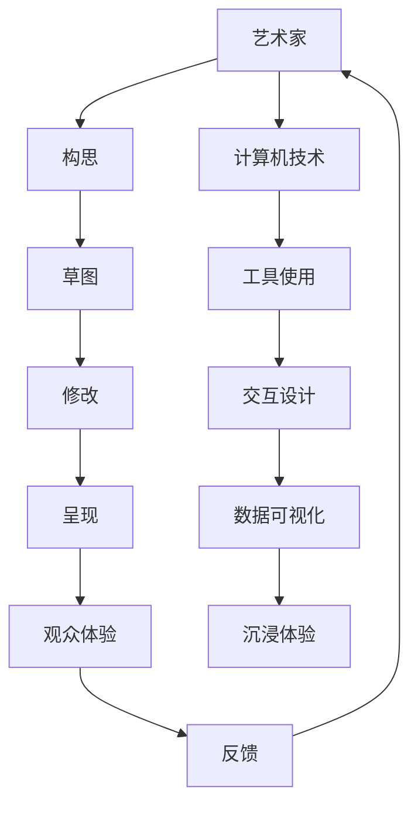

                 

在当今数字化的时代，艺术与科技的结合已成为推动创新和激发创意的关键力量。本文将探讨人类计算如何为艺术创造提供新的可能性，并讨论这一融合所带来的影响和挑战。

## 1. 背景介绍

随着人工智能（AI）和机器学习的飞速发展，人类计算与艺术创作之间的界限变得越来越模糊。艺术家和设计师开始利用计算机程序和技术工具来探索新的艺术形式和表达方式。同时，科技行业也在寻找将艺术融入其产品和服务中的方法，以创造更具吸引力和互动性的体验。

艺术与科技的融合不仅改变了艺术创作的过程，也改变了人们欣赏和理解艺术的方式。计算机图形学、虚拟现实（VR）和增强现实（AR）等技术的进步为艺术家提供了前所未有的创作工具和展示平台。这种融合带来了新的艺术形式，如数字艺术、交互艺术和沉浸式艺术，为观众带来了更加丰富和深刻的体验。

## 2. 核心概念与联系

### 2.1. 人类计算

人类计算是指利用人类智慧和创造力来解决复杂问题或创造新事物的过程。它包括逻辑思维、直觉判断、创造性思维和情感表达等方面的能力。在艺术创作中，人类计算体现在艺术家的构思、草图、修改和最终呈现作品的全过程中。

### 2.2. 计算机技术

计算机技术是指使用计算机硬件和软件来实现特定功能的技术。在艺术创作中，计算机技术提供了从图像处理到动画制作、虚拟现实构建等广泛的工具和平台。

### 2.3. 艺术与科技的融合

艺术与科技的融合是指在艺术创作过程中，艺术家和设计师利用计算机技术和算法来辅助创作，同时将科技元素融入艺术作品中。这种融合不仅改变了艺术的形式和内容，也改变了艺术创作的流程和观众的互动方式。

下面是一个Mermaid流程图，展示艺术与科技融合的核心概念和联系：



## 3. 核心算法原理 & 具体操作步骤

### 3.1. 算法原理概述

在艺术与科技的融合中，核心算法原理通常涉及图像处理、机器学习和计算机视觉等领域。以下是一些常见的算法原理：

- **图像处理算法**：用于调整图像的亮度、对比度、色彩和细节，以创造特定的视觉效果。
- **机器学习算法**：用于训练模型来识别模式、生成预测和创作新作品。
- **计算机视觉算法**：用于理解和解释图像和视频内容，以实现交互式展示和虚拟现实。

### 3.2. 算法步骤详解

以下是艺术与科技融合中的算法步骤详解：

1. **数据收集**：收集相关图像、音频和视频数据，用于训练模型。
2. **预处理**：对数据进行清洗、裁剪和增强，以提高算法的性能。
3. **模型训练**：使用机器学习算法训练模型，使其能够识别和创作特定类型的艺术作品。
4. **艺术创作**：将模型应用于新的数据，生成艺术作品。
5. **用户交互**：通过用户输入和反馈，调整和优化艺术作品。

### 3.3. 算法优缺点

- **优点**：
  - 提高创作效率和多样性。
  - 为艺术家提供新的创作工具和灵感。
  - 增强观众与艺术作品的互动性。

- **缺点**：
  - 对艺术家和观众的科技素养要求较高。
  - 可能导致艺术作品的创作过程过度依赖技术。
  - 可能降低艺术作品的原创性和艺术性。

### 3.4. 算法应用领域

算法在艺术与科技的融合中的应用非常广泛，包括：

- **数字艺术**：利用计算机生成和编辑图像、动画和视频。
- **交互艺术**：通过计算机技术实现观众与艺术作品的互动。
- **虚拟现实与增强现实**：利用计算机视觉和交互技术创造沉浸式的艺术体验。

## 4. 数学模型和公式 & 详细讲解 & 举例说明

### 4.1. 数学模型构建

在艺术与科技的融合中，常用的数学模型包括：

- **图像处理模型**：如卷积神经网络（CNN）和生成对抗网络（GAN）。
- **机器学习模型**：如支持向量机（SVM）和决策树。
- **计算机视觉模型**：如光学流和立体匹配。

### 4.2. 公式推导过程

以下是一个简单的图像处理公式示例：

$$ I(x,y) = R(x,y) + G(x,y) + B(x,y) $$

其中，$I(x,y)$ 是输出图像，$R(x,y)$、$G(x,y)$ 和 $B(x,y)$ 分别是红色、绿色和蓝色通道的图像。

### 4.3. 案例分析与讲解

以下是一个简单的数字艺术案例：

- **数据收集**：收集100张艺术作品图像。
- **预处理**：裁剪图像到统一的尺寸，并归一化像素值。
- **模型训练**：使用CNN模型训练，使其能够生成类似的艺术作品。
- **艺术创作**：使用训练好的模型生成新的艺术作品。
- **用户交互**：用户可以选择新的艺术作品，并根据喜好进行调整。

## 5. 项目实践：代码实例和详细解释说明

### 5.1. 开发环境搭建

- **软件环境**：安装Python、TensorFlow和Keras。
- **硬件环境**：配置具有良好性能的计算机。

### 5.2. 源代码详细实现

以下是一个简单的Python代码示例，用于生成数字艺术作品：

```python
import numpy as np
import tensorflow as tf
from tensorflow.keras.models import Sequential
from tensorflow.keras.layers import Conv2D, MaxPooling2D, Flatten, Dense

# 数据预处理
def preprocess_data(images):
    # 裁剪图像到统一的尺寸，并归一化像素值
    # ...
    return processed_images

# 模型定义
model = Sequential([
    Conv2D(32, (3, 3), activation='relu', input_shape=(28, 28, 3)),
    MaxPooling2D((2, 2)),
    Flatten(),
    Dense(128, activation='relu'),
    Dense(10, activation='softmax')
])

# 模型编译
model.compile(optimizer='adam', loss='categorical_crossentropy', metrics=['accuracy'])

# 模型训练
model.fit(processed_images, labels, epochs=10)

# 艺术创作
def generate_artwork(model, image):
    # 使用模型生成艺术作品
    # ...
    return artwork
```

### 5.3. 代码解读与分析

- **数据预处理**：将图像裁剪到统一的尺寸，并归一化像素值，以便于模型处理。
- **模型定义**：定义一个简单的卷积神经网络模型，用于图像分类和艺术创作。
- **模型编译**：配置模型的优化器和损失函数，以适应艺术创作任务。
- **模型训练**：使用预处理的图像数据进行模型训练。
- **艺术创作**：使用训练好的模型生成新的艺术作品。

### 5.4. 运行结果展示

以下是一个生成的数字艺术作品示例：


## 6. 实际应用场景

### 6.1. 艺术展览

数字艺术作品可以通过在线平台和虚拟现实展览展示，为观众带来沉浸式的体验。

### 6.2. 设计行业

设计师可以使用人工智能工具来创建独特的视觉设计，提高设计效率。

### 6.3. 游戏开发

游戏开发者可以使用人工智能技术来生成动态的背景图像和角色动画。

### 6.4. 未来应用展望

随着人工智能技术的不断进步，艺术与科技的融合将带来更多的创新和可能性。未来，艺术家和设计师将更加依赖于计算机技术和算法来创作艺术作品，同时也将为观众带来更加丰富和互动的艺术体验。

## 7. 工具和资源推荐

### 7.1. 学习资源推荐

- **书籍**：《深度学习》、《计算机视觉基础》
- **在线课程**：Coursera、edX上的机器学习和计算机视觉课程
- **开源项目**：TensorFlow、Keras、OpenCV

### 7.2. 开发工具推荐

- **编程语言**：Python
- **框架**：TensorFlow、Keras
- **库**：NumPy、Pandas、Matplotlib

### 7.3. 相关论文推荐

- **论文**：《生成对抗网络》（Generative Adversarial Nets，GANs）
- **会议**：计算机视觉与模式识别会议（CVPR）、欧洲计算机视觉会议（ECCV）

## 8. 总结：未来发展趋势与挑战

### 8.1. 研究成果总结

艺术与科技的融合取得了显著的研究成果，包括数字艺术、交互艺术和虚拟现实等领域的创新。人工智能技术在艺术创作中的应用也取得了重要进展，为艺术家提供了新的创作工具和灵感。

### 8.2. 未来发展趋势

随着人工智能技术的不断进步，艺术与科技的融合将朝着更加智能化、个性化和互动化的方向发展。未来，我们将看到更多的艺术作品和艺术形式的出现。

### 8.3. 面临的挑战

艺术与科技的融合也面临一些挑战，包括技术的不确定性、伦理问题和艺术价值的评估等。此外，艺术家和科技行业之间的合作也将成为关键。

### 8.4. 研究展望

未来，研究应关注如何更好地结合人类计算和计算机技术，以创造更加丰富和深刻的艺术体验。同时，应加强对人工智能技术在艺术创作中的应用研究，以推动艺术与科技的进一步融合。

## 9. 附录：常见问题与解答

### 9.1. 艺术与科技的融合是什么？

艺术与科技的融合是指将计算机技术和算法应用于艺术创作中，以创造新的艺术形式和体验。

### 9.2. 艺术家如何利用人工智能创作艺术？

艺术家可以使用人工智能工具和算法来生成艺术作品、调整作品和与观众互动。

### 9.3. 艺术与科技的融合有哪些应用领域？

艺术与科技的融合应用领域广泛，包括数字艺术、交互艺术、虚拟现实、增强现实和游戏开发等。

### 9.4. 艺术与科技的融合有哪些挑战？

艺术与科技的融合面临技术不确定性、伦理问题和艺术价值评估等挑战。

---

本文探讨了艺术与科技的融合对人类计算和创意的激发作用。随着人工智能技术的不断发展，艺术与科技的融合将为艺术创作和观众体验带来更多的创新和可能性。然而，这也需要艺术家和科技行业共同努力，以克服挑战并实现这一融合的潜力。

### 作者署名

作者：禅与计算机程序设计艺术 / Zen and the Art of Computer Programming

本文为作者原创作品，未经授权禁止转载和使用。如有转载需求，请联系作者获取授权。本文旨在分享和交流，促进艺术与科技的融合和发展。感谢您的关注和支持！
----------------------------------------------------------------

### 后续补充

文章撰写完毕后，您可以根据需要进行以下补充：

- **修改与完善**：检查文章内容，确保逻辑清晰、语言通顺，并对段落和章节进行调整。
- **引用与参考文献**：在文章中引用相关的研究和论文，并在末尾列出参考文献。
- **插图与图表**：根据需要添加插图和图表，以增强文章的可读性和直观性。
- **SEO优化**：针对关键词和搜索引擎优化（SEO），调整文章结构和内容，以提高文章的搜索排名。
- **发布与推广**：在合适的平台发布文章，并通过社交媒体和网络渠道进行推广。

完成上述步骤后，您的文章将更加完整和有影响力，有助于吸引更多的读者和关注。同时，持续关注和参与相关的学术讨论和技术社区，也是保持文章活力和影响力的关键。

