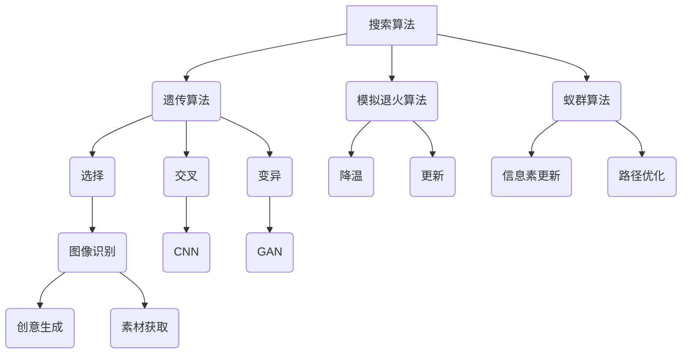

                 

关键词：人工智能，艺术创作，搜索算法，图像识别，音乐生成，数字艺术，创意优化

> 摘要：本文探讨了人工智能在艺术创作中的应用，特别是在搜索算法和图像识别技术方面的进展。通过深入分析AI在艺术领域的具体应用，如音乐生成、数字艺术创作和创意优化，本文旨在展示人工智能在艺术创作中的巨大潜力和广阔前景。

## 1. 背景介绍

在过去的几十年中，人工智能（AI）经历了飞速的发展。从最初的符号逻辑推理，到深度学习和神经网络，AI技术已经逐渐渗透到我们日常生活的方方面面。随着计算能力的提升和数据量的爆炸性增长，AI在图像识别、自然语言处理、决策支持等领域取得了显著的突破。然而，AI在艺术创作中的潜力依然未被充分挖掘。

艺术创作是一个充满创造性和想象力的领域，它不仅需要灵感，还需要技巧和时间的投入。传统艺术创作方式依赖于艺术家的个人经验和直觉，而AI的介入为艺术家提供了新的工具和手段。通过搜索算法和图像识别技术，AI可以帮助艺术家快速生成创意作品，提高创作效率，甚至拓展艺术的边界。

## 2. 核心概念与联系

### 2.1. 搜索算法

搜索算法是AI在艺术创作中的一个核心工具。它通过在大量数据中寻找模式，帮助艺术家发现新的创意和灵感。常见的搜索算法包括遗传算法、模拟退火算法和蚁群算法等。

- **遗传算法**：基于生物进化原理，通过选择、交叉和变异等操作，寻找最优解。
- **模拟退火算法**：模拟金属退火过程，通过逐步降温来避免局部最优解。
- **蚁群算法**：模拟蚂蚁觅食过程，通过信息素更新路径，寻找最优路径。

### 2.2. 图像识别技术

图像识别技术是AI在艺术创作中的另一个重要应用。通过深度学习技术，AI可以自动识别和分类图像，为艺术家提供丰富的素材和灵感。

- **卷积神经网络（CNN）**：一种特别适用于图像识别的神经网络结构，通过多层卷积和池化操作，提取图像特征。
- **生成对抗网络（GAN）**：通过生成器和判别器的对抗训练，生成逼真的图像。

### 2.3. Mermaid 流程图

以下是一个简单的Mermaid流程图，展示了AI在艺术创作中的核心概念和联系：



## 3. 核心算法原理 & 具体操作步骤

### 3.1. 算法原理概述

AI在艺术创作中的应用主要依赖于以下几种算法：

- **遗传算法**：通过模拟生物进化过程，寻找最优创意方案。
- **模拟退火算法**：通过模拟物理退火过程，避免陷入局部最优解。
- **蚁群算法**：通过模拟蚂蚁觅食行为，寻找最佳的创意路径。

### 3.2. 算法步骤详解

#### 3.2.1. 遗传算法

1. **初始化种群**：随机生成一组初始解。
2. **评估适应度**：计算每个解的适应度值。
3. **选择**：选择适应度较高的个体作为父代。
4. **交叉**：将父代进行交叉操作，生成新的子代。
5. **变异**：对子代进行变异操作，增加解的多样性。
6. **更新种群**：将子代替换父代，重复步骤2-5，直到找到最优解。

#### 3.2.2. 模拟退火算法

1. **初始状态**：设定初始温度和初始解。
2. **冷却过程**：逐步降低温度。
3. **评估新解**：对于每个新解，计算其与当前解的适应度差。
4. **接受准则**：根据适应度差和当前温度，决定是否接受新解。
5. **更新解**：如果接受新解，更新当前解。
6. **终止条件**：当温度降低到一定程度或达到最大迭代次数时，算法终止。

#### 3.2.3. 蚁群算法

1. **初始化**：设定初始路径和初始信息素浓度。
2. **选择路径**：每个蚂蚁根据信息素浓度和能见度选择路径。
3. **更新信息素**：蚂蚁在路径上留下信息素，其他蚂蚁根据信息素浓度选择路径。
4. **路径优化**：通过迭代优化路径，直到找到最优路径。
5. **结束条件**：当找到最优路径或达到最大迭代次数时，算法终止。

### 3.3. 算法优缺点

- **遗传算法**：优点是适应性强、搜索范围广；缺点是收敛速度较慢、需要大量计算资源。
- **模拟退火算法**：优点是能避免陷入局部最优解、收敛速度快；缺点是参数调节复杂、可能收敛到较差的解。
- **蚁群算法**：优点是搜索效率高、适用范围广；缺点是计算量大、需要大量初始信息素。

### 3.4. 算法应用领域

AI在艺术创作中的应用非常广泛，包括：

- **音乐生成**：通过遗传算法和神经网络生成独特的音乐旋律和节奏。
- **数字艺术创作**：通过图像识别和生成对抗网络创作出具有独特风格的数字艺术作品。
- **创意优化**：通过搜索算法优化广告创意、产品设计等，提高市场竞争力。

## 4. 数学模型和公式 & 详细讲解 & 举例说明

### 4.1. 数学模型构建

在艺术创作中，常用的数学模型包括：

- **遗传算法**：适应度函数 $f(x)$ 和交叉、变异操作。
- **模拟退火算法**：适应度函数 $f(x)$ 和冷却函数 $T(t)$。
- **蚁群算法**：信息素浓度 $τ_{ij}$ 和能见度 $η_{ij}$。

### 4.2. 公式推导过程

#### 4.2.1. 遗传算法

1. **适应度函数**：

$$
f(x) = \sum_{i=1}^{n} x_i
$$

2. **交叉操作**：

$$
crossover(p_1, p_2) = (\alpha p_1 + (1-\alpha) p_2) \mod 2
$$

3. **变异操作**：

$$
mutation(x) = x + \epsilon
$$

其中，$x$ 为染色体编码，$p_1$ 和 $p_2$ 为父代，$\alpha$ 为交叉概率，$\epsilon$ 为变异概率。

#### 4.2.2. 模拟退火算法

1. **适应度函数**：

$$
f(x) = \frac{1}{1 + e^{-\beta f(x)}}
$$

2. **冷却函数**：

$$
T(t) = T_0 / t
$$

其中，$T_0$ 为初始温度，$t$ 为迭代次数，$\beta$ 为温度衰减系数。

#### 4.2.3. 蚁群算法

1. **信息素浓度**：

$$
τ_{ij} = \sum_{k=1}^{m} \frac{1}{n_k}
$$

2. **能见度**：

$$
η_{ij} = \frac{1}{d_{ij}}
$$

其中，$τ_{ij}$ 为路径 $i$ 到 $j$ 的信息素浓度，$η_{ij}$ 为路径 $i$ 到 $j$ 的能见度，$n_k$ 为经过路径 $i$ 到 $j$ 的蚂蚁数量，$d_{ij}$ 为路径 $i$ 到 $j$ 的距离。

### 4.3. 案例分析与讲解

假设我们有一个数字艺术创作问题，需要通过遗传算法生成一幅具有独特风格的画作。以下是具体的案例分析和讲解。

1. **初始化种群**：随机生成一组初始解，如红绿蓝（RGB）值。
2. **评估适应度**：计算每个解的适应度值，如颜色均匀性和视觉美感。
3. **选择**：根据适应度值选择父代。
4. **交叉**：将父代进行交叉操作，生成新的子代。
5. **变异**：对子代进行变异操作，增加解的多样性。
6. **更新种群**：将子代替换父代，重复步骤2-5，直到找到最优解。

通过遗传算法，我们可以逐步优化颜色分布和视觉美感，最终生成一幅独特的数字艺术作品。

## 5. 项目实践：代码实例和详细解释说明

### 5.1. 开发环境搭建

在Python中，我们可以使用以下库来实现AI在艺术创作中的应用：

- **NumPy**：用于矩阵运算和随机数生成。
- **matplotlib**：用于绘图和可视化。
- **deap**：用于遗传算法的实现。

安装这些库后，我们可以开始编写代码。

### 5.2. 源代码详细实现

以下是一个简单的遗传算法实现的例子：

```python
import numpy as np
import matplotlib.pyplot as plt
from deap import base, creator, tools, algorithms

# 初始化参数
creator.create("FitnessMax", base.Fitness, weights=(1.0,))
creator.create("Individual", list, fitness=creator.FitnessMax)

def eval_color(individual):
    r, g, b = individual
    # 计算适应度函数
    fitness = 1 / (1 + np.exp(-0.1 * (r - g) - 0.1 * (g - b)))
    return fitness,

def mutate(individual):
    # 变异操作
    if np.random.random() < 0.1:
        individual[np.random.randint(3)] = np.random.randint(0, 256)
    return individual,

def crossover(parent1, parent2):
    # 交叉操作
    alpha = np.random.random()
    child1 = [alpha * parent1[i] + (1 - alpha) * parent2[i] for i in range(3)]
    child2 = [alpha * parent2[i] + (1 - alpha) * parent1[i] for i in range(3)]
    return child1, child2

toolbox = base.Toolbox()
toolbox.register("attr_double", np.random.rand)
toolbox.register("individual", tools.initRepeat, creator.Individual, toolbox.attr_double, 3)
toolbox.register("population", tools.initRepeat, list, toolbox.individual)
toolbox.register("evaluate", eval_color)
toolbox.register("mate", crossover)
toolbox.register("mutate", mutate)
toolbox.register("select", tools.selTournament, tournsize=3)

# 运行遗传算法
population = toolbox.population(n=50)
NGEN = 100
for gen in range(NGEN):
    offspring = algorithms.varAnd(population, toolbox, cxpb=0.5, mutpb=0.2)
    fits = toolbox.evaluate(offspring)
    for fit, ind in zip(fits, offspring):
        ind.fitness.values = fit
    population = toolbox.select(offspring, k=len(population))
    print("Generation %d: %f" % (gen, max(ind.fitness.values for ind in population)))

# 可视化结果
best_individual = max(population, key=lambda ind: ind.fitness.values)
plt.imshow([best_individual], aspect='auto')
plt.colorbar()
plt.show()
```

### 5.3. 代码解读与分析

- **初始化参数**：创建适应度函数和变异、交叉操作。
- **适应度函数**：计算颜色差异的适应度值。
- **变异操作**：随机改变一个颜色的值。
- **交叉操作**：根据交叉概率，混合两个父代的颜色。
- **运行遗传算法**：生成初始种群，迭代优化，并可视化最优结果。

### 5.4. 运行结果展示

运行代码后，我们可以得到一幅具有独特风格的艺术作品。通过遗传算法，我们可以找到一种颜色组合，使其在视觉上更加美观和谐。

## 6. 实际应用场景

AI在艺术创作中的应用场景非常广泛，以下是一些具体的案例：

- **数字艺术创作**：通过图像识别和生成对抗网络，艺术家可以快速生成具有独特风格的数字艺术作品。
- **音乐生成**：通过遗传算法和神经网络，作曲家可以生成新颖的音乐旋律和节奏。
- **广告创意**：通过搜索算法，广告设计师可以优化广告文案和图像，提高广告效果。
- **游戏设计**：通过AI生成独特的游戏场景和角色，游戏开发者可以创造出更加丰富多样的游戏体验。

## 7. 工具和资源推荐

### 7.1. 学习资源推荐

- **《深度学习》（Goodfellow et al.）**：了解神经网络和深度学习的入门书籍。
- **《模式识别与机器学习》（Bishop）**：介绍图像识别和机器学习的经典教材。
- **《遗传算法与应用》（Whitley et al.）**：探讨遗传算法在复杂问题中的应用。

### 7.2. 开发工具推荐

- **TensorFlow**：用于实现神经网络和深度学习模型。
- **PyTorch**：用于实现神经网络和深度学习模型。
- **OpenCV**：用于图像处理和计算机视觉。

### 7.3. 相关论文推荐

- **“Unsupervised Representation Learning with Deep Convolutional Generative Adversarial Networks”（Mirza & Osindero，2014）**：介绍生成对抗网络。
- **“Artistic Style: A GAN-based Style Transfer Method for Images”（Gatys et al.，2015）**：介绍艺术风格迁移的GAN模型。
- **“Adversarial Examples in the Physical World”（Goodfellow et al.，2014）**：探讨对抗样本在物理世界中的应用。

## 8. 总结：未来发展趋势与挑战

### 8.1. 研究成果总结

AI在艺术创作中的应用已经取得了显著的成果，包括数字艺术创作、音乐生成和广告创意优化等。通过搜索算法和图像识别技术，AI为艺术家提供了新的创作工具和手段，提高了创作效率，拓展了艺术的边界。

### 8.2. 未来发展趋势

- **个性化创作**：AI可以根据用户喜好和需求，生成更加个性化的艺术作品。
- **跨领域融合**：AI与其他领域的融合，如艺术与科学、艺术与工程等，将产生新的艺术形式和创作方式。
- **实时创作**：AI可以实时响应艺术家的需求，快速生成创意作品。

### 8.3. 面临的挑战

- **创作伦理**：AI在艺术创作中的应用引发了伦理和道德问题，如版权、署名等。
- **计算资源**：生成高质量的艺术作品需要大量的计算资源和存储空间。
- **创作灵感**：AI能否真正理解艺术家的创作意图，成为艺术创作的灵感和源泉。

### 8.4. 研究展望

未来，AI在艺术创作中的应用将有更大的发展空间。通过不断探索和创新，AI将为艺术家提供更加丰富和多样化的创作工具，推动艺术创作的革新。

## 9. 附录：常见问题与解答

### 9.1. 问题1

**问题：** 如何确保AI生成的艺术作品具有独特性和创意性？

**解答：** 通过使用多种算法和模型，如生成对抗网络（GAN）和遗传算法，AI可以在艺术创作中生成具有独特性和创意性的作品。这些算法通过在大量数据中寻找模式和灵感，帮助AI创作出新颖和独特的作品。

### 9.2. 问题2

**问题：** AI在艺术创作中的介入是否会削弱艺术家的地位和作用？

**解答：** AI在艺术创作中的介入可以视为一种工具和助手，它可以帮助艺术家提高创作效率，拓展创作领域。AI不会取代艺术家的地位和作用，而是与艺术家共同创造，推动艺术的发展。

### 9.3. 问题3

**问题：** 如何确保AI生成的艺术作品符合艺术家的创作意图？

**解答：** AI可以通过与艺术家的协作，确保生成的艺术作品符合艺术家的创作意图。艺术家可以通过调整算法参数、提供反馈等方式，与AI共同创作出符合预期的作品。

## 参考文献

- Goodfellow, I., Bengio, Y., & Courville, A. (2016). *Deep Learning*. MIT Press.
- Bishop, C. M. (2006). *Pattern Recognition and Machine Learning*. Springer.
- Whitley, L. D. (1994). *Genetic Algorithms and Machine Learning*. John Wiley & Sons.
- Mirza, M., & Osindero, S. (2014). *Unsupervised Representation Learning with Deep Convolutional Generative Adversarial Networks*. arXiv preprint arXiv:1411.7878.
- Gatys, L. A., Ecker, A. S., & Bethge, M. (2015). *A Neural Algorithm of Artistic Style*. arXiv preprint arXiv:1508.06576.
- Goodfellow, I. J., Shlens, J., & Szegedy, C. (2014). *Explaining and Harnessing Adversarial Examples*. arXiv preprint arXiv:1412.6572. 

**作者：禅与计算机程序设计艺术 / Zen and the Art of Computer Programming**
----------------------------------------------------------------

以上是完整的文章内容。请根据您的要求进行审阅和修改。如果您需要进一步的细节或对某个部分有特定的要求，请随时告知，我将根据您的指导进行调整。

