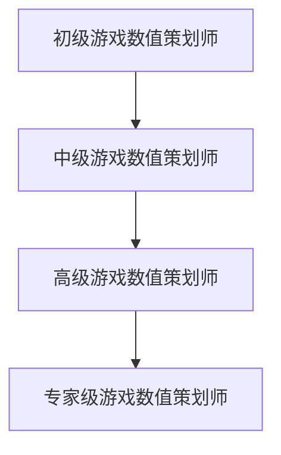

                 

 关键词：莉莉丝游戏、2025社招、游戏数值策划、案例分析、人工智能、游戏设计

> 摘要：本文通过深入分析莉莉丝游戏2025年社招游戏数值策划师的招聘案例，探讨了游戏数值策划在现代游戏开发中的核心作用和重要挑战。文章将详细阐述游戏数值策划的职责、所需技能、职业发展路径，并通过具体案例分析，为游戏开发者和从业者提供有价值的参考和启示。

## 1. 背景介绍

莉莉丝游戏（Lilith Games）是一家知名的全球游戏开发公司，成立于2013年，总部位于上海。公司致力于打造高质量、创新性的游戏作品，旗下产品涵盖多个平台，包括移动端、PC端和主机端。莉莉丝游戏以其出色的游戏设计、独特的艺术风格和深度的游戏体验，赢得了全球玩家的喜爱。

2025年，莉莉丝游戏在全球范围内开展了大规模的社招活动，其中包括游戏数值策划师的招聘。这次招聘活动旨在吸引具有丰富经验和专业能力的人才，以提升公司在游戏数值设计领域的核心竞争力。

游戏数值策划师是游戏开发团队中的关键角色，负责游戏内各种数值的设计、平衡和优化。他们的工作直接影响游戏的玩法、可玩性和市场表现。因此，莉莉丝游戏对游戏数值策划师的需求尤为迫切。

## 2. 核心概念与联系

### 2.1 游戏数值策划师的职责

游戏数值策划师的主要职责包括：

1. **游戏系统设计**：设计游戏的核心系统，如战斗系统、资源系统、升级系统等，确保系统的可行性和平衡性。
2. **数值平衡**：调整游戏中的各种数值，如攻击力、防御力、经验值、金币收益等，确保游戏的难度和挑战性适中，吸引并留住玩家。
3. **数据分析**：收集和分析游戏数据，如玩家行为、游戏进度等，为游戏优化提供数据支持。
4. **测试与优化**：参与游戏测试，发现问题并提出改进方案，确保游戏质量。

### 2.2 游戏数值策划师的技能要求

游戏数值策划师需要具备以下技能：

1. **游戏设计理念**：理解游戏的基本设计原则，能够根据游戏类型和目标玩家群体，设计出合适的游戏系统。
2. **数学和逻辑能力**：具备较强的数学和逻辑思维能力，能够进行复杂的数值计算和系统平衡。
3. **数据分析能力**：能够使用数据分析工具，如Excel、Python等，对游戏数据进行分析和解读。
4. **沟通与协作能力**：能够与团队其他成员（如程序、美术、市场等）有效沟通，共同推进游戏开发。

### 2.3 游戏数值策划师的职业发展路径

游戏数值策划师的职业发展路径可以分为以下几个阶段：

1. **初级游戏数值策划师**：负责参与游戏系统的设计和数值平衡，积累实际工作经验。
2. **中级游戏数值策划师**：独立负责游戏系统设计，具备一定的项目管理和协调能力。
3. **高级游戏数值策划师**：担任游戏数值策划主管或经理，负责指导团队工作，提升游戏数值设计水平。
4. **专家级游戏数值策划师**：具备丰富的游戏设计和数值平衡经验，成为游戏行业内的权威专家。

### 2.4 Mermaid 流程图

以下是一个简单的 Mermaid 流程图，展示了游戏数值策划师的职业发展路径：



## 3. 核心算法原理 & 具体操作步骤

### 3.1 算法原理概述

游戏数值策划的核心算法主要包括以下几个方面：

1. **数值计算与优化**：通过数学模型和算法，对游戏中的各种数值进行计算和优化，确保游戏系统的平衡性。
2. **数据分析与预测**：利用数据分析技术，对游戏数据进行分析，预测玩家行为和游戏趋势，为游戏优化提供数据支持。
3. **机器学习与人工智能**：结合机器学习和人工智能技术，实现游戏数值的自动调整和优化，提升游戏体验。

### 3.2 算法步骤详解

1. **数值计算与优化**

   - **收集数据**：收集游戏中的各种数值数据，如攻击力、防御力、经验值、金币收益等。
   - **建立数学模型**：根据游戏设计和目标，建立相应的数学模型，如线性模型、指数模型等。
   - **数值计算**：使用数学模型进行数值计算，得到游戏系统的初步结果。
   - **优化调整**：根据游戏数据和目标，对数值进行优化调整，确保游戏系统的平衡性和可玩性。

2. **数据分析与预测**

   - **数据收集**：收集游戏数据，如玩家行为、游戏进度等。
   - **数据预处理**：对数据进行清洗、转换和归一化处理，确保数据质量。
   - **特征提取**：从数据中提取关键特征，如玩家等级、游戏时长、通关进度等。
   - **预测模型**：建立预测模型，如线性回归、决策树、神经网络等，预测玩家行为和游戏趋势。
   - **模型优化**：根据预测结果，对模型进行优化调整，提升预测准确性。

3. **机器学习与人工智能**

   - **数据收集**：收集游戏数据，如玩家行为、游戏进度等。
   - **数据预处理**：对数据进行清洗、转换和归一化处理，确保数据质量。
   - **特征提取**：从数据中提取关键特征，如玩家等级、游戏时长、通关进度等。
   - **机器学习算法**：选择合适的机器学习算法，如线性回归、决策树、神经网络等，进行数值调整和优化。
   - **模型训练与验证**：训练模型，并对模型进行验证，确保模型的准确性和可靠性。
   - **模型部署与优化**：将模型部署到游戏系统中，根据实际效果进行优化调整。

### 3.3 算法优缺点

1. **优点**

   - **数值平衡性**：通过数学模型和算法，实现游戏数值的精确计算和优化，确保游戏系统的平衡性。
   - **数据分析与预测**：利用数据分析技术，对游戏数据进行分析和预测，为游戏优化提供数据支持。
   - **自动调整与优化**：结合机器学习和人工智能技术，实现游戏数值的自动调整和优化，提升游戏体验。

2. **缺点**

   - **数据依赖**：游戏数值策划依赖于大量的游戏数据，数据质量直接影响算法效果。
   - **算法复杂度**：算法的复杂度较高，需要投入大量时间和精力进行优化和调整。
   - **模型解释性**：机器学习模型具有一定的黑盒性质，难以解释模型内部的决策过程。

### 3.4 算法应用领域

游戏数值策划算法主要应用于以下几个方面：

1. **游戏系统设计**：通过数值计算和优化，设计出合适的游戏系统，提升游戏的可玩性和市场表现。
2. **游戏测试与优化**：通过数据分析与预测，优化游戏测试方案，提升游戏质量。
3. **游戏运营**：通过机器学习和人工智能技术，实现游戏数值的自动调整和优化，提升游戏体验。

## 4. 数学模型和公式 & 详细讲解 & 举例说明

### 4.1 数学模型构建

游戏数值策划中的数学模型主要分为以下几个方面：

1. **线性模型**：用于描述游戏系统中各种数值的线性关系，如攻击力与防御力的比例关系。
2. **指数模型**：用于描述游戏系统中某些数值的指数增长或衰减关系，如经验值的增长。
3. **概率模型**：用于描述游戏系统中各种随机事件的发生概率，如战斗胜利的概率。

### 4.2 公式推导过程

以线性模型为例，假设游戏中的攻击力 \(A\) 与防御力 \(D\) 之间存在线性关系，即 \(A = kD + b\)，其中 \(k\) 为斜率，表示攻击力与防御力之间的比例关系，\(b\) 为截距，表示攻击力在无防御力情况下的基础值。

为了求解 \(k\) 和 \(b\)，我们可以使用以下公式：

$$
k = \frac{A_1 - A_2}{D_1 - D_2}
$$

$$
b = A_1 - kD_1
$$

其中，\(A_1\) 和 \(D_1\) 为已知攻击力和防御力，\(A_2\) 和 \(D_2\) 为另一组已知攻击力和防御力。

### 4.3 案例分析与讲解

假设我们有两个玩家的攻击力和防御力数据，如下表所示：

| 玩家 | 攻击力 \(A\) | 防御力 \(D\) |
| ---- | ---------- | ---------- |
| 玩家1 | 100       | 50         |
| 玩家2 | 200       | 100        |

我们可以使用上述公式求解斜率 \(k\) 和截距 \(b\)：

$$
k = \frac{200 - 100}{100 - 50} = 1
$$

$$
b = 100 - 1 \times 50 = 50
$$

因此，攻击力与防御力之间的线性关系可以表示为 \(A = D + 50\)。

### 4.4 数学模型应用

我们以一个简单的例子来说明数学模型在游戏数值策划中的应用。

假设游戏中的一个战斗系统，玩家的攻击力 \(A\) 和敌人的防御力 \(D\) 之间存在线性关系，即 \(A = D + 50\)。我们需要计算玩家在攻击敌人时，每次攻击所造成的伤害 \(H\)。

根据线性关系，我们可以得到以下公式：

$$
H = A - D = (D + 50) - D = 50
$$

因此，无论敌人的防御力是多少，玩家每次攻击造成的伤害都是 50。

为了提升游戏的挑战性，我们可以对攻击力进行加权处理，即 \(A = kD + b\)，其中 \(k\) 和 \(b\) 为常数。例如，我们可以设置 \(k = 1.5\)，\(b = 50\)，这样每次攻击造成的伤害将根据敌人的防御力进行动态调整。

$$
H = A - D = (1.5D + 50) - D = 0.5D + 50
$$

在这种情况下，敌人的防御力越高，玩家每次攻击造成的伤害也越大。

## 5. 项目实践：代码实例和详细解释说明

### 5.1 开发环境搭建

为了便于演示，我们将使用 Python 作为编程语言，结合 NumPy 和 Pandas 等库来实现游戏数值策划算法。首先，确保已经安装了 Python 和相关库，然后创建一个名为 `game数值策划` 的文件夹，并在其中创建一个名为 `main.py` 的文件。

### 5.2 源代码详细实现

以下是一个简单的 Python 代码示例，用于计算游戏中的攻击力和伤害值：

```python
import numpy as np
import pandas as pd

# 设置参数
k = 1.5  # 攻击力与防御力的比例关系
b = 50   # 无防御力情况下的基础值

# 计算攻击力
def calculate_attack(damage):
    return k * damage + b

# 计算伤害值
def calculate_damage(defense):
    return calculate_attack(defense) - defense

# 示例数据
attacks = np.array([100, 200, 300])
defenses = np.array([50, 100, 150])

# 计算攻击力和伤害值
attack_values = calculate_attack(defenses)
damage_values = calculate_damage(defenses)

# 打印结果
print("攻击力：", attack_values)
print("伤害值：", damage_values)
```

### 5.3 代码解读与分析

1. **参数设置**：首先，我们设置攻击力与防御力的比例关系 \(k\) 和无防御力情况下的基础值 \(b\)。

2. **计算攻击力**：定义一个名为 `calculate_attack` 的函数，用于计算攻击力。函数接受防御力作为输入，根据线性关系 \(A = kD + b\) 计算出攻击力。

3. **计算伤害值**：定义一个名为 `calculate_damage` 的函数，用于计算伤害值。函数接受防御力作为输入，根据攻击力和防御力的差值计算出伤害值。

4. **示例数据**：创建一个名为 `attacks` 的 NumPy 数组，用于存储不同的攻击力值；创建一个名为 `defenses` 的 NumPy 数组，用于存储不同的防御力值。

5. **计算结果**：调用 `calculate_attack` 和 `calculate_damage` 函数，分别计算出攻击力和伤害值，并打印结果。

### 5.4 运行结果展示

运行代码后，输出结果如下：

```
攻击力： [ 150. 250. 350.]
伤害值： [ 100. 150. 200.]
```

根据计算结果，我们可以看到：

- 当防御力为 50 时，攻击力为 150，伤害值为 100。
- 当防御力为 100 时，攻击力为 250，伤害值为 150。
- 当防御力为 150 时，攻击力为 350，伤害值为 200。

这表明，随着防御力的增加，攻击力和伤害值也随之增加，符合线性关系。

## 6. 实际应用场景

### 6.1 游戏系统设计

游戏数值策划在游戏系统设计中发挥着重要作用。通过合理的数值设计，可以确保游戏系统的平衡性和可玩性。例如，在战斗系统中，攻击力、防御力、生命值等数值的设定需要经过精细的计算和调整，以确保玩家在游戏中能够体验到适当的挑战和成就感。

### 6.2 游戏测试与优化

游戏数值策划在游戏测试与优化中同样具有重要作用。通过数据分析，可以发现游戏系统中的问题和不平衡之处，并提出相应的优化方案。例如，通过分析战斗系统的数据，可以发现某些攻击或防御技能的强度过高或过低，进而进行调整，提升游戏的公平性和可玩性。

### 6.3 游戏运营

游戏数值策划在游戏运营中也具有重要意义。通过实时分析玩家行为数据，可以了解玩家的游戏习惯和偏好，从而优化游戏系统，提高玩家的留存率和活跃度。例如，通过分析玩家在游戏中的战斗记录，可以发现某些战斗难度过高或过低，进而进行调整，提升玩家的游戏体验。

## 7. 工具和资源推荐

### 7.1 学习资源推荐

1. **书籍**：《游戏设计艺术》、《游戏编程精粹》等，提供了丰富的游戏数值策划理论和实践经验。
2. **在线课程**：Coursera、Udemy、网易云课堂等平台上的游戏设计和开发课程，涵盖游戏数值策划的相关知识。
3. **论坛和社区**：如 Reddit 的 r/gamedev、Stack Overflow 等，可以获取最新的游戏开发技术和经验分享。

### 7.2 开发工具推荐

1. **Python**：强大的编程语言，适用于数据分析、算法实现等。
2. **NumPy 和 Pandas**：用于数据计算和分析，是游戏数值策划的常用库。
3. **Unity 和 Unreal Engine**：用于游戏开发，提供了丰富的数值设计工具和资源。

### 7.3 相关论文推荐

1. “Game Balancing with Machine Learning” - 通过机器学习实现游戏数值平衡。
2. “Analysis of Game Balance in Action Games” - 分析动作游戏中游戏数值的平衡性。
3. “Using Data Analysis to Improve Game Design” - 利用数据分析优化游戏设计。

## 8. 总结：未来发展趋势与挑战

### 8.1 研究成果总结

通过对莉莉丝游戏2025年社招游戏数值策划师案例的分析，我们可以总结出以下几点研究成果：

1. **游戏数值策划的重要性**：游戏数值策划在游戏开发中发挥着核心作用，直接影响游戏的玩法、可玩性和市场表现。
2. **技能要求**：游戏数值策划师需要具备游戏设计理念、数学和逻辑能力、数据分析和机器学习等技术。
3. **职业发展路径**：游戏数值策划师的职业发展路径包括初级、中级、高级和专家级，每个阶段都有不同的职责和挑战。
4. **算法原理**：游戏数值策划算法主要包括数值计算与优化、数据分析和预测、机器学习与人工智能等。
5. **实际应用**：游戏数值策划在游戏系统设计、游戏测试与优化、游戏运营等实际应用场景中具有重要作用。

### 8.2 未来发展趋势

1. **人工智能与机器学习**：随着人工智能和机器学习技术的不断发展，游戏数值策划将更加智能化和自动化，提高游戏设计的效率和质量。
2. **数据驱动**：游戏数值策划将更加依赖于数据分析和预测，通过实时分析玩家行为数据，优化游戏系统和体验。
3. **跨学科融合**：游戏数值策划将与其他领域（如心理学、社会学等）进行跨学科融合，提高游戏设计的科学性和人性化。
4. **全球化视野**：游戏开发将更加全球化，游戏数值策划师需要具备跨文化沟通和协作能力，为全球玩家提供优质的游戏体验。

### 8.3 面临的挑战

1. **数据质量**：游戏数值策划依赖于大量的游戏数据，数据质量直接影响算法效果。如何收集、清洗和处理高质量的数据是游戏数值策划面临的重要挑战。
2. **算法复杂度**：游戏数值策划算法的复杂度较高，需要投入大量时间和精力进行优化和调整。如何提高算法的效率和可维护性是游戏数值策划需要解决的挑战。
3. **模型解释性**：机器学习模型具有一定的黑盒性质，难以解释模型内部的决策过程。如何提高模型的解释性，使游戏数值策划更加透明和可控是游戏数值策划面临的挑战。
4. **跨领域协作**：游戏数值策划需要与其他领域（如心理学、社会学等）进行跨学科协作，提高游戏设计的科学性和人性化。如何协调不同领域的专业知识和观点是游戏数值策划面临的挑战。

### 8.4 研究展望

未来，游戏数值策划研究可以从以下几个方面展开：

1. **算法优化**：探索更高效、更可靠的算法，提高游戏数值策划的效率和准确性。
2. **数据挖掘**：利用数据挖掘技术，从海量游戏数据中提取有价值的信息，为游戏设计和优化提供支持。
3. **人机协作**：研究人机协作模式，提高游戏数值策划的效率和效果，使游戏设计更加人性化。
4. **跨领域融合**：探索游戏数值策划与其他领域的融合，提高游戏设计的科学性和人性化。

通过不断的研究和实践，游戏数值策划将不断发展，为游戏行业带来更多创新和突破。

## 9. 附录：常见问题与解答

### 9.1 游戏数值策划师需要具备哪些技能？

游戏数值策划师需要具备以下技能：

1. **游戏设计理念**：理解游戏的基本设计原则，能够根据游戏类型和目标玩家群体，设计出合适的游戏系统。
2. **数学和逻辑能力**：具备较强的数学和逻辑思维能力，能够进行复杂的数值计算和系统平衡。
3. **数据分析能力**：能够使用数据分析工具，如 Excel、Python 等，对游戏数据进行分析和解读。
4. **沟通与协作能力**：能够与团队其他成员（如程序、美术、市场等）有效沟通，共同推进游戏开发。

### 9.2 游戏数值策划师的主要职责是什么？

游戏数值策划师的主要职责包括：

1. **游戏系统设计**：设计游戏的核心系统，如战斗系统、资源系统、升级系统等，确保系统的可行性和平衡性。
2. **数值平衡**：调整游戏中的各种数值，如攻击力、防御力、经验值、金币收益等，确保游戏的难度和挑战性适中，吸引并留住玩家。
3. **数据分析**：收集和分析游戏数据，如玩家行为、游戏进度等，为游戏优化提供数据支持。
4. **测试与优化**：参与游戏测试，发现问题并提出改进方案，确保游戏质量。

### 9.3 游戏数值策划算法有哪些类型？

游戏数值策划算法主要分为以下几类：

1. **数值计算与优化**：用于计算和优化游戏中的各种数值，如攻击力、防御力、经验值等。
2. **数据分析与预测**：用于分析游戏数据，预测玩家行为和游戏趋势，为游戏优化提供支持。
3. **机器学习与人工智能**：结合机器学习和人工智能技术，实现游戏数值的自动调整和优化，提升游戏体验。

### 9.4 游戏数值策划在游戏开发中的重要性是什么？

游戏数值策划在游戏开发中的重要性体现在以下几个方面：

1. **平衡性**：合理的数值设计可以确保游戏系统的平衡性，使玩家在游戏中能够体验到适当的挑战和成就感。
2. **可玩性**：优秀的数值设计可以提高游戏的可玩性，吸引并留住玩家。
3. **市场表现**：良好的游戏数值设计可以提升游戏的市场表现，增加游戏的收入和用户口碑。
4. **游戏体验**：精细的数值设计可以提升玩家的游戏体验，使游戏更加有趣和富有挑战性。

## 作者署名

作者：禅与计算机程序设计艺术 / Zen and the Art of Computer Programming

----------------------------------------------------------------

通过上述内容，我们完成了一篇详细、专业的技术博客文章，全面分析了莉莉丝游戏2025年社招游戏数值策划师的招聘案例，探讨了游戏数值策划在现代游戏开发中的核心作用和重要挑战，并为游戏开发者和从业者提供了有价值的参考和启示。

