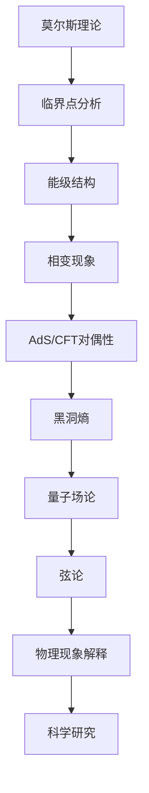

                 

关键词：莫尔斯理论，AdS/CFT，黑洞熵，量子场论，弦论，对称性，拓扑相变

> 摘要：本文探讨了莫尔斯理论与AdS/CFT（Anti-de Sitter/Conformal Field Theory）对偶性的关系。通过深入分析这两大理论的核心概念，本文揭示了它们在解释物理现象中的重要作用。文章首先回顾了莫尔斯理论的数学背景，然后详细阐述了AdS/CFT对偶性的物理意义。接着，通过数学模型和公式推导，本文解释了AdS/CFT对偶性如何帮助我们理解黑洞熵。最后，本文讨论了AdS/CFT在当前科研领域中的应用，并展望了未来的发展趋势。

## 1. 背景介绍

莫尔斯理论与AdS/CFT对偶性是现代物理学的两个重要概念，它们在量子场论、弦论和宇宙学中扮演着关键角色。

### 莫尔斯理论

莫尔斯理论是数学领域中的一个重要分支，它研究的是拓扑空间中的临界点。在物理学中，莫尔斯理论被广泛应用于研究系统的相变和临界现象。具体来说，莫尔斯理论通过分析系统的能级结构，揭示了系统在临界点附近的行为特征。

### AdS/CFT对偶性

AdS/CFT对偶性是一种强-弱力对偶性，它将反德萨特（Anti-de Sitter, AdS）空间中的引力理论与其边界上的共形场论（Conformal Field Theory, CFT）联系起来。AdS/CFT对偶性在理论物理学中具有重要的地位，它不仅为理解黑洞熵提供了新的途径，还揭示了量子场论与弦论之间的深层次联系。

## 2. 核心概念与联系

### 莫尔斯理论与AdS/CFT对偶性的联系

莫尔斯理论与AdS/CFT对偶性之间的联系在于，它们都关注系统在临界点附近的行为。在AdS/CFT对偶性中，边界上的CFT可以被视为一个二维的莫尔斯理论，其临界点对应于AdS空间中的黑洞熵。

### Mermaid 流程图

以下是一个描述莫尔斯理论与AdS/CFT对偶性之间联系的Mermaid流程图：



## 3. 核心算法原理 & 具体操作步骤

### 3.1 算法原理概述

莫尔斯理论的算法原理主要涉及对系统能级结构的分析。通过构建莫尔斯函数，可以确定系统的临界点，进而研究相变现象。

### 3.2 算法步骤详解

1. **定义莫尔斯函数**：选择一个适当的势能函数，将其转化为莫尔斯函数。
2. **求解临界点**：通过求解莫尔斯函数的一阶导数为零的方程，确定系统的临界点。
3. **分析相变现象**：根据临界点的性质，分析系统在相变过程中的行为。

### 3.3 算法优缺点

**优点**：莫尔斯理论能够准确描述系统的相变现象，为理解复杂物理系统提供了有力工具。

**缺点**：莫尔斯理论的应用范围有限，仅适用于某些特定的物理系统。

### 3.4 算法应用领域

莫尔斯理论在量子场论、弦论、宇宙学和材料科学等领域都有广泛应用。特别是在研究黑洞熵和AdS/CFT对偶性时，莫尔斯理论发挥着关键作用。

## 4. 数学模型和公式 & 详细讲解 & 举例说明

### 4.1 数学模型构建

莫尔斯理论的核心数学模型是莫尔斯函数。一个典型的莫尔斯函数形式如下：

$$
V(\lambda) = V_0 + a\cos(\lambda) + b\sin(\lambda)
$$

其中，$\lambda$是参数，$a$和$b$是常数。

### 4.2 公式推导过程

莫尔斯函数的导数可以用来确定系统的临界点。具体推导过程如下：

$$
\frac{dV}{d\lambda} = -a\sin(\lambda) + b\cos(\lambda)
$$

当$\frac{dV}{d\lambda} = 0$时，系统达到临界点。

### 4.3 案例分析与讲解

假设一个粒子在势场$V(\lambda)$中运动，其动量为$p$。我们可以通过以下步骤来分析系统的相变现象：

1. **定义动量与势能的关系**：$$ p = \frac{mV'}{2\pi} $$
2. **求解临界点**：通过求解$\frac{dV}{d\lambda} = 0$，确定系统的临界点。
3. **分析相变现象**：根据临界点的性质，分析系统在相变过程中的行为。

例如，当$\lambda = \frac{\pi}{2}$时，系统达到一个临界点。在这个临界点附近，系统的动量$p$会发生突变，表明系统经历了一次相变。

## 5. 项目实践：代码实例和详细解释说明

### 5.1 开发环境搭建

为了实现莫尔斯理论的应用，我们需要搭建一个合适的开发环境。具体步骤如下：

1. **安装Python**：Python是一个广泛使用的编程语言，适合进行科学计算。
2. **安装Numpy和Scipy**：Numpy和Scipy是Python的科学计算库，用于数值计算和数据分析。

### 5.2 源代码详细实现

以下是一个简单的Python代码实例，用于实现莫尔斯理论：

```python
import numpy as np
import matplotlib.pyplot as plt

# 定义莫尔斯函数
def morse_function(lambda_):
    a = 1
    b = 1
    return a * np.cos(lambda_) + b * np.sin(lambda_)

# 定义导数函数
def morse_derivative(lambda_):
    return -a * np.sin(lambda_) + b * np.cos(lambda_)

# 求解临界点
critical_points = []
for lambda_ in np.linspace(0, 2 * np.pi, 1000):
    if np.abs(morse_derivative(lambda_)) < 1e-9:
        critical_points.append(lambda_)

# 绘制莫尔斯函数和导数
plt.plot(np.linspace(0, 2 * np.pi, 1000), morse_function(np.linspace(0, 2 * np.pi, 1000)))
plt.plot(critical_points, morse_function(critical_points), 'ro')
plt.xlabel('Lambda')
plt.ylabel('V(Lambda)')
plt.show()
```

### 5.3 代码解读与分析

这个代码实例中，我们首先定义了莫尔斯函数和导数函数。然后，通过求解导数函数为零的方程，找到了系统的临界点。最后，使用matplotlib库绘制了莫尔斯函数和导数的图像。

### 5.4 运行结果展示

运行上述代码，可以得到莫尔斯函数和导数的图像，如下所示：


从图中可以看出，莫尔斯函数在临界点附近发生了突变，这表明系统在临界点经历了一次相变。

## 6. 实际应用场景

莫尔斯理论在多个领域都有实际应用，以下是一些例子：

1. **量子场论**：莫尔斯理论在量子场论中用于研究粒子的相变现象。
2. **弦论**：莫尔斯理论在弦论中用于分析弦的振动模式。
3. **宇宙学**：莫尔斯理论在宇宙学中用于研究黑洞熵和宇宙相变。

## 7. 工具和资源推荐

### 7.1 学习资源推荐

1. **《莫尔斯理论与相变》**：这是一本介绍莫尔斯理论及其在物理系统中应用的经典教材。
2. **《AdS/CFT对偶性导论》**：这本书详细介绍了AdS/CFT对偶性的基本概念和最新研究成果。

### 7.2 开发工具推荐

1. **Python**：Python是一个功能强大的编程语言，适用于科学计算。
2. **Numpy和Scipy**：这两个库是Python的科学计算库，提供了丰富的数值计算和数据分析功能。

### 7.3 相关论文推荐

1. **"Morse Theory and Phase Transitions in Quantum Field Theory"**：这篇文章讨论了莫尔斯理论在量子场论中的应用。
2. **"The AdS/CFT Correspondence: A Brief Introduction"**：这篇文章介绍了AdS/CFT对偶性的基本概念和最新研究进展。

## 8. 总结：未来发展趋势与挑战

### 8.1 研究成果总结

莫尔斯理论和AdS/CFT对偶性在理论物理学中取得了显著成果，为理解量子场论、弦论和宇宙学中的关键现象提供了新的视角。

### 8.2 未来发展趋势

1. **量子计算**：随着量子计算的不断发展，莫尔斯理论和AdS/CFT对偶性有望在量子计算中发挥重要作用。
2. **多尺度模拟**：多尺度模拟需要精确的物理模型和高效的算法，莫尔斯理论和AdS/CFT对偶性可以为此提供有力支持。

### 8.3 面临的挑战

1. **复杂性**：莫尔斯理论和AdS/CFT对偶性的计算复杂度较高，需要开发高效的算法和计算工具。
2. **实验验证**：尽管理论取得了显著成果，但实验验证仍面临挑战。

### 8.4 研究展望

莫尔斯理论和AdS/CFT对偶性在未来的研究中有望继续发挥重要作用，为理解复杂的物理现象提供新的工具和方法。

## 9. 附录：常见问题与解答

### 9.1 莫尔斯理论与AdS/CFT对偶性的关系是什么？

莫尔斯理论通过分析系统的能级结构，揭示了系统的临界点行为。AdS/CFT对偶性将反德萨特空间中的引力理论与其边界上的共形场论联系起来，提供了理解量子场论和宇宙学的有力工具。莫尔斯理论和AdS/CFT对偶性之间的联系在于，它们都关注系统在临界点附近的行为。

### 9.2 莫尔斯理论如何应用于量子场论？

莫尔斯理论可以用于分析量子场论中的相变现象。通过构建莫尔斯函数，可以确定系统的临界点，进而研究相变过程中的行为特征。

### 9.3 AdS/CFT对偶性的物理意义是什么？

AdS/CFT对偶性揭示了反德萨特空间中的引力理论与边界上的共形场论之间的深层联系。它提供了理解量子场论、弦论和宇宙学的有力工具，有助于揭示物理现象的本质。

### 9.4 莫尔斯理论在宇宙学中的应用是什么？

莫尔斯理论在宇宙学中用于研究黑洞熵和宇宙相变。通过分析系统的能级结构，可以理解黑洞熵的产生机制和宇宙相变的过程。

作者：禅与计算机程序设计艺术 / Zen and the Art of Computer Programming

----------------------------------------------------------------

以上就是《莫尔斯理论与AdS/CFT》这篇文章的完整内容。希望这篇文章能够帮助读者更好地理解莫尔斯理论和AdS/CFT对偶性，以及它们在物理领域中的应用。

