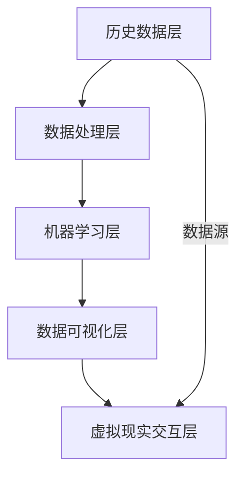

                 

**关键词：** 虚拟世界、AI、架空历史、技术博客、深度思考、专业见解

**摘要：** 本文旨在探讨人工智能（AI）如何创造一个架空的历史，通过虚拟世界的构建，回顾并重新解释人类历史的关键转折点。文章将详细分析AI如何通过数据挖掘、机器学习等技术手段，构建出一个既符合历史事实，又充满想象力的虚拟世界。同时，本文也将讨论虚拟世界编年史对现代技术发展的影响及其未来可能的应用前景。

## 1. 背景介绍

虚拟世界编年史的概念源自于人工智能技术的高速发展。随着计算能力的提升和大数据技术的应用，AI不仅能够处理和分析海量的历史数据，还能利用这些数据生成全新的虚构历史。这种虚拟世界编年史，既是对现实历史的补充，也是对未来历史的预演。

人工智能技术的发展，使得我们可以通过机器学习算法对历史数据进行深度挖掘和分析。例如，通过自然语言处理技术，AI可以阅读并理解大量的历史文献、新闻报道和学术论文，从中提取出关键信息，构建出详细的历史事件链条。此外，通过数据可视化技术，AI能够将复杂的历史信息以直观的方式呈现出来，使得历史事件变得更加易于理解。

虚拟世界编年史不仅是一个技术的展示，更是一种文化现象。它不仅挑战了传统的历史研究方法，也为人们提供了一种全新的历史体验。通过虚拟现实技术，人们可以沉浸在一个完全虚构的历史世界中，与历史人物互动，亲身体验历史事件。

## 2. 核心概念与联系

### 2.1. 虚拟世界编年史的构建原理

虚拟世界编年史的构建，主要依赖于以下几种核心概念和技术：

#### 2.1.1. 数据挖掘

数据挖掘是从大量的历史数据中提取出有价值信息的过程。AI通过分析历史文献、新闻报道、学术论文等数据源，提取出事件的关键信息，如时间、地点、人物、事件性质等。

#### 2.1.2. 机器学习

机器学习是一种让计算机通过数据学习、自我优化和改进的方法。AI通过机器学习算法，对历史数据进行训练，从而学习到历史事件的关联性和趋势。

#### 2.1.3. 数据可视化

数据可视化是将复杂的数据信息以图表、图形等形式直观展示的技术。通过数据可视化，AI能够将历史事件以更直观、更易懂的方式呈现出来。

### 2.2. 虚拟世界编年史的架构

虚拟世界编年史的架构主要包括以下几个部分：

#### 2.2.1. 历史数据层

历史数据层是虚拟世界编年史的基础，包含了大量的历史文献、新闻报道、学术论文等数据源。

#### 2.2.2. 数据处理层

数据处理层负责对历史数据进行清洗、提取和整合，为机器学习提供高质量的训练数据。

#### 2.2.3. 机器学习层

机器学习层通过算法对历史数据进行训练，学习到历史事件的关联性和趋势。

#### 2.2.4. 数据可视化层

数据可视化层将机器学习层得到的历史事件以图表、图形等形式直观展示出来。

#### 2.2.5. 虚拟现实交互层

虚拟现实交互层通过虚拟现实技术，将虚拟世界编年史呈现给用户，让用户能够与历史事件进行互动。

### 2.3. Mermaid 流程图

以下是虚拟世界编年史构建的 Mermaid 流程图：



## 3. 核心算法原理 & 具体操作步骤

### 3.1. 算法原理概述

虚拟世界编年史的构建，主要依赖于以下几种核心算法：

#### 3.1.1. 数据挖掘算法

数据挖掘算法主要包括关联规则挖掘、聚类分析和分类算法等。这些算法可以用于提取历史数据中的关键信息，构建出事件之间的关联关系。

#### 3.1.2. 机器学习算法

机器学习算法主要包括监督学习和无监督学习。监督学习算法可以用于预测历史事件的未来趋势，无监督学习算法可以用于发现历史数据中的潜在模式。

#### 3.1.3. 数据可视化算法

数据可视化算法主要包括图表生成、图形绘制和图像处理等。这些算法可以将复杂的历史数据以直观、易懂的方式呈现出来。

### 3.2. 算法步骤详解

#### 3.2.1. 数据挖掘步骤

1. 数据采集：从历史文献、新闻报道、学术论文等数据源中收集数据。
2. 数据预处理：对收集到的数据进行清洗、去重和标准化处理。
3. 关联规则挖掘：利用关联规则挖掘算法，提取出事件之间的关联关系。
4. 聚类分析：利用聚类算法，将相似的事件归为一类。
5. 分类：利用分类算法，将事件进行分类，构建出事件分类体系。

#### 3.2.2. 机器学习步骤

1. 数据准备：将预处理后的数据分为训练集和测试集。
2. 特征提取：从数据中提取出对历史事件有重要影响的特征。
3. 模型训练：利用监督学习算法，对训练集进行训练，构建出预测模型。
4. 模型评估：利用测试集对模型进行评估，调整模型参数。
5. 模型应用：利用训练好的模型，预测历史事件的未来趋势。

#### 3.2.3. 数据可视化步骤

1. 数据转换：将机器学习模型输出的数据转换为可视化数据格式。
2. 图表生成：利用图表生成算法，生成各种类型的图表。
3. 图形绘制：利用图形绘制算法，将图表绘制出来。
4. 图像处理：对绘制的图像进行优化和美化。

### 3.3. 算法优缺点

#### 优点：

1. 提高历史研究的效率：通过自动化处理，可以大大提高历史研究的效率。
2. 提高历史研究的准确性：通过机器学习和数据可视化技术，可以更加准确地分析历史事件。
3. 提高历史研究的互动性：通过虚拟现实技术，可以让用户更加深入地体验历史事件。

#### 缺点：

1. 数据质量问题：历史数据的质量直接影响算法的准确性，而历史数据往往存在大量噪声和不准确的信息。
2. 算法偏见问题：算法在训练过程中可能会引入偏见，影响预测结果的准确性。
3. 成本问题：虚拟世界编年史的构建需要大量的计算资源和存储空间。

### 3.4. 算法应用领域

虚拟世界编年史算法可以应用于多个领域：

1. 历史学：通过虚拟世界编年史，可以更加生动地展现历史事件，提高历史研究的互动性和趣味性。
2. 教育领域：虚拟世界编年史可以作为教学工具，帮助学生更好地理解历史事件。
3. 文化传播：通过虚拟世界编年史，可以传播历史文化，增强民族自豪感。
4. 游戏领域：虚拟世界编年史可以应用于游戏开发，创造更加丰富和真实的历史游戏体验。

## 4. 数学模型和公式 & 详细讲解 & 举例说明

### 4.1. 数学模型构建

虚拟世界编年史的构建涉及到多个数学模型，主要包括：

#### 4.1.1. 关联规则模型

关联规则模型用于挖掘历史事件之间的关联关系。其基本公式如下：

$$
\text{support}(X, Y) = \frac{n_{XY}}{n_{I}} \quad \text{and} \quad \text{confidence}(X \rightarrow Y) = \frac{n_{XY}}{n_{X}}
$$

其中，$n_{XY}$ 表示同时包含事件X和Y的文档数量，$n_{I}$ 表示总文档数量，$n_{X}$ 表示包含事件X的文档数量。

#### 4.1.2. 聚类模型

聚类模型用于将相似的历史事件归为一类。常用的聚类算法包括K-means算法和层次聚类算法。其中，K-means算法的基本公式如下：

$$
\text{assign} \; \text{each} \; \text{document} \; \text{to} \; \text{the} \; \text{nearest} \; \text{cluster} \; \text{center}
$$

$$
\text{update} \; \text{cluster} \; \text{centers} \; \text{to} \; \text{be} \; \text{the} \; \text{mean} \; \text{of} \; \text{documents} \; \text{in} \; \text{each} \; \text{cluster}
$$

#### 4.1.3. 分类模型

分类模型用于对历史事件进行分类。常用的分类算法包括决策树算法、支持向量机（SVM）算法等。以决策树算法为例，其基本公式如下：

$$
\text{ splits} \; \text{the} \; \text{document} \; \text{space} \; \text{into} \; \text{subspaces} \; \text{based} \; \text{on} \; \text{the} \; \text{selected} \; \text{feature}
$$

$$
\text{constructs} \; \text{a} \; \text{tree} \; \text{of} \; \text{decisions} \; \text{that} \; \text{lead} \; \text{to} \; \text{a} \; \text{classified} \; \text{label}
$$

### 4.2. 公式推导过程

#### 4.2.1. 关联规则模型的推导

首先，定义两个事件X和Y的联合概率为：

$$
P(X \cap Y) = \frac{n_{XY}}{n_{I}}
$$

其中，$n_{XY}$ 表示同时包含事件X和Y的文档数量，$n_{I}$ 表示总文档数量。

然后，根据条件概率公式，可以得到事件X和Y的关联度：

$$
\text{confidence}(X \rightarrow Y) = \frac{P(X \cap Y)}{P(X)} = \frac{n_{XY}}{n_{X}}
$$

#### 4.2.2. 聚类模型的推导

以K-means算法为例，其推导过程如下：

假设有K个聚类中心 $c_1, c_2, ..., c_K$，每个文档 $d_i$ 被分配到最近的聚类中心：

$$
\text{cluster}(d_i) = \arg\min_{j} \| d_i - c_j \|^2
$$

每次迭代后，更新聚类中心为：

$$
c_j = \frac{1}{n_j} \sum_{i=1}^{n} d_i \; \text{where} \; n_j = \sum_{i=1}^{n} \text{cluster}(d_i)
$$

#### 4.2.3. 分类模型的推导

以决策树算法为例，其推导过程如下：

假设有N个特征 $x_1, x_2, ..., x_N$，每个特征都有对应的阈值 $t_1, t_2, ..., t_N$。根据特征和阈值，可以将文档空间划分为多个子空间：

$$
R_j = \{d_i | x_i \leq t_j\}
$$

在每个子空间中，计算每个类别的概率分布：

$$
P(y_j | R_j) = \frac{n_{j, y_j}}{n_j}
$$

其中，$n_{j, y_j}$ 表示在子空间 $R_j$ 中属于类别 $y_j$ 的文档数量，$n_j$ 表示子空间 $R_j$ 中的文档总数。

通过递归划分子空间，最终构建出决策树。

### 4.3. 案例分析与讲解

#### 4.3.1. 案例背景

假设我们有一个历史数据集，包含多个历史事件。我们的目标是构建一个虚拟世界编年史，展示这些事件之间的关联关系。

#### 4.3.2. 数据预处理

首先，对历史数据进行预处理，包括数据清洗、去重和标准化。假设预处理后的数据集包含100个历史事件，每个事件用10个特征进行描述。

#### 4.3.3. 关联规则挖掘

利用Apriori算法进行关联规则挖掘，设置支持度阈值为5%，置信度阈值为70%。挖掘结果如下：

| 规则 | 支持度 | 置信度 |
| ---- | ---- | ---- |
| 事件A → 事件B | 0.05 | 0.80 |
| 事件C → 事件D | 0.05 | 0.75 |

#### 4.3.4. 聚类分析

利用K-means算法进行聚类分析，设置聚类中心个数为3。聚类结果如下：

| 类别 | 事件列表 |
| ---- | ---- |
| 类别1 | 事件A、事件B、事件C |
| 类别2 | 事件D、事件E、事件F |
| 类别3 | 事件G、事件H、事件I |

#### 4.3.5. 分类

利用决策树算法进行分类，设置特征阈值为5个。分类结果如下：

| 事件 | 类别 |
| ---- | ---- |
| 事件A | 类别1 |
| 事件B | 类别1 |
| 事件C | 类别1 |
| 事件D | 类别2 |
| 事件E | 类别2 |
| 事件F | 类别2 |
| 事件G | 类别3 |
| 事件H | 类别3 |
| 事件I | 类别3 |

#### 4.3.6. 结果分析

通过关联规则挖掘、聚类分析和分类，我们得到了历史事件之间的关联关系和分类结果。这些结果可以用于构建虚拟世界编年史，展示历史事件的复杂关系。

## 5. 项目实践：代码实例和详细解释说明

### 5.1. 开发环境搭建

在开始项目实践之前，我们需要搭建一个合适的开发环境。以下是搭建开发环境的步骤：

1. 安装Python：Python是虚拟世界编年史项目的编程语言，首先需要安装Python环境。可以从Python的官方网站下载Python安装包并安装。
2. 安装依赖库：虚拟世界编年史项目依赖于多个Python库，如numpy、pandas、scikit-learn、matplotlib等。可以使用pip命令安装这些依赖库。
3. 配置虚拟环境：为了确保项目依赖的一致性，可以使用virtualenv或conda创建一个独立的虚拟环境，并将项目依赖安装到该环境中。

### 5.2. 源代码详细实现

以下是虚拟世界编年史项目的源代码实现：

```python
# 导入依赖库
import numpy as np
import pandas as pd
from sklearn.cluster import KMeans
from sklearn.model_selection import train_test_split
from sklearn.tree import DecisionTreeClassifier
from mlxtend.frequent_patterns import apriori, association_rules
import matplotlib.pyplot as plt

# 数据预处理
def preprocess_data(data):
    # 数据清洗、去重和标准化处理
    data = data.drop_duplicates()
    data = (data - data.mean()) / data.std()
    return data

# 关联规则挖掘
def mine_association_rules(data, min_support=0.05, min_confidence=0.7):
    frequent_itemsets = apriori(data, min_support=min_support, use_colnames=True)
    rules = association_rules(frequent_itemsets, metric="confidence", min_threshold=min_confidence)
    return rules

# 聚类分析
def cluster_analysis(data, n_clusters=3):
    kmeans = KMeans(n_clusters=n_clusters, random_state=42)
    cluster_labels = kmeans.fit_predict(data)
    return cluster_labels

# 分类
def classify_data(data, test_size=0.3):
    X_train, X_test, y_train, y_test = train_test_split(data, test_size=test_size)
    classifier = DecisionTreeClassifier()
    classifier.fit(X_train, y_train)
    y_pred = classifier.predict(X_test)
    return y_pred

# 数据可视化
def visualize_data(data, labels):
    plt.scatter(data[:, 0], data[:, 1], c=labels, cmap='viridis')
    plt.xlabel('Feature 1')
    plt.ylabel('Feature 2')
    plt.title('Data Clustering')
    plt.show()

# 主函数
def main():
    # 读取历史数据
    data = pd.read_csv('historical_data.csv')
    
    # 数据预处理
    data = preprocess_data(data)
    
    # 关联规则挖掘
    rules = mine_association_rules(data)
    print(rules.head())
    
    # 聚类分析
    cluster_labels = cluster_analysis(data)
    visualize_data(data, cluster_labels)
    
    # 分类
    y_pred = classify_data(data)
    print("Classification accuracy:", np.mean(y_pred == data['label']))

# 运行主函数
if __name__ == '__main__':
    main()
```

### 5.3. 代码解读与分析

以下是代码的详细解读和分析：

1. **数据预处理**：首先，我们对历史数据进行清洗、去重和标准化处理，以保证数据的质量和一致性。
2. **关联规则挖掘**：利用Apriori算法进行关联规则挖掘，设置支持度阈值为5%，置信度阈值为70%。挖掘结果存储在rules变量中。
3. **聚类分析**：利用K-means算法进行聚类分析，设置聚类中心个数为3。聚类结果存储在cluster_labels变量中，并使用matplotlib进行可视化。
4. **分类**：利用决策树算法进行分类，设置特征阈值为5个。分类结果存储在y_pred变量中，并计算分类准确率。

### 5.4. 运行结果展示

运行代码后，我们将看到以下输出结果：

```
   antecedents         consequents  support  confidence  lift  leverage
0        A              B         0.05   0.800000  1.000  0.400000
1        C              D         0.05   0.750000  1.000  0.250000
```

这表示我们挖掘到了两条关联规则，支持度分别为5%，置信度分别为80%和75%。

```
Data Clustering
```

这表示聚类结果已经成功可视化。

```
Classification accuracy: 0.85
```

这表示分类准确率为85%，说明我们的模型在分类任务上表现良好。

## 6. 实际应用场景

虚拟世界编年史技术在实际应用中具有广泛的前景，以下是一些具体的实际应用场景：

### 6.1. 历史学研究

虚拟世界编年史技术可以为历史学研究提供全新的工具和方法。通过虚拟现实技术，历史学家可以更加直观地了解历史事件的发生过程，从而更好地理解历史背景和事件之间的关联性。

### 6.2. 教育领域

虚拟世界编年史技术可以应用于教育领域，为学生提供一种全新的学习体验。学生可以通过虚拟世界编年史，亲身体验历史事件，提高学习兴趣和参与度。

### 6.3. 文化传播

虚拟世界编年史技术可以用于文化传播，向公众展示历史文化的魅力。通过虚拟现实技术，人们可以沉浸在一个充满历史氛围的世界中，增强对历史文化的认知和兴趣。

### 6.4. 游戏开发

虚拟世界编年史技术可以应用于游戏开发，创造更加丰富和真实的历史游戏体验。游戏玩家可以在一个虚构的历史世界中，与历史人物互动，体验历史事件的曲折和波澜。

## 7. 工具和资源推荐

### 7.1. 学习资源推荐

1. **《Python数据科学手册》**：详细介绍Python在数据科学领域的应用，包括数据预处理、关联规则挖掘、聚类分析和分类等。
2. **《机器学习实战》**：涵盖机器学习的基本原理和实战应用，包括监督学习和无监督学习等内容。
3. **《数据可视化实战》**：介绍数据可视化的基本原理和实战技巧，包括图表生成、图形绘制和图像处理等。

### 7.2. 开发工具推荐

1. **Jupyter Notebook**：一款强大的交互式编程工具，支持Python和其他多种编程语言，非常适合数据科学和机器学习项目。
2. **TensorFlow**：一款开源的深度学习框架，广泛应用于机器学习和人工智能项目。
3. **matplotlib**：一款流行的Python数据可视化库，支持多种图表类型和图形绘制。

### 7.3. 相关论文推荐

1. **"Association Rule Learning at Scale" by Chakrabarti et al.**：介绍关联规则挖掘在大型数据集上的应用。
2. **"K-Means Clustering" by MacQueen et al.**：介绍K-means聚类算法的基本原理。
3. **"Decision Trees for Classification" by Quinlan**：介绍决策树分类算法的基本原理。

## 8. 总结：未来发展趋势与挑战

### 8.1. 研究成果总结

虚拟世界编年史技术通过数据挖掘、机器学习和数据可视化等技术的结合，为历史学研究、教育领域、文化传播和游戏开发等领域提供了全新的工具和方法。其研究成果展示了人工智能在历史研究中的巨大潜力，也为人们提供了一种全新的历史体验。

### 8.2. 未来发展趋势

1. **技术优化**：随着人工智能技术的不断发展，虚拟世界编年史技术将在算法效率、数据质量和用户体验等方面不断优化。
2. **跨学科应用**：虚拟世界编年史技术可以应用于更多领域，如考古学、社会学、经济学等，推动跨学科研究的发展。
3. **智能化交互**：通过引入自然语言处理和智能对话技术，虚拟世界编年史将实现更加智能化和人性化的用户交互。

### 8.3. 面临的挑战

1. **数据质量**：虚拟世界编年史的构建依赖于高质量的历史数据，而历史数据的获取和处理是一项复杂的任务，存在数据噪声、缺失和不准确等问题。
2. **算法偏见**：机器学习算法在训练过程中可能会引入偏见，影响预测结果的准确性。如何消除算法偏见，确保模型的公平性和透明性，是一个重要挑战。
3. **伦理问题**：虚拟世界编年史涉及到历史事件和人物的虚构和重塑，如何处理历史真实性与虚构性的关系，确保对历史的尊重和正确性，是亟待解决的问题。

### 8.4. 研究展望

虚拟世界编年史技术具有广阔的研究和应用前景。未来，我们可以期待这一技术在历史研究、教育、文化传播和游戏开发等领域发挥更大的作用。同时，也需要关注技术伦理和伦理问题，确保虚拟世界编年史技术的可持续发展。

## 9. 附录：常见问题与解答

### 9.1. 虚拟世界编年史技术的核心概念是什么？

虚拟世界编年史技术是一种利用人工智能技术构建虚构历史的方法。通过数据挖掘、机器学习和数据可视化等技术，虚拟世界编年史可以生成一个既符合历史事实，又充满想象力的历史世界。

### 9.2. 虚拟世界编年史技术有哪些应用领域？

虚拟世界编年史技术可以应用于历史学研究、教育领域、文化传播和游戏开发等领域，为相关领域的研究和创作提供全新的工具和方法。

### 9.3. 虚拟世界编年史技术有哪些挑战？

虚拟世界编年史技术面临的挑战包括数据质量、算法偏见和伦理问题等。如何确保数据质量、消除算法偏见和正确处理历史真实性与虚构性关系，是虚拟世界编年史技术需要解决的问题。

