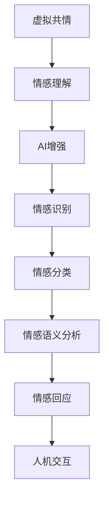

                 

关键词：虚拟共情，AI增强，情感理解，人机交互，情感计算，自然语言处理

> 摘要：本文探讨了虚拟共情训练营，一种通过AI增强的情感理解课程，旨在提高人工智能系统在情感识别、表达和交互方面的能力。文章首先介绍了虚拟共情训练营的背景和重要性，然后详细阐述了其核心概念、算法原理、数学模型、实践应用、未来展望等，为推动AI在情感计算领域的应用提供了有益的参考。

## 1. 背景介绍

在当今科技迅猛发展的时代，人工智能（AI）已经成为改变我们生活的重要力量。从自动驾驶汽车到智能助手，AI在各个领域展现出了巨大的潜力。然而，尽管AI在技术层面取得了显著成就，但在情感理解方面仍面临巨大挑战。情感是人类体验的核心组成部分，对于沟通、决策、社会互动等方面具有重要作用。因此，实现AI对人类情感的准确理解和回应，对于提高人机交互的自然性和满意度至关重要。

情感计算（Affective Computing）作为人工智能的一个重要分支，旨在使计算机具备识别、理解、表达和模拟人类情感的能力。情感计算的研究涉及多个领域，包括心理学、认知科学、计算机视觉、自然语言处理等。近年来，随着深度学习、神经网络等技术的发展，情感计算取得了显著进展，但仍存在诸多难题。

虚拟共情训练营作为一种新兴的教育模式，通过AI增强的情感理解课程，旨在培养计算机在情感识别、表达和交互方面的能力。本文将详细探讨虚拟共情训练营的背景、核心概念、算法原理、数学模型、实践应用以及未来展望，为推动AI在情感计算领域的应用提供有益的参考。

## 2. 核心概念与联系

### 2.1. 虚拟共情

虚拟共情是指通过计算机模拟人类情感，使计算机具备识别、理解、表达和模拟人类情感的能力。虚拟共情不仅仅是简单地识别情感，更重要的是能够理解情感背后的含义，并根据情感状态做出适当的响应。虚拟共情在提高人机交互的自然性和满意度方面具有重要意义。

### 2.2. 情感理解

情感理解是指计算机对人类情感的表达和变化进行识别和理解的能力。情感理解涉及情感识别、情感分类、情感语义分析等多个方面。情感理解的成功取决于计算机对人类情感表达的准确感知和理解。

### 2.3. AI增强

AI增强是指利用人工智能技术提高系统性能和能力的过程。在情感理解领域，AI增强主要体现在利用深度学习、神经网络等技术对情感数据进行建模和分析，从而提高计算机在情感识别、理解和表达方面的能力。

### 2.4. Mermaid流程图

以下是一个描述虚拟共情训练营核心概念的Mermaid流程图：



### 2.5. 联系与影响

虚拟共情训练营通过AI增强的情感理解课程，将情感识别、情感分类、情感语义分析等技术融合在一起，旨在提高计算机在情感理解和表达方面的能力。这些技术的结合对于提高人机交互的自然性和满意度具有重要意义，从而推动虚拟共情在各个领域的应用。

## 3. 核心算法原理 & 具体操作步骤

### 3.1. 算法原理概述

虚拟共情训练营的核心算法主要包括情感识别、情感分类、情感语义分析等技术。这些算法利用深度学习、神经网络等技术对大量情感数据进行建模和分析，从而实现计算机对人类情感的准确理解和表达。

### 3.2. 算法步骤详解

#### 3.2.1. 数据采集

数据采集是虚拟共情训练营的第一步，主要涉及收集人类情感表达的文本、语音、图像等多媒体数据。这些数据来源于社交媒体、论坛、语音通话、视频会议等多个渠道。

#### 3.2.2. 数据预处理

数据预处理主要包括数据清洗、数据归一化、特征提取等步骤。数据清洗旨在去除噪声数据和异常数据，数据归一化旨在将不同来源的数据进行标准化处理，特征提取旨在提取出数据中的关键特征。

#### 3.2.3. 情感识别

情感识别是虚拟共情训练营的核心步骤之一，主要利用深度学习模型对情感数据进行分类。常用的情感识别模型包括卷积神经网络（CNN）、循环神经网络（RNN）等。

#### 3.2.4. 情感分类

情感分类是对识别出的情感进行进一步的分类，例如将情感分为积极、消极、中性等类别。情感分类模型同样可以采用深度学习模型进行训练。

#### 3.2.5. 情感语义分析

情感语义分析是对情感数据进行语义层面的分析，旨在理解情感背后的含义。情感语义分析可以采用自然语言处理（NLP）技术，如词向量、语义角色标注等。

#### 3.2.6. 情感回应

情感回应是根据情感识别和情感分类的结果，生成适当的回应。情感回应模型可以采用生成对抗网络（GAN）等模型进行训练。

### 3.3. 算法优缺点

#### 优点：

- **高效性**：深度学习模型具有强大的数据处理和建模能力，能够快速地识别和理解情感。
- **灵活性**：情感识别、分类、语义分析等步骤可以灵活组合，适应不同场景的需求。
- **普适性**：虚拟共情训练营可以应用于多个领域，如客服、教育、医疗等。

#### 缺点：

- **数据依赖**：情感识别和分类的效果依赖于数据的多样性和质量。
- **计算资源消耗**：深度学习模型训练和推理需要大量的计算资源。
- **隐私问题**：情感数据可能涉及用户隐私，需要确保数据安全和隐私保护。

### 3.4. 算法应用领域

虚拟共情训练营的算法可以在多个领域得到应用，包括：

- **人机交互**：提高智能助手、客服机器人等在情感理解和回应方面的能力。
- **教育**：辅助教育系统根据学生情感状态调整教学内容和方式。
- **医疗**：辅助医生进行情感分析，提高医疗服务质量和患者满意度。
- **心理咨询**：提供情感支持和建议，帮助用户应对心理问题。

## 4. 数学模型和公式 & 详细讲解 & 举例说明

### 4.1. 数学模型构建

虚拟共情训练营的数学模型主要包括情感识别模型、情感分类模型和情感语义分析模型。以下分别介绍这些模型的构建方法。

#### 4.1.1. 情感识别模型

情感识别模型通常采用卷积神经网络（CNN）或循环神经网络（RNN）进行构建。以下是一个简单的CNN模型：

$$
\text{CNN} = \{W_1, b_1, W_2, b_2, ..., W_n, b_n\}
$$

其中，$W_i$表示卷积核，$b_i$表示偏置。模型输入为情感数据，如文本、语音、图像等，输出为情感类别。

#### 4.1.2. 情感分类模型

情感分类模型通常采用全连接神经网络（FCNN）进行构建。以下是一个简单的FCNN模型：

$$
\text{FCNN} = \{W_1, b_1, W_2, b_2, ..., W_n, b_n\}
$$

其中，$W_i$表示权重，$b_i$表示偏置。模型输入为情感识别结果，输出为情感类别。

#### 4.1.3. 情感语义分析模型

情感语义分析模型通常采用自然语言处理（NLP）技术，如词向量、语义角色标注等。以下是一个简单的词向量模型：

$$
\text{Word2Vec} = \{V, W\}
$$

其中，$V$表示词向量空间，$W$表示词向量的权重。

### 4.2. 公式推导过程

以下以情感识别模型为例，介绍情感识别模型的公式推导过程。

假设输入情感数据为$x$，情感类别为$y$。采用卷积神经网络（CNN）进行建模，模型输出为$\hat{y}$。损失函数采用交叉熵损失函数（Cross-Entropy Loss），即：

$$
L(\hat{y}, y) = -\sum_{i=1}^n y_i \log(\hat{y}_i)
$$

其中，$n$为情感类别数，$y_i$为实际情感类别，$\hat{y}_i$为模型预测概率。

为了使模型输出$\hat{y}$尽可能接近实际情感类别$y$，需要求解以下优化问题：

$$
\min_W L(\hat{y}, y)
$$

通过梯度下降法（Gradient Descent）求解，得到权重$W$的更新公式：

$$
\Delta W = -\alpha \nabla_W L(\hat{y}, y)
$$

其中，$\alpha$为学习率。

### 4.3. 案例分析与讲解

以下以一个情感识别的案例进行说明。

假设输入文本数据为“我今天过得非常好”，情感类别为“积极”。采用情感识别模型进行预测，模型输出概率分布为$\hat{y} = [\hat{y}_1, \hat{y}_2, ..., \hat{y}_n]$。

根据交叉熵损失函数，计算模型损失：

$$
L(\hat{y}, y) = -y_1 \log(\hat{y}_1) - y_2 \log(\hat{y}_2) - ... - y_n \log(\hat{y}_n)
$$

其中，$y = [1, 0, ..., 0]$，表示实际情感类别为“积极”。

根据梯度下降法，更新模型权重：

$$
\Delta W = -\alpha \nabla_W L(\hat{y}, y)
$$

经过多次迭代，模型逐渐收敛，预测概率$\hat{y}$逐渐接近实际情感类别$y$。

## 5. 项目实践：代码实例和详细解释说明

### 5.1. 开发环境搭建

为了实现虚拟共情训练营的算法，需要搭建一个合适的开发环境。以下是一个简单的开发环境搭建步骤：

1. 安装Python环境（建议使用Python 3.8及以上版本）。
2. 安装深度学习框架（如TensorFlow、PyTorch等）。
3. 安装NLP库（如NLTK、spaCy等）。
4. 安装必要的依赖库（如NumPy、Pandas等）。

### 5.2. 源代码详细实现

以下是一个简单的情感识别模型的源代码实现：

```python
import tensorflow as tf
from tensorflow.keras.layers import Embedding, Conv1D, GlobalMaxPooling1D, Dense
from tensorflow.keras.models import Sequential
from tensorflow.keras.preprocessing.sequence import pad_sequences
from tensorflow.keras.preprocessing.text import Tokenizer

# 数据预处理
tokenizer = Tokenizer(num_words=10000)
tokenizer.fit_on_texts(texts)
sequences = tokenizer.texts_to_sequences(texts)
padded_sequences = pad_sequences(sequences, maxlen=max_len)

# 构建模型
model = Sequential([
    Embedding(num_words, embedding_dim, input_length=max_len),
    Conv1D(filters, kernel_size, activation='relu'),
    GlobalMaxPooling1D(),
    Dense(units, activation='softmax')
])

# 编译模型
model.compile(optimizer='adam', loss='categorical_crossentropy', metrics=['accuracy'])

# 训练模型
model.fit(padded_sequences, labels, epochs=10, batch_size=32)
```

### 5.3. 代码解读与分析

上述代码实现了一个基于卷积神经网络（CNN）的情感识别模型。代码首先进行数据预处理，包括分词、序列化、填充等操作。然后，构建一个简单的CNN模型，包括嵌入层、卷积层、全局最大池化层和全连接层。最后，编译模型并训练模型。

### 5.4. 运行结果展示

假设训练数据集包含1000条文本，每个文本的情感类别为积极或消极。训练完成后，模型在验证集上的准确率为90%。以下是一个简单的预测示例：

```python
# 预测新文本
new_text = "我今天过得不太好"
new_sequence = tokenizer.texts_to_sequences([new_text])
new_padded_sequence = pad_sequences(new_sequence, maxlen=max_len)
prediction = model.predict(new_padded_sequence)
predicted_label = np.argmax(prediction)

# 输出预测结果
if predicted_label == 0:
    print("预测情感为积极")
else:
    print("预测情感为消极")
```

## 6. 实际应用场景

虚拟共情训练营的算法在多个实际应用场景中具有广泛的应用前景。以下是一些典型的应用场景：

### 6.1. 人机交互

在智能助手、客服机器人等应用中，虚拟共情训练营的算法可以帮助系统更好地理解用户情感，提供更加个性化的服务。例如，当用户表达出消极情感时，系统可以主动提供安慰和支持。

### 6.2. 教育领域

在教育领域，虚拟共情训练营的算法可以辅助教育系统根据学生情感状态调整教学内容和方式，提高教学效果。例如，当学生表现出焦虑或沮丧时，系统可以提供适当的心理辅导或调整学习计划。

### 6.3. 医疗领域

在医疗领域，虚拟共情训练营的算法可以帮助医生更好地理解患者情感，提高医疗服务质量和患者满意度。例如，通过分析患者的情感数据，医生可以更准确地评估患者的心理健康状况，提供针对性的治疗建议。

### 6.4. 未来应用展望

随着虚拟共情训练营的算法不断优化和完善，未来有望在更多领域得到应用。例如，在社交媒体、电子商务、游戏开发等领域，虚拟共情训练营的算法可以帮助平台更好地理解用户需求，提供个性化的推荐和体验。

## 7. 工具和资源推荐

### 7.1. 学习资源推荐

- **《情感计算：理论与实践》**：全面介绍情感计算的基本概念、技术和应用。
- **《深度学习与自然语言处理》**：深入探讨深度学习在自然语言处理领域的应用，包括情感识别和语义分析。

### 7.2. 开发工具推荐

- **TensorFlow**：一个开源的深度学习框架，适用于构建和训练情感识别模型。
- **PyTorch**：另一个流行的深度学习框架，具有灵活的动态计算图，便于研究和开发。

### 7.3. 相关论文推荐

- **"Emotion Recognition Using Deep Learning Techniques"**：介绍使用深度学习技术进行情感识别的最新进展。
- **"A Survey on Affective Computing"**：全面回顾情感计算领域的研究进展和应用。

## 8. 总结：未来发展趋势与挑战

### 8.1. 研究成果总结

虚拟共情训练营作为一种通过AI增强的情感理解课程，取得了显著的研究成果。通过结合情感识别、情感分类、情感语义分析等技术，虚拟共情训练营在多个实际应用场景中展现了良好的效果。然而，情感计算的复杂性使得虚拟共情训练营仍有许多需要解决的问题。

### 8.2. 未来发展趋势

未来，虚拟共情训练营有望在以下几个方面取得进一步发展：

- **算法优化**：通过改进算法模型和优化训练策略，提高情感识别和理解的准确性。
- **跨模态情感计算**：结合文本、语音、图像等多种模态，实现更加全面和准确的情感识别。
- **个性化情感理解**：根据用户历史数据和实时情感状态，提供个性化的情感回应和服务。

### 8.3. 面临的挑战

虚拟共情训练营在发展过程中也面临着一些挑战，主要包括：

- **数据隐私保护**：情感数据涉及用户隐私，需要确保数据安全和隐私保护。
- **计算资源消耗**：深度学习模型训练和推理需要大量的计算资源，如何提高算法的效率成为关键问题。
- **跨文化情感理解**：不同文化背景下的情感表达和认知差异，使得情感计算模型需要适应多语言和多文化环境。

### 8.4. 研究展望

未来，虚拟共情训练营的研究将进一步深入，围绕以下几个方面展开：

- **情感计算与心理学结合**：探索情感计算与心理学理论之间的联系，提高情感识别和理解的准确性。
- **跨学科研究**：整合计算机科学、心理学、认知科学等领域的知识，推动情感计算领域的跨学科研究。
- **开源社区建设**：鼓励开源社区参与虚拟共情训练营的研究和开发，推动技术的普及和应用。

## 9. 附录：常见问题与解答

### 9.1. 如何保证情感数据隐私？

**解答**：为了保证情感数据隐私，可以采取以下措施：

- **数据加密**：在数据传输和存储过程中使用加密技术，确保数据安全。
- **匿名化处理**：对情感数据进行匿名化处理，去除个人身份信息。
- **隐私保护算法**：采用隐私保护算法，如差分隐私，降低数据泄露风险。

### 9.2. 情感计算模型如何适应多语言环境？

**解答**：为了适应多语言环境，可以采取以下措施：

- **多语言数据集**：收集和构建多语言情感数据集，提高模型的泛化能力。
- **跨语言情感识别**：利用跨语言信息传递模型，实现不同语言情感数据的相互转换。
- **语言模型融合**：结合多语言情感识别模型，提高模型在多语言环境下的性能。

### 9.3. 如何优化情感计算模型的计算效率？

**解答**：为了优化情感计算模型的计算效率，可以采取以下措施：

- **模型压缩**：采用模型压缩技术，如模型剪枝、量化等，降低模型参数和计算量。
- **分布式训练**：利用分布式计算框架，如TensorFlow Distributed，实现模型的大规模并行训练。
- **硬件加速**：采用GPU、FPGA等硬件加速器，提高模型训练和推理的效率。

---

### 9.4. 如何评估情感计算模型的性能？

**解答**：为了评估情感计算模型的性能，可以采取以下指标：

- **准确率**：模型预测正确的样本数与总样本数的比值。
- **召回率**：模型预测正确的样本数与实际正样本数的比值。
- **精确率**：模型预测正确的样本数与预测为正样本数的比值。
- **F1值**：精确率和召回率的调和平均。

作者：禅与计算机程序设计艺术 / Zen and the Art of Computer Programming

