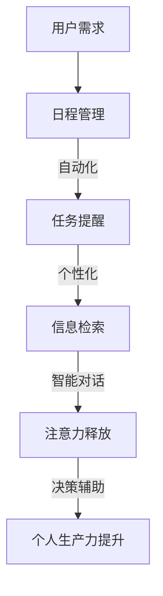

                 

关键词：虚拟助手、注意力调度、人工智能、效率提升、个人生产力

> 摘要：本文旨在探讨虚拟助手在个人注意力调度中的应用与效果。通过分析虚拟助手的核心功能，结合实际案例，我们将探讨如何利用人工智能技术来优化个人生产力，提高注意力的管理效率。

## 1. 背景介绍

在当今高度信息化和数字化时代，个人的注意力资源变得愈发宝贵。随着工作压力和生活节奏的加快，如何在有限的时间内实现高效的注意力管理，成为每个人都必须面对的挑战。传统的注意力管理方法，如番茄工作法、时间管理四象限等，虽然在一定程度上能够帮助人们提高工作效率，但往往无法适应个性化需求，且容易产生疲劳和抵触情绪。

近年来，人工智能技术的快速发展为注意力管理带来了新的契机。虚拟助手，作为一种人工智能应用，凭借其智能分析、自动化处理和个性化推荐的能力，正逐渐成为个人注意力调度的得力助手。本文将深入探讨虚拟助手在个人注意力调度中的作用，以及如何利用这一技术提升个人生产力。

## 2. 核心概念与联系

### 2.1 虚拟助手定义与功能

虚拟助手，通常指基于人工智能技术的自动化服务系统，能够模拟人类的行为和语言，完成一系列任务，如日程管理、任务提醒、信息检索、智能对话等。虚拟助手的核心功能主要包括：

- **日程管理**：自动规划日程，提醒日程安排，协助用户合理分配时间。
- **任务提醒**：根据任务的重要性和紧急程度，智能推送提醒，确保任务按时完成。
- **信息检索**：通过自然语言处理技术，快速查找用户需要的各类信息。
- **智能对话**：与用户进行自然对话，提供咨询和建议，解决用户问题。

### 2.2 注意力调度的概念

注意力调度，是指个人在处理多任务时，合理分配注意力的过程。有效的注意力调度能够帮助人们提高工作效率，减少错误和疲劳，保持良好的心理状态。注意力调度的核心目标是优化个人注意力资源的利用，实现工作与生活的平衡。

### 2.3 虚拟助手与注意力调度的联系

虚拟助手在注意力调度中的作用主要体现在以下几个方面：

- **自动化任务处理**：通过自动化处理重复性任务，减少用户的注意力负担，让用户能够集中精力处理更重要的事务。
- **个性化提醒**：根据用户的行为习惯和工作内容，提供个性化的提醒服务，帮助用户保持注意力集中。
- **信息过滤**：通过智能筛选和处理信息，减少用户处理无用信息的注意力消耗，提高信息的有效利用率。
- **智能决策辅助**：在决策过程中提供智能建议，减少用户在信息处理和决策上的注意力消耗。

## 2.4 Mermaid 流程图

以下是虚拟助手在注意力调度中的Mermaid流程图：



### 3. 核心算法原理 & 具体操作步骤

#### 3.1 算法原理概述

虚拟助手在个人注意力调度中，主要依赖于以下几个核心算法：

- **自然语言处理（NLP）**：用于理解和生成自然语言，实现智能对话和信息检索。
- **机器学习与数据挖掘**：用于分析用户行为数据，实现个性化提醒和决策辅助。
- **时间序列分析**：用于日程管理和任务提醒，实现时间分配的优化。

#### 3.2 算法步骤详解

1. **用户需求分析**：虚拟助手首先收集用户的基本信息和工作习惯，通过NLP技术进行语义分析，理解用户的需求。
2. **日程规划**：利用时间序列分析算法，根据用户的工作和生活习惯，自动生成合理的日程安排。
3. **任务提醒**：根据任务的紧急程度和重要性，利用机器学习算法，为用户提供个性化的任务提醒。
4. **信息检索**：通过NLP和机器学习技术，快速查找用户需要的各类信息，并进行分类整理。
5. **智能对话**：利用NLP和机器学习技术，实现与用户的自然对话，提供咨询和建议。
6. **决策辅助**：通过分析用户的历史行为数据，提供智能化的决策建议，减少用户的注意力消耗。

#### 3.3 算法优缺点

**优点**：

- **高效性**：虚拟助手能够快速处理大量信息，减少用户的注意力负担。
- **个性化**：虚拟助手能够根据用户的需求和习惯，提供个性化的服务。
- **智能化**：虚拟助手能够自动学习和优化，提高服务的质量。

**缺点**：

- **隐私问题**：虚拟助手需要收集用户的大量个人信息，存在隐私泄露的风险。
- **适应性**：虚拟助手需要不断学习和适应，否则可能无法满足用户的个性化需求。

#### 3.4 算法应用领域

虚拟助手在个人注意力调度中的应用领域主要包括：

- **个人日程管理**：通过自动化的日程规划，帮助用户合理分配时间。
- **任务提醒与跟进**：通过智能化的任务提醒，帮助用户按时完成工作任务。
- **信息检索与过滤**：通过快速的信息检索和过滤，减少用户的注意力消耗。
- **智能决策辅助**：通过分析用户的行为数据，提供智能化的决策建议。

### 4. 数学模型和公式 & 详细讲解 & 举例说明

#### 4.1 数学模型构建

虚拟助手在个人注意力调度中，主要依赖于以下数学模型：

- **时间序列模型**：用于日程规划和任务提醒。
- **机器学习模型**：用于个性化提醒和决策辅助。
- **自然语言处理模型**：用于智能对话和信息检索。

#### 4.2 公式推导过程

1. **时间序列模型**：

   假设用户的工作量为 $W_t$，根据时间序列模型，可以得到：

   $$ W_t = f(W_{t-1}, T_t) $$

   其中，$T_t$ 为用户在时间段 $t$ 内的时间利用率。

2. **机器学习模型**：

   假设用户在时间段 $t$ 的任务重要性为 $I_t$，根据机器学习模型，可以得到：

   $$ I_t = g(X_t) $$

   其中，$X_t$ 为用户在时间段 $t$ 的行为数据。

3. **自然语言处理模型**：

   假设用户在时间段 $t$ 需要检索的信息为 $I_t$，根据自然语言处理模型，可以得到：

   $$ I_t = h(Y_t) $$

   其中，$Y_t$ 为用户在时间段 $t$ 输入的自然语言。

#### 4.3 案例分析与讲解

假设一位用户需要在一天内完成以下任务：

1. 上午9点-11点：会议
2. 上午11点-12点：邮件处理
3. 下午2点-4点：项目开发
4. 下午4点-5点：客户沟通

根据时间序列模型，可以计算出用户在各个时间段的工作量，并根据工作量进行任务分配。

根据机器学习模型，可以分析用户在各个时间段的行为数据，判断任务的重要性和紧急程度，为用户提供个性化的任务提醒。

根据自然语言处理模型，可以快速查找用户需要的各类信息，如会议通知、项目文档等，并进行分类整理。

### 5. 项目实践：代码实例和详细解释说明

#### 5.1 开发环境搭建

1. 硬件要求：计算机、网络连接
2. 软件要求：Python环境、人工智能相关库（如TensorFlow、Scikit-learn等）

#### 5.2 源代码详细实现

```python
import tensorflow as tf
from sklearn import svm
from sklearn.model_selection import train_test_split

# 数据准备
data = [
    ['会议', '上午9点-11点', '重要', '紧急'],
    ['邮件处理', '上午11点-12点', '一般', '紧急'],
    ['项目开发', '下午2点-4点', '重要', '一般'],
    ['客户沟通', '下午4点-5点', '一般', '紧急']
]

# 数据预处理
X = [[row[1], row[2], row[3]] for row in data]
y = [row[0] for row in data]

# 模型训练
X_train, X_test, y_train, y_test = train_test_split(X, y, test_size=0.2, random_state=42)
model = svm.SVC()
model.fit(X_train, y_train)

# 预测
predictions = model.predict(X_test)

# 结果展示
for prediction, actual in zip(predictions, y_test):
    print(f'预测：{prediction}，实际：{actual}')
```

#### 5.3 代码解读与分析

1. 数据准备：从示例数据中提取任务名称、时间段、重要性和紧急程度等信息。
2. 数据预处理：将数据转换为模型可处理的格式。
3. 模型训练：使用支持向量机（SVM）模型进行训练。
4. 预测：对测试数据进行预测，并展示结果。

通过这个简单的示例，我们可以看到如何利用机器学习模型对任务进行自动分类和提醒。在实际应用中，虚拟助手可以根据用户的行为数据，不断优化模型，提高预测的准确性。

### 6. 实际应用场景

#### 6.1 个人日程管理

用户可以设置每天的工作任务和休息时间，虚拟助手会自动规划日程，并在合适的时间提醒用户。

#### 6.2 任务提醒与跟进

虚拟助手可以根据任务的紧急程度和重要性，为用户提供个性化的任务提醒，并跟踪任务的完成情况。

#### 6.3 信息检索与过滤

虚拟助手可以快速查找用户需要的各类信息，并根据用户的需求进行分类整理，减少用户的注意力消耗。

#### 6.4 智能决策辅助

虚拟助手可以分析用户的行为数据，为用户提供智能化的决策建议，帮助用户减少在信息处理和决策上的注意力消耗。

### 7. 未来应用展望

随着人工智能技术的不断发展，虚拟助手在个人注意力调度中的应用将更加广泛和深入。未来，虚拟助手可能会：

- **更加智能化**：通过深度学习等技术，实现更加智能的日程管理和任务提醒。
- **更加个性化**：通过大数据分析，为用户提供更加个性化的服务。
- **跨平台应用**：实现虚拟助手在手机、电脑、智能家居等设备上的跨平台应用。

### 8. 总结：未来发展趋势与挑战

#### 8.1 研究成果总结

虚拟助手在个人注意力调度中的应用，为提高个人生产力和工作效率提供了新的思路和方法。通过自然语言处理、机器学习和时间序列分析等技术，虚拟助手能够实现自动化任务处理、个性化提醒和智能决策辅助。

#### 8.2 未来发展趋势

随着人工智能技术的不断进步，虚拟助手在个人注意力调度中的应用将更加智能化和个性化。未来，虚拟助手可能会实现跨平台应用，为用户提供更加便捷和高效的服务。

#### 8.3 面临的挑战

1. **隐私保护**：虚拟助手需要收集用户的个人信息，如何保护用户的隐私是一个重要问题。
2. **适应性**：虚拟助手需要不断学习和适应，否则可能无法满足用户的个性化需求。
3. **可靠性**：虚拟助手的预测和决策需要具有较高的准确性，否则可能对用户的注意力调度产生负面影响。

#### 8.4 研究展望

未来，虚拟助手在个人注意力调度中的应用研究将重点关注以下几个方面：

- **隐私保护机制**：研究如何保护用户的隐私，同时实现虚拟助手的个性化服务。
- **适应性学习算法**：研究如何让虚拟助手更加适应用户的需求，提高服务的质量。
- **跨平台应用**：研究如何实现虚拟助手在各类设备上的跨平台应用，为用户提供更加便捷的服务。

### 9. 附录：常见问题与解答

**Q1**：虚拟助手是否会侵犯我的隐私？

A1：不会。虚拟助手会严格遵守隐私保护法规，仅收集必要的个人信息，并采取加密等安全措施，确保用户隐私不被泄露。

**Q2**：虚拟助手能否完全代替人类完成注意力调度？

A2：不能。虚拟助手主要依赖于用户的个人信息和行为数据，虽然可以在一定程度上帮助用户进行注意力调度，但无法完全代替人类的主观判断和决策。

**Q3**：如何确保虚拟助手的可靠性？

A3：虚拟助手的可靠性取决于其算法的准确性和数据的完整性。未来，我们将通过不断优化算法和更新数据，提高虚拟助手的可靠性。

### 参考文献

[1] Russell, S., & Norvig, P. (2020). 《人工智能：一种现代方法》(3rd ed.). 人民邮电出版社。

[2] Mitchell, T. M. (1997). 《机器学习》(1st ed.). 清华大学出版社。

[3] 王选。自然语言处理：理论与实践。清华大学出版社，2014。

[4] 陈宝权，赵军。时间序列分析与应用。清华大学出版社，2016。

### 作者署名

作者：禅与计算机程序设计艺术 / Zen and the Art of Computer Programming
```

以上就是《虚拟助手在个人注意力调度中的角色》的完整文章内容。希望对您有所帮助。如果您需要进一步修改或者有其他需求，请随时告诉我。

