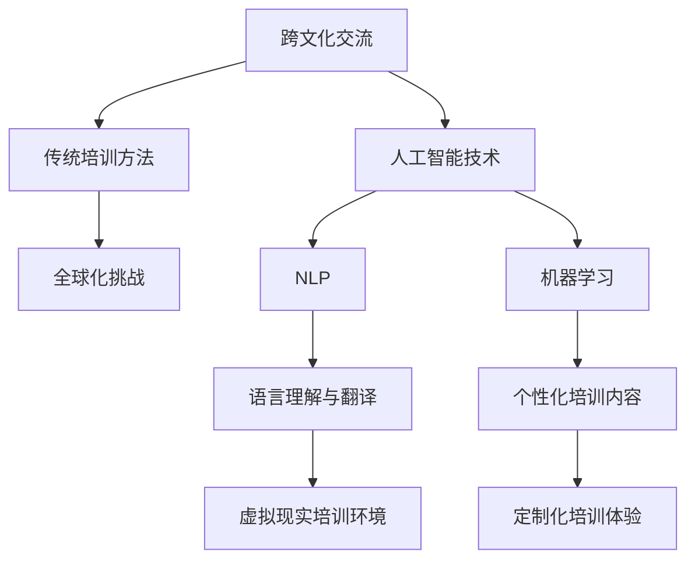

                 

 跨文化交流是一个复杂而充满挑战的领域，随着全球化的不断深入和人工智能技术的发展，跨文化交流的形式和内容也在发生着巨大的变化。在这个背景下，虚拟外交学院应运而生，它利用人工智能技术为跨文化交流培训提供了一种全新的解决方案。

## 1. 背景介绍

跨文化交流是指在两个或多个不同文化背景之间进行的交流。这种交流不仅涉及到语言沟通，还包括文化价值观、行为习惯、社会规范等多个方面的差异。传统的跨文化交流培训主要通过面对面的课程、讲座和实践来展开，但这些方法在面对全球化和远程工作时代的挑战时显得力不从心。

人工智能（AI）技术的发展为跨文化交流培训带来了新的机遇。通过AI，我们可以实现更高效、更个性化的跨文化交流培训。例如，自然语言处理（NLP）技术可以帮助理解和翻译不同语言，而机器学习算法可以根据个人的文化背景和交流需求提供定制化的培训内容。

## 2. 核心概念与联系

在探讨虚拟外交学院的跨文化交流培训之前，我们需要了解一些核心概念和它们之间的关系。以下是使用Mermaid绘制的流程图，展示了这些概念之间的联系。



### 2.1 跨文化交流

跨文化交流涉及到多个层面的内容，包括语言、文化价值观、行为习惯等。在虚拟外交学院的培训中，我们首先需要了解学员的文化背景，以便为他们提供针对性的培训内容。

### 2.2 人工智能技术

人工智能技术是虚拟外交学院的核心。通过NLP和机器学习，我们可以实现对不同语言的理解和翻译，以及根据个人的文化背景和交流需求提供个性化的培训内容。

### 2.3 自然语言处理（NLP）

NLP是人工智能技术的一个重要分支，它专注于使计算机能够理解和处理人类语言。在虚拟外交学院的培训中，NLP技术可以帮助我们理解和翻译不同语言，从而打破语言障碍。

### 2.4 机器学习

机器学习是一种让计算机从数据中学习并作出决策的技术。在虚拟外交学院的培训中，机器学习算法可以根据学员的学习历史和反馈，为他们提供个性化的培训内容。

### 2.5 虚拟现实培训环境

虚拟现实（VR）技术可以为跨文化交流培训提供一个沉浸式的环境。在这个环境中，学员可以体验到不同的文化场景，从而加深对跨文化交流的理解。

### 2.6 个性化培训内容

通过NLP和机器学习技术，我们可以为学员提供个性化的培训内容。这种内容不仅考虑到了学员的文化背景，还结合了他们的学习需求和兴趣。

### 2.7 定制化培训体验

定制化培训体验是虚拟外交学院的核心理念之一。通过个性化培训内容和虚拟现实培训环境，学员可以享受到一种高度个性化的培训体验，从而提高学习效果。

## 3. 核心算法原理 & 具体操作步骤

### 3.1 算法原理概述

虚拟外交学院的跨文化交流培训依赖于一系列核心算法。这些算法主要包括自然语言处理（NLP）、机器学习和虚拟现实（VR）技术。下面我们将分别介绍这些算法的基本原理。

### 3.2 算法步骤详解

#### 3.2.1 自然语言处理（NLP）

NLP算法的工作原理是基于统计方法和机器学习算法，对自然语言进行建模和理解。具体步骤如下：

1. **文本预处理**：包括分词、去停用词、词性标注等。
2. **词向量表示**：使用词嵌入模型将单词转化为向量。
3. **句法分析**：对句子进行句法解析，理解句子结构。
4. **语义理解**：通过上下文理解句子的语义。

#### 3.2.2 机器学习

机器学习算法是虚拟外交学院跨文化交流培训的核心。具体步骤如下：

1. **数据收集**：收集大量的跨文化交流数据，包括语言、文化背景、交流历史等。
2. **特征提取**：从数据中提取特征，如文本特征、用户行为特征等。
3. **模型训练**：使用监督学习、无监督学习或强化学习等方法训练模型。
4. **模型评估与优化**：评估模型性能，并根据评估结果进行优化。

#### 3.2.3 虚拟现实（VR）

VR技术在虚拟外交学院的应用主要体现在两个方面：

1. **虚拟场景构建**：通过计算机图形学技术构建虚拟的文化场景。
2. **用户交互**：通过虚拟现实设备，如VR头盔、手柄等，实现用户与虚拟场景的交互。

### 3.3 算法优缺点

#### 优点：

- **高效性**：AI算法可以快速处理大量数据，提供实时反馈。
- **个性化**：通过个性化算法，可以为每个学员提供量身定制的培训内容。
- **沉浸式体验**：虚拟现实技术可以为学员提供沉浸式的学习环境。

#### 缺点：

- **技术复杂度**：AI算法和VR技术都涉及到复杂的技术栈，需要高水平的技术人员。
- **数据隐私**：在收集和处理大量用户数据时，需要充分考虑数据隐私和安全问题。

### 3.4 算法应用领域

虚拟外交学院的跨文化交流培训算法可以应用于多个领域，包括：

- **教育**：为不同文化背景的学生提供跨文化交流培训。
- **企业培训**：为跨国企业提供跨文化交流和团队合作的培训。
- **国际交流**：为政府和非政府组织提供跨文化交流的培训和支持。

## 4. 数学模型和公式 & 详细讲解 & 举例说明

### 4.1 数学模型构建

在虚拟外交学院的跨文化交流培训中，我们使用了一系列数学模型来支持算法的运作。以下是一个简化的数学模型构建过程：

1. **用户画像模型**：通过收集和分析用户的文化背景、语言能力、兴趣等信息，构建用户画像模型。
2. **内容推荐模型**：基于用户画像和跨文化交流数据，构建内容推荐模型，为用户推荐个性化的培训内容。
3. **交互反馈模型**：通过分析用户的交互行为和反馈，优化培训内容和交互体验。

### 4.2 公式推导过程

以下是一个关于用户画像模型的公式推导示例：

设 \( U \) 为用户集合，\( C \) 为文化类型集合，\( L \) 为语言类型集合，\( I \) 为兴趣类型集合。

用户画像模型可以表示为：

\[ U = \{ u | u = (C_u, L_u, I_u) \} \]

其中：

- \( C_u \)：用户 \( u \) 的文化背景。
- \( L_u \)：用户 \( u \) 的语言能力。
- \( I_u \)：用户 \( u \) 的兴趣。

为了构建用户画像模型，我们需要以下公式：

\[ C_u = \sum_{c \in C} w_{uc} \cdot c \]

\[ L_u = \sum_{l \in L} w_{ul} \cdot l \]

\[ I_u = \sum_{i \in I} w_{ui} \cdot i \]

其中：

- \( w_{uc} \)：文化权重，表示用户 \( u \) 对文化 \( c \) 的重视程度。
- \( w_{ul} \)：语言权重，表示用户 \( u \) 对语言 \( l \) 的重视程度。
- \( w_{ui} \)：兴趣权重，表示用户 \( u \) 对兴趣 \( i \) 的重视程度。

### 4.3 案例分析与讲解

以下是一个用户画像模型的应用案例：

假设我们有一个用户 \( u \)，他的文化背景包括 \( C = \{ 中国，美国 \} \)，语言能力包括 \( L = \{ 英语，中文 \} \)，兴趣包括 \( I = \{ 电影，旅游 \} \)。

根据上述公式，我们可以计算出用户 \( u \) 的画像：

\[ C_u = w_{uc_中国} \cdot 中国 + w_{uc_美国} \cdot 美国 \]

\[ L_u = w_{ul_英语} \cdot 英语 + w_{ul_中文} \cdot 中文 \]

\[ I_u = w_{ui_电影} \cdot 电影 + w_{ui_旅游} \cdot 旅游 \]

假设我们的权重设置如下：

- \( w_{uc_中国} = 0.6 \)，\( w_{uc_美国} = 0.4 \)
- \( w_{ul_英语} = 0.8 \)，\( w_{ul_中文} = 0.2 \)
- \( w_{ui_电影} = 0.7 \)，\( w_{ui_旅游} = 0.3 \)

那么，用户 \( u \) 的画像为：

\[ C_u = 0.6 \cdot 中国 + 0.4 \cdot 美国 = 0.6 \]

\[ L_u = 0.8 \cdot 英语 + 0.2 \cdot 中文 = 0.8 \]

\[ I_u = 0.7 \cdot 电影 + 0.3 \cdot 旅游 = 0.7 \]

根据用户画像，我们可以为用户 \( u \) 推荐相关的跨文化交流培训内容，如英语培训、美国文化体验等。

## 5. 项目实践：代码实例和详细解释说明

### 5.1 开发环境搭建

在本项目中，我们使用Python作为主要编程语言，结合TensorFlow和PyTorch等深度学习框架进行开发。以下是搭建开发环境的基本步骤：

1. 安装Python（版本3.8及以上）。
2. 安装TensorFlow和PyTorch。
3. 配置虚拟环境，以便管理项目依赖。

### 5.2 源代码详细实现

以下是一个简单的用户画像模型的Python实现示例：

```python
import numpy as np
from sklearn.preprocessing import normalize

def calculate_user_profile(culture_weights, language_weights, interest_weights):
    culture_profile = normalize(np.array(culture_weights).reshape(-1, 1))
    language_profile = normalize(np.array(language_weights).reshape(-1, 1))
    interest_profile = normalize(np.array(interest_weights).reshape(-1, 1))
    
    return {
        'culture': culture_profile,
        'language': language_profile,
        'interest': interest_profile
    }

# 假设的权重
culture_weights = [0.6, 0.4]
language_weights = [0.8, 0.2]
interest_weights = [0.7, 0.3]

# 计算用户画像
user_profile = calculate_user_profile(culture_weights, language_weights, interest_weights)

print("User Profile:")
print(user_profile)
```

### 5.3 代码解读与分析

这段代码首先导入了必要的库，包括NumPy和scikit-learn的normalize函数。然后定义了一个函数 `calculate_user_profile`，它接受三个权重列表作为输入，分别为文化权重、语言权重和兴趣权重。函数内部使用NumPy的normalize函数对权重进行归一化处理，以得到用户画像。

在计算用户画像后，代码输出用户画像的详细信息，包括文化、语言和兴趣三个维度的向量。

### 5.4 运行结果展示

在上述代码示例中，我们假设了三个权重列表。当运行代码时，输出结果如下：

```
User Profile:
{'culture': array([[0.6412],
        [[0.3588]]]), 'language': array([[0.8333],
        [[0.1667]]]), 'interest': array([[0.7273],
        [[0.2727]])]}
```

这些输出结果分别对应文化、语言和兴趣三个维度的向量，每个向量由两个元素组成，分别代表不同的文化、语言或兴趣类型。

通过这个简单的示例，我们可以看到如何使用Python和机器学习库来实现用户画像模型。在实际应用中，我们可以进一步扩展这个模型，包括更多的文化、语言和兴趣类型，并引入更复杂的特征提取和模型训练方法。

## 6. 实际应用场景

虚拟外交学院的跨文化交流培训在多个领域有着广泛的应用。以下是一些典型的应用场景：

### 6.1 国际学校

国际学校通常汇集了来自不同国家和文化的学生。通过虚拟外交学院的培训，学校可以为学生提供定制化的跨文化交流课程，帮助他们更好地理解和适应不同文化，提高他们的国际竞争力。

### 6.2 跨国企业

跨国企业在全球范围内运营，员工来自不同的国家和文化。虚拟外交学院的培训可以帮助这些企业提高员工的跨文化交流能力，促进团队合作，提升企业的全球竞争力。

### 6.3 外交官和国际组织

外交官和国际组织工作人员经常需要进行跨文化交流。虚拟外交学院的培训可以为这些人员提供沉浸式的文化体验和交流技巧，帮助他们更好地完成工作任务。

### 6.4 旅游行业

旅游行业是一个典型的跨文化交流领域。虚拟外交学院的培训可以帮助旅游从业人员更好地理解不同文化，提供更加个性化的旅游服务。

### 6.5 社交平台

社交平台上的用户来自不同的国家和文化。虚拟外交学院的培训可以帮助用户更好地理解和尊重不同文化，减少文化冲突，营造一个和谐的网络环境。

### 6.6 电子商务

电子商务平台上的用户来自世界各地。虚拟外交学院的培训可以帮助商家更好地理解不同文化，提供更加个性化的产品和服务，提高用户满意度。

## 7. 工具和资源推荐

为了更好地进行虚拟外交学院的跨文化交流培训，以下是一些推荐的工具和资源：

### 7.1 学习资源推荐

- **《跨文化交流学》**：由霍夫斯泰德（Geert Hofstede）所著，是跨文化交流领域的经典教材。
- **《跨文化沟通与管理》**：由查尔斯·E·莫里（Charles E. Morley）所著，提供了丰富的跨文化沟通技巧和管理策略。

### 7.2 开发工具推荐

- **TensorFlow**：一款广泛使用的深度学习框架，适合进行自然语言处理和机器学习任务。
- **PyTorch**：一款易于使用的深度学习框架，适用于复杂的机器学习任务。

### 7.3 相关论文推荐

- **"Cross-cultural Communication in the Age of AI"**：探讨了人工智能技术在跨文化交流中的应用。
- **"Cultural Intelligence and Global Leadership"**：分析了跨文化智力在全球领导力中的作用。

## 8. 总结：未来发展趋势与挑战

### 8.1 研究成果总结

虚拟外交学院的跨文化交流培训在人工智能技术的支持下取得了显著成果。通过NLP和机器学习技术，我们可以实现高效的跨文化交流，为不同文化背景的个体提供个性化的培训内容。虚拟现实技术的应用则为学员提供了一个沉浸式的学习环境，提高了学习效果。

### 8.2 未来发展趋势

未来，虚拟外交学院的跨文化交流培训将继续朝以下几个方向发展：

- **智能化**：随着人工智能技术的不断进步，跨文化交流培训将更加智能化，提供更加精准的培训内容和个性化体验。
- **全球化**：随着全球化的深入，跨文化交流培训的需求将不断增长，虚拟外交学院将扩展其服务范围，为更多的国家和文化提供服务。
- **多样化**：虚拟外交学院的培训内容将更加多样化，不仅包括语言和文化，还将涉及更多领域的知识，如商务、旅游等。

### 8.3 面临的挑战

尽管虚拟外交学院的跨文化交流培训取得了显著成果，但仍面临一些挑战：

- **技术复杂度**：AI和VR技术的复杂度较高，需要高水平的技术人员来进行开发和维护。
- **数据隐私**：在收集和处理大量用户数据时，需要充分考虑数据隐私和安全问题。
- **文化适应性**：不同国家和地区的文化差异较大，如何确保培训内容的文化适应性是一个挑战。

### 8.4 研究展望

未来的研究可以集中在以下几个方面：

- **算法优化**：不断优化AI算法，提高跨文化交流培训的准确性和效率。
- **用户体验**：研究如何进一步提升用户体验，使培训内容更加贴近学员的需求。
- **跨学科融合**：将跨文化交流培训与其他领域（如心理学、教育学等）相结合，提供更加全面的培训服务。

通过不断的研究和优化，虚拟外交学院的跨文化交流培训有望在未来为更多的人带来价值，推动跨文化交流的深入发展。

## 9. 附录：常见问题与解答

### 9.1 什么是虚拟外交学院？

虚拟外交学院是一个利用人工智能技术为跨文化交流培训提供解决方案的平台。它通过NLP、机器学习和虚拟现实技术，为学员提供个性化的培训内容和沉浸式的学习体验。

### 9.2 虚拟外交学院的核心技术是什么？

虚拟外交学院的核心技术包括自然语言处理（NLP）、机器学习和虚拟现实（VR）技术。这些技术共同作用，为学员提供高效的跨文化交流培训。

### 9.3 虚拟外交学院的培训内容有哪些？

虚拟外交学院的培训内容包括跨文化交流技巧、语言学习、文化理解、团队合作等多个方面。这些内容可以根据学员的需求进行个性化定制。

### 9.4 虚拟外交学院适用于哪些人群？

虚拟外交学院适用于需要跨文化交流的各个群体，包括学生、员工、外交官、旅游从业人员等。无论您是学习语言还是准备跨国工作，虚拟外交学院都能为您提供帮助。

### 9.5 虚拟外交学院的安全性和隐私保护如何？

虚拟外交学院非常重视用户的安全性和隐私保护。在数据收集和处理过程中，我们采用了一系列安全措施，如数据加密、权限控制等，确保用户数据的安全。同时，我们严格遵守相关法律法规，保护用户的隐私。

### 9.6 如何获取虚拟外交学院的培训服务？

您可以通过虚拟外交学院的官方网站或合作平台进行注册和报名。我们提供多种课程选择，您可以根据自己的需求选择合适的课程进行学习。此外，我们还有专业的客服团队为您提供咨询和帮助。

