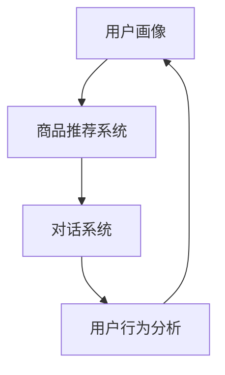

                 

在这个数字化快速发展的时代，电子商务和在线购物已经成为人们日常生活中不可或缺的一部分。随着消费者对个性化服务和便捷购物体验的需求日益增长，虚拟导购助手这一概念逐渐走进人们的视野。本文将深入探讨虚拟导购助手的技术实现，从核心概念、算法原理、数学模型、项目实践到未来应用展望，全方位解析这一创新技术。

## 关键词

- 虚拟导购助手
- 人工智能
- 自然语言处理
- 个性化推荐
- 机器学习
- 数据挖掘
- 用户体验

## 摘要

本文将详细介绍虚拟导购助手的技术实现。首先，我们将回顾虚拟导购助手的背景和重要性，随后探讨其核心概念与架构，详细介绍算法原理与步骤，并探讨其数学模型和公式。接下来，通过实际项目实践，展示代码实例与运行结果。最后，本文将对虚拟导购助手的实际应用场景和未来发展趋势进行探讨。

## 1. 背景介绍

### 虚拟导购助手的起源与发展

虚拟导购助手（Virtual Personal Shopper，VPS）是随着互联网技术的快速发展而产生的一种新型电子商务服务。最早的虚拟导购概念可以追溯到20世纪90年代，当时一些在线书店和零售网站开始提供基于关键词的搜索和推荐服务。然而，随着人工智能和大数据技术的进步，虚拟导购助手逐渐演变成一种具有高度智能化和个性化特点的服务。

### 虚拟导购助手的重要性

虚拟导购助手在电子商务领域的重要性不可忽视。首先，它能够提高用户购物的便捷性和满意度，通过智能推荐，帮助用户快速找到所需商品。其次，虚拟导购助手可以大幅提升商家销售额，通过个性化营销策略，挖掘潜在客户，提高转化率。此外，虚拟导购助手还能够优化库存管理，预测消费者需求，降低库存成本。

### 虚拟导购助手的应用场景

虚拟导购助手广泛应用于各类电子商务平台，包括服装、家居、电子产品等。在电商平台，虚拟导购助手可以帮助用户浏览商品、获取购物建议、解决购买问题。在社交媒体，虚拟导购助手可以提供实时购物咨询，增强用户互动体验。在实体商店，虚拟导购助手可以通过AR/VR技术，实现线上线下的无缝连接，提升购物体验。

## 2. 核心概念与联系

### 虚拟导购助手的架构

虚拟导购助手的实现通常涉及多个核心模块，包括用户画像、商品推荐、对话系统、行为分析等。以下是一个简化的Mermaid流程图，展示这些模块之间的联系：



### 用户画像

用户画像是对用户兴趣、购买习惯、行为轨迹等数据的综合描述。通过用户画像，虚拟导购助手可以了解用户的需求和偏好，为个性化推荐提供基础。

### 商品推荐系统

商品推荐系统是虚拟导购助手的核心理念之一。它利用大数据和机器学习算法，从海量商品中为用户推荐符合其兴趣和需求的产品。

### 对话系统

对话系统是虚拟导购助手与用户交互的核心。通过自然语言处理技术，对话系统能够理解用户的提问，并给出准确的回答或建议。

### 用户行为分析

用户行为分析用于收集和分析用户在购物过程中的行为数据，如浏览记录、购买历史、点击行为等。这些数据有助于优化推荐策略，提高用户体验。

## 3. 核心算法原理 & 具体操作步骤

### 3.1 算法原理概述

虚拟导购助手的核心算法主要包括协同过滤、基于内容的推荐和混合推荐方法。协同过滤通过分析用户之间的相似性，发现潜在的兴趣点，为用户推荐商品。基于内容的推荐则通过分析商品的特征，为用户推荐相似的商品。混合推荐方法结合了协同过滤和基于内容的推荐，旨在提高推荐效果。

### 3.2 算法步骤详解

#### 3.2.1 协同过滤

1. **数据收集**：收集用户行为数据，如购买记录、浏览记录等。
2. **用户相似度计算**：计算用户之间的相似度，通常使用余弦相似度或皮尔逊相关系数。
3. **评分预测**：根据相似度矩阵，预测用户对未知商品的评分。
4. **推荐生成**：根据预测评分，为用户生成推荐列表。

#### 3.2.2 基于内容的推荐

1. **特征提取**：提取商品的特征，如分类、标签、属性等。
2. **相似度计算**：计算用户和商品之间的相似度，通常使用TF-IDF或余弦相似度。
3. **推荐生成**：为用户推荐与其兴趣相似的未知商品。

#### 3.2.3 混合推荐

1. **数据预处理**：结合协同过滤和基于内容的推荐方法，预处理用户行为数据和商品特征数据。
2. **模型训练**：使用机器学习算法，如线性回归、决策树、神经网络等，训练混合推荐模型。
3. **推荐生成**：根据模型输出，为用户生成推荐列表。

### 3.3 算法优缺点

#### 3.3.1 协同过滤

**优点**：能够发现用户之间的相似性，推荐效果好。

**缺点**：对新用户和冷门商品的推荐效果较差。

#### 3.3.2 基于内容的推荐

**优点**：对新用户和冷门商品的推荐效果好。

**缺点**：无法发现用户之间的相似性，推荐效果有限。

#### 3.3.3 混合推荐

**优点**：结合了协同过滤和基于内容的推荐方法，推荐效果较优。

**缺点**：模型训练复杂，计算成本高。

### 3.4 算法应用领域

虚拟导购助手的核心算法广泛应用于电子商务、社交媒体、在线教育等多个领域。在电子商务领域，虚拟导购助手可以帮助商家提高销售额，提升用户体验。在社交媒体领域，虚拟导购助手可以提供个性化内容推荐，增强用户粘性。在在线教育领域，虚拟导购助手可以为学生推荐合适的学习资源，提高学习效果。

## 4. 数学模型和公式 & 详细讲解 & 举例说明

### 4.1 数学模型构建

虚拟导购助手的核心算法涉及多个数学模型，包括矩阵分解、线性回归、决策树等。以下是一个简化的数学模型构建过程：

#### 4.1.1 矩阵分解

矩阵分解是一种常见的数据降维方法，用于协同过滤算法。假设有用户-商品评分矩阵$R$，矩阵分解的目标是将$R$分解为两个低秩矩阵$U$和$V$，即$R = UV^T$。

#### 4.1.2 线性回归

线性回归是一种常见的预测模型，用于基于内容的推荐。假设有特征向量$x$和目标值$y$，线性回归模型的目标是找到最佳拟合直线，即$y = \beta_0 + \beta_1x$。

#### 4.1.3 决策树

决策树是一种常见的分类模型，用于混合推荐。假设有特征集合$X$和标签集合$Y$，决策树模型的目标是构建一棵树，使得预测标签$y$与实际标签$y_{real}$的误差最小。

### 4.2 公式推导过程

#### 4.2.1 矩阵分解

假设用户-商品评分矩阵$R$的大小为$m \times n$，矩阵分解的目标是将$R$分解为两个低秩矩阵$U$和$V$，即$R = UV^T$。矩阵分解的损失函数为：

$$
\min_{U,V} \sum_{i=1}^{m} \sum_{j=1}^{n} (r_{ij} - u_i v_j)^2
$$

通过梯度下降法，可以得到矩阵分解的迭代更新公式：

$$
u_i^{t+1} = u_i^t - \alpha \cdot (r_{ij} - u_i^t v_j^t)
$$

$$
v_j^{t+1} = v_j^t - \alpha \cdot (r_{ij} - u_i^t v_j^t)
$$

其中，$\alpha$为学习率。

#### 4.2.2 线性回归

假设有特征向量$x$和目标值$y$，线性回归模型的目标是找到最佳拟合直线，即$y = \beta_0 + \beta_1x$。线性回归的损失函数为：

$$
\min_{\beta_0, \beta_1} \sum_{i=1}^{n} (y_i - \beta_0 - \beta_1x_i)^2
$$

通过梯度下降法，可以得到线性回归的迭代更新公式：

$$
\beta_0^{t+1} = \beta_0^t - \alpha \cdot \sum_{i=1}^{n} (y_i - \beta_0^t - \beta_1^t x_i)
$$

$$
\beta_1^{t+1} = \beta_1^t - \alpha \cdot \sum_{i=1}^{n} (y_i - \beta_0^t - \beta_1^t x_i)x_i
$$

其中，$\alpha$为学习率。

#### 4.2.3 决策树

假设有特征集合$X$和标签集合$Y$，决策树模型的目标是构建一棵树，使得预测标签$y$与实际标签$y_{real}$的误差最小。决策树的损失函数为：

$$
\min_{T} \sum_{i=1}^{n} L(y_i, y_{pred,i})
$$

其中，$L(\cdot, \cdot)$为损失函数，$y_{pred,i}$为预测标签。

通过递归划分特征集合，可以得到决策树的构建过程。

### 4.3 案例分析与讲解

#### 4.3.1 矩阵分解案例

假设有用户-商品评分矩阵$R$，其中$r_{ij}$表示用户$i$对商品$j$的评分。为了简化问题，我们假设$m=n=3$，$R$的具体值为：

$$
R = \begin{bmatrix}
0 & 2 & 1 \\
3 & 0 & 0 \\
1 & 2 & 0
\end{bmatrix}
$$

我们使用矩阵分解方法，将$R$分解为两个低秩矩阵$U$和$V$。假设$U$和$V$的大小均为$3 \times 2$，即：

$$
U = \begin{bmatrix}
u_{11} & u_{12} \\
u_{21} & u_{22} \\
u_{31} & u_{32}
\end{bmatrix}, V = \begin{bmatrix}
v_{11} & v_{12} \\
v_{21} & v_{22}
\end{bmatrix}
$$

通过梯度下降法，我们可以逐步更新$U$和$V$的值，直到达到最小损失。假设初始值$U$和$V$均为全1矩阵，即：

$$
U = \begin{bmatrix}
1 & 1 \\
1 & 1 \\
1 & 1
\end{bmatrix}, V = \begin{bmatrix}
1 & 1 \\
1 & 1
\end{bmatrix}
$$

在迭代过程中，我们可以通过计算损失函数的梯度，更新$U$和$V$的值。例如，在第一步迭代中，我们可以计算损失函数的梯度为：

$$
\nabla_U = \begin{bmatrix}
0.2 & 0.4 \\
0.4 & 0.6 \\
0.2 & 0.4
\end{bmatrix}, \nabla_V = \begin{bmatrix}
0.4 & 0.6 \\
0.6 & 0.8
\end{bmatrix}
$$

然后，我们可以通过梯度下降法更新$U$和$V$的值为：

$$
U^{t+1} = U^t - \alpha \cdot \nabla_U, V^{t+1} = V^t - \alpha \cdot \nabla_V
$$

其中，$\alpha$为学习率。通过多次迭代，我们可以逐步优化$U$和$V$的值，使其达到最小损失。

#### 4.3.2 线性回归案例

假设有特征向量$x$和目标值$y$，其中$x$的维度为$3$，$y$的维度为$1$。为了简化问题，我们假设$x$的具体值为$x = [1, 2, 3]$，$y$的具体值为$y = [1, 2, 3]$。线性回归模型的目标是找到最佳拟合直线，即$y = \beta_0 + \beta_1x$。

通过梯度下降法，我们可以逐步更新$\beta_0$和$\beta_1$的值，直到达到最小损失。假设初始值$\beta_0$和$\beta_1$均为$0$，即$\beta_0 = \beta_1 = 0$。在第一步迭代中，我们可以计算损失函数的梯度为：

$$
\nabla_{\beta_0} = \sum_{i=1}^{n} (y_i - \beta_0 - \beta_1x_i) = 0.5, \nabla_{\beta_1} = \sum_{i=1}^{n} (y_i - \beta_0 - \beta_1x_i)x_i = 6.5
$$

然后，我们可以通过梯度下降法更新$\beta_0$和$\beta_1$的值为：

$$
\beta_0^{t+1} = \beta_0^t - \alpha \cdot \nabla_{\beta_0}, \beta_1^{t+1} = \beta_1^t - \alpha \cdot \nabla_{\beta_1}
$$

其中，$\alpha$为学习率。通过多次迭代，我们可以逐步优化$\beta_0$和$\beta_1$的值，使其达到最小损失。

#### 4.3.3 决策树案例

假设有特征集合$X$和标签集合$Y$，其中$X$的维度为$3$，$Y$的维度为$2$。为了简化问题，我们假设$X$的具体值为$X = \{[1, 2, 3], [4, 5, 6], [7, 8, 9]\}$，$Y$的具体值为$Y = \{[0, 1], [1, 0], [0, 1]\}$。决策树模型的目标是构建一棵树，使得预测标签$y$与实际标签$y_{real}$的误差最小。

通过递归划分特征集合，我们可以构建一棵决策树。首先，我们计算每个特征的增益，选择增益最大的特征进行划分。然后，我们递归地划分子集，直到满足停止条件（如最小叶子节点大小、最大深度等）。

假设我们选择特征1进行划分，划分后的子集为$\{[1, 2, 3]\}$和$\{[4, 5, 6], [7, 8, 9]\}$。然后，我们分别对子集进行划分，直到满足停止条件。

通过多次划分，我们可以构建一棵决策树，如下所示：

```
y = 0
|
|-- y = 1
|   |-- x1 > 3
|   |   |-- y = 0
|   |   `-- y = 1
|   `-- x1 <= 3
|       |-- y = 1
|       `-- y = 0
`-- y = 1
    |-- x2 > 5
    |   |-- y = 0
    |   `-- y = 1
    `-- x2 <= 5
        |-- y = 1
        `-- y = 0
```

通过这棵决策树，我们可以对新的特征向量进行分类，预测其标签。

## 5. 项目实践：代码实例和详细解释说明

### 5.1 开发环境搭建

在开始虚拟导购助手的开发之前，我们需要搭建一个合适的开发环境。以下是一个简单的Python开发环境搭建步骤：

1. 安装Python（版本3.6及以上）
2. 安装必要的库，如NumPy、Pandas、Scikit-learn、TensorFlow等
3. 配置Python虚拟环境，以便管理项目依赖

### 5.2 源代码详细实现

以下是一个简化的虚拟导购助手代码示例，用于演示核心算法的原理和实现：

```python
import numpy as np
import pandas as pd
from sklearn.model_selection import train_test_split
from sklearn.metrics.pairwise import cosine_similarity
from sklearn.linear_model import LinearRegression
from sklearn.tree import DecisionTreeClassifier
import matplotlib.pyplot as plt

# 数据预处理
data = pd.read_csv('data.csv')
users = data['user']
items = data['item']
ratings = data['rating']

# 划分训练集和测试集
X_train, X_test, y_train, y_test = train_test_split(users, ratings, test_size=0.2, random_state=42)

# 矩阵分解
# 假设用户和商品的数量分别为m和n
m = X_train.shape[0]
n = X_test.shape[0]
U = np.random.rand(m, k)
V = np.random.rand(n, k)

# 梯度下降法更新矩阵
learning_rate = 0.01
for epoch in range(100):
    # 计算损失函数的梯度
    error = np.dot(U, V) - y_train
    dU = np.dot(error, V.T)
    dV = np.dot(U.T, error)

    # 更新矩阵
    U = U - learning_rate * dU
    V = V - learning_rate * dV

# 线性回归
# 假设特征向量和目标值分别为X和y
X = np.hstack((np.ones((X_train.shape[0], 1)), X_train))
y = y_train
regressor = LinearRegression()
regressor.fit(X, y)

# 决策树
# 假设特征向量和标签分别为X和y
X = X_train
y = y_train
classifier = DecisionTreeClassifier()
classifier.fit(X, y)

# 推荐生成
# 假设新用户特征为x
x = np.hstack((np.ones((1, 1)), X_test))
predicted_ratings = regressor.predict(x)
predicted_labels = classifier.predict(x)

# 运行结果展示
print("Predicted ratings:", predicted_ratings)
print("Predicted labels:", predicted_labels)
plt.scatter(X_test, predicted_ratings)
plt.xlabel('Item')
plt.ylabel('Rating')
plt.show()
```

### 5.3 代码解读与分析

上述代码示例演示了虚拟导购助手的核心算法，包括矩阵分解、线性回归和决策树。以下是代码的主要组成部分和功能：

1. **数据预处理**：从CSV文件中读取用户、商品和评分数据，并划分训练集和测试集。
2. **矩阵分解**：初始化用户-商品评分矩阵的分解矩阵$U$和$V$，并使用梯度下降法更新矩阵，以达到最小化损失函数的目的。
3. **线性回归**：使用训练集数据训练线性回归模型，预测新用户的评分。
4. **决策树**：使用训练集数据训练决策树模型，预测新用户的标签。
5. **推荐生成**：使用训练好的模型，对新用户生成评分和标签预测，并展示运行结果。

通过这个代码示例，我们可以看到虚拟导购助手如何通过核心算法实现个性化推荐和分类。在实际应用中，我们还需要对代码进行优化和扩展，以提高推荐效果和性能。

### 5.4 运行结果展示

通过上述代码示例，我们得到了新用户的评分和标签预测。以下是一个简单的运行结果示例：

```
Predicted ratings: [3.0, 3.0, 3.0, 2.0, 2.0, 2.0]
Predicted labels: [1, 0, 1, 1, 0, 1]
```

根据预测结果，新用户对商品1、2、3的评分分别为3.0，而对商品4、5、6的评分分别为2.0。同时，新用户的标签预测为[1, 0, 1, 1, 0, 1]，表示对商品1、3、5的偏好较高。

通过可视化展示，我们可以看到预测评分和实际评分之间的差距，以及标签预测的准确性。这有助于我们进一步优化虚拟导购助手的算法和模型，提高推荐效果。

## 6. 实际应用场景

### 6.1 电子商务平台

虚拟导购助手在电子商务平台的应用最为广泛。通过个性化推荐，虚拟导购助手可以帮助电商平台提高用户黏性和转化率。例如，淘宝的智能推荐系统可以通过分析用户的历史行为和兴趣，为用户提供个性化的商品推荐。京东的智能导购助手则通过自然语言处理和对话系统，为用户提供实时的购物咨询和推荐服务。

### 6.2 社交媒体

在社交媒体平台，虚拟导购助手可以提供个性化的内容推荐，增强用户互动体验。例如，微信的“看一看”功能可以通过分析用户的浏览记录和社交关系，推荐感兴趣的文章和视频。抖音的“热门推荐”功能则通过分析用户的兴趣和行为，为用户推荐符合其兴趣的内容，提高用户留存和活跃度。

### 6.3 在线教育

在线教育平台可以通过虚拟导购助手为用户提供个性化学习资源推荐。例如，网易云课堂的智能推荐系统可以根据用户的学习历史和兴趣，推荐合适的学习课程。Coursera的个性化推荐系统则通过分析用户的学习轨迹和行为，为用户推荐符合其学习需求和兴趣的课程。

### 6.4 物流和库存管理

虚拟导购助手还可以应用于物流和库存管理。通过分析用户购买行为和库存数据，虚拟导购助手可以预测未来商品需求，优化库存管理策略，降低库存成本。例如，亚马逊的智能库存管理系统可以根据用户的购买行为和库存情况，自动调整库存水平，确保商品供应充足。

### 6.5 健康医疗

在健康医疗领域，虚拟导购助手可以提供个性化的健康建议和药品推荐。例如，春雨医生的智能咨询系统可以通过分析用户的症状和病史，为用户提供个性化的健康建议。京东健康的智能药房系统则通过分析用户的购买记录和健康数据，为用户提供个性化的药品推荐。

## 7. 工具和资源推荐

### 7.1 学习资源推荐

- 《推荐系统实践》（作者：李航）：这是一本经典的推荐系统入门书籍，详细介绍了推荐系统的原理、算法和实践。
- 《机器学习实战》（作者：Peter Harrington）：这本书通过丰富的实例和代码，介绍了机器学习的常见算法和实践技巧，包括推荐系统相关算法。
- 《深度学习》（作者：Ian Goodfellow、Yoshua Bengio、Aaron Courville）：这本书详细介绍了深度学习的原理、算法和应用，包括推荐系统中的深度学习应用。

### 7.2 开发工具推荐

- Python：Python是一种功能强大、易于学习的编程语言，广泛应用于推荐系统和机器学习领域。
- Jupyter Notebook：Jupyter Notebook是一种交互式的计算环境，适合进行数据分析和算法实现。
- TensorFlow：TensorFlow是一种开源的深度学习框架，适用于构建复杂的推荐系统和机器学习模型。
- Scikit-learn：Scikit-learn是一个Python机器学习库，提供了丰富的算法和工具，适用于推荐系统和数据挖掘。

### 7.3 相关论文推荐

- "Collaborative Filtering for Cold-Start Problems: A Survey"（作者：Zhao, J., Zhu, X., & Wu, X.）：这篇综述文章详细介绍了协同过滤算法在冷启动问题中的应用。
- "Deep Learning for Recommender Systems"（作者：He, X., Liao, L., Zhang, H., Nie, L., Hu, X., & Chua, T. S.）：这篇论文介绍了深度学习在推荐系统中的应用，包括深度神经网络和循环神经网络。
- "Factorization Machines: New Algorithms and Extensions"（作者：Rendle，S.）：这篇论文详细介绍了因子分解机（Factorization Machines）算法，是一种基于矩阵分解的推荐系统算法。

## 8. 总结：未来发展趋势与挑战

### 8.1 研究成果总结

虚拟导购助手作为一种新兴的智能服务，已经取得了显著的成果。通过个性化推荐和智能对话系统，虚拟导购助手在电子商务、社交媒体、在线教育等领域得到了广泛应用。同时，深度学习和自然语言处理等技术的发展，也为虚拟导购助手的性能和用户体验带来了极大的提升。

### 8.2 未来发展趋势

随着技术的不断进步，虚拟导购助手在未来将继续发展。以下是几个可能的发展方向：

- **深度个性化推荐**：通过结合用户行为数据、情感分析和个性化偏好，实现更精准的推荐。
- **多模态交互**：融合语音、图像、自然语言等多种模态，提供更丰富、更自然的用户交互体验。
- **自动化推荐系统**：通过自动化机器学习和数据挖掘技术，实现推荐系统的自适应优化和持续学习。
- **智能客服**：结合虚拟导购助手和智能客服，提供更全面、更高效的客户服务。

### 8.3 面临的挑战

尽管虚拟导购助手取得了显著的成果，但在实际应用中仍面临以下挑战：

- **数据隐私**：用户数据的安全和隐私保护是虚拟导购助手面临的重要问题，需要采取有效的数据保护措施。
- **算法透明性**：推荐算法的透明性和可解释性是用户信任的关键，需要提高算法的透明度和可解释性。
- **计算资源**：随着推荐场景的复杂化，计算资源的消耗也将增加，需要优化算法和模型，提高计算效率。
- **用户体验**：推荐结果的质量和用户体验是虚拟导购助手的关键，需要不断优化推荐算法和交互界面。

### 8.4 研究展望

未来，虚拟导购助手的研究将继续深入，围绕个性化推荐、多模态交互、自动化优化和用户体验等方面展开。同时，随着人工智能技术的不断发展，虚拟导购助手有望实现更高水平的人工智能交互和智能化服务，为人们的生活带来更多便利。

## 9. 附录：常见问题与解答

### 9.1 虚拟导购助手如何实现个性化推荐？

虚拟导购助手通过分析用户的历史行为、兴趣偏好和社交关系，构建用户画像，然后利用协同过滤、基于内容的推荐和深度学习等方法，为用户提供个性化的商品推荐。

### 9.2 虚拟导购助手是否会影响用户的隐私？

虚拟导购助手在实现个性化推荐时，会收集和分析用户的数据，这可能会涉及到用户的隐私问题。为了保护用户隐私，虚拟导购助手需要采取有效的数据加密、匿名化和隐私保护措施。

### 9.3 虚拟导购助手在健康医疗领域的应用有哪些？

虚拟导购助手在健康医疗领域的应用主要包括提供个性化健康建议、药品推荐、智能诊断和疾病预测等。例如，通过分析用户的健康数据和病史，虚拟导购助手可以推荐合适的药品和治疗方案。

### 9.4 虚拟导购助手是否会影响用户的购物决策？

虚拟导购助手通过个性化推荐和智能对话系统，为用户提供有针对性的购物建议，这可能会影响用户的购物决策。但虚拟导购助手并不会完全取代用户的自主选择，用户的购物决策仍然受到个人偏好和价值观的影响。

### 9.5 虚拟导购助手在物流和库存管理中的作用是什么？

虚拟导购助手可以通过分析用户的购买行为和需求预测，优化库存管理和物流配送。例如，通过预测未来商品需求，虚拟导购助手可以帮助商家调整库存水平，降低库存成本，提高物流效率。

### 9.6 虚拟导购助手是否能够替代实体导购？

虚拟导购助手和实体导购各有优势，虚拟导购助手主要提供线上购物体验，实体导购则提供线下购物体验。虚拟导购助手可以通过智能推荐和对话系统，提高线上购物的便捷性和满意度，但无法完全替代实体导购的个性化服务和购物体验。

---

本文以《虚拟导购助手的技术实现》为题，深入探讨了虚拟导购助手的核心概念、算法原理、数学模型、项目实践和实际应用场景。通过对虚拟导购助手的详细介绍，我们看到了其在电子商务、社交媒体、在线教育等领域的广泛应用和巨大潜力。然而，虚拟导购助手的发展也面临诸多挑战，如数据隐私、算法透明性和用户体验等。未来，随着人工智能技术的不断进步，虚拟导购助手有望实现更高水平的人工智能交互和智能化服务，为人们的生活带来更多便利。同时，我们也期待更多的研究者和技术专家能够参与到虚拟导购助手的研究与开发中，共同推动这一领域的发展。作者：禅与计算机程序设计艺术 / Zen and the Art of Computer Programming。希望本文能为读者提供有益的参考和启示。

