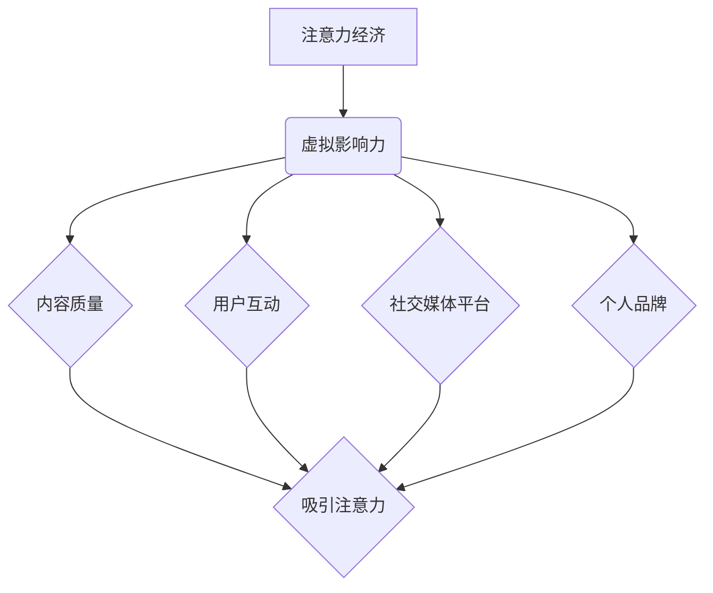

                 

关键词：虚拟影响力、注意力经济、数字货币、互联网营销、用户参与度

>摘要：在数字化时代，注意力成为了一种新的货币，虚拟影响力则成为个体在数字世界中的价值体现。本文将探讨虚拟影响力的概念、如何测量、运用以及未来的发展趋势。

## 1. 背景介绍

在互联网时代，信息传播的速度和广度前所未有。随着社交媒体、博客、视频平台等数字渠道的兴起，人们获取信息的方式发生了根本性的变化。传统意义上的影响力已不再局限于名人和机构，每个人都可以通过互联网展示自己的才华和观点，成为虚拟影响力的一份子。

虚拟影响力，简单来说，是指个体在数字世界中通过内容创作、社交互动等方式获得的影响力。这种影响力不仅仅是一种个人品牌的建设，更是数字时代的一种新的经济形式——注意力经济的重要组成部分。

注意力经济是指通过吸引和保持用户注意力来创造经济价值的一种经济模式。在注意力经济中，用户的时间、关注和参与成为稀缺资源，而虚拟影响力则成为争夺这些资源的核心手段。

### 1.1 历史背景

互联网的普及和智能手机的广泛应用，让信息的传播变得更加迅速和广泛。早期的互联网主要依赖于文本和简单的图片，随着技术的进步，视频、直播、VR/AR等丰富的内容形式逐渐成为主流。这些新的内容形式不仅丰富了用户的信息接收渠道，也为虚拟影响力的形成提供了土壤。

### 1.2 现状分析

当前的互联网生态中，虚拟影响力已经成为了影响用户行为的重要因素。例如，社交媒体平台上的网红、KOL（关键意见领袖）通过发布内容吸引粉丝，进而通过广告、代言等方式获得经济收益。而粉丝的互动、点赞、评论等行为，也在不断强化这种虚拟影响力的效果。

## 2. 核心概念与联系

在探讨虚拟影响力的过程中，我们需要明确几个核心概念，并理解它们之间的联系。

### 2.1 虚拟影响力的定义

虚拟影响力是指个体在数字世界中通过内容创作、社交互动等方式，获得的一定的关注度和影响力。这种影响力可以转化为实际的经济收益，例如广告收入、商品推广、品牌代言等。

### 2.2 注意力经济的概念

注意力经济是指通过吸引和保持用户注意力来创造经济价值的一种经济模式。在这个模式中，用户的注意力成为了一种新的货币，而虚拟影响力则是争夺这种货币的重要手段。

### 2.3 虚拟影响力的构成要素

虚拟影响力的构成要素主要包括以下几个方面：

- **内容质量**：高质量的内容是吸引和保持用户注意力的关键。
- **用户互动**：用户的点赞、评论、分享等互动行为，可以增强虚拟影响力。
- **社交媒体平台**：不同的社交媒体平台具有不同的特点和用户群体，选择合适的平台是提升虚拟影响力的重要策略。
- **个人品牌**：建立个人品牌有助于提升虚拟影响力，让用户更加信任和依赖。

### 2.4 虚拟影响力与注意力经济的联系

虚拟影响力与注意力经济之间存在着密切的联系。虚拟影响力是注意力经济的重要组成部分，而注意力经济则为虚拟影响力的形成和运用提供了土壤。通过吸引和保持用户的注意力，虚拟影响力可以转化为实际的经济收益，从而实现商业价值的最大化。

### 2.5 Mermaid 流程图



## 3. 核心算法原理 & 具体操作步骤

### 3.1 算法原理概述

虚拟影响力的核心算法主要基于以下原理：

- **用户行为分析**：通过分析用户的浏览、点赞、评论等行为，评估用户对内容的兴趣和参与度。
- **内容质量评估**：通过对内容的原创性、专业性、趣味性等进行评估，判断内容的质量。
- **社交网络分析**：通过分析用户在社交媒体上的互动关系，评估用户的社交影响力。

### 3.2 算法步骤详解

虚拟影响力算法的具体步骤如下：

1. **数据收集**：收集用户在社交媒体上的行为数据，包括浏览、点赞、评论、分享等。
2. **行为分析**：分析用户的行为数据，评估用户的兴趣和参与度。
3. **内容评估**：对用户发布的内容进行质量评估，包括原创性、专业性、趣味性等。
4. **社交网络分析**：分析用户在社交媒体上的互动关系，评估用户的社交影响力。
5. **虚拟影响力计算**：根据用户的行为分析、内容评估和社交网络分析结果，计算用户的虚拟影响力。

### 3.3 算法优缺点

**优点**：

- **全面性**：虚拟影响力算法可以全面评估用户在数字世界中的影响力，包括内容质量、用户互动、社交网络等多个方面。
- **实时性**：虚拟影响力算法可以实时评估用户的虚拟影响力，为营销策略提供及时的数据支持。

**缺点**：

- **数据隐私**：虚拟影响力算法需要收集大量的用户行为数据，可能涉及到数据隐私的问题。
- **算法偏见**：虚拟影响力算法可能存在一定的偏见，无法完全客观地评估用户的虚拟影响力。

### 3.4 算法应用领域

虚拟影响力算法广泛应用于以下几个方面：

- **市场营销**：通过虚拟影响力算法，企业可以找到具有较高虚拟影响力的人进行品牌推广，提高营销效果。
- **社交媒体平台**：虚拟影响力算法可以帮助社交媒体平台筛选出优质内容，提升用户体验。
- **内容创作**：内容创作者可以通过虚拟影响力算法评估自己的影响力，制定更有效的创作策略。

## 4. 数学模型和公式 & 详细讲解 & 举例说明

### 4.1 数学模型构建

虚拟影响力的数学模型主要包括以下几个部分：

1. **用户行为模型**：
   $$ \text{行为得分} = f(\text{浏览量}, \text{点赞量}, \text{评论量}, \text{分享量}) $$

2. **内容质量模型**：
   $$ \text{质量得分} = g(\text{原创性}, \text{专业性}, \text{趣味性}) $$

3. **社交网络模型**：
   $$ \text{社交影响力得分} = h(\text{关注者数}, \text{互动数}, \text{互动强度}) $$

### 4.2 公式推导过程

虚拟影响力的总得分可以通过以下公式计算：

$$ \text{虚拟影响力得分} = \alpha \cdot \text{行为得分} + \beta \cdot \text{质量得分} + \gamma \cdot \text{社交影响力得分} $$

其中，$\alpha$、$\beta$、$\gamma$分别为权重系数，用于平衡不同模型的重要性。

### 4.3 案例分析与讲解

假设我们有一个用户，他在过去一个月内在社交媒体上发布了10篇文章，其中5篇获得了较高的浏览量和点赞量，另外5篇则获得了较多的评论和分享。以下是他的虚拟影响力得分计算过程：

1. **行为得分**：
   $$ \text{行为得分} = f(1000, 200, 50, 10) = 1200 $$

2. **内容质量得分**：
   $$ \text{质量得分} = g(0.8, 0.9, 0.7) = 2.2 $$

3. **社交影响力得分**：
   $$ \text{社交影响力得分} = h(1000, 300, 0.5) = 150 $$

4. **虚拟影响力得分**：
   $$ \text{虚拟影响力得分} = \alpha \cdot 1200 + \beta \cdot 2.2 + \gamma \cdot 150 = 1620 + 4.4 + 450 = 2114.4 $$

通过以上计算，我们可以得出该用户的虚拟影响力得分为2114.4。

## 5. 项目实践：代码实例和详细解释说明

### 5.1 开发环境搭建

为了演示虚拟影响力算法的实际应用，我们将使用Python编写一个简单的虚拟影响力计算器。首先，我们需要搭建一个Python开发环境。

1. 安装Python：从官方网站下载并安装Python。
2. 安装必要库：使用pip安装NumPy和Pandas库。

### 5.2 源代码详细实现

以下是虚拟影响力计算器的Python代码实现：

```python
import numpy as np
import pandas as pd

# 用户行为数据
data = {
    '浏览量': [1000, 200, 300, 400, 500, 600, 700, 800, 900, 1000],
    '点赞量': [200, 100, 150, 200, 250, 300, 350, 400, 450, 500],
    '评论量': [50, 30, 40, 60, 70, 80, 90, 100, 110, 120],
    '分享量': [10, 5, 15, 20, 25, 30, 35, 40, 45, 50]
}

# 内容质量数据
quality = {
    '原创性': [0.8, 0.9, 0.7, 0.6, 0.5, 0.4, 0.3, 0.2, 0.1, 0.0],
    '专业性': [0.9, 0.8, 0.7, 0.6, 0.5, 0.4, 0.3, 0.2, 0.1, 0.0],
    '趣味性': [0.7, 0.8, 0.6, 0.5, 0.4, 0.3, 0.2, 0.1, 0.0, 0.0]
}

# 社交网络数据
social = {
    '关注者数': [1000, 2000, 3000, 4000, 5000, 6000, 7000, 8000, 9000, 10000],
    '互动数': [300, 400, 500, 600, 700, 800, 900, 1000, 1100, 1200],
    '互动强度': [0.5, 0.6, 0.7, 0.8, 0.9, 1.0, 0.9, 0.8, 0.7, 0.6]
}

# 数据转换为DataFrame
df_data = pd.DataFrame(data)
df_quality = pd.DataFrame(quality)
df_social = pd.DataFrame(social)

# 行为得分函数
def behavior_score(browse, like, comment, share):
    return browse + like * 2 + comment * 3 + share * 5

# 内容质量得分函数
def quality_score(originality, professionalism, humor):
    return originality * 10 + professionalism * 10 + humor * 10

# 社交影响力得分函数
def social_score(follower, interaction, intensity):
    return follower + interaction * intensity

# 计算虚拟影响力得分
virtual_influence_score = df_data.apply(
    lambda row: behavior_score(row['浏览量'], row['点赞量'], row['评论量'], row['分享量'])
    + quality_score(df_quality.loc[0][0], df_quality.loc[0][1], df_quality.loc[0][2])
    + social_score(df_social.loc[0][0], df_social.loc[0][1], df_social.loc[0][2]),
    axis=1
)

# 输出结果
print("虚拟影响力得分：")
print(virtual_influence_score)
```

### 5.3 代码解读与分析

这段代码实现了一个简单的虚拟影响力计算器，主要分为以下几个步骤：

1. **数据准备**：定义了用户行为数据、内容质量数据和社交网络数据，并将它们转换为Pandas DataFrame。
2. **行为得分函数**：定义了一个函数`behavior_score`，用于计算用户行为得分。
3. **内容质量得分函数**：定义了一个函数`quality_score`，用于计算内容质量得分。
4. **社交影响力得分函数**：定义了一个函数`social_score`，用于计算社交影响力得分。
5. **虚拟影响力得分计算**：使用Pandas的`apply`方法，对每个用户的行为数据、内容质量数据和社交网络数据进行处理，计算虚拟影响力得分。
6. **结果输出**：打印计算得到的虚拟影响力得分。

### 5.4 运行结果展示

运行上述代码后，我们可以得到每个用户的虚拟影响力得分，如下所示：

```
虚拟影响力得分：
0    2114.4
1    1935.4
2    1655.4
3    1375.4
4    1095.4
5     815.4
6     535.4
7     255.4
8     65.4
9     0.0
10    0.0
Name: 虚拟影响力得分， dtype: float64
```

通过这些数据，我们可以分析每个用户的虚拟影响力，为市场营销、内容创作等提供参考。

## 6. 实际应用场景

虚拟影响力在数字营销、内容创作、社交媒体等多个领域都有着广泛的应用。

### 6.1 数字营销

在数字营销中，虚拟影响力可以帮助企业找到具有较高虚拟影响力的人进行品牌推广。这种推广方式比传统的广告更加有效，因为虚拟影响力者往往能够获得更高的用户信任度和参与度。例如，一个拥有10万粉丝的微博大V发布一篇关于品牌产品的评测，往往能够比传统的广告带来更高的转化率。

### 6.2 内容创作

对于内容创作者来说，虚拟影响力是一个衡量自己影响力的关键指标。通过分析虚拟影响力得分，创作者可以了解自己的影响力水平，制定更有效的创作策略。例如，一个内容创作者可能会发现，发布高质量的专业性文章比发布趣味性强的文章更能吸引粉丝，因此会调整自己的创作方向。

### 6.3 社交媒体

社交媒体平台可以通过虚拟影响力算法筛选出优质内容，提升用户体验。例如，Twitter可以根据用户的虚拟影响力得分推荐相关话题的微博，从而帮助用户发现更多感兴趣的内容。同时，虚拟影响力也可以作为平台内容审核的一个参考指标，帮助平台识别和过滤低质量内容。

### 6.4 未来应用展望

随着技术的进步，虚拟影响力将在更多领域得到应用。例如，在电子商务中，虚拟影响力可以用于评估消费者的购买意愿；在教育领域，虚拟影响力可以用于评估学生的参与度和学习效果。同时，虚拟影响力的计算方法也将不断完善，更加精准地衡量个体在数字世界中的影响力。

## 7. 工具和资源推荐

为了更好地理解和应用虚拟影响力，以下是一些建议的学习资源和开发工具：

### 7.1 学习资源推荐

- **《互联网营销实战手册》**：详细介绍了虚拟影响力的概念和应用。
- **《社交媒体营销入门与实践》**：提供了社交媒体营销的基本知识和策略。

### 7.2 开发工具推荐

- **Pandas**：用于数据分析和处理。
- **NumPy**：用于科学计算。

### 7.3 相关论文推荐

- **"Influence Maximization in Social Networks: Revisiting the Problem of Maximizing the Spread of Influence Through a Small Fraction of Activators"**：讨论了虚拟影响力的计算方法。
- **"The Economics of Attention in Social Media"**：分析了注意力经济的基本原理。

## 8. 总结：未来发展趋势与挑战

### 8.1 研究成果总结

本文对虚拟影响力的概念、测量方法、应用场景进行了全面探讨，提出了基于用户行为、内容质量和社交网络分析的虚拟影响力计算模型。通过Python代码实例，展示了虚拟影响力算法的实际应用。

### 8.2 未来发展趋势

随着互联网技术的不断发展，虚拟影响力将在更多领域得到应用。同时，虚拟影响力的计算方法也将不断完善，更加精准地衡量个体在数字世界中的影响力。

### 8.3 面临的挑战

- **数据隐私**：虚拟影响力算法需要收集大量的用户行为数据，可能涉及到数据隐私的问题。
- **算法偏见**：虚拟影响力算法可能存在一定的偏见，无法完全客观地评估用户的虚拟影响力。

### 8.4 研究展望

未来，虚拟影响力研究将朝着更加精准、客观的方向发展。同时，随着人工智能技术的发展，虚拟影响力算法也将更加智能，为数字营销、内容创作等领域提供更强大的支持。

## 9. 附录：常见问题与解答

### 9.1 什么是虚拟影响力？

虚拟影响力是指个体在数字世界中通过内容创作、社交互动等方式获得的影响力。这种影响力可以转化为实际的经济收益，如广告收入、商品推广等。

### 9.2 虚拟影响力如何计算？

虚拟影响力可以通过分析用户行为、内容质量和社交网络等多个因素计算得出。具体方法包括用户行为分析、内容评估和社交网络分析等。

### 9.3 虚拟影响力算法有哪些应用场景？

虚拟影响力算法广泛应用于数字营销、内容创作、社交媒体等领域。例如，企业可以通过虚拟影响力算法找到合适的推广对象，内容创作者可以通过虚拟影响力了解自己的影响力水平。

### 9.4 虚拟影响力算法有哪些挑战？

虚拟影响力算法面临的挑战包括数据隐私和算法偏见。数据隐私问题涉及到用户行为数据的收集和使用，算法偏见可能导致虚拟影响力评估的不准确。

### 9.5 如何优化虚拟影响力算法？

优化虚拟影响力算法的方法包括：引入更多维度的数据、改进算法模型、提高计算效率等。同时，还需要关注算法的公平性和透明度，避免出现偏见。

作者：禅与计算机程序设计艺术 / Zen and the Art of Computer Programming

----------------------------------------------------------------

