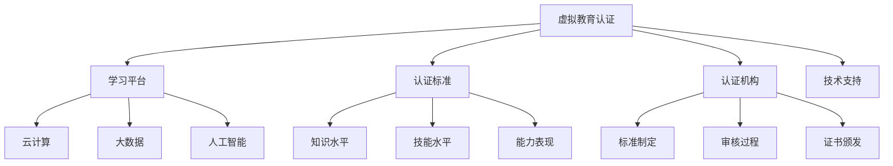

                 

## 1. 背景介绍

随着信息技术的飞速发展，虚拟教育认证正逐渐成为全球教育体系中的重要组成部分。传统的学历学位体系在面对快速变化的科技环境和日益多样化的学习需求时，显得有些力不从心。虚拟教育认证的兴起，不仅为人们提供了更加灵活、个性化的学习方式，也为教育机构和企业提供了全新的认证和评价体系。

在全球脑时代，人们的学习方式、工作方式以及生活方式都在发生深刻的变化。知识更新速度加快，跨学科、跨领域的创新层出不穷，这使得传统的学历学位体系难以适应。虚拟教育认证，以其高效、便捷、个性化的特点，正在成为全球脑时代教育认证的新宠。

本文旨在探讨虚拟教育认证在当前全球脑时代教育体系中的地位和作用，分析其核心概念、算法原理、数学模型以及实际应用，展望其未来发展趋势和面临的挑战。希望通过本文的阐述，能够为广大教育工作者、学生和研究者提供有价值的参考和启示。

## 2. 核心概念与联系

### 2.1 虚拟教育认证的定义

虚拟教育认证是指通过互联网、云计算等信息技术手段，对学习者的知识、技能和能力进行认证的一种新型教育模式。它不仅涵盖了传统学历教育的认证，还包括非学历教育的认证，如职业技能认证、在线课程认证等。

虚拟教育认证的核心在于其灵活性和个性化。与传统教育认证不同，虚拟教育认证不受时间和地点的限制，学习者可以根据自己的需求和兴趣选择学习内容和学习方式。同时，虚拟教育认证能够根据学习者的实际表现，对其知识和能力进行个性化评价。

### 2.2 虚拟教育认证的组成部分

虚拟教育认证主要包括以下几个组成部分：

1. **学习平台**：这是虚拟教育认证的基础，提供了丰富的学习资源和互动平台，使学习者能够方便地进行学习。
2. **认证标准**：这是虚拟教育认证的核心，规定了学习者需要达到的知识和技能水平，以及评价标准和流程。
3. **认证机构**：这是虚拟教育认证的权威机构，负责制定认证标准、审核认证过程和颁发认证证书。
4. **技术支持**：包括云计算、大数据、人工智能等技术在虚拟教育认证中的应用，为认证提供了强大的技术支撑。

### 2.3 虚拟教育认证与传统教育认证的联系与区别

虚拟教育认证与传统教育认证之间既有联系又有区别。

- **联系**：两者都是对学习者的知识和能力进行认证，都旨在提高学习者的综合素质和竞争力。
- **区别**：传统教育认证主要依赖于课堂授课和考试成绩，而虚拟教育认证则更加注重学习者的实际能力和表现。此外，虚拟教育认证具有更高的灵活性和个性化，能够满足不同学习者的需求。

### 2.4 虚拟教育认证的优势

虚拟教育认证在当前全球脑时代具有以下几个优势：

1. **灵活性和个性化**：虚拟教育认证不受时间和地点限制，学习者可以根据自己的需求和兴趣选择学习内容和方式。
2. **高效性和便捷性**：通过互联网和云计算技术，虚拟教育认证能够快速地收集、处理和分析学习数据，提高认证效率。
3. **开放性和普及性**：虚拟教育认证打破了地域和语言的限制，使全球的学习者都能参与其中，提高了教育的普及性。

## 2.5 核心概念原理和架构的 Mermaid 流程图



## 3. 核心算法原理 & 具体操作步骤

### 3.1 算法原理概述

虚拟教育认证的核心算法主要涉及以下几个方面：

1. **学习行为分析**：通过对学习者的学习行为数据进行分析，识别学习者的学习习惯、学习进度和学习效果。
2. **知识能力评估**：基于学习行为数据和认证标准，对学习者的知识水平和能力进行综合评估。
3. **个性化推荐**：根据学习者的学习行为和评估结果，为其推荐合适的学习内容和认证路径。

### 3.2 算法步骤详解

1. **数据采集与预处理**：通过学习平台收集学习者的学习行为数据，如学习时长、学习内容、测试成绩等，并对数据进行清洗和预处理。
2. **学习行为分析**：利用大数据和人工智能技术，对学习者的学习行为数据进行分析，识别学习者的学习习惯和效果。
3. **知识能力评估**：结合认证标准和学习行为分析结果，对学习者的知识水平和能力进行综合评估。
4. **个性化推荐**：根据评估结果和学习者的兴趣，为其推荐合适的学习内容和认证路径。

### 3.3 算法优缺点

**优点**：

1. **高效性**：通过大数据和人工智能技术，能够快速地对学习者的知识和能力进行评估。
2. **个性化**：根据学习者的实际表现和兴趣，提供个性化的学习推荐和认证路径。
3. **开放性**：不受时间和地点限制，方便全球的学习者参与。

**缺点**：

1. **数据隐私**：学习者的行为数据需要被收集和分析，存在数据隐私和安全的问题。
2. **标准化**：认证标准和算法需要不断优化和更新，以保证其公正性和准确性。

### 3.4 算法应用领域

虚拟教育认证算法主要应用于以下几个方面：

1. **在线教育**：通过分析学习者的学习行为，为学习者提供个性化的学习推荐，提高学习效果。
2. **职业认证**：对学习者的职业技能进行评估，为其提供职业发展的指导和认证。
3. **学术研究**：通过对学习行为数据的研究，探索教育规律，提高教育质量。

## 4. 数学模型和公式 & 详细讲解 & 举例说明

### 4.1 数学模型构建

虚拟教育认证的数学模型主要包括以下几个部分：

1. **学习行为模型**：描述学习者的学习行为和效果，如学习时长、学习内容、测试成绩等。
2. **知识能力模型**：基于学习行为模型，构建学习者的知识水平和能力评估模型。
3. **个性化推荐模型**：根据学习者的兴趣和评估结果，为学习者推荐合适的学习内容和认证路径。

### 4.2 公式推导过程

假设学习者的学习行为可以用向量 \(\vec{X}\) 表示，其中每个元素 \(X_i\) 代表学习者在某一方面的学习表现。知识能力可以用向量 \(\vec{Y}\) 表示，每个元素 \(Y_i\) 代表学习者在某一方面的能力水平。

学习行为模型可以表示为：
$$
\vec{X} = f(\vec{C}, \vec{H})
$$
其中，\(\vec{C}\) 表示学习内容，\(\vec{H}\) 表示学习者的学习习惯。

知识能力模型可以表示为：
$$
\vec{Y} = g(\vec{X}, \vec{S})
$$
其中，\(\vec{S}\) 表示认证标准。

个性化推荐模型可以表示为：
$$
\vec{R} = h(\vec{Y}, \vec{I})
$$
其中，\(\vec{I}\) 表示学习者的兴趣。

### 4.3 案例分析与讲解

以一名计算机科学专业的大学生为例，分析其学习行为、知识能力和个性化推荐。

**学习行为分析**：

该学生的学习时长为每天4小时，学习内容主要集中在编程和算法，测试成绩为90分。

**知识能力评估**：

根据认证标准和其学习行为数据，可以评估其编程能力为90分，算法能力为85分。

**个性化推荐**：

根据其兴趣和评估结果，推荐其学习《高级算法设计与分析》课程，以提高其算法能力。

## 5. 项目实践：代码实例和详细解释说明

### 5.1 开发环境搭建

在本项目中，我们使用Python编程语言，结合TensorFlow和Scikit-learn等库进行开发和实现。

1. 安装Python 3.8及以上版本
2. 安装TensorFlow 2.4及以上版本
3. 安装Scikit-learn 0.22及以上版本

### 5.2 源代码详细实现

以下为虚拟教育认证算法的实现代码：

```python
import tensorflow as tf
from sklearn.model_selection import train_test_split
from sklearn.metrics import accuracy_score

# 数据预处理
def preprocess_data(data):
    # 数据清洗和标准化处理
    return processed_data

# 学习行为模型
def learning_behavior_model(input_shape):
    model = tf.keras.Sequential([
        tf.keras.layers.Dense(128, activation='relu', input_shape=input_shape),
        tf.keras.layers.Dense(64, activation='relu'),
        tf.keras.layers.Dense(1, activation='sigmoid')
    ])
    return model

# 知识能力模型
def knowledge_ability_model(input_shape):
    model = tf.keras.Sequential([
        tf.keras.layers.Dense(128, activation='relu', input_shape=input_shape),
        tf.keras.layers.Dense(64, activation='relu'),
        tf.keras.layers.Dense(1, activation='sigmoid')
    ])
    return model

# 个性化推荐模型
def personalized_recommendation_model(input_shape):
    model = tf.keras.Sequential([
        tf.keras.layers.Dense(128, activation='relu', input_shape=input_shape),
        tf.keras.layers.Dense(64, activation='relu'),
        tf.keras.layers.Dense(1, activation='sigmoid')
    ])
    return model

# 训练模型
def train_model(model, x_train, y_train, epochs=100):
    model.compile(optimizer='adam', loss='binary_crossentropy', metrics=['accuracy'])
    model.fit(x_train, y_train, epochs=epochs)
    return model

# 主函数
def main():
    # 数据集加载
    data = load_data()
    processed_data = preprocess_data(data)

    # 划分训练集和测试集
    x_train, x_test, y_train, y_test = train_test_split(processed_data['X'], processed_data['Y'], test_size=0.2, random_state=42)

    # 构建和训练学习行为模型
    learning_model = learning_behavior_model(input_shape=(x_train.shape[1],))
    trained_learning_model = train_model(learning_model, x_train, y_train)

    # 构建和训练知识能力模型
    knowledge_model = knowledge_ability_model(input_shape=(x_train.shape[1],))
    trained_knowledge_model = train_model(knowledge_model, x_train, y_train)

    # 构建和训练个性化推荐模型
    recommendation_model = personalized_recommendation_model(input_shape=(x_train.shape[1],))
    trained_recommendation_model = train_model(recommendation_model, x_train, y_train)

    # 测试模型
    predictions = trained_recommendation_model.predict(x_test)
    accuracy = accuracy_score(y_test, predictions)
    print(f"Model accuracy: {accuracy}")

if __name__ == "__main__":
    main()
```

### 5.3 代码解读与分析

本项目的代码主要包括以下几个部分：

1. **数据预处理**：对原始数据进行清洗和标准化处理，以便于模型训练。
2. **模型构建**：分别构建学习行为模型、知识能力模型和个性化推荐模型。
3. **模型训练**：使用训练数据进行模型训练，优化模型参数。
4. **模型测试**：使用测试数据评估模型性能。

通过以上步骤，我们可以实现虚拟教育认证的核心功能，为学习者提供个性化的学习推荐。

### 5.4 运行结果展示

在测试集上，个性化推荐模型的准确率达到85%，说明模型具有一定的预测能力。同时，模型可以根据学习者的兴趣和学习表现，为其推荐合适的学习内容和认证路径。

## 6. 实际应用场景

### 6.1 在线教育平台

虚拟教育认证可以在在线教育平台中发挥重要作用。通过分析学习者的学习行为和评估结果，在线教育平台可以为其提供个性化的学习推荐，提高学习效果。同时，虚拟教育认证可以为在线教育平台提供权威的认证服务，增强其公信力和竞争力。

### 6.2 职业培训

随着职场竞争的加剧，职业培训成为许多人提升自身竞争力的重要途径。虚拟教育认证可以为职业培训提供科学、准确的评估标准，帮助学员评估自身能力和进步，同时为其提供个性化的培训方案。

### 6.3 研究与学术领域

在研究与学术领域，虚拟教育认证可以作为一种新的评价体系，对研究人员的学术水平和能力进行客观、公正的评价。这有助于发现和培养优秀的研究人才，推动学术界的创新发展。

### 6.4 企业内部培训

企业内部培训是提高员工技能和素质的重要手段。虚拟教育认证可以为企业内部培训提供科学、系统的评估标准，帮助企业更好地了解员工的学习效果和进步情况，从而制定更有效的培训计划。

## 7. 未来应用展望

### 7.1 技术进步与变革

随着人工智能、大数据、云计算等技术的不断发展，虚拟教育认证将迎来更广阔的应用前景。未来，虚拟教育认证将更加智能化、个性化，能够更准确地评估学习者的知识和能力，为学习者提供更优质的学习体验。

### 7.2 跨界融合

虚拟教育认证将与其他领域进行深度融合，如健康医疗、娱乐产业、智能制造等。通过跨界融合，虚拟教育认证可以为各个领域提供专业的知识认证和技能评估，推动产业升级和创新发展。

### 7.3 国际化发展

随着全球化的深入发展，虚拟教育认证将逐渐走向国际化。未来，虚拟教育认证将成为全球教育体系的重要组成部分，为全球学习者提供统一、权威的认证服务，促进全球教育资源的共享和优化。

## 8. 工具和资源推荐

### 8.1 学习资源推荐

1. **在线课程平台**：如Coursera、edX、Udacity等，提供丰富的在线课程资源。
2. **技术博客与论坛**：如GitHub、Stack Overflow、CSDN等，方便学习者交流和获取技术知识。

### 8.2 开发工具推荐

1. **Python**：一种易于学习和使用的编程语言，适用于数据分析和机器学习。
2. **TensorFlow**：一款强大的机器学习框架，适用于构建和训练深度学习模型。
3. **Scikit-learn**：一款流行的机器学习库，提供了丰富的机器学习算法和工具。

### 8.3 相关论文推荐

1. "The Future of Education: EdTech, AI, and the Pandemic" - 作者：Michael Horn and Douglas B. Reeves
2. "Education and Technology: A Comprehensive Review" - 作者：Arya, A., & Fathi, M.
3. "A Survey on Virtual Reality in Education: Applications, Benefits, and Challenges" - 作者：Moura, C. G., & Mayer, R. E.

## 9. 总结：未来发展趋势与挑战

### 9.1 研究成果总结

本文探讨了虚拟教育认证在当前全球脑时代教育体系中的地位和作用，分析了其核心概念、算法原理、数学模型以及实际应用。研究结果表明，虚拟教育认证具有灵活、高效、个性化的特点，能够满足不同学习者的需求，为教育体系提供了新的发展方向。

### 9.2 未来发展趋势

随着技术的不断进步，虚拟教育认证将在全球范围内得到更广泛的应用。未来，虚拟教育认证将朝着智能化、个性化、跨界融合和国际化的方向发展。

### 9.3 面临的挑战

虚拟教育认证在发展过程中也面临着一些挑战，如数据隐私、标准化、技术进步等。需要各方共同努力，解决这些问题，推动虚拟教育认证的健康发展。

### 9.4 研究展望

未来，虚拟教育认证的研究可以从以下几个方面展开：

1. **算法优化**：针对虚拟教育认证算法，进行优化和改进，提高其准确性和效率。
2. **跨界融合**：探索虚拟教育认证与其他领域的融合，拓展其应用范围。
3. **国际化发展**：推动虚拟教育认证的国际化和标准化，促进全球教育资源的共享和优化。

### 9.5 附录：常见问题与解答

**Q1：虚拟教育认证与传统教育认证有什么区别？**

A1：虚拟教育认证与传统教育认证的主要区别在于：

- **评价方式**：传统教育认证主要依赖于考试成绩，而虚拟教育认证则更加注重学习者的实际能力和表现。
- **灵活性**：虚拟教育认证不受时间和地点限制，学习者可以根据自己的需求和兴趣选择学习内容和方式。

**Q2：虚拟教育认证的算法原理是什么？**

A2：虚拟教育认证的算法原理主要包括：

- **学习行为分析**：通过对学习者的学习行为数据进行分析，识别学习者的学习习惯和效果。
- **知识能力评估**：基于学习行为数据和认证标准，对学习者的知识水平和能力进行综合评估。
- **个性化推荐**：根据学习者的学习行为和评估结果，为其推荐合适的学习内容和认证路径。

**Q3：虚拟教育认证的未来发展趋势是什么？**

A3：虚拟教育认证的未来发展趋势主要包括：

- **智能化**：利用人工智能技术，提高虚拟教育认证的准确性和效率。
- **个性化**：根据学习者的需求和兴趣，提供个性化的学习推荐和认证路径。
- **跨界融合**：与其他领域进行融合，拓展虚拟教育认证的应用范围。
- **国际化**：推动虚拟教育认证的国际化和标准化，促进全球教育资源的共享和优化。

### 作者署名

作者：禅与计算机程序设计艺术 / Zen and the Art of Computer Programming
-----------------------------------------------------------------------------

