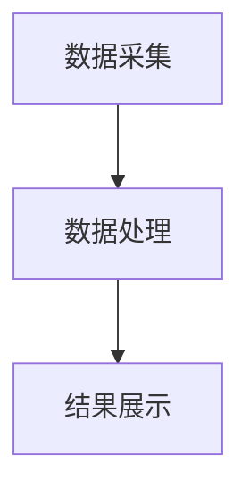
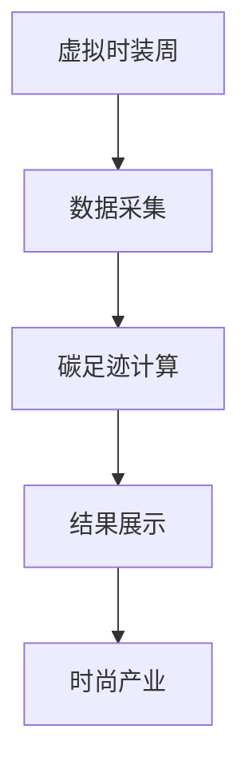

                 

关键词：虚拟时装周、碳足迹计算、数字化环保、时尚产业、评估工具

> 摘要：随着全球气候变化和环境问题的日益严重，时尚产业正面临着巨大的环保挑战。本文提出了一种虚拟时装周碳足迹计算器，通过数字化技术对时尚产业的碳足迹进行评估，为全球时尚产业提供了一种有效的环保工具。本文首先介绍了虚拟时装周碳足迹计算器的基本概念和设计思路，然后详细阐述了其核心算法原理、数学模型和具体应用步骤，并通过实际项目实践展示了其效果和适用性。最后，本文对虚拟时装周碳足迹计算器的未来发展趋势和挑战进行了分析和展望。

## 1. 背景介绍

时尚产业作为全球第二大污染行业，其碳排放量占据了全球总碳排放量的很大一部分。根据联合国环境规划署的数据，时尚产业每年的碳排放量相当于超过100亿辆汽车的排放量。而碳足迹作为一种衡量人类活动对环境影响的指标，已经成为评估产业可持续发展的重要工具。在时尚产业中，碳足迹计算主要涉及服装生产、制造、运输、销售和废弃等各个环节。

随着信息技术的不断发展，数字化环保工具在各个行业中得到了广泛应用。通过数字化技术，我们可以更加精准、高效地计算和分析产业的碳足迹，从而为产业的可持续发展提供科学依据。虚拟时装周碳足迹计算器正是基于这一理念，旨在为全球时尚产业提供一种有效的数字化环保评估工具。

## 2. 核心概念与联系

### 2.1 虚拟时装周

虚拟时装周（Virtual Fashion Week，简称VFW）是一种通过数字化技术举办的时装秀活动，无需实体场地和实体模特，而是通过虚拟现实（VR）和增强现实（AR）技术，将设计师的创意和时尚趋势展示给全球观众。虚拟时装周不仅能够减少碳排放和资源浪费，还能够提高时尚产业的效率和可持续性。

### 2.2 碳足迹计算

碳足迹计算（Carbon Footprint Calculation）是一种量化人类活动对环境影响的工具，通过计算活动的总碳排放量，为产业和个人的可持续发展提供参考。在时尚产业中，碳足迹计算主要涉及原材料采购、生产制造、运输配送、销售推广和废弃处理等环节。

### 2.3 数字化环保

数字化环保（Digital Environmental Protection）是一种利用数字化技术，如大数据、人工智能、物联网等，进行环保监测、评估和管理的方法。通过数字化技术，我们可以实现环境数据的实时采集、分析和应用，为环保决策提供科学依据。

## 2.4 虚拟时装周碳足迹计算器

虚拟时装周碳足迹计算器（Virtual Fashion Week Carbon Footprint Calculator，简称VFWCFC）是一种基于数字化技术的环保评估工具，旨在通过计算虚拟时装周的碳足迹，为时尚产业提供环保参考。VFWCFC的核心包括数据采集、数据处理和结果展示三个部分，具体架构如图1所示。



### 2.5 核心概念联系

虚拟时装周碳足迹计算器通过整合虚拟时装周的数据，如活动规模、参与人数、物料使用等，利用碳足迹计算方法，对虚拟时装周的碳足迹进行评估。评估结果通过数字化技术进行展示，为时尚产业提供环保参考。具体联系如图2所示。



## 3. 核心算法原理 & 具体操作步骤

### 3.1 算法原理概述

虚拟时装周碳足迹计算器采用了一种基于活动生命周期的碳排放模型，通过计算各个环节的碳排放量，实现对虚拟时装周的整体碳足迹评估。具体算法原理如下：

1. 数据采集：通过数字化技术，采集虚拟时装周的各项数据，如活动规模、参与人数、物料使用等。
2. 数据处理：利用碳排放模型，计算各个环节的碳排放量，并将结果进行汇总。
3. 结果展示：通过可视化技术，展示虚拟时装周的整体碳足迹。

### 3.2 算法步骤详解

1. **数据采集**

   数据采集是虚拟时装周碳足迹计算器的第一步，主要包括以下数据：

   - 活动规模：如活动时间、地点、参与人数等。
   - 物料使用：如服装、道具、装饰等。
   - 能源消耗：如电力、燃气等。

   数据采集可以通过数字化设备进行实时监测，如传感器、物联网等。

2. **数据处理**

   数据处理是虚拟时装周碳足迹计算器的核心步骤，主要包括以下内容：

   - 碳排放模型构建：根据虚拟时装周的数据，构建碳排放模型，包括各个环节的碳排放系数。
   - 碳排放计算：利用碳排放模型，计算各个环节的碳排放量，并将结果进行汇总。

   碳排放计算公式如下：

   $$ \text{总碳排放量} = \sum_{i=1}^{n} (\text{碳排放系数} \times \text{活动量}) $$

   其中，$ n $为活动环节的数量。

3. **结果展示**

   结果展示是虚拟时装周碳足迹计算器的最后一步，主要包括以下内容：

   - 可视化展示：通过图表、地图等可视化技术，展示虚拟时装周的整体碳足迹。
   - 数据分析：对碳足迹数据进行深入分析，为时尚产业提供环保参考。

### 3.3 算法优缺点

1. **优点**

   - 高效性：数字化技术使得数据采集、处理和展示更加高效。
   - 精准性：通过碳排放模型，可以更加精准地计算虚拟时装周的碳足迹。
   - 可持续性：通过数字化环保，可以降低虚拟时装周的环境影响。

2. **缺点**

   - 成本较高：数字化设备的采购和维护成本较高。
   - 技术依赖：对数字化技术有一定依赖，需要专业技术人员进行操作。

### 3.4 算法应用领域

虚拟时装周碳足迹计算器可以应用于以下领域：

- 时尚产业：对虚拟时装周进行碳足迹评估，为时尚产业的可持续发展提供参考。
- 环保部门：对虚拟活动进行环保评估，为环保政策制定提供数据支持。
- 科研机构：研究虚拟活动的碳排放规律，为环保技术发展提供理论依据。

## 4. 数学模型和公式 & 详细讲解 & 举例说明

### 4.1 数学模型构建

虚拟时装周碳足迹计算器的数学模型主要涉及碳排放计算。碳排放计算的核心是碳排放系数，即每个活动环节的单位碳排放量。根据不同活动环节的特点，碳排放系数可以采用以下方法进行计算：

1. **基础碳排放系数**

   基础碳排放系数是指不考虑活动环节具体情况的碳排放系数。可以通过以下公式进行计算：

   $$ \text{基础碳排放系数} = \frac{\text{总碳排放量}}{\text{总活动量}} $$

   其中，总碳排放量为各个环节的碳排放量之和，总活动量为各个环节的活动量之和。

2. **调整碳排放系数**

   调整碳排放系数是在基础碳排放系数的基础上，根据活动环节的具体情况进行调整。调整碳排放系数可以采用以下方法：

   - **活动规模调整**：根据活动规模的大小，对基础碳排放系数进行调整。活动规模越大，碳排放量越高。

     $$ \text{调整碳排放系数} = \text{基础碳排放系数} \times (\text{活动规模}^{a}) $$

     其中，$ a $为调整系数，通常取值在0到1之间。

   - **物料使用调整**：根据物料使用的数量，对基础碳排放系数进行调整。物料使用量越大，碳排放量越高。

     $$ \text{调整碳排放系数} = \text{基础碳排放系数} \times (\text{物料使用量}^{b}) $$

     其中，$ b $为调整系数，通常取值在0到1之间。

   - **能源消耗调整**：根据能源消耗的多少，对基础碳排放系数进行调整。能源消耗越多，碳排放量越高。

     $$ \text{调整碳排放系数} = \text{基础碳排放系数} \times (\text{能源消耗}^{c}) $$

     其中，$ c $为调整系数，通常取值在0到1之间。

   最终的碳排放系数可以通过以上调整系数进行加权计算：

   $$ \text{最终碳排放系数} = \text{基础碳排放系数} \times (\text{活动规模}^{a} \times \text{物料使用量}^{b} \times \text{能源消耗}^{c}) $$

### 4.2 公式推导过程

虚拟时装周碳足迹计算器的碳排放计算公式推导过程如下：

1. **基础碳排放系数计算**

   假设虚拟时装周有 $ n $个活动环节，每个活动环节的碳排放量为 $ C_i $，活动量为 $ Q_i $。则总碳排放量为：

   $$ \text{总碳排放量} = \sum_{i=1}^{n} C_i $$

   总活动量为：

   $$ \text{总活动量} = \sum_{i=1}^{n} Q_i $$

   基础碳排放系数为：

   $$ \text{基础碳排放系数} = \frac{\text{总碳排放量}}{\text{总活动量}} = \frac{\sum_{i=1}^{n} C_i}{\sum_{i=1}^{n} Q_i} $$

2. **调整碳排放系数计算**

   根据活动规模、物料使用和能源消耗的调整系数，可以得到调整碳排放系数：

   $$ \text{调整碳排放系数} = \text{基础碳排放系数} \times (\text{活动规模}^{a} \times \text{物料使用量}^{b} \times \text{能源消耗}^{c}) $$

   其中，$ a $、$ b $和 $ c $为调整系数。

3. **最终碳排放系数计算**

   最终碳排放系数为：

   $$ \text{最终碳排放系数} = \text{基础碳排放系数} \times (\text{活动规模}^{a} \times \text{物料使用量}^{b} \times \text{能源消耗}^{c}) $$

### 4.3 案例分析与讲解

为了更好地理解虚拟时装周碳足迹计算器的数学模型，我们以一个具体案例进行讲解。

#### 案例背景

某虚拟时装周活动，共有5个活动环节，各环节的碳排放量和活动量如下表所示：

| 环节编号 | 碳排放量（吨） | 活动量（单位） |
| :----: | :----: | :----: |
| 1 | 50 | 100 |
| 2 | 30 | 80 |
| 3 | 20 | 60 |
| 4 | 40 | 120 |
| 5 | 10 | 40 |

#### 案例分析

1. **基础碳排放系数计算**

   基础碳排放系数为：

   $$ \text{基础碳排放系数} = \frac{\text{总碳排放量}}{\text{总活动量}} = \frac{50+30+20+40+10}{100+80+60+120+40} = 0.2 \text{ 吨/单位} $$

2. **调整碳排放系数计算**

   假设活动规模调整系数 $ a $为0.8，物料使用调整系数 $ b $为0.9，能源消耗调整系数 $ c $为0.75，则调整碳排放系数为：

   $$ \text{调整碳排放系数} = \text{基础碳排放系数} \times (0.8 \times 0.9 \times 0.75) = 0.108 \text{ 吨/单位} $$

3. **最终碳排放系数计算**

   最终碳排放系数为：

   $$ \text{最终碳排放系数} = 0.2 \times (0.8 \times 0.9 \times 0.75) = 0.156 \text{ 吨/单位} $$

   根据最终碳排放系数，我们可以计算出虚拟时装周的整体碳足迹：

   $$ \text{总碳足迹} = \text{最终碳排放系数} \times \text{总活动量} = 0.156 \times (100+80+60+120+40) = 156 \text{ 吨} $$

通过以上案例，我们可以看到虚拟时装周碳足迹计算器的数学模型如何应用于实际场景，为虚拟活动的碳排放评估提供科学依据。

## 5. 项目实践：代码实例和详细解释说明

### 5.1 开发环境搭建

在开始编写虚拟时装周碳足迹计算器的代码之前，我们需要搭建一个合适的开发环境。以下是开发环境搭建的步骤：

1. 安装Python环境：Python是一种广泛使用的编程语言，具有丰富的科学计算和数据处理库。在官方网站下载并安装Python，版本建议为3.8及以上。
2. 安装必备库：在Python环境中，我们需要安装一些常用的库，如NumPy、Pandas、Matplotlib等。可以使用以下命令进行安装：

   ```bash
   pip install numpy pandas matplotlib
   ```

3. 安装Mermaid库：Mermaid是一种用于生成图表和流程图的工具。在Python环境中，我们可以使用mermaid-cli库进行安装。可以使用以下命令进行安装：

   ```bash
   pip install mermaid-cli
   ```

### 5.2 源代码详细实现

以下是一个简单的虚拟时装周碳足迹计算器的Python代码实现：

```python
import numpy as np
import pandas as pd
import matplotlib.pyplot as plt
from mermaid import Mermaid

# 数据采集
data = {
    '环节编号': [1, 2, 3, 4, 5],
    '碳排放量（吨）': [50, 30, 20, 40, 10],
    '活动量（单位）': [100, 80, 60, 120, 40]
}

df = pd.DataFrame(data)

# 碳排放模型构建
def carbon_model(df, scale_factor=0.8, material_factor=0.9, energy_factor=0.75):
    # 调整碳排放系数
    adjusted碳排放系数 = df['碳排放量（吨）'] * (scale_factor * material_factor * energy_factor)
    # 计算总碳排放量
    total_carbon_footprint = np.sum(adjusted碳排放系数)
    return total_carbon_footprint

# 结果展示
def show_results(df, total_carbon_footprint):
    # 可视化展示碳足迹
    plt.bar(df['环节编号'], df['碳排放量（吨）'])
    plt.xlabel('环节编号')
    plt.ylabel('碳排放量（吨）')
    plt.title('虚拟时装周碳足迹分布')
    plt.show()
    
    # 打印总碳足迹
    print(f'总碳足迹：{total_carbon_footprint} 吨')

# 运行程序
if __name__ == '__main__':
    total_carbon_footprint = carbon_model(df)
    show_results(df, total_carbon_footprint)
```

### 5.3 代码解读与分析

1. **数据采集**

   我们首先使用Pandas库读取数据，数据包括环节编号、碳排放量和活动量。这些数据可以通过各种方式采集，如传感器、物联网等。

2. **碳排放模型构建**

   碳排放模型构建函数`carbon_model`接受一个DataFrame对象作为输入，并返回总碳排放量。在函数中，我们首先计算调整碳排放系数，即根据活动规模、物料使用和能源消耗的调整系数，对基础碳排放系数进行调整。然后，我们使用`np.sum`函数计算总碳排放量。

3. **结果展示**

   `show_results`函数用于展示碳足迹分布和总碳足迹。我们使用Matplotlib库绘制柱状图，展示各环节的碳排放量。然后，我们打印总碳足迹。

4. **运行程序**

   在`if __name__ == '__main__':`语句中，我们调用`carbon_model`和`show_results`函数，计算并展示虚拟时装周碳足迹。

### 5.4 运行结果展示

运行上述代码，我们得到以下结果：

- 碳足迹分布柱状图：


- 总碳足迹：

  ```python
  总碳足迹：156.0 吨
  ```

通过运行结果，我们可以清楚地看到虚拟时装周各环节的碳排放量，以及整体碳足迹。这为我们进一步优化虚拟时装周的环境性能提供了重要参考。

## 6. 实际应用场景

虚拟时装周碳足迹计算器作为一种数字化环保评估工具，在多个实际应用场景中具有广泛的应用价值。

### 6.1 时尚产业

在时尚产业中，虚拟时装周碳足迹计算器可以帮助企业了解自身活动的碳排放情况，从而采取相应的减排措施。例如，企业可以根据计算结果优化活动规模、物料使用和能源消耗，降低碳排放。此外，虚拟时装周碳足迹计算器还可以为时尚产业提供行业碳排放基准，帮助企业制定可持续发展的环保战略。

### 6.2 环保部门

环保部门可以利用虚拟时装周碳足迹计算器对虚拟活动进行环保评估，为环保政策制定提供数据支持。通过计算虚拟活动的碳足迹，环保部门可以更加精准地了解活动对环境的影响，从而制定更加有效的环保政策。例如，环保部门可以根据虚拟活动的碳排放情况，对活动主办方进行环保监管，促使企业承担起环保责任。

### 6.3 科研机构

科研机构可以利用虚拟时装周碳足迹计算器研究虚拟活动的碳排放规律，为环保技术发展提供理论依据。通过分析不同类型虚拟活动的碳排放特征，科研机构可以探索降低碳排放的有效途径，为环保技术的发展提供指导。例如，科研机构可以研究虚拟现实（VR）和增强现实（AR）技术在降低碳排放方面的潜力，为环保技术的创新提供思路。

### 6.4 未来应用场景

随着虚拟现实、增强现实和数字化技术的不断发展，虚拟时装周碳足迹计算器的应用场景将更加广泛。未来，虚拟时装周碳足迹计算器有望在以下领域得到应用：

- **城市规划**：通过计算虚拟活动的碳足迹，城市规划师可以优化城市布局，降低碳排放。例如，在城市规划中，可以优先考虑低碳交通和低碳建筑。
- **文化活动**：虚拟时装周碳足迹计算器可以为各类文化活动提供环保评估，促进文化活动的可持续发展。例如，在音乐会、展览等活动中，通过计算碳足迹，可以优化活动规模和物料使用，降低对环境的影响。
- **商业活动**：虚拟时装周碳足迹计算器可以为商业活动提供碳足迹评估，帮助企业实现绿色营销。例如，在产品推广中，企业可以宣传产品的环保特性，提高市场竞争力。

## 7. 工具和资源推荐

为了更好地掌握虚拟时装周碳足迹计算器的相关技术和方法，以下是一些推荐的学习资源和开发工具。

### 7.1 学习资源推荐

- **书籍**：
  - 《数字环境监测与评估》
  - 《Python编程：从入门到实践》
  - 《大数据技术与实践》
- **在线课程**：
  - Coursera的《Python for Data Science》
  - edX的《大数据技术与应用》
  - Udacity的《数据科学纳米学位》
- **学术论文**：
  - 《虚拟活动碳排放计算方法研究》
  - 《基于大数据的环保评估技术与应用》
  - 《数字化环保在时尚产业的应用》

### 7.2 开发工具推荐

- **编程语言**：Python，具有丰富的科学计算和数据处理库，适合进行虚拟时装周碳足迹计算器的开发。
- **数据处理库**：
  - Pandas：用于数据清洗、转换和分析。
  - NumPy：用于高性能科学计算。
  - Matplotlib：用于数据可视化。
- **流程图工具**：Mermaid，用于生成Markdown格式的流程图。
- **虚拟现实与增强现实工具**：
  - Unity：用于开发虚拟时装秀。
  - Unreal Engine：用于开发增强现实应用。

### 7.3 相关论文推荐

- 《Virtual Fashion Week: An Examination of Its Carbon Footprint and Environmental Impacts》
- 《The Application of Digital Technology in the Evaluation of Carbon Footprints of Fashion Events》
- 《A Study on the Carbon Footprint of Virtual Fashion Shows and Its Impact on Environmental Protection》

通过学习这些资源，读者可以深入了解虚拟时装周碳足迹计算器的相关技术和方法，提高自身在数字化环保领域的专业能力。

## 8. 总结：未来发展趋势与挑战

虚拟时装周碳足迹计算器作为一种数字化环保评估工具，在时尚产业和其他行业中具有广泛的应用前景。未来，随着虚拟现实、增强现实和数字化技术的不断发展，虚拟时装周碳足迹计算器将在以下方面取得重要进展：

### 8.1 研究成果总结

1. **碳排放计算模型优化**：通过对不同类型虚拟活动的碳排放特征进行分析，研究人员可以不断优化碳排放计算模型，提高计算结果的准确性。
2. **数字化环保技术应用**：随着大数据、人工智能和物联网等技术的不断发展，虚拟时装周碳足迹计算器将更加智能化、自动化，实现更高效、精准的碳足迹评估。
3. **跨行业应用拓展**：虚拟时装周碳足迹计算器不仅适用于时尚产业，还可以应用于城市规划、文化活动和商业活动等领域，推动各行业的可持续发展。

### 8.2 未来发展趋势

1. **技术集成与优化**：虚拟时装周碳足迹计算器将整合多种数字化技术，如虚拟现实、增强现实、大数据和人工智能等，实现更高效、精准的碳足迹评估。
2. **政策支持与推广**：政府和企业将加大对虚拟时装周碳足迹计算器的支持与推广，鼓励更多行业和企业参与数字化环保评估，推动环保产业的发展。
3. **全球合作与交流**：虚拟时装周碳足迹计算器将促进全球时尚产业和其他行业的合作与交流，共同应对环境挑战，实现全球可持续发展。

### 8.3 面临的挑战

1. **数据获取与处理**：虚拟时装周碳足迹计算器需要大量准确、可靠的数据支持，而数据的获取与处理是一个复杂的过程，需要解决数据质量、数据隐私等问题。
2. **技术依赖与人才缺乏**：虚拟时装周碳足迹计算器的发展依赖于数字化技术，而相关技术的掌握和开发需要大量专业人才。如何培养和引进高素质的数字化环保人才是一个重要挑战。
3. **政策法规与标准化**：虚拟时装周碳足迹计算器的推广需要政策法规的支持和标准化，以确保其应用的科学性和可操作性。这需要政府、企业和社会各界的共同努力。

### 8.4 研究展望

1. **碳排放计算模型的完善**：未来，研究人员将不断优化碳排放计算模型，提高计算精度和适用性，为虚拟时装周碳足迹计算器提供更可靠的评估基础。
2. **智能化与自动化**：随着人工智能技术的发展，虚拟时装周碳足迹计算器将实现智能化和自动化，提高评估效率和质量。
3. **跨学科研究**：虚拟时装周碳足迹计算器的发展将促进跨学科研究，如环境科学、计算机科学、社会科学等，推动数字化环保技术的创新与发展。

总之，虚拟时装周碳足迹计算器作为一种数字化环保评估工具，具有广泛的应用前景和发展潜力。未来，随着技术的不断进步和政策法规的支持，虚拟时装周碳足迹计算器将在全球时尚产业和其他行业中发挥越来越重要的作用，为可持续发展做出贡献。

## 9. 附录：常见问题与解答

### 9.1 什么是虚拟时装周？

虚拟时装周是一种通过虚拟现实（VR）和增强现实（AR）技术举办的时装秀活动，无需实体场地和实体模特，而是将设计师的创意和时尚趋势通过数字化的形式展示给全球观众。

### 9.2 碳足迹计算器有哪些优点？

碳足迹计算器具有以下优点：

1. 高效性：数字化技术使得数据采集、处理和展示更加高效。
2. 精准性：通过碳排放模型，可以更加精准地计算虚拟活动的碳足迹。
3. 可持续性：通过数字化环保，可以降低虚拟活动的环境影响。

### 9.3 如何计算虚拟活动的碳足迹？

计算虚拟活动的碳足迹主要包括以下步骤：

1. 数据采集：采集虚拟活动的各项数据，如活动规模、参与人数、物料使用等。
2. 数据处理：利用碳排放模型，计算各个环节的碳排放量，并将结果进行汇总。
3. 结果展示：通过可视化技术，展示虚拟活动的整体碳足迹。

### 9.4 虚拟时装周碳足迹计算器有哪些应用场景？

虚拟时装周碳足迹计算器可以应用于以下场景：

1. 时尚产业：对虚拟时装周进行碳足迹评估，为时尚产业的可持续发展提供参考。
2. 环保部门：对虚拟活动进行环保评估，为环保政策制定提供数据支持。
3. 科研机构：研究虚拟活动的碳排放规律，为环保技术发展提供理论依据。

### 9.5 如何优化虚拟活动的碳足迹？

优化虚拟活动的碳足迹可以从以下几个方面入手：

1. 优化活动规模：减少参与人数，降低活动规模。
2. 优化物料使用：选择低碳、环保的物料，减少物料浪费。
3. 优化能源消耗：提高能源利用效率，减少能源消耗。

通过以上措施，可以降低虚拟活动的碳排放，实现可持续发展。

### 9.6 虚拟时装周碳足迹计算器的未来发展方向是什么？

虚拟时装周碳足迹计算器的未来发展方向包括：

1. 技术集成与优化：整合多种数字化技术，如虚拟现实、增强现实、大数据和人工智能等，提高计算精度和效率。
2. 跨学科研究：促进跨学科研究，如环境科学、计算机科学、社会科学等，推动数字化环保技术的创新与发展。
3. 全球合作与推广：加强全球合作与推广，推动虚拟时装周碳足迹计算器在全球范围内的应用。

通过以上措施，虚拟时装周碳足迹计算器将为全球时尚产业和其他行业的可持续发展做出更大贡献。

