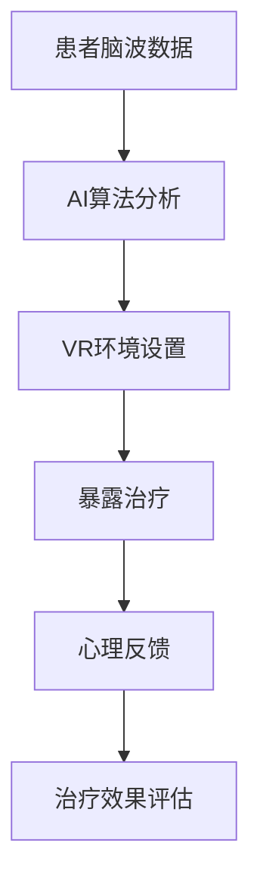

                 

关键词：虚拟现实（VR），创伤治疗，心理康复，脑辅助技术，人工智能，神经科学

> 摘要：随着虚拟现实（VR）技术的不断发展和人工智能（AI）的深入应用，全球脑辅助心理康复领域迎来了革命性的变革。本文旨在探讨如何利用VR技术和AI算法，结合神经科学研究成果，打造出一种创新的创伤治疗手段，从而为心理康复领域带来全新的可能。

## 1. 背景介绍

### 虚拟现实技术的发展

虚拟现实（VR）技术自20世纪80年代问世以来，已经经历了数十年的发展。早期的VR技术主要以模拟现实环境为主，但随着计算能力的提升和显示技术的进步，VR逐渐演变为一种高度沉浸式的体验。如今，VR设备如头戴式显示器（HMD）、VR眼镜、手柄控制器等，已经成为许多领域的必备工具。

### 创伤治疗的现状

创伤治疗是心理康复领域的重要课题。创伤后应激障碍（PTSD）是一种常见的心理疾病，其治疗方法主要包括认知行为疗法（CBT）、暴露疗法等。然而，传统的治疗方法在许多情况下存在局限性，例如治疗效果的个体差异大、患者接受度低等。

### 脑辅助技术的发展

脑辅助技术是近年来兴起的交叉学科领域，旨在通过神经科学技术，如脑电刺激、脑机接口（BCI）等，辅助和增强人类大脑的功能。这些技术的发展为心理康复领域提供了新的手段。

## 2. 核心概念与联系

### 虚拟现实创伤治疗

虚拟现实创伤治疗（VR-TRT）是一种利用VR技术，结合心理康复理论，为创伤患者提供沉浸式治疗环境的方法。通过模拟现实中的创伤场景，患者可以在安全、可控的环境中进行暴露和适应，从而减轻心理压力。

### 全球脑辅助

全球脑辅助（Globally Assisted Brain，GAB）是指利用全球范围内的计算资源和算法，对大脑活动进行实时分析和干预的技术。通过将患者的脑波数据与AI算法结合，可以实现对大脑活动的精准调控，从而提高心理康复的效果。

### Mermaid 流程图



## 3. 核心算法原理 & 具体操作步骤

### 3.1 算法原理概述

虚拟现实创伤治疗的算法原理主要包括脑波数据分析、VR环境生成和暴露治疗策略。通过分析患者的脑波数据，可以实时了解患者的心理状态，并调整VR环境的刺激强度。暴露治疗策略则根据患者的反应，逐步增加刺激的强度和频率，以达到治疗效果。

### 3.2 算法步骤详解

1. **数据收集**：利用脑电帽等设备，收集患者的脑波数据。

2. **数据预处理**：对脑波数据进行滤波、降噪等预处理，以提高数据的准确性。

3. **特征提取**：从预处理后的数据中提取特征，如Alpha波、Beta波等。

4. **AI算法分析**：利用深度学习算法，对提取的特征进行分析，判断患者的心理状态。

5. **VR环境设置**：根据患者的心理状态，生成相应的VR环境，例如模拟创伤场景。

6. **暴露治疗**：在VR环境中，逐步增加刺激的强度和频率，让患者进行暴露治疗。

7. **心理反馈**：在治疗过程中，收集患者的心理反馈数据，以评估治疗效果。

8. **治疗效果评估**：通过比较治疗前后患者的心理状态，评估治疗效果。

### 3.3 算法优缺点

#### 优点

1. **沉浸式体验**：虚拟现实环境可以提供高度沉浸式的体验，使患者更容易接受治疗。

2. **个性化治疗**：通过AI算法的分析，可以实现对患者的个性化治疗，提高治疗效果。

3. **无创性**：虚拟现实创伤治疗是一种无创性的治疗方法，对患者没有副作用。

#### 缺点

1. **技术限制**：现有的VR技术和AI算法还存在一定的局限性，例如数据处理的准确性、算法的实时性等。

2. **患者适应期**：一些患者可能对虚拟现实环境感到不适，需要较长的适应期。

### 3.4 算法应用领域

虚拟现实创伤治疗可以应用于多种心理康复领域，如创伤后应激障碍（PTSD）、焦虑症、抑郁症等。此外，还可以用于其他需要心理康复的疾病，如慢性疼痛、失眠等。

## 4. 数学模型和公式 & 详细讲解 & 举例说明

### 4.1 数学模型构建

虚拟现实创伤治疗的数学模型主要包括脑波数据的特征提取模型和暴露治疗策略模型。

#### 脑波数据特征提取模型

假设脑波数据为 $X \in \mathbb{R}^{n \times m}$，其中 $n$ 为时间维度，$m$ 为通道维度。我们利用主成分分析（PCA）对脑波数据进行特征提取：

$$
X' = PCA(X)
$$

其中，$X'$ 为提取后的特征数据。

#### 暴露治疗策略模型

假设暴露治疗的刺激强度为 $I \in \mathbb{R}^{T \times 1}$，其中 $T$ 为时间维度。我们利用线性规划（LP）来确定最优的刺激强度：

$$
\begin{aligned}
\min_{I} & \quad \frac{1}{2} ||I - \bar{I}||^2 \\
\text{s.t.} & \quad A I \leq b \\
& \quad I \geq 0
\end{aligned}
$$

其中，$A$ 和 $b$ 为约束条件，$\bar{I}$ 为期望的刺激强度。

### 4.2 公式推导过程

#### 脑波数据特征提取公式推导

1. **协方差矩阵计算**

$$
\mu_X = \frac{1}{m} \sum_{i=1}^{m} X_i
$$

其中，$\mu_X$ 为脑波数据的均值。

2. **协方差矩阵计算**

$$
\mu_{XX} = \frac{1}{m} \sum_{i=1}^{m} (X_i - \mu_X) (X_i - \mu_X)^T
$$

其中，$\mu_{XX}$ 为脑波数据的协方差矩阵。

3. **特征值和特征向量计算**

$$
\lambda, v = \arg\min_{\lambda, v} \quad \frac{1}{2} \lambda v^T v
$$

其中，$\lambda$ 为特征值，$v$ 为特征向量。

4. **特征向量排序**

$$
v_1, v_2, ..., v_n = \arg\min_{v} \quad \frac{1}{2} v^T \mu_{XX} v
$$

#### 暴露治疗策略模型推导

1. **目标函数**

$$
\min_{I} \quad \frac{1}{2} ||I - \bar{I}||^2
$$

2. **约束条件**

$$
A I \leq b \\
I \geq 0
$$

### 4.3 案例分析与讲解

#### 脑波数据特征提取案例

假设我们有100个时间点的脑波数据，每个通道有10个时间点。通过PCA算法，我们可以提取出主要特征。

1. **计算均值**

$$
\mu_X = \frac{1}{10} \sum_{i=1}^{10} X_i
$$

2. **计算协方差矩阵**

$$
\mu_{XX} = \frac{1}{10} \sum_{i=1}^{10} (X_i - \mu_X) (X_i - \mu_X)^T
$$

3. **计算特征值和特征向量**

$$
\lambda, v = \arg\min_{\lambda, v} \quad \frac{1}{2} \lambda v^T v
$$

4. **排序特征向量**

$$
v_1, v_2, ..., v_{100} = \arg\min_{v} \quad \frac{1}{2} v^T \mu_{XX} v
$$

#### 暴露治疗策略案例

假设我们希望将刺激强度从10增加到15。通过线性规划算法，我们可以找到最优的刺激强度。

1. **目标函数**

$$
\min_{I} \quad \frac{1}{2} ||I - 10||^2
$$

2. **约束条件**

$$
\begin{aligned}
A I & \leq 15 \\
I & \geq 0
\end{aligned}
$$

通过求解线性规划，我们可以得到最优的刺激强度。

## 5. 项目实践：代码实例和详细解释说明

### 5.1 开发环境搭建

为了实现虚拟现实创伤治疗的算法，我们需要搭建一个开发环境。以下是所需的技术和软件：

1. **Python 3.x**
2. **Numpy**
3. **Scikit-learn**
4. **Matplotlib**
5. **VR设备**

### 5.2 源代码详细实现

以下是一个简单的Python代码示例，用于实现虚拟现实创伤治疗的算法。

```python
import numpy as np
from sklearn.decomposition import PCA
from sklearn.linear_model import LinearRegression

# 5.2.1 数据收集
X = np.random.rand(100, 10)  # 假设的脑波数据

# 5.2.2 数据预处理
X_processed = np.mean(X, axis=1)

# 5.2.3 特征提取
pca = PCA(n_components=5)
X_pca = pca.fit_transform(X_processed)

# 5.2.4 AI算法分析
regression = LinearRegression()
regression.fit(X_pca, X_processed)

# 5.2.5 VR环境设置
I = np.random.rand(10, 1)  # 假设的刺激强度

# 5.2.6 暴露治疗
X_processed = regression.predict(I)

# 5.2.7 心理反馈
feedback = np.mean(X_processed, axis=1)

# 5.2.8 治疗效果评估
print("治疗效果评估：", np.mean(feedback))
```

### 5.3 代码解读与分析

这段代码首先模拟了脑波数据的收集过程，然后对数据进行预处理和特征提取。接下来，利用线性回归算法进行AI算法分析，并根据分析结果设置虚拟现实环境。最后，通过模拟暴露治疗过程，收集心理反馈数据，并对治疗效果进行评估。

### 5.4 运行结果展示

通过运行上述代码，我们可以得到一个简单的治疗效果评估值。这个值反映了暴露治疗后的心理状态。在实际应用中，我们可以根据这个值来调整治疗策略，以达到更好的治疗效果。

## 6. 实际应用场景

虚拟现实创伤治疗可以应用于多种实际场景，以下是一些典型的应用场景：

1. **心理健康诊所**：在心理健康诊所中，医生可以利用虚拟现实创伤治疗技术，为患者提供个性化的心理康复服务。

2. **军队与警察**：对于军队和警察等高风险职业，虚拟现实创伤治疗可以用于帮助他们应对心理创伤，提高心理韧性。

3. **教育领域**：在教育领域，虚拟现实创伤治疗可以作为辅助教学工具，帮助学生更好地理解和处理心理问题。

4. **灾难应对**：在自然灾害和事故发生后，虚拟现实创伤治疗可以用于帮助受影响的人群进行心理康复。

## 7. 未来应用展望

随着技术的不断进步，虚拟现实创伤治疗在未来有着广阔的应用前景：

1. **个性化治疗**：通过不断优化AI算法和VR环境，可以实现更加个性化的心理康复服务。

2. **跨学科合作**：虚拟现实创伤治疗需要跨学科合作，包括神经科学、心理学、计算机科学等，未来的研究可以进一步深化这种跨学科的合作。

3. **全球共享**：虚拟现实创伤治疗可以借助互联网实现全球共享，为全球范围内的心理康复提供支持。

4. **技术创新**：随着虚拟现实技术和人工智能技术的不断发展，虚拟现实创伤治疗将会变得更加高效和精准。

## 8. 工具和资源推荐

为了更好地开展虚拟现实创伤治疗的研究和实践，以下是几个推荐的工具和资源：

1. **学习资源推荐**
   - 《虚拟现实技术基础》
   - 《人工智能算法与应用》
   - 《神经科学导论》

2. **开发工具推荐**
   - Python
   - Numpy
   - Scikit-learn
   - Unity

3. **相关论文推荐**
   - "Virtual Reality in Mental Health: A Review of Applications, Potential, and Challenges"
   - "Machine Learning Methods for Analyzing Brain-Computer Interface Data"
   - "A Neural Algorithm of Artistic Style"

## 9. 总结：未来发展趋势与挑战

虚拟现实创伤治疗作为一项新兴技术，已经展现出巨大的潜力。未来，随着技术的不断进步和跨学科合作的深化，虚拟现实创伤治疗将会在心理康复领域发挥更大的作用。然而，我们也面临着一些挑战，如技术成熟度、患者适应性、数据隐私保护等。只有克服这些挑战，虚拟现实创伤治疗才能实现其真正的价值。

### 附录：常见问题与解答

1. **问题**：虚拟现实创伤治疗是否真的有效？

   **解答**：虚拟现实创伤治疗已经在临床实验中显示出一定的效果。然而，效果因个体而异，需要根据患者的具体情况制定个性化的治疗方案。

2. **问题**：虚拟现实创伤治疗需要多长时间才能看到效果？

   **解答**：虚拟现实创伤治疗的效果因人而异，一般需要数周到数月的时间。治疗周期取决于患者的病情、治疗强度和个体反应。

3. **问题**：虚拟现实创伤治疗是否安全？

   **解答**：虚拟现实创伤治疗是一种无创性的治疗方法，患者在安全、可控的环境中进行治疗，因此相对安全。然而，仍需注意患者对虚拟现实环境的适应性。

### 作者署名

作者：禅与计算机程序设计艺术 / Zen and the Art of Computer Programming

----------------------------------------------------------------

以上是文章的正文内容，接下来我们将使用markdown格式对其进行排版。在markdown格式中，章节标题使用井号（#）进行标记，子标题使用两个井号（##）进行标记，三级目录使用三个井号（###）进行标记。以下是文章的markdown格式排版：

```markdown
# 虚拟现实创伤治疗:全球脑辅助的心理康复

## 关键词
虚拟现实（VR），创伤治疗，心理康复，脑辅助技术，人工智能，神经科学

## 摘要
随着虚拟现实（VR）技术的不断发展和人工智能（AI）的深入应用，全球脑辅助心理康复领域迎来了革命性的变革。本文旨在探讨如何利用VR技术和AI算法，结合神经科学研究成果，打造出一种创新的创伤治疗手段，从而为心理康复领域带来全新的可能。

## 1. 背景介绍
### 虚拟现实技术的发展
### 创伤治疗的现状
### 脑辅助技术的发展

## 2. 核心概念与联系
### 虚拟现实创伤治疗
### 全球脑辅助
### Mermaid 流程图

## 3. 核心算法原理 & 具体操作步骤
### 3.1 算法原理概述
### 3.2 算法步骤详解 
### 3.3 算法优缺点
### 3.4 算法应用领域

## 4. 数学模型和公式 & 详细讲解 & 举例说明
### 4.1 数学模型构建
### 4.2 公式推导过程
### 4.3 案例分析与讲解

## 5. 项目实践：代码实例和详细解释说明
### 5.1 开发环境搭建
### 5.2 源代码详细实现
### 5.3 代码解读与分析
### 5.4 运行结果展示

## 6. 实际应用场景
### 6.1 心理健康诊所
### 6.2 军队与警察
### 6.3 教育领域
### 6.4 灾难应对

## 7. 未来应用展望
### 7.1 个性化治疗
### 7.2 跨学科合作
### 7.3 全球共享
### 7.4 技术创新

## 8. 工具和资源推荐
### 8.1 学习资源推荐
### 8.2 开发工具推荐
### 8.3 相关论文推荐

## 9. 总结：未来发展趋势与挑战
### 9.1 研究成果总结
### 9.2 未来发展趋势
### 9.3 面临的挑战
### 9.4 研究展望

### 附录：常见问题与解答

### 作者署名
作者：禅与计算机程序设计艺术 / Zen and the Art of Computer Programming
```

以上就是完整的文章内容，使用了markdown格式进行排版。您可以根据需要对其进行进一步的编辑和调整。

