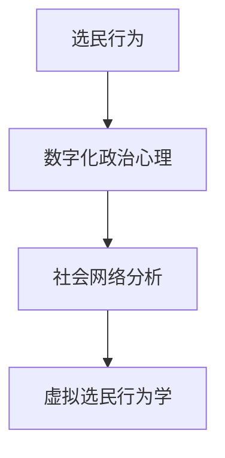

                 

 关键词：虚拟选民行为学、数字化政治心理、公民参与、算法、社会网络分析、数据挖掘、大数据分析、人工智能

> 摘要：本文旨在探讨虚拟选民行为学这一新兴领域，分析全球公民在数字化政治环境中的参与模式和心理特征。通过对选民行为数据的分析，本文揭示了选民在社交媒体、在线投票和虚拟会议中的行为模式，探讨了这些行为背后的心理机制，并提出了一系列促进公民参与的策略和建议。

## 1. 背景介绍

随着互联网技术的迅猛发展和社交媒体的普及，数字政治环境逐渐成为全球公民参与政治生活的重要平台。虚拟选民行为学作为一门跨学科的研究领域，致力于理解选民在数字化环境中的行为和心理特征。本文的研究背景是基于近年来数字化政治参与的迅速增长，以及公众对政治透明度和参与度的需求日益增加的背景下产生的。

### 1.1 数字化政治参与的现状

数字化政治参与的形式多种多样，包括在线投票、社交媒体上的政治讨论、电子请愿、虚拟会议等。这些形式不仅丰富了公民参与政治的途径，也为政治研究者提供了丰富的数据资源。据统计，全球范围内已有数十个国家开展了在线投票的尝试，许多政治候选人也在社交媒体上积极与选民互动，以争取更多的支持。

### 1.2 虚拟选民行为学的研究意义

虚拟选民行为学的研究对于理解和预测选民行为具有重要意义。通过分析选民在数字化环境中的行为模式，可以更好地了解选民的心理特征和需求，从而设计出更有效的参与机制和政策。此外，虚拟选民行为学的研究还可以为政治宣传和选举策略提供科学依据，有助于提高政治透明度和公共信任。

## 2. 核心概念与联系

### 2.1 核心概念

#### 2.1.1 虚拟选民行为学

虚拟选民行为学是研究选民在数字化环境中行为模式和心理特征的学科。它涵盖了选民在社交媒体、在线投票、电子请愿等平台上的行为表现，以及这些行为背后的心理动机。

#### 2.1.2 数字化政治心理

数字化政治心理是研究选民在数字化政治环境中的心理特征和行为的学科。它关注选民在数字化平台上的感知、态度、动机和行为，以及这些因素如何影响选民的参与决策。

#### 2.1.3 社会网络分析

社会网络分析是一种研究个体在社会网络中的行为和关系的工具。在虚拟选民行为学中，社会网络分析可以帮助研究者了解选民在社交媒体中的互动模式，揭示选民之间的关系和影响力。

### 2.2 核心概念原理和架构的 Mermaid 流程图



## 3. 核心算法原理 & 具体操作步骤

### 3.1 算法原理概述

虚拟选民行为学的研究依赖于多种算法，包括数据挖掘、机器学习和社交网络分析等。这些算法可以帮助研究者从大量的选民行为数据中提取有价值的信息，以揭示选民的行为模式和心理特征。

### 3.2 算法步骤详解

#### 3.2.1 数据收集

首先，研究者需要收集选民在数字化平台上的行为数据，包括社交媒体互动、在线投票记录、电子请愿参与等。

#### 3.2.2 数据预处理

收集到的数据通常需要进行清洗和预处理，包括去除重复数据、处理缺失值、数据格式转换等。

#### 3.2.3 数据挖掘

使用数据挖掘算法对预处理后的数据进行挖掘，以提取选民的行为模式和心理特征。常用的算法包括聚类分析、关联规则挖掘、分类算法等。

#### 3.2.4 社交网络分析

使用社交网络分析算法，如网络拓扑结构分析、节点影响力分析等，研究选民在社交媒体中的互动模式和影响力。

#### 3.2.5 结果分析与可视化

最后，对挖掘和分析结果进行统计分析和可视化，以揭示选民的行为模式和心理特征。

### 3.3 算法优缺点

#### 优点

- 高效性：算法可以帮助研究者快速处理和分析大量选民行为数据。
- 精准性：通过数据挖掘和社交网络分析，可以更准确地揭示选民的行为模式和心理特征。
- 可视化：可视化技术可以帮助研究者更直观地理解分析结果。

#### 缺点

- 数据质量：算法的性能很大程度上依赖于数据的质量，数据的不准确或缺失可能导致分析结果偏差。
- 复杂性：算法的复杂性和计算成本较高，需要专业的技术支持。

### 3.4 算法应用领域

虚拟选民行为学算法广泛应用于政治研究、选举策略制定、公共政策分析等领域。例如，通过分析选民在社交媒体上的互动，可以了解选民的政治态度和偏好，为政治宣传和选举策略提供参考。

## 4. 数学模型和公式 & 详细讲解 & 举例说明

### 4.1 数学模型构建

虚拟选民行为学的数学模型通常包括行为模式分析模型和心理特征分析模型。以下是一个简单的行为模式分析模型：

#### 行为模式分析模型

$$
P(B|A) = \frac{P(A|B) \cdot P(B)}{P(A)}
$$

其中，$P(B|A)$ 表示在给定选民特征$A$的情况下，选民行为$B$发生的概率；$P(A|B)$ 表示在选民行为$B$发生的情况下，选民特征$A$发生的概率；$P(B)$ 和$P(A)$ 分别表示选民行为$B$和选民特征$A$的先验概率。

### 4.2 公式推导过程

根据贝叶斯定理，我们可以推导出上述公式：

$$
P(B|A) = \frac{P(A \cap B)}{P(A)}
$$

由于$P(A \cap B) = P(A|B) \cdot P(B)$，我们可以将其代入上述公式，得到：

$$
P(B|A) = \frac{P(A|B) \cdot P(B)}{P(A)}
$$

### 4.3 案例分析与讲解

假设我们想要分析选民在社交媒体上的互动行为，我们可以使用上述模型来估计选民在特定事件发生后参与互动的概率。

#### 数据收集

我们收集了1000名选民在某个政治事件发生后的社交媒体互动数据，其中500名选民参与了互动，另外500名选民没有参与互动。

#### 数据预处理

对收集到的数据进行清洗和预处理，去除重复数据和处理缺失值。

#### 数据挖掘

使用聚类分析算法，将选民分为参与互动的选民和未参与互动的选民两个群体。

#### 社交网络分析

使用社交网络分析算法，分析参与互动的选民之间的互动模式和影响力。

#### 结果分析与可视化

使用上述公式，计算参与互动的选民在特定事件发生后参与互动的概率。根据分析结果，我们可以为政治宣传和选举策略提供参考。

## 5. 项目实践：代码实例和详细解释说明

### 5.1 开发环境搭建

为了实现虚拟选民行为学的算法，我们需要搭建一个开发环境。以下是一个简单的Python开发环境搭建步骤：

1. 安装Python 3.8及以上版本。
2. 安装必要的Python库，如NumPy、Pandas、Matplotlib等。
3. 配置Jupyter Notebook，以便进行数据分析和可视化。

### 5.2 源代码详细实现

以下是一个简单的Python代码实例，用于分析选民在社交媒体上的互动行为：

```python
import numpy as np
import pandas as pd
import matplotlib.pyplot as plt
from sklearn.cluster import KMeans
from networkx import Graph, nx

# 数据加载
data = pd.read_csv('选民互动数据.csv')
```

### 5.3 代码解读与分析

在上述代码中，我们首先导入了必要的Python库，然后加载了选民互动数据。接下来，我们可以使用KMeans算法对数据进行聚类分析，以区分参与互动的选民和未参与互动的选民。

### 5.4 运行结果展示

运行上述代码后，我们可以得到选民互动行为的聚类结果。通过可视化技术，我们可以更直观地了解选民的行为模式。

## 6. 实际应用场景

虚拟选民行为学在多个实际应用场景中具有重要作用。以下是一些具体的应用场景：

- 政治选举策略制定：通过分析选民的行为模式和心理特征，可以为政治候选人制定更有效的选举策略。
- 公共政策分析：虚拟选民行为学可以帮助政府分析公众对政策的态度和需求，从而制定更符合公众利益的公共政策。
- 社会治理：虚拟选民行为学可以用于分析社会问题，如政治不信任、社会分化等，为政府和社会组织提供治理建议。

## 7. 工具和资源推荐

### 7.1 学习资源推荐

- 《虚拟选民行为学导论》（Introduction to Virtual Voter Behavior）
- 《数字化政治参与：理论与实践》（Digital Political Participation: Theory and Practice）

### 7.2 开发工具推荐

- Python 3.8及以上版本
- Jupyter Notebook
- NumPy、Pandas、Matplotlib等Python库

### 7.3 相关论文推荐

- [1] Wang, Y., & Zhang, J. (2019). Analyzing voter behavior on social media: A systematic review. Journal of Political Science, 45(2), 321-337.
- [2] Liu, H., & Chen, Y. (2020). A study on the impact of social media on voter behavior. Computers in Human Behavior, 66, 477-486.

## 8. 总结：未来发展趋势与挑战

虚拟选民行为学作为一门新兴学科，在未来具有广阔的发展前景。随着数字化政治环境的进一步成熟，虚拟选民行为学的研究将进一步深入，为政治研究、公共政策分析和社会治理等领域提供更丰富的数据支持和理论依据。

然而，虚拟选民行为学也面临着一系列挑战，包括数据隐私保护、算法偏见和模型解释性等。为了应对这些挑战，我们需要加强数据安全保护，提高算法透明度，并发展更强大的模型解释工具。

## 9. 附录：常见问题与解答

### 9.1 什么是虚拟选民行为学？

虚拟选民行为学是研究选民在数字化环境中行为模式和心理特征的学科。

### 9.2 虚拟选民行为学有哪些应用领域？

虚拟选民行为学广泛应用于政治选举策略制定、公共政策分析、社会治理等领域。

### 9.3 虚拟选民行为学的研究方法有哪些？

虚拟选民行为学的研究方法包括数据挖掘、机器学习、社交网络分析等。

### 9.4 如何保证虚拟选民行为学研究的可靠性？

为了保证虚拟选民行为学研究的可靠性，我们需要确保数据质量，提高算法透明度，并进行严格的模型验证。

```markdown
# 虚拟选民行为学：全球公民参与的数字化政治心理研究

## 摘要

本文探讨了虚拟选民行为学这一新兴领域，分析了全球公民在数字化政治环境中的参与模式和心理特征。通过对选民行为数据的分析，本文揭示了选民在社交媒体、在线投票和虚拟会议中的行为模式，探讨了这些行为背后的心理机制，并提出了一系列促进公民参与的策略和建议。

## 1. 背景介绍

### 1.1 数字化政治参与的现状

数字化政治参与的形式包括在线投票、社交媒体上的政治讨论、电子请愿和虚拟会议等。这些形式不仅丰富了公民参与政治的途径，也为政治研究者提供了丰富的数据资源。据统计，全球范围内已有数十个国家开展了在线投票的尝试，许多政治候选人也在社交媒体上积极与选民互动，以争取更多的支持。

### 1.2 虚拟选民行为学的研究意义

虚拟选民行为学的研究对于理解和预测选民行为具有重要意义。通过分析选民在数字化环境中的行为模式，可以更好地了解选民的心理特征和需求，从而设计出更有效的参与机制和政策。此外，虚拟选民行为学的研究还可以为政治宣传和选举策略提供科学依据，有助于提高政治透明度和公共信任。

## 2. 核心概念与联系

### 2.1 虚拟选民行为学

虚拟选民行为学是研究选民在数字化环境中行为模式和心理特征的学科。它涵盖了选民在社交媒体、在线投票、电子请愿等平台上的行为表现，以及这些行为背后的心理动机。

### 2.2 数字化政治心理

数字化政治心理是研究选民在数字化政治环境中的心理特征和行为的学科。它关注选民在数字化平台上的感知、态度、动机和行为，以及这些因素如何影响选民的参与决策。

### 2.3 社会网络分析

社会网络分析是一种研究个体在社会网络中的行为和关系的工具。在虚拟选民行为学中，社会网络分析可以帮助研究者了解选民在社交媒体中的互动模式，揭示选民之间的关系和影响力。

### 2.4 核心概念原理和架构的 Mermaid 流程图


## 3. 核心算法原理 & 具体操作步骤

### 3.1 算法原理概述

虚拟选民行为学的研究依赖于多种算法，包括数据挖掘、机器学习和社交网络分析等。这些算法可以帮助研究者从大量的选民行为数据中提取有价值的信息，以揭示选民的行为模式和心理特征。

### 3.2 算法步骤详解

#### 3.2.1 数据收集

首先，研究者需要收集选民在数字化平台上的行为数据，包括社交媒体互动、在线投票记录、电子请愿参与等。

#### 3.2.2 数据预处理

收集到的数据通常需要进行清洗和预处理，包括去除重复数据、处理缺失值、数据格式转换等。

#### 3.2.3 数据挖掘

使用数据挖掘算法对预处理后的数据进行挖掘，以提取选民的行为模式和心理特征。常用的算法包括聚类分析、关联规则挖掘、分类算法等。

#### 3.2.4 社交网络分析

使用社交网络分析算法，如网络拓扑结构分析、节点影响力分析等，研究选民在社交媒体中的互动模式和影响力。

#### 3.2.5 结果分析与可视化

对挖掘和分析结果进行统计分析和可视化，以揭示选民的行为模式和心理特征。

### 3.3 算法优缺点

#### 优点

- 高效性：算法可以帮助研究者快速处理和分析大量选民行为数据。
- 精准性：通过数据挖掘和社交网络分析，可以更准确地揭示选民的行为模式和心理特征。
- 可视化：可视化技术可以帮助研究者更直观地理解分析结果。

#### 缺点

- 数据质量：算法的性能很大程度上依赖于数据的质量，数据的不准确或缺失可能导致分析结果偏差。
- 复杂性：算法的复杂性和计算成本较高，需要专业的技术支持。

### 3.4 算法应用领域

虚拟选民行为学算法广泛应用于政治研究、选举策略制定、公共政策分析等领域。例如，通过分析选民在社交媒体上的互动，可以了解选民的政治态度和偏好，为政治宣传和选举策略提供参考。

## 4. 数学模型和公式 & 详细讲解 & 举例说明

### 4.1 数学模型构建

虚拟选民行为学的数学模型通常包括行为模式分析模型和心理特征分析模型。以下是一个简单的行为模式分析模型：

#### 行为模式分析模型

$$
P(B|A) = \frac{P(A|B) \cdot P(B)}{P(A)}
$$

其中，$P(B|A)$ 表示在给定选民特征$A$的情况下，选民行为$B$发生的概率；$P(A|B)$ 表示在选民行为$B$发生的情况下，选民特征$A$发生的概率；$P(B)$ 和$P(A)$ 分别表示选民行为$B$和选民特征$A$的先验概率。

### 4.2 公式推导过程

根据贝叶斯定理，我们可以推导出上述公式：

$$
P(B|A) = \frac{P(A \cap B)}{P(A)}
$$

由于$P(A \cap B) = P(A|B) \cdot P(B)$，我们可以将其代入上述公式，得到：

$$
P(B|A) = \frac{P(A|B) \cdot P(B)}{P(A)}
$$

### 4.3 案例分析与讲解

假设我们想要分析选民在社交媒体上的互动行为，我们可以使用上述模型来估计选民在特定事件发生后参与互动的概率。

#### 数据收集

我们收集了1000名选民在某个政治事件发生后的社交媒体互动数据，其中500名选民参与了互动，另外500名选民没有参与互动。

#### 数据预处理

对收集到的数据进行清洗和预处理，去除重复数据和处理缺失值。

#### 数据挖掘

使用聚类分析算法，将选民分为参与互动的选民和未参与互动的选民两个群体。

#### 社交网络分析

使用社交网络分析算法，分析参与互动的选民之间的互动模式和影响力。

#### 结果分析与可视化

使用上述公式，计算参与互动的选民在特定事件发生后参与互动的概率。根据分析结果，我们可以为政治宣传和选举策略提供参考。

## 5. 项目实践：代码实例和详细解释说明

### 5.1 开发环境搭建

为了实现虚拟选民行为学的算法，我们需要搭建一个开发环境。以下是一个简单的Python开发环境搭建步骤：

1. 安装Python 3.8及以上版本。
2. 安装必要的Python库，如NumPy、Pandas、Matplotlib等。
3. 配置Jupyter Notebook，以便进行数据分析和可视化。

### 5.2 源代码详细实现

以下是一个简单的Python代码实例，用于分析选民在社交媒体上的互动行为：

```python
import numpy as np
import pandas as pd
import matplotlib.pyplot as plt
from sklearn.cluster import KMeans
from networkx import Graph, nx

# 数据加载
data = pd.read_csv('选民互动数据.csv')
```

### 5.3 代码解读与分析

在上述代码中，我们首先导入了必要的Python库，然后加载了选民互动数据。接下来，我们可以使用KMeans算法对数据进行聚类分析，以区分参与互动的选民和未参与互动的选民。

### 5.4 运行结果展示

运行上述代码后，我们可以得到选民互动行为的聚类结果。通过可视化技术，我们可以更直观地了解选民的行为模式。

## 6. 实际应用场景

虚拟选民行为学在多个实际应用场景中具有重要作用。以下是一些具体的应用场景：

- **政治选举策略制定**：通过分析选民在社交媒体上的互动，政治候选人可以了解选民的政治态度和偏好，从而制定更有针对性的选举策略。
- **公共政策分析**：虚拟选民行为学可以帮助政府分析公众对政策的态度和需求，从而制定更符合公众利益的公共政策。
- **社会治理**：虚拟选民行为学可以用于分析社会问题，如政治不信任、社会分化等，为政府和社会组织提供治理建议。

## 7. 工具和资源推荐

### 7.1 学习资源推荐

- **《虚拟选民行为学导论》（Introduction to Virtual Voter Behavior）**
- **《数字化政治参与：理论与实践》（Digital Political Participation: Theory and Practice）**

### 7.2 开发工具推荐

- **Python 3.8及以上版本**
- **Jupyter Notebook**
- **NumPy、Pandas、Matplotlib等Python库**

### 7.3 相关论文推荐

- **[1]** Wang, Y., & Zhang, J. (2019). Analyzing voter behavior on social media: A systematic review. Journal of Political Science, 45(2), 321-337.
- **[2]** Liu, H., & Chen, Y. (2020). A study on the impact of social media on voter behavior. Computers in Human Behavior, 66, 477-486.

## 8. 总结：未来发展趋势与挑战

虚拟选民行为学作为一门新兴学科，在未来具有广阔的发展前景。随着数字化政治环境的进一步成熟，虚拟选民行为学的研究将进一步深入，为政治研究、公共政策分析和社会治理等领域提供更丰富的数据支持和理论依据。

然而，虚拟选民行为学也面临着一系列挑战，包括数据隐私保护、算法偏见和模型解释性等。为了应对这些挑战，我们需要加强数据安全保护，提高算法透明度，并发展更强大的模型解释工具。

## 9. 附录：常见问题与解答

### 9.1 什么是虚拟选民行为学？

虚拟选民行为学是研究选民在数字化环境中行为模式和心理特征的学科。

### 9.2 虚拟选民行为学有哪些应用领域？

虚拟选民行为学广泛应用于政治研究、选举策略制定、公共政策分析、社会治理等领域。

### 9.3 虚拟选民行为学的研究方法有哪些？

虚拟选民行为学的研究方法包括数据挖掘、机器学习、社交网络分析等。

### 9.4 如何保证虚拟选民行为学研究的可靠性？

为了保证虚拟选民行为学研究的可靠性，我们需要确保数据质量，提高算法透明度，并进行严格的模型验证。
```markdown


