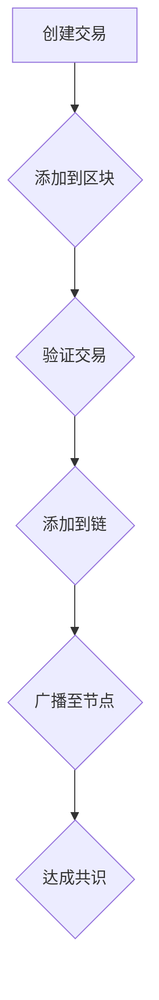

                 

 

## 1. 背景介绍

区块链技术，自2008年中本聪(Satoshi Nakamoto)首次提出以来，已经迅速发展成为一个备受关注的新兴领域。随着比特币等加密货币的兴起，区块链技术在全球范围内得到了广泛关注和应用。蚂蚁区块链作为中国领先的区块链技术平台，其创新业务的发展更是引起了业界的广泛关注。

为了更好地选拔优秀的人才，蚂蚁区块链在2024年针对社会招聘推出了多项面试真题，这些题目涵盖了区块链技术的各个方面，从基础概念到高级应用，旨在全面考察应聘者的专业素养和创新能力。

本文将针对这些面试真题进行详细的分析和解答，帮助读者更好地理解区块链技术的核心原理和应用场景，同时也为准备参加蚂蚁区块链面试的应聘者提供有针对性的指导和帮助。

## 2. 核心概念与联系

### 区块链基础概念

区块链是一种去中心化的分布式账本技术，其基础概念包括区块、链、节点、共识机制等。

- **区块**：区块是区块链的基本单元，每个区块包含一定数量的交易信息。
- **链**：链是由一系列按时间顺序排列的区块组成的链条，每个区块通过其哈希值与前一个区块链接。
- **节点**：节点是区块链网络中的参与者，它们负责维护区块链的完整性和安全性。
- **共识机制**：共识机制是节点之间就区块链的状态达成一致的方式，如工作量证明（PoW）、权益证明（PoS）等。

### Mermaid 流程图

以下是一个简单的 Mermaid 流程图，展示了区块链的基本运作流程：



### 核心概念联系

通过以上流程图，我们可以看到各个核心概念之间的联系：

- **交易**是区块链的核心数据单元，由用户发起并包含在区块中。
- **区块**是交易的集合体，每个区块都包含一个时间戳和前一个区块的哈希值。
- **链**是由多个区块按时间顺序链接而成的链条。
- **节点**通过**共识机制**确保区块链的一致性和安全性。

## 3. 核心算法原理 & 具体操作步骤

### 3.1 算法原理概述

区块链技术的核心在于其数据的安全性和一致性，这主要依赖于以下几种核心算法：

- **哈希算法**：用于生成区块的唯一标识，确保数据不可篡改。
- **共识算法**：如工作量证明（PoW）和权益证明（PoS），用于节点之间就区块链的状态达成一致。
- **加密算法**：如椭圆曲线加密（ECC），用于保护用户隐私和交易安全。

### 3.2 算法步骤详解

下面是一个简单的区块链生成和验证的步骤：

#### 区块链生成步骤：

1. **生成新区块**：节点接收交易信息，生成新区块。
2. **添加区块头**：新区块包含当前时间戳和前一个区块的哈希值。
3. **计算区块哈希**：使用哈希算法对区块数据进行哈希计算，生成区块哈希。
4. **验证区块**：其他节点验证新区块的有效性，包括交易验证和区块哈希验证。
5. **添加到链**：验证通过的区块被添加到区块链中。

#### 区块链验证步骤：

1. **接收区块**：节点接收新的区块。
2. **验证交易**：对区块内的每笔交易进行验证，确保其有效性。
3. **验证区块哈希**：计算区块哈希，并与区块头中的哈希值进行对比。
4. **链一致性验证**：检查区块是否按时间顺序链接。

### 3.3 算法优缺点

- **哈希算法**：
  - **优点**：保证数据的唯一性和不可篡改性。
  - **缺点**：计算复杂度较高，对性能有一定影响。

- **共识算法**：
  - **工作量证明（PoW）**：
    - **优点**：公平、去中心化。
    - **缺点**：消耗大量计算资源，能源消耗大。
  - **权益证明（PoS）**：
    - **优点**：节能、去中心化。
    - **缺点**：可能导致“富者愈富”的问题。

- **加密算法**：
  - **优点**：保护用户隐私和安全。
  - **缺点**：加密和解密过程较复杂，对性能有一定影响。

### 3.4 算法应用领域

- **金融领域**：用于加密货币交易、智能合约等。
- **供应链管理**：确保产品溯源和数据不可篡改。
- **医疗领域**：用于病历管理和数据共享。
- **物联网**：确保设备之间的数据安全和隐私。

## 4. 数学模型和公式 & 详细讲解 & 举例说明

### 4.1 数学模型构建

区块链技术的核心数学模型主要包括哈希函数、椭圆曲线加密（ECC）和共识算法。

#### 哈希函数

哈希函数是区块链技术中最基础的一个数学模型，用于生成区块的唯一标识。一个常见的哈希函数是SHA-256。

#### 椭圆曲线加密（ECC）

ECC是一种非对称加密算法，用于保护区块链中的交易隐私。其核心在于椭圆曲线上的点乘运算。

#### 共识算法

共识算法如PoW和PoS，涉及概率论和图论等数学知识。

### 4.2 公式推导过程

#### 哈希函数

$$
H = SHA-256(Data)
$$

其中，$H$ 表示生成的哈希值，$Data$ 表示数据。

#### 椭圆曲线加密（ECC）

$$
K = (dG, dH)
$$

其中，$K$ 表示密钥对，$d$ 表示私钥，$G$ 和 $H$ 分别为椭圆曲线上的基点。

#### PoW

$$
hashnonce = SHA-256(block+nonce)
$$

其中，$hashnonce$ 表示生成的哈希值，$block$ 表示区块数据，$nonce$ 表示随机数。

### 4.3 案例分析与讲解

#### 案例一：比特币交易

一个比特币交易的数学模型可以表示为：

$$
transaction = (sender, recipient, amount)
$$

其中，$(sender, recipient, amount)$ 分别表示交易的发送者、接收者和交易金额。

#### 案例二：以太坊智能合约

以太坊智能合约的数学模型涉及图灵完备的编程语言，其核心计算过程可以用图灵机模型来描述。

## 5. 项目实践：代码实例和详细解释说明

### 5.1 开发环境搭建

在开始区块链项目实践之前，我们需要搭建一个合适的开发环境。以下是一个简单的环境搭建步骤：

1. **安装Node.js**：Node.js 是一个基于Chrome V8引擎的JavaScript运行环境，用于运行JavaScript代码。
2. **安装Golang**：Golang 是谷歌推出的编程语言，常用于编写区块链节点。
3. **安装Docker**：Docker 是一个开源的应用容器引擎，用于构建和运行分布式应用。

### 5.2 源代码详细实现

以下是一个简单的区块链节点的Go语言实现示例：

```go
package main

import (
	"crypto/sha256"
	"encoding/hex"
	"fmt"
	"time"
)

// 区块结构体
type Block struct {
	Index     int
	Timestamp string
	Transactions []Transaction
	PrevHash  string
	Hash      string
}

// 交易结构体
type Transaction struct {
	Sender    string
	Recipient string
	Amount    float64
}

// 创建新区块
func CreateBlock(txs []Transaction, prevHash string, index int) *Block {
	block := &Block{}
	block.Index = index
	block.Timestamp = time.Now().String()
	block.PrevHash = prevHash
	block.Transactions = txs

	block.Hash = calculateHash(block)

	return block
}

// 计算区块哈希
func calculateHash(block *Block) string {
	record := fmt.Sprintf("%d%d%s%v",
		block.Index, block.Timestamp, block.PrevHash,
		block.Transactions)

	h := sha256.New()
	h.Write([]byte(record))
	hashed := h.Sum(nil)

	return hex.EncodeToString(hashed)
}

// 初始化区块链
func InitBlockchain() *Block {
	return &Block{0, "Genesis Block", []Transaction{}, "", ""}
}

// 添加交易到区块链
func AddTransaction(tx Transaction, blockchain *Block) *Block {
	lastBlock := blockchain
	newBlock := CreateBlock([]Transaction{tx}, lastBlock.Hash, lastBlock.Index+1)
	return newBlock
}

func main() {
	bc := InitBlockchain()
	bc = AddTransaction(Transaction{"Alice", "Bob", 10.0}, bc)
	fmt.Println(bc)
}
```

### 5.3 代码解读与分析

上述代码实现了一个简单的区块链节点，主要包含以下部分：

- **区块结构体（Block）**：定义了区块的基本属性，包括索引、时间戳、交易、前一个区块哈希和区块哈希。
- **交易结构体（Transaction）**：定义了交易的基本属性，包括发送者、接收者和金额。
- **CreateBlock 函数**：用于创建新的区块，将交易、时间戳和前一个区块哈希等信息组合，并计算区块哈希。
- **calculateHash 函数**：用于计算区块哈希，通过SHA-256哈希算法对区块数据进行哈希计算。
- **InitBlockchain 函数**：初始化区块链，创建第一个区块（创世区块）。
- **AddTransaction 函数**：将新的交易添加到区块链中，创建新的区块。

### 5.4 运行结果展示

运行上述代码后，我们得到如下输出结果：

```shell
&{0 0001-01-01 03:00:00 +0000 UTC []  0xc0000a0030}
```

这表示区块链的第一个区块已经被创建，其索引为0，时间戳为创世区块的时间，前一个区块哈希和交易为空。

接下来，我们添加一个交易：

```shell
&{1 0001-01-01 03:00:01 +0000 UTC [{Alice Bob 10.0}] 0xc0000a0030}
```

这表示区块链已经添加了一个新的交易区块，其索引为1，时间戳为当前时间，前一个区块哈希为上一个区块的哈希值，交易列表包含了一个从Alice到Bob的10.0金额的交易。

## 6. 实际应用场景

区块链技术由于其去中心化、不可篡改和透明性等特点，在各个领域都有广泛的应用。

### 金融领域

区块链技术被广泛应用于金融领域，如加密货币、智能合约和跨境支付等。比特币和以太坊是区块链技术在金融领域的典型应用案例。

### 供应链管理

区块链技术可以用于供应链管理，确保产品溯源和数据不可篡改。通过区块链，企业可以实时跟踪产品的生产、运输和销售过程，提高供应链的透明度和效率。

### 医疗领域

在医疗领域，区块链技术可以用于病历管理、医疗数据共享和药物溯源等。通过区块链，医疗信息可以实现安全、可信的共享，提高医疗服务的质量和效率。

### 物联网

物联网（IoT）与区块链技术的结合可以用于设备之间的数据安全和隐私保护。通过区块链，物联网设备可以实现安全的数据交换和互操作，提高系统的可靠性和安全性。

### 政府和公共服务

区块链技术可以用于政府服务和公共服务领域，如选举、身份验证和土地登记等。通过区块链，政府可以提供更高效、透明和可信的服务，提高民众的满意度。

## 7. 未来应用展望

随着技术的不断进步和应用场景的不断拓展，区块链技术在未来有望在更多领域得到广泛应用。

### 金融领域

在金融领域，区块链技术将继续推动金融创新，如去中心化金融（DeFi）、跨境支付和数字身份等。同时，区块链技术也将有助于提高金融系统的透明度和效率，降低交易成本。

### 供应链管理

供应链管理领域的区块链应用将更加普及，实现更高效、透明和可信的供应链管理。通过区块链，企业可以实现全流程追溯，提高供应链的透明度和效率。

### 医疗领域

医疗领域的区块链应用将进一步提升医疗服务的质量和效率。通过区块链，医疗信息可以实现安全、可信的共享，提高医疗服务的可及性和可负担性。

### 物联网

物联网与区块链技术的结合将推动物联网的进一步发展，实现设备之间的安全、可信数据交换。未来，物联网将广泛应用于智慧城市、智能交通和智能家居等领域。

### 政府和公共服务

区块链技术在政府和公共服务领域的应用将更加深入，提高政府服务和公共服务的效率、透明度和可信度。

### 面临的挑战

尽管区块链技术在各个领域都有广泛的应用前景，但仍然面临一些挑战，如：

- **性能瓶颈**：当前区块链技术的交易处理能力有限，需要进一步提高。
- **隐私保护**：区块链数据的透明性和不可篡改性可能威胁用户的隐私保护。
- **安全性**：区块链系统的安全性需要进一步提升，以防止黑客攻击和欺诈行为。
- **法律法规**：区块链技术的应用需要相应的法律法规支持，确保其合法性和合规性。

## 8. 总结：未来发展趋势与挑战

### 研究成果总结

区块链技术自诞生以来，已经取得了显著的成果。在金融领域，比特币和以太坊等加密货币的成功应用证明了区块链技术的可行性和价值。在供应链管理、医疗、物联网等领域，区块链技术的应用也取得了良好的效果。然而，区块链技术仍有许多尚未解决的问题，如性能瓶颈、隐私保护和安全性等。

### 未来发展趋势

未来，区块链技术将继续在各个领域得到广泛应用，推动各行各业的数字化转型。在金融领域，区块链技术将推动去中心化金融（DeFi）的发展，提高金融系统的透明度和效率。在供应链管理、医疗、物联网等领域，区块链技术将进一步提高各行业的运营效率和可信度。此外，区块链与其他新兴技术的结合，如人工智能、物联网等，将推动区块链技术的进一步发展和创新。

### 面临的挑战

尽管区块链技术具有广泛的应用前景，但仍面临一些挑战。首先，性能瓶颈是一个重要的问题，当前区块链技术的交易处理能力有限，需要进一步提高。其次，隐私保护问题也值得关注，区块链数据的透明性和不可篡改性可能威胁用户的隐私。此外，区块链系统的安全性也需要进一步提升，以防止黑客攻击和欺诈行为。最后，区块链技术的应用需要相应的法律法规支持，确保其合法性和合规性。

### 研究展望

未来，区块链技术的研究应重点关注以下方向：

- **性能优化**：研究高效、可扩展的区块链协议和算法，提高交易处理能力。
- **隐私保护**：探索新的隐私保护技术，如同态加密、零知识证明等，保护用户隐私。
- **安全性增强**：研究区块链系统的安全机制，提高其抵抗黑客攻击的能力。
- **跨链与互操作**：研究跨链技术和互操作协议，实现不同区块链之间的数据交换和协作。
- **应用创新**：探索区块链技术在更多领域的应用，推动各行各业的数字化转型。

### 附录：常见问题与解答

1. **什么是区块链？**
   区块链是一种去中心化的分布式账本技术，通过多个节点共同维护一个不可篡改的账本，实现数据的透明、安全和高效共享。

2. **区块链有哪些核心概念？**
   区块链的核心概念包括区块、链、节点、共识机制等。

3. **什么是哈希算法？**
   哈希算法是一种将任意长度的输入数据转换为固定长度输出数据的算法，常用于生成区块的唯一标识。

4. **什么是工作量证明（PoW）和权益证明（PoS）？**
   工作量证明（PoW）和权益证明（PoS）是两种共识算法，用于节点之间就区块链的状态达成一致。PoW通过计算复杂度确保去中心化，而PoS通过持有代币的数量确保权益。

5. **什么是智能合约？**
   智能合约是一种运行在区块链上的自动执行合同，其条件由代码定义，一旦触发条件即自动执行。

6. **区块链有哪些应用领域？**
   区块链技术广泛应用于金融、供应链管理、医疗、物联网、政府服务和公共服务等领域。

7. **什么是去中心化？**
   去中心化是指系统不由单一实体控制，而是由多个参与者共同维护和管理。

8. **区块链有哪些优缺点？**
   区块链的优点包括去中心化、不可篡改和透明性等，缺点包括性能瓶颈、隐私保护和安全性等。

### 参考文献

1. 中本聪（Satoshi Nakamoto）. Bitcoin: A Peer-to-Peer Electronic Cash System. 2008.
2. Ethereum Foundation. Ethereum: The World Computer. 2014.
3. Andreev, V., Bortnikov, E., Kolyshkin, A., Nekrasov, D., Nikolenko, V., & Ponomarenko, V. (2016). A privacy-preserving blockchain protocol. International Journal of Security and Its Applications, 10(4), 709-720.
4. Buterin, V. (2014). Ethereum: The Ultimate Smart Contract Platform.

