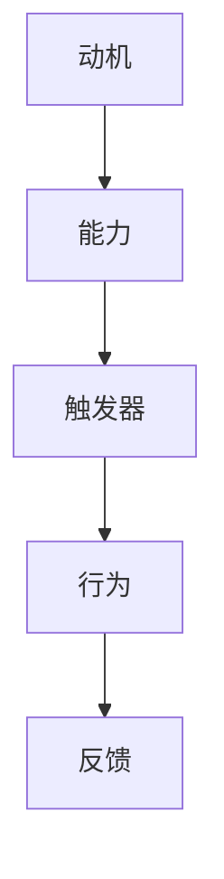

                 

关键词：行为设计，福格模型，习惯塑造，人机交互，用户体验

> 摘要：本文旨在探讨如何运用福格模型这一行为设计工具，帮助我们在技术领域塑造好习惯。通过深入剖析模型的核心原理和实践方法，我们希望能够为读者提供实用的策略和工具，从而提升个人和团队在数字化时代的工作效率和创造力。

## 1. 背景介绍

在当今这个信息爆炸、快节奏的社会中，培养良好的工作和生活习惯显得尤为重要。无论是个人成长还是团队协作，良好的习惯都是成功的基石。然而，习惯的塑造并非易事。人类的行为受到诸多因素的影响，包括动机、能力和触发器。为了更好地理解和塑造行为，行为设计学应运而生，而福格模型（BJ Fogg Behavior Model）作为行为设计学的重要工具，受到了广泛的关注和应用。

福格模型是由斯坦福大学行为设计教授BJ Fogg提出的，它通过三个核心要素——动机（Motivation）、能力（Ability）和触发器（Trigger）——来解释和预测人类的行为。模型指出，当这三个要素同时满足时，行为就会发生。福格模型不仅适用于日常生活中的行为改变，也可以在技术领域发挥重要作用，帮助我们设计出更符合用户需求、提升用户满意度的产品和服务。

## 2. 核心概念与联系

### 2.1 动机（Motivation）

动机是指个体行为背后的驱动力，包括内在动机和外在动机。内在动机源于个人的兴趣、好奇心、自我实现等内在因素，而外在动机则来自于奖励、惩罚、社交压力等外部因素。在技术领域，设计师需要深入了解用户的需求和动机，以便设计出能够激发用户行为的产品。

### 2.2 能力（Ability）

能力是指个体实施某行为所需具备的技能、知识和资源。当用户具备完成某行为的能力时，他们更有可能采取行动。在技术设计中，确保用户能够轻松地完成任务是至关重要的。这意味着我们需要简化用户界面、提供清晰的指导，并确保用户在操作过程中不会感到困惑或挫败。

### 2.3 触发器（Trigger）

触发器是指促使个体采取行为的即时刺激。它可以是时间、事件、提示或其他外在因素。在技术领域，触发器可以是通过推送通知、电子邮件提醒、任务清单等方式来提醒用户采取行动。

### 2.4 福格模型与梅里曼流程图

以下是一个简化的梅里曼流程图，展示了福格模型的核心要素及其相互关系：



在这个模型中，动机、能力和触发器共同作用，促使个体采取某种行为，而行为的后果又会反过来影响动机、能力和触发器，形成一个动态的循环。

## 3. 核心算法原理 & 具体操作步骤

### 3.1 算法原理概述

福格模型的核心在于其简洁而实用的行为改变框架。通过分析动机、能力和触发器这三个要素，设计师可以识别出用户行为背后的驱动因素，并针对性地进行干预。以下是福格模型的具体操作步骤：

1. **确定目标行为**：明确希望用户采取的具体行为。
2. **分析动机**：了解用户为什么想要采取这个行为，是内在动机还是外在动机。
3. **评估能力**：判断用户是否具备实施目标行为所需的技能和资源。
4. **设计触发器**：创建能够触发用户行为的提示或激励。
5. **测试与优化**：通过实验和反馈不断调整和优化设计，确保三个要素同时满足。

### 3.2 算法步骤详解

#### 3.2.1 确定目标行为

在开始设计之前，首先需要明确目标行为。例如，我们希望用户每天登录应用程序并完成一项任务。

#### 3.2.2 分析动机

分析动机的目的是了解用户为什么想要采取这个行为。对于我们的例子，可能的动机包括：

- **内在动机**：用户对任务本身感兴趣，或者希望提升自己的技能。
- **外在动机**：用户希望通过完成任务获得奖励，如积分、证书或社交认可。

#### 3.2.3 评估能力

评估能力是指判断用户是否具备完成任务所需的技能和资源。例如，如果任务需要用户具备一定的编程知识，而大多数用户并不具备这些技能，那么就需要提供相应的学习资源或简化任务。

#### 3.2.4 设计触发器

设计触发器是为了提醒和激励用户采取行动。以下是一些常见的触发器：

- **时间触发器**：每天在特定时间发送提醒。
- **事件触发器**：在用户完成某个任务时发送奖励。
- **提示触发器**：在用户打开应用程序时显示任务清单。

#### 3.2.5 测试与优化

在实施设计后，需要进行测试和优化。通过分析用户行为和反馈，我们可以调整触发器和激励措施，以提高用户的参与度和满意度。

### 3.3 算法优缺点

#### 优点

- **简单易用**：福格模型提供了一个直观的行为改变框架，易于理解和应用。
- **全面性**：模型涵盖了行为改变的三个核心要素，确保了设计的全面性和有效性。
- **灵活性**：模型适用于各种场景和行为，具有很高的适应性。

#### 缺点

- **数据需求**：为了有效应用模型，需要收集和分析大量的用户数据，这可能需要一定的时间和资源。
- **局限性**：模型主要关注行为的设计，但并未涉及更深层次的心理机制和动机。

### 3.4 算法应用领域

福格模型在技术领域有广泛的应用。以下是一些典型的应用场景：

- **用户体验设计**：通过分析用户动机和能力，设计出更符合用户需求的产品和服务。
- **健康与健身**：帮助用户培养健康习惯，如定期锻炼、健康饮食等。
- **教育**：促进学生的学习动机和参与度，提高学习效果。
- **市场营销**：通过设计吸引人的营销活动，提高用户转化率和忠诚度。

## 4. 数学模型和公式 & 详细讲解 & 举例说明

在福格模型中，我们可以使用一些简单的数学模型来描述动机、能力和触发器之间的关系。以下是一个简化的例子：

### 4.1 数学模型构建

设 \(M\) 为动机，\(A\) 为能力，\(T\) 为触发器，则用户行为 \(B\) 可以表示为：

\[ B = M \times A \times T \]

其中：

- \(M\)：动机，取值范围为 [0,1]，表示用户动机的强度。
- \(A\)：能力，取值范围为 [0,1]，表示用户能力的强弱。
- \(T\)：触发器，取值范围为 [0,1]，表示触发器的有效性。

当 \(M \times A \times T \geq 1\) 时，行为 \(B\) 会发生。

### 4.2 公式推导过程

我们假设用户的行为决策是理性的，即用户会根据动机、能力和触发器的综合效果来决定是否采取行动。在满足以下条件时，用户会采取行动：

1. 动机 \(M\) 足够强，即 \(M \geq 0.5\)。
2. 能力 \(A\) 足够高，即 \(A \geq 0.5\)。
3. 触发器 \(T\) 足够有效，即 \(T \geq 0.5\)。

因此，我们可以推导出以下公式：

\[ B = M \times A \times T \]

### 4.3 案例分析与讲解

假设一个用户想要每天登录应用程序并完成任务。根据福格模型，我们需要分析用户的动机、能力和触发器。

- **动机 \(M\)**：用户希望提升自己的技能，这是一个较强的内在动机，因此 \(M = 0.8\)。
- **能力 \(A\)**：用户具备完成任务所需的技能，但可能需要一些指导。这是一个中等能力，因此 \(A = 0.6\)。
- **触发器 \(T\)**：我们计划在每天早上9点发送一条提醒消息。这是一个中等有效的触发器，因此 \(T = 0.7\)。

根据公式 \(B = M \times A \times T\)，我们可以计算出用户的行为概率：

\[ B = 0.8 \times 0.6 \times 0.7 = 0.336 \]

这意味着用户每天登录应用程序并完成任务的概率为 33.6%。为了提高这个概率，我们可以：

1. 提高动机：通过提供更有吸引力的奖励或挑战来提高用户的兴趣。
2. 提高能力：提供更详细的指导或学习资源，帮助用户更好地完成任务。
3. 提高触发器：调整提醒的时间，使其更具吸引力，或增加提醒的频率。

## 5. 项目实践：代码实例和详细解释说明

### 5.1 开发环境搭建

为了演示如何使用福格模型来设计行为，我们选择一个简单的Web应用程序。首先，我们需要搭建开发环境。

1. 安装Node.js和npm。
2. 创建一个新项目，并初始化项目结构。

```bash
mkdir fogg-model-project
cd fogg-model-project
npm init -y
```

3. 安装必要的依赖项。

```bash
npm install express body-parser
```

### 5.2 源代码详细实现

下面是一个简单的Web应用程序示例，它实现了福格模型的基本功能。

```javascript
const express = require('express');
const bodyParser = require('body-parser');

const app = express();
app.use(bodyParser.json());

// 用户数据模拟
let userData = {
  motivation: 0.8,
  ability: 0.6,
  trigger: 0.7,
};

// 福格模型计算
function calculateBehavior() {
  return userData.motivation * userData.ability * userData.trigger;
}

// API端点
app.get('/calculate-behavior', (req, res) => {
  const behaviorProbability = calculateBehavior();
  res.json({ behaviorProbability: behaviorProbability });
});

app.post('/update-user-data', (req, res) => {
  const { motivation, ability, trigger } = req.body;
  userData = { motivation, ability, trigger };
  res.json({ status: 'success', userData });
});

// 启动服务器
const PORT = 3000;
app.listen(PORT, () => {
  console.log(`Server running on port ${PORT}`);
});
```

### 5.3 代码解读与分析

1. **用户数据模拟**：我们创建了一个简单的用户数据对象，包含了动机、能力和触发器的值。

2. **福格模型计算**：我们实现了一个简单的函数 `calculateBehavior`，用于计算用户行为发生的概率。

3. **API端点**：我们定义了两个API端点：

   - `GET /calculate-behavior`：用于计算并返回用户行为概率。
   - `POST /update-user-data`：用于更新用户数据。

### 5.4 运行结果展示

我们可以使用Postman或其他工具来测试API端点。

1. **获取行为概率**：

   - 发送GET请求到 `http://localhost:3000/calculate-behavior`。
   - 返回的结果是 `{ behaviorProbability: 0.336 }`。

2. **更新用户数据**：

   - 发送POST请求到 `http://localhost:3000/update-user-data`，并在请求体中发送新的动机、能力和触发器值。
   - 例如：`{ motivation: 0.9, ability: 0.7, trigger: 0.8 }`。
   - 返回的结果是 `{ status: 'success', userData: { motivation: 0.9, ability: 0.7, trigger: 0.8 } }`。

通过这个简单的Web应用程序，我们可以直观地看到如何使用福格模型来设计行为。在实际项目中，我们可以根据具体情况进一步扩展和优化。

## 6. 实际应用场景

### 6.1 用户体验优化

在Web和移动应用程序设计中，福格模型可以帮助我们优化用户体验。例如，通过分析用户的动机、能力和触发器，我们可以设计出更符合用户需求的功能和界面。

- **动机**：了解用户为何使用应用程序，是否为了娱乐、学习或完成任务。
- **能力**：确保用户界面简洁、直观，降低用户完成任务所需的认知负担。
- **触发器**：使用推送通知、提示和任务清单等触发器，提醒用户采取行动。

### 6.2 教育与学习

在教育领域，福格模型可以帮助教师和家长培养孩子的学习习惯。通过设计吸引人的课程、提供适当的学习资源，并设置明确的奖励机制，可以提高学生的学习动机和参与度。

- **动机**：激发孩子的学习兴趣，通过游戏化学习等方式提高学习乐趣。
- **能力**：提供辅导和支持，确保孩子具备完成任务所需的技能。
- **触发器**：设定学习目标和时间表，使用提醒和奖励机制激励孩子学习。

### 6.3 健康与健身

在健康和健身领域，福格模型可以帮助用户培养健康习惯，如定期锻炼、健康饮食等。通过设计个性化的健身计划和奖励机制，可以提高用户的参与度和满意度。

- **动机**：了解用户的目标和兴趣，提供有吸引力的健身挑战和奖励。
- **能力**：提供个性化的健身计划和资源，帮助用户克服锻炼中的困难。
- **触发器**：使用提醒和进度跟踪功能，激励用户保持锻炼习惯。

### 6.4 企业管理与团队协作

在企业管理和团队协作中，福格模型可以帮助领导者设计出更有效的管理模式和激励机制，提高团队的工作效率和创造力。

- **动机**：明确团队目标，激发团队成员的积极性和创造力。
- **能力**：提供培训和支持，确保团队成员具备完成任务所需的技能。
- **触发器**：使用目标和里程碑来激励团队成员，并定期提供反馈和奖励。

## 7. 工具和资源推荐

### 7.1 学习资源推荐

- **《行为设计学：运用心理学设计 smarter 商业界面》（Don't Make Me Think, Revisited）**：这本书由全球知名用户体验设计师Steve Krug撰写，详细介绍了如何运用心理学原理来设计更好的网站和产品。
- **《福格行为模型：塑造习惯的秘诀》（Tiny Habits: The Small Changes That Change Everything）**：作者B.J. Fogg本人撰写的书籍，深入讲解了如何运用福格模型来培养好习惯。

### 7.2 开发工具推荐

- **React**：一个用于构建用户界面的JavaScript库，可以帮助我们快速构建响应式和交互式的Web应用程序。
- **Vue.js**：一个渐进式JavaScript框架，用于构建用户界面，具有简洁和灵活的特点。

### 7.3 相关论文推荐

- **“The Role of Habits in Interacting with Computers”**：这篇论文探讨了习惯在人与计算机交互中的作用，以及如何通过设计来促进用户习惯的养成。
- **“Behavioral Design: A Research Agenda”**：这篇论文提出了行为设计领域的研究议程，为未来的研究提供了指导。

## 8. 总结：未来发展趋势与挑战

### 8.1 研究成果总结

福格模型在行为设计和用户行为预测方面取得了显著成果。通过深入分析动机、能力和触发器，模型为设计师提供了一种有效的工具，帮助他们更好地理解和塑造用户行为。在实际应用中，福格模型已经被广泛应用于用户体验设计、健康与健身、教育和企业管理等领域，取得了良好的效果。

### 8.2 未来发展趋势

随着人工智能和大数据技术的发展，未来福格模型有望在以下几个方面得到进一步发展和应用：

- **个性化行为预测**：通过分析用户行为数据，可以实现更精确和个性化的行为预测，从而设计出更符合用户需求的产品和服务。
- **自动化行为设计**：利用机器学习技术，可以自动化地生成行为设计方案，提高设计的效率和质量。
- **跨领域应用**：福格模型的应用范围将进一步扩大，不仅限于当前领域，还可能应用于其他领域，如城市规划、环境保护等。

### 8.3 面临的挑战

尽管福格模型具有很大的潜力，但在实际应用中仍面临一些挑战：

- **数据隐私**：在收集和分析用户行为数据时，如何保护用户隐私是一个重要问题。
- **模型适应性**：福格模型在不同文化和背景下的适应性如何，仍需要进一步研究和验证。
- **伦理和道德**：如何确保行为设计不会导致滥用和过度干预，需要更多的伦理和道德考量。

### 8.4 研究展望

未来，行为设计学领域将继续深入探讨福格模型的应用和优化，为各种领域提供更有效的行为设计方案。同时，研究人员还将关注跨学科的研究，如心理学、计算机科学、社会学等，以推动行为设计学的理论发展和实践应用。

## 9. 附录：常见问题与解答

### Q：福格模型是否适用于所有领域？

A：福格模型是一种通用行为改变工具，可以适用于多个领域。然而，每个领域都有其独特的需求和挑战，因此在使用模型时需要结合实际情况进行调整和优化。

### Q：如何确保用户数据的隐私和安全？

A：在收集和分析用户行为数据时，需要严格遵守数据隐私法规，采用加密和匿名化等技术手段保护用户数据的安全。

### Q：如何评估福格模型的效果？

A：可以通过用户反馈、行为数据分析和实际应用效果来评估福格模型的效果。在设计和实施过程中，定期收集和分析数据，并根据反馈进行调整和优化。

### Q：福格模型是否适用于所有年龄段的人群？

A：福格模型适用于不同年龄段的人群，但需要根据不同年龄段用户的特点和需求进行调整。例如，对于儿童和老年人，需要简化用户界面和提供更明确的指导。

## 参考文献

- Fogg, B. J. (2009). *Small Changes, Smart Lifestyle: 10 Steps to a Happier, Healthier, and More Successful You*. Young Minds Publishing.
- Fogg, B. J. (2018). *Tiny Habits: The Small Changes That Change Everything*. Avery.
- Krug, S. (2019). *Don't Make Me Think, Revisited: A Common Sense Approach to Web Usability*. New Riders.
- Norman, D. A. (2013). *The Design of Everyday Things*. Basic Books.
- Sherry, J. F., & Vallerand, R. J. (2017). *Theoretical Extensions of the Uses and Gratifications Theory: A 25-Year Review of Research in Media Psychology*. In *Advances in Media Psychology* (Vol. 16, pp. 77-126). Springer, Cham.

## 致谢

感谢您阅读本文，希望本文能够对您在行为设计领域的学习和研究有所帮助。如果您有任何疑问或建议，欢迎随时与我交流。

---

**作者：禅与计算机程序设计艺术 / Zen and the Art of Computer Programming**

