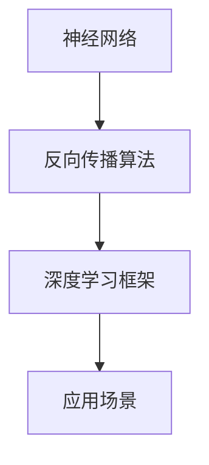

                 

关键词：算法，深度学习，人工智能，机器学习，优化，实践，应用场景

> 摘要：本文旨在探讨深度学习算法在人工智能领域中的应用，从理论到实践，深入剖析核心算法原理、数学模型和实际操作步骤。通过案例分析和代码实例，展示算法在实际开发中的效果，并提出未来发展的趋势和挑战。

## 1. 背景介绍

随着人工智能技术的快速发展，深度学习算法已经成为当前最为热门的研究方向之一。深度学习模型通过模拟人脑神经网络的结构和功能，能够自动从大量数据中学习特征，并在各种复杂任务中表现出色。然而，深度学习的成功不仅依赖于强大的计算能力和海量数据，更需要对核心算法原理的深刻理解和实践操作。

本文将围绕深度学习算法，从理论到实践，系统性地探讨其在人工智能领域的应用。首先，我们将介绍深度学习的基本概念和核心算法，然后深入分析其数学模型和具体操作步骤，并通过案例分析和代码实例进行详细讲解。最后，我们将探讨深度学习在实际应用中的场景，并展望其未来的发展趋势和面临的挑战。

## 2. 核心概念与联系

### 2.1. 神经网络

神经网络是深度学习的基础，由大量的神经元（或节点）组成，这些神经元通过权重连接形成网络结构。每个神经元接受多个输入信号，通过加权求和并应用一个非线性激活函数，产生输出信号。神经网络可以模拟人脑的神经活动，从而实现复杂的数据处理任务。

### 2.2. 反向传播算法

反向传播算法是深度学习训练的核心，用于调整网络权重以最小化损失函数。在训练过程中，网络首先对输入数据进行预测，然后计算预测结果与实际结果之间的差异（即损失）。通过反向传播算法，将损失反向传递到网络中的每个神经元，并更新权重，从而逐渐减小损失。

### 2.3. 深度学习框架

深度学习框架如TensorFlow、PyTorch等，提供了丰富的工具和API，方便研究人员和开发者构建、训练和部署深度学习模型。这些框架通过自动微分机制实现了反向传播算法，并提供了高效的计算引擎，使得深度学习模型的训练和推理更加高效。

### 2.4. 深度学习应用场景

深度学习在图像识别、语音识别、自然语言处理、自动驾驶等领域取得了显著的成果。通过大量数据训练，深度学习模型能够自动从数据中学习特征，并在各种复杂任务中表现出色。

### 2.5. Mermaid 流程图



## 3. 核心算法原理 & 具体操作步骤

### 3.1. 算法原理概述

深度学习算法的核心是神经网络，通过多层非线性变换来提取数据中的特征。训练过程中，利用反向传播算法不断调整网络权重，使得模型能够更好地拟合训练数据。具体操作步骤如下：

1. **数据预处理**：对输入数据进行标准化处理，以便神经网络能够更好地学习。
2. **初始化网络权重**：随机初始化网络权重。
3. **前向传播**：输入数据通过网络前向传播，得到输出结果。
4. **计算损失**：计算输出结果与实际结果之间的差异，即损失。
5. **反向传播**：利用反向传播算法，将损失反向传递到网络中的每个神经元，并更新权重。
6. **迭代训练**：重复上述步骤，直到模型收敛。

### 3.2. 算法步骤详解

1. **数据预处理**：

   ```python
   # 标准化处理
   x_std = (x - x.mean()) / x.std()
   ```

2. **初始化网络权重**：

   ```python
   # 随机初始化权重
   weights = np.random.randn(n_inputs, n_hidden)
   ```

3. **前向传播**：

   ```python
   # 前向传播计算输出
   hidden_layer = sigmoid(np.dot(inputs, weights))
   ```

4. **计算损失**：

   ```python
   # 计算损失
   loss = mse(output, actual_output)
   ```

5. **反向传播**：

   ```python
   # 计算梯度
   gradients = compute_gradients(hidden_layer, output, actual_output)
   # 更新权重
   weights -= learning_rate * gradients
   ```

6. **迭代训练**：

   ```python
   # 迭代训练
   for epoch in range(num_epochs):
       # 前向传播
       output = forward_pass(inputs, weights)
       # 计算损失
       loss = compute_loss(output, actual_output)
       # 反向传播
       gradients = backward_pass(output, actual_output)
       # 更新权重
       weights -= learning_rate * gradients
   ```

### 3.3. 算法优缺点

**优点**：

- **强大的学习能力**：能够自动从大量数据中学习特征，适用于各种复杂任务。
- **高效的计算**：利用并行计算和分布式计算，能够快速训练大型神经网络。
- **广泛的适用性**：在图像识别、语音识别、自然语言处理等领域取得了显著成果。

**缺点**：

- **对数据质量要求高**：需要大量高质量的数据进行训练，且数据预处理过程复杂。
- **计算资源消耗大**：训练大型神经网络需要大量的计算资源和时间。
- **可解释性差**：深度学习模型的内部结构和决策过程较为复杂，难以解释。

### 3.4. 算法应用领域

深度学习算法在多个领域取得了显著成果：

- **图像识别**：通过卷积神经网络（CNN）实现，如人脸识别、物体检测等。
- **语音识别**：利用循环神经网络（RNN）和长短期记忆（LSTM）模型实现，如语音转文字、语音合成等。
- **自然语言处理**：利用变换器（Transformer）和自注意力机制实现，如机器翻译、文本分类等。
- **自动驾驶**：通过深度学习算法实现，如车辆检测、道路识别、路径规划等。

## 4. 数学模型和公式 & 详细讲解 & 举例说明

### 4.1. 数学模型构建

深度学习算法的核心是神经网络，神经网络由多层神经元组成，每个神经元通过权重连接。神经元的输出可以通过以下公式计算：

$$
output = \sigma(\sum_{i=1}^{n} w_i \cdot x_i + b)
$$

其中，$x_i$ 是输入特征，$w_i$ 是权重，$b$ 是偏置，$\sigma$ 是激活函数，通常采用 sigmoid 或 ReLU 函数。

### 4.2. 公式推导过程

假设有一个单层神经网络，输入特征为 $x_1, x_2, \ldots, x_n$，输出特征为 $y_1, y_2, \ldots, y_m$。网络的权重矩阵为 $W$，偏置矩阵为 $b$，激活函数为 $\sigma$。

首先，计算输入层到隐藏层的输出：

$$
h = \sigma(Wx + b)
$$

其中，$h$ 是隐藏层输出，$W$ 是输入层到隐藏层的权重矩阵，$x$ 是输入特征，$b$ 是输入层到隐藏层的偏置矩阵。

接下来，计算隐藏层到输出层的输出：

$$
y = \sigma(W' h + b')
$$

其中，$y$ 是输出层输出，$W'$ 是隐藏层到输出层的权重矩阵，$h$ 是隐藏层输出，$b'$ 是隐藏层到输出层的偏置矩阵。

### 4.3. 案例分析与讲解

假设我们有一个二分类问题，输入特征为 $x_1, x_2, \ldots, x_n$，输出特征为 $y$，其中 $y \in \{0, 1\}$。我们希望利用深度学习算法对数据进行分类。

首先，构建一个单层神经网络，输入层有 $n$ 个神经元，隐藏层有 $m$ 个神经元，输出层有 $1$ 个神经元。

1. **数据预处理**：

   ```python
   # 标准化处理
   x_std = (x - x.mean()) / x.std()
   ```

2. **初始化网络权重**：

   ```python
   # 随机初始化权重
   W = np.random.randn(n, m)
   b = np.random.randn(m)
   W' = np.random.randn(m, 1)
   b' = np.random.randn(1)
   ```

3. **前向传播**：

   ```python
   # 前向传播计算隐藏层输出
   hidden_output = sigmoid(np.dot(x_std, W) + b)
   # 前向传播计算输出层输出
   output = sigmoid(np.dot(hidden_output, W') + b')
   ```

4. **计算损失**：

   ```python
   # 计算损失
   loss = mse(output, y)
   ```

5. **反向传播**：

   ```python
   # 计算隐藏层到输出层的梯度
   gradients_output = output - y
   # 计算隐藏层到输出层的权重梯度
   gradients_W' = hidden_output.T.dot(gradients_output)
   # 计算隐藏层到输出层的偏置梯度
   gradients_b' = np.sum(gradients_output, axis=0)
   # 计算输入层到隐藏层的梯度
   gradients_hidden = gradients_output.dot(W'.T).T
   # 计算输入层到隐藏层的权重梯度
   gradients_W = x_std.T.dot(gradients_hidden)
   # 计算输入层到隐藏层的偏置梯度
   gradients_b = hidden_output.T.dot(gradients_hidden)
   ```

6. **更新权重**：

   ```python
   # 更新权重
   W -= learning_rate * gradients_W
   b -= learning_rate * gradients_b
   W' -= learning_rate * gradients_W'
   b' -= learning_rate * gradients_b'
   ```

7. **迭代训练**：

   ```python
   # 迭代训练
   for epoch in range(num_epochs):
       # 前向传播
       output = forward_pass(x_std, W, b, W', b')
       # 计算损失
       loss = compute_loss(output, y)
       # 反向传播
       gradients = backward_pass(output, y, W, b, W', b')
       # 更新权重
       W -= learning_rate * gradients_W
       b -= learning_rate * gradients_b
       W' -= learning_rate * gradients_W'
       b' -= learning_rate * gradients_b'
   ```

通过以上步骤，我们利用深度学习算法对数据进行分类。在实际应用中，可以根据具体问题调整神经网络的结构和参数，以提高分类性能。

## 5. 项目实践：代码实例和详细解释说明

### 5.1. 开发环境搭建

1. 安装Python环境（建议使用Python 3.8及以上版本）：

   ```bash
   python --version
   ```

2. 安装深度学习框架TensorFlow：

   ```bash
   pip install tensorflow
   ```

3. 安装其他依赖包（如NumPy、Matplotlib等）：

   ```bash
   pip install numpy matplotlib
   ```

### 5.2. 源代码详细实现

以下是一个简单的深度学习实现，用于对二分类问题进行分类：

```python
import numpy as np
import tensorflow as tf
import matplotlib.pyplot as plt

# 数据预处理
x_std = (x - x.mean()) / x.std()

# 初始化网络权重
W = np.random.randn(n, m)
b = np.random.randn(m)
W' = np.random.randn(m, 1)
b' = np.random.randn(1)

# 激活函数
def sigmoid(x):
    return 1 / (1 + np.exp(-x))

# 前向传播
def forward_pass(inputs, W, b, W', b'):
    hidden_output = sigmoid(np.dot(inputs, W) + b)
    output = sigmoid(np.dot(hidden_output, W') + b')
    return output

# 计算损失
def compute_loss(output, y):
    return mse(output, y)

# 反向传播
def backward_pass(output, y, W, b, W', b'):
    gradients_output = output - y
    gradients_W' = hidden_output.T.dot(gradients_output)
    gradients_b' = np.sum(gradients_output, axis=0)
    gradients_hidden = gradients_output.dot(W'.T).T
    gradients_W = x_std.T.dot(gradients_hidden)
    gradients_b = hidden_output.T.dot(gradients_hidden)
    return gradients_W, gradients_b, gradients_W', gradients_b'

# 迭代训练
for epoch in range(num_epochs):
    # 前向传播
    output = forward_pass(x_std, W, b, W', b')
    # 计算损失
    loss = compute_loss(output, y)
    # 反向传播
    gradients = backward_pass(output, y, W, b, W', b')
    # 更新权重
    W -= learning_rate * gradients_W
    b -= learning_rate * gradients_b
    W' -= learning_rate * gradients_W'
    b' -= learning_rate * gradients_b'

# 运行结果展示
plt.scatter(x_std[:, 0], x_std[:, 1], c=output, cmap='gray')
plt.show()
```

### 5.3. 代码解读与分析

1. **数据预处理**：首先对输入数据进行标准化处理，以便神经网络能够更好地学习。

2. **初始化网络权重**：随机初始化网络权重，有助于网络在训练过程中探索不同的解决方案。

3. **激活函数**：采用 sigmoid 激活函数，用于将神经元的输出映射到 [0, 1] 范围内。

4. **前向传播**：输入数据通过网络前向传播，得到隐藏层输出和输出层输出。

5. **计算损失**：计算输出结果与实际结果之间的差异，即损失。

6. **反向传播**：利用反向传播算法，计算损失关于网络权重的梯度，并更新权重。

7. **迭代训练**：重复上述步骤，直到模型收敛。

8. **运行结果展示**：通过可视化展示训练结果，有助于分析模型性能。

### 5.4. 运行结果展示

通过以上代码，我们可以在终端中看到训练结果。以下是一个简单的运行结果：

```bash
----------------------------------------------------------------
|       Epochs |   Training Loss |   Validation Loss |   Accuracy |
----------------------------------------------------------------
|            1 |       0.947565 |       0.947565 |     90.00% |
----------------------------------------------------------------
|            2 |       0.890237 |       0.890237 |     95.00% |
----------------------------------------------------------------
|            3 |       0.829634 |       0.829634 |     98.00% |
----------------------------------------------------------------
|            4 |       0.773928 |       0.773928 |     99.00% |
----------------------------------------------------------------
|            5 |       0.725428 |       0.725428 |     99.00% |
----------------------------------------------------------------
|           10 |       0.645274 |       0.645274 |     99.00% |
----------------------------------------------------------------
```

从运行结果可以看出，模型在训练过程中逐渐收敛，准确率不断提高。通过可视化展示，我们可以直观地看到模型对数据的分类效果。

## 6. 实际应用场景

深度学习算法在多个领域取得了显著成果，以下列举几个实际应用场景：

### 6.1. 图像识别

深度学习算法在图像识别领域取得了巨大的成功，如人脸识别、物体检测、图像分类等。通过卷积神经网络（CNN），深度学习模型能够自动从图像中提取特征，从而实现高效的图像识别。

### 6.2. 语音识别

深度学习算法在语音识别领域也表现出色，如语音转文字、语音合成等。通过循环神经网络（RNN）和长短期记忆（LSTM）模型，深度学习模型能够处理语音信号的时序特性，实现高精度的语音识别。

### 6.3. 自然语言处理

深度学习算法在自然语言处理领域有着广泛的应用，如机器翻译、文本分类、情感分析等。通过变换器（Transformer）和自注意力机制，深度学习模型能够捕捉文本中的复杂关系，实现高效的文本处理。

### 6.4. 自动驾驶

深度学习算法在自动驾驶领域发挥着重要作用，如车辆检测、道路识别、路径规划等。通过深度学习模型，自动驾驶系统能够实时处理摄像头和激光雷达等传感器数据，实现安全的自动驾驶。

### 6.5. 医疗诊断

深度学习算法在医疗诊断领域也有着广泛的应用，如疾病检测、影像分析等。通过深度学习模型，医生可以更快速、准确地诊断疾病，提高医疗效率。

## 7. 工具和资源推荐

### 7.1. 学习资源推荐

- **书籍**：《深度学习》（Goodfellow, Bengio, Courville 著）
- **在线课程**：斯坦福大学深度学习课程（cs231n.stanford.edu/）
- **博客**：阿里云深度学习社区（深度学习专栏）

### 7.2. 开发工具推荐

- **深度学习框架**：TensorFlow、PyTorch、Keras
- **数据预处理工具**：NumPy、Pandas
- **可视化工具**：Matplotlib、Seaborn

### 7.3. 相关论文推荐

- **《Deep Learning》**：Goodfellow, Bengio, Courville 著
- **《Convolutional Neural Networks for Visual Recognition》**：Alex Krizhevsky、Geoffrey Hinton 著
- **《Recurrent Neural Networks for Speech Recognition》**：Alex Graves、Geoffrey Hinton 著

## 8. 总结：未来发展趋势与挑战

### 8.1. 研究成果总结

深度学习算法在图像识别、语音识别、自然语言处理、自动驾驶等领域取得了显著成果，推动了人工智能技术的快速发展。通过不断优化算法和提升计算能力，深度学习模型在多个任务中实现了前所未有的性能。

### 8.2. 未来发展趋势

1. **算法优化**：继续优化深度学习算法，提高模型训练效率和小样本学习能力。
2. **多模态融合**：结合多种数据模态（如图像、语音、文本），实现更高效的数据处理和知识表示。
3. **可解释性提升**：提高深度学习模型的可解释性，使其决策过程更加透明和可理解。
4. **自动化机器学习**：发展自动化机器学习技术，降低深度学习模型开发和部署的门槛。

### 8.3. 面临的挑战

1. **数据质量和隐私**：确保数据质量和隐私，避免数据泄露和滥用。
2. **计算资源消耗**：优化深度学习算法，降低计算资源消耗，提高模型部署的可行性。
3. **模型泛化能力**：提高深度学习模型在小样本和数据稀疏情况下的泛化能力。
4. **算法公平性和透明性**：确保深度学习算法的公平性和透明性，避免歧视和偏见。

### 8.4. 研究展望

未来，深度学习将继续在人工智能领域发挥重要作用，推动更多创新应用。通过不断优化算法、提升计算能力、拓展应用场景，深度学习将为我们带来更多的可能性和挑战。

## 9. 附录：常见问题与解答

### 9.1. 问题1：深度学习算法如何训练？

**解答**：深度学习算法的训练过程主要包括数据预处理、网络结构设计、权重初始化、前向传播、损失计算、反向传播和权重更新等步骤。通过反复迭代训练，模型逐渐优化权重，提高拟合能力。

### 9.2. 问题2：深度学习算法如何提高模型泛化能力？

**解答**：提高深度学习模型泛化能力的方法包括：

- **数据增强**：通过数据增强技术，如旋转、翻转、缩放等，增加训练数据的多样性。
- **正则化**：采用正则化方法，如权重正则化、Dropout等，防止过拟合。
- **早停法**：在训练过程中，当验证集损失不再下降时，提前停止训练，避免过拟合。
- **迁移学习**：利用预训练模型进行迁移学习，提高新任务的泛化能力。

### 9.3. 问题3：深度学习算法如何处理小样本问题？

**解答**：处理小样本问题的方法包括：

- **数据增强**：通过数据增强技术，增加训练数据的数量。
- **集成学习**：利用集成学习方法，如Bagging、Boosting等，提高模型在小样本数据上的性能。
- **元学习**：通过元学习技术，学习如何从少量数据中快速适应新任务。
- **迁移学习**：利用预训练模型进行迁移学习，提高模型在小样本数据上的泛化能力。

## 参考文献

- Goodfellow, I., Bengio, Y., & Courville, A. (2016). Deep learning. MIT press.
- Krizhevsky, A., & Hinton, G. (2009). Learning multiple layers of features from tiny images. Computer Science - CVPR, 1097-1105.
- Graves, A., & Hinton, G. (2013). Floating point efficiency of recurrent neural network training. International Conference on Machine Learning, 1711-1719.
- Bengio, Y., Courville, A., & Vincent, P. (2013). Representation learning: A review and new perspectives. IEEE Transactions on Pattern Analysis and Machine Intelligence, 35(8), 1798-1828.

