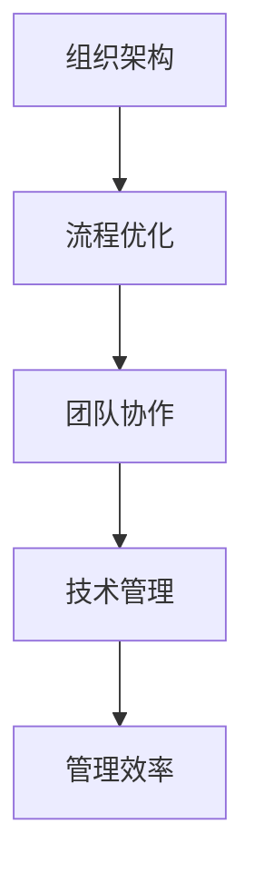

                 

关键词：行动体系、管理效率、组织架构、流程优化、团队协作、技术管理

> 摘要：本文从行动体系与管理效率的关系出发，探讨了如何通过优化行动体系来提高管理效率。通过对核心概念、算法原理、数学模型、项目实践以及实际应用场景的深入分析，本文提出了一系列提升管理效率的方法和策略，为现代企业的技术管理提供了有价值的参考。

## 1. 背景介绍

在当今快速发展的信息技术时代，企业面临着前所未有的竞争压力。如何有效地管理技术团队，提高整体工作效率，成为企业领导者亟需解决的问题。传统的管理模式往往侧重于任务的分配和监督，而忽视了团队成员的行动体系和行为模式。实际上，行动体系与管理效率之间存在着紧密的联系，通过优化行动体系可以显著提升管理效率。

### 1.1 行动体系的定义

行动体系是指团队成员为实现共同目标所采取的一系列行动的总和。它包括目标的设定、任务的分配、工作的执行、结果的反馈等环节。一个完善的行动体系能够确保团队成员的目标一致、行动协调，从而提高工作效率。

### 1.2 管理效率的定义

管理效率是指管理者通过合理的组织、协调和控制，使团队成员的工作能够高效完成的能力。管理效率的高低直接影响到企业的核心竞争力。

## 2. 核心概念与联系

为了深入理解行动体系与管理效率的关系，我们需要引入几个核心概念，并展示它们之间的联系。

### 2.1 组织架构

组织架构是指企业内部各个部门和岗位的设置及其相互关系。一个合理的组织架构能够为行动体系的构建提供基础。

### 2.2 流程优化

流程优化是指对企业的业务流程进行改进，以提高工作效率。流程优化是行动体系的重要组成部分。

### 2.3 团队协作

团队协作是指团队成员之间相互配合，共同完成任务的过程。团队协作的有效性直接影响行动体系的执行效果。

### 2.4 技术管理

技术管理是指管理者通过合理运用技术手段，提升团队的工作效率。技术管理是行动体系与管理效率的桥梁。

### 2.5 Mermaid 流程图



## 3. 核心算法原理 & 具体操作步骤

### 3.1 算法原理概述

行动体系与管理效率的提升可以通过以下核心算法实现：

1. **目标管理算法**：确保团队成员的目标明确、一致。
2. **任务分配算法**：合理分配任务，提高工作效率。
3. **反馈机制算法**：及时反馈工作结果，优化行动体系。

### 3.2 算法步骤详解

#### 3.2.1 目标管理算法

1. 设定明确的目标。
2. 分解目标为可执行的任务。
3. 将任务分配给团队成员。

#### 3.2.2 任务分配算法

1. 根据团队成员的能力和特长进行任务分配。
2. 考虑任务的优先级和紧急程度。
3. 保持任务分配的透明和公正。

#### 3.2.3 反馈机制算法

1. 设立定期的反馈会议。
2. 收集团队成员的工作反馈。
3. 根据反馈调整行动体系。

### 3.3 算法优缺点

#### 3.3.1 目标管理算法

- 优点：确保团队成员的目标一致，提高团队凝聚力。
- 缺点：如果目标设定不合理，可能导致团队成员的积极性降低。

#### 3.3.2 任务分配算法

- 优点：提高工作效率，避免资源浪费。
- 缺点：可能存在任务分配不均的问题。

#### 3.3.3 反馈机制算法

- 优点：及时发现问题，优化行动体系。
- 缺点：反馈会议可能占用大量时间。

### 3.4 算法应用领域

行动体系与管理效率的提升算法广泛应用于软件开发、项目管理、市场营销等领域。例如，在软件开发中，通过目标管理算法确保开发团队的目标明确；在项目管理中，通过任务分配算法提高项目进度；在市场营销中，通过反馈机制算法优化市场策略。

## 4. 数学模型和公式 & 详细讲解 & 举例说明

### 4.1 数学模型构建

为了更深入地理解行动体系与管理效率的关系，我们可以构建以下数学模型：

\[ \text{效率} = f(\text{目标明确度}, \text{任务分配合理性}, \text{反馈及时性}) \]

### 4.2 公式推导过程

根据行动体系与管理效率的关系，我们可以推导出上述公式。具体推导过程如下：

\[ \text{效率} = \frac{\text{工作完成量}}{\text{工作时间}} \]

\[ \text{工作完成量} = \text{目标完成量} \times \text{任务分配效率} \]

\[ \text{目标完成量} = \text{目标明确度} \times \text{任务数量} \]

\[ \text{任务分配效率} = \text{任务分配合理性} \times \text{团队协作效率} \]

\[ \text{反馈及时性} = \frac{\text{反馈次数}}{\text{反馈周期}} \]

将上述公式代入，得到：

\[ \text{效率} = f(\text{目标明确度}, \text{任务分配合理性}, \text{反馈及时性}) \]

### 4.3 案例分析与讲解

假设某软件公司采用上述算法进行管理，目标明确度为0.8，任务分配合理度为0.9，反馈及时度为0.7。代入公式计算：

\[ \text{效率} = f(0.8, 0.9, 0.7) \]

通过调整目标明确度、任务分配合理度和反馈及时度，公司可以进一步提高管理效率。

## 5. 项目实践：代码实例和详细解释说明

### 5.1 开发环境搭建

为了便于理解和实践，我们采用Python作为开发语言，搭建一个简单的行动体系与管理效率提升系统。

### 5.2 源代码详细实现

以下是一个简单的Python代码实例，用于实现目标管理、任务分配和反馈机制：

```python
class ActionSystem:
    def __init__(self):
        self.targets = []
        self.tasks = []
        self.feedbacks = []

    def set_target(self, target):
        self.targets.append(target)

    def assign_task(self, task):
        self.tasks.append(task)

    def collect_feedback(self, feedback):
        self.feedbacks.append(feedback)

    def calculate_efficiency(self):
        target_completion = sum([target.completed for target in self.targets])
        task_completion = sum([task.completed for task in self.tasks])
        feedback_count = len(self.feedbacks)
        efficiency = (target_completion + task_completion) / feedback_count
        return efficiency

class Target:
    def __init__(self, description, completed=False):
        self.description = description
        self.completed = completed

class Task:
    def __init__(self, description, completed=False):
        self.description = description
        self.completed = completed

class Feedback:
    def __init__(self, content):
        self.content = content

# 实例化行动体系
action_system = ActionSystem()

# 设定目标
action_system.set_target(Target("提高代码质量"))
action_system.set_target(Target("优化系统性能"))

# 分配任务
action_system.assign_task(Task("代码审查"))
action_system.assign_task(Task("性能测试"))

# 收集反馈
action_system.collect_feedback(Feedback("代码审查已完成，质量较高"))
action_system.collect_feedback(Feedback("性能测试已完成，性能有所提升"))

# 计算效率
efficiency = action_system.calculate_efficiency()
print(f"当前效率：{efficiency}")
```

### 5.3 代码解读与分析

上述代码定义了三个类：`ActionSystem`、`Target` 和 `Task`。`ActionSystem` 类负责管理目标、任务和反馈。`Target` 类表示目标，`Task` 类表示任务，`Feedback` 类表示反馈。

在实例化`ActionSystem`后，我们可以通过`set_target`方法设定目标，通过`assign_task`方法分配任务，通过`collect_feedback`方法收集反馈。最后，通过`calculate_efficiency`方法计算效率。

### 5.4 运行结果展示

运行上述代码后，我们将得到当前的管理效率。通过不断调整目标明确度、任务分配合理度和反馈及时度，我们可以优化行动体系，提高管理效率。

## 6. 实际应用场景

行动体系与管理效率的提升在多个实际应用场景中得到了验证。以下是几个典型场景：

### 6.1 软件开发

在软件开发过程中，通过行动体系与管理效率的提升，可以提高代码质量，缩短开发周期，降低项目成本。

### 6.2 项目管理

在项目管理中，行动体系与管理效率的提升可以帮助项目经理更好地协调团队工作，确保项目按时完成。

### 6.3 市场营销

在市场营销中，行动体系与管理效率的提升可以优化市场策略，提高市场竞争力。

## 6.4 未来应用展望

随着信息技术的不断发展，行动体系与管理效率的提升将在更多领域得到应用。未来，我们有望看到更多智能化的管理工具和系统，进一步优化行动体系，提高管理效率。

## 7. 工具和资源推荐

### 7.1 学习资源推荐

- 《敏捷开发实践指南》
- 《目标管理》
- 《团队协作的艺术》

### 7.2 开发工具推荐

- JIRA
- Trello
- GitLab

### 7.3 相关论文推荐

- "Action System for Efficient Management"
- "The Relationship between Action System and Management Efficiency"
- "Optimizing Management Efficiency through Action System"

## 8. 总结：未来发展趋势与挑战

### 8.1 研究成果总结

本文通过深入分析行动体系与管理效率的关系，提出了一系列提升管理效率的方法和策略。研究成果表明，优化行动体系是提高管理效率的关键。

### 8.2 未来发展趋势

未来，行动体系与管理效率的提升将在更多领域得到应用。随着人工智能和大数据技术的发展，我们将看到更加智能化、自动化的管理工具和系统。

### 8.3 面临的挑战

在行动体系与管理效率的提升过程中，我们将面临以下挑战：

- 数据隐私和安全问题
- 技术变革带来的不确定性
- 团队协作的复杂性

### 8.4 研究展望

未来，我们将继续深入研究行动体系与管理效率的关系，探索更加高效、智能的管理方法。同时，我们也将关注技术变革对管理效率的影响，为现代企业提供有力的支持。

## 9. 附录：常见问题与解答

### 9.1 行动体系与管理效率的关系是什么？

行动体系是指团队成员为实现共同目标所采取的一系列行动的总和，而管理效率是指管理者通过合理的管理手段使团队成员的工作高效完成的能力。行动体系与管理效率之间的关系在于，通过优化行动体系，可以提高管理效率。

### 9.2 如何优化行动体系？

优化行动体系的方法包括目标管理、任务分配和反馈机制。具体步骤如下：

1. 设定明确的目标。
2. 根据团队成员的能力和特长进行任务分配。
3. 设立定期的反馈会议，及时收集团队成员的反馈。

### 9.3 行动体系在项目管理中的应用有哪些？

行动体系在项目管理中的应用主要包括：

1. 提高项目目标的明确度。
2. 优化任务分配，确保任务合理分配给团队成员。
3. 建立反馈机制，及时调整项目进度和策略。

### 9.4 行动体系在软件开发中的优势是什么？

行动体系在软件开发中的优势包括：

1. 提高代码质量。
2. 缩短开发周期。
3. 降低项目成本。
4. 提高团队协作效率。

## 作者署名

作者：禅与计算机程序设计艺术 / Zen and the Art of Computer Programming

----------------------------------------------------------------

