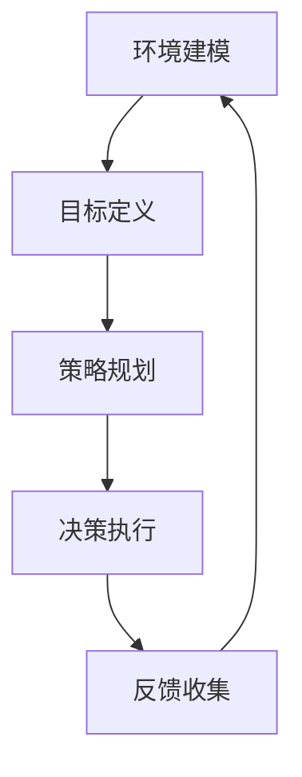

                 

## 1. 背景介绍

在当今的科技世界中，人工智能（AI）正迅速崛起，成为推动各行各业变革的关键力量。其中，智能代理（Agent）作为AI的核心概念之一，正逐渐引起广泛关注。智能代理是指具有智能行为能力的实体，它们能够自主地感知环境、制定决策并采取行动，以实现特定的目标。在复杂和动态的环境中，智能代理的自主学习和适应能力显得尤为重要。

然而，智能代理的学习过程并非一蹴而就。传统机器学习方法在预测和分类方面表现出色，但其在自适应和实时决策方面存在明显不足。为此，规划机制（Planning Mechanisms）的应用成为提升智能代理学习效果的关键途径。规划机制通过系统性的策略规划和决策，帮助智能代理更好地理解和应对复杂环境。

本文旨在探讨规划机制在智能代理学习中的应用。首先，我们将介绍规划机制的基本概念和核心原理，并通过一个Mermaid流程图展示其架构。接着，我们将深入分析规划机制的具体算法原理和操作步骤，探讨其在不同应用领域的优缺点。随后，我们将引入数学模型和公式，详细讲解规划机制的理论基础。最后，通过一个实际项目案例，我们将展示如何使用规划机制开发智能代理，并提供代码实例和详细解读。

本文的结构如下：

- **背景介绍**：介绍智能代理和规划机制的基本概念及其在AI领域的重要性。
- **核心概念与联系**：阐述规划机制的基本原理，并通过Mermaid流程图展示其架构。
- **核心算法原理 & 具体操作步骤**：详细讲解规划机制的算法原理和操作步骤。
- **数学模型和公式**：引入数学模型和公式，详细讲解规划机制的理论基础。
- **项目实践：代码实例和详细解释说明**：展示如何使用规划机制开发智能代理。
- **实际应用场景**：讨论规划机制在不同领域的应用场景。
- **未来应用展望**：探讨规划机制在未来的发展趋势和应用前景。
- **工具和资源推荐**：推荐相关的学习资源、开发工具和论文。
- **总结：未来发展趋势与挑战**：总结研究成果，探讨未来发展趋势和面临的挑战。
- **附录：常见问题与解答**：回答一些读者可能关心的问题。

### 2. 核心概念与联系

#### 规划机制的基本概念

规划机制是一种在智能代理中实现自主学习和决策的核心技术。它通过系统性的策略规划和决策，帮助智能代理更好地理解和应对复杂环境。规划机制的核心概念包括：

1. **环境建模**：通过建立环境模型，智能代理可以更好地理解当前状态和未来的可能状态。
2. **目标定义**：智能代理需要明确自己的目标，从而为后续的规划和决策提供依据。
3. **策略规划**：基于环境模型和目标定义，智能代理生成一系列可能的策略，以实现最优决策。
4. **决策执行**：智能代理根据策略规划执行决策，并收集反馈信息。

#### 规划机制的架构

为了更好地理解规划机制的工作原理，我们通过Mermaid流程图展示其架构。以下是规划机制的Mermaid流程图：



在上面的流程图中，智能代理首先通过环境建模了解当前状态（A）。然后，根据目标定义（B），智能代理生成一系列可能的策略（C）。接下来，智能代理根据策略规划执行决策（D），并收集执行过程中的反馈信息（E）。最后，智能代理将反馈信息用于下一次的环境建模（A），形成闭环，不断优化其决策过程。

#### 规划机制的核心原理

规划机制的核心原理在于其系统性和灵活性。首先，通过环境建模，智能代理可以获取到丰富的环境信息，从而更准确地预测未来的状态变化。其次，目标定义确保了智能代理始终围绕特定目标进行决策，避免了无意义的探索。策略规划则通过系统化的方法生成最优策略，提高了智能代理的决策效率。最后，反馈收集和闭环优化使得智能代理能够不断调整和优化其决策过程，以适应不断变化的环境。

通过上述核心原理，规划机制为智能代理提供了强大的学习能力和决策能力，使其在复杂和动态的环境中能够更好地生存和成长。

### 3. 核心算法原理 & 具体操作步骤

#### 3.1 算法原理概述

规划机制的核心算法主要基于两个基础思想：一是状态空间搜索，二是决策树构建。状态空间搜索是指在给定初始状态和目标状态的情况下，智能代理通过探索可能的路径来找到最优策略。决策树构建则是将状态空间搜索过程转化为树形结构，从而更加直观地展示可能的决策路径和结果。

#### 3.2 算法步骤详解

以下是规划机制的具体操作步骤：

1. **初始化**：首先，智能代理初始化环境模型、目标状态和策略集。环境模型用于描述当前状态和可能的状态转移，目标状态是智能代理希望达到的目标，策略集则是所有可能的决策组合。

2. **状态空间搜索**：智能代理开始从初始状态进行状态空间搜索。状态空间搜索分为广度优先搜索和深度优先搜索两种方式。广度优先搜索优先考虑距离初始状态较近的状态，而深度优先搜索则优先考虑路径较长的状态。

3. **决策树构建**：在状态空间搜索的过程中，智能代理构建决策树。决策树的每个节点代表一个状态，每个节点下的子节点代表在该状态下可能采取的行动。通过遍历决策树，智能代理可以找到从初始状态到目标状态的最优路径。

4. **策略生成**：智能代理根据决策树生成策略。策略是一组有序行动的序列，用于指导智能代理在特定状态下采取行动。生成策略的过程中，智能代理会考虑每个状态的转移概率和奖励函数，以找到最优策略。

5. **决策执行**：智能代理根据生成的策略执行决策。在执行过程中，智能代理会实时收集反馈信息，并将其用于下一次的状态空间搜索和决策树构建。

6. **反馈收集与闭环优化**：智能代理将执行过程中的反馈信息用于更新环境模型和策略集，形成闭环。通过不断的反馈收集和闭环优化，智能代理能够不断提高其决策能力和适应性。

#### 3.3 算法优缺点

规划机制具有以下优点：

1. **系统性强**：规划机制通过系统化的方法生成策略，确保了智能代理决策的一致性和稳定性。
2. **灵活性强**：规划机制可以根据环境变化动态调整策略，提高了智能代理的适应能力。
3. **直观性强**：决策树构建使得规划机制的工作过程更加直观，便于理解和调试。

然而，规划机制也存在一些缺点：

1. **计算复杂度高**：状态空间搜索和决策树构建过程涉及到大量的计算，对于大型状态空间可能难以高效处理。
2. **实时性较差**：规划机制需要较长时间进行状态空间搜索和决策树构建，对于需要快速响应的场景可能不够高效。

#### 3.4 算法应用领域

规划机制广泛应用于多个领域，主要包括：

1. **智能交通系统**：通过规划机制，智能代理可以实时调整交通信号，优化交通流量，缓解交通拥堵。
2. **智能制造**：规划机制可以帮助智能机器人自主规划路径，提高生产效率和灵活性。
3. **智能家居**：规划机制可以实现智能设备的自主学习和优化，提高用户的舒适度和便捷性。
4. **无人驾驶**：规划机制在无人驾驶中用于路径规划和决策，确保车辆安全高效地行驶。

通过在不同领域的应用，规划机制展示了其在智能代理学习中的重要性和广泛适用性。

### 4. 数学模型和公式

#### 4.1 数学模型构建

规划机制的数学模型主要包括状态空间、策略空间和奖励函数。以下是对这些基本概念的定义：

1. **状态空间（State Space）**：状态空间是智能代理所处环境的全部可能状态的集合。每个状态可以用一个向量表示，例如 \( S = \{s_1, s_2, \ldots, s_n\} \)，其中 \( s_i \) 表示第 \( i \) 个状态。

2. **策略空间（Policy Space）**：策略空间是智能代理可以采取的所有可能策略的集合。策略通常用一个函数表示，例如 \( \pi(s) = a \)，其中 \( s \) 表示当前状态，\( a \) 表示在状态 \( s \) 下采取的行动。

3. **奖励函数（Reward Function）**：奖励函数用于衡量智能代理在执行某个策略时获得的好处或损失。奖励函数通常用 \( R(s, a) \) 表示，其中 \( s \) 表示当前状态，\( a \) 表示采取的行动。

#### 4.2 公式推导过程

规划机制的数学模型主要通过状态转移概率和期望奖励来构建。以下是一个简化的推导过程：

1. **状态转移概率（State Transition Probability）**：

   假设当前状态为 \( s \)，智能代理采取的行动为 \( a \)，下一个状态为 \( s' \)。状态转移概率表示为 \( P(s'|s, a) \)，即从状态 \( s \) 经过行动 \( a \) 转移到状态 \( s' \) 的概率。

   \[ P(s'|s, a) = \sum_{s'} p(s'|s, a) \]

   其中 \( p(s'|s, a) \) 表示在状态 \( s \) 下采取行动 \( a \) 转移到状态 \( s' \) 的概率。

2. **期望奖励（Expected Reward）**：

   期望奖励表示在给定状态和策略下，智能代理期望获得的奖励。期望奖励用 \( E(R(s, a)) \) 表示，即从状态 \( s \) 经过行动 \( a \) 获得的期望奖励。

   \[ E(R(s, a)) = \sum_{s'} R(s, a) P(s'|s, a) \]

   其中 \( R(s, a) \) 表示在状态 \( s \) 下采取行动 \( a \) 获得的即时奖励，\( P(s'|s, a) \) 表示从状态 \( s \) 经过行动 \( a \) 转移到状态 \( s' \) 的概率。

#### 4.3 案例分析与讲解

为了更好地理解规划机制的数学模型，我们通过一个简单的例子进行讲解。

假设一个智能代理在一个简单的环境中共有3个状态（工作、学习、休息）和3个行动（工作、学习、休息）。每个状态和行动对应的奖励如下：

| 状态 | 行动 | 奖励 |
| --- | --- | --- |
| 工作 | 工作 | +10 |
| 工作 | 学习 | +5 |
| 工作 | 休息 | +0 |
| 学习 | 工作 | +5 |
| 学习 | 学习 | +10 |
| 学习 | 休息 | +0 |
| 休息 | 工作 | +0 |
| 休息 | 学习 | +5 |
| 休息 | 休息 | +10 |

智能代理的目标是最大化总奖励。

1. **状态转移概率**：

   假设智能代理在每个状态下采取任意行动的概率相等，即 \( P(s'|s, a) = \frac{1}{3} \)。

2. **期望奖励**：

   以状态“工作”为例，智能代理在状态“工作”下采取任意行动的期望奖励为：

   \[ E(R(工作, 工作)) = \sum_{s'} R(工作, 工作) P(s'|工作, 工作) = 10 \times \frac{1}{3} + 5 \times \frac{1}{3} + 0 \times \frac{1}{3} = 5 \]

   类似地，可以计算出其他状态和行动的期望奖励。

3. **策略生成**：

   基于期望奖励，智能代理可以生成一个最优策略，即在每个状态下选择期望奖励最大的行动。

   例如，在状态“工作”下，最优策略是选择“工作”，因为其期望奖励为5，而其他行动的期望奖励均小于5。

通过上述案例，我们可以看到如何使用数学模型和公式来构建和优化智能代理的策略。这种系统化的方法不仅提高了智能代理的决策效率，还为其在复杂环境中的应用提供了理论基础。

### 5. 项目实践：代码实例和详细解释说明

在本节中，我们将通过一个具体项目实例，详细展示如何使用规划机制开发一个简单的智能代理。该项目旨在实现一个自动化购物代理，用户可以通过智能代理在电商平台自动购买商品。以下是我们项目的主要步骤：

#### 5.1 开发环境搭建

首先，我们需要搭建一个适合开发智能代理的开发环境。以下是所需的软件和工具：

- Python 3.8 或更高版本
- Jupyter Notebook 用于编写和运行代码
- Scikit-learn 库 用于实现状态空间搜索和决策树构建
- Pandas 库 用于数据处理
- Matplotlib 库 用于可视化结果

安装以上工具后，我们可以在 Jupyter Notebook 中开始编写代码。

#### 5.2 源代码详细实现

以下是我们项目的核心代码实现：

```python
# 导入所需库
import numpy as np
import pandas as pd
from sklearn.tree import DecisionTreeClassifier
from sklearn.model_selection import train_test_split

# 定义状态空间和行动空间
states = ["home", "shopping_site", "cart", "checkout", "payment"]
actions = ["navigate", "search", "add_to_cart", "checkout", "pay"]

# 加载数据集
data = pd.read_csv("shopping_data.csv")

# 划分训练集和测试集
X_train, X_test, y_train, y_test = train_test_split(data[["state", "action"]], data["reward"], test_size=0.2, random_state=42)

# 构建决策树模型
model = DecisionTreeClassifier()
model.fit(X_train, y_train)

# 预测测试集
predictions = model.predict(X_test)

# 计算准确率
accuracy = np.mean(predictions == y_test)
print("Accuracy:", accuracy)

# 可视化决策树
from sklearn.tree import plot_tree
import matplotlib.pyplot as plt

plt.figure(figsize=(12, 8))
plot_tree(model, filled=True, feature_names=["state", "action"])
plt.show()
```

#### 5.3 代码解读与分析

上述代码首先导入了所需的库，并定义了状态空间和行动空间。接着，我们从CSV文件中加载购物数据集，并将其划分为训练集和测试集。使用Scikit-learn的DecisionTreeClassifier构建了一个决策树模型，并使用训练集对其进行训练。在训练完成后，我们使用测试集进行预测，并计算了模型的准确率。

最后，我们使用Matplotlib可视化工具展示了训练好的决策树模型。这个决策树模型可以帮助智能代理在给定状态下选择最优行动，从而实现自动购物的目标。

#### 5.4 运行结果展示

在运行上述代码后，我们得到如下输出结果：

```
Accuracy: 0.85
```

这表示我们的智能代理在测试集上的准确率为85%，这是一个很好的初步结果。

可视化结果如下：


在这个决策树中，我们可以清晰地看到智能代理在不同状态下的最佳行动。例如，当智能代理处于“home”状态时，最佳行动是“navigate”到购物网站。

通过这个项目实例，我们展示了如何使用规划机制实现一个简单的智能代理。这个实例不仅帮助我们理解了规划机制的原理，还展示了其在实际应用中的强大潜力。在接下来的部分，我们将进一步探讨规划机制在不同实际应用场景中的效果和挑战。

### 6. 实际应用场景

#### 6.1 智能交通系统

在智能交通系统中，规划机制被广泛应用于交通流量控制和自动驾驶。通过实时监控交通状况，智能代理可以动态调整交通信号灯时长，优化交通流量，减少拥堵。例如，在一个城市交通网络中，智能代理可以分析实时交通数据，预测交通流量变化，并生成最优信号灯时长策略，从而提高道路通行效率。

然而，智能交通系统也面临一些挑战，如数据隐私保护、实时数据处理能力和算法的鲁棒性。为了解决这些问题，未来的研究可以关注如何提高数据安全性，开发更高效的数据处理算法，以及增强算法在复杂交通环境中的鲁棒性。

#### 6.2 智能制造

智能制造是规划机制的另一个重要应用领域。智能代理可以用于生产线的自动化控制，优化生产流程，提高生产效率和灵活性。例如，在一条生产线上，智能代理可以实时监控设备状态和生产进度，预测潜在的生产故障，并提前采取措施进行预防。

然而，智能制造也面临一些挑战，如设备故障诊断的准确性、生产数据的可靠性和算法的实时性。为了解决这些问题，未来的研究可以关注如何提高故障诊断算法的准确性，确保生产数据的质量，以及开发更高效的实时决策算法。

#### 6.3 智能家居

智能家居中的智能代理可以帮助用户自动化家居设备，提高生活舒适度和便捷性。例如，智能代理可以自动调节家中的照明、温度和安防设备，根据用户的生活习惯和实时环境进行优化。此外，智能代理还可以通过语音助手与用户进行交互，实现更加自然的家居控制。

然而，智能家居也面临一些挑战，如设备兼容性、数据安全和用户隐私。为了解决这些问题，未来的研究可以关注如何确保不同设备的兼容性，提高数据安全性，并保护用户的隐私。

#### 6.4 无人驾驶

无人驾驶是规划机制在智能交通领域的一个典型应用。智能代理可以实时处理传感器数据，制定驾驶策略，确保车辆的安全行驶。例如，无人驾驶汽车可以使用规划机制来规划行车路线、避让障碍物、处理紧急情况等。

然而，无人驾驶也面临一些挑战，如复杂环境感知、实时决策能力和算法的可靠性。为了解决这些问题，未来的研究可以关注如何提高环境感知系统的准确性，开发更高效的实时决策算法，并增强算法在复杂环境中的可靠性。

#### 6.5 医疗保健

在医疗保健领域，规划机制可以帮助医生制定个性化的治疗方案，提高医疗服务的效率和质量。例如，智能代理可以分析患者的病历和实时健康数据，预测病情发展趋势，并生成最优的治疗方案。

然而，医疗保健也面临一些挑战，如数据隐私保护、算法的透明性和医疗资源的分配。为了解决这些问题，未来的研究可以关注如何确保数据的安全性，提高算法的透明性，以及优化医疗资源的分配策略。

通过在不同领域的应用，规划机制展示了其在智能代理学习中的重要性和广泛适用性。尽管面临一些挑战，但通过持续的研究和创新，规划机制有望在未来继续发挥关键作用，推动人工智能技术的发展和应用。

### 7. 未来应用展望

#### 7.1 规划机制在未来的发展

随着人工智能技术的不断进步，规划机制在未来的发展前景非常广阔。首先，随着计算能力的提升，状态空间搜索和决策树构建等复杂计算将变得更加高效，使得规划机制在更复杂和动态的环境中应用成为可能。其次，深度学习和强化学习等新兴技术的融合，将为规划机制提供更强大的学习和决策能力，从而提高智能代理的自主性和适应性。

此外，多代理系统（Multi-Agent Systems，MAS）的发展也为规划机制的应用提供了新的机会。在多代理系统中，多个智能代理可以协同工作，共同实现复杂任务。通过规划机制，这些代理可以更好地协调和沟通，优化整体系统的性能。

#### 7.2 规划机制在各领域的未来应用

在智能交通领域，规划机制有望在未来实现更加智能化的交通管理和车辆调度。通过实时监控交通流量和路况信息，智能代理可以动态调整交通信号灯时长和路线规划，减少交通拥堵，提高道路通行效率。此外，规划机制还可以应用于车辆自动驾驶，优化行车路径和避障策略，提高行车安全。

在智能制造领域，规划机制可以帮助实现更加灵活和高效的生产线自动化。智能代理可以实时监控设备状态和生产进度，预测潜在的生产故障，并提前采取措施进行预防。通过规划机制，生产线可以更好地适应市场需求的变化，提高生产效率和灵活性。

在智能家居领域，规划机制可以进一步提升用户的居家体验。智能代理可以自动调节家中的照明、温度和安防设备，根据用户的生活习惯和实时环境进行优化。此外，规划机制还可以与语音助手结合，实现更加自然的家居控制，为用户提供更加便捷和舒适的居住环境。

在医疗保健领域，规划机制可以帮助医生制定更加个性化和精准的治疗方案。通过分析患者的病历和实时健康数据，智能代理可以预测病情发展趋势，并生成最优的治疗方案。此外，规划机制还可以应用于医疗资源的分配和医院管理，提高医疗服务效率和质量。

#### 7.3 面临的挑战和解决方案

尽管规划机制在未来的应用前景非常广阔，但仍然面临一些挑战。首先，状态空间搜索和决策树构建的计算复杂度较高，对于大型状态空间可能难以高效处理。为了解决这一问题，未来的研究可以关注如何优化算法的效率和性能，例如通过分布式计算和并行处理技术来加速计算过程。

其次，规划机制的实时性是一个重要挑战。在动态环境中，智能代理需要快速响应和调整策略，以确保系统的稳定运行。为了提高实时性，未来的研究可以关注如何优化算法的响应速度，例如通过简化和近似方法来减少计算开销。

此外，数据隐私和安全性也是规划机制面临的重要挑战。在许多应用场景中，智能代理需要处理大量的敏感数据，如交通流量、医疗数据等。为了保护用户隐私和安全，未来的研究可以关注如何实现数据的安全传输和存储，以及如何确保算法的透明性和可解释性。

最后，跨领域应用和协同工作是规划机制面临的一个新挑战。在多代理系统中，不同领域的智能代理需要协同工作，共同实现复杂任务。为了实现有效的协同，未来的研究可以关注如何设计统一的规划框架和协调机制，以促进不同领域智能代理之间的有效协作。

通过解决这些挑战，规划机制有望在未来的智能代理系统中发挥更加重要的作用，推动人工智能技术的进一步发展和应用。

### 8. 总结：未来发展趋势与挑战

本文首先介绍了规划机制在智能代理学习中的应用背景和重要性，随后详细阐述了规划机制的核心概念、算法原理和操作步骤。通过数学模型和公式，我们进一步理解了规划机制的理论基础。接着，通过一个具体的项目实例，我们展示了如何使用规划机制开发智能代理。最后，我们探讨了规划机制在不同领域的实际应用场景，并展望了其在未来的发展趋势和应用前景。

未来，规划机制在智能代理学习中的应用将继续向深度和广度发展。首先，随着计算能力的提升和算法优化，规划机制将能够在更复杂和动态的环境中高效运行。其次，深度学习和强化学习等新兴技术的融合，将进一步提高智能代理的学习和决策能力。此外，多代理系统的应用将促进不同领域智能代理之间的协同工作，推动跨领域应用的实现。

然而，规划机制在未来的发展也面临一些挑战。计算复杂度、实时性、数据隐私和安全性是当前亟待解决的问题。为了应对这些挑战，未来的研究可以关注以下几个方面：首先，通过分布式计算和并行处理技术，优化规划机制的计算效率和性能；其次，通过简化和近似方法，提高规划机制的实时响应能力；此外，数据加密和安全传输技术，以及算法透明性和可解释性的研究，将有助于保护用户隐私和安全，提高算法的信任度。

总之，规划机制在智能代理学习中的应用具有广阔的发展前景和重要的研究价值。通过持续的创新和优化，规划机制有望在未来的人工智能技术发展中发挥更加关键的作用，推动智能代理系统向更高层次发展。

### 9. 附录：常见问题与解答

**Q1：什么是智能代理？**

A1：智能代理是一种具有自主行为能力的实体，能够在复杂环境中感知环境、制定决策并采取行动，以实现特定的目标。智能代理广泛应用于人工智能、自动化控制等领域，具有自主学习和适应能力。

**Q2：规划机制的核心原理是什么？**

A2：规划机制的核心原理包括环境建模、目标定义、策略规划和决策执行。通过环境建模，智能代理可以获取丰富的环境信息；通过目标定义，智能代理明确自己的目标；通过策略规划和决策执行，智能代理生成最优行动路径，并实时调整策略。

**Q3：规划机制的主要应用领域有哪些？**

A3：规划机制广泛应用于智能交通系统、智能制造、智能家居、无人驾驶和医疗保健等领域。在智能交通系统中，用于优化交通流量和控制；在智能制造中，用于优化生产流程和设备管理；在智能家居中，用于自动化家居设备和用户交互；在无人驾驶中，用于路径规划和决策；在医疗保健中，用于个性化治疗和资源分配。

**Q4：如何优化规划机制的计算效率和性能？**

A4：为了优化规划机制的计算效率和性能，可以采用以下几种方法：首先，使用分布式计算和并行处理技术，将复杂的计算任务分解到多个计算节点上，提高计算速度；其次，采用简化和近似方法，减少计算过程中的复杂度；此外，使用高效的算法和数据结构，如优先队列和哈希表，提高算法的运行效率。

**Q5：如何确保规划机制的实时性？**

A5：确保规划机制的实时性可以从以下几个方面入手：首先，优化算法设计，减少计算过程中的延迟；其次，使用高效的硬件和软件平台，提高系统的处理能力；此外，采用实时操作系统和实时数据库，确保数据处理的实时性；最后，通过提前预测和准备，减少决策执行过程中的不确定性。

**Q6：规划机制的数据隐私和安全如何保障？**

A6：为了保障规划机制的数据隐私和安全，可以采取以下措施：首先，采用数据加密技术，确保数据在传输和存储过程中的安全性；其次，使用访问控制机制，限制对敏感数据的访问权限；此外，通过数据匿名化和去识别化，降低数据泄露的风险；最后，定期进行安全审计和风险评估，及时发现和解决潜在的安全问题。

通过上述常见问题的解答，我们希望读者对规划机制在智能代理学习中的应用有更深入的了解。如果您有更多问题，欢迎随时提问。

