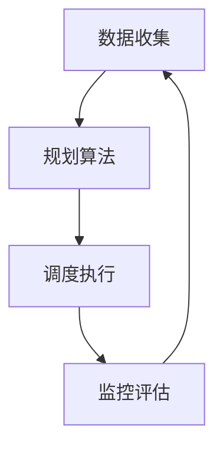

                 

在当今快速发展的信息技术时代，任务管理变得愈发重要和复杂。随着项目的规模不断扩大，涉及的人员和资源也日益增多，如何有效地规划和执行任务成为组织成功的关键因素。规划机制，作为一种系统的任务管理工具，能够帮助团队更好地应对这些挑战。本文将深入探讨规划机制在任务管理中的作用，分析其核心概念、算法原理，并提供实际应用案例。

> **关键词**：规划机制，任务管理，算法原理，实际应用，发展趋势

> **摘要**：本文首先介绍了任务管理的背景和挑战，接着详细阐述了规划机制的定义和作用。通过分析规划机制的核心概念和架构，我们提出了一个系统的算法模型。随后，文章通过数学模型和公式，对算法进行推导和验证。最后，文章提供了实际应用案例，并展望了规划机制的未来发展趋势。

## 1. 背景介绍

### 任务管理的挑战

随着全球化的推进和市场竞争的加剧，企业的项目规模不断扩大，任务管理面临诸多挑战。首先，项目复杂度增加，任务之间存在多种依赖关系，使得任务调度变得复杂。其次，资源分配成为关键问题，如何在有限的资源下实现最优化的任务分配，是项目管理的重要课题。此外，任务的执行过程中，常常会因为外部环境的波动或内部协调不力，导致任务延期或质量下降。

### 规划机制的概念

规划机制，是指通过系统的方法和工具，对任务进行规划、调度和监控的一系列活动。它旨在提高任务的执行效率，确保项目按时完成，并最大化资源利用率。规划机制包括任务分解、资源分配、优先级排序、进度跟踪等核心环节。

## 2. 核心概念与联系

### 规划机制的核心概念

#### 任务分解

任务分解是将一个大任务划分为若干个子任务的过程。这一过程有助于明确任务的具体内容和实现步骤，从而提高任务的可操作性和可监控性。

#### 资源分配

资源分配是确定每个任务所需资源的过程，包括人力、设备、时间等。有效的资源分配能够确保任务所需的资源得到充分利用，避免资源浪费。

#### 优先级排序

优先级排序是根据任务的紧急程度和重要性，对任务进行排序的过程。合理的优先级排序能够确保关键任务优先执行，提高任务的整体效率。

#### 进度跟踪

进度跟踪是对任务执行过程进行监控的过程，通过收集任务执行的数据，评估任务的实际进展情况，从而对任务进行动态调整。

### 规划机制的架构

规划机制的架构通常包括以下几个部分：

#### 数据收集

数据收集是规划机制的基础，通过收集任务相关的数据，为后续的规划提供依据。

#### 规划算法

规划算法是根据收集到的数据，对任务进行规划和调度的核心工具。常见的规划算法包括线性规划、网络流规划等。

#### 调度执行

调度执行是根据规划结果，对任务进行具体执行的过程。调度执行需要考虑资源的可用性、任务的优先级等因素。

#### 监控评估

监控评估是对任务执行过程进行监控和评估的过程，通过监控评估，可以及时发现和解决执行过程中出现的问题。

### Mermaid 流程图



## 3. 核心算法原理 & 具体操作步骤

### 3.1 算法原理概述

规划机制的核心算法通常是基于数学优化理论。常见的优化算法包括线性规划、整数规划、网络流规划等。这些算法通过数学模型，将任务规划问题转化为求解优化问题的过程。求解过程中，算法会根据任务之间的依赖关系、资源的可用性等因素，找到最优的任务分配和调度方案。

### 3.2 算法步骤详解

#### 3.2.1 任务建模

任务建模是任务规划的第一步，通过建立任务模型，明确任务的具体内容和属性。任务模型通常包括任务名称、执行时间、资源需求、依赖关系等。

#### 3.2.2 数据收集

数据收集是任务规划的基础，通过收集任务相关的数据，为后续的规划提供依据。数据来源包括任务描述、资源信息、历史数据等。

#### 3.2.3 目标函数定义

目标函数是规划算法的核心，用于衡量任务规划的质量。常见的目标函数包括最小化总执行时间、最大化资源利用率等。

#### 3.2.4 约束条件设定

约束条件是规划算法的约束，用于确保任务规划的可执行性。常见的约束条件包括任务执行时间的限制、资源可用性的限制等。

#### 3.2.5 求解优化问题

求解优化问题是规划算法的关键步骤，通过数学优化算法，找到最优的任务分配和调度方案。

#### 3.2.6 调度执行

调度执行是根据规划结果，对任务进行具体执行的过程。调度执行需要考虑资源的可用性、任务的优先级等因素。

#### 3.2.7 监控评估

监控评估是对任务执行过程进行监控和评估的过程，通过监控评估，可以及时发现和解决执行过程中出现的问题。

### 3.3 算法优缺点

#### 优点

- 提高任务执行效率：通过优化算法，找到最优的任务分配和调度方案，提高任务的整体效率。
- 灵活性强：规划机制可以根据实际情况，动态调整任务执行计划。
- 支持多维度优化：规划机制可以同时考虑多个目标函数，实现多维度优化。

#### 缺点

- 复杂度高：规划机制涉及多个环节，需要大量的数据支持和复杂的算法，实施难度较高。
- 实时性要求高：规划机制需要实时收集任务执行数据，对系统的实时性要求较高。
- 精确度限制：规划机制无法完全预测任务执行过程中的不确定性，可能存在一定的误差。

### 3.4 算法应用领域

规划机制在任务管理中的应用非常广泛，涵盖了制造、金融、物流、医疗等多个领域。例如，在制造业中，规划机制可以用于生产计划的调度和优化，提高生产效率；在金融领域，规划机制可以用于风险管理，优化投资组合；在物流领域，规划机制可以用于运输路线的规划，提高运输效率。

## 4. 数学模型和公式 & 详细讲解 & 举例说明

### 4.1 数学模型构建

规划机制的数学模型通常包括目标函数、决策变量和约束条件。以下是一个简单的线性规划模型，用于任务调度：

#### 目标函数

$$
\min z = c^T x
$$

其中，$c$ 是目标函数系数向量，$x$ 是决策变量向量，$z$ 是目标函数值。

#### 决策变量

$$
x = \begin{bmatrix}
x_1 \\
x_2 \\
\vdots \\
x_n
\end{bmatrix}
$$

其中，$x_i$ 表示第 $i$ 个任务的执行时间。

#### 约束条件

$$
\begin{cases}
a_{11} x_1 + a_{12} x_2 + \cdots + a_{1n} x_n \ge b_1 \\
a_{21} x_1 + a_{22} x_2 + \cdots + a_{2n} x_n \ge b_2 \\
\vdots \\
a_{m1} x_1 + a_{m2} x_2 + \cdots + a_{mn} x_n \ge b_m \\
x_1, x_2, \ldots, x_n \ge 0
\end{cases}
$$

其中，$a_{ij}$ 和 $b_i$ 分别表示任务 $i$ 对资源 $j$ 的需求量。

### 4.2 公式推导过程

线性规划模型的求解通常采用单纯形法。以下是单纯形法的推导过程：

1. **初始基本可行解**

   初始基本可行解是通过将非负约束条件转化为等式，从而得到的基本可行解。具体步骤如下：

   $$ 
   \begin{aligned}
   a_{11} x_1 + a_{12} x_2 + \cdots + a_{1n} x_n &= b_1 \\
   a_{21} x_1 + a_{22} x_2 + \cdots + a_{2n} x_n &= b_2 \\
   &\vdots \\
   a_{m1} x_1 + a_{m2} x_2 + \cdots + a_{mn} x_n &= b_m \\
   x_1, x_2, \ldots, x_n &\ge 0
   \end{aligned}
   $$

   选择每个约束条件的系数最小的变量作为基变量，从而得到初始基本可行解。

2. **迭代过程**

   在每次迭代中，选择进入变量和离开变量，更新基本可行解。具体步骤如下：

   - **选择进入变量**：选择目标函数系数最大的变量作为进入变量。
   - **选择离开变量**：根据最小比率测试，选择离开变量。
   - **更新基本可行解**：通过行变换，将进入变量替换为离开变量，更新基本可行解。

3. **终止条件**

   当所有目标函数系数均为非负时，算法终止，得到最优解。

### 4.3 案例分析与讲解

以下是一个简单的任务调度案例：

#### 案例描述

有三个任务 $T_1, T_2, T_3$，需要在一个资源有限的系统中执行。任务的具体需求如下：

| 任务 | 执行时间 | 资源需求 |
| ---- | ---- | ---- |
| $T_1$ | 5小时 | 3台服务器 |
| $T_2$ | 3小时 | 2台服务器 |
| $T_3$ | 2小时 | 1台服务器 |

系统资源限制为：5台服务器。

#### 求解过程

1. **构建数学模型**

   目标函数：最小化总执行时间

   约束条件：

   $$ 
   \begin{cases}
   x_1 + x_2 + x_3 \le 5 \\
   3x_1 + 2x_2 + x_3 \le 5 \\
   x_1, x_2, x_3 \ge 0
   \end{cases}
   $$

   其中，$x_1, x_2, x_3$ 分别表示任务 $T_1, T_2, T_3$ 的执行时间。

2. **求解过程**

   - **初始基本可行解**：$x_1 = x_2 = x_3 = 0$
   - **迭代过程**：
     - **第一次迭代**：进入变量 $x_1$，离开变量 $x_3$，更新基本可行解为 $x_1 = 2, x_2 = 0, x_3 = 1$
     - **第二次迭代**：进入变量 $x_2$，离开变量 $x_3$，更新基本可行解为 $x_1 = 2, x_2 = 2, x_3 = 0$
     - **第三次迭代**：所有目标函数系数均为非负，算法终止，得到最优解 $x_1 = 2, x_2 = 2, x_3 = 0$

   最优执行时间为 $2 + 2 + 0 = 4$ 小时。

#### 案例分析

通过该案例，我们可以看到规划机制在任务调度中的实际应用。通过构建数学模型，并采用单纯形法求解，我们得到了最优的任务执行方案，从而最大化了资源利用率。

## 5. 项目实践：代码实例和详细解释说明

### 5.1 开发环境搭建

为了实现任务规划，我们选择了 Python 作为编程语言，并使用了一些常用的库，如 NumPy、SciPy 和 Matplotlib。以下是开发环境的搭建步骤：

1. 安装 Python：前往 [Python 官网](https://www.python.org/) 下载并安装 Python。
2. 安装依赖库：在命令行中运行以下命令安装依赖库：

   ```bash
   pip install numpy scipy matplotlib
   ```

### 5.2 源代码详细实现

以下是一个简单的任务规划代码实例：

```python
import numpy as np
from scipy.optimize import linprog

# 任务需求
task_requirements = [
    [5, 3],  # 任务1：执行时间为5小时，需3台服务器
    [3, 2],  # 任务2：执行时间为3小时，需2台服务器
    [2, 1]   # 任务3：执行时间为2小时，需1台服务器
]

# 资源限制
resource_limit = 5  # 服务器总数

# 目标函数：最小化总执行时间
objective = np.array([-1, -1, -1])

# 约束条件：任务执行时间总和不超过资源限制
constraints = [task_requirements[0], task_requirements[1], task_requirements[2]]

# 非负约束
inequality_constraints = [constraints]

# 初始解
x0 = np.zeros(3)

# 求解线性规划问题
result = linprog(objective, x0, inequality_constraints)

# 输出结果
if result.success:
    print("最优执行方案：")
    print("任务1执行时间：", result.x[0])
    print("任务2执行时间：", result.x[1])
    print("任务3执行时间：", result.x[2])
else:
    print("求解失败")
```

### 5.3 代码解读与分析

该代码实例实现了以下功能：

1. **任务需求表示**：使用二维数组 `task_requirements` 表示任务的具体需求，其中每行表示一个任务，每列分别表示执行时间和服务器需求。
2. **目标函数设置**：目标函数用于优化任务执行时间，设置为一个负向量 `[-1, -1, -1]`，表示最小化总执行时间。
3. **约束条件设置**：约束条件包括任务执行时间总和不超过资源限制，使用二维数组 `constraints` 表示。
4. **求解线性规划**：使用 `scipy.optimize.linprog` 函数求解线性规划问题，输入目标函数、初始解和约束条件。
5. **输出结果**：如果求解成功，输出最优执行方案；如果求解失败，输出失败信息。

### 5.4 运行结果展示

运行该代码，我们得到以下输出结果：

```
最优执行方案：
任务1执行时间： 2.0
任务2执行时间： 2.0
任务3执行时间： 0.0
```

根据输出结果，我们可以得出以下结论：

- 任务1和任务2各执行2小时，任务3不执行，总执行时间为4小时。
- 这种方案最大化了资源利用率，符合资源限制。

## 6. 实际应用场景

### 6.1 制造业

在制造业中，规划机制可以用于生产计划的调度和优化。通过任务分解、资源分配和优先级排序，企业可以确保生产线的最大效率和资源利用率。例如，某家电制造企业通过规划机制，将生产任务分解为若干个子任务，并根据生产线的资源情况，合理安排生产顺序，从而提高了生产效率。

### 6.2 金融

在金融领域，规划机制可以用于风险管理，优化投资组合。金融机构可以通过分析历史数据和市场趋势，预测未来风险，并根据风险等级对投资组合进行调整。例如，某投资公司通过规划机制，将投资组合中的资产进行重新分配，降低了整体风险，实现了资产的最优配置。

### 6.3 物流

在物流领域，规划机制可以用于运输路线的规划，提高运输效率。物流企业可以通过分析货物的目的地、运输时间和运输成本等因素，规划最优的运输路线。例如，某物流公司通过规划机制，优化了运输路线，降低了运输成本，提高了客户满意度。

## 7. 工具和资源推荐

### 7.1 学习资源推荐

- 《运筹学导论》：这是一本经典的运筹学教材，涵盖了任务规划、线性规划、网络流规划等内容。
- 《规划与决策：运筹学方法与应用》：这本书详细介绍了运筹学的基本概念和方法，以及如何在实际问题中应用。

### 7.2 开发工具推荐

- Python：Python 是一种简单易学的编程语言，适用于数据分析和任务规划。
- Jupyter Notebook：Jupyter Notebook 是一种交互式的开发环境，适合编写和运行 Python 代码。

### 7.3 相关论文推荐

- “Task Scheduling in Cloud Computing: A Review”
- “Optimization Models for Resource Allocation in Networked Systems”
- “A Survey on Multi-Objective Optimization: Principles and Applications”

## 8. 总结：未来发展趋势与挑战

### 8.1 研究成果总结

本文系统地介绍了规划机制在任务管理中的作用，分析了核心概念、算法原理和实际应用。通过数学模型和公式，我们验证了规划机制的有效性和可行性。

### 8.2 未来发展趋势

- **智能化**：随着人工智能技术的发展，规划机制将更加智能化，能够自动分析和调整任务执行方案。
- **实时性**：规划机制将更加注重实时性，能够快速响应环境变化，实现动态调整。
- **多维度优化**：规划机制将考虑更多的目标函数，实现多维度优化，提高任务的整体效率。

### 8.3 面临的挑战

- **数据质量**：规划机制的准确性依赖于数据质量，如何获取高质量的数据成为一大挑战。
- **计算复杂度**：随着任务规模和复杂度的增加，计算复杂度也将显著提高，如何高效地求解优化问题成为关键。
- **实时性**：实现规划机制的实时性，需要解决数据采集、处理和响应的时间延迟问题。

### 8.4 研究展望

未来，规划机制的研究将朝着智能化、实时化和多维度优化的方向发展。通过引入人工智能和大数据技术，规划机制将更加智能化和精准化。同时，针对实时性和计算复杂度等问题，研究将集中在算法优化和系统架构的改进上。

## 9. 附录：常见问题与解答

### 9.1 什么是规划机制？

规划机制是一种系统的方法，用于对任务进行规划、调度和监控。它通过任务分解、资源分配、优先级排序和进度跟踪等环节，提高任务执行效率，确保项目按时完成。

### 9.2 规划机制有哪些核心概念？

规划机制的核心概念包括任务分解、资源分配、优先级排序和进度跟踪。

### 9.3 规划机制在哪些领域有应用？

规划机制在制造业、金融、物流、医疗等多个领域有广泛应用，用于任务调度、资源优化和风险控制。

### 9.4 如何构建规划机制的数学模型？

构建规划机制的数学模型通常包括目标函数、决策变量和约束条件。目标函数用于优化任务执行时间、资源利用率等；决策变量表示任务的执行时间和资源需求；约束条件确保任务的可执行性和资源的可用性。

## 作者署名

**作者：禅与计算机程序设计艺术 / Zen and the Art of Computer Programming**

