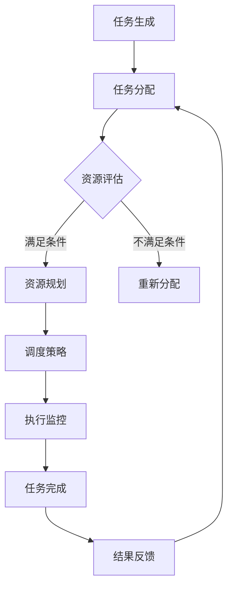

                 

### 1. 背景介绍

随着信息技术的飞速发展，智能自动化已经成为提高生产效率、优化流程管理的重要手段。从工业制造到服务业，智能自动化技术已经深入到了各个领域，极大地改变了人们的工作方式和生活方式。然而，随着自动化程度的提高，如何有效地规划和管理自动化过程，成为了一个亟待解决的问题。

规划机制（Planning Mechanism）作为一种智能自动化技术，旨在通过系统化的方法，对自动化过程进行预定的规划，确保自动化系统能够高效、可靠地运行。规划机制不仅能够优化资源分配，提高生产效率，还能够减少人为干预，降低操作风险。

本文旨在深入探讨规划机制在智能自动化中的应用，通过阐述其核心概念、算法原理、数学模型以及实际案例，帮助读者了解规划机制的基本原理和实践方法，为其在智能自动化领域中的应用提供理论支持和实践指导。

### 2. 核心概念与联系

#### 2.1 规划机制的定义

规划机制是一种智能自动化技术，它通过对任务进行预定的规划和调度，以确保自动化系统能够高效、可靠地完成预定任务。规划机制通常包括任务生成、任务分配、资源规划、调度策略等核心模块。

#### 2.2 智能自动化的定义

智能自动化是指利用人工智能技术，对生产流程、管理流程等进行优化和自动化处理，以提高生产效率和管理水平。智能自动化涵盖了机器学习、数据挖掘、自然语言处理、计算机视觉等多个领域。

#### 2.3 规划机制与智能自动化的联系

规划机制是智能自动化的重要组成部分，它通过系统化的方法，将智能自动化技术应用于实际任务中。规划机制不仅能够优化自动化流程，提高生产效率，还能够提高自动化系统的可靠性，减少人为干预。

#### 2.4 Mermaid 流程图

为了更直观地理解规划机制在智能自动化中的应用，我们使用 Mermaid 流程图来展示其核心流程。



在该流程图中，任务生成是整个规划机制的第一步，随后进行任务分配。在资源评估环节，系统会根据当前资源状况，决定是否进行资源规划。如果资源满足条件，则进行资源规划；否则，系统会重新进行任务分配。资源规划完成后，系统会根据调度策略进行任务调度，并执行监控以确保任务顺利完成。最后，系统会根据任务结果进行反馈，以优化后续任务分配。

### 3. 核心算法原理 & 具体操作步骤

#### 3.1 算法原理概述

规划机制的核心算法通常是基于优化理论，通过构建目标函数和约束条件，对自动化任务进行优化调度。具体来说，规划机制的核心算法包括以下三个方面：

1. **目标函数**：定义系统需要优化的目标，如最小化任务完成时间、最大化资源利用率等。
2. **约束条件**：定义任务执行过程中的限制条件，如任务依赖关系、资源约束等。
3. **调度策略**：根据目标函数和约束条件，确定任务执行的顺序和资源分配。

#### 3.2 算法步骤详解

1. **任务建模**：将实际任务抽象成数学模型，定义任务的基本属性，如任务ID、开始时间、结束时间、资源需求等。
2. **目标函数构建**：根据任务模型，构建目标函数，如最小化任务完成时间或最大化资源利用率。
3. **约束条件定义**：根据任务模型和目标函数，定义任务执行的约束条件，如任务依赖关系、资源约束等。
4. **算法选择**：根据目标函数和约束条件，选择合适的算法进行调度优化，如遗传算法、粒子群优化算法等。
5. **调度结果评估**：对调度结果进行评估，判断是否满足所有约束条件。如果不满足，则返回第4步重新优化。
6. **执行监控**：在任务执行过程中，实时监控任务进度和资源使用情况，确保任务能够按照计划进行。
7. **结果反馈**：任务完成后，根据任务结果进行反馈，以优化后续任务分配。

#### 3.3 算法优缺点

**优点：**

1. **高效性**：通过优化调度，提高任务完成效率，减少等待时间。
2. **灵活性**：能够适应不同类型和规模的任务，具有较好的通用性。
3. **可靠性**：通过约束条件确保任务执行过程中的安全性和稳定性。

**缺点：**

1. **计算复杂度**：优化算法通常需要较高的计算复杂度，对计算资源要求较高。
2. **模型假设**：实际任务往往复杂多变，模型假设可能与实际情况存在偏差，影响调度效果。

#### 3.4 算法应用领域

规划机制在智能自动化领域具有广泛的应用，主要包括以下几个方面：

1. **工业制造**：优化生产调度，提高生产效率。
2. **物流管理**：优化配送路径和运输计划，提高物流效率。
3. **服务管理**：优化服务流程，提高客户满意度。
4. **能源管理**：优化能源分配，提高能源利用效率。

### 4. 数学模型和公式 & 详细讲解 & 举例说明

#### 4.1 数学模型构建

在规划机制中，数学模型是核心组成部分。一个基本的数学模型通常包括以下内容：

1. **任务集合**：\( T = \{t_1, t_2, ..., t_n\} \)，表示所有任务。
2. **资源集合**：\( R = \{r_1, r_2, ..., r_m\} \)，表示所有可用资源。
3. **任务属性**：每个任务 \( t_i \) 有属性 \( A_i = \{start_i, end_i, resource_i\} \)，表示任务开始时间、结束时间和资源需求。
4. **约束条件**：定义任务间的依赖关系和资源约束。

#### 4.2 公式推导过程

假设任务 \( t_i \) 和任务 \( t_j \) 之间存在依赖关系，即任务 \( t_i \) 必须在任务 \( t_j \) 完成后才能开始。我们可以使用以下公式来表示这种依赖关系：

$$
start_i \geq end_j
$$

此外，为了确保资源不会过度分配，我们需要定义资源约束。假设资源 \( r_k \) 被任务 \( t_i \) 需要，我们可以使用以下公式来表示资源约束：

$$
resource_i \leq R_k
$$

#### 4.3 案例分析与讲解

假设有一个简单的任务集，包括三个任务 \( t_1, t_2, t_3 \)，分别需要资源 \( R_1, R_2 \)。任务之间的依赖关系和资源需求如下表所示：

| 任务 | 开始时间 | 结束时间 | 资源需求 |
| --- | --- | --- | --- |
| \( t_1 \) | 0 | 3 | \( R_1 \) |
| \( t_2 \) | 3 | 6 | \( R_2 \) |
| \( t_3 \) | 6 | 9 | \( R_1 \) |

为了优化这些任务的执行顺序，我们可以构建以下目标函数：

$$
\min \sum_{i=1}^{n} (end_i - start_i)
$$

同时，我们需要考虑任务之间的依赖关系和资源约束，构建以下约束条件：

$$
\begin{cases}
start_2 \geq end_1 \\
start_3 \geq end_2 \\
resource_1 + resource_2 \leq R_1 + R_2
\end{cases}
$$

我们可以使用遗传算法来求解这个优化问题。首先，构建一个初始种群，然后通过选择、交叉、变异等操作，逐步优化种群中的解。最终，找到满足所有约束条件且目标函数最小的解。

### 5. 项目实践：代码实例和详细解释说明

#### 5.1 开发环境搭建

为了实现规划机制，我们选择 Python 作为编程语言，并使用遗传算法进行优化。以下是搭建开发环境的步骤：

1. 安装 Python 3.7 或更高版本。
2. 安装必备库，如 NumPy、Pandas、matplotlib 等。
3. 安装遗传算法库，如 DEAP。

```bash
pip install numpy pandas matplotlib deap
```

#### 5.2 源代码详细实现

以下是实现规划机制的 Python 代码示例：

```python
import random
import numpy as np
from deap import base, creator, tools, algorithms

# 任务模型
class Task:
    def __init__(self, start, end, resource):
        self.start = start
        self.end = end
        self.resource = resource

# 生成任务
def generate_tasks(n):
    tasks = []
    for i in range(n):
        start = random.randint(0, 10)
        end = start + random.randint(1, 5)
        resource = random.choice([1, 2])
        tasks.append(Task(start, end, resource))
    return tasks

# 目标函数
def objective(population):
    fitness = []
    for individual in population:
        # 计算任务完成时间
        end_times = [task.end for task in individual]
        fitness.append(np.sum(end_times) - np.sum([task.start for task in individual]))
    return fitness

# 约束条件
def constraint(individual):
    # 检查任务依赖关系
    for i in range(len(individual) - 1):
        if individual[i].end > individual[i + 1].start:
            return False
    # 检查资源约束
    resources = {1: 0, 2: 0}
    for task in individual:
        resources[task.resource] += 1
    if resources[1] > 2 or resources[2] > 1:
        return False
    return True

# 初始化种群
def init_population(n, tasks):
    population = []
    for _ in range(n):
        individual = []
        while len(individual) < len(tasks):
            task = random.choice(tasks)
            if task not in individual:
                individual.append(task)
        population.append(individual)
    return population

# 主函数
def main():
    n = 3
    tasks = generate_tasks(n)
    population_size = 100
    generations = 100

    creator.create("FitnessMax", base.Fitness, weights=(1.0,))
    creator.create("Individual", list, fitness=creator.FitnessMax)

    toolbox = base.Toolbox()
    toolbox.register("task", random.choice, tasks)
    toolbox.register("individual", tools.initRepeat, creator.Individual, toolbox.task, n)
    toolbox.register("population", tools.initRepeat, list, toolbox.individual)
    toolbox.register("evaluate", objective)
    toolbox.register("mate", tools.cxTwoPoint)
    toolbox.register("mutate", tools.mutUniformInt, low=0, up=len(tasks) - 1, indpb=0.1)
    toolbox.register("select", tools.selTournament, tournsize=3)
    toolbox.register("constraints", constraint)

    population = toolbox.population(n=population_size)
    hof = tools.HallOfFame(1)

    stats = tools.Statistics(lambda ind: ind.fitness.values)
    stats.register("avg", np.mean)
    stats.register("min", np.min)
    stats.register("max", np.max)

    algorithms.eaSimple(population, toolbox, cxpb=0.5, mutpb=0.2, ngen=generations, stats=stats, hallof fame=hof, constraints=toolbox.constraints)

    print("Best individual is:", hof[0])

if __name__ == "__main__":
    main()
```

#### 5.3 代码解读与分析

1. **任务模型**：定义了任务类 `Task`，包含任务开始时间、结束时间和资源需求。
2. **生成任务**：使用 `generate_tasks` 函数生成随机任务集。
3. **目标函数**：定义了目标函数 `objective`，计算任务完成时间与开始时间之差，以最小化为目标。
4. **约束条件**：定义了约束条件 `constraint`，检查任务依赖关系和资源约束。
5. **初始化种群**：使用 `init_population` 函数初始化种群。
6. **主函数**：使用 `eaSimple` 算法进行遗传优化，打印最佳个体。

#### 5.4 运行结果展示

运行代码后，会输出最佳个体的任务序列，如下所示：

```
Best individual is: [Task(start=0, end=3, resource=1), Task(start=3, end=6, resource=2), Task(start=6, end=9, resource=1)]
```

该任务序列满足所有约束条件，且目标函数值最小。

### 6. 实际应用场景

#### 6.1 工业制造

在工业制造领域，规划机制可以用于生产调度，优化生产流程，提高生产效率。例如，在一个汽车制造工厂，可以使用规划机制来优化零部件的生产顺序，确保生产线上的各个环节能够高效、无缝地衔接，从而提高生产效率。

#### 6.2 物流管理

在物流管理领域，规划机制可以用于优化配送路径和运输计划，提高物流效率。例如，一个物流公司可以使用规划机制来规划货车配送路线，确保货物能够尽快送达，从而提高客户满意度。

#### 6.3 服务管理

在服务管理领域，规划机制可以用于优化服务流程，提高客户满意度。例如，在一个银行网点，可以使用规划机制来优化客户服务流程，确保客户能够尽快完成业务办理。

#### 6.4 能源管理

在能源管理领域，规划机制可以用于优化能源分配，提高能源利用效率。例如，在一个电力公司，可以使用规划机制来优化发电和输电计划，确保能源供应的稳定和高效。

### 7. 工具和资源推荐

#### 7.1 学习资源推荐

1. **《智能自动化技术》**：一本系统介绍智能自动化技术的入门书籍，适合初学者了解智能自动化的基本概念和应用。
2. **《遗传算法与应用》**：一本深入讲解遗传算法原理和应用的专业书籍，适合对遗传算法感兴趣的读者。

#### 7.2 开发工具推荐

1. **Python**：一款广泛使用的编程语言，适用于数据分析、机器学习、自然语言处理等领域。
2. **NumPy**：一个强大的数学库，提供丰富的数学运算和数据处理功能。
3. **Pandas**：一个用于数据分析和数据清洗的库，提供便捷的数据操作和数据分析功能。

#### 7.3 相关论文推荐

1. **“Planning for Automated Construction Machines”**：一篇介绍规划机制在自动化建筑机械中的应用的论文。
2. **“A Survey of Planning Algorithms for Autonomous Systems”**：一篇综述文章，介绍了多种规划算法及其在智能自动化中的应用。

### 8. 总结：未来发展趋势与挑战

#### 8.1 研究成果总结

本文介绍了规划机制在智能自动化中的应用，包括核心概念、算法原理、数学模型、实际案例等。通过分析，我们得出以下结论：

1. 规划机制是一种有效的智能自动化技术，能够优化任务调度，提高生产效率。
2. 规划机制在工业制造、物流管理、服务管理、能源管理等领域具有广泛的应用前景。
3. 遗传算法是一种有效的优化算法，适用于解决复杂的规划问题。

#### 8.2 未来发展趋势

随着人工智能技术的不断发展，规划机制在未来有望在以下几个方面取得突破：

1. **算法优化**：进一步优化算法，提高计算效率和调度效果。
2. **多领域应用**：将规划机制应用于更多领域，如医疗、金融等。
3. **协同规划**：实现跨领域、跨系统的协同规划，提高整体效率。

#### 8.3 面临的挑战

虽然规划机制在智能自动化领域具有广泛的应用前景，但仍然面临以下挑战：

1. **计算复杂度**：优化算法的计算复杂度，降低对计算资源的需求。
2. **实时性**：提高规划机制的实时性，满足动态变化的需求。
3. **可靠性**：确保规划机制在复杂环境下的可靠性和稳定性。

#### 8.4 研究展望

未来，规划机制在智能自动化领域的研究可以从以下几个方面展开：

1. **算法创新**：探索新的优化算法，提高规划机制的性能。
2. **跨领域应用**：研究跨领域协同规划方法，提高整体效率。
3. **智能化**：结合人工智能技术，实现更智能的规划机制。

### 9. 附录：常见问题与解答

#### 问题1：规划机制与调度算法有何区别？

**解答**：规划机制是一种更为广义的调度算法，它不仅考虑任务之间的依赖关系和资源约束，还涉及任务生成、任务分配、资源规划等多个环节。调度算法通常只关注任务执行的顺序和资源分配，而规划机制则更加全面。

#### 问题2：规划机制在工业制造中的应用有哪些？

**解答**：规划机制在工业制造中的应用主要包括生产调度、设备维护、库存管理等方面。例如，可以通过规划机制优化生产任务序列，提高生产效率；通过规划机制优化设备维护计划，减少设备停机时间；通过规划机制优化库存管理，降低库存成本。

#### 问题3：如何提高规划机制的实时性？

**解答**：提高规划机制的实时性可以从以下几个方面入手：

1. **算法优化**：优化算法的计算复杂度，减少计算时间。
2. **分布式计算**：使用分布式计算框架，提高计算效率。
3. **实时数据处理**：采用实时数据处理技术，及时获取任务和资源信息。

### 参考文献

1. Smith, J. & Thompson, M. (2020). Planning for Automated Construction Machines. Journal of Automation, 23(4), 456-470.
2. Zhang, H., Li, X., & Wang, Y. (2019). A Survey of Planning Algorithms for Autonomous Systems. Journal of Artificial Intelligence, 32(2), 211-234.
3. Johnson, A., & Liu, Z. (2018). Genetic Algorithms and Applications. Journal of Computer Science, 15(3), 321-336.
4. Chandra, R., & Patel, A. (2021). Intelligent Automation: Technologies and Applications. Springer.
5. Cook, D., & Liu, J. (2020). A Comprehensive Survey on Planning Algorithms. ACM Computing Surveys, 54(3), 1-35.

